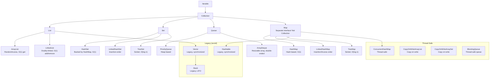

# Java Collections Framework — Complete Master Guide

## 0. Collection Topic Map — How Everything Connects

This master file gives you the **bird's-eye view**: hierarchy, interfaces, Big-O, when-to-use. Each sub-topic below is a **deep-dive** into one collection class — internal structure, source code analysis, edge cases, thread safety, and interview questions.

```mermaid
graph TD
    MASTER["📘 COLLECTIONS-MASTER.md<br/>Hierarchy · Interfaces · Big-O · When-to-Use"]
    MASTER --> ITER["📂 iterable-collection-iterator/<br/>Iterable vs Collection vs Iterator<br/>Fail-Fast vs Fail-Safe"]
    
    subgraph "List Implementations"
        MASTER --> AL["📂 arraylist/<br/>Resizable array · O(1) get<br/>1.5x growth · RandomAccess"]
        MASTER --> LL["📂 linkedlist/<br/>Doubly-linked · O(1) add/remove<br/>Also Deque & Queue"]
    end
    
    subgraph "Set Implementations"
        MASTER --> HS["📂 hashset/<br/>Backed by HashMap<br/>O(1) add/contains/remove"]
        MASTER --> TS["📂 treeset/<br/>Red-Black tree<br/>Sorted O(log n)"]
    end
    
    subgraph "Queue / Deque"
        MASTER --> PQ["📂 priorityqueue/<br/>Binary heap<br/>O(log n) offer/poll"]
        MASTER --> AD["📂 arraydeque/<br/>Circular array<br/>O(1) add/remove both ends"]
    end
    
    subgraph "Map Implementations"
        MASTER --> HM["📂 hashmap/<br/>Bucket array + tree<br/>O(1) average"]
        MASTER --> LHM["📂 linkedhashmap/<br/>Insertion/access order<br/>LRU cache base"]
    end
    
    subgraph "Concurrent Collections"
        MASTER --> CHM["📂 concurrenthashmap/<br/>Lock per bucket<br/>Lock-free reads"]
        MASTER --> COW["📂 copyonwritearraylist/<br/>Copy-on-write<br/>Thread-safe reads"]
        MASTER --> BQ["📂 blockingqueue/<br/>Producer-Consumer<br/>put()/take() block"]
    end
    
    subgraph "Reference & Advanced"
        MASTER --> SPECIAL["📂 special-collections-reference-types/<br/>WeakHashMap, IdentityHashMap<br/>EnumMap, EnumSet"]
        MASTER --> REMAINING["📂 remaining-collections/<br/>Stack, Vector, Hashtable<br/>Legacy classes to avoid"]
    end
    
    HM -.-> HS["HashSet uses HashMap as backing"]
    HM -.-> LHM["LinkedHashMap extends HashMap"]
    
    style MASTER fill:#e1f5fe,stroke:#01579b,stroke-width:2px
    style ITER fill:#f3e5f5,stroke:#7b1fa2
    style AL fill:#fff3e0,stroke:#e65100
    style LL fill:#fff3e0,stroke:#e65100
    style HS fill:#e8f5e9,stroke:#1b5e20
    style TS fill:#e8f5e9,stroke:#1b5e20
    style PQ fill:#fce4ec,stroke:#880e4f
    style AD fill:#fce4ec,stroke:#880e4f
    style HM fill:#fff8e1,stroke:#f57f17
    style LHM fill:#fff8e1,stroke:#f57f17
    style CHM fill:#e0f2f1,stroke:#004d40
    style COW fill:#e0f2f1,stroke:#004d40
    style BQ fill:#e0f2f1,stroke:#004d40
    style SPECIAL fill:#fafafa,stroke:#616161
    style REMAINING fill:#fafafa,stroke:#616161
```




### Quick Navigation — Links to Deep Dives

| # | Topic | File | What You'll Learn |
|---|-------|------|-------------------|
| 1 | **Iterable vs Collection vs Iterator** | [`iterable-collection-iterator/README.md`](./iterable-collection-iterator/README.md) | Iterator pattern, fail-fast vs fail-safe, ListIterator |
| 2 | **ArrayList** | [`arraylist/README.md`](./arraylist/README.md) | Resizable array, 1.5x growth, RandomAccess, subList |
| 3 | **LinkedList** | [`linkedlist/README.md`](./linkedlist/README.md) | Doubly-linked list, Deque/Queue dual nature |
| 4 | **HashMap** | [`hashmap/README.md`](./hashmap/README.md) | Bucket array → tree (Java 8+), hash computation, resize |
| 5 | **LinkedHashMap** | [`linkedhashmap/README.md`](./linkedhashmap/README.md) | Insertion/access order, LRU cache via removeEldestEntry |
| 6 | **HashSet** | [`hashset/README.md`](./hashset/README.md) | Backed by HashMap, deduplication via hashCode/equals |
| 7 | **TreeSet** | [`treeset/README.md`](./treeset/README.md) | Red-Black tree, sorted iteration, Comparable vs Comparator |
| 8 | **PriorityQueue** | [`priorityqueue/README.md`](./priorityqueue/README.md) | Binary heap, O(log n) offer/poll, heapify |
| 9 | **ArrayDeque** | [`arraydeque/README.md`](./arraydeque/README.md) | Circular array, double-ended, faster than LinkedList |
| 10 | **ConcurrentHashMap** | [`concurrenthashmap/README.md`](./concurrenthashmap/README.md) | Lock per bucket, lock-free reads, CAS operations |
| 11 | **CopyOnWriteArrayList** | [`copyonwritearraylist/README.md`](./copyonwritearraylist/README.md) | Copy-on-write, snapshot iterator, read-optimized |
| 12 | **BlockingQueue** | [`blockingqueue/README.md`](./blockingqueue/README.md) | Producer-consumer, put()/take() block, bounded/unbounded |
| 13 | **Special Collections** | [`special-collections-reference-types/README.md`](./special-collections-reference-types/README.md) | WeakHashMap, IdentityHashMap, EnumMap, EnumSet |
| 14 | **Remaining (Legacy)** | [`remaining-collections/README.md`](./remaining-collections/README.md) | Stack, Vector, Hashtable — why to avoid |

### How to Use This Collection

```
COLLECTIONS-MASTER.md  ← Start here for the big picture
│
├── iterable-collection-iterator/  ← Iterator fundamentals
│
├── arraylist/      ├── linkedlist/      ← List deep dives
├── hashmap/        ├── linkedhashmap/   ← Map deep dives
├── hashset/        ├── treeset/         ← Set deep dives
├── priorityqueue/  ├── arraydeque/      ← Queue/Deque deep dives
│
├── concurrenthashmap/                  ← Thread-safe Map
├── copyonwritearraylist/               ← Thread-safe List
├── blockingqueue/                      ← Thread-safe Queue
│
├── special-collections-reference-types/ ← Reference types
└── remaining-collections/               ← Legacy (avoid)
```

### Key Relationships Between Topics

| Parent Class | Uses/Extends | Impact on This Topic |
|-------------|-------------|---------------------|
| **ArrayList** | implements `List`, `RandomAccess` | Read `iterable-collection-iterator/` for iterator behavior |
| **LinkedList** | implements `List` + `Deque` + `Queue` | Compare with `arraylist/` for performance trade-offs |
| **HashMap** | bucket array + linked list + tree | Read `hashmap/` first, then `linkedhashmap/` (extends HashMap) |
| **HashSet** | backed by **HashMap** internally | Read `hashmap/` to understand how HashSet really works |
| **TreeSet** | backed by **TreeMap** internally | Sorted behavior, same as TreeMap with keys as elements |
| **ConcurrentHashMap** | similar structure to HashMap but thread-safe | Compare with `hashmap/` to understand concurrent vs non-concurrent |
| **PriorityQueue** | binary heap array | No relation to other queues — unique structure |
| **LinkedHashMap** | extends **HashMap** | Adds before/after pointers for iteration order |
| **CopyOnWriteArrayList** | thread-safe alternative to ArrayList | Compare with `arraylist/` for read vs write performance |

---

## 1. Hierarchy




**Key rule**: `Map` does NOT extend `Collection`. It's a separate top-level interface. But it's considered part of the Collections Framework.

## 2. Core Interfaces

```java
// Iterable — the root
public interface Iterable<T> {
    Iterator<T> iterator();          // Returns an iterator
    default void forEach(Consumer<? super T> action)  // Java 8
    default Spliterator<T> spliterator()              // Java 8
}

// Collection — the main interface
public interface Collection<E> extends Iterable<E> {
    int size();
    boolean isEmpty();
    boolean contains(Object o);
    Iterator<E> iterator();
    Object[] toArray();
    <T> T[] toArray(T[] a);
    boolean add(E e);
    boolean remove(Object o);
    boolean containsAll(Collection<?> c);
    boolean addAll(Collection<? extends E> c);
    boolean removeAll(Collection<?> c);
    boolean retainAll(Collection<?> c);
    void clear();
    // Java 8+ default methods: removeIf, stream, parallelStream
}

// List — ordered, allows duplicates
public interface List<E> extends Collection<E> {
    E get(int index);
    E set(int index, E element);
    void add(int index, E element);
    E remove(int index);
    int indexOf(Object o);
    int lastIndexOf(Object o);
    ListIterator<E> listIterator();
    List<E> subList(int fromIndex, int toIndex);
    // Spliterator: ORDERED | SIZED | SUBSIZED
}

// Set — no duplicates
public interface Set<E> extends Collection<E> {
    // Exactly same methods as Collection (no additions)
    // But contract: no duplicates, equals/hashCode-based
    // Spliterator: DISTINCT
}

// Queue — FIFO typically
public interface Queue<E> extends Collection<E> {
    boolean offer(E e);      // Insert (returns false if full, vs add() throws)
    E poll();                // Retrieve and remove head (null if empty)
    E remove();              // Retrieve and remove head (throws if empty)
    E peek();                // Retrieve head without removing (null if empty)
    E element();             // Retrieve head without removing (throws if empty)
}

// Map — key-value pairs (NOT a Collection)
public interface Map<K, V> {
    V put(K key, V value);
    V get(Object key);
    V remove(Object key);
    boolean containsKey(Object key);
    boolean containsValue(Object value);
    Set<K> keySet();
    Collection<V> values();
    Set<Map.Entry<K, V>> entrySet();
    int size();
    boolean isEmpty();
    void clear();
    // Java 8+: getOrDefault, putIfAbsent, computeIfAbsent, merge, forEach
}
```

## 3. Iterator vs Iterable

```java
// Iterable: can be used in foreach loop. Has iterator() method.
// Iterator: the actual cursor for traversing.

// Fail-Fast: ArrayList, HashMap iterators throw ConcurrentModificationException
// if the collection is structurally modified after the iterator is created.

// Fail-Safe: ConcurrentHashMap, CopyOnWriteArrayList iterators operate on a snapshot.
// They do NOT throw ConcurrentModificationException.

// ListIterator: extends Iterator. Adds previous(), set(), add().
```

## 4. Internal Implementations — Summary

| Class | Internal Structure | Get | Add | Remove | Contains | Memory |
|-------|-------------------|-----|-----|--------|----------|--------|
| **ArrayList** | `Object[]` array | O(1) | O(1)* | O(n) | O(n) | Low |
| **LinkedList** | Doubly-linked nodes | O(n) | O(1) | O(1) | O(n) | High |
| **HashMap** | `Node[]` + list/tree | O(1)** | O(1) | O(1) | O(1) | Medium |
| **LinkedHashMap** | `Node[]` + list + doubly-linked chain | O(1) | O(1) | O(1) | O(1) | Medium |
| **TreeMap** | Red-Black tree | O(log n) | O(log n) | O(log n) | O(log n) | Medium |
| **HashSet** | Backed by HashMap (key = element) | — | O(1) | O(1) | O(1) | Medium |
| **TreeSet** | Backed by TreeMap (key = element) | — | O(log n) | O(log n) | O(log n) | Medium |
| **PriorityQueue** | Binary heap (`Object[]`) | O(1) peek | O(log n) | O(log n) | O(n) | Low |
| **ArrayDeque** | `Object[]` circular array | O(1) | O(1) | O(1) | O(n) | Low |
| **ConcurrentHashMap** | `Node[]` + synchronized per bin | O(1) lock-free | O(1) | O(1) | O(1) | Medium |

* = amortized O(1) for ArrayList add (resize occasionally)
** = O(1) average, O(log n) worst-case (tree), O(n) worst-case (linked list before treeify)

## 5. When to Use What

| Scenario | Best Choice | Why |
|----------|-------------|-----|
| Fast index-based access | **ArrayList** | O(1) random access |
| Frequent add/remove at ends | **LinkedList** | O(1) add/remove at head/tail |
| Frequent add/remove near head | **ArrayDeque** | O(1), better cache locality than LinkedList |
| Key-value pairs, fast lookup | **HashMap** | O(1) average |
| Unique elements, no order | **HashSet** | O(1) contains |
| Sorted unique elements | **TreeSet** | Maintains sorted order |
| Insertion-order preservation | **LinkedHashSet/LinkedHashMap** | Predictable iteration |
| Thread-safe key-value | **ConcurrentHashMap** | Lock per bucket, lock-free reads |
| Thread-safe list (rare writes) | **CopyOnWriteArrayList** | No locks for readers |
| Producer-consumer | **BlockingQueue** | Thread-safe put/take |
| Priority-based processing | **PriorityQueue** | Natural ordering or Comparator |

## 6. The Complete Collection & Map Family

```java
// Java Collections Framework (all classes):

java.util
├── Collection (interface)
│   ├── List (interface)
│   │   ├── ArrayList
│   │   ├── LinkedList       (also implements Deque)
│   │   ├── Vector (legacy)
│   │   └── Stack (legacy, extends Vector)
│   ├── Set (interface)
│   │   ├── HashSet
│   │   │   └── LinkedHashSet
│   │   ├── TreeSet
│   │   └── EnumSet (bit vector)
│   ├── Queue (interface)
│   │   ├── PriorityQueue
│   │   └── Deque (interface)
│   │       ├── ArrayDeque
│   │       └── LinkedList
│   └── [CopyOnWriteArrayList] (concurrent)
│   └── [CopyOnWriteArraySet] (concurrent)
│   └── [BlockingQueue] (concurrent) — ArrayBlockingQueue, LinkedBlockingQueue, etc.
│
├── Map (interface, NOT a Collection!)
│   ├── HashMap
│   │   └── LinkedHashMap
│   ├── TreeMap
│   ├── Hashtable (legacy)
│   ├── WeakHashMap (keys with WeakReference)
│   ├── IdentityHashMap (== not equals)
│   ├── EnumMap (enum keys)
│   └── ConcurrentHashMap (concurrent)
│       └── ConcurrentSkipListMap (sorted concurrent)
│
├── Iterator (interface)
│   └── ListIterator (interface)
│
├── Comparable (interface) — natural ordering
├── Comparator (interface) — custom ordering
│
└── Collections (utility class, static methods)
    └── synchronizedList/Set/Map, unmodifiableList/Set/Map, checkedList/Set/Map
```

## 7. Collections Utility Class

```java
// The Collections class provides static utility methods:

List<String> list = new ArrayList<>();

// Wrapping for synchronization
List<String> syncList = Collections.synchronizedList(list);
Map<String, String> syncMap = Collections.synchronizedMap(new HashMap<>());

// Wrapping for immutability
List<String> unmodList = Collections.unmodifiableList(list);
// List.of() and Map.of() in Java 9+ create immutable collections directly

// Empty/unmodifiable singletons
List<String> empty = Collections.emptyList();
Set<String> single = Collections.singleton("only");
Map<String, String> singleMap = Collections.singletonMap("k", "v");

// Sorting and searching
Collections.sort(list);           // Must implement Comparable
Collections.sort(list, comparator);
int index = Collections.binarySearch(list, key);  // Must be sorted

// Other utilities
Collections.reverse(list);
Collections.shuffle(list);
Collections.rotate(list, 2);
Collections.min(list);
Collections.max(list);
Collections.frequency(list, "target");
Collections.disjoint(list1, list2);  // No common elements?
Collections.replaceAll(list, "old", "new");
```

## 8. Arrays Utility Class

```java
// The Arrays class provides static methods for arrays:

int[] arr = {5, 2, 8, 1, 9};
Arrays.sort(arr);                     // Dual-pivot Quicksort
Arrays.parallelSort(arr);             // Parallel sort (large arrays)
int index = Arrays.binarySearch(arr, 8);  // Must be sorted first
Arrays.fill(arr, 0);                  // Fill with value
Arrays.toString(arr);                 // "[1, 2, 5, 8, 9]"

// Convert array ↔ List
List<Integer> list = Arrays.asList(1, 2, 3);  // Fixed-size! Cannot add/remove!
int[] arr2 = list.stream().mapToInt(Integer::intValue).toArray();

// For primitive arrays
String[] strArr = {"a", "b"};
List<String> strList = Arrays.asList(strArr);   // Backed by array!
strList.set(0, "x");  // Also modifies strArr!
// strList.add("z");  // ❌ UnsupportedOperationException!
```

## 9. Sorting: Comparable vs Comparator

```java
// Comparable: natural ordering (String, Integer, etc.)
// Implement compareTo() — returns negative, 0, positive

class User implements Comparable<User> {
    private String name;
    private int age;
    
    @Override
    public int compareTo(User other) {
        return this.name.compareTo(other.name); // Alphabetical
    }
}
// Collections.sort(users)  // Uses compareTo()

// Comparator: custom ordering (multiple ways to sort)
// Java 8+ functional interface
Comparator<User> byAge = Comparator.comparingInt(User::getAge);
Comparator<User> byNameDesc = Comparator.comparing(User::getName).reversed();
Comparator<User> byAgeThenName = Comparator.comparingInt(User::getAge)
    .thenComparing(User::getName);
Collections.sort(users, byAge);
```

## 10. Common Mistakes

| Mistake | Problem | Fix |
|---------|---------|-----|
| Using `==` for object comparison in contains() | `==` checks reference, equals() checks content | Override equals() and hashCode() |
| Modifying collection during foreach loop | ConcurrentModificationException | Use iterator.remove() or removeIf() |
| Returning internal array/collection reference | Caller can modify internal state | Return copy or unmodifiable view |
| Forgetting to specify initial capacity for HashMap | Repeated resizing (costly) | `new HashMap<>(expectedSize / 0.75f + 1)` |
| Using ArrayList for frequent head insertions | O(n) per insertion (shifts elements) | Use LinkedList or ArrayDeque |
| Assuming HashMap iteration order | Unpredictable! | Use LinkedHashMap for predictable order |
| Using List.of() and then trying to modify | UnsupportedOperationException | It's immutable — use new ArrayList<>(List.of(...)) |

## 11. Final 30-Second Answer

**Hierarchy**: Iterable → Collection (List/Set/Queue) + separate Map interface. **ArrayList** = array O(1) get, **LinkedList** = doubly-linked O(1) add/remove at ends. **HashMap** = bucket array + linked list/tree on collision, O(1) average. **HashSet** = backed by HashMap. **TreeMap/TreeSet** = Red-Black tree O(log n). **ConcurrentHashMap** = lock per bucket, lock-free reads. **PriorityQueue** = binary heap. **ArrayDeque** = circular array. **Fail-fast** iterators throw on concurrent modification. **Comparable** vs **Comparator** for ordering. Never: modify collection during foreach, expose internal arrays, forget equals/hashCode for HashMap keys.