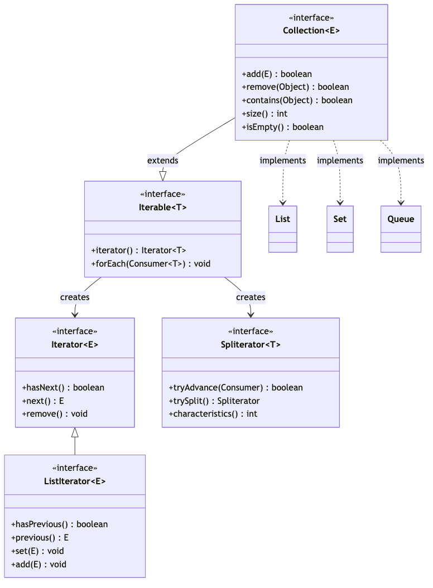
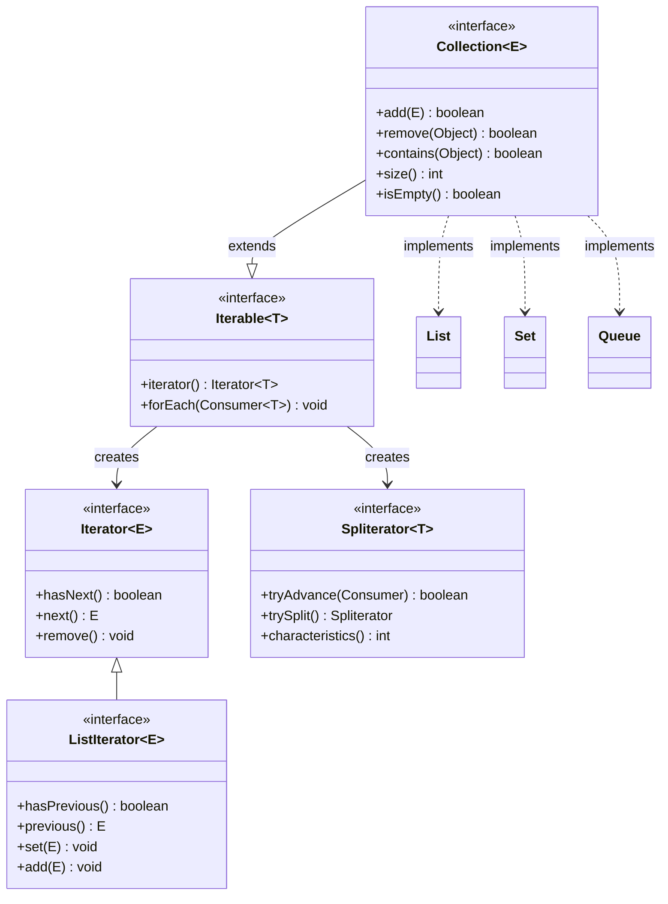

# Iterable, Collection, Iterator — Foundation of Collections Framework

## 1. Hierarchy Position






## 2. Iterable — The Root

```java
public interface Iterable<T> {
    Iterator<T> iterator();           // Returns iterator for traversal
    
    default void forEach(Consumer<? super T> action) {
        Objects.requireNonNull(action);
        for (T t : this) { action.accept(t); }
    }
    
    default Spliterator<T> spliterator() {
        return Spliterators.spliteratorUnknownSize(iterator(), 0);
    }
}
```

**Why Iterable exists**: Any class implementing Iterable can be used in the enhanced for-each loop: `for (T item : collection)`. The compiler desugars this to:
```java
// For-each loop:
for (String s : list) { System.out.println(s); }

// Compiler generates:
Iterator<String> it = list.iterator();
while (it.hasNext()) {
    String s = it.next();
    System.out.println(s);
}
```

## 3. Iterator — The Traversal Mechanism

```java
public interface Iterator<E> {
    boolean hasNext();      // Are there more elements?
    E next();               // Return next element (throws NoSuchElementException if none)
    
    default void remove() { throw new UnsupportedOperationException(); }
                          // Removes last element returned by next() (ONLY once per next)
    
    default void forEachRemaining(Consumer<? super E> action) {
        Objects.requireNonNull(action);
        while (hasNext()) action.accept(next());
    }
}
```

**ListIterator** — extends Iterator for List traversal:
```java
public interface ListIterator<E> extends Iterator<E> {
    boolean hasPrevious();
    E previous();
    int nextIndex();
    int previousIndex();
    void set(E e);     // Replaces last element returned by next/previous
    void add(E e);     // Inserts element at current position
}
```

### Fail-Fast vs Fail-Safe

```java
// FAIL-FAST (most collections — ArrayList, HashMap, HashSet):
// Maintains a modCount field. Iterator stores expectedModCount at creation.
// On each next()/remove(), checks: if modCount != expectedModCount → ConcurrentModificationException

// JDK ArrayList.Itr source (simplified):
private class Itr implements Iterator<E> {
    int expectedModCount = modCount;  // Snapshot at iterator creation
    
    public E next() {
        checkForComodification();     // Throws if list was modified externally
        // ... normal traversal
    }
    
    final void checkForComodification() {
        if (modCount != expectedModCount)
            throw new ConcurrentModificationException();
    }
}

// FAIL-SAFE (ConcurrentHashMap, CopyOnWriteArrayList):
// Iterator operates on a SNAPSHOT of the data at creation time.
// Structural modifications do NOT throw exceptions.
// But the iterator WON'T see the modifications either!

ConcurrentHashMap<String, String> map = new ConcurrentHashMap<>();
map.put("a", "1");
Iterator<String> it = map.keySet().iterator();
map.put("b", "2");  // Concurrent modification!
while (it.hasNext()) {
    it.next();  // Works fine! No exception.
    // But may or may not see "b" depending on implementation
}
```

### Tricky Iterator Questions

```java
// Q1: Can you remove an element from a collection while iterating?
List<String> list = new ArrayList<>(List.of("A", "B", "C"));

// WRONG — ConcurrentModificationException!
for (String s : list) {
    if (s.equals("B")) list.remove(s);  // ❌
}

// RIGHT — use iterator.remove()
Iterator<String> it = list.iterator();
while (it.hasNext()) {
    String s = it.next();
    if (s.equals("B")) it.remove();  // ✅
}

// Also RIGHT — Java 8 removeIf()
list.removeIf(s -> s.equals("B"));   // ✅ Uses iterator internally

// Q2: Can you call remove() twice without calling next()?
Iterator<String> it = list.iterator();
it.next();          // Returns "A"
it.remove();        // Removes "A" (OK)
it.remove();        // ❌ IllegalStateException! No element to remove

// Q3: Can you modify a List while iterating with ListIterator?
ListIterator<String> lit = list.listIterator();
lit.next();           // "A"
lit.set("X");         // Replaces "A" with "X" — NOT a structural modification, OK
lit.add("Y");         // Inserts "Y" at current position — structural mod, but ListIterator handles it
```

## 4. Collection Interface — Bulk Operations

```java
public interface Collection<E> extends Iterable<E> {
    // Query operations
    int size();
    boolean isEmpty();
    boolean contains(Object o);
    
    // Modification operations
    boolean add(E e);
    boolean remove(Object o);
    
    // Bulk operations
    boolean containsAll(Collection<?> c);
    boolean addAll(Collection<? extends E> c);
    boolean removeAll(Collection<?> c);   // Set-like subtraction
    boolean retainAll(Collection<?> c);   // Set-like intersection
    void clear();
    
    // Array operations
    Object[] toArray();
    <T> T[] toArray(T[] a);              // Type-safe version
    
    // Java 8+ default methods
    default boolean removeIf(Predicate<? super E> filter)
    default Stream<E> stream()
    default Stream<E> parallelStream()
}
```

## 5. Common Mistakes & Questions

```java
// Q: Arrays.asList() — fixed size!
String[] arr = {"A", "B", "C"};
List<String> list = Arrays.asList(arr);
list.set(0, "X");   // ✅ Also modifies arr[0]
// list.add("D");   // ❌ UnsupportedOperationException! (fixed-size view)

// Q: List.of() — immutable!
List<String> list2 = List.of("A", "B", "C");
// list2.set(0, "X");  // ❌ UnsupportedOperationException

// Q: Converting array to mutable list:
List<String> mutable = new ArrayList<>(List.of("A", "B", "C"));

// Q: subList() is a VIEW, not a copy!
List<String> original = new ArrayList<>(List.of("A", "B", "C", "D"));
List<String> sub = original.subList(1, 3);  // ["B", "C"]
sub.set(0, "X");      // Also modifies original[1]!
original.add("E");    // ❌ ConcurrentModificationException on sub! (modCount mismatch)
// sub is backed by original — structural modification of original invalidates sub
```

## 6. Spliterator — The Modern Iterator

```java
// Spliterator = Splittable Iterator. Used by Streams API for parallel processing.
// Characteristics: ORDERED, DISTINCT, SORTED, SIZED, NONNULL, IMMUTABLE, CONCURRENT, SUBSIZED

List<String> list = new ArrayList<>(List.of("A", "B", "C", "D"));
Spliterator<String> spl1 = list.spliterator();   // characteristics: ORDERED | SIZED | SUBSIZED
Spliterator<String> spl2 = spl1.trySplit();       // Split for parallel processing
// spl1: ["A", "B"]
// spl2: ["C", "D"]
```

## 7. Final 30-Second Answer

**Iterable**: root interface, enables foreach. **Iterator**: cursor for traversal (hasNext, next, remove). **Fail-fast**: ArrayList/HashMap iterators throw ConcurrentModificationException if structurally modified during iteration — checks modCount. **Fail-safe**: ConcurrentHashMap/CopyOnWriteArrayList use snapshot — no exception, but don't see concurrent modifications. **ListIterator**: bidirectional List traversal with set/add. **Spliterator**: splits data for parallel stream processing. Never: remove during foreach (use iterator.remove() or removeIf), modify original after calling subList(), call remove() twice without next().