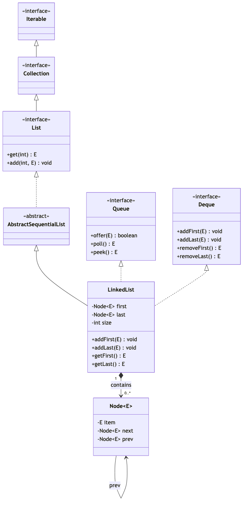
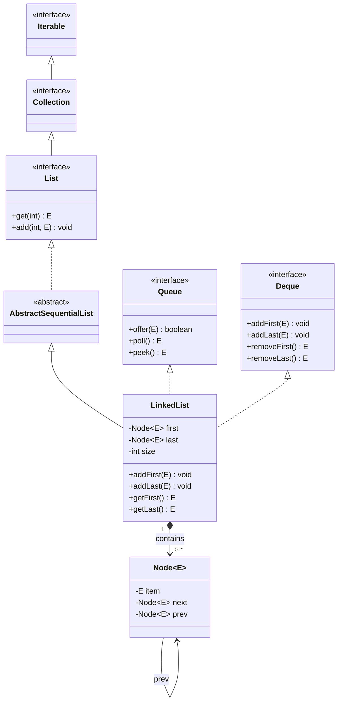
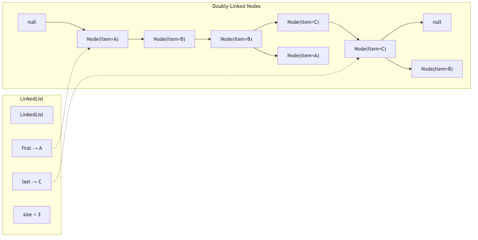
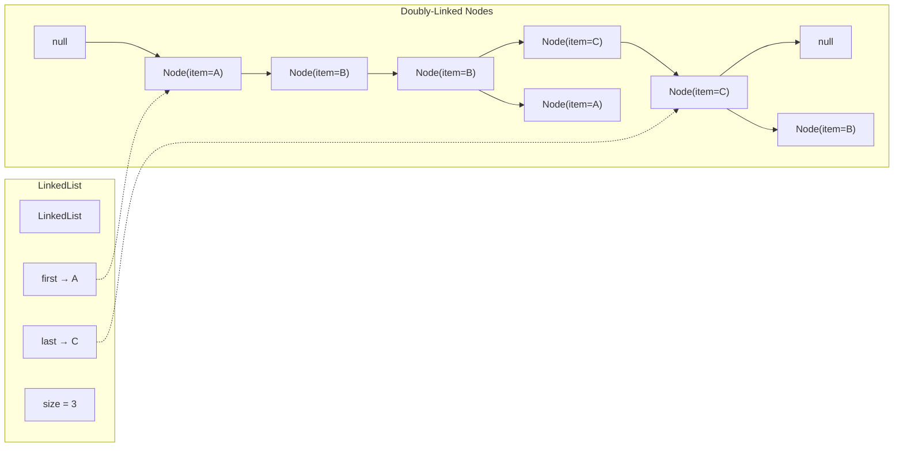

# LinkedList — Complete Deep Dive

## 1. Hierarchy & Position






**Implements**: `List<E>`, `Deque<E>`, `Queue<E>`, `Cloneable`, `Serializable`
**Extends**: `AbstractSequentialList<E>`

### Internal Node Structure






LinkedList is unique — it's both a **List** (indexed access) AND a **Deque** (double-ended queue).

## 2. Internal Structure — Doubly-Linked List

```java
public class LinkedList<E> extends AbstractSequentialList<E>
        implements List<E>, Deque<E>, Cloneable, java.io.Serializable {

    transient int size = 0;          // Current number of elements
    
    // Pointer to first node
    transient Node<E> first;
    
    // Pointer to last node  
    transient Node<E> last;
    
    // Internal Node class:
    private static class Node<E> {
        E item;                      // The actual data
        Node<E> next;                // Pointer to next node
        Node<E> prev;                // Pointer to previous node
        
        Node(Node<E> prev, E element, Node<E> next) {
            this.item = element;
            this.next = next;
            this.prev = prev;
        }
    }
}
```

**Memory layout**: Each node is a separate object on the heap.
```
head (first)
  ↓
┌───────────┐    ┌───────────┐    ┌───────────┐
│ prev=null  │    │ prev      │──→ │ prev      │
│ item="A"   │ ←──│ item="B"  │ ←──│ item="C"  │
│ next───────│──→ │ next──────│──→ │ next=null │
└───────────┘    └───────────┘    └───────────┘
                                        ↑
                                      tail (last)
```

## 3. Memory Footprint

Each Node object has significant overhead:
- Object header: 12-16 bytes (JVM dependent)
- `item` reference: 4-8 bytes (compressed OOPs vs regular)
- `next` reference: 4-8 bytes
- `prev` reference: 4-8 bytes
- Padding to 8-byte alignment

**Total per element: ~32-40 bytes** (vs ArrayList's 4 bytes per reference)

For 1 million elements: LinkedList ≈ 32-40 MB vs ArrayList ≈ 4 MB

## 4. Add Operations

### addLast(E e) — O(1)

```java
// Both add(E) and addLast(E) use the same logic
public boolean add(E e) { linkLast(e); return true; }
public void addLast(E e) { linkLast(e); }

void linkLast(E e) {
    final Node<E> l = last;           // Current last node (may be null)
    final Node<E> newNode = new Node<>(l, e, null);  // prev = old last, next = null
    last = newNode;                   // New node becomes last
    
    if (l == null)
        first = newNode;              // First element — also set head
    else
        l.next = newNode;             // Old last points forward to new node
    
    size++;
    modCount++;
}
```

### addFirst(E e) — O(1)

```java
public void addFirst(E e) {
    linkFirst(e);
}

private void linkFirst(E e) {
    final Node<E> f = first;
    final Node<E> newNode = new Node<>(null, e, f);  // prev = null, next = old first
    first = newNode;
    
    if (f == null)
        last = newNode;               // First element — also set tail
    else
        f.prev = newNode;             // Old first points backward to new node
    
    size++;
    modCount++;
}
```

### add(index, E) — O(n)

```java
public void add(int index, E element) {
    checkPositionIndex(index);
    
    if (index == size)
        linkLast(element);             // Add at end — O(1)
    else
        linkBefore(element, node(index));  // Add before existing node — O(n) for node()
}

// node(index) — the O(n) traversal:
Node<E> node(int index) {
    // Optimize: search from whichever end is closer
    if (index < (size >> 1)) {         // First half — start from head
        Node<E> x = first;
        for (int i = 0; i < index; i++)
            x = x.next;
        return x;
    } else {                            // Second half — start from tail
        Node<E> x = last;
        for (int i = size - 1; i > index; i--)
            x = x.prev;
        return x;
    }
}
```

## 5. Get Operation — O(n)

```java
public E get(int index) {
    checkElementIndex(index);
    return node(index).item;           // node(index) traverses from head or tail
}
```

## 6. Remove Operations

### removeFirst() — O(1)

```java
public E removeFirst() {
    final Node<E> f = first;
    if (f == null) throw new NoSuchElementException();
    return unlinkFirst(f);
}

private E unlinkFirst(Node<E> f) {
    final E element = f.item;
    final Node<E> next = f.next;
    f.item = null;
    f.next = null;                      // Help GC — clean the old first node
    first = next;
    
    if (next == null)
        last = null;                    // List is now empty
    else
        next.prev = null;               // New first has no prev
    
    size--;
    modCount++;
    return element;
}
```

### remove(index) — O(n)

```java
public E remove(int index) {
    checkElementIndex(index);
    return unlink(node(index));          // O(n) for node() + O(1) for unlink
}

E unlink(Node<E> x) {
    final E element = x.item;
    final Node<E> next = x.next;
    final Node<E> prev = x.prev;
    
    if (prev == null)   first = next;    // Removing head
    else {  prev.next = next;  x.prev = null;  }  // Bypass forward
    
    if (next == null)   last = prev;     // Removing tail
    else {  next.prev = prev;  x.next = null;  }  // Bypass backward
    
    x.item = null;                       // Help GC
    size--;
    modCount++;
    return element;
}
```

## 7. Queue/Deque Operations

```java
// Queue operations (FIFO):
offer(e)    → addLast(e)     // Insert at tail
poll()      → removeFirst()  // Remove from head (null if empty)
peek()      → getFirst()     // View head (null if empty)

// Deque operations (double-ended):
addFirst(e)  → linkFirst(e)
addLast(e)   → linkLast(e)
removeFirst() → unlinkFirst()
removeLast()  → unlinkLast()
getFirst()   → first.item (throws if empty)
getLast()    → last.item (throws if empty)
```

## 8. LinkedList vs ArrayList — Deep Comparison

| Aspect | LinkedList | ArrayList |
|--------|-----------|-----------|
| Internal | Doubly-linked nodes | Object[] array |
| get(i) | **O(n)** — traverses from head/tail | **O(1)** — direct array index |
| add(E) at end | **O(1)** | **O(1)** amortized |
| add(index) mid | **O(n)** — node() + O(1) link | **O(n)** — O(1) arraycopy |
| addFirst | **O(1)** | **O(n)** — shift all |
| remove(index) | **O(n)** — node() + O(1) unlink | **O(n)** — shift elements |
| remove(Object) | **O(n)** — linear scan + O(1) unlink | **O(n)** — linear scan + O(n) shift |
| Memory per element | **~32-40 bytes** (Node object) | **4 bytes** (reference in array) |
| Memory for 1M elems | **~32-40 MB** | **~4 MB** |
| Cache locality | **Very poor** (nodes scattered) | **Excellent** (contiguous array) |
| RandomAccess marker | No | Yes |

**When does LinkedList actually win?**
- **Frequent head insertions/removals** (as a queue/stack): O(1) vs ArrayList's O(n)
- **Large lists with mostly head/tail operations**: as a Deque
- **When you need both List and Queue/Deque capabilities**: single class handles both

**But**: In practice, ArrayDeque almost always beats LinkedList for queue/stack use cases (better cache locality, lower memory).

## 9. Tricky Interview Questions

**Q1: Why does Java's LinkedList use a doubly-linked list instead of singly-linked?**
```java
// Doubly-linked enables:
// 1. Reverse traversal (descendingIterator(), previous())
// 2. O(1) removeLast()
// 3. O(1) addFirst() + addLast()
// 4. node(index) optimization — can traverse from either end
```

**Q2: Can LinkedList have null elements?**
```java
LinkedList<String> list = new LinkedList<>();
list.add(null);       // ✅ Allowed — item field can be null
list.addFirst(null);  // ✅ Allowed
// Null elements work fine since Node objects always exist, item is just null
```

**Q3: Why does LinkedList implement both List and Deque?**
```java
// This is Java's design choice to have a single class serve both roles.
// But it has tradeoffs:
// - Deque implementations (ArrayDeque) are better as queues
// - List implementations (ArrayList) are better for indexed access
// LinkedList does neither optimally, but does both adequately.
// Generally: prefer specialized classes over general-purpose ones.
```

**Q4: What happens to LinkedList's memory when you clear() it?**
```java
public void clear() {
    for (Node<E> x = first; x != null; ) {
        Node<E> next = x.next;
        x.item = null;
        x.next = null;     // Break all links
        x.prev = null;
        x = next;
    }
    first = last = null;
    size = 0;
    modCount++;
}
// ALL nodes become unreachable → GC collects them
// Without clearing prev/next, old nodes would still be connected (memory leak)
```

## 10. When to Actually Use LinkedList in Production

```java
// 1. As a FIFO Queue (but ArrayDeque is better)
Queue<String> queue = new LinkedList<>();   // OK but ArrayDeque is preferred

// 2. As a Deque (but ArrayDeque is better)
Deque<String> deque = new LinkedList<>();   // OK but ArrayDeque is preferred

// 3. As a List where you modify both ends frequently
List<String> list = new LinkedList<>();     // Rarely the best choice

// 4. Historical / legacy code compatibility

// Generally: DON'T use LinkedList for new code
// - ArrayList for list operations
// - ArrayDeque for queue/stack/deque operations
// - LinkedList is a jack-of-all-trades, master of none
```

## 11. Final 30-Second Answer

LinkedList = doubly-linked list (Node objects with prev/next pointers). **add/remove at ends**: O(1). **get(index)**: O(n) — traverses from head or tail (optimized: starts from closer end). **add/remove at index**: O(n) for traversal + O(1) for link/unlink. **Memory**: ~32-40 bytes per element (Node object overhead). **No RandomAccess** marker. Implements both List and Deque. In practice: use ArrayList for lists, ArrayDeque for queues/stacks. LinkedList is rarely the best choice — it's a generalist that doesn't excel at either role.