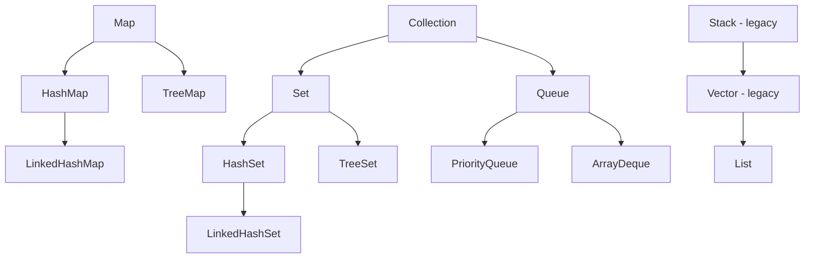

# LinkedHashMap, HashSet, TreeMap, TreeSet, PriorityQueue, ArrayDeque — Complete Deep Dive

## 0. Collection Hierarchy Map




## 1. LinkedHashMap

**Hierarchy**: `HashMap` → `LinkedHashMap`  
**Implements**: `Map<K,V>` — insertion order OR access order

### Internal Structure

```java
public class LinkedHashMap<K,V> extends HashMap<K,V> implements Map<K,V> {
    // Doubly-linked list running through all entries (preserves order)
    transient LinkedHashMap.Entry<K,V> head;  // Oldest entry
    transient LinkedHashMap.Entry<K,V> tail;  // Newest entry
    
    // true = access-order (LRU cache), false = insertion-order (default)
    final boolean accessOrder;
    
    // Entry extends HashMap.Node with before/after pointers
    static class Entry<K,V> extends HashMap.Node<K,V> {
        Entry<K,V> before, after;  // Linked list pointers (separate from bucket chain!)
    }
}
```

**Two modes:**
- **Insertion-order** (default): iteration returns entries in insertion order
- **Access-order** (accessOrder=true): iteration returns entries in most-recently-accessed order. Used for **LRU cache**.

```java
// Insertion order (default):
Map<String, String> map = new LinkedHashMap<>();
map.put("a", "1"); map.put("b", "2"); map.put("c", "3");
// Iteration: a → b → c (insertion order preserved)

// Access order (LRU):
Map<String, String> lru = new LinkedHashMap<>(16, 0.75f, true);
lru.put("a", "1"); lru.put("b", "2"); lru.put("c", "3");
lru.get("a");  // "a" becomes most recent
// Iteration: b → c → a (access order)
```

### LRU Cache Implementation

```java
class LRUCache<K,V> extends LinkedHashMap<K,V> {
    private final int maxCapacity;
    
    public LRUCache(int capacity) {
        super(capacity, 0.75f, true);  // access-order = true
        this.maxCapacity = capacity;
    }
    
    // Called after every put(). Returns true → removes eldest entry
    @Override
    protected boolean removeEldestEntry(Map.Entry<K,V> eldest) {
        return size() > maxCapacity;
    }
}

LRUCache<String, String> cache = new LRUCache<>(3);
cache.put("a", "1"); cache.put("b", "2"); cache.put("c", "3");
cache.get("a");  // "a" becomes most recently used
cache.put("d", "4");  // Removes "b" (eldest = least recently used)
// cache = {c=3, a=1, d=4}
```

### LinkedHashMap vs HashMap

| Aspect | HashMap | LinkedHashMap |
|--------|---------|---------------|
| Iteration order | Unpredictable | Insertion-order or access-order |
| Performance | Slightly faster | ~5% slower (maintains linked list) |
| Memory | Less | More (before/after pointers) |
| LRU cache | Not possible | Built-in with accessOrder=true |
| Use when | Order doesn't matter | Order matters + LRU cache |

---

## 2. HashSet

**Hierarchy**: `AbstractSet` → `HashSet`  
**Backed by**: `HashMap<E, Object>` (keys are set elements, values are a shared PRESENT object)

### Internal Structure

```java
public class HashSet<E> extends AbstractSet<E> implements Set<E> {
    // Backed by HashMap
    private transient HashMap<E,Object> map;
    
    // Shared dummy value for all map entries
    private static final Object PRESENT = new Object();
    
    public boolean add(E e) {
        return map.put(e, PRESENT) == null;  // null = didn't exist before
    }
    
    public boolean remove(Object o) {
        return map.remove(o) == PRESENT;
    }
    
    public boolean contains(Object o) {
        return map.containsKey(o);
    }
    
    public int size() { return map.size(); }
    public void clear() { map.clear(); }
}
```

**Key facts:**
- No duplicates allowed (uses equals() + hashCode() via HashMap)
- One null allowed (HashMap supports one null key)
- NOT thread-safe
- Iteration order is UNPREDICTABLE (follows HashMap's bucket iteration)
- **O(1)** average for add, remove, contains

**LinkedHashSet** = HashSet + LinkedHashMap (maintains insertion order)

---

## 3. TreeMap & TreeSet

**Hierarchy**: `AbstractMap` → `TreeMap`  
**Implements**: `NavigableMap<K,V>` (submap, headMap, tailMap)  
**Internal**: **Red-Black tree** — self-balancing binary search tree

### Red-Black Tree Properties

```java
// Properties that guarantee O(log n) operations:
// 1. Every node is either RED or BLACK
// 2. Root is always BLACK
// 3. If a node is RED, both children are BLACK (no consecutive REDs)
// 4. For any node, all paths to leaves have the SAME number of BLACK nodes
// 5. Leaves (null) are BLACK
```

**Internal structure:**
```java
static final class Entry<K,V> implements Map.Entry<K,V> {
    K key;
    V value;
    Entry<K,V> left;    // Left child (smaller keys)
    Entry<K,V> right;   // Right child (larger keys)
    Entry<K,V> parent;  // Parent node
    boolean color = BLACK;  // RED or BLACK
}
```

### TreeMap Operations

```java
TreeMap<String, Integer> map = new TreeMap<>();
map.put("b", 2); map.put("a", 1); map.put("c", 3);

// Sorted iteration:
map.keySet();         // [a, b, c] (natural order)
map.descendingMap();  // {c=3, b=2, a=1}

// Range views:
map.subMap("a", "c");     // {a=1, b=2}  (exclusive end)
map.headMap("b");          // {a=1}      (keys < "b")
map.tailMap("b");          // {b=2, c=3} (keys >= "b")

// Navigation:
map.firstKey();     // "a"
map.lastKey();      // "c"
map.lowerKey("b");  // "a" (strictly less)
map.higherKey("b"); // "c" (strictly greater)
map.floorKey("b");  // "b" (less or equal)
map.ceilingKey("b");// "b" (greater or equal)
```

### TreeSet = TreeMap (keys only)

```java
public class TreeSet<E> extends AbstractSet<E> implements NavigableSet<E> {
    private transient NavigableMap<E,Object> m;
    private static final Object PRESENT = new Object();
    
    public TreeSet() { this(new TreeMap<>()); }
    public boolean add(E e) { return m.put(e, PRESENT) == null; }
}
```

### TreeMap vs HashMap

| Aspect | HashMap | TreeMap |
|--------|---------|---------|
| Internal | Hash table | Red-Black tree |
| Put/Get | **O(1)** average | **O(log n)** |
| Order | Unpredictable | **Sorted** (natural/comparator) |
| Null key | Allowed (one) | **NOT allowed** (compareTo throws NPE) |
| Null value | Allowed | Allowed |
| Range queries | Not possible | subMap, headMap, tailMap |
| Memory | Less | More (parent/left/right/color) |
| When to use | Fast lookups, order doesn't matter | Sorted data, range queries |

---

## 4. PriorityQueue

**Hierarchy**: `AbstractQueue` → `PriorityQueue`  
**Internal**: **Binary heap** (stored in Object[] array)

### Internal Structure

```java
public class PriorityQueue<E> extends AbstractQueue<E> {
    transient Object[] queue;  // Binary heap array
    private int size = 0;      // Current number of elements
    private final Comparator<? super E> comparator;  // null = natural order
    
    // DEFAULT_INITIAL_CAPACITY = 11
}

// Heap property: parent <= children (min-heap)
// queue[n]'s children: queue[2*n+1] and queue[2*(n+1)]
// queue[n]'s parent: queue[(n-1)/2]
```

**Binary heap visualization for [5, 3, 8, 1, 9]:**
```
        1 (min)         ← queue[0]
      /   \
     3     8            ← queue[1], queue[2]
   /  \
  5    9                ← queue[3], queue[4]
```

### Add (offer) — O(log n)

```java
public boolean offer(E e) {
    int i = size;
    if (i >= queue.length) grow(i + 1);  // Grow if needed
    size = i + 1;
    if (i == 0)
        queue[0] = e;          // First element
    else
        siftUp(i, e);           // Bubble up
    return true;
}

private void siftUp(int k, E x) {
    while (k > 0) {
        int parent = (k - 1) >>> 1;  // (k-1)/2
        Object e = queue[parent];
        if (comparator.compare(x, (E) e) >= 0) break;  // Heap property satisfied
        queue[k] = e;   // Move parent down
        k = parent;
    }
    queue[k] = x;  // Insert x at correct position
}
```

### Remove (poll) — O(log n)

```java
public E poll() {
    if (size == 0) return null;
    int s = --size;
    E result = (E) queue[0];          // Min element
    E x = (E) queue[s];               // Last element
    queue[s] = null;                   // Clear for GC
    if (s != 0) siftDown(0, x);       // Bubble down
    return result;
}

private void siftDown(int k, E x) {
    int half = size >>> 1;
    while (k < half) {
        int child = (k << 1) + 1;     // Left child
        Object c = queue[child];
        int right = child + 1;
        if (right < size && comparator.compare((E) c, (E) queue[right]) > 0)
            c = queue[child = right];  // Choose smaller child
        if (comparator.compare(x, (E) c) <= 0) break;  // Heap property satisfied
        queue[k] = c;  // Move child up
        k = child;
    }
    queue[k] = x;
}
```

### Key Facts

- **NOT thread-safe**: Use `PriorityBlockingQueue` for concurrent access
- **Ordering**: Natural order or Comparator — NOT FIFO
- **Null elements**: NOT allowed
- **Iteration**: NOT in priority order! Must poll() repeatedly to get sorted order
- **Time**: offer O(log n), poll O(log n), peek O(1), remove(Object) O(n)

---

## 5. ArrayDeque

**Hierarchy**: `AbstractCollection` → `ArrayDeque`  
**Implements**: `Deque<E>`, `Queue<E>`, `Cloneable`, `Serializable`  
**Internal**: **Circular array** (resizable)

### Internal Structure

```java
public class ArrayDeque<E> extends AbstractCollection<E> implements Deque<E> {
    transient Object[] elements;  // Circular buffer (always power of 2)
    transient int head;            // Index of first element
    transient int tail;            // Index where next element will be inserted
    
    // DEFAULT_CAPACITY = 16 (nearest power of 2)
    // MIN_INITIAL_CAPACITY = 8
}
```

**Circular array visualization:**
```
Initial: head=0, tail=0, elements=[null, null, null, null] (capacity 4)

addLast("a"): elements=["a", null, null, null], head=0, tail=1
addLast("b"): elements=["a", "b", null, null], head=0, tail=2
addFirst("c"): elements=["a", "b", null, "c"], head=3, tail=2 (wrapped!)
```

### Key Operations — All O(1)

```java
// Head operations (O(1) — no shifting like ArrayList):
public void addFirst(E e) {
    head = (head - 1) & (elements.length - 1);  // Circular decrement
    elements[head] = e;
}

public E pollFirst() {
    int h = head;
    E result = (E) elements[h];
    if (result != null) {
        elements[h] = null;
        head = (h + 1) & (elements.length - 1);  // Circular increment
    }
    return result;
}

// Tail operations (O(1)):
public void addLast(E e) {
    elements[tail] = e;
    tail = (tail + 1) & (elements.length - 1);  // Circular increment
    if (tail == head) doubleCapacity();  // Array full → double
}
```

### ArrayDeque vs LinkedList vs Stack

| Aspect | ArrayDeque | LinkedList | Stack |
|--------|-----------|------------|-------|
| Internal | Circular array | Doubly-linked | Array (Vector) |
| Push/Pop | **O(1)** | **O(1)** | O(1) |
| Memory | Low (references only) | High (Node objects) | Low |
| Cache locality | **Excellent** (contiguous array) | Poor (scattered nodes) | Excellent |
| Thread-safe | No | No | Yes (legacy) |
| Use as Stack | **✅ Preferred** | OK (but slower) | ❌ Legacy |

**Why ArrayDeque beats Stack:**
```java
// Old way (legacy — DO NOT USE):
Stack<String> stack = new Stack<>();
stack.push("a");
stack.pop();     // Vector is synchronized = slow

// Modern way (PREFERRED):
Deque<String> stack = new ArrayDeque<>();
stack.push("a");
stack.pop();     // No synchronization = fast
```

---

## 6. Performance Summary

| Class | add | get/contains | remove | Iteration | Memory |
|-------|-----|-------------|--------|-----------|--------|
| ArrayList | O(1)* | O(1) get | O(n) | O(n) | Low |
| LinkedList | O(1) | O(n) get | O(1) ends | O(n) | High |
| HashMap | O(1) | O(1) | O(1) | O(cap) | Medium |
| LinkedHashMap | O(1) | O(1) | O(1) | O(n) | Medium+ |
| TreeMap | O(log n) | O(log n) | O(log n) | O(n) | Medium+ |
| HashSet | O(1) | O(1) | O(1) | O(cap) | Medium |
| TreeSet | O(log n) | O(log n) | O(log n) | O(n) | Medium+ |
| PriorityQueue | O(log n) | O(n) | O(log n) top | O(n log n) sorted | Low |
| ArrayDeque | O(1) | O(n) | O(1) ends | O(n) | Low |
| ConcurrentHashMap | O(1) | O(1) | O(1) | O(cap) | Medium |

* = amortized

## 7. Final 30-Second Answer

**LinkedHashMap**: HashMap + doubly-linked list. Insertion-order (default) or access-order (LRU cache). `removeEldestEntry()` for auto-eviction. **HashSet**: backed by HashMap (keys only, shared PRESENT value). **TreeMap/TreeSet**: Red-Black tree, O(log n), sorted order, range queries (subMap/headMap/tailMap). **PriorityQueue**: binary min-heap array, O(log n) offer/poll, O(1) peek, NOT sorted iteration (must poll). **ArrayDeque**: circular array, O(1) add/remove both ends, best Stack/Queue implementation, better than LinkedList and legacy Stack.