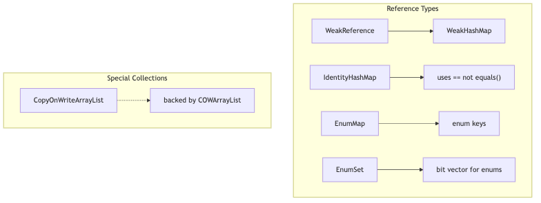
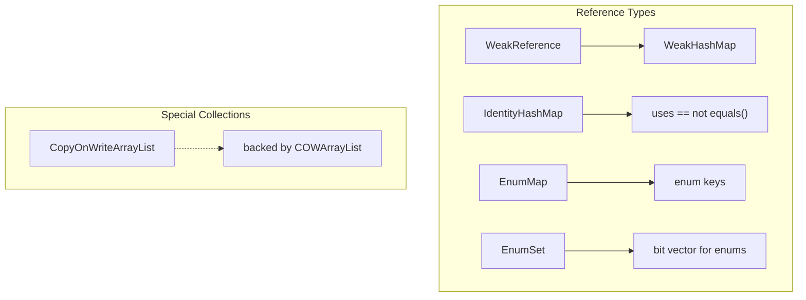

# CopyOnWriteArrayList, WeakHashMap, IdentityHashMap, EnumMap & Reference Types

## 0. Reference Types Hierarchy






## 1. CopyOnWriteArrayList

**Hierarchy**: `List` → `CopyOnWriteArrayList`  
**Internal**: array that is **copied on every write** (add, set, remove)  
**Thread-safety**: Fully thread-safe — **no locks for readers**

### Internal Structure

```java
public class CopyOnWriteArrayList<E> implements List<E>, RandomAccess, Cloneable, Serializable {
    
    // The single array — volatile for visibility
    private transient volatile Object[] array;
    
    // All mutative operations (add, set, remove) do:
    // 1. Take a lock (ReentrantLock)
    // 2. Copy the entire array to a NEW array
    // 3. Modify the new array
    // 4. Set the new array as the active array (volatile write)
    // 5. Release lock
    
    public boolean add(E e) {
        final ReentrantLock lock = this.lock;
        lock.lock();
        try {
            Object[] elements = getArray();
            int len = elements.length;
            Object[] newElements = Arrays.copyOf(elements, len + 1); // COPY!
            newElements[len] = e;
            setArray(newElements);  // Volatile write — makes visible to readers
            return true;
        } finally {
            lock.unlock();
        }
    }
    
    // get() is lock-free! No synchronization needed
    public E get(int index) {
        return get(getArray(), index);  // Volatile read of array reference
    }
    
    // Iterator operates on a SNAPSHOT — never throws ConcurrentModificationException
    public Iterator<E> iterator() {
        // Creates an iterator on the CURRENT array (snapshot)
        return new COWIterator<E>(getArray(), 0);
    }
}
```

### When to Use CopyOnWriteArrayList

```java
// GOOD USE CASE: Read-heavy, write-rare lists
// Example: Event listeners, configuration lists, plugin registrations
CopyOnWriteArrayList<EventListener> listeners = new CopyOnWriteArrayList<>();

// Many threads READ (iterate) simultaneously:
for (EventListener listener : listeners) {  // NO lock needed!
    listener.onEvent(event);
}

// Rarely WRITE (add/remove):
listeners.add(new EmailListener());  // Expensive (copies array), but rare

// BAD USE CASE: Frequent writes
// Each add() copies the entire array — O(n) per write
// With 10K elements and 100 writes/sec → performance disaster!
```

### Performance Characteristics

| Operation | CopyOnWriteArrayList | ArrayList (sync) | LinkedList (sync) |
|-----------|---------------------|-----------------|-------------------|
| get(i) | O(1) — **lock-free** | O(1) — locked | O(n) — locked |
| add(E) | **O(n)** — copies entire array | O(1)* — locked | O(1) — locked |
| add(i,E) | O(n) — copy + shift | O(n) — locked + shift | O(n) — locked |
| remove(i) | O(n) — copy | O(n) — locked + shift | O(n) — locked |
| Iterator | **Fail-safe** (snapshot) | Fail-fast | Fail-fast |
| Memory | **2x** (old + new array during write) | 0 | 0 |

**Rule of thumb**: Use CopyOnWriteArrayList when reads > writes by 100x or more. Never use for write-heavy workloads.

---

## 2. WeakHashMap

**Internal**: HashMap with **WeakReference** keys  
**Behavior**: When a key is no longer referenced outside the map, the entry is automatically removed on the next GC

### Internal Structure

```java
public class WeakHashMap<K,V> extends AbstractMap<K,V> implements Map<K,V> {
    
    // Entry extends WeakReference<Object> — the key is a weak reference!
    private static class Entry<K,V> extends WeakReference<Object> implements Map.Entry<K,V> {
        V value;
        final int hash;
        Entry<K,V> next;
        
        Entry(Object key, V value, ReferenceQueue<Object> queue, int hash, Entry<K,V> next) {
            super(key, queue);  // key is WeakReference, associated with ReferenceQueue
            this.value = value;
            this.hash = hash;
            this.next = next;
        }
    }
    
    // ReferenceQueue — stale entries are enqueued here after GC
    private final ReferenceQueue<Object> queue = new ReferenceQueue<>();
    
    // ... similar to HashMap but with ReferenceQueue cleanup
}
```

**How it works:**
```java
// 1. When a key is only referenced by the WeakReference inside the map:
WeakHashMap<UniqueKey, String> map = new WeakHashMap<>();
UniqueKey key = new UniqueKey("data");  // Strong reference
map.put(key, "value");

key = null;  // Only reference inside WeakHashMap remains (a WeakReference)

// 2. Next GC: key is collected because only WeakReferences remain
// 3. The stale Entry is enqueued into ReferenceQueue
// 4. Before next operation, WeakHashMap polls the ReferenceQueue and removes the entry
//    This is done in expungeStaleEntries()

// After GC:
map.size();  // 0 — entry was automatically removed!
```

### When to Use WeakHashMap

```java
// 1. Caching — entries should expire when key is no longer in use
WeakHashMap<ImageKey, BufferedImage> imageCache = new WeakHashMap<>();
// When ImageKey is no longer used by application code, image is released

// 2. Canonicalizing mappings — storing metadata for objects
WeakHashMap<Thread, MyContext> threadContexts = new WeakHashMap<>();
// When thread dies, context is automatically cleaned up

// 3. NEVER use for caches where you control lifetime manually
// WeakHashMap evicts based on GC, not based on policy
// Use LinkedHashMap LRU or Caffeine for policy-based caching
```

### WeakHashMap vs HashMap

| Aspect | WeakHashMap | HashMap |
|--------|------------|---------|
| Key references | WeakReference | Strong reference |
| Entry lifecycle | Auto-removed after GC | Manual removal only |
| Null keys | Allowed | Allowed |
| Thread safety | NOT thread-safe | NOT thread-safe |
| Use case | Metadata, canonical mappings | General purpose |

---

## 3. IdentityHashMap

**Internal**: Uses `==` instead of `equals()` for key comparison  
**Internal structure**: Simple array (NOT hash table with buckets) — **linear probing**

```java
public class IdentityHashMap<K,V> extends AbstractMap<K,V> implements Map<K,V> {
    
    // Uses linear probing — NOT separate chaining like HashMap
    // Array stores key-value-key-value-key-value...
    // Index: key at 2*i, value at 2*i+1
    
    private transient Object[] table;  // Size = 2 * capacity
    
    // Uses System.identityHashCode() — NOT key.hashCode()
    // AND uses == for comparison — NOT equals()
    // This is documented: "This class is NOT a general-purpose Map implementation!"
}
```

```java
IdentityHashMap<String, String> map = new IdentityHashMap<>();

String a = new String("key");  // Heap object
String b = new String("key");  // Different heap object

map.put(a, "value1");
map.put(b, "value2");  // BOTH entries stored — a and b are NOT equal by ==

System.out.println(map.size());  // 2 — because a != b (different references)!

// Regular HashMap:
HashMap<String, String> hm = new HashMap<>();
hm.put(a, "value1");
hm.put(b, "value2");
System.out.println(hm.size());   // 1 — because a.equals(b) (same content)
```

**Use cases:**
- Tracking object identity (not equality) — used in serialization, proxy frameworks
- Top-level type maps in frameworks
- **Never** use as a general-purpose Map (equals() is the standard)

---

## 4. EnumMap

**Internal**: Simple array indexed by enum ordinal (extremely fast)

```java
enum Status { PENDING, PROCESSING, COMPLETED, FAILED }

// EnumMap uses an array of size = enum constants count
// Internally: value[ordinal] — direct array access!
EnumMap<Status, String> map = new EnumMap<>(Status.class);
map.put(Status.PENDING, "Waiting...");
map.put(Status.COMPLETED, "Done");

// Internally: value[COMPLETED.ordinal()] = "Done"
// O(1) with NO hash computation!
```

**Key facts:**
- Keys MUST be the same enum type
- **Faster than HashMap** — O(1) via ordinal array index (no hashCode, no collision)
- **Iteration order** = enum declaration order
- Allowed null values, NOT null keys
- Use whenever key is an enum — it's always better than HashMap for enum keys

---

## 5. Reference Types in Java

| Type | Class | GC Behavior | Use Case |
|------|-------|-------------|----------|
| **Strong** | (default) | NEVER collected while reachable | Normal objects |
| **Soft** | `SoftReference<T>` | Collected **only when JVM is low on memory** | In-memory caches (image cache) |
| **Weak** | `WeakReference<T>` | Collected at **next GC** if no strong reference | WeakHashMap, canonical mappings |
| **Phantom** | `PhantomReference<T>` | Collected, but `get()` always returns null | Post-mortem cleanup, monitoring |

```java
// Strong reference (normal):
String strong = new String("hello");  // GC cannot collect

// Soft reference — GC will collect if memory is low:
SoftReference<String> soft = new SoftReference<>(new String("hello"));
System.out.println(soft.get()); // "hello" (still alive)
// JVM runs low on memory → GC collects soft references
System.out.println(soft.get()); // null (collected)

// Weak reference — GC collects at next cycle:
WeakReference<String> weak = new WeakReference<>(new String("hello"));
System.out.println(weak.get()); // "hello"
System.gc();  // HINT to run GC (not guaranteed)
System.out.println(weak.get()); // null (likely collected)

// Phantom reference — get() always returns null:
PhantomReference<String> phantom = new PhantomReference<>(new String("hello"), queue);
phantom.get(); // ALWAYS null! (reference unavailable by design)
// Used with ReferenceQueue to track object disposal
```

### ReferenceQueue — cleanup after GC

```java
ReferenceQueue<String> queue = new ReferenceQueue<>();
WeakReference<String> ref = new WeakReference<>(new String("hello"), queue);

// After GC, the cleared WeakReference is enqueued:
Reference<? extends String> clearedRef = queue.poll();
// clearedRef == ref (the same reference object, but its referent is null)
// Use this to perform cleanup (e.g., remove from WeakHashMap)
```

---

## 6. Summary Table

| Collection | Thread-safe | Null keys | Null values | Iterator | Internal |
|-----------|------------|-----------|-------------|----------|----------|
| ArrayList | ❌ | ✅ | ✅ | Fail-fast | Object[] |
| LinkedList | ❌ | ✅ | ✅ | Fail-fast | Doubly-linked |
| CopyOnWriteArrayList | ✅ | ✅ | ✅ | **Fail-safe** (snapshot) | Object[] copy-on-write |
| HashMap | ❌ | ✅ (1) | ✅ | Fail-fast | Node[] + list/tree |
| LinkedHashMap | ❌ | ✅ (1) | ✅ | Fail-fast | Node[] + list + chain |
| TreeMap | ❌ | ❌ | ✅ | Fail-fast | Red-Black tree |
| ConcurrentHashMap | ✅ | ❌ | ❌ | **Fail-safe** | Node[] + sync |
| WeakHashMap | ❌ | ✅ | ✅ | Fail-fast | WeakRef keys |
| IdentityHashMap | ❌ | ✅ | ✅ | Fail-fast | Linear probing (==) |
| EnumMap | ❌ | ❌ | ✅ | Fail-fast | Ordinal array |
| HashSet | ❌ | ✅ (1) | — | Fail-fast | HashMap |
| PriorityQueue | ❌ | ❌ | — | Fail-fast | Binary heap |
| ArrayDeque | ❌ | ✅ | — | Fail-fast | Circular array |

## 7. Final 30-Second Answer

**CopyOnWriteArrayList**: thread-safe List, COW on every write (O(n)), lock-free reads, fail-safe iterator. Use for read-heavy write-rare lists (listeners). **WeakHashMap**: entries auto-removed when key has no strong references (GC-driven). **IdentityHashMap**: uses == not equals() — identity, not equality. **EnumMap**: O(1) via ordinal array — best for enum keys. **References**: Strong (normal), Soft (collected on low memory), Weak (collected next GC), Phantom (never accessible). WeakHashMap uses WeakReference keys + ReferenceQueue for auto-cleanup.