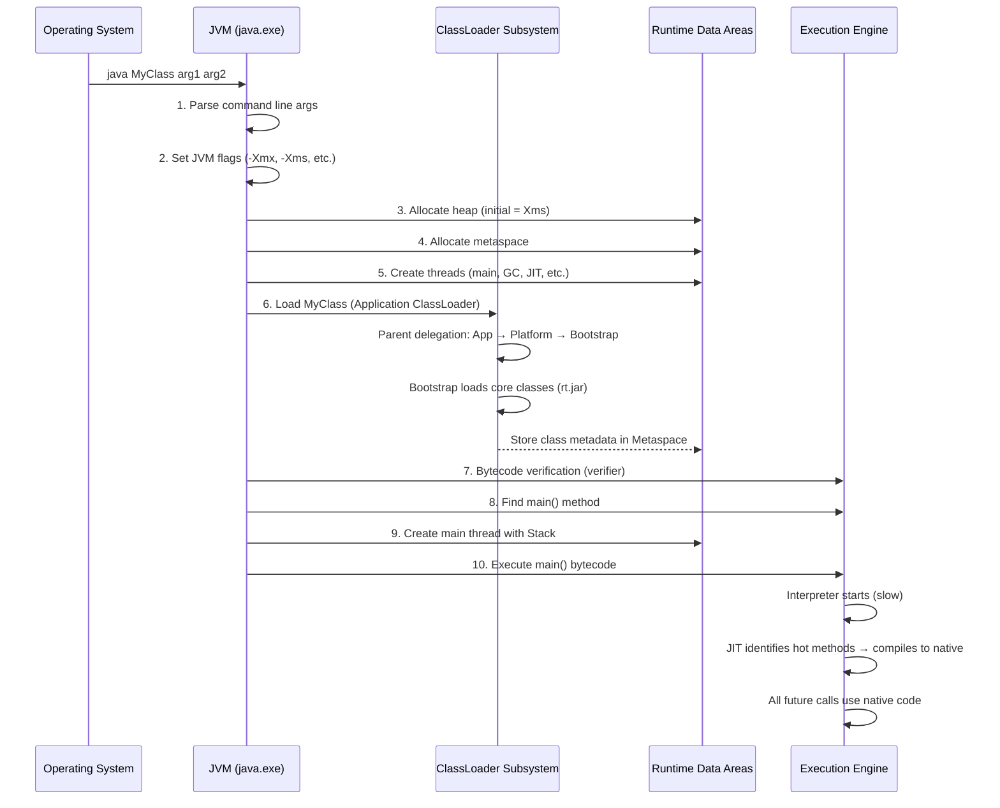
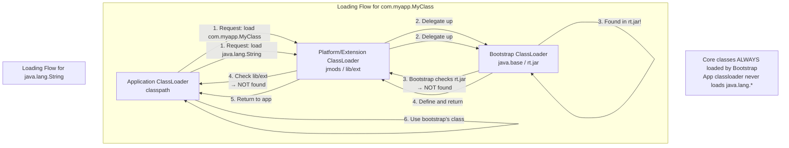

# JVM Architecture — Complete Deep Dive

## 1. Why This Concept Matters

The Java Virtual Machine (JVM) is what makes Java platform-independent — "write once, run anywhere." Understanding JVM internals is essential for diagnosing production issues: out-of-memory errors, high CPU, garbage collection pauses, class loading errors, and thread deadlocks. Senior engineers regularly use JVM knowledge to tune application performance, analyze heap dumps, and debug classpath conflicts. Interviewers ask about JVM architecture because it separates developers who just write code from those who understand how their code actually runs. Every senior-level Java interview includes JVM questions — class loading, memory model, garbage collection, and performance tuning.

Misunderstanding JVM causes:
- ClassNotFoundException or NoClassDefFoundError from classloader hierarchy confusion
- OutOfMemoryError from not understanding heap vs metaspace
- Excessive GC pauses from not tuning heap sizes
- Thread starvation from not understanding thread internals
- Performance issues from not understanding JIT compilation

## 2. Basic Meaning

JVM is an abstract computing machine that executes Java bytecode. It provides memory management (GC), security (bytecode verifier), platform independence, and runtime environment for Java applications.

**Key components:**
- **ClassLoader Subsystem**: loads `.class` files into memory. Three main classloaders: Bootstrap (rt.jar, Java core), Extension/Platform (lib/ext), Application (classpath).
- **Runtime Data Areas**: the memory areas where the JVM stores data during execution:
  - **Method Area (Metaspace)**: class metadata, static variables, constants, method bytecode
  - **Heap**: all object instances and arrays. Shared across all threads. Garbage collected.
  - **Stack**: one per thread. Stores frames (local variables, operand stack, frame data). Stack size is configurable.
  - **PC Register**: one per thread. Address of currently executing instruction.
  - **Native Method Stack**: native method calls (C/C++ code via JNI).
- **Execution Engine**: executes bytecode. Components:
  - **Interpreter**: reads bytecode, interprets one instruction at a time. Slow.
  - **JIT Compiler (Just-In-Time)**: identifies hot methods (frequently executed) and compiles them to native machine code. Drastically improves performance.
  - **Garbage Collector**: automatically reclaims memory from unreachable objects.
- **Java Native Interface (JNI)**: bridge between Java and native code (C/C++).
- **Native Method Libraries**: platform-specific libraries.

**What it is NOT:**
- Not the same as JRE or JDK. JVM is part of JRE. JDK = JRE + development tools.
- Not a hardware virtual machine (not VMware/VirtualBox). It's a specification implemented by vendors (HotSpot, OpenJ9, GraalVM).
- Not single-threaded — JVM manages multiple threads natively.

## 3. Real Code / Real Example

```java
// JvmArchitectureDemo.java — Run with: java -XX:+PrintFlagsFinal JvmArchitectureDemo
public class JvmArchitectureDemo {
    
    private static final String CONSTANT = "I'm in the constant pool";
    private static String staticField = "I'm in Metaspace";
    
    public static void main(String[] args) {
        System.out.println("=== JVM Architecture Demo ===");
        System.out.println("Available processors: " + Runtime.getRuntime().availableProcessors());
        System.out.println("Max memory (heap): " + Runtime.getRuntime().maxMemory() / 1024 / 1024 + " MB");
        System.out.println("Total memory (heap): " + Runtime.getRuntime().totalMemory() / 1024 / 1024 + " MB");
        System.out.println("Free memory (heap): " + Runtime.getRuntime().freeMemory() / 1024 / 1024 + " MB");
        System.out.println();
        
        // Thread behavior — each thread has its own stack
        System.out.println("Main thread: " + Thread.currentThread().getName());
        printClassLoaderInfo();
        
        // Create objects on heap
        Object heapObject = new Object();
        System.out.println("Object created on heap: " + heapObject);
        
        // Force GC
        System.gc();
        System.out.println("System.gc() called (request, not guarantee)");
        
        // Check classloading
        System.out.println("\nLoading class: " + JvmArchitectureDemo.class.getName());
        System.out.println("Class loader: " + JvmArchitectureDemo.class.getClassLoader());
        System.out.println("Parent class loader: " + 
            JvmArchitectureDemo.class.getClassLoader().getParent());
        System.out.println("Grandparent: " + 
            JvmArchitectureDemo.class.getClassLoader().getParent().getParent());
    }
    
    private static void printClassLoaderInfo() {
        ClassLoader cl = JvmArchitectureDemo.class.getClassLoader();
        System.out.println("\n=== ClassLoader Hierarchy ===");
        while (cl != null) {
            System.out.println("  ClassLoader: " + cl.getClass().getName() + 
                " -> loads from: " + 
                String.join(", ", ((java.net.URLClassLoader) cl).getURLs()));
            cl = cl.getParent();
        }
        // Bootstrap classloader is null (native, no Java object)
        System.out.println("  Bootstrap ClassLoader (native) -> loads rt.jar");
    }
}
```

**Key JVM flags for monitoring:**
```bash
# Print all JVM flags (includes defaults)
java -XX:+PrintFlagsFinal -version | grep -E "HeapSize|MetaspaceSize|ThreadStackSize"

# Enable GC logging (Java 8 style)
java -XX:+PrintGCDetails -XX:+PrintGCTimeStamps -Xloggc:gc.log MyApp

# Enable GC logging (Java 11+ unified logging)
java -Xlog:gc*:file=gc.log MyApp

# Print class loading
java -verbose:class MyApp

# Print JIT compilation
java -XX:+PrintCompilation MyApp

# Set heap sizes
java -Xms512m -Xmx4g -XX:MetaspaceSize=256m MyApp
```

## 4. What Happens Internally

### JVM Startup Sequence


### Memory Layout at Runtime
```mermaid
graph TD
    subgraph "Thread 1 Stack"
        T1S1[Frame: main()]
        T1S2[Frame: methodA()]
        T1S3["local variables<br/>operand stack<br/>frame data"]
    end
    
    subgraph "Thread 2 Stack (GC Thread)"
        T2S1[Frame: garbage collection]
    end
    
    subgraph "Heap (Shared)"
        OBJ1[Object Instance]
        OBJ2[Another Object]
        ARR1[Array of int]
        OBJ3[Unreachable Object<br/>→ GC candidate]
    end
    
    subgraph "Metaspace (Method Area)"
        CLASS[Class metadata<br/>MyClass]
        STATIC[static variables]
        CP[Constant Pool<br/>Strings, numbers]
        BYTECODE[Method bytecode<br/>JIT compiled code]
    end
    
    subgraph "Native Method Stack"
        NATIVE[Native C/C++ calls]
    end
    
    T1S3 --> OBJ1
    T1S3 --> OBJ2
    CLASS --> OBJ1
    CLASS --> CP
```

### ClassLoader Delegation Model


## 5. Tricky Interview Cases

**Case 1 — StackOverflowError from deep recursion**
```java
public class StackOverflowDemo {
    static int depth = 0;
    
    public static void recurse() {
        depth++;
        recurse(); // Infinite recursion
    }
    
    public static void main(String[] args) {
        try {
            recurse();
        } catch (StackOverflowError e) {
            System.out.println("Stack overflow at depth: " + depth);
            // Stack depth typically: 10,000-20,000 (default 1MB stack)
        }
    }
}
```
Output: `Stack overflow at depth: ~10000-20000`
Explanation: Each recursive call pushes a new frame onto the thread's stack. Default stack size is ~1MB. Once full, JVM throws StackOverflowError. **Fix**: Increase stack size with `-Xss2m` or eliminate the recursion.

**Case 2 — OutOfMemoryError: Java heap space**
```java
public class OutOfMemoryDemo {
    public static void main(String[] args) {
        List<byte[]> list = new ArrayList<>();
        while (true) {
            list.add(new byte[1024 * 1024]); // 1MB per iteration
            System.out.println("Allocated " + list.size() + " MB");
        }
    }
}
```
Output: Eventual `java.lang.OutOfMemoryError: Java heap space` when heap is full.
Explanation: Objects continue to be allocated and referenced (in the list) — GC cannot reclaim them because the list holds strong references. **Fix**: Increase heap (`-Xmx`), or fix memory leak (remove unused references).

**Case 3 — OutOfMemoryError: Metaspace**
```java
// Run with: -XX:MaxMetaspaceSize=64m -verbose:class
public class MetaspaceDemo {
    public static void main(String[] args) throws Exception {
        List<ClassLoader> loaders = new ArrayList<>();
        while (true) {
            // Create a new classloader that loads a dynamically generated class
            ClassLoader cl = new URLClassLoader(new URL[0]);
            Class<?> c = cl.loadClass("java.lang.String"); // just an example
            loaders.add(cl);
            // Each classloader stores class metadata in Metaspace
            // Eventually fills Metaspace
        }
    }
}
```
Output: `java.lang.OutOfMemoryError: Metaspace`
Explanation: Each classloader stores class metadata in Metaspace. If classloaders are not garbage collected, Metaspace fills up. **Fix**: Set `-XX:MaxMetaspaceSize` to limit, or fix classloader leak.

**Case 4 — NoClassDefFoundError vs ClassNotFoundException**
```java
// ClassNotFoundException — thrown when classloader cannot find the class at load time
try {
    Class.forName("com.nonexistent.MyClass"); // ClassNotFoundException!
} catch (ClassNotFoundException e) {
    System.out.println("Class not found: " + e.getMessage());
}

// NoClassDefFoundError — thrown when class was available at compile time but not at runtime
// Example: class A references class B. Class B was in classpath during compilation but removed from runtime
// JVM loads A, verifies it needs B, but B is not found → NoClassDefFoundError
```
Output: `ClassNotFoundException` vs `NoClassDefFoundError`
- ClassNotFoundException: check `Class.forName()`, classpath, or libraries
- NoClassDefFoundError: check for removed JARs, failed static initializers in dependency classes

## 6. Common Mistakes

| Mistake | Problem | Fix |
|---------|---------|-----|
| Setting Xms > Xmx | JVM fails to start | Xms ≤ Xmx |
| Not setting MaxMetaspaceSize | Unbounded Metaspace growth can cause OOM | Set `-XX:MaxMetaspaceSize=256m` |
| Ignoring GC logs | Can't diagnose GC pause issues | Always enable GC logging in production |
| No heap dump on OOM | Can't analyze memory leak | `-XX:+HeapDumpOnOutOfMemoryError -XX:HeapDumpPath=/path` |
| Default stack size too small | StackOverflowError for deep recursion | Adjust with `-Xss2m` (or increase algorithmically) |
| Confusing -Xmx with total memory | -Xmx is only heap, Metaspace + Stack + Native are extra | Total JVM memory = Xmx + Metaspace + Stack × threads + Native memory |
| Not understanding classloader hierarchy | ClassCastException from same class loaded by different classloaders | Check JARs in multiple classloader paths |

## 7. Production Usage

**Spring Boot recommended JVM flags:**
```bash
java -Xms2g -Xmx2g \
     -XX:MetaspaceSize=256m -XX:MaxMetaspaceSize=256m \
     -XX:+UseG1GC \
     -XX:MaxGCPauseMillis=100 \
     -XX:+ParallelRefProcEnabled \
     -XX:+HeapDumpOnOutOfMemoryError \
     -XX:HeapDumpPath=/var/log/app/heapdump.hprof \
     -XX:+PrintGCDetails -XX:+PrintGCTimeStamps \
     -Xloggc:/var/log/app/gc.log \
     -Dcom.sun.management.jmxremote \
     -jar myapp.jar
```

**Monitoring in production:**
```bash
# Check JVM memory usage
jcmd <pid> VM.native_memory

# Heap dump analysis
jmap -dump:live,format=b,file=heap.hprof <pid>

# Thread dump (deadlock detection, thread analysis)
jstack <pid> > threaddump.txt

# GC statistics
jstat -gcutil <pid> 1s 10  # Print GC stats every second

# Visual analysis tools
jconsole <pid>     # JMX-based monitoring
jvisualvm          # Full profiling (heap, threads, CPU)
```

## 8. Advanced Details

- **JIT Compilation Levels**: C1 (client, quick startup, moderate optimization), C2 (server, slower startup, aggressive optimization), Tiered (starts with C1, hot methods migrate to C2). Default since Java 8.
- **Escape Analysis**: JIT can determine if an object is only used within a method. If so, it allocates the object on the stack (not heap) — eliminates GC pressure. Or it can scalar replace (break object into primitive fields on stack).
- **Biased Locking**: Optimizes `synchronized` for uncontended locks. If only one thread accesses a lock, JVM eliminates atomic operations. Can be disabled with `-XX:-UseBiasedLocking`.
- **Compressed OOPs (Object Pointers)**: With heaps < 32GB, JVM uses 32-bit offsets instead of 64-bit pointers. Saves memory. Disable with `-XX:-UseCompressedOops`.
- **String Deduplication (G1GC)**: G1GC can identify duplicate strings in the heap and make them point to the same char[] — saves memory.
- **JVM TI (Tool Interface)**: Native interface for agents (profiling, debugging, monitoring). Used by APM tools (New Relic, Datadog).
- **Container Awareness (Java 10+)**: JVM now respects container memory/CPU limits (cgroups). Previously, JVM would see host memory, not container limits. Set with `-XX:+UseContainerSupport`.

## 9. Interview Questions And Answers

### Beginner
Q: What is the difference between JDK, JRE, and JVM?
A: JDK (Java Development Kit) = JRE + Development tools (compiler, debugger, javadoc). JRE (Java Runtime Environment) = JVM + Core Libraries. JVM (Java Virtual Machine) = executes bytecode, manages memory, threads. JDK is for development, JRE is for running Java applications, JVM is the runtime engine.

### Intermediate
Q: Explain the ClassLoader delegation model. Why is it used?
A: When a class needs to be loaded, the Application ClassLoader delegates to the Platform ClassLoader, which delegates to the Bootstrap ClassLoader. Bootstrap checks core Java classes (rt.jar/java.base). If not found, Platform checks, then Application checks its classpath. This prevents classes from being loaded multiple times and ensures that core Java classes (java.lang.String) are always loaded by the Bootstrap ClassLoader, preventing malicious replacement.

### Senior
Q: Your Spring Boot application in a Kubernetes pod with 2GB memory limit keeps hitting OOM. You set -Xmx to 1.5GB but it still crashes. Why?
A: -Xmx only sets the Java heap maximum. The JVM also requires memory for Metaspace (default: unlimited, grows as needed), thread stacks (1MB × number of threads), JIT compiler code cache, native memory (direct buffers, JNI), and GC overhead. For a 2GB container limit, -Xmx should be ~1GB (50% of container memory) to leave room for Metaspace, threads, and native memory. Use `-XX:MaxMetaspaceSize=256m` to cap Metaspace. Java 10+ with `-XX:+UseContainerSupport` and `-XX:+UseCGroupMemoryLimitForHeap` helps but you still need to account for non-heap memory.

### Tricky
Q: Can the same class be loaded twice by different classloaders? What happens if you try to cast an instance from one to another?
A: Yes. In Java, two classes are considered the same only if they have the same fully qualified name AND are loaded by the same classloader. If two different classloaders load the same MyClass.class, they are different types at runtime. `instanceof` returns false. Cast throws ClassCastException. This commonly happens in application servers (Tomcat, JBoss) where each webapp has its own classloader. It's why you get ClassCastException even though the class name is identical — the classloaders differ.

## 10. Final 30-Second Answer

JVM = executes bytecode, manages memory. **Three main areas**: ClassLoader (loads .class, parent delegation), Runtime Data Areas (Heap for objects, Stack per thread, Metaspace for class metadata), Execution Engine (Interpreter + JIT Compiler + GC). **Heap**: Young Gen (Eden + S0/S1) + Old Gen. **GC**: Minor (young) + Major (old) + Full (Metaspace). **JIT**: compiles hot methods to native code. **Tuning**: set -Xms/-Xmx (heap), -XX:MetaspaceSize, -Xss (stack), GC type (-XX:+UseG1GC). Always: enable GC logging, set heap dump on OOM, monitor with jstat/jmap/jstack.