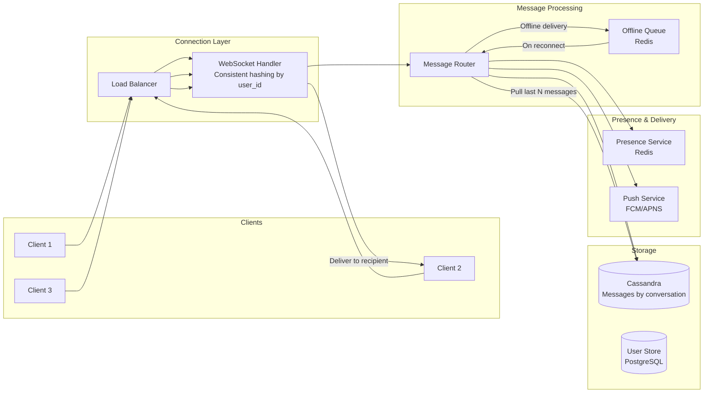
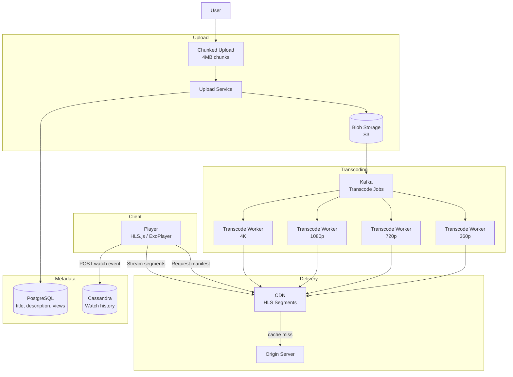

# High-Level Design (HLD) — Complete Deep Dive

## 1. Why This Concept Matters

The system design interview is the single most important evaluation for senior+ engineering roles. Interviewers assess your ability to decompose ambiguous requirements, make architectural tradeoffs, estimate scale, and design systems that are scalable, available, and maintainable. Unlike coding interviews which test algorithmic knowledge, system design tests your engineering judgment — choosing between SQL and NoSQL, sync and async, sharding strategy, caching approach. Every decision has a tradeoff, and the interviewer evaluates whether you understand those tradeoffs. This is not about knowing the "right answer" — there is none. It's about demonstrating structured thinking, making reasonable assumptions, and defending your choices.

Misunderstanding HLD causes:
- Diving into deep design without clarifying requirements (designing for wrong problem)
- Ignoring scale estimates (over-engineering for 100 users or under-engineering for 100M)
- Choosing technology without understanding tradeoffs (saying "we'll use Cassandra" without understanding consistency model)
- Forgetting about non-functional requirements (latency, availability, durability)
- Not discussing failure modes (what happens when cache fails, DB crashes, network partitions)

## 2. The Framework

A repeatable approach that works for every system design question:

**Step 1: Clarify Requirements (5-10 minutes)**
Start by asking questions. Don't assume anything. A good framing:
- Functional requirements: What should the system do? (core features, must-haves vs nice-to-haves)
- Non-functional requirements: Scale (DAU, QPS), latency (p99 < 200ms?), availability (99.9%?), consistency (strong vs eventual)
- Out of scope: What are we NOT building? (admin dashboards, analytics, ML recommendations)

Example for "Design Twitter":
```
Functional:
  - Post a tweet (text, max 280 chars)
  - View home timeline (tweets from people I follow)
  - Follow/unfollow users
  - Like tweets

Non-functional:
  - 100M DAU (daily active users)
  - 500M tweets/day (about 6K writes/sec)
  - Timeline load: 100K reads/sec
  - Home timeline should load in < 500ms
  - Eventual consistency OK for timeline (tweet may take seconds to appear)

Out of scope:
  - Direct messages
  - Trending topics
  - Search
```

**Step 2: Estimate Scale (5 minutes)**
Calculate rough numbers to guide capacity planning:

| Metric | Formula | Example (Twitter) |
|--------|---------|-------------------|
| Total DAU | Given | 100M |
| Peak QPS | (total daily actions / 86400) × peak factor | Tweets: 500M / 86400 × 5 ≈ 29K/s |
| Storage per day | (tweets/day × size per tweet) | 500M × 500 bytes = 250 GB/day |
| Storage per year | × 365 | 250 GB × 365 = 91 TB/year |
| Cache size | (tweets × active users × per user) | 100M users × 100 tweets = ~50GB |

**Step 3: Core Entities & Data Model (5-10 minutes)**
Define the main entities and their relationships. This clarifies the data access patterns.

**Step 4: System Interface (5 minutes)**
Define the APIs (REST, or internal RPC). This clarifies the interaction model.

**Step 5: High-Level Design (10-15 minutes)**
Draw the architecture diagram. Components: Load balancer → API Gateway → App services → Database(s) → Cache → CDN → Message queue.
Walk through the request flow: "User posts a tweet → API Gateway → write service → database → fanout to followers' timelines via message queue."

**Step 6: Deep Dive on Key Components (15-20 minutes)**
This is where most interview time is spent. Pick 2-3 components and go deep:
- Database design: SQL vs NoSQL, schema, indexing, sharding
- Caching strategy: what's cached, TTL, cache invalidation
- Consistency model: strong vs eventual, read-after-write guarantees
- Specific algorithms: URL shortener key generation, news feed fanout, chat ordering
- Failure scenarios: what happens when each component fails

**Step 7: Scaling and Bottlenecks (5-10 minutes)**
Identify the bottleneck at each scale level and how to address it:
- At 100 users: simple monolith
- At 1M users: add caching, read replicas, CDN
- At 100M users: sharding, queue everything, microservices, geo-distribution

## 3. Common Design Problems and Their Solutions

### Architecture Diagrams

#### URL Shortener Architecture
```mermaid
graph TD
    subgraph "Client"
        U[User]
    end
    
    subgraph "CDN & Load Balancer"
        LB[Load Balancer]
        CDN[CDN - cache redirects]
    end
    
    subgraph "Application Layer"
        WR[Write Service<br/>POST /shorten]
        RD[Read Service<br/>GET /{key}]
        ID[ID Generator<br/>Snowflake]
    end
    
    subgraph "Cache Layer"
        RC[Redis Cache<br/>LRU eviction<br/>TTL: 1 hour]
    end
    
    subgraph "Database Layer"
        PG[(PostgreSQL<br/>Primary + Replicas)]
    end
    
    subgraph "Async"
        MQ[Message Queue]
        AN[Analytics Service]
    end
    
    U -->|POST longUrl| LB
    LB --> WR
    WR --> ID -->|base62 key| WR
    WR --> PG
    WR --> MQ --> AN
    
    U -->|GET shortKey| LB
    LB --> RD
    RD --> RC
    RC -->|cache hit| RD
    RC -->|cache miss| PG -->|redirect url| RD
    RD -->|301 redirect| U
    
    CDN -.->|cache static content| U
```

#### News Feed (Hybrid Fanout) Architecture
```mermaid
graph TD
    subgraph "Write Path (User posts a tweet)"
        U[User] --> P[Post Service]
        P --> TD[(Tweet DB<br/>PostgreSQL)]
        P -->|Fanout for followers < 1000| MQ[Kafka<br/>Fanout Worker]
        MQ --> TL[(Timeline Cache<br/>Redis<br/>List per user)]
    end
    
    subgraph "Read Path (User loads timeline)"
        R[Reader] --> TLF[Timeline Service]
        TLF --> TL
        TLF -->|Celebrity tweets (pull)| CT[(Celebrity Timeline Cache<br/>Redis)]
        TLF -->|Merge + rank| R
    end
    
    subgraph "Celebrity Path (followers > 1000)"
        C[Celebrity] --> P
        CT -->|Recent 100 tweets cached| TLF
    end
    
    subgraph "Async Processing"
        MQ --> AN[Analytics]
        MQ --> NS[Notification Service]
    end
```

#### Chat System Architecture


#### Video Platform (YouTube) Architecture


### URL Shortener
```
Challenge: Generate short, unique keys for URLs
         Handle 100M URLs, 10K reads/sec

Key Generation:
  - Base62 encoding (a-z, A-Z, 0-9 = 62 chars)
  - 7 chars → 62^7 = 3.5 trillion unique keys
  - Approach: distributed ID generator (Snowflake-style: timestamp + worker ID + sequence)
  - Cache: Redis cache for popular URLs (LRU eviction, TTL)

Database: 
  - SQL (PostgreSQL) for strong consistency on URL creation
  - Primary: URL mapping (short_key, long_url, created_at)
  - Secondary: long URL → short key lookup (prevent duplicate short URLs)
  - Index on short_key (unique), index on long_url

API:
  - POST /shorten { longUrl } → { shortKey }
  - GET /{shortKey} → redirect (301) to long URL
  - GET /{shortKey}/stats → { clickCount }

Scaling:
  - Read-heavy (10K reads/sec, 100 writes/sec)
  - Redis cache: 90% cache hit → 1K reads/sec hit DB
  - DB: read replicas for cache misses + analytics queries
  - Sharding: by short_key hash (if > 1B URLs)
```

### News Feed (Facebook/Twitter Timeline)
```
Challenge: Real-time feed for each user showing posts from followed accounts
          100M users, 500M posts/day

Fanout Approaches:
  PUSH (write-time fanout):
    - When user posts, push to all followers' timelines (pre-compute)
    - Fast reads (O(1)), slow writes (O(followers))
    - Good for: celebrities (< 1000 followers), normal users
    - Problem: celebrity with 50M followers → push to 50M timelines

  PULL (read-time fanout):
    - When user loads timeline, fetch posts from followed users (merge)
    - Slow reads (O(followers)), fast writes (O(1))
    - Good for: celebrities (don't push to 50M timelines)
    - Problem: timeline load merges 10K followees' posts

  HYBRID:
    - Normal users (< 1000 followers): PUSH
    - Celebrities (> 1000 followers): PULL (cache their recent posts)
    - Timeline: merge pushed tweets + pulled tweets from celebrities

Storage:
  - Timeline: Redis lists per user (capped at 500 tweets)
  - Tweet data: PostgreSQL (tweets table, sharded by tweet_id)
  - Fanout: Kafka (async, for each follower, write to their timeline)

API:
  - POST /tweet { text } → { tweetId }
  - GET /timeline?page=1 → [tweet summaries]
  - GET /timeline/next?cursor=abc → [next page]

Scaling:
  - Write: 6K tweets/sec → fanout via Kafka consumers
  - Read: 100K timeline loads/sec → Redis caches precomputed timelines
  - Cache miss: fall back to DB query with pull fanout
```

### Chat System (WhatsApp/Messenger)
```
Challenge: Real-time messaging, ordering, offline delivery, group chats
          1B users, billions of messages/day

Design:
  - WebSocket persistent connections for real-time delivery
  - Each user connects to a chat server (consistent hashing by user_id)
  - Messages stored in Cassandra (ordered by message timestamp)
  - Offline: messages stored in Cassandra, delivered on reconnect

Key Components:
  - Connection handler: manages WebSocket lifecycle
  - Message router: routes message to recipient's chat server
  - Message store: Cassandra (write-optimized, horizontally scalable)
  - Offline queue: unread messages per user in Redis

Ordering:
  - Client-generated message ID (UUID or Snowflake)
  - Server-side sequence number for ordering within conversation
  - Last-read marker: update on read notification

API (via WebSocket):
  - send: { from, to, text, messageId, timestamp }
  - receive: { from, text, messageId, timestamp, sequenceNum }
  - read_receipt: { messageId, readAt }

Scaling:
  - Write: millions of messages/sec → Cassandra (writes are cheap)
  - Read: user opens app → fetch last 50 messages from Cassandra (fast by partition key)
  - WebSocket connections: sticky via Redis-based consistent hashing
```

### Video Platform (YouTube/Netflix)
```
Challenge: Upload and serve large video files, transcoding, CDN distribution
          1B users, 500 hours of video uploaded/min

Upload:
  - Chunked upload: split into 4MB chunks, upload in parallel
  - Upload service receives chunks, stores in blob storage (S3)  
  - Once all chunks received: async transcoding pipeline

Transcoding:
  - Multiple resolutions: 360p, 720p, 1080p, 4K
  - Multiple formats: MP4 (H.264), WebM (VP9), HLS (streaming)
  - Transcoding workers pick jobs from Kafka queue
  - Result: transcoded segments stored in CDN

Delivery:
  - HLS (HTTP Live Streaming): segments of 6-10 seconds
  - Client requests manifest → streams segments from CDN
  - Adaptive bitrate: client chooses resolution based on bandwidth
  - CDN: cache popular videos at edge (CloudFront, Cloudflare)

Storage:
  - Original video: S3/Blob storage (cold, rarely accessed)
  - Transcoded segments: CDN (hot, geographically distributed)
  - Metadata (title, description, views): PostgreSQL
  - Watch history: Cassandra (high write volume)

API:
  - POST /upload (multipart upload, chunked)
  - GET /video/{id}/manifest.m3u8 → HLS playlist
  - GET /video/{id}/{segment}.ts → video segment
  - POST /watch { videoId, userId } → { recommendations }

Scaling:
  - Upload: chunk → blob storage → Kafka → transcoding workers
  - Delivery: CDN absorbs 99% of traffic (only cache misses hit origin)
  - Recommendation: ML model runs offline, cached in Redis
```

## 4. Key Tradeoff Decisions

| Decision | Option A | Option B | When to Choose |
|----------|----------|----------|---------------|
| Database | SQL (PostgreSQL) | NoSQL (Cassandra) | SQL: strong consistency, complex queries. NoSQL: horizontal scaling, high write throughput. |
| Communication | REST (sync) | Kafka (async) | REST: immediate response needed. Kafka: decouple services, buffer bursts. |
| Cache | Cache-aside | Write-through | Cache-aside: simple, cache miss penalty. Write-through: always consistent (slower writes). |
| ID generation | UUID (random, 128-bit) | Snowflake (monotonic, 64-bit) | UUID: no coordination, 128-bit. Snowflake: ordered, fits in 64-bit, needs clock sync. |
| Consistency | Strong (read-after-write) | Eventual | Strong: financial systems. Eventual: social media, CDNs, analytics. |
| Sharding key | Hash-based (even) | Range-based (ordered) | Hash: even distribution. Range: efficient range scans, hot shard risk. |
| File storage | Local disk | S3/Blob storage | Local: fast, limited. S3: unlimited, slower, network cost. |

## 5. Production Considerations

**Availability calculations:**
```
99.9% ("three nines"): 8.77 hours downtime/year → acceptable for internal tools
99.99% ("four nines"): 52.6 minutes downtime/year → standard for consumer apps
99.999% ("five nines"): 5.26 minutes downtime/year → critical infrastructure

To achieve 99.99%:
  - Redundant load balancers (active-active)
  - Multiple app instances across availability zones (min 2)
  - Database primary with synchronous replica (automatic failover)
  - CDN for static content (edges survive origin failure)
  - Graceful degradation (degrade features, stay up)
```

**Graceful degradation examples:**
```
- If cache fails: fall through to database (slower but works)
- If database is overloaded: serve stale cache + queue writes
- If recommendation service fails: return default recommendations
- If payments fail: store order, process later (eventual consistency)
- If search fails: hide search bar, show browse categories
```

**Monitoring what matters:**
```
RED metrics for each service:
  - Rate: requests per second
  - Errors: error rate (5xx, timeouts)
  - Duration: latency (p50, p95, p99)

USE metrics for each resource:
  - Utilization: CPU, memory, disk, connections
  - Saturation: queue depth, thread pool utilization
  - Errors: failure count, retry rate

Golden signals (Google SRE):
  1. Latency: time to serve a request
  2. Traffic: demand on the system (QPS)
  3. Errors: rate of failed requests
  4. Saturation: how "full" the system is
```

## 6. Common Mistakes

| Mistake | Why It Fails | Fix |
|---------|-------------|-----|
| No requirements clarification | Design solves wrong problem | Ask "what does the system need to do?" |
| Ignoring scale | Proper solution for 1M users may be wrong for 100M | Estimate DAU, QPS, storage upfront |
| Over-engineering | Distributed system for 100 users | Ask about expected scale first |
| No tradeoff discussion | Looks like you don't understand options | Compare SQL vs NoSQL, sync vs async |
| Single point of failure | One component fails → system down | Redundancy, graceful degradation |
| No failure mode discussion | Looks like you assume everything works | Discuss cache miss, DB failover, network partition |

## 7. Interview Questions & Answers

### Beginner
Q: How would you design a URL shortener?
A: Use the framework: (1) Requirements: generate short keys, redirect to long URL, handle 1M URLs/month. (2) Estimate: 1M URLs/month ≈ 1 write/sec. Reads 100x higher. (3) Data model: (short_key, long_url, created_at, clicks). (4) API: POST /shorten, GET /{key}. (5) HLD: App server → SQL DB (PostgreSQL) → Redis cache. (6) Deep dive: Base62 encoding, 7 chars = 3.5T keys, distributed ID generator. (7) Scale: Add read replicas, cache for hot URLs.

### Intermediate
Q: Design Twitter's news feed for 100M DAU.
A: Hybrid fanout approach. Normal users (< 1000 followers): push to followers' timelines on post. Celebrities: pull their tweets when followers load timeline. Timeline stored in Redis (capped at 500). Tweet data in PostgreSQL (sharded by tweet_id). Kafka for async fanout. Cache timeline in Redis — 99% cache hit for normal users. For celebrities' followers: cache celebrity's recent tweets, merge on timeline load.

### Senior
Q: Design a chat system like WhatsApp for 1B users.
A: Key challenges: real-time delivery (WebSockets), ordering, offline messages, group chats. Persistent WebSocket connections to chat servers (consistent hashing by user_id for stickiness). Messages stored in Cassandra (partitioned by conversation_id, ordered by message timestamp). Client-generated message ID + server sequence number for ordering. Offline: store in Cassandra per conversation, deliver on reconnect (pull last N messages). Group chat: store message once, pull on read (fanout on read, not write). For 1B users: geo-distribute chat servers (US, EU, Asia), localize traffic.

### Tricky
Q: You're designing a video platform. Uploads are fast (1GB file uploads in seconds) but transcoding takes 30 minutes. How do you handle user expectations?
A: Chunked upload (4MB chunks in parallel). User sees upload progress immediately. Once upload completes (seconds), return a "processing" status with estimated completion time. Transcoding pipeline: upload → Kafka queue → transcoding workers (auto-scale based on queue depth). User receives notification (push/email/webhook) when processing completes. While processing: show placeholder thumbnail, progressive loading (transcode highest priority resolution first — 360p available in 2 minutes, 4K takes 30 minutes). CDN delivers segments as they become available.

## 8. Final 30-Second Answer

HLD = system design interview. **Framework**: Clarify requirements → Estimate scale → Data model → APIs → High-level architecture → Deep dive on components → Scaling bottlenecks. **Common problems**: URL shortener (Base62 + ID generator + cache), News feed (hybrid push/pull fanout), Chat (WebSockets + Cassandra + ordering), Video (chunked upload + Kafka + CDN). **Key tradeoffs**: SQL vs NoSQL, sync vs async, strong vs eventual consistency, hash vs range sharding. **Never**: skip requirements, ignore failure modes, over-engineer for wrong scale, miss tradeoff discussion. Practice: URL shortener, chat, news feed, Uber, YouTube, rate limiter, distributed cache, payment system.