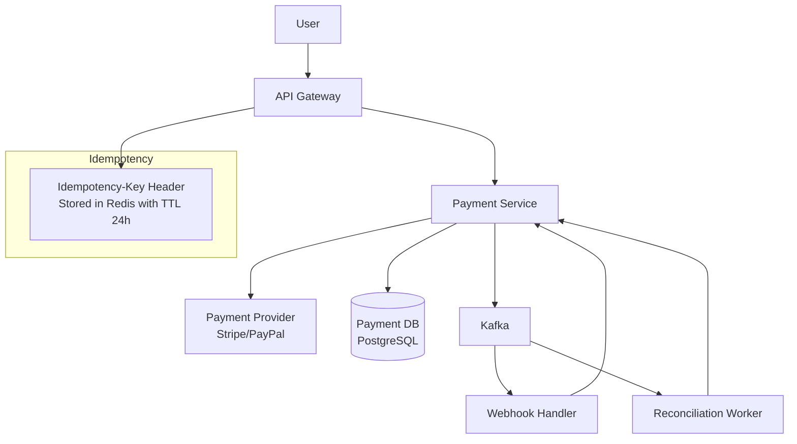
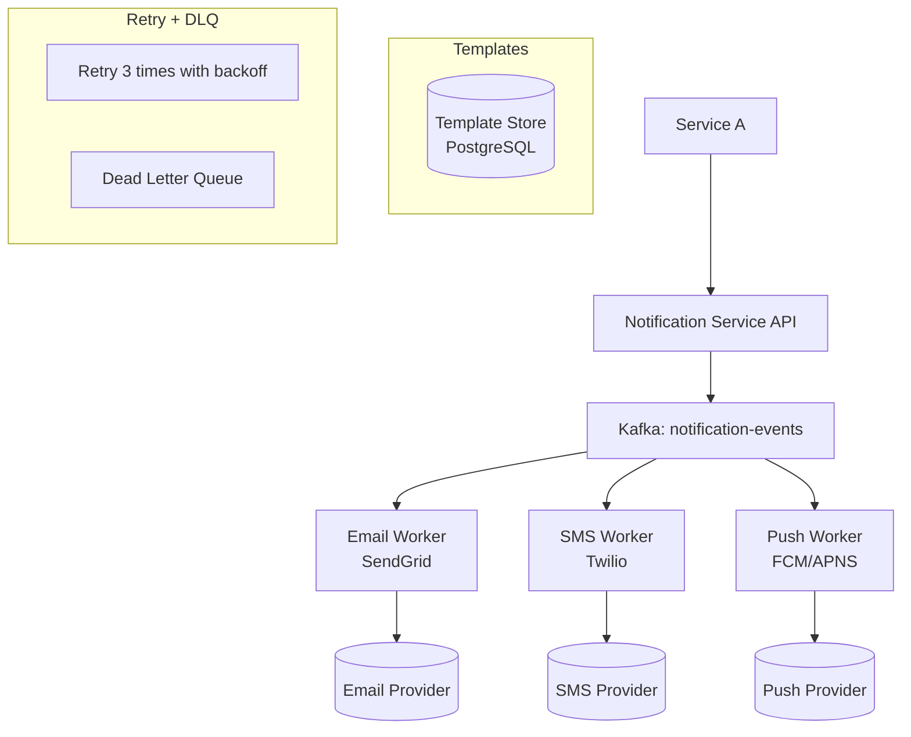
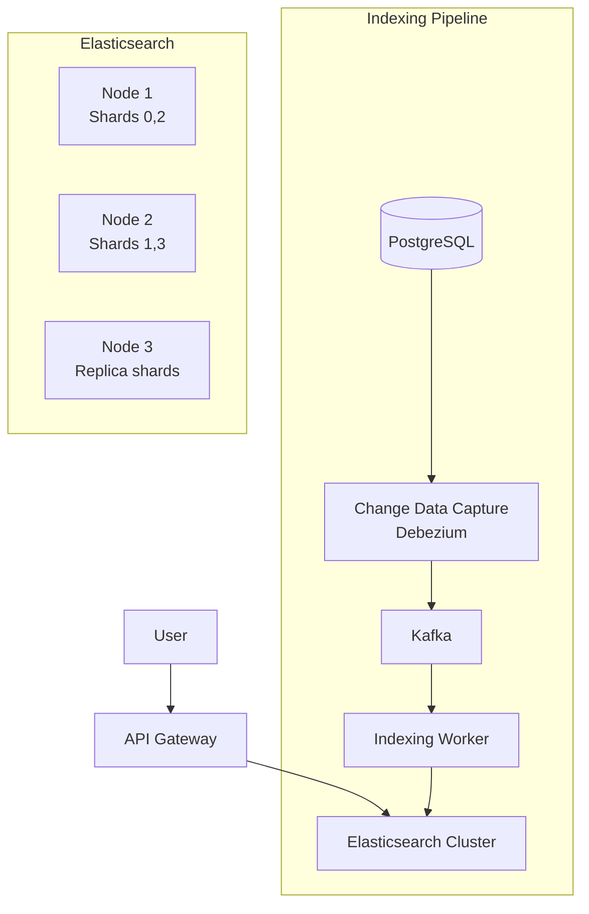
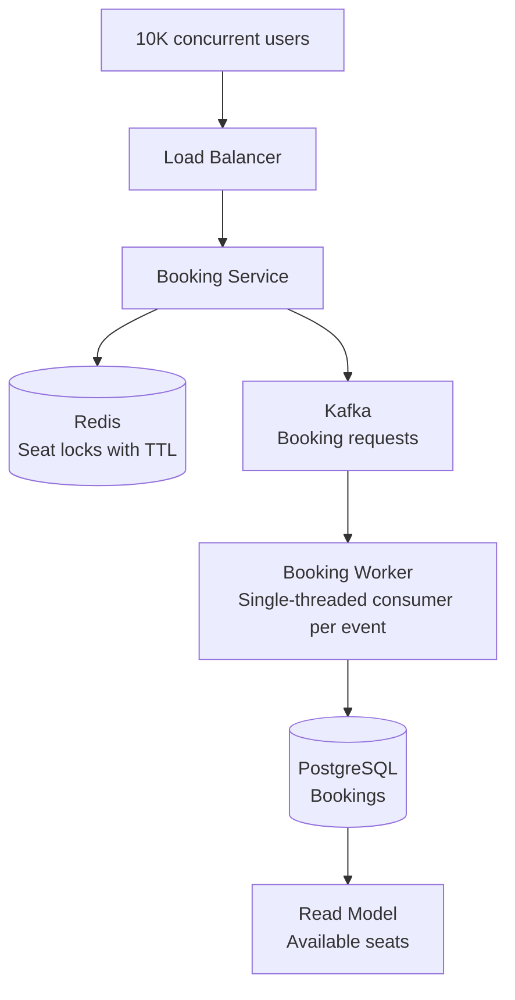

# HLD: Payment System, Notification System, Search, Ticket Booking

## 1. Payment System Design

**Requirements:**
- Process payments (credit card, digital wallet, bank transfer)
- Handle 10K transactions/minute
- Idempotency (retry-safe)
- Handle payment provider failures (Stripe, PayPal, etc.)
- Reconciliation (match payments with bank statements)

**Key Entities:**
- `Payment`: id, amount, currency, status, provider, providerTxnId
- `PaymentMethod`: type (CARD, WALLET), token, lastFourDigits, expiry
- `Refund`: id, paymentId, amount, reason
- `ReconciliationRecord`: date, totalAmount, matchedCount, unmatchedCount

**Architecture:**


**Idempotency flow:**
```
Client POST /payments { amount: 100 }
Header: Idempotency-Key: uuid-123

1. Check Redis: does key "uuid-123" exist?
   → YES: Return cached response (200 OK, existing result)
   → NO: Continue processing
2. Process payment with provider
3. Store result in Redis with key "uuid-123" (TTL: 24h)
4. Return response

If client retries (network timeout), same key → same response, no duplicate charge!
```

**Payment state machine:**
```
CREATED → PROCESSING → SUCCEEDED / FAILED / REFUNDED
                    → FAILED (retry 3 times, then send to DLQ)
```

**Handling provider failures:**
```java
public PaymentResult processPayment(PaymentRequest request) {
    try {
        PaymentResult result = paymentProvider.charge(request);
        if (result.isSuccess()) return PaymentResult.success(result.getTxnId());
        
        // Retry logic
        return retryWithBackoff(request, 3);
    } catch (ProviderTimeoutException e) {
        // Don't know if it succeeded — check with provider
        PaymentStatus status = paymentProvider.checkStatus(request.getIdempotencyKey());
        return mapStatus(status);
    } catch (ProviderDeclinedException e) {
        return PaymentResult.failed("Card declined");
    }
}
```

## 2. Notification System Design

**Requirements:**
- Send notifications via email, SMS, push (Firebase/APNS)
- Handle 1M notifications/day
- Templates for different notification types
- Retry failed sends (3 attempts + dead letter)
- Rate limiting per channel (don't exceed Twilio/SendGrid limits)

**Architecture:**


**API:**
```json
POST /api/notifications/send
{
  "channel": "email",
  "recipient": "user@example.com",
  "template": "order_confirmation",
  "params": {
    "orderId": "12345",
    "amount": 99.99
  },
  "priority": "HIGH"
}
```

**Rate limiting strategy:**
```java
@Component
public class NotificationRateLimiter {
    private final RedisTemplate<String, String> redis;
    
    public boolean allow(String channel) {
        String key = "ratelimit:" + channel + ":" + LocalDateTime.now().format(ISO_MINUTE);
        Long count = redis.opsForValue().increment(key);
        if (count == 1) redis.expire(key, 60, SECONDS);
        
        int limit = switch(channel) {
            case "email" -> 100;  // SendGrid: 100/sec
            case "sms" -> 10;     // Twilio: 10/sec
            case "push" -> 1000;  // FCM: 1000/sec
        };
        return count <= limit;
    }
}
```

## 3. Search System Design

**Approach:** Use Elasticsearch for full-text search on product catalog, orders, or users.

**Architecture:**


**Search API:**
```json
POST /api/search/products
{
  "query": "wireless headphones",
  "filters": {
    "price": { "gte": 50, "lte": 200 },
    "brand": ["Sony", "Bose"],
    "inStock": true
  },
  "sort": "relevance",
  "page": 0,
  "size": 20
}
```

**Key considerations:**
- Use Elasticsearch for search, PostgreSQL for transactions — never both for same writes
- Index only what's needed for search (not full entities)
- Fuzzy matching, autocomplete, synonyms for good UX
- CDC (Debezium) keeps ES in sync with primary DB without dual-write complexity

## 4. High-Traffic Ticket Booking (Concert/Flight)

**The concurrency problem:** Multiple users try to book the same seat simultaneously. Need to prevent double-booking.

**Requirements:**
- 100K concurrent users trying to book
- 10K seats available
- Prevent double-booking
- Handle payment timeout (release seat after 15 min)

**Approach:**


**Preventing double-booking:**
```java
@Service
public class BookingService {
    private final RedisTemplate<String, String> redis;
    
    public BookingResult attemptBooking(Long userId, Long seatId, Long eventId) {
        // Step 1: Lock seat in Redis (TTL: 15 min — payment timeout)
        String lockKey = "seat-lock:" + eventId + ":" + seatId;
        Boolean acquired = redis.opsForValue().setIfAbsent(lockKey, userId.toString(), 
            Duration.ofMinutes(15));
        
        if (Boolean.FALSE.equals(acquired)) {
            // Seat already locked by someone
            String lockerId = redis.opsForValue().get(lockKey);
            return BookingResult.failed("Seat already booked or in cart by user " + lockerId);
        }
        
        // Step 2: Optimistic lock in DB
        return bookingRepository.findById(seatId)
            .filter(seat -> seat.getStatus() == SeatStatus.AVAILABLE)
            .map(seat -> {
                int updated = bookingRepository.optimisticLockUpdate(seatId, userId, 
                    seat.getVersion());
                if (updated == 0) {
                    redis.delete(lockKey); // Failed — release lock
                    return BookingResult.failed("Seat just booked by another user");
                }
                return BookingResult.success();
            })
            .orElse(BookingResult.failed("Seat not available"));
    }
}
```

**Release on payment timeout:**

A scheduled job (`@Scheduled(fixedDelay = 60000)`) checks Redis for expired locks and releases them. The consumer that processes the lock first gets the seat.

## 5. Final 30-Second Answer

**Payment system**: idempotency key in Redis (prevent duplicates), retry with backoff, webhook handler for async provider callbacks, reconciliation worker. **Notification**: Kafka → channel-specific workers (email/SMS/push), rate limiting per provider, templates, retry + DLQ. **Search**: Elasticsearch with CDC (Debezium → Kafka → indexing worker). **Ticket booking**: Redis seat locks (15min TTL), optimistic lock in DB, single consumer per event to prevent race, scheduled release of expired locks.