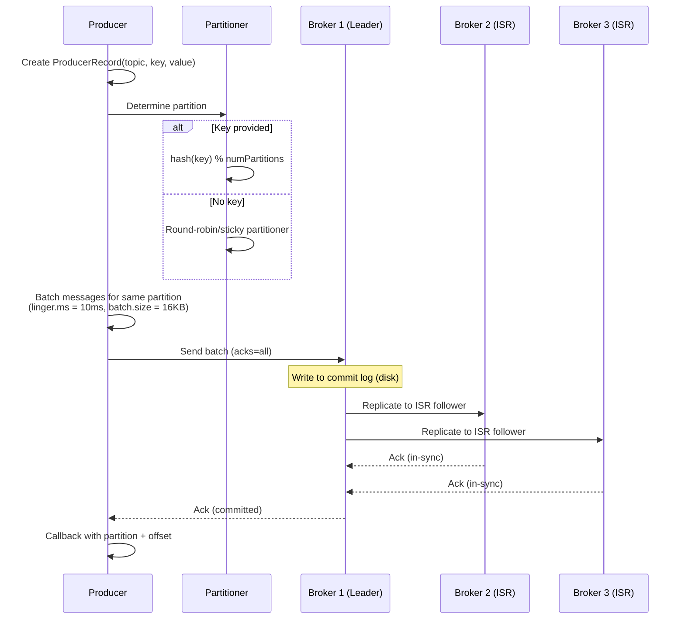

# Kafka — Complete Deep Dive

## 1. Why This Concept Matters

Apache Kafka is the de facto standard for event streaming in distributed systems. It handles millions of messages per second, provides durability through disk persistence, and enables decoupled, asynchronous communication between microservices. In production, Kafka powers critical infrastructure: payment processing pipelines, audit logging, metrics collection, event sourcing, and stream processing. Understanding Kafka's internal architecture — topics, partitions, segments, consumer groups, offset management, exactly-once semantics, and replication — is essential for building reliable, scalable event-driven systems. Interviewers test Kafka at senior levels because it reveals your understanding of distributed systems concepts: partitioning, ordering guarantees, fault tolerance, and throughput tradeoffs.

Misunderstanding Kafka causes:
- Message ordering loss from wrong partition key selection
- Consumer lag from insufficient partitions
- Message loss from incorrect `acks` configuration
- Duplicate processing from not handling at-least-once delivery
- Out-of-memory from unbounded retention or too-large batch sizes
- Poison messages blocking consumer groups

## 2. Basic Meaning

Apache Kafka is a distributed event streaming platform. Producers publish messages to topics. Consumers subscribe to topics and read messages. Topics are split into partitions for parallelism. Messages are persisted on disk and replicated across brokers for durability.

**Key vocabulary:**
- **Broker**: a Kafka server node. A cluster has multiple brokers.
- **Topic**: a logical channel for messages (like a database table). Producers write to topics, consumers read from topics.
- **Partition**: a topic is split into partitions. Each partition is an ordered, immutable sequence of messages (a commit log). Partitions enable parallelism — each partition can be consumed independently.
- **Offset**: a unique ID for each message within a partition. The offset is a monotonically increasing integer. Consumers track their position using offsets.
- **Producer**: publishes messages to a topic. Chooses which partition to write to (round-robin, by key hash, or custom partitioner).
- **Consumer**: subscribes to topics and reads messages from partitions. Consumers belong to a consumer group.
- **Consumer Group**: multiple consumers sharing work. Each partition is assigned to exactly one consumer in the group. If a consumer fails, its partitions are reassigned to other group members (rebalancing).
- **Offset Commit**: consumers periodically commit their current offset to Kafka (__consumer_offsets topic). On restart, they resume from the last committed offset.
- **Replication**: each partition has N replicas (copies) across brokers. One replica is leader (reads/writes). Others are followers (sync from leader). If leader fails, a follower becomes leader.
- **ISR (In-Sync Replicas)**: the set of replicas that are fully caught up with the leader. Only ISR replicas can become leader if the current leader fails.
- **Log Segment**: on disk, each partition is split into segments. Old segments are deleted or compacted based on retention policy.
- **Retention Policy**: how long messages are kept (time-based: 7 days, size-based: 10GB, or compacted: keep latest value per key).
- **acks**: producer acknowledgment setting. `acks=0` (fire-and-forget), `acks=1` (leader writes to log), `acks=all` (leader + all ISR replicas acknowledge).
- **Rebalancing**: when a consumer joins/leaves a group, partitions are reassigned. During rebalance, consumers cannot consume (stop-the-world).
- **Consumer Lag**: the difference between the latest offset in a partition and the consumer's committed offset. High lag = consumer is falling behind.

**What it is NOT:**
- Not a traditional message queue (JMS). Kafka is a distributed log — messages stay in the log, consumers pull at their own pace. Queues delete messages after consumption.
- Not an in-memory cache. Messages are persisted to disk before acknowledgment.
- Not a database. While Kafka can store data, it's optimized for streaming, not random access queries.
- Not a replacement for a database. Kafka's log is append-only — you can't update or delete individual messages easily.

## 3. Real Code / Real Example

```java
import org.apache.kafka.clients.producer.*;
import org.apache.kafka.clients.consumer.*;
import org.apache.kafka.common.serialization.*;
import java.time.Duration;
import java.util.*;

// === 1. KAFKA PRODUCER ===
public class PaymentProducer {
    private static final String TOPIC = "payment-events";
    private static final String BOOTSTRAP_SERVERS = "localhost:9092";
    
    public static void main(String[] args) {
        Properties props = new Properties();
        props.put(ProducerConfig.BOOTSTRAP_SERVERS_CONFIG, BOOTSTRAP_SERVERS);
        props.put(ProducerConfig.KEY_SERIALIZER_CLASS_CONFIG, StringSerializer.class.getName());
        props.put(ProducerConfig.VALUE_SERIALIZER_CLASS_CONFIG, StringSerializer.class.getName());
        
        // Reliability settings
        props.put(ProducerConfig.ACKS_CONFIG, "all");        // Leader + all ISR confirm
        props.put(ProducerConfig.RETRIES_CONFIG, 3);          // Retry on transient error
        props.put(ProducerConfig.ENABLE_IDEMPOTENCE_CONFIG, true); // Exactly-once producer
        props.put(ProducerConfig.MAX_IN_FLIGHT_REQUESTS_PER_CONNECTION, 5);
        
        // Performance settings
        props.put(ProducerConfig.BATCH_SIZE_CONFIG, 16384);   // 16KB batch
        props.put(ProducerConfig.LINGER_MS_CONFIG, 10);        // Wait 10ms for batch to fill
        props.put(ProducerConfig.COMPRESSION_TYPE_CONFIG, "snappy"); // Compress messages
        
        try (KafkaProducer<String, String> producer = new KafkaProducer<>(props)) {
            // Send message with key for ordering
            String key = "order-123";  // Same key = same partition = ordering preserved
            String value = "{\"orderId\":123,\"amount\":99.99,\"status\":\"PAID\"}";
            
            ProducerRecord<String, String> record = new ProducerRecord<>(TOPIC, key, value);
            
            // Asynchronous send with callback
            producer.send(record, (RecordMetadata metadata, Exception exception) -> {
                if (exception == null) {
                    System.out.printf("Sent to partition=%d, offset=%d%n",
                        metadata.partition(), metadata.offset());
                } else {
                    System.err.println("Send failed: " + exception.getMessage());
                }
            });
            
            producer.flush(); // Ensure all messages sent
        }
    }
}

// === 2. KAFKA CONSUMER ===
public class PaymentConsumer {
    private static final String TOPIC = "payment-events";
    private static final String GROUP_ID = "payment-processor-group";
    
    public static void main(String[] args) {
        Properties props = new Properties();
        props.put(ConsumerConfig.BOOTSTRAP_SERVERS_CONFIG, "localhost:9092");
        props.put(ConsumerConfig.GROUP_ID_CONFIG, GROUP_ID);
        props.put(ConsumerConfig.KEY_DESERIALIZER_CLASS_CONFIG, StringDeserializer.class.getName());
        props.put(ConsumerConfig.VALUE_DESERIALIZER_CLASS_CONFIG, StringDeserializer.class.getName());
        
        // Offset configuration
        props.put(ConsumerConfig.AUTO_OFFSET_RESET_CONFIG, "earliest"); // Start from earliest if no offset
        props.put(ConsumerConfig.ENABLE_AUTO_COMMIT_CONFIG, false);     // Manual commit for control
        
        // Performance
        props.put(ConsumerConfig.MAX_POLL_RECORDS_CONFIG, 500);        // Max records per poll
        props.put(ConsumerConfig.FETCH_MAX_BYTES_CONFIG, 52428800);    // 50MB max fetch
        
        try (KafkaConsumer<String, String> consumer = new KafkaConsumer<>(props)) {
            consumer.subscribe(List.of(TOPIC));
            
            while (true) {
                ConsumerRecords<String, String> records = consumer.poll(Duration.ofMillis(100));
                
                for (ConsumerRecord<String, String> record : records) {
                    try {
                        processPayment(record.value());
                        System.out.printf("Processed: partition=%d, offset=%d, key=%s%n",
                            record.partition(), record.offset(), record.key());
                    } catch (Exception e) {
                        System.err.println("Failed to process: " + e.getMessage());
                        // Send to dead letter topic
                        sendToDlq(record);
                    }
                }
                
                // Manual commit — processed records are committed
                consumer.commitSync();
            }
        }
    }
    
    private static void processPayment(String paymentJson) { /* process */ }
    private static void sendToDlq(ConsumerRecord<String, String> record) { /* ... */ }
}

// === 3. SPRING KAFKA CONSUMER ===
@Service
public class PaymentConsumerSpring {
    
    @KafkaListener(
        topics = "payment-events",
        groupId = "payment-processor-group",
        concurrency = "3"  // 3 concurrent threads
    )
    public void onPayment(@Payload String message, 
                          @Header(KafkaHeaders.RECEIVED_PARTITION) int partition,
                          @Header(KafkaHeaders.OFFSET) long offset) {
        System.out.printf("Consumed from partition=%d, offset=%d: %s%n", 
            partition, offset, message);
    }
    
    @Bean
    public KafkaListenerContainerFactory<?> kafkaListenerContainerFactory(
            ConsumerFactory<String, String> consumerFactory) {
        ConcurrentKafkaListenerContainerFactory<String, String> factory =
            new ConcurrentKafkaListenerContainerFactory<>();
        factory.setConsumerFactory(consumerFactory);
        factory.setCommonErrorHandler(new DefaultErrorHandler(
            new DeadLetterPublishingRecoverer(kafkaTemplate()),
            new FixedBackOff(1000L, 3)  // Retry 3 times with 1s delay
        ));
        return factory;
    }
}

// === 4. SPRING KAFKA PRODUCER ===
@Component
public class PaymentProducerSpring {
    private final KafkaTemplate<String, String> kafkaTemplate;
    
    public void sendPaymentEvent(PaymentEvent event) {
        ListenableFuture<SendResult<String, String>> future = 
            kafkaTemplate.send("payment-events", event.getOrderId(), event.toJson());
        
        future.addCallback(
            result -> System.out.println("Sent: " + result.getRecordMetadata().offset()),
            failure -> System.err.println("Failed: " + failure.getMessage())
        );
    }
}
```

Expected behavior:
```
Producer sends message → Kafka writes to partition leader → leader replicates to ISR followers
→ acks=all waits for ISR confirmation → producer gets success callback
→ Consumer polls → processes message → commits offset
→ On restart: consumer resumes from last committed offset
```

## 4. What Happens Internally

### Kafka Partition Architecture
```mermaid
graph TD
    subgraph "Topic: payment-events (3 partitions)"
        P0[Partition 0<br/>Leader: Broker 1<br/>ISR: Broker 1, 2]
        P1[Partition 1<br/>Leader: Broker 2<br/>ISR: Broker 2, 3]
        P2[Partition 2<br/>Leader: Broker 3<br/>ISR: Broker 1, 3]
    end
    
    subgraph "Kafka Cluster"
        B1[Broker 1]
        B2[Broker 2]
        B3[Broker 3]
    end
    
    subgraph "Consumer Group: processor-group"
        C1[Consumer 1<br/>→ Partition 0]
        C2[Consumer 2<br/>→ Partition 1]
        C3[Consumer 3<br/>→ Partition 2]
    end
    
    PROD[Producer<br/>key = order-123<br/>→ hash(key) → Partition 1] --> P1
    
    P0 --> C1
    P1 --> C2
    P2 --> C3
    
    B1 -.->|Replicate P0| B2
    B2 -.->|Replicate P1| B3
    B3 -.->|Replicate P2| B1
```

### Producer Send Flow


### Consumer Group Rebalancing
```mermaid
sequenceDiagram
    participant CG as Consumer Group
    participant C1 as Consumer 1
    participant C2 as Consumer 2
    participant C3 as Consumer 3 (joins)
    participant Kafka as Kafka Cluster

    Note over CG: Initial state: C1 + C2 consuming
    Kafka-->>C1: Partition 0
    Kafka-->>C2: Partition 1, 2
    
    C3->>Kafka: Join group
    
    Note over CG: REBALANCE TRIGGERED
    Note over C1,C2: Consumers stop processing
    C1->>Kafka: Commit offsets
    C2->>Kafka: Commit offsets
    
    Note over CG: Group Coordinator reassigns partitions
    Kafka-->>C1: Partition 0
    Kafka-->>C2: Partition 1
    Kafka-->>C3: Partition 2
    
    Note over CG: Rebalance complete — consumers resume
    Note over C1,C2,C3: Processing RESUMED
```

## 5. Tricky Interview Cases

**Case 1 — Message ordering with partitions**
```
Messages to the same key always go to the same partition → ordering preserved within partition.
Messages across different partitions are NOT ordered.
If you need ordering for order-123 events, use key=order-123 → all events for order-123 go to partition X.
If you use round-robin with no key, order-123 events can go to different partitions → ordering lost.
```
Fix: Use meaningful partition keys where ordering matters (orderId, userId, transactionId).

**Case 2 — Consumer lag and partition count**
```
You have 1 topic with 3 partitions and 10 consumers in the same group.
Only 3 consumers will be active — the 7 others remain idle.
Partitions are the unit of parallelism — you can't have more active consumers than partitions.
```
Fix: Right-size partitions. Rule of thumb: partition count = max(consumers, throughput needed / 10MB/s).

**Case 3 — Idempotent producer and exactly-once**
```
Producer retries can cause duplicate messages if the first attempt succeeded but ack was lost.
Solution: enable.idempotence=true → Kafka deduplicates based on producer ID + sequence number.
Each message gets a unique sequence number. Brokers track last 5 sequence numbers per producer.
If a duplicate arrives, broker rejects it (no duplicate in log).
```
Result: Producer-level exactly-once (no duplicates within the producer's lifetime).

**Case 4 — Exactly-once semantics (EOS)**
```
Exactly-once = producer idempotence + transactional semantics + consumer read_committed.
Producer:
  producer.initTransactions();
  producer.beginTransaction();
  producer.send(record);
  producer.commitTransaction();
Consumer:
  isolation.level=read_committed → only reads committed transactions.
Without EOS: at-least-once (duplicates possible) or at-most-once (loss possible).
```

## 6. Common Mistakes

| Mistake | Problem | Fix |
|---------|---------|-----|
| Too few partitions | Low consumer parallelism, rebalancing takes forever | Set partitions = max expected throughput / 10MB/s |
| Partition key without ordering needs | Unbalanced partitions (hot partition) | Use round-robin for non-keyed messages |
| `acks=0` or `acks=1` | Message loss on broker failure | Use `acks=all` for production |
| `enable.auto.commit=true` | Duplicate processing on crash | Manual commit after processing |
| No `max.poll.interval.ms` tuning | Consumer kicked out during long processing | Increase or process faster |
| No dead letter topic | Poison message blocks entire consumer group | Send unprocessable messages to DLQ |
| `retention.ms` too long | Storage fills up, slow broker startup | Set based on replay requirements (7 days typical) |
| Wrong key serializer | SerializationException, message lost | Match producer/consumer serializers |

## 7. Production Usage

**Spring Boot Kafka configuration:**
```yaml
spring:
  kafka:
    bootstrap-servers: kafka-1:9092,kafka-2:9092,kafka-3:9092
    producer:
      key-serializer: org.apache.kafka.common.serialization.StringSerializer
      value-serializer: org.springframework.kafka.support.serializer.JsonSerializer
      acks: all
      properties:
        enable.idempotence: true
        max.in.flight.requests.per.connection: 5
        compression.type: snappy
    consumer:
      group-id: payment-service
      auto-offset-reset: earliest
      enable-auto-commit: false
      key-deserializer: org.apache.kafka.common.serialization.StringDeserializer
      value-deserializer: org.springframework.kafka.support.serializer.JsonDeserializer
      properties:
        spring.json.trusted.packages: "*"
        isolation.level: read_committed
    listener:
      ack-mode: manual_immediate
      concurrency: 3
```

**Monitoring Kafka in production:**
```bash
# Check consumer lag per partition
kafka-consumer-groups --bootstrap-server localhost:9092 \
  --group payment-service --describe

# Output:
# GROUP              TOPIC           PARTITION  CURRENT-OFFSET  LOG-END-OFFSET  LAG
# payment-service    payment-events  0          1000            5000            4000
# payment-service    payment-events  1          2000            5000            3000

# Per-broker metrics (JMX):
kafka.server:type=BrokerTopicMetrics,name=MessagesInPerSec
kafka.consumer:type=consumer-fetch-manager-metrics,client-id=*

# Check ISR status
kafka-topics --describe --topic payment-events --bootstrap-server localhost:9092
```

## 8. Final 30-Second Answer

Kafka = distributed commit log. **Topics** → **Partitions** (ordered, parallel). **Producers** send to partitions by key hash. **Consumers** in a group divide partitions. **Replication**: leader handles reads/writes, ISR followers replicate. **acks=all** + **enable.idempotence=true** for safety. **Ordering**: same key → same partition → ordered. **Consumer lag**: difference between latest offset and committed offset. **Retention**: delete/compact old segments. Never: too few partitions, acks=0 in production, auto-commit without processing guarantee, no DLQ for failures.