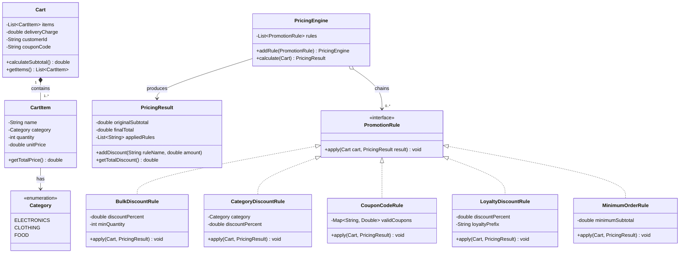
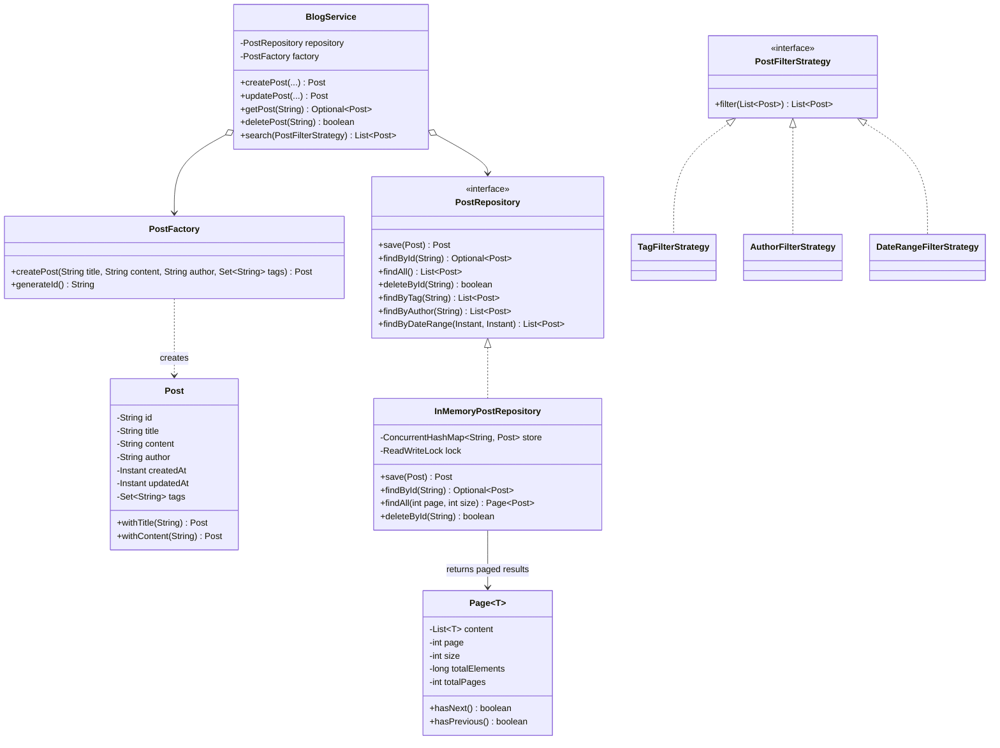
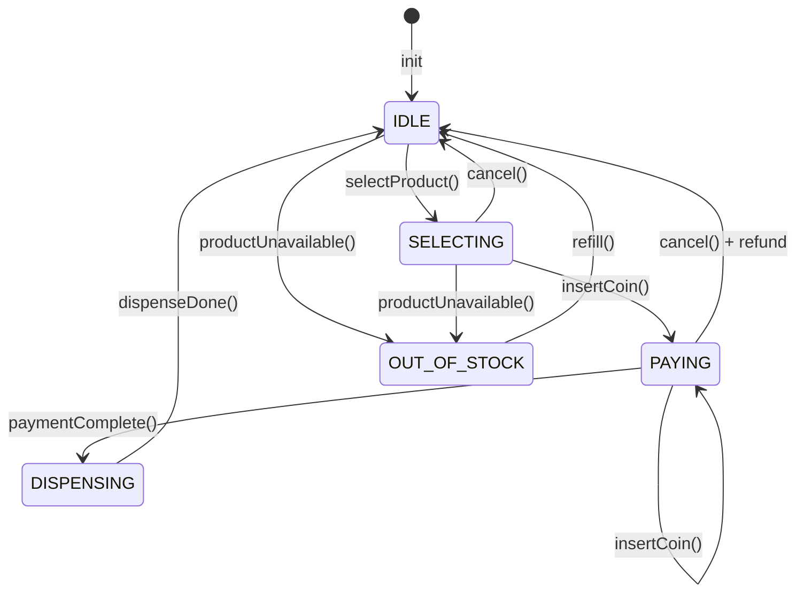
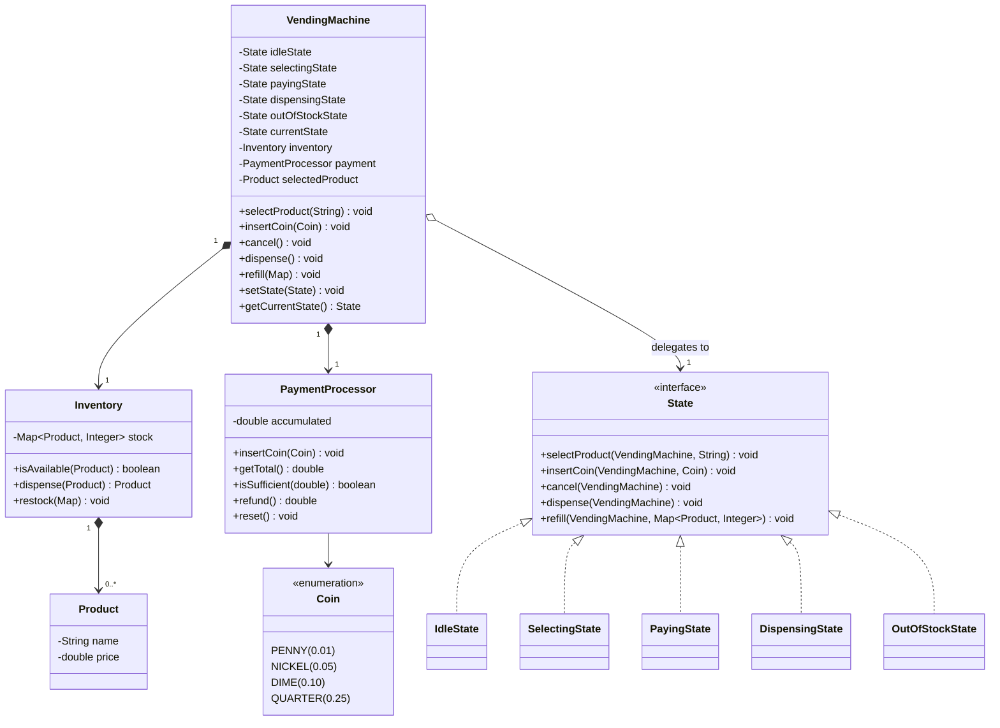
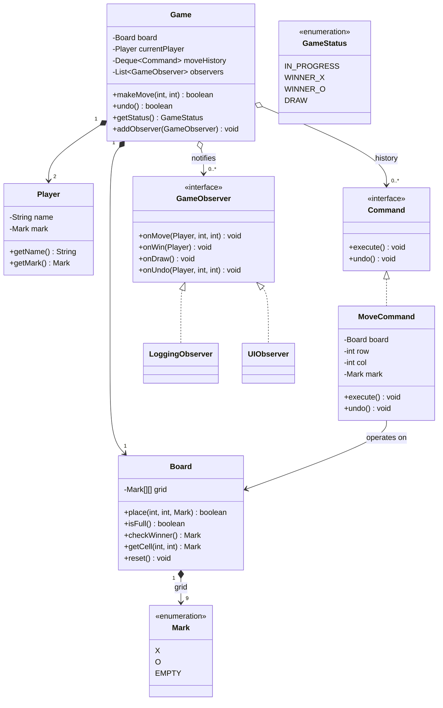
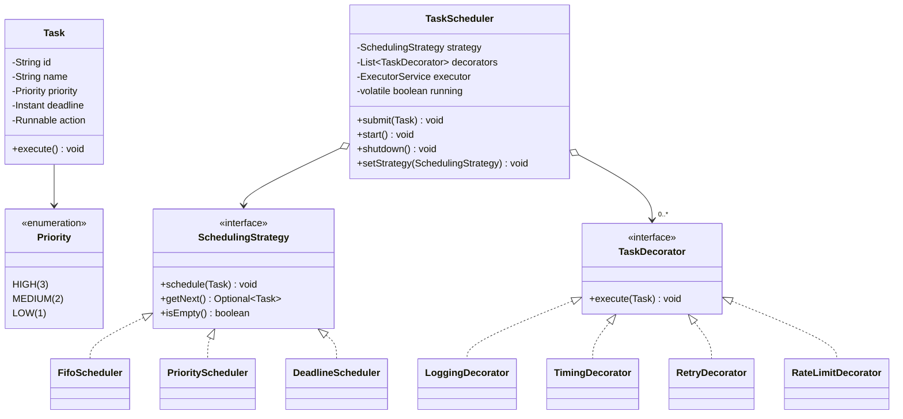
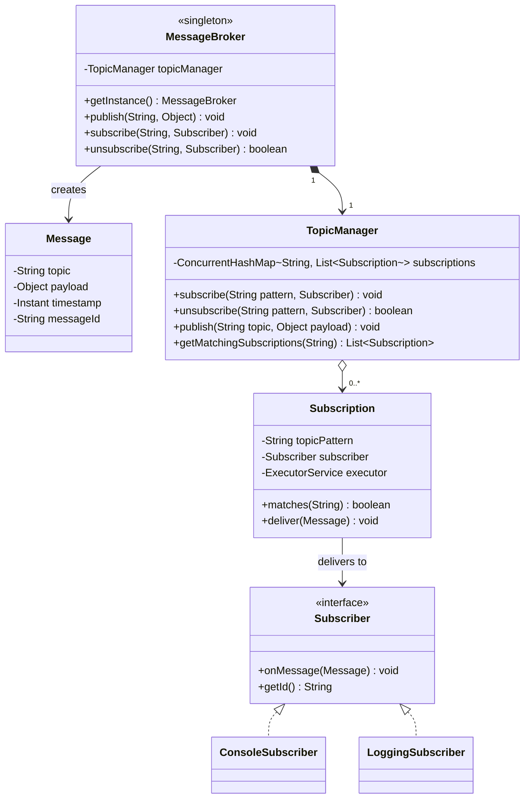

# LLD Design Pattern Interview Problems — 10 Must-Know Problems

## Why This Matters

In senior/principal engineer interviews, after basic LLD (Parking Lot, Elevator), you'll face **design-pattern-aware** problems that test:
- **Which pattern fits this problem?** — Can you identify the right pattern for composable rules?
- **Can you implement it cleanly?** — SOLID, testable, extensible code
- **Can you extend it?** — Adding new rules without modifying existing code (OCP)

Each problem below includes:
- **Problem statement** (interview-like)
- **Which design patterns solve it** + why
- **Mermaid class diagram** (visual architecture)
- **Full Java implementation** (production-quality)
- **Extension scenarios** (show you can scale it)

---

## Problem 1: Composable Pricing Engine (Chain of Responsibility + Strategy)

### Problem Statement

You are building a pricing engine for an e-commerce platform.

When a customer checks out, their cart total passes through a chain of promotion rules — each rule may or may not apply a discount, and the result of one rule feeds into the next. Rules must be **composable** (chainable in any order), **independently testable**, and **easy to add** without touching existing code.

**The Cart:**
- A list of items, each with: `name`, `category` (ELECTRONICS, CLOTHING, FOOD), `quantity`, `unitPrice`
- A `deliveryCharge`
- A `customerId` (used for loyalty checks)
- A `couponCode` (optional, nullable)

**Promotion Rules (implement at least 5):**
1. **Bulk Discount**: 10% off any item with quantity ≥ 3
2. **Category Discount**: 15% off all ELECTRONICS items
3. **Coupon Code**: Code `SAVE20` gives a flat 20% off the subtotal
4. **Loyalty Discount**: Customers with ID prefixed `LOYAL_` get 5% off the final total
5. **Minimum Order**: No discounts apply if cart subtotal < ₹500

**Design and implement this engine in Java.**

### Design Patterns Used

| Pattern | Why |
|---------|-----|
| **Chain of Responsibility** | Each rule applies in sequence; the result of one feeds the next; rules can be reordered, added, or removed dynamically |
| **Strategy** | Each rule is a strategy — independently testable and swappable |
| **Builder** (optional) | Build the rule chain fluently |

### Mermaid Diagram



### Implementation

```java
import java.util.*;
import java.util.concurrent.CopyOnWriteArrayList;

// === ENUMS ===
enum Category { ELECTRONICS, CLOTHING, FOOD }

// === VALUE OBJECTS ===
class CartItem {
    private final String name;
    private final Category category;
    private final int quantity;
    private final double unitPrice;

    public CartItem(String name, Category category, int quantity, double unitPrice) {
        this.name = name;
        this.category = category;
        this.quantity = quantity;
        this.unitPrice = unitPrice;
    }

    public String getName() { return name; }
    public Category getCategory() { return category; }
    public int getQuantity() { return quantity; }
    public double getUnitPrice() { return unitPrice; }
    public double getTotalPrice() { return quantity * unitPrice; }
}

class Cart {
    private final List<CartItem> items;
    private final double deliveryCharge;
    private final String customerId;
    private final String couponCode;

    public Cart(List<CartItem> items, double deliveryCharge, String customerId, String couponCode) {
        this.items = Collections.unmodifiableList(new ArrayList<>(items));
        this.deliveryCharge = deliveryCharge;
        this.customerId = customerId;
        this.couponCode = couponCode;
    }

    public List<CartItem> getItems() { return items; }
    public double getDeliveryCharge() { return deliveryCharge; }
    public String getCustomerId() { return customerId; }
    public Optional<String> getCouponCode() { return Optional.ofNullable(couponCode); }

    public double calculateSubtotal() {
        return items.stream().mapToDouble(CartItem::getTotalPrice).sum();
    }
}

class PricingResult {
    private final double originalSubtotal;
    private double finalTotal;
    private double deliveryCharge;
    private final List<String> appliedRules = new ArrayList<>();
    private boolean discountsBlocked = false;

    public PricingResult(double originalSubtotal, double deliveryCharge) {
        this.originalSubtotal = originalSubtotal;
        this.finalTotal = originalSubtotal;
        this.deliveryCharge = deliveryCharge;
    }

    public double getOriginalSubtotal() { return originalSubtotal; }
    public double getFinalTotal() { return finalTotal; }
    public double getDeliveryCharge() { return deliveryCharge; }

    public void blockDiscounts() { this.discountsBlocked = true; }
    public boolean isDiscountsBlocked() { return discountsBlocked; }

    public void applyPercentageDiscount(String ruleName, double percent) {
        if (discountsBlocked) return;
        double discount = finalTotal * (percent / 100.0);
        finalTotal -= discount;
        appliedRules.add(ruleName + ": -" + String.format("%.2f", discount));
    }

    public void applyFlatDiscount(String ruleName, double amount) {
        if (discountsBlocked) return;
        double discount = Math.min(amount, finalTotal);
        finalTotal -= discount;
        appliedRules.add(ruleName + ": -" + String.format("%.2f", discount));
    }

    public void applyItemDiscount(String ruleName, double discountAmount) {
        if (discountsBlocked) return;
        finalTotal -= discountAmount;
        appliedRules.add(ruleName + ": -" + String.format("%.2f", discountAmount));
    }

    public double getTotalDiscount() {
        return originalSubtotal - finalTotal;
    }

    public List<String> getAppliedRules() {
        return Collections.unmodifiableList(appliedRules);
    }

    @Override
    public String toString() {
        return "PricingResult{" +
                "originalSubtotal=" + String.format("%.2f", originalSubtotal) +
                ", finalTotal=" + String.format("%.2f", finalTotal) +
                ", deliveryCharge=" + String.format("%.2f", deliveryCharge) +
                ", grandTotal=" + String.format("%.2f", finalTotal + deliveryCharge) +
                ", totalDiscount=" + String.format("%.2f", getTotalDiscount()) +
                ", appliedRules=" + appliedRules +
                '}';
    }
}

// === PROMOTION RULE INTERFACE (Strategy Pattern) ===
@FunctionalInterface
interface PromotionRule {
    void apply(Cart cart, PricingResult result);
}

// === RULE 1: Bulk Discount ===
class BulkDiscountRule implements PromotionRule {
    private final double discountPercent;
    private final int minQuantity;

    public BulkDiscountRule(double discountPercent, int minQuantity) {
        this.discountPercent = discountPercent;
        this.minQuantity = minQuantity;
    }

    @Override
    public void apply(Cart cart, PricingResult result) {
        for (CartItem item : cart.getItems()) {
            if (item.getQuantity() >= minQuantity) {
                double itemDiscount = item.getTotalPrice() * (discountPercent / 100.0);
                result.applyItemDiscount(
                    "BulkDiscount(" + item.getName() + " qty≥" + minQuantity + ")",
                    itemDiscount
                );
            }
        }
    }
}

// === RULE 2: Category Discount ===
class CategoryDiscountRule implements PromotionRule {
    private final Category category;
    private final double discountPercent;

    public CategoryDiscountRule(Category category, double discountPercent) {
        this.category = category;
        this.discountPercent = discountPercent;
    }

    @Override
    public void apply(Cart cart, PricingResult result) {
        double categoryTotal = cart.getItems().stream()
            .filter(item -> item.getCategory() == category)
            .mapToDouble(CartItem::getTotalPrice)
            .sum();
        if (categoryTotal > 0) {
            result.applyPercentageDiscount(
                "CategoryDiscount(" + category + ")", discountPercent
            );
        }
    }
}

// === RULE 3: Coupon Code ===
class CouponCodeRule implements PromotionRule {
    private final Map<String, Double> validCoupons; // couponCode -> discountPercent

    public CouponCodeRule(Map<String, Double> validCoupons) {
        this.validCoupons = Collections.unmodifiableMap(new HashMap<>(validCoupons));
    }

    @Override
    public void apply(Cart cart, PricingResult result) {
        cart.getCouponCode().ifPresent(code -> {
            Double discountPercent = validCoupons.get(code);
            if (discountPercent != null) {
                result.applyPercentageDiscount("Coupon(" + code + ")", discountPercent);
            }
        });
    }
}

// === RULE 4: Loyalty Discount ===
class LoyaltyDiscountRule implements PromotionRule {
    private final double discountPercent;
    private final String loyaltyPrefix;

    public LoyaltyDiscountRule(double discountPercent, String loyaltyPrefix) {
        this.discountPercent = discountPercent;
        this.loyaltyPrefix = loyaltyPrefix;
    }

    @Override
    public void apply(Cart cart, PricingResult result) {
        if (cart.getCustomerId() != null && cart.getCustomerId().startsWith(loyaltyPrefix)) {
            result.applyPercentageDiscount("LoyaltyDiscount", discountPercent);
        }
    }
}

// === RULE 5: Minimum Order (Guard Rule) ===
class MinimumOrderRule implements PromotionRule {
    private final double minimumSubtotal;

    public MinimumOrderRule(double minimumSubtotal) {
        this.minimumSubtotal = minimumSubtotal;
    }

    @Override
    public void apply(Cart cart, PricingResult result) {
        if (cart.calculateSubtotal() < minimumSubtotal) {
            result.blockDiscounts();
        }
    }
}

// === PRICING ENGINE (Chain of Responsibility) ===
class PricingEngine {
    private final List<PromotionRule> rules = new CopyOnWriteArrayList<>();

    public PricingEngine addRule(PromotionRule rule) {
        this.rules.add(rule);
        return this; // fluent API
    }

    public PricingResult calculate(Cart cart) {
        PricingResult result = new PricingResult(cart.calculateSubtotal(), cart.getDeliveryCharge());
        for (PromotionRule rule : rules) {
            rule.apply(cart, result);
        }
        return result;
    }

    public List<PromotionRule> getRules() {
        return Collections.unmodifiableList(rules);
    }
}

// === DEMO ===
public class PricingEngineDemo {
    public static void main(String[] args) {
        // Build rule chain
        PricingEngine engine = new PricingEngine()
            .addRule(new MinimumOrderRule(500))       // Guard: must be first
            .addRule(new BulkDiscountRule(10, 3))     // 10% off items with qty ≥ 3
            .addRule(new CategoryDiscountRule(Category.ELECTRONICS, 15))
            .addRule(new CouponCodeRule(Map.of("SAVE20", 20.0, "WELCOME10", 10.0)))
            .addRule(new LoyaltyDiscountRule(5, "LOYAL_"));

        // Test 1: Normal cart with coupon
        Cart cart1 = new Cart(Arrays.asList(
            new CartItem("Laptop", Category.ELECTRONICS, 1, 50000),
            new CartItem("T-Shirt", Category.CLOTHING, 5, 500)  // bulk: qty ≥ 3
        ), 100, "CUST123", "SAVE20");

        System.out.println("=== Test 1: Normal cart with SAVE20 coupon ===");
        System.out.println(engine.calculate(cart1));

        // Test 2: Below minimum
        Cart cart2 = new Cart(Arrays.asList(
            new CartItem("Pen", Category.CLOTHING, 1, 10)
        ), 50, "CUST456", "SAVE20");

        System.out.println("\n=== Test 2: Below minimum (₹500) - No discounts ===");
        System.out.println(engine.calculate(cart2));

        // Test 3: Loyalty customer
        Cart cart3 = new Cart(Arrays.asList(
            new CartItem("Phone", Category.ELECTRONICS, 1, 30000)
        ), 0, "LOYAL_007", null);

        System.out.println("\n=== Test 3: Loyalty customer, no coupon ===");
        System.out.println(engine.calculate(cart3));

        // Test 4: Bulk + Category combined
        Cart cart4 = new Cart(Arrays.asList(
            new CartItem("Mouse", Category.ELECTRONICS, 3, 1500),  // bulk qty≥3
            new CartItem("Keyboard", Category.ELECTRONICS, 2, 2500)
        ), 200, "CUST789", null);

        System.out.println("\n=== Test 4: Bulk + Multiple Electronics ===");
        System.out.println(engine.calculate(cart4));
    }
}
```

### Extension Scenarios

| Extension | Change Required |
|-----------|----------------|
| New rule type (e.g., "Buy 2 Get 1 Free") | Create new class implementing `PromotionRule` — **no existing code changed** |
| Reorder rule execution | Change `addRule()` order — **rules are independent** |
| Dynamic rule loading from DB | `PromotionRule` loaded via factory at runtime |
| Multi-threaded cart processing | `CopyOnWriteArrayList` for rules; `Cart` is immutable |
| Rule with priority/weight | Add `int order()` method to `PromotionRule` + sort before execution |
| Percentage cap (max 50% total) | Add `TotalDiscountCapRule` at end of chain |

---

## Problem 2: Blogging Platform with In-Memory Store (Repository Pattern + Factory)

### Problem Statement

Design and implement a blogging platform **without Spring Boot** — use simple in-memory data structures. Requirements:
- Users can create, read, update, delete blog posts
- Posts have: `id`, `title`, `content`, `author`, `createdAt`, `updatedAt`, `tags`
- Support filtering by tag, author, date range
- Support pagination
- Thread-safe (multiple users accessing concurrently)

### Design Patterns Used

| Pattern | Why |
|---------|-----|
| **Repository Pattern** | Abstracts data storage (swap in-memory ↔ DB later) |
| **Factory Pattern** | Creates Post objects with generated IDs/dates |
| **Immutable Objects** | Thread-safety via immutable data classes |
| **Strategy** (for filtering) | Different filter strategies (by tag, author, date) |

### Mermaid Diagram



### Implementation

```java
import java.util.*;
import java.util.concurrent.*;
import java.util.concurrent.locks.*;
import java.util.stream.*;

// === IMMUTABLE DOMAIN OBJECT ===
class Post {
    private final String id;
    private final String title;
    private final String content;
    private final String author;
    private final Instant createdAt;
    private final Instant updatedAt;
    private final Set<String> tags;

    private Post(Builder builder) {
        this.id = builder.id;
        this.title = builder.title;
        this.content = builder.content;
        this.author = builder.author;
        this.createdAt = builder.createdAt;
        this.updatedAt = builder.updatedAt;
        this.tags = Collections.unmodifiableSet(new HashSet<>(builder.tags));
    }

    // Getters
    public String getId() { return id; }
    public String getTitle() { return title; }
    public String getContent() { return content; }
    public String getAuthor() { return author; }
    public Instant getCreatedAt() { return createdAt; }
    public Instant getUpdatedAt() { return updatedAt; }
    public Set<String> getTags() { return tags; }

    // Builder for modifications (immutable -> create new with changes)
    public Post withTitle(String newTitle) {
        return new Builder(this).title(newTitle).build();
    }

    public Post withContent(String newContent) {
        return new Builder(this).content(newContent).build();
    }

    public Post withTags(Set<String> newTags) {
        return new Builder(this).tags(newTags).build();
    }

    public Post withUpdatedAt(Instant now) {
        return new Builder(this).updatedAt(now).build();
    }

    @Override
    public boolean equals(Object o) {
        if (this == o) return true;
        if (!(o instanceof Post post)) return false;
        return id.equals(post.id);
    }

    @Override
    public int hashCode() { return Objects.hash(id); }

    @Override
    public String toString() {
        return "Post{id='" + id + "', title='" + title + "', author='" + author + "'}";
    }

    // === BUILDER ===
    static class Builder {
        private String id;
        private String title;
        private String content;
        private String author;
        private Instant createdAt;
        private Instant updatedAt;
        private Set<String> tags = new HashSet<>();

        Builder() {}

        Builder(Post existing) {
            this.id = existing.id;
            this.title = existing.title;
            this.content = existing.content;
            this.author = existing.author;
            this.createdAt = existing.createdAt;
            this.updatedAt = existing.updatedAt;
            this.tags = new HashSet<>(existing.tags);
        }

        Builder id(String id) { this.id = id; return this; }
        Builder title(String title) { this.title = title; return this; }
        Builder content(String content) { this.content = content; return this; }
        Builder author(String author) { this.author = author; return this; }
        Builder createdAt(Instant createdAt) { this.createdAt = createdAt; return this; }
        Builder updatedAt(Instant updatedAt) { this.updatedAt = updatedAt; return this; }
        Builder tags(Set<String> tags) { this.tags = tags; return this; }

        Post build() {
            Objects.requireNonNull(title, "title must not be null");
            Objects.requireNonNull(content, "content must not be null");
            Objects.requireNonNull(author, "author must not be null");
            return new Post(this);
        }
    }
}

// === PAGINATION VALUE OBJECT ===
class Page<T> {
    private final List<T> content;
    private final int page;
    private final int size;
    private final long totalElements;

    public Page(List<T> content, int page, int size, long totalElements) {
        this.content = Collections.unmodifiableList(content);
        this.page = page;
        this.size = size;
        this.totalElements = totalElements;
    }

    public List<T> getContent() { return content; }
    public int getPage() { return page; }
    public int getSize() { return size; }
    public long getTotalElements() { return totalElements; }
    public int getTotalPages() { return (int) Math.ceil((double) totalElements / size); }
    public boolean hasNext() { return page < getTotalPages() - 1; }
    public boolean hasPrevious() { return page > 0; }
}

// === FACTORY ===
class PostFactory {
    private final AtomicLong idCounter = new AtomicLong(1);

    public Post createPost(String title, String content, String author, Set<String> tags) {
        String id = "POST-" + idCounter.getAndIncrement();
        Instant now = Instant.now();
        return new Post.Builder()
            .id(id)
            .title(title)
            .content(content)
            .author(author)
            .createdAt(now)
            .updatedAt(now)
            .tags(tags != null ? tags : new HashSet<>())
            .build();
    }
}

// === REPOSITORY INTERFACE ===
interface PostRepository {
    Post save(Post post);
    Optional<Post> findById(String id);
    Page<Post> findAll(int page, int size);
    boolean deleteById(String id);
    List<Post> findByTag(String tag);
    List<Post> findByAuthor(String author);
    List<Post> findByDateRange(Instant from, Instant to);
}

// === IN-MEMORY IMPLEMENTATION ===
class InMemoryPostRepository implements PostRepository {
    private final ConcurrentHashMap<String, Post> store = new ConcurrentHashMap<>();
    private final ReadWriteLock lock = new ReentrantReadWriteLock();

    @Override
    public Post save(Post post) {
        Objects.requireNonNull(post, "post must not be null");
        store.put(post.getId(), post);
        return post;
    }

    @Override
    public Optional<Post> findById(String id) {
        return Optional.ofNullable(store.get(id));
    }

    @Override
    public Page<Post> findAll(int page, int size) {
        lock.readLock().lock();
        try {
            List<Post> all = new ArrayList<>(store.values());
            // Sort by createdAt descending (newest first)
            all.sort(Comparator.comparing(Post::getCreatedAt).reversed());
            return paginate(all, page, size);
        } finally {
            lock.readLock().unlock();
        }
    }

    @Override
    public boolean deleteById(String id) {
        return store.remove(id) != null;
    }

    @Override
    public List<Post> findByTag(String tag) {
        return store.values().stream()
            .filter(p -> p.getTags().contains(tag))
            .sorted(Comparator.comparing(Post::getCreatedAt).reversed())
            .collect(Collectors.toList());
    }

    @Override
    public List<Post> findByAuthor(String author) {
        return store.values().stream()
            .filter(p -> p.getAuthor().equals(author))
            .sorted(Comparator.comparing(Post::getCreatedAt).reversed())
            .collect(Collectors.toList());
    }

    @Override
    public List<Post> findByDateRange(Instant from, Instant to) {
        return store.values().stream()
            .filter(p -> !p.getCreatedAt().isBefore(from) && !p.getCreatedAt().isAfter(to))
            .sorted(Comparator.comparing(Post::getCreatedAt).reversed())
            .collect(Collectors.toList());
    }

    private Page<Post> paginate(List<Post> sorted, int page, int size) {
        int totalElements = sorted.size();
        int fromIndex = page * size;
        if (fromIndex >= totalElements) {
            return new Page<>(Collections.emptyList(), page, size, totalElements);
        }
        int toIndex = Math.min(fromIndex + size, totalElements);
        return new Page<>(sorted.subList(fromIndex, toIndex), page, size, totalElements);
    }
}

// === STRATEGY: Post Filter ===
@FunctionalInterface
interface PostFilterStrategy {
    List<Post> filter(List<Post> posts);
}

class TagFilter implements PostFilterStrategy {
    private final String tag;
    public TagFilter(String tag) { this.tag = tag; }
    @Override
    public List<Post> filter(List<Post> posts) {
        return posts.stream()
            .filter(p -> p.getTags().contains(tag))
            .collect(Collectors.toList());
    }
}

class AuthorFilter implements PostFilterStrategy {
    private final String author;
    public AuthorFilter(String author) { this.author = author; }
    @Override
    public List<Post> filter(List<Post> posts) {
        return posts.stream()
            .filter(p -> p.getAuthor().equals(author))
            .collect(Collectors.toList());
    }
}

// === SERVICE LAYER ===
class BlogService {
    private final PostRepository repository;
    private final PostFactory factory;

    public BlogService(PostRepository repository, PostFactory factory) {
        this.repository = repository;
        this.factory = factory;
    }

    public Post createPost(String title, String content, String author, Set<String> tags) {
        Post post = factory.createPost(title, content, author, tags);
        return repository.save(post);
    }

    public Optional<Post> getPost(String id) {
        return repository.findById(id);
    }

    public Optional<Post> updatePost(String id, String newTitle, String newContent) {
        return repository.findById(id).map(existing -> {
            Post updated = existing
                .withTitle(newTitle != null ? newTitle : existing.getTitle())
                .withContent(newContent != null ? newContent : existing.getContent())
                .withUpdatedAt(Instant.now());
            return repository.save(updated);
        });
    }

    public boolean deletePost(String id) {
        return repository.deleteById(id);
    }

    public Page<Post> listPosts(int page, int size) {
        return repository.findAll(page, size);
    }

    public List<Post> search(PostFilterStrategy strategy) {
        List<Post> all = new ArrayList<>();
        Page<Post> page = repository.findAll(0, Integer.MAX_VALUE);
        return strategy.filter(page.getContent());
    }
}

// === DEMO ===
public class BlogPlatformDemo {
    public static void main(String[] args) {
        BlogService blog = new BlogService(new InMemoryPostRepository(), new PostFactory());

        Post p1 = blog.createPost("Java 21 Features",
            "Virtual threads, pattern matching, records...",
            "alice", Set.of("java", "programming"));

        Post p2 = blog.createPost("Design Patterns in Spring",
            "Factory, Strategy, Proxy patterns in Spring Boot...",
            "bob", Set.of("spring", "design-patterns", "java"));

        Post p3 = blog.createPost("Kafka Deep Dive",
            "Partitioning, replication, consumer groups...",
            "alice", Set.of("kafka", "distributed-systems"));

        System.out.println("=== All Posts (Page 0, size 2) ===");
        Page<Post> page = blog.listPosts(0, 2);
        page.getContent().forEach(System.out::println);
        System.out.println("Page " + page.getPage() + "/" + page.getTotalPages() +
            ", hasNext=" + page.hasNext());

        System.out.println("\n=== Search by tag 'java' ===");
        blog.search(new TagFilter("java")).forEach(System.out::println);

        System.out.println("\n=== Search by author 'alice' ===");
        blog.search(new AuthorFilter("alice")).forEach(System.out::println);
    }
}
```

### Extension Scenarios

| Extension | Change |
|-----------|--------|
| Database-backed storage | Implement `PostRepository` with JDBC/JPA — swap in constructor |
| Search by keyword | Add `KeywordFilter` implementing `PostFilterStrategy` |
| Post comments | New `Comment` entity + `CommentRepository` |
| Authentication | `AuthService` wrapping `BlogService` with authorization checks |

---

## Problem 3: Vending Machine State Machine (State Pattern)

### Problem Statement

Design a vending machine using the **State pattern**. The machine has these states:
- **IDLE**: Waiting for user to select a product
- **SELECTING**: Product selected, waiting for payment
- **PAYING**: Inserting coins, accumulating amount
- **DISPENSING**: Dispensing product and returning change
- **OUT_OF_STOCK**: Selected product is unavailable

Events: `selectProduct()`, `insertCoin()`, `cancel()`, `dispense()`, `refill()`

### Mermaid Diagram





### Implementation

```java
import java.util.*;
import java.util.concurrent.ConcurrentHashMap;

// === VALUE OBJECTS ===
enum Coin {
    PENNY(0.01), NICKEL(0.05), DIME(0.10), QUARTER(0.25);

    private final double value;
    Coin(double value) { this.value = value; }
    public double getValue() { return value; }
}

class Product {
    private final String name;
    private final double price;

    public Product(String name, double price) {
        this.name = name;
        this.price = price;
    }

    public String getName() { return name; }
    public double getPrice() { return price; }

    @Override
    public boolean equals(Object o) {
        if (this == o) return true;
        if (!(o instanceof Product product)) return false;
        return name.equals(product.name);
    }

    @Override
    public int hashCode() { return Objects.hash(name); }

    @Override
    public String toString() { return name + " ($" + String.format("%.2f", price) + ")"; }
}

// === INVENTORY ===
class Inventory {
    private final ConcurrentHashMap<Product, Integer> stock = new ConcurrentHashMap<>();

    public void addProduct(Product product, int quantity) {
        stock.merge(product, quantity, Integer::sum);
    }

    public void restock(Map<Product, Integer> items) {
        items.forEach(this::addProduct);
    }

    public boolean isAvailable(Product product) {
        return stock.getOrDefault(product, 0) > 0;
    }

    public Product dispense(Product product) {
        return stock.computeIfPresent(product, (p, qty) -> qty > 1 ? qty - 1 : null) != null
            ? product : null;
    }

    public Map<Product, Integer> getAll() {
        return Collections.unmodifiableMap(new HashMap<>(stock));
    }
}

// === PAYMENT PROCESSOR ===
class PaymentProcessor {
    private double accumulated = 0.0;

    public void insertCoin(Coin coin) {
        accumulated += coin.getValue();
    }

    public double getTotal() { return accumulated; }

    public boolean isSufficient(double price) {
        return accumulated >= price;
    }

    public double refund() {
        double amount = accumulated;
        accumulated = 0.0;
        return amount;
    }

    public void reset() { accumulated = 0.0; }
}

// === STATE INTERFACE ===
interface State {
    void selectProduct(VendingMachine machine, String productName);
    void insertCoin(VendingMachine machine, Coin coin);
    void cancel(VendingMachine machine);
    void dispense(VendingMachine machine);
    void refill(VendingMachine machine, Map<Product, Integer> items);
}

// === CONCRETE STATES ===
class IdleState implements State {
    @Override
    public void selectProduct(VendingMachine machine, String productName) {
        Product product = machine.getInventory().getAll().keySet().stream()
            .filter(p -> p.getName().equals(productName))
            .findFirst()
            .orElseThrow(() -> new IllegalStateException("Product not found: " + productName));

        if (!machine.getInventory().isAvailable(product)) {
            machine.setState(machine.getOutOfStockState());
            machine.getCurrentState().selectProduct(machine, productName);
            return;
        }

        machine.setSelectedProduct(product);
        machine.setState(machine.getSelectingState());
        System.out.println("Product '" + productName + "' selected. Price: $" +
            String.format("%.2f", product.getPrice()) + ". Please insert coins.");
    }

    @Override
    public void insertCoin(VendingMachine machine, Coin coin) {
        System.out.println("Please select a product first.");
    }

    @Override
    public void cancel(VendingMachine machine) {
        System.out.println("Nothing to cancel.");
    }

    @Override
    public void dispense(VendingMachine machine) {
        System.out.println("Please select a product first.");
    }

    @Override
    public void refill(VendingMachine machine, Map<Product, Integer> items) {
        machine.getInventory().restock(items);
        System.out.println("Machine refilled.");
    }
}

class SelectingState implements State {
    @Override
    public void selectProduct(VendingMachine machine, String productName) {
        System.out.println("Product already selected: " + machine.getSelectedProduct().getName());
    }

    @Override
    public void insertCoin(VendingMachine machine, Coin coin) {
        machine.getPayment().insertCoin(coin);
        machine.setState(machine.getPayingState());
        System.out.println("Inserted " + coin + ". Total: $" +
            String.format("%.2f", machine.getPayment().getTotal()));
    }

    @Override
    public void cancel(VendingMachine machine) {
        machine.setSelectedProduct(null);
        machine.setState(machine.getIdleState());
        System.out.println("Selection cancelled.");
    }

    @Override
    public void dispense(VendingMachine machine) {
        System.out.println("Please insert coins first.");
    }

    @Override
    public void refill(VendingMachine machine, Map<Product, Integer> items) {
        machine.getInventory().restock(items);
        System.out.println("Machine refilled.");
    }
}

class PayingState implements State {
    @Override
    public void selectProduct(VendingMachine machine, String productName) {
        System.out.println("Already in payment process for " +
            machine.getSelectedProduct().getName());
    }

    @Override
    public void insertCoin(VendingMachine machine, Coin coin) {
        machine.getPayment().insertCoin(coin);
        double total = machine.getPayment().getTotal();
        double price = machine.getSelectedProduct().getPrice();
        System.out.println("Inserted " + coin + ". Total: $" + String.format("%.2f", total));

        if (total >= price) {
            machine.setState(machine.getDispensingState());
            machine.getCurrentState().dispense(machine);
        }
    }

    @Override
    public void cancel(VendingMachine machine) {
        double refund = machine.getPayment().refund();
        machine.setSelectedProduct(null);
        machine.setState(machine.getIdleState());
        System.out.println("Transaction cancelled. Refunded: $" +
            String.format("%.2f", refund));
    }

    @Override
    public void dispense(VendingMachine machine) {
        System.out.println("Insufficient payment. Please insert more coins.");
    }

    @Override
    public void refill(VendingMachine machine, Map<Product, Integer> items) {
        System.out.println("Cannot refill during payment.");
    }
}

class DispensingState implements State {
    @Override
    public void selectProduct(VendingMachine machine, String productName) {
        System.out.println("Please wait, dispensing in progress...");
    }

    @Override
    public void insertCoin(VendingMachine machine, Coin coin) {
        System.out.println("Please wait, dispensing in progress...");
    }

    @Override
    public void cancel(VendingMachine machine) {
        System.out.println("Cannot cancel — dispensing in progress.");
    }

    @Override
    public void dispense(VendingMachine machine) {
        Product product = machine.getInventory().dispense(machine.getSelectedProduct());
        if (product != null) {
            double change = machine.getPayment().getTotal() - product.getPrice();
            machine.getPayment().reset();
            machine.setSelectedProduct(null);
            machine.setState(machine.getIdleState());
            System.out.println("Dispensed: " + product.getName());
            if (change > 0) {
                System.out.println("Change returned: $" + String.format("%.2f", change));
            }
        } else {
            System.out.println("Error: Product unavailable. Refunding...");
            machine.getPayment().refund();
            machine.setSelectedProduct(null);
            machine.setState(machine.getIdleState());
        }
    }

    @Override
    public void refill(VendingMachine machine, Map<Product, Integer> items) {
        System.out.println("Cannot refill during dispensing.");
    }
}

class OutOfStockState implements State {
    @Override
    public void selectProduct(VendingMachine machine, String productName) {
        System.out.println("Product '" + productName + "' is out of stock.");
    }

    @Override
    public void insertCoin(VendingMachine machine, Coin coin) {
        System.out.println("Product out of stock. Cannot accept payment.");
    }

    @Override
    public void cancel(VendingMachine machine) {
        System.out.println("Nothing to cancel.");
    }

    @Override
    public void dispense(VendingMachine machine) {
        System.out.println("Product out of stock.");
    }

    @Override
    public void refill(VendingMachine machine, Map<Product, Integer> items) {
        machine.getInventory().restock(items);
        machine.setState(machine.getIdleState());
        System.out.println("Machine refilled. Ready for use.");
    }
}

// === VENDING MACHINE (Context) ===
class VendingMachine {
    private final State idleState = new IdleState();
    private final State selectingState = new SelectingState();
    private final State payingState = new PayingState();
    private final State dispensingState = new DispensingState();
    private final State outOfStockState = new OutOfStockState();

    private State currentState = idleState;
    private final Inventory inventory = new Inventory();
    private final PaymentProcessor payment = new PaymentProcessor();
    private Product selectedProduct;

    public void selectProduct(String productName) {
        currentState.selectProduct(this, productName);
    }

    public void insertCoin(Coin coin) {
        currentState.insertCoin(this, coin);
    }

    public void cancel() {
        currentState.cancel(this);
    }

    public void refill(Map<Product, Integer> items) {
        currentState.refill(this, items);
    }

    // Internal setters for state transitions
    void setState(State state) { this.currentState = state; }
    State getCurrentState() { return currentState; }
    void setSelectedProduct(Product product) { this.selectedProduct = product; }
    Product getSelectedProduct() { return selectedProduct; }
    Inventory getInventory() { return inventory; }
    PaymentProcessor getPayment() { return payment; }

    // State accessors for transitions
    State getIdleState() { return idleState; }
    State getSelectingState() { return selectingState; }
    State getPayingState() { return payingState; }
    State getDispensingState() { return dispensingState; }
    State getOutOfStockState() { return outOfStockState; }
}

// === DEMO ===
public class VendingMachineDemo {
    public static void main(String[] args) {
        VendingMachine machine = new VendingMachine();

        // Stock products
        machine.refill(Map.of(
            new Product("Coke", 1.50), 5,
            new Product("Chips", 1.00), 3,
            new Product("Chocolate", 2.00), 0  // out of stock
        ));

        System.out.println("=== Test 1: Normal purchase ===");
        machine.selectProduct("Coke");
        machine.insertCoin(Coin.QUARTER);
        machine.insertCoin(Coin.QUARTER);
        machine.insertCoin(Coin.QUARTER);
        machine.insertCoin(Coin.QUARTER);
        machine.insertCoin(Coin.QUARTER);
        machine.insertCoin(Coin.QUARTER);  // $1.50

        System.out.println("\n=== Test 2: Cancel during payment ===");
        machine.selectProduct("Chips");
        machine.insertCoin(Coin.DIME);
        machine.cancel();

        System.out.println("\n=== Test 3: Out of stock ===");
        machine.selectProduct("Chocolate");

        System.out.println("\n=== Test 4: Exact change ===");
        machine.selectProduct("Chips");
        machine.insertCoin(Coin.QUARTER);
        machine.insertCoin(Coin.QUARTER);
        machine.insertCoin(Coin.QUARTER);
        machine.insertCoin(Coin.QUARTER);  // $1.00
    }
}
```

### Pattern Summary

**State Pattern** — The vending machine's behavior changes completely based on its internal state. Each state encapsulates the behavior for all possible events. Adding a new state (e.g., `MAINTENANCE`) doesn't modify existing states.

---

## Problem 4: Tic-Tac-Toe Game (Command Pattern + Observer)

### Problem Statement

Design a Tic-Tac-Toe game supporting:
- 3x3 board, 2 players (X and O)
- Move validation (can't play on occupied cell, must be in turn)
- Win detection (rows, columns, diagonals)
- Draw detection (board full, no winner)
- **Undo support** (Command pattern)
- **Game event notifications** (Observer pattern — log moves, notify UI)

### Mermaid Diagram



### Implementation

```java
import java.util.*;

// === ENUMS ===
enum Mark { X, O, EMPTY }
enum GameStatus { IN_PROGRESS, WINNER_X, WINNER_O, DRAW }

// === PLAYER ===
record Player(String name, Mark mark) {}

// === BOARD ===
class Board {
    private final Mark[][] grid = new Mark[3][3];

    public Board() { reset(); }

    public void reset() {
        for (Mark[] row : grid) Arrays.fill(row, Mark.EMPTY);
    }

    public boolean place(int row, int col, Mark mark) {
        if (row < 0 || row > 2 || col < 0 || col > 2) return false;
        if (grid[row][col] != Mark.EMPTY) return false;
        grid[row][col] = mark;
        return true;
    }

    public void clearCell(int row, int col) {
        if (row >= 0 && row <= 2 && col >= 0 && col <= 2) {
            grid[row][col] = Mark.EMPTY;
        }
    }

    public Mark getCell(int row, int col) { return grid[row][col]; }

    public boolean isFull() {
        return Arrays.stream(grid).flatMap(Arrays::stream).noneMatch(m -> m == Mark.EMPTY);
    }

    public Mark checkWinner() {
        // Rows & Columns
        for (int i = 0; i < 3; i++) {
            if (grid[i][0] != Mark.EMPTY && grid[i][0] == grid[i][1] && grid[i][1] == grid[i][2])
                return grid[i][0];
            if (grid[0][i] != Mark.EMPTY && grid[0][i] == grid[1][i] && grid[1][i] == grid[2][i])
                return grid[0][i];
        }
        // Diagonals
        if (grid[0][0] != Mark.EMPTY && grid[0][0] == grid[1][1] && grid[1][1] == grid[2][2])
            return grid[0][0];
        if (grid[0][2] != Mark.EMPTY && grid[0][2] == grid[1][1] && grid[1][1] == grid[2][0])
            return grid[0][2];
        return null;
    }

    public void print() {
        for (int r = 0; r < 3; r++) {
            for (int c = 0; c < 3; c++) {
                char ch = grid[r][c] == Mark.EMPTY ? '.' : grid[r][c].name().charAt(0);
                System.out.print(ch + " ");
            }
            System.out.println();
        }
    }
}

// === COMMAND INTERFACE ===
interface Command {
    void execute();
    void undo();
}

// === MOVE COMMAND ===
class MoveCommand implements Command {
    private final Board board;
    private final int row;
    private final int col;
    private final Mark mark;
    private boolean executed = false;

    public MoveCommand(Board board, int row, int col, Mark mark) {
        this.board = board;
        this.row = row;
        this.col = col;
        this.mark = mark;
    }

    @Override
    public void execute() {
        if (!executed && board.place(row, col, mark)) {
            executed = true;
        }
    }

    @Override
    public void undo() {
        if (executed) {
            board.clearCell(row, col);
            executed = false;
        }
    }

    public int getRow() { return row; }
    public int getCol() { return col; }
    public Mark getMark() { return mark; }
}

// === OBSERVER INTERFACE ===
interface GameObserver {
    void onMove(Player player, int row, int col);
    void onWin(Player winner);
    void onDraw();
    void onUndo(Player player, int row, int col);
}

// === LOGGING OBSERVER ===
class LoggingObserver implements GameObserver {
    @Override
    public void onMove(Player player, int row, int col) {
        System.out.println("[LOG] " + player.name() + " (" + player.mark() +
            ") placed at (" + row + "," + col + ")");
    }

    @Override
    public void onWin(Player winner) {
        System.out.println("[LOG] " + winner.name() + " wins!");
    }

    @Override
    public void onDraw() {
        System.out.println("[LOG] Game is a draw!");
    }

    @Override
    public void onUndo(Player player, int row, int col) {
        System.out.println("[LOG] " + player.name() + " undid move at (" + row + "," + col + ")");
    }
}

// === GAME ===
class Game {
    private final Board board = new Board();
    private final Player[] players;
    private Player currentPlayer;
    private GameStatus status = GameStatus.IN_PROGRESS;
    private final Deque<MoveCommand> moveHistory = new ArrayDeque<>();
    private final List<GameObserver> observers = new ArrayList<>();

    public Game(String player1Name, String player2Name) {
        this.players = new Player[]{
            new Player(player1Name, Mark.X),
            new Player(player2Name, Mark.O)
        };
        this.currentPlayer = players[0];
    }

    public void addObserver(GameObserver observer) {
        observers.add(observer);
    }

    public boolean makeMove(int row, int col) {
        if (status != GameStatus.IN_PROGRESS) {
            System.out.println("Game is already over!");
            return false;
        }

        MoveCommand cmd = new MoveCommand(board, row, col, currentPlayer.mark());
        cmd.execute();

        // Check if move was valid (board accepted it)
        if (board.getCell(row, col) != currentPlayer.mark()) {
            return false;
        }

        moveHistory.push(cmd);
        notifyMove(currentPlayer, row, col);

        // Check win/draw
        Mark winner = board.checkWinner();
        if (winner != null) {
            status = winner == Mark.X ? GameStatus.WINNER_X : GameStatus.WINNER_O;
            notifyWin(currentPlayer);
            return true;
        }

        if (board.isFull()) {
            status = GameStatus.DRAW;
            notifyDraw();
            return true;
        }

        // Switch turn
        currentPlayer = (currentPlayer == players[0]) ? players[1] : players[0];
        return true;
    }

    public boolean undo() {
        if (moveHistory.isEmpty()) {
            System.out.println("No moves to undo!");
            return false;
        }

        MoveCommand lastMove = moveHistory.pop();
        lastMove.undo();
        notifyUndo(currentPlayer, lastMove.getRow(), lastMove.getCol());

        // Switch turn back
        currentPlayer = (currentPlayer == players[0]) ? players[1] : players[0];
        status = GameStatus.IN_PROGRESS; // Revert from win/draw
        return true;
    }

    public GameStatus getStatus() { return status; }
    public Player getCurrentPlayer() { return currentPlayer; }

    public void printBoard() {
        System.out.println("\nCurrent board (" + currentPlayer.name() + "'s turn):");
        board.print();
        System.out.println();
    }

    // === NOTIFY OBSERVERS ===
    private void notifyMove(Player p, int r, int c) {
        observers.forEach(o -> o.onMove(p, r, c));
    }
    private void notifyWin(Player p) {
        observers.forEach(o -> o.onWin(p));
    }
    private void notifyDraw() {
        observers.forEach(o -> o.onDraw());
    }
    private void notifyUndo(Player p, int r, int c) {
        observers.forEach(o -> o.onUndo(p, r, c));
    }
}

// === DEMO ===
public class TicTacToeDemo {
    public static void main(String[] args) {
        Game game = new Game("Alice", "Bob");
        game.addObserver(new LoggingObserver());

        // Play a game ending in win
        game.makeMove(0, 0); // Alice X
        game.makeMove(0, 1); // Bob O
        game.makeMove(1, 0); // Alice X
        game.makeMove(1, 1); // Bob O
        game.makeMove(2, 0); // Alice X -> wins (column 0)

        game.printBoard();
        System.out.println("Status: " + game.getStatus());

        // Undo and try different strategy
        System.out.println("\n=== Undo last move ===");
        game.undo();
        game.printBoard();

        game.makeMove(2, 2); // Alice X (now different move)
        game.printBoard();
    }
}
```

---

## Problem 5: Task Scheduler with Priority (Decorator + Strategy)

### Problem Statement

Design a task scheduler that:
- Accepts tasks with different priorities (HIGH, MEDIUM, LOW)
- Supports different scheduling strategies (FIFO, Priority-based, Deadline-aware)
- Supports **task decorators** for cross-cutting concerns: logging, timing, retry, rate-limiting
- Thread-safe

### Mermaid Diagram



### Implementation

```java
import java.util.*;
import java.util.concurrent.*;
import java.util.concurrent.atomic.AtomicLong;

// === VALUE OBJECTS ===
enum Priority { HIGH(3), MEDIUM(2), LOW(1);
    private final int value;
    Priority(int value) { this.value = value; }
    public int getValue() { return value; }
}

class Task {
    private static final AtomicLong idGen = new AtomicLong(1);
    private final String id;
    private final String name;
    private final Priority priority;
    private final Instant deadline;
    private final Runnable action;

    public Task(String name, Priority priority, Runnable action) {
        this(name, priority, null, action);
    }

    public Task(String name, Priority priority, Instant deadline, Runnable action) {
        this.id = "TASK-" + idGen.getAndIncrement();
        this.name = name;
        this.priority = priority;
        this.deadline = deadline;
        this.action = action;
    }

    public String getId() { return id; }
    public String getName() { return name; }
    public Priority getPriority() { return priority; }
    public Optional<Instant> getDeadline() { return Optional.ofNullable(deadline); }
    public void execute() { action.run(); }
}

// === TASK DECORATOR ===
@FunctionalInterface
interface TaskDecorator {
    void execute(Task task);
}

class LoggingDecorator implements TaskDecorator {
    @Override
    public void execute(Task task) {
        System.out.println("[LOG] Executing task: " + task.getId() + " (" + task.getName() + ")");
        task.execute();
    }
}

class TimingDecorator implements TaskDecorator {
    @Override
    public void execute(Task task) {
        long start = System.nanoTime();
        task.execute();
        long elapsed = (System.nanoTime() - start) / 1_000_000;
        System.out.println("[TIMING] Task '" + task.getName() + "' took " + elapsed + "ms");
    }
}

class RetryDecorator implements TaskDecorator {
    private final int maxRetries;

    public RetryDecorator(int maxRetries) {
        this.maxRetries = maxRetries;
    }

    @Override
    public void execute(Task task) {
        for (int attempt = 1; attempt <= maxRetries; attempt++) {
            try {
                task.execute();
                return;
            } catch (Exception e) {
                System.err.println("[RETRY] Attempt " + attempt + " failed for " +
                    task.getName() + ": " + e.getMessage());
                if (attempt == maxRetries) throw e;
            }
        }
    }
}

class RateLimitDecorator implements TaskDecorator {
    private final long minIntervalMs;
    private long lastExecuted = 0;

    public RateLimitDecorator(long minIntervalMs) {
        this.minIntervalMs = minIntervalMs;
    }

    @Override
    public synchronized void execute(Task task) {
        long now = System.currentTimeMillis();
        long waitMs = minIntervalMs - (now - lastExecuted);
        if (waitMs > 0) {
            try { Thread.sleep(waitMs); } catch (InterruptedException e) {
                Thread.currentThread().interrupt();
            }
        }
        task.execute();
        lastExecuted = System.currentTimeMillis();
    }
}

// === SCHEDULING STRATEGY ===
interface SchedulingStrategy {
    void submit(Task task);
    Optional<Task> getNext();
    boolean isEmpty();
}

class FifoScheduler implements SchedulingStrategy {
    private final Queue<Task> queue = new ConcurrentLinkedQueue<>();

    @Override
    public void submit(Task task) { queue.offer(task); }

    @Override
    public Optional<Task> getNext() { return Optional.ofNullable(queue.poll()); }

    @Override
    public boolean isEmpty() { return queue.isEmpty(); }
}

class PriorityScheduler implements SchedulingStrategy {
    private final PriorityBlockingQueue<Task> queue = new PriorityBlockingQueue<>(
        11, Comparator.comparingInt(t -> -t.getPriority().getValue())
    );

    @Override
    public void submit(Task task) { queue.offer(task); }

    @Override
    public Optional<Task> getNext() { return Optional.ofNullable(queue.poll()); }

    @Override
    public boolean isEmpty() { return queue.isEmpty(); }
}

class DeadlineScheduler implements SchedulingStrategy {
    private final PriorityBlockingQueue<Task> queue = new PriorityBlockingQueue<>(
        11, (t1, t2) -> {
            Instant d1 = t1.getDeadline().orElse(Instant.MAX);
            Instant d2 = t2.getDeadline().orElse(Instant.MAX);
            return d1.compareTo(d2); // Earliest deadline first
        }
    );

    @Override
    public void submit(Task task) {
        if (task.getDeadline().isEmpty()) {
            throw new IllegalArgumentException("DeadlineScheduler requires tasks with deadlines");
        }
        queue.offer(task);
    }

    @Override
    public Optional<Task> getNext() { return Optional.ofNullable(queue.poll()); }

    @Override
    public boolean isEmpty() { return queue.isEmpty(); }
}

// === TASK SCHEDULER ===
class TaskScheduler {
    private SchedulingStrategy strategy;
    private final List<TaskDecorator> decorators = new CopyOnWriteArrayList<>();
    private final ExecutorService executor = Executors.newSingleThreadExecutor();
    private volatile boolean running = false;

    public TaskScheduler(SchedulingStrategy strategy) {
        this.strategy = strategy;
    }

    public void setStrategy(SchedulingStrategy strategy) {
        this.strategy = strategy;
    }

    public TaskScheduler addDecorator(TaskDecorator decorator) {
        this.decorators.add(decorator);
        return this;
    }

    public void submit(Task task) {
        strategy.submit(task);
    }

    public void start() {
        running = true;
        executor.submit(() -> {
            while (running || !strategy.isEmpty()) {
                strategy.getNext().ifPresent(task -> {
                    // Apply decorators in chain
                    Runnable decorated = () -> {
                        // Execute decorators in reverse order (outermost runs first)
                        applyDecorators(task, 0);
                    };
                    decorated.run();
                });
                try { Thread.sleep(100); } catch (InterruptedException e) {
                    Thread.currentThread().interrupt();
                    break;
                }
            }
        });
    }

    private void applyDecorators(Task task, int index) {
        if (index < decorators.size()) {
            decorators.get(index).execute(new Task(task.getName(), task.getPriority(),
                task.getDeadline().orElse(null), () -> applyDecorators(task, index + 1)));
        } else {
            task.execute();
        }
    }

    public void shutdown() {
        running = false;
        executor.shutdown();
    }
}

// === DEMO ===
public class TaskSchedulerDemo {
    public static void main(String[] args) throws Exception {
        TaskScheduler scheduler = new TaskScheduler(new PriorityScheduler());
        scheduler.addDecorator(new LoggingDecorator());
        scheduler.addDecorator(new TimingDecorator());
        scheduler.addDecorator(new RetryDecorator(3));
        scheduler.addDecorator(new RateLimitDecorator(500)); // 500ms min interval

        scheduler.start();

        scheduler.submit(new Task("Low-priority task", Priority.LOW, () -> {
            System.out.println("  Low task running");
        }));

        scheduler.submit(new Task("High-priority task", Priority.HIGH, () -> {
            System.out.println("  HIGH task running");
            try { Thread.sleep(200); } catch (InterruptedException e) {}
        }));

        scheduler.submit(new Task("Medium-priority task", Priority.MEDIUM, () -> {
            System.out.println("  Medium task running");
        }));

        Thread.sleep(3000);
        scheduler.shutdown();
    }
}
```

---

## Problem 6: Pub-Sub Messaging System (Observer + Singleton)

### Problem Statement

Design an in-memory publish-subscribe messaging system.
- Topics identified by string name
- Publishers publish messages to topics
- Subscribers subscribe to topics and receive messages
- Support wildcard subscriptions (e.g., `orders.*` matches `orders.created`, `orders.shipped`)
- Support async delivery (subscriber runs in separate thread)
- Thread-safe

### Mermaid Diagram



### Implementation

```java
import java.util.*;
import java.util.concurrent.*;
import java.util.concurrent.atomic.AtomicLong;
import java.util.regex.Pattern;

// === MESSAGE ===
class Message {
    private static final AtomicLong idGen = new AtomicLong(1);
    private final String messageId;
    private final String topic;
    private final Object payload;
    private final Instant timestamp;

    public Message(String topic, Object payload) {
        this.messageId = "MSG-" + idGen.getAndIncrement();
        this.topic = topic;
        this.payload = payload;
        this.timestamp = Instant.now();
    }

    public String getMessageId() { return messageId; }
    public String getTopic() { return topic; }
    public Object getPayload() { return payload; }
    public Instant getTimestamp() { return timestamp; }

    @Override
    public String toString() {
        return "Message{id='" + messageId + "', topic='" + topic +
            "', payload=" + payload + ", time=" + timestamp + "}";
    }
}

// === SUBSCRIBER INTERFACE ===
interface Subscriber {
    void onMessage(Message message);
    default String getId() { return this.getClass().getSimpleName() + "@" + hashCode(); }
}

class ConsoleSubscriber implements Subscriber {
    private final String name;

    public ConsoleSubscriber(String name) { this.name = name; }

    @Override
    public void onMessage(Message message) {
        System.out.println("[" + name + "] Received: " + message);
    }

    @Override
    public String getId() { return name; }
}

class LoggingSubscriber implements Subscriber {
    private final List<Message> received = new CopyOnWriteArrayList<>();

    @Override
    public void onMessage(Message message) {
        received.add(message);
        System.out.println("[LogSubscriber] Logged message: " + message.getMessageId());
    }

    public List<Message> getReceived() { return received; }
}

// === SUBSCRIPTION ===
class Subscription {
    private final String topicPattern;
    private final Pattern regex;
    private final Subscriber subscriber;
    private final ExecutorService executor;

    public Subscription(String topicPattern, Subscriber subscriber, ExecutorService executor) {
        this.topicPattern = topicPattern;
        this.regex = Pattern.compile(wildcardToRegex(topicPattern));
        this.subscriber = subscriber;
        this.executor = executor;
    }

    private static String wildcardToRegex(String pattern) {
        return "^" + pattern
            .replace(".", "\\.")
            .replace("*", "[^.]+")
            .replace("#", ".*") + "$";
    }

    public boolean matches(String topic) {
        return regex.matcher(topic).matches();
    }

    public void deliver(Message message) {
        executor.submit(() -> {
            try {
                subscriber.onMessage(message);
            } catch (Exception e) {
                System.err.println("Error delivering to " + subscriber.getId() +
                    ": " + e.getMessage());
            }
        });
    }

    public Subscriber getSubscriber() { return subscriber; }
    public String getTopicPattern() { return topicPattern; }

    @Override
    public boolean equals(Object o) {
        if (this == o) return true;
        if (!(o instanceof Subscription that)) return false;
        return topicPattern.equals(that.topicPattern) && subscriber.equals(that.subscriber);
    }

    @Override
    public int hashCode() { return Objects.hash(topicPattern, subscriber); }
}

// === TOPIC MANAGER ===
class TopicManager {
    private final ConcurrentHashMap<String, List<Subscription>> subscriptions = new ConcurrentHashMap<>();

    public void subscribe(String topicPattern, Subscriber subscriber) {
        ExecutorService executor = Executors.newSingleThreadExecutor(r -> {
            Thread t = new Thread(r, "sub-" + subscriber.getId());
            t.setDaemon(true);
            return t;
        });
        Subscription sub = new Subscription(topicPattern, subscriber, executor);
        subscriptions.computeIfAbsent(topicPattern, k -> new CopyOnWriteArrayList<>()).add(sub);
    }

    public boolean unsubscribe(String topicPattern, Subscriber subscriber) {
        List<Subscription> subs = subscriptions.get(topicPattern);
        if (subs != null) {
            return subs.removeIf(s -> s.getSubscriber().equals(subscriber));
        }
        return false;
    }

    public void publish(String topic, Object payload) {
        Message message = new Message(topic, payload);
        for (List<Subscription> subs : subscriptions.values()) {
            for (Subscription sub : subs) {
                if (sub.matches(topic)) {
                    sub.deliver(message);
                }
            }
        }
    }
}

// === MESSAGE BROKER (Singleton) ===
class MessageBroker {
    private static final MessageBroker INSTANCE = new MessageBroker();
    private final TopicManager topicManager = new TopicManager();

    private MessageBroker() {}

    public static MessageBroker getInstance() { return INSTANCE; }

    public void publish(String topic, Object payload) {
        System.out.println("[Broker] Publishing to '" + topic + "': " + payload);
        topicManager.publish(topic, payload);
    }

    public void subscribe(String topicPattern, Subscriber subscriber) {
        topicManager.subscribe(topicPattern, subscriber);
    }

    public boolean unsubscribe(String topicPattern, Subscriber subscriber) {
        return topicManager.unsubscribe(topicPattern, subscriber);
    }
}

// === DEMO ===
public class PubSubDemo {
    public static void main(String[] args) throws Exception {
        MessageBroker broker = MessageBroker.getInstance();

        // Subscribe with wildcards
        broker.subscribe("orders.*", new ConsoleSubscriber("OrderHandler"));
        broker.subscribe("*.created", new ConsoleSubscriber("CreationLogger"));
        broker.subscribe("orders.#", new ConsoleSubscriber("AllOrders"));

        // Publish messages
        broker.publish("orders.created", Map.of("orderId", "ORD-123", "amount", 5000));
        broker.publish("orders.shipped", Map.of("orderId", "ORD-123", "tracking", "TRK-456"));
        broker.publish("payments.completed", Map.of("paymentId", "PAY-789"));

        // Wait for async delivery
        Thread.sleep(1000);
    }
}
```

---

## Problem 7: Logging Framework (Strategy + Singleton + Chain)

### Problem Statement

Design a logging framework that supports:
- Multiple log levels (DEBUG, INFO, WARN, ERROR, FATAL)
- Multiple appenders (Console, File, Database)
- Configurable log format (plain text, JSON, XML)
- Logger hierarchy (logger per class, inherits from parent config)
- Thread-safe

### Mermaid Diagram

```mermaid
classDiagram
    class LogLevel {
        <<enumeration>>
        DEBUG(1)
        INFO(2)
        WARN(3)
        ERROR(4)
        FATAL(5)
    }
    
    class Logger {
        -String name
        -LoggerConfig config
        -Logger parent
        +debug(String) void
        +info(String) void
        +warn(String) void
        +error(String) void
        +error(String, Throwable) void
        -log(LogLevel, String, Throwable) void
    }
    
    class LoggerConfig {
        -LogLevel minLevel
        -List~Appender~ appenders
        +isLevelEnabled(LogLevel) boolean
        +getAppenders() List~Appender~
    }
    
    class Appender {
        <<interface>>
        +append(LogEvent) void
    }
    
    class ConsoleAppender
    class FileAppender
    class DatabaseAppender
    
    class Formatter {
        <<interface>>
        +format(LogEvent) String
    }
    
    class PlainTextFormatter
    class JsonFormatter
    class XmlFormatter
    
    class LogEvent {
        -Instant timestamp
        -LogLevel level
        -String loggerName
        -String message
        -Throwable throwable
        -String threadName
    }
    
    LoggerManager {
        <<singleton>>
        -ConcurrentHashMap~String, Logger~ loggers
        +getLogger(String) Logger
    }
    
    LoggerManager --> "1" Logger : creates
    Logger "1" *--> "1" LoggerConfig
    Logger "0..1" --> "1" Logger : parent
    LoggerConfig o--> "0..*" Appender
    Appender <|.. ConsoleAppender
    Appender <|.. FileAppender
    Appender <|.. DatabaseAppender
    Appender "1" *--> "1" Formatter
    Formatter <|.. PlainTextFormatter
    Formatter <|.. JsonFormatter
    Formatter <|.. XmlFormatter
    LoggerManager --> LogEvent : creates
    Appender ..> LogEvent : formats
```

### Implementation

```java
import java.io.*;
import java.time.*;
import java.time.format.*;
import java.util.*;
import java.util.concurrent.*;

// === LOG LEVEL ===
enum LogLevel {
    DEBUG(1), INFO(2), WARN(3), ERROR(4), FATAL(5);
    private final int level;
    LogLevel(int level) { this.level = level; }
    public int getLevel() { return level; }
}

// === LOG EVENT ===
class LogEvent {
    private final Instant timestamp;
    private final LogLevel level;
    private final String loggerName;
    private final String message;
    private final Throwable throwable;
    private final String threadName;

    public LogEvent(LogLevel level, String loggerName, String message, Throwable throwable) {
        this.timestamp = Instant.now();
        this.level = level;
        this.loggerName = loggerName;
        this.message = message;
        this.throwable = throwable;
        this.threadName = Thread.currentThread().getName();
    }

    public Instant getTimestamp() { return timestamp; }
    public LogLevel getLevel() { return level; }
    public String getLoggerName() { return loggerName; }
    public String getMessage() { return message; }
    public Optional<Throwable> getThrowable() { return Optional.ofNullable(throwable); }
    public String getThreadName() { return threadName; }
}

// === FORMATTER (Strategy) ===
interface Formatter {
    String format(LogEvent event);
}

class PlainTextFormatter implements Formatter {
    private static final DateTimeFormatter DT_FMT =
        DateTimeFormatter.ofPattern("yyyy-MM-dd HH:mm:ss.SSS").withZone(ZoneOffset.UTC);

    @Override
    public String format(LogEvent event) {
        StringBuilder sb = new StringBuilder();
        sb.append(DT_FMT.format(event.getTimestamp())).append(" ")
            .append("[").append(event.getLevel()).append("] ")
            .append("[").append(event.getThreadName()).append("] ")
            .append(event.getLoggerName()).append(" - ")
            .append(event.getMessage());
        event.getThrowable().ifPresent(t -> {
            sb.append("\n").append(t.getClass().getName()).append(": ").append(t.getMessage());
            for (StackTraceElement e : t.getStackTrace()) {
                sb.append("\n\tat ").append(e);
            }
        });
        return sb.toString();
    }
}

class JsonFormatter implements Formatter {
    @Override
    public String format(LogEvent event) {
        StringBuilder sb = new StringBuilder();
        sb.append("{\"timestamp\":\"").append(event.getTimestamp()).append("\"")
            .append(",\"level\":\"").append(event.getLevel()).append("\"")
            .append(",\"thread\":\"").append(event.getThreadName()).append("\"")
            .append(",\"logger\":\"").append(event.getLoggerName()).append("\"")
            .append(",\"message\":\"").append(escapeJson(event.getMessage())).append("\"");
        event.getThrowable().ifPresent(t -> {
            sb.append(",\"exception\":\"").append(escapeJson(t.toString())).append("\"");
        });
        sb.append("}");
        return sb.toString();
    }

    private String escapeJson(String s) {
        return s.replace("\\", "\\\\").replace("\"", "\\\"")
            .replace("\n", "\\n").replace("\r", "\\r");
    }
}

// === APPENDER (Strategy) ===
interface Appender {
    void append(LogEvent event);
}

class ConsoleAppender implements Appender {
    private final Formatter formatter;

    public ConsoleAppender(Formatter formatter) {
        this.formatter = formatter;
    }

    @Override
    public void append(LogEvent event) {
        String output = formatter.format(event);
        if (event.getLevel() == LogLevel.ERROR || event.getLevel() == LogLevel.FATAL) {
            System.err.println(output);
        } else {
            System.out.println(output);
        }
    }
}

class FileAppender implements Appender {
    private final Formatter formatter;
    private final String basePath;
    private final long maxSizeBytes;
    private PrintWriter writer;
    private long currentSize;
    private int fileIndex = 0;

    public FileAppender(String basePath, long maxSizeBytes, Formatter formatter) {
        this.basePath = basePath;
        this.maxSizeBytes = maxSizeBytes;
        this.formatter = formatter;
        openFile();
    }

    private void openFile() {
        try {
            String path = basePath + (fileIndex > 0 ? "." + fileIndex : "");
            writer = new PrintWriter(new FileWriter(path, true));
            currentSize = new File(path).length();
        } catch (IOException e) {
            System.err.println("Failed to open log file: " + e.getMessage());
        }
    }

    @Override
    public synchronized void append(LogEvent event) {
        String output = formatter.format(event) + System.lineSeparator();
        if (currentSize + output.length() > maxSizeBytes) {
            writer.close();
            fileIndex++;
            openFile();
        }
        writer.print(output);
        writer.flush();
        currentSize += output.length();
    }
}

// === LOGGER CONFIG ===
class LoggerConfig {
    private LogLevel minLevel = LogLevel.DEBUG;
    private final List<Appender> appenders = new CopyOnWriteArrayList<>();

    public void setMinLevel(LogLevel level) { this.minLevel = level; }
    public LogLevel getMinLevel() { return minLevel; }
    public void addAppender(Appender appender) { appenders.add(appender); }
    public List<Appender> getAppenders() { return appenders; }
    public boolean isLevelEnabled(LogLevel level) { return level.getLevel() >= minLevel.getLevel(); }
}

// === LOGGER ===
class Logger {
    private final String name;
    private final LoggerConfig config;
    private final Logger parent;

    Logger(String name, LoggerConfig config, Logger parent) {
        this.name = name;
        this.config = config;
        this.parent = parent;
    }

    public String getName() { return name; }

    public boolean isEnabled(LogLevel level) {
        return config.isLevelEnabled(level) || (parent != null && parent.isEnabled(level));
    }

    public void debug(String msg) { log(LogLevel.DEBUG, msg, null); }
    public void info(String msg) { log(LogLevel.INFO, msg, null); }
    public void warn(String msg) { log(LogLevel.WARN, msg, null); }
    public void error(String msg) { log(LogLevel.ERROR, msg, null); }
    public void error(String msg, Throwable t) { log(LogLevel.ERROR, msg, t); }
    public void fatal(String msg, Throwable t) { log(LogLevel.FATAL, msg, t); }

    private void log(LogLevel level, String msg, Throwable t) {
        if (!isEnabled(level)) return;
        LogEvent event = new LogEvent(level, name, msg, t);
        // Try own appenders, then fall back to parent
        if (!config.getAppenders().isEmpty()) {
            for (Appender appender : config.getAppenders()) {
                appender.append(event);
            }
        } else if (parent != null) {
            parent.config.getAppenders().forEach(a -> a.append(event));
        }
    }
}

// === LOGGER MANAGER (Singleton) ===
class LoggerManager {
    private static final LoggerManager INSTANCE = new LoggerManager();
    private final ConcurrentHashMap<String, Logger> loggers = new ConcurrentHashMap<>();
    private final LoggerConfig rootConfig = new LoggerConfig();

    private LoggerManager() {
        rootConfig.addAppender(new ConsoleAppender(new PlainTextFormatter()));
    }

    public static LoggerManager getInstance() { return INSTANCE; }
    public LoggerConfig getRootConfig() { return rootConfig; }

    public Logger getLogger(String name) {
        return loggers.computeIfAbsent(name, this::createLogger);
    }

    private Logger createLogger(String name) {
        LoggerConfig config = new LoggerConfig();
        Logger parent = findParent(name);
        Logger logger = new Logger(name, config, parent);
        if (parent == null) {
            // Root logger: use root config
            return new Logger(name, rootConfig, null);
        }
        return logger;
    }

    private Logger findParent(String name) {
        int lastDot = name.lastIndexOf('.');
        if (lastDot == -1) {
            // Parent is root (empty string)
            return loggers.get("");
        }
        String parentName = name.substring(0, lastDot);
        return loggers.computeIfAbsent(parentName, this::createLogger);
    }
}

// === USAGE ===
public class LoggingFrameworkDemo {
    private static final Logger log = LoggerManager.getInstance().getLogger("com.myapp.service");

    public static void main(String[] args) {
        LoggerManager root = LoggerManager.getInstance();
        root.getRootConfig().setMinLevel(LogLevel.DEBUG);

        // Add JSON file appender for ERROR+
        try {
            root.getRootConfig().addAppender(
                new FileAppender("/tmp/app.log", 1024 * 1024, new JsonFormatter())
            );
        } catch (Exception e) {
            System.err.println("File appender not available (running in restricted env): " + e.getMessage());
        }

        Logger serviceLog = LoggerManager.getInstance().getLogger("com.myapp.service");
        serviceLog.info("Service started");
        serviceLog.debug("Loading configuration...");
        serviceLog.warn("Configuration missing optional field: timeout");
        serviceLog.error("Failed to connect to database", new RuntimeException("Connection refused"));
    }
}
```

---

## Continue with Problems 8-10 in `interview-patterns-part2.md`
