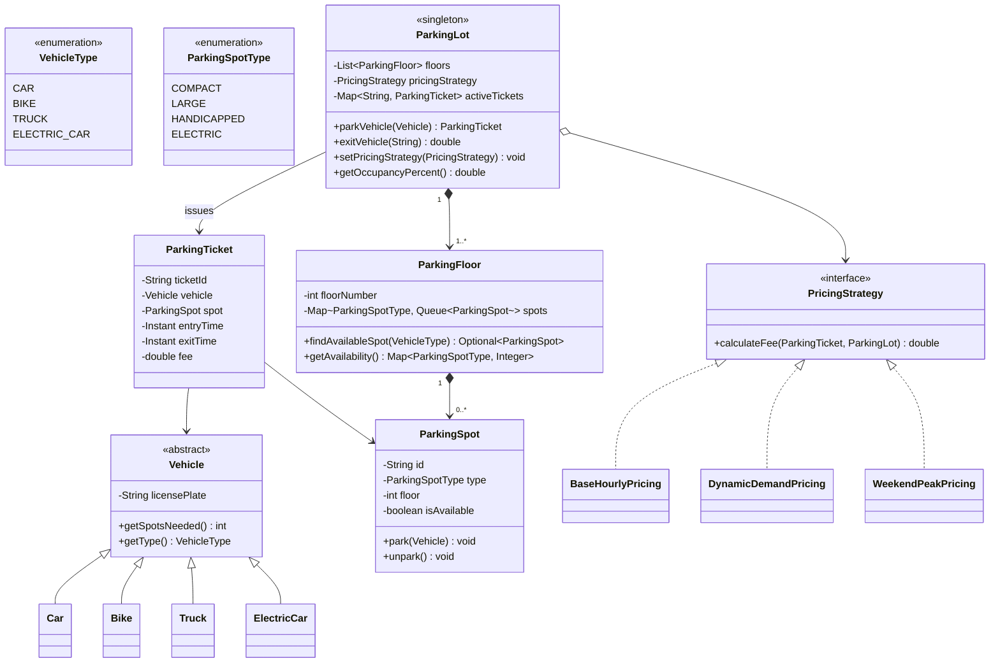
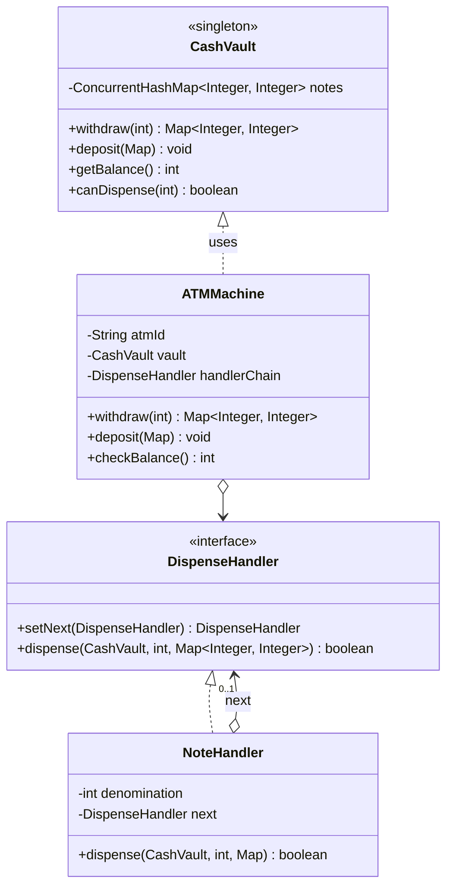
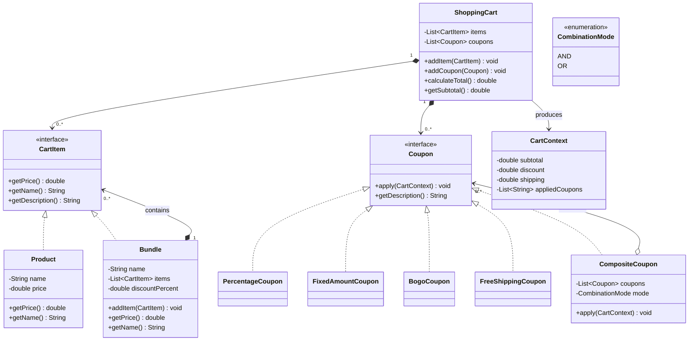

# LLD Design Pattern Problems — Part 2 (Problems 8–10)

---

## Problem 8: Parking Lot with Dynamic Pricing (Strategy + Singleton + Factory)

### Problem Statement

Design a parking lot system with:
- Multiple floors, each with different spot types (COMPACT, LARGE, HANDICAPPED, ELECTRIC)
- Different vehicle types (CAR, BIKE, TRUCK, ELECTRIC_CAR)
- **Dynamic pricing** — rates change based on occupancy, time of day, demand
- **Strategy pattern** for pricing so you can plug in different algorithms
- Ticket-based entry/exit

### Design Patterns Used

| Pattern | Why |
|---------|-----|
| **Strategy** | Swappable pricing algorithms (hourly, demand-based, weekend) |
| **Singleton** | Single ParkingLot instance |
| **Factory** | Create vehicles from type strings |
| **Repository** | Store active tickets for lookup |

### Mermaid Diagram



### Implementation

```java
import java.util.*;
import java.util.concurrent.*;
import java.util.concurrent.atomic.AtomicLong;

// === ENUMS ===
enum VehicleType { CAR, BIKE, TRUCK, ELECTRIC_CAR }
enum ParkingSpotType { COMPACT, LARGE, HANDICAPPED, ELECTRIC }

// === VEHICLE HIERARCHY ===
abstract class Vehicle {
    private final String licensePlate;
    private final VehicleType type;

    protected Vehicle(String licensePlate, VehicleType type) {
        this.licensePlate = licensePlate;
        this.type = type;
    }

    public String getLicensePlate() { return licensePlate; }
    public VehicleType getType() { return type; }
    public abstract int getSpotsNeeded();
    public abstract List<ParkingSpotType> getSuitableSpotTypes();
}

class Car extends Vehicle {
    public Car(String licensePlate) { super(licensePlate, VehicleType.CAR); }
    @Override public int getSpotsNeeded() { return 1; }
    @Override public List<ParkingSpotType> getSuitableSpotTypes() {
        return List.of(ParkingSpotType.COMPACT, ParkingSpotType.LARGE);
    }
}

class Bike extends Vehicle {
    public Bike(String licensePlate) { super(licensePlate, VehicleType.BIKE); }
    @Override public int getSpotsNeeded() { return 1; }
    @Override public List<ParkingSpotType> getSuitableSpotTypes() {
        return List.of(ParkingSpotType.COMPACT);
    }
}

class Truck extends Vehicle {
    public Truck(String licensePlate) { super(licensePlate, VehicleType.TRUCK); }
    @Override public int getSpotsNeeded() { return 2; }
    @Override public List<ParkingSpotType> getSuitableSpotTypes() {
        return List.of(ParkingSpotType.LARGE);
    }
}

class ElectricCar extends Vehicle {
    public ElectricCar(String licensePlate) { super(licensePlate, VehicleType.ELECTRIC_CAR); }
    @Override public int getSpotsNeeded() { return 1; }
    @Override public List<ParkingSpotType> getSuitableSpotTypes() {
        return List.of(ParkingSpotType.ELECTRIC, ParkingSpotType.COMPACT);
    }
}

// === VEHICLE FACTORY ===
class VehicleFactory {
    public static Vehicle createVehicle(String type, String licensePlate) {
        return switch (type.toUpperCase()) {
            case "CAR" -> new Car(licensePlate);
            case "BIKE" -> new Bike(licensePlate);
            case "TRUCK" -> new Truck(licensePlate);
            case "ELECTRIC_CAR" -> new ElectricCar(licensePlate);
            default -> throw new IllegalArgumentException("Unknown vehicle type: " + type);
        };
    }
}

// === PARKING SPOT ===
class ParkingSpot {
    private final String id;
    private final ParkingSpotType type;
    private final int floor;
    private volatile boolean available = true;
    private Vehicle parkedVehicle;

    public ParkingSpot(String id, ParkingSpotType type, int floor) {
        this.id = id;
        this.type = type;
        this.floor = floor;
    }

    public synchronized boolean park(Vehicle vehicle) {
        if (!available) return false;
        this.parkedVehicle = vehicle;
        this.available = false;
        return true;
    }

    public synchronized Vehicle unpark() {
        Vehicle v = parkedVehicle;
        parkedVehicle = null;
        available = true;
        return v;
    }

    public String getId() { return id; }
    public ParkingSpotType getType() { return type; }
    public int getFloor() { return floor; }
    public boolean isAvailable() { return available; }
}

// === PARKING FLOOR ===
class ParkingFloor {
    private final int floorNumber;
    private final Map<ParkingSpotType, Queue<ParkingSpot>> spots = new ConcurrentHashMap<>();

    public ParkingFloor(int floorNumber) {
        this.floorNumber = floorNumber;
        for (ParkingSpotType type : ParkingSpotType.values()) {
            spots.put(type, new ConcurrentLinkedQueue<>());
        }
    }

    public void addSpot(ParkingSpot spot) {
        spots.get(spot.getType()).offer(spot);
    }

    public Optional<ParkingSpot> findAvailableSpot(Vehicle vehicle) {
        for (ParkingSpotType spotType : vehicle.getSuitableSpotTypes()) {
            Queue<ParkingSpot> queue = spots.get(spotType);
            for (ParkingSpot spot : queue) {
                if (spot.isAvailable()) {
                    return Optional.of(spot);
                }
            }
        }
        return Optional.empty();
    }

    public Map<ParkingSpotType, Long> getAvailableCounts() {
        Map<ParkingSpotType, Long> counts = new HashMap<>();
        for (ParkingSpotType type : ParkingSpotType.values()) {
            long count = spots.get(type).stream().filter(ParkingSpot::isAvailable).count();
            counts.put(type, count);
        }
        return counts;
    }

    public int getFloorNumber() { return floorNumber; }
}

// === PARKING TICKET ===
class ParkingTicket {
    private static final AtomicLong idGen = new AtomicLong(1);
    private final String ticketId;
    private final Vehicle vehicle;
    private final ParkingSpot spot;
    private final Instant entryTime;
    private Instant exitTime;
    private double fee;

    public ParkingTicket(Vehicle vehicle, ParkingSpot spot) {
        this.ticketId = "TKT-" + idGen.getAndIncrement();
        this.vehicle = vehicle;
        this.spot = spot;
        this.entryTime = Instant.now();
    }

    public String getTicketId() { return ticketId; }
    public Vehicle getVehicle() { return vehicle; }
    public ParkingSpot getSpot() { return spot; }
    public Instant getEntryTime() { return entryTime; }
    public Instant getExitTime() { return exitTime; }
    public double getFee() { return fee; }

    public void complete(double fee) {
        this.exitTime = Instant.now();
        this.fee = fee;
    }

    public long getDurationHours() {
        Instant end = exitTime != null ? exitTime : Instant.now();
        long minutes = Duration.between(entryTime, end).toMinutes();
        return Math.max(1, (minutes + 59) / 60); // Round up to nearest hour, min 1
    }

    @Override
    public String toString() {
        return "Ticket{" + ticketId + ", " + vehicle.getLicensePlate() +
            ", spot=" + spot.getId() + ", entry=" + entryTime + "}";
    }
}

// === PRICING STRATEGIES ===
interface PricingStrategy {
    double calculateFee(ParkingTicket ticket, double occupancyPercent);
}

class BaseHourlyPricing implements PricingStrategy {
    private final Map<VehicleType, Double> hourlyRates = Map.of(
        VehicleType.CAR, 20.0,
        VehicleType.BIKE, 10.0,
        VehicleType.TRUCK, 40.0,
        VehicleType.ELECTRIC_CAR, 15.0
    );

    @Override
    public double calculateFee(ParkingTicket ticket, double occupancyPercent) {
        double rate = hourlyRates.getOrDefault(ticket.getVehicle().getType(), 20.0);
        return rate * ticket.getDurationHours();
    }
}

class DynamicDemandPricing implements PricingStrategy {
    private final PricingStrategy base = new BaseHourlyPricing();
    private static final double HIGH_DEMAND_THRESHOLD = 0.8;

    @Override
    public double calculateFee(ParkingTicket ticket, double occupancyPercent) {
        double baseFee = base.calculateFee(ticket, occupancyPercent);
        if (occupancyPercent >= HIGH_DEMAND_THRESHOLD) {
            return baseFee * 1.5; // 50% surge pricing
        }
        return baseFee;
    }
}

class WeekendPeakPricing implements PricingStrategy {
    private final PricingStrategy base = new BaseHourlyPricing();

    @Override
    public double calculateFee(ParkingTicket ticket, double occupancyPercent) {
        DayOfWeek day = LocalDateTime.now().getDayOfWeek();
        boolean isWeekend = day == DayOfWeek.SATURDAY || day == DayOfWeek.SUNDAY;
        boolean isPeakHour = LocalDateTime.now().getHour() >= 10 &&
            LocalDateTime.now().getHour() <= 20;

        double baseFee = base.calculateFee(ticket, occupancyPercent);
        if (isWeekend && isPeakHour) {
            return baseFee * 2.0; // Double on weekend peak
        }
        return baseFee;
    }
}

// === PARKING LOT (Singleton) ===
class ParkingLot {
    private static final ParkingLot INSTANCE = new ParkingLot();
    private final List<ParkingFloor> floors = new CopyOnWriteArrayList<>();
    private volatile PricingStrategy pricingStrategy = new BaseHourlyPricing();
    private final ConcurrentHashMap<String, ParkingTicket> activeTickets = new ConcurrentHashMap<>();

    private ParkingLot() {}

    public static ParkingLot getInstance() { return INSTANCE; }

    public void addFloor(ParkingFloor floor) { floors.add(floor); }

    public void setPricingStrategy(PricingStrategy strategy) {
        this.pricingStrategy = strategy;
    }

    public ParkingTicket parkVehicle(Vehicle vehicle) {
        for (ParkingFloor floor : floors) {
            Optional<ParkingSpot> spotOpt = floor.findAvailableSpot(vehicle);
            if (spotOpt.isPresent()) {
                ParkingSpot spot = spotOpt.get();
                synchronized (spot) {
                    if (spot.park(vehicle)) {
                        ParkingTicket ticket = new ParkingTicket(vehicle, spot);
                        activeTickets.put(ticket.getTicketId(), ticket);
                        System.out.println("Parked " + vehicle.getLicensePlate() +
                            " at floor " + spot.getFloor() + " spot " + spot.getId());
                        return ticket;
                    }
                }
            }
        }
        throw new RuntimeException("No available spot for " + vehicle.getLicensePlate());
    }

    public double exitVehicle(String ticketId) {
        ParkingTicket ticket = activeTickets.get(ticketId);
        if (ticket == null) {
            throw new IllegalArgumentException("Invalid ticket: " + ticketId);
        }

        ticket.getSpot().unpark();
        double occupancy = getOccupancyPercent();
        double fee = pricingStrategy.calculateFee(ticket, occupancy);
        ticket.complete(fee);
        activeTickets.remove(ticketId);

        System.out.println(ticket.getVehicle().getLicensePlate() +
            " exited. Fee: $" + String.format("%.2f", fee) +
            " (" + ticket.getDurationHours() + " hrs)");
        return fee;
    }

    public double getOccupancyPercent() {
        long total = 0, occupied = 0;
        for (ParkingFloor floor : floors) {
            for (Map.Entry<ParkingSpotType, Long> entry : floor.getAvailableCounts().entrySet()) {
                total += entry.getValue();
            }
        }
        return 1.0 - (double) total / Math.max(1, total);
    }
}

// === DEMO ===
public class ParkingLotDemo {
    public static void main(String[] args) {
        ParkingLot lot = ParkingLot.getInstance();

        // Setup floor 1
        ParkingFloor floor1 = new ParkingFloor(1);
        for (int i = 1; i <= 10; i++) {
            floor1.addSpot(new ParkingSpot("A" + i, ParkingSpotType.COMPACT, 1));
            floor1.addSpot(new ParkingSpot("B" + i, ParkingSpotType.LARGE, 1));
        }
        floor1.addSpot(new ParkingSpot("C1", ParkingSpotType.ELECTRIC, 1));
        floor1.addSpot(new ParkingSpot("C2", ParkingSpotType.HANDICAPPED, 1));
        lot.addFloor(floor1);

        // Switch to dynamic pricing
        lot.setPricingStrategy(new DynamicDemandPricing());

        // Park vehicles
        Vehicle car1 = VehicleFactory.createVehicle("CAR", "KA-01-1234");
        Vehicle bike1 = VehicleFactory.createVehicle("BIKE", "KA-02-5678");
        Vehicle electric1 = VehicleFactory.createVehicle("ELECTRIC_CAR", "KA-03-9012");

        ParkingTicket t1 = lot.parkVehicle(car1);
        ParkingTicket t2 = lot.parkVehicle(bike1);
        ParkingTicket t3 = lot.parkVehicle(electric1);

        // Exit
        lot.exitVehicle(t1.getTicketId());
        lot.exitVehicle(t2.getTicketId());
        lot.exitVehicle(t3.getTicketId());
    }
}
```

---

## Problem 9: ATM Cash Dispenser (Chain of Responsibility + Singleton)

### Problem Statement

Design an ATM machine that:
- Holds cash in different denominations (₹2000, ₹500, ₹200, ₹100, ₹50, ₹20, ₹10, ₹5)
- Dispenses cash for any valid amount using minimum number of notes
- Supports multiple withdrawal strategies (minimum notes, exact denomination preference)
- Verifies sufficient balance before dispensing
- Thread-safe (multiple ATMs sharing a cash vault)

### Design Patterns Used

| Pattern | Why |
|---------|-----|
| **Chain of Responsibility** | Each denomination handler tries to dispense its notes, then passes remainder to next |
| **Singleton** | Central cash vault shared across ATM machines |
| **Strategy** | Different cash dispensing algorithms |

### Mermaid Diagram



### Implementation

```java
import java.util.*;
import java.util.concurrent.*;
import java.util.concurrent.locks.ReentrantReadWriteLock;

// === CASH VAULT (Singleton, Thread-Safe) ===
class CashVault {
    private static final CashVault INSTANCE = new CashVault();
    private final ConcurrentHashMap<Integer, Integer> notes = new ConcurrentHashMap<>();
    private final ReentrantReadWriteLock lock = new ReentrantReadWriteLock();

    private CashVault() {
        // Initial load
        notes.put(2000, 100);
        notes.put(500, 200);
        notes.put(200, 300);
        notes.put(100, 500);
        notes.put(50, 200);
        notes.put(20, 300);
        notes.put(10, 500);
        notes.put(5, 200);
    }

    public static CashVault getInstance() { return INSTANCE; }

    public boolean canDispense(int amount) {
        lock.readLock().lock();
        try {
            return amount <= getBalance() && amount > 0 && amount % 5 == 0;
        } finally {
            lock.readLock().unlock();
        }
    }

    public int getBalance() {
        return notes.entrySet().stream()
            .mapToInt(e -> e.getKey() * e.getValue()).sum();
    }

    public Map<Integer, Integer> withdraw(Map<Integer, Integer> toDispense) {
        lock.writeLock().lock();
        try {
            for (Map.Entry<Integer, Integer> entry : toDispense.entrySet()) {
                int denom = entry.getKey();
                int count = entry.getValue();
                notes.computeIfPresent(denom, (k, v) -> v - count);
            }
            return new HashMap<>(toDispense);
        } finally {
            lock.writeLock().unlock();
        }
    }

    public void deposit(Map<Integer, Integer> depositNotes) {
        lock.writeLock().lock();
        try {
            depositNotes.forEach((denom, count) ->
                notes.merge(denom, count, Integer::sum));
        } finally {
            lock.writeLock().unlock();
        }
    }

    public int getAvailableCount(int denomination) {
        return notes.getOrDefault(denomination, 0);
    }
}

// === DISPENSE HANDLER (Chain of Responsibility) ===
interface DispenseHandler {
    DispenseHandler setNext(DispenseHandler handler);
    boolean dispense(CashVault vault, int amount, Map<Integer, Integer> result);
}

abstract class BaseDispenseHandler implements DispenseHandler {
    protected DispenseHandler next;

    @Override
    public DispenseHandler setNext(DispenseHandler handler) {
        this.next = handler;
        return handler;
    }

    protected boolean dispatchNext(CashVault vault, int amount, Map<Integer, Integer> result) {
        if (next == null) return amount == 0;
        return next.dispense(vault, amount, result);
    }
}

class NoteHandler extends BaseDispenseHandler {
    private final int denomination;

    public NoteHandler(int denomination) {
        this.denomination = denomination;
    }

    @Override
    public boolean dispense(CashVault vault, int amount, Map<Integer, Integer> result) {
        if (amount == 0) return true;

        int available = vault.getAvailableCount(denomination);
        int needed = amount / denomination;
        int toUse = Math.min(needed, available);

        if (toUse > 0) {
            result.put(denomination, toUse);
            int remaining = amount - (toUse * denomination);
            return dispatchNext(vault, remaining, result);
        }

        return dispatchNext(vault, amount, result);
    }
}

// === MINIMUM NOTES STRATEGY ===
class MinimumNotesHandler extends BaseDispenseHandler {
    private static final int[] DENOMINATIONS = {2000, 500, 200, 100, 50, 20, 10, 5};

    @Override
    public boolean dispense(CashVault vault, int amount, Map<Integer, Integer> result) {
        if (amount == 0) return true;
        if (amount < 0 || !vault.canDispense(amount)) return false;

        // Greedy: use largest denominations first
        int temp = amount;
        for (int denom : DENOMINATIONS) {
            int available = vault.getAvailableCount(denom);
            int needed = temp / denom;
            int toUse = Math.min(needed, available);
            if (toUse > 0) {
                result.put(denom, toUse);
                temp -= toUse * denom;
            }
        }

        if (temp == 0) {
            vault.withdraw(result);
            return true;
        }
        return false;
    }
}

// === ATM MACHINE ===
class ATMMachine {
    private final String atmId;
    private final CashVault vault = CashVault.getInstance();
    private DispenseHandler handlerChain;

    public ATMMachine(String atmId) {
        this.atmId = atmId;
        buildDefaultChain();
    }

    private void buildDefaultChain() {
        // Build chain: 2000 -> 500 -> 200 -> 100 -> 50 -> 20 -> 10 -> 5
        handlerChain = new NoteHandler(2000);
        DispenseHandler h500 = new NoteHandler(500);
        DispenseHandler h200 = new NoteHandler(200);
        DispenseHandler h100 = new NoteHandler(100);
        DispenseHandler h50 = new NoteHandler(50);
        DispenseHandler h20 = new NoteHandler(20);
        DispenseHandler h10 = new NoteHandler(10);
        DispenseHandler h5 = new NoteHandler(5);

        handlerChain.setNext(h500)
            .setNext(h200)
            .setNext(h100)
            .setNext(h50)
            .setNext(h20)
            .setNext(h10)
            .setNext(h5);
    }

    public void setDispenseStrategy(DispenseHandler strategy) {
        this.handlerChain = strategy;
    }

    public Map<Integer, Integer> withdraw(int amount) {
        if (!vault.canDispense(amount)) {
            System.out.println("ATM " + atmId + ": Cannot dispense " + amount);
            return Collections.emptyMap();
        }

        Map<Integer, Integer> notes = new LinkedHashMap<>();
        boolean success = handlerChain.dispense(vault, amount, notes);

        if (success) {
            System.out.println("ATM " + atmId + ": Dispensed ₹" + amount +
                " = " + notes);
            return notes;
        } else {
            System.out.println("ATM " + atmId + ": Failed to dispense ₹" + amount);
            return Collections.emptyMap();
        }
    }

    public void deposit(Map<Integer, Integer> depositNotes) {
        vault.deposit(depositNotes);
        System.out.println("ATM " + atmId + ": Deposited " + depositNotes);
    }

    public int checkBalance() {
        return vault.getBalance();
    }
}

// === DEMO ===
public class ATMDemo {
    public static void main(String[] args) {
        ATMMachine atm1 = new ATMMachine("ATM-001");
        ATMMachine atm2 = new ATMMachine("ATM-002");

        System.out.println("=== ATM-001: Withdraw ₹3750 ===");
        atm1.withdraw(3750); // 1x2000 + 3x500 + 1x200 + 1x50

        System.out.println("\n=== ATM-001: Withdraw ₹850 ===");
        atm1.withdraw(850); // 1x500 + 1x200 + 1x100 + 1x50

        System.out.println("\n=== ATM-002: Withdraw ₹150 (fails if insufficient notes) ===");
        atm2.withdraw(150);

        System.out.println("\n=== Deposit ₹1000 at ATM-002 ===");
        atm2.deposit(Map.of(500, 2));

        System.out.println("\n=== ATM-002: Withdraw ₹150 (after deposit) ===");
        atm2.withdraw(150);

        System.out.println("\n=== Total vault balance: ₹" + CashVault.getInstance().getBalance());

        System.out.println("\n=== Using Minimum Notes Strategy ===");
        ATMMachine atm3 = new ATMMachine("ATM-003");
        atm3.setDispenseStrategy(new MinimumNotesHandler());
        atm3.withdraw(3750);
    }
}
```

### Extension Scenarios

| Extension | Change |
|-----------|--------|
| Add ₹2000 note handling | Create `NoteHandler(2000)` — no other code changes |
| Biometric authentication | Decorator wrapping the ATM withdrawal method |
| Daily withdrawal limit | Add `LimitCheckHandler` in chain before note handlers |
| Multiple ATM network | `CashVault` could be backed by central server |

---

## Problem 10: Shopping Cart with Coupon Engine (Strategy + Composite + Builder)

### Problem Statement

Design a shopping cart system where:
- Items can be added/removed from cart
- Cart can contain individual items OR bundles (composite)
- **Multiple coupon types**: percentage off, fixed amount, buy-one-get-one (BOGO), free shipping
- Coupons can be **combined** with AND/OR logic
- Calculate final price after all coupons

### Design Patterns Used

| Pattern | Why |
|---------|-----|
| **Composite** | Items and Bundles both implement `CartItem` interface |
| **Strategy** | Each coupon type is a strategy |
| **Builder** | Build carts and coupons fluently |
| **Chain of Responsibility** | Coupons apply in sequence |

### Mermaid Diagram



### Implementation

```java
import java.util.*;
import java.util.concurrent.CopyOnWriteArrayList;
import java.util.stream.Collectors;

// === CART ITEM (Composite) ===
interface CartItem {
    String getName();
    double getPrice();
    default String getDescription() { return getName() + " ($" + String.format("%.2f", getPrice()) + ")"; }
}

class Product implements CartItem {
    private final String name;
    private final double price;

    public Product(String name, double price) {
        this.name = name;
        this.price = price;
    }

    @Override public String getName() { return name; }
    @Override public double getPrice() { return price; }
}

class Bundle implements CartItem {
    private final String name;
    private final List<CartItem> items = new ArrayList<>();
    private final double bundleDiscount; // e.g., 10% off the bundle

    public Bundle(String name, double bundleDiscount) {
        this.name = name;
        this.bundleDiscount = bundleDiscount;
    }

    public void addItem(CartItem item) { items.add(item); }

    @Override
    public String getName() { return name; }

    @Override
    public double getPrice() {
        double total = items.stream().mapToDouble(CartItem::getPrice).sum();
        return total * (1 - bundleDiscount / 100.0);
    }

    @Override
    public String getDescription() {
        String itemList = items.stream().map(CartItem::getName).collect(Collectors.joining(", "));
        return "Bundle '" + name + "' [" + itemList + "] ($" +
            String.format("%.2f", getPrice()) + ", saved " + bundleDiscount + "%)";
    }

    public List<CartItem> getItems() { return Collections.unmodifiableList(items); }
}

// === CART CONTEXT (passed through coupon chain) ===
class CartContext {
    private double subtotal;
    private double discount = 0;
    private double shipping = 0;
    private final double baseShipping;
    private final List<String> appliedCoupons = new ArrayList<>();

    public CartContext(double subtotal, double baseShipping) {
        this.subtotal = subtotal;
        this.baseShipping = baseShipping;
        this.shipping = baseShipping;
    }

    public double getSubtotal() { return subtotal; }
    public double getDiscount() { return discount; }
    public double getShipping() { return shipping; }
    public double getFinalTotal() { return subtotal - discount + shipping; }

    public void applyPercentageDiscount(String couponName, double percent) {
        double d = subtotal * (percent / 100.0);
        discount += d;
        appliedCoupons.add(couponName + ": -" + String.format("%.2f", d) + " (" + percent + "%)");
    }

    public void applyFixedDiscount(String couponName, double amount) {
        double d = Math.min(amount, subtotal - discount);
        discount += d;
        appliedCoupons.add(couponName + ": -" + String.format("%.2f", d));
    }

    public void freeShipping(String couponName) {
        shipping = 0;
        appliedCoupons.add(couponName + ": free shipping (saved $" +
            String.format("%.2f", baseShipping) + ")");
    }

    public void addBogoItem(String couponName, double itemPrice) {
        discount += itemPrice;
        appliedCoupons.add(couponName + ": free item ($" +
            String.format("%.2f", itemPrice) + ")");
    }

    public List<String> getAppliedCoupons() { return Collections.unmodifiableList(appliedCoupons); }

    @Override
    public String toString() {
        return "CartContext{subtotal=$" + String.format("%.2f", subtotal) +
            ", discount=-$" + String.format("%.2f", discount) +
            ", shipping=$" + String.format("%.2f", shipping) +
            ", total=$" + String.format("%.2f", getFinalTotal()) +
            ", coupons=" + appliedCoupons + "}";
    }
}

// === COUPON STRATEGY ===
interface Coupon {
    void apply(CartContext context, ShoppingCart cart);
    String getDescription();
}

class PercentageCoupon implements Coupon {
    private final String name;
    private final double percent;
    private final double minOrderValue;

    public PercentageCoupon(String name, double percent, double minOrderValue) {
        this.name = name;
        this.percent = percent;
        this.minOrderValue = minOrderValue;
    }

    @Override
    public void apply(CartContext context, ShoppingCart cart) {
        if (context.getSubtotal() >= minOrderValue) {
            context.applyPercentageDiscount(name, percent);
        }
    }

    @Override
    public String getDescription() { return name + ": " + percent + "% off (min ₹" + minOrderValue + ")"; }
}

class FixedAmountCoupon implements Coupon {
    private final String name;
    private final double amount;
    private final double minOrderValue;

    public FixedAmountCoupon(String name, double amount, double minOrderValue) {
        this.name = name;
        this.amount = amount;
        this.minOrderValue = minOrderValue;
    }

    @Override
    public void apply(CartContext context, ShoppingCart cart) {
        if (context.getSubtotal() >= minOrderValue) {
            context.applyFixedDiscount(name, amount);
        }
    }

    @Override
    public String getDescription() { return name + ": ₹" + String.format("%.0f", amount) + " off"; }
}

class BogoCoupon implements Coupon {
    private final String name;
    private final String productName; // null = cheapest item

    public BogoCoupon(String name, String productName) {
        this.name = name;
        this.productName = productName;
    }

    @Override
    public void apply(CartContext context, ShoppingCart cart) {
        List<CartItem> items = cart.getFlatItems();
        if (items.size() < 2) return;

        // Find items with quantity >= 2 for the matching product
        if (productName != null) {
            cart.getItems().stream()
                .filter(item -> item.getName().equals(productName))
                .findFirst().ifPresent(item -> {
                    context.addBogoItem(name, item.getPrice());
                });
        } else {
            // Cheapest item free
            CartItem cheapest = items.stream()
                .min(Comparator.comparingDouble(CartItem::getPrice))
                .orElse(null);
            if (cheapest != null) {
                context.addBogoItem(name, cheapest.getPrice());
            }
        }
    }

    @Override
    public String getDescription() { return name + ": Buy 1 Get 1 Free"; }
}

class FreeShippingCoupon implements Coupon {
    private final String name;
    private final double minOrderValue;

    public FreeShippingCoupon(String name, double minOrderValue) {
        this.name = name;
        this.minOrderValue = minOrderValue;
    }

    @Override
    public void apply(CartContext context, ShoppingCart cart) {
        if (context.getSubtotal() >= minOrderValue) {
            context.freeShipping(name);
        }
    }

    @Override
    public String getDescription() { return name + ": Free shipping (min ₹" + minOrderValue + ")"; }
}

// === COMPOSITE COUPON (AND/OR Logic) ===
enum CombinationMode { ALL, ANY }

class CompositeCoupon implements Coupon {
    private final String name;
    private final List<Coupon> coupons = new ArrayList<>();
    private final CombinationMode mode;

    public CompositeCoupon(String name, CombinationMode mode) {
        this.name = name;
        this.mode = mode;
    }

    public CompositeCoupon addCoupon(Coupon coupon) {
        coupons.add(coupon);
        return this;
    }

    @Override
    public void apply(CartContext context, ShoppingCart cart) {
        if (mode == CombinationMode.ALL) {
            coupons.forEach(c -> c.apply(context, cart));
        } else {
            // ANY: apply first valid coupon
            CartContext testContext = new CartContext(context.getSubtotal(), context.getShipping());
            for (Coupon c : coupons) {
                double beforeDiscount = testContext.getDiscount();
                c.apply(testContext, cart);
                if (testContext.getDiscount() > beforeDiscount) {
                    c.apply(context, cart);
                    return;
                }
            }
        }
    }

    @Override
    public String getDescription() {
        return name + " [" + mode + " of " +
            coupons.stream().map(Coupon::getDescription).collect(Collectors.joining(", ")) + "]";
    }
}

// === SHOPPING CART ===
class ShoppingCart {
    private final List<CartItem> items = new CopyOnWriteArrayList<>();
    private final List<Coupon> coupons = new ArrayList<>();
    private double shippingCost = 50; // default ₹50 shipping

    public ShoppingCart addItem(CartItem item) {
        items.add(item);
        return this;
    }

    public ShoppingCart addCoupon(Coupon coupon) {
        coupons.add(coupon);
        return this;
    }

    public ShoppingCart setShipping(double cost) {
        this.shippingCost = cost;
        return this;
    }

    public List<CartItem> getItems() { return Collections.unmodifiableList(items); }

    public List<CartItem> getFlatItems() {
        List<CartItem> flat = new ArrayList<>();
        flatten(items, flat);
        return flat;
    }

    private void flatten(List<CartItem> source, List<CartItem> target) {
        for (CartItem item : source) {
            if (item instanceof Bundle bundle) {
                flatten(bundle.getItems(), target);
            } else {
                target.add(item);
            }
        }
    }

    public double getSubtotal() {
        return items.stream().mapToDouble(CartItem::getPrice).sum();
    }

    public CartContext calculateTotal() {
        CartContext context = new CartContext(getSubtotal(), shippingCost);

        for (Coupon coupon : coupons) {
            coupon.apply(context, this);
        }

        return context;
    }
}

// === DEMO ===
public class ShoppingCartDemo {
    public static void main(String[] args) {
        // Create products
        Product laptop = new Product("Laptop", 50000);
        Product mouse = new Product("Mouse", 1500);
        Product keyboard = new Product("Keyboard", 2500);
        Product headphones = new Product("Headphones", 3000);
        Product tshirt = new Product("T-Shirt", 800);

        // Create bundle: Work from home kit (10% off)
        Bundle workKit = new Bundle("Work From Home Kit", 10);
        workKit.addItem(laptop);
        workKit.addItem(mouse);
        workKit.addItem(headphones);

        // Create composite coupon: "FESTIVE" = 10% off AND free shipping
        CompositeCoupon festiveDeal = new CompositeCoupon("FESTIVE_DEAL", CombinationMode.ALL)
            .addCoupon(new PercentageCoupon("FESTIVE_PERCENT", 10, 1000))
            .addCoupon(new FreeShippingCoupon("FREE_SHIPPING", 500));

        // Build cart
        ShoppingCart cart = new ShoppingCart()
            .addItem(workKit)
            .addItem(keyboard)
            .addItem(tshirt)
            .setShipping(100)
            .addCoupon(new PercentageCoupon("WELCOME15", 15, 0))
            .addCoupon(new BogoCoupon("BOGO_MOUSE", "Mouse"))
            .addCoupon(festiveDeal)
            .addCoupon(new FixedAmountCoupon("FLAT200", 200, 1000));

        System.out.println("=== Items ===");
        for (CartItem item : cart.getItems()) {
            System.out.println("  " + item.getDescription());
        }

        System.out.println("\n=== Subtotal: ₹" + String.format("%.2f", cart.getSubtotal()));
        System.out.println("=== Applying Coupons... ===");
        CartContext result = cart.calculateTotal();
        System.out.println("\n" + result);
    }
}
```

### Extension Scenarios

| Extension | Change |
|-----------|--------|
| New coupon type (e.g., "Buy 2 Get 10% off 3rd") | Create class implementing `Coupon` |
| Coupon stacking rules | Add validation in `ShoppingCart.addCoupon()` |
| Cart persistence | `ShoppingCartRepository` interface |
| Tiered pricing (quantity breaks) | New `TieredPricingCoupon` |

---

## Quick Reference: Which Pattern for Which Problem?

| Problem | Primary Pattern(s) | Why |
|---------|-------------------|-----|
| Pricing Engine with Rules | Chain of Responsibility + Strategy | Each rule is independent, composable, chainable |
| Blogging Platform | Repository + Factory | Abstract storage, create entities |
| Vending Machine | State | Behavior changes with state; clear transitions |
| Tic-Tac-Toe | Command + Observer | Undo support; event notifications |
| Task Scheduler | Decorator + Strategy | Cross-cutting concerns + pluggable scheduling |
| Pub-Sub Messaging | Observer + Singleton | Event distribution; single broker |
| Logging Framework | Strategy + Singleton + Chain | Format/appender as strategy; logger hierarchy |
| Parking Lot | Strategy + Singleton + Factory | Dynamic pricing; single lot; vehicle creation |
| ATM Cash Dispenser | Chain of Responsibility | Note-by-note dispensing in denomination order |
| Shopping Cart | Composite + Strategy + CompositeCoupon | Item bundles; coupon strategies; combined coupons |

## Practice Exercises (Build These Yourself)

1. **URL Shortener** — Use `Strategy` for different encoding algorithms (Base62, MD5 hash, random)
2. **Online Chess** — `Command` for moves; `Observer` for game state; `State` for game status
3. **Email Notification System** — `Decorator` for email content (signature, encryption, tracking);
4. **Hotel Booking System** — `State` for room status; `Strategy` for pricing; `Observer` for availability alerts
5. **File Compression Utility** — `Strategy` for compression algorithms (ZIP, GZIP, RAR)
6. **Job Interview Pipeline** — `Chain of Responsibility` for interview stages (Screening → Tech → Managerial → HR)
7. **Game Character System** — `Decorator` for abilities (armor, weapons, spells); `Strategy` for attack types
8. **Chat Room** — `Mediator` for message routing; `Observer` for user presence
9. **Document Editor** — `Command` for undo/redo; `Composite` for document structure (paragraphs, sections)
10. **Traffic Light System** — `State` for light colors (GREEN → YELLOW → RED → GREEN)