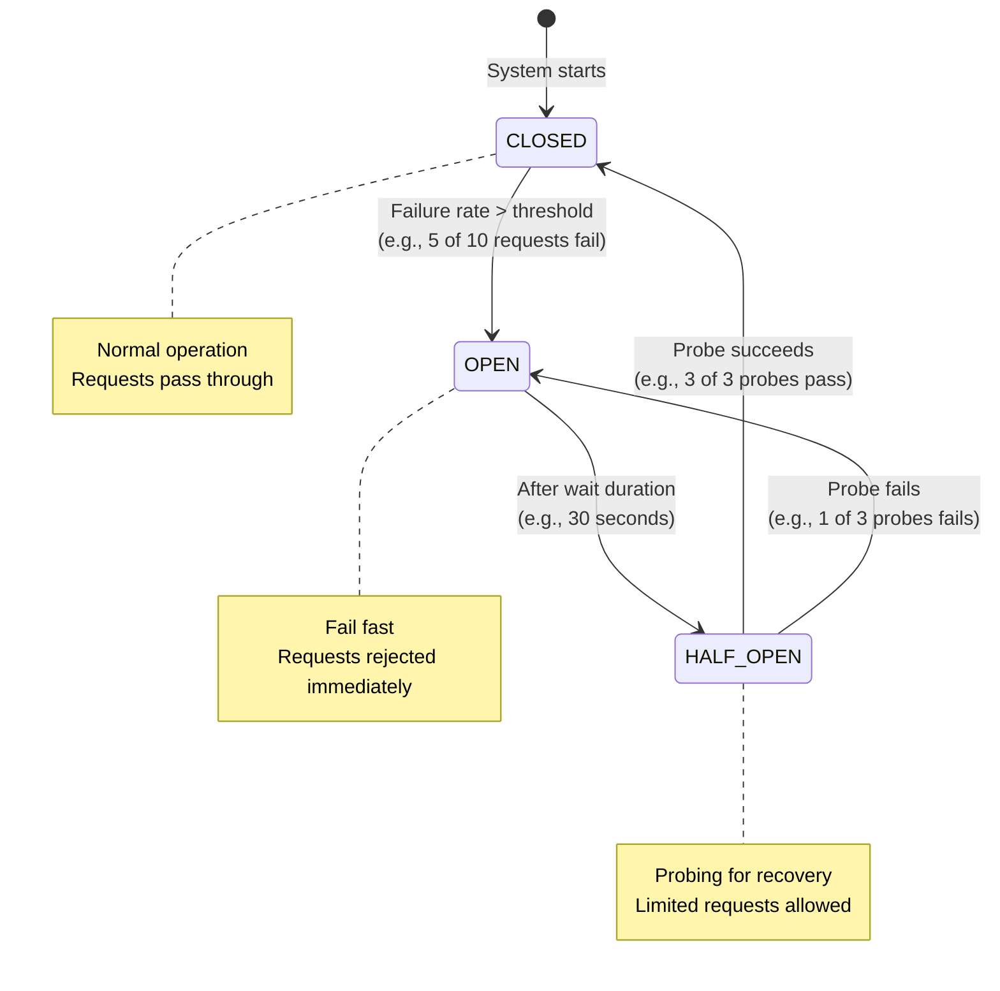
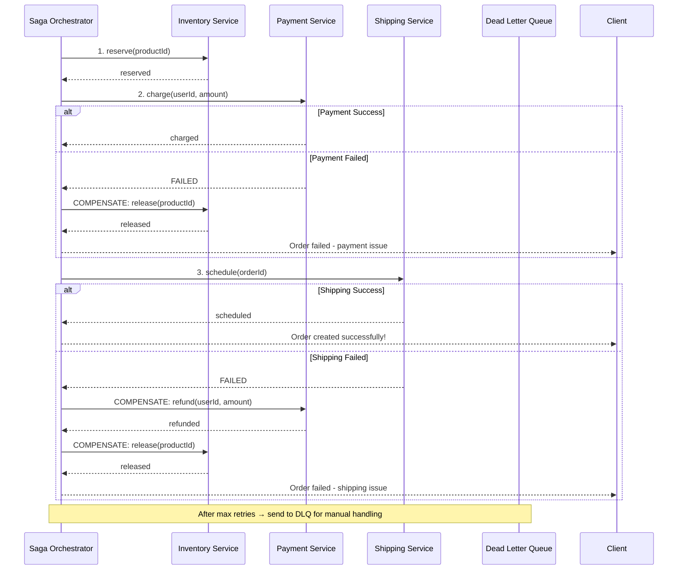
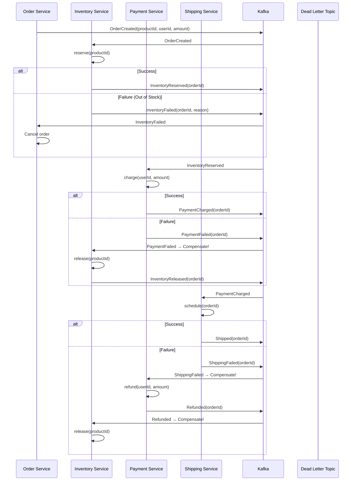

# Microservices — Complete Deep Dive

## 1. Why This Concept Matters

Microservices architecture decomposes a large application into independently deployable services, each responsible for a specific business capability. Each service owns its own data, communicates via well-defined APIs, and can be developed, deployed, and scaled independently. In production, microservices enable organizations to scale engineering teams (each team owns one or a few services), deploy independently (no multi-month release cycles), and choose the right technology for each service. However, microservices also introduce significant complexity: network latency, data consistency across services, service discovery, distributed tracing, and eventual consistency reasoning. Interviewers test this because it reveals whether you understand distributed systems tradeoffs, service decomposition strategies, and operational complexity. Many "microservices" implementations are actually distributed monoliths where services are tightly coupled through shared databases or chatty communication.

Misunderstanding microservices causes:
- Distributed monolith: services share a database, tightly coupled by schema changes
- Chatty communication: a single user request fans out to 10+ internal HTTP calls, causing high latency
- Cascading failures: one slow service backs up all callers, causing system-wide outage
- Data inconsistency: no saga or compensating transaction for multi-service operations
- Debugging nightmares: no distributed tracing — impossible to trace a request across services
- Over-splitting: services too small (per-CRUD) — operational overhead exceeds benefit

## 2. Basic Meaning

Microservices = independently deployable services, each owning its own data and logic, communicating via APIs (HTTP/REST, gRPC, or messaging).

**Key vocabulary:**
- **Service (or Microservice)**: a small, autonomous unit that does one thing well. Owns its own database, exposes an API, and runs in its own process (or container).
- **Bounded Context**: a concept from Domain-Driven Design (DDD) that defines the boundary within which a particular domain model applies. Each microservice should correspond to exactly one bounded context.
- **API Gateway**: a single entry point for all external clients. Routes requests to appropriate internal services, handles authentication, rate limiting, request aggregation, and response transformation. Examples: Spring Cloud Gateway, Kong, AWS API Gateway.
- **Service Discovery**: the mechanism by which services find each other's network locations. In dynamic environments (Kubernetes, containers), IP addresses change frequently. Service registry (Eureka, Consul, etcd) and DNS-based discovery (Kubernetes DNS) solve this.
- **Inter-service Communication**: services communicate either synchronously (HTTP REST, gRPC) or asynchronously (message queues: Kafka, RabbitMQ, AWS SQS/SNS).
- **Orchestration vs Choreography**: Orchestration = a central coordinator controls the workflow (like a conductor). Choreography = each service knows its role and reacts to events (like dancers following the music).
- **Circuit Breaker**: a pattern that detects when a downstream service is failing and stops sending requests to it, allowing it to recover. States: CLOSED (normal), OPEN (fail fast), HALF_OPEN (probe for recovery).
- **Bulkhead**: isolate resources so that failure in one component doesn't take down others. Each downstream service gets its own thread pool / connection pool.
- **Saga**: a sequence of local transactions where each transaction has a compensating action that undoes it. If a step fails, the saga runs compensating actions for all completed steps. Two styles: choreography (each service emits events) and orchestration (central coordinator).
- **CQRS (Command Query Responsibility Segregation)**: separate the model that handles writes (commands) from the model that handles reads (queries). Often used with event sourcing.
- **Event Sourcing**: store the sequence of state-changing events as the source of truth, rather than the current state. Enables audit trail, temporal queries, and rebuilding state.
- **Observability**: the ability to understand what's happening inside a distributed system through logs, metrics, and traces. Often called the "three pillars of observability."
- **Strangler Fig Pattern**: gradually replace a monolithic application by building new functionality as microservices and routing traffic to them incrementally, until the monolith is "strangled."
- **Idempotency**: the property that performing the same operation multiple times has the same effect as performing it once. Critical for exactly-once message processing and retry-safe APIs.

**What it is NOT:**
- Not a silver bullet — adds significant operational complexity.
- Not a way to avoid proper data modeling — each service's data must still be well-designed.
- Not a free scalability solution — each network call adds latency compared to in-process calls.

## 3. Real Code / Real Example

```java
import io.github.resilience4j.circuitbreaker.*;
import io.github.resilience4j.retry.*;
import io.github.resilience4j.bulkhead.*;
import org.springframework.cloud.client.discovery.DiscoveryClient;
import org.springframework.web.client.RestTemplate;
import org.springframework.stereotype.Service;
import java.util.*;
import java.util.concurrent.*;
import java.util.function.Supplier;

// === 1. API GATEWAY CONFIGURATION (Spring Cloud Gateway) ===
// application.yml:
// spring:
//   cloud:
//     gateway:
//       routes:
//         - id: user-service
//           uri: lb://user-service
//           predicates:
//             - Path=/api/users/**
//           filters:
//             - StripPrefix=1
//         - id: order-service
//           uri: lb://order-service
//           predicates:
//             - Path=/api/orders/**
//           filters:
//             - name: CircuitBreaker
//               args:
//                 name: orderServiceCB
//                 fallbackUri: forward:/fallback/orders

// === 2. SERVICE DISCOVERY (Eureka Client) ===
@Service
public class OrderServiceClient {
    private final RestTemplate restTemplate;
    private final DiscoveryClient discoveryClient;
    
    public OrderServiceClient(RestTemplate restTemplate, DiscoveryClient discoveryClient) {
        this.restTemplate = restTemplate;
        this.discoveryClient = discoveryClient;
    }
    
    public Order getOrder(Long orderId) {
        // Discover order-service instances via Eureka
        List<ServiceInstance> instances = discoveryClient.getInstances("order-service");
        if (instances.isEmpty()) throw new RuntimeException("order-service not found");
        
        // Round-robin or random selection
        ServiceInstance instance = instances.get(new Random().nextInt(instances.size()));
        String url = String.format("http://%s:%d/api/orders/%d", 
            instance.getHost(), instance.getPort(), orderId);
        
        return restTemplate.getForObject(url, Order.class);
    }
}

// === 3. CIRCUIT BREAKER (Resilience4j) ===
@Service
public class PaymentService {
    private final CircuitBreaker circuitBreaker;
    private final Retry retry;
    private final Bulkhead bulkhead;
    
    public PaymentService() {
        // Circuit breaker config
        CircuitBreakerConfig cbConfig = CircuitBreakerConfig.custom()
            .failureRateThreshold(50)           // Open if 50% requests fail
            .waitDurationInOpenState(Duration.ofSeconds(30)) // Wait 30s before half-open
            .permittedNumberOfCallsInHalfOpenState(3) // 3 probes before closing
            .slidingWindowSize(10)              // Last 10 calls
            .build();
        this.circuitBreaker = CircuitBreaker.of("paymentService", cbConfig);
        
        // Retry config
        RetryConfig retryConfig = RetryConfig.custom()
            .maxAttempts(3)                     // Retry 3 times
            .waitDuration(Duration.ofMillis(500)) // 500ms between retries
            .retryExceptions(TimeoutException.class, HttpServerErrorException.class)
            .build();
        this.retry = Retry.of("paymentRetry", retryConfig);
        
        // Bulkhead: max 5 concurrent calls to payment service
        BulkheadConfig bhConfig = BulkheadConfig.custom()
            .maxConcurrentCalls(5)
            .maxWaitDuration(Duration.ofMillis(1000))
            .build();
        this.bulkhead = Bulkhead.of("paymentBulkhead", bhConfig);
    }
    
    public PaymentResult processPayment(BigDecimal amount) {
        // Compose circuit breaker + retry + bulkhead
        Supplier<PaymentResult> decorated = Decorators.ofSupplier(() -> callPaymentGateway(amount))
            .withCircuitBreaker(circuitBreaker)
            .withRetry(retry)
            .withBulkhead(bulkhead)
            .decorate();
        
        try {
            return decorated.get();
        } catch (Exception e) {
            // Circuit is OPEN or retries exhausted
            return PaymentResult.failed("Payment service unavailable: " + e.getMessage());
        }
    }
}

// === 4. SAGA PATTERN (Orchestration) ===
@Service
public class CreateOrderSaga {
    private final InventoryService inventory;
    private final PaymentService payment;
    private final ShippingService shipping;
    
    @Transactional
    public OrderResult createOrder(Long userId, Long productId, BigDecimal amount) {
        try {
            // Step 1: Reserve inventory
            inventory.reserve(productId);
            
            // Step 2: Charge payment
            payment.charge(userId, amount);
            
            // Step 3: Schedule shipping
            shipping.schedule(userId, productId);
            
            return OrderResult.success();
            
        } catch (InventoryException e) {
            // No inventory to release — nothing to compensate
            return OrderResult.failed("Product out of stock");
            
        } catch (PaymentException e) {
            // Compensate: release inventory
            inventory.release(productId);
            return OrderResult.failed("Payment failed: " + e.getMessage());
            
        } catch (ShippingException e) {
            // Compensate: refund payment + release inventory
            payment.refund(userId, amount);
            inventory.release(productId);
            return OrderResult.failed("Shipping failed: " + e.getMessage());
        }
    }
}

// === 5. SAGA PATTERN (Choreography with events) ===
// Each service publishes events to Kafka. Other services react.
@Service
public class OrderService {
    private final KafkaTemplate<String, OrderEvent> kafka;
    
    @Transactional
    public void createOrder(Order order) {
        orderRepo.save(order);
        // Publish event — inventory service consumes and reserves
        kafka.send("order-events", new OrderCreatedEvent(order.getId(), order.getProductId()));
    }
}

// InventoryService consumes OrderCreatedEvent
@Service
public class InventoryConsumer {
    @KafkaListener(topics = "order-events")
    public void handleOrderCreated(OrderCreatedEvent event) {
        try {
            inventory.reserve(event.getProductId());
            // Success: publish InventoryReserved event → payment service charges
            kafka.send("inventory-events", new InventoryReservedEvent(event.getOrderId()));
        } catch (Exception e) {
            // Failure: publish InventoryFailed event → order service cancels order
            kafka.send("inventory-events", new InventoryFailedEvent(event.getOrderId(), e.getMessage()));
        }
    }
}

// === 6. DISTRIBUTED TRACING (OpenTelemetry) ===
// In each service's application.yml:
// otel:
//   service.name: order-service
//   exporter:
//     otlp:
//       endpoint: http://jaeger:4317
// This auto-instruments Spring Boot — traces propagate via HTTP headers
// Jaeger UI shows the full trace across all services

// === 7. HEALTH CHECK FOR READY/LIVENESS ===
@RestController
@RequestMapping("/actuator")
public class HealthController {
    
    @GetMapping("/health/readiness")
    public Map<String, String> readiness() {
        // Check if service can accept traffic
        boolean dbConnected = checkDatabase();
        boolean downstreamHealthy = checkDownstreamServices();
        return Map.of("status", dbConnected && downstreamHealthy ? "UP" : "DOWN");
    }
    
    @GetMapping("/health/liveness")
    public Map<String, String> liveness() {
        // Check if service is alive (not deadlocked/out of memory)
        return Map.of("status", "UP");
    }
}
```

Expected behavior:
```
paymentService.processPayment():
  - Normal: calls payment gateway, returns result
  - Payment gateway slow: retries 3 times with 500ms delay
  - Payment gateway failing (5/10 failures): circuit opens, fail fast for 30s
  - Too many concurrent calls: bulkhead rejects, waits 1s, then fails

Saga:
  - All succeed: order created
  - Payment fails: inventory released (compensating transaction)
  - Shipping fails: payment refunded + inventory released

Distributed tracing:
  - One HTTP request across 4 services → single trace in Jaeger
  - Every span shows service, operation, latency
```

## 4. Patterns Deep Dive

### Mermaid Diagrams

#### Circuit Breaker State Machine


#### Saga Orchestration (Order Creation)


#### Saga Choreography (Event-driven)


| Pattern | Description | When to Use |

| Pattern | Description | When to Use |
|---------|-------------|-------------|
| **API Gateway** | Single entry point for all external requests. Routes to services, handles auth, rate limiting, aggregation. | When you have multiple services and want a single URL for clients. Reduces client complexity. |
| **Service Discovery** | Services register their network location. Clients query the registry to find instances. | Essential for containerized environments (Kubernetes). Needed when instances are dynamic. |
| **Circuit Breaker** | Monitors failures. Opens circuit when threshold exceeded. Fail-fast while open. Probes for recovery. | When calling external/unreliable services. Prevents cascading failures. |
| **Retry with Backoff** | Retries failed operations. Increases delay between retries (100ms → 500ms → 2s). | For transient failures (network glitches, DB deadlock retries). Not for persistent failures (4xx). |
| **Bulkhead** | Isolates resources per downstream service. Separate thread pool/connection pool for each. | When one slow service should not exhaust the entire application's threads. |
| **Saga (Orch.)** | Central coordinator manages transaction steps. Each step has compensating action. | For multi-service write operations where eventual consistency is acceptable. |
| **Saga (Chor.)** | Each service emits events. Next service reacts. Compensating actions on failure. | When you want loose coupling. Events enable async, non-blocking flows. |
| **CQRS** | Separate read and write models. Optimize each independently. | When read and write workloads are asymmetric. High write volume + complex queries. |
| **Event Sourcing** | Store events as source of truth. Current state derived by replaying events. | When you need full audit trail, temporal queries, or rebuild state from history. |
| **Strangler Fig** | Incrementally replace monolith. Route new features to microservices. Remove old code. | For migrating from monolith to microservices without big-bang rewrite. |
| **Sidecar** | Deploy a helper container alongside each service instance (envoy, linkerd, istio). | For cross-cutting concerns: traffic routing, metrics, encryption. Used in Service Mesh. |

## 5. Design Considerations

**Service decomposition strategies:**
```
1. Decompose by business capability:
   - Order service, Payment service, Inventory service, Shipping service
   - Each maps to a business function
   
2. Decompose by subdomain (DDD Bounded Context):
   - Each bounded context becomes a service
   - Context map defines relationships between services

3. Strangler Fig migration:
   - Start: monolith with all code
   - Step 1: extract Orders (new service, old code removed from monolith)
   - Step 2: extract Payments
   - Step 3: monolith fully strangled → decomission
```

**Database considerations:**
- Each service owns its database. NO shared databases between services.
- Service A cannot directly query Service B's database. Must call Service B's API.
- Data duplication is acceptable (each service may have its own copy of some data).
- Eventual consistency is the default — there will be windows where data across services is inconsistent.
- For write operations spanning services, use Saga pattern with compensating actions.

**Communication patterns:**
```
1. Synchronous (HTTP/REST, gRPC):
   + Simple, request-reply semantics
   + Immediate feedback
   - Tight coupling (caller waits for response)
   - Cascading latency (chain of calls)
   - Service availability required

2. Asynchronous (Kafka, RabbitMQ, SQS):
   + Loose coupling (services don't need to be running)
   + Can buffer bursts of traffic
   + Multiple consumers of same event
   - Complex (eventual consistency, deduplication)
   - Harder to debug and trace
   - No immediate response to caller

3. When to use each:
   - Queries (get data): synchronous (HTTP REST)
   - Commands (create/update/delete): asynchronous (events/messages)
   - Real-time: WebSockets / Server-Sent Events
```

**Observability stack:**
| Tool | Purpose | What it tells you |
|------|---------|-------------------|
| **Structured logging** (ELK, Loki) | Centralized logs with correlation IDs | What happened, error details |
| **Metrics** (Prometheus + Grafana) | Aggregated counts, rates, latencies | Request rate, error rate, p99 latency |
| **Distributed tracing** (Jaeger, Zipkin) | Trace a single request across services | Where time is spent, which service fails |
| **Health checks** (Spring Actuator) | Liveness + Readiness probes | Is the service alive, can it accept traffic |
| **SLO/SLI** | Service Level Objectives/Indicators | Are we meeting availability/latency targets |

## 6. Common Mistakes

| Mistake | Problem | Fix |
|---------|---------|-----|
| Shared database between services | Tight coupling — schema changes break other services | Each service owns its DB, communicate via APIs |
| Chatty communication (10+ internal HTTP calls per request) | High latency, high failure probability | Batch requests, cache data locally, use async events |
| No circuit breaker | Cascading failure — one slow service brings down all callers | Add CircuitBreaker + Bulkhead for each downstream call |
| No distributed tracing | Impossible to diagnose performance issues | Add OpenTelemetry auto-instrumentation |
| Manual rollbacks for deployments | Complex, error-prone, downtime | Blue/green or canary deployments with Kubernetes |
| Service granularity too fine | Operational overhead > benefit | Start with larger services, split when needed |
| Single team owning all services | Coordination bottleneck | Teams own services (you build it, you run it) |
| Ignoring eventual consistency | Users see stale data or data inconsistencies | Design for eventual consistency, communicate clearly |
| No health checks | K8s kills healthy pods, or keeps unhealthy ones | Implement proper liveness + readiness probes |

## 7. Production Usage

**Spring Boot microservice production configuration:**
```yaml
spring:
  application:
    name: order-service
  datasource:
    url: jdbc:postgresql://order-db:5432/orders
  jpa:
    hibernate:
      ddl-auto: validate  # Never 'create' in production
  kafka:
    bootstrap-servers: kafka:9092
    consumer:
      group-id: order-service-group
      auto-offset-reset: earliest

management:
  endpoints:
    web:
      exposure:
        include: health,info,metrics,prometheus
  metrics:
    export:
      prometheus:
        enabled: true

resilience4j:
  circuitbreaker:
    configs:
      default:
        sliding-window-size: 10
        failure-rate-threshold: 50
        wait-duration-in-open-state: 30s
        permitted-number-of-calls-in-half-open-state: 3
  retry:
    configs:
      default:
        max-attempts: 3
        wait-duration: 500ms
        retry-exceptions:
          - java.net.ConnectException
          - java.util.concurrent.TimeoutException

server:
  port: 8080
```

**Kubernetes deployment essentials:**
```yaml
apiVersion: apps/v1
kind: Deployment
metadata:
  name: order-service
spec:
  replicas: 3
  strategy:
    type: RollingUpdate
    rollingUpdate:
      maxUnavailable: 1
      maxSurge: 1
  template:
    spec:
      containers:
      - name: order-service
        image: myregistry/order-service:1.2.3
        ports:
        - containerPort: 8080
        env:
        - name: SPRING_PROFILES_ACTIVE
          value: production
        - name: DB_PASSWORD
          valueFrom:
            secretKeyRef:
              name: db-credentials
              key: password
        livenessProbe:
          httpGet: { path: /actuator/health/liveness, port: 8080 }
          initialDelaySeconds: 30
          periodSeconds: 10
        readinessProbe:
          httpGet: { path: /actuator/health/readiness, port: 8080 }
          initialDelaySeconds: 5
          periodSeconds: 5
        resources:
          requests: { cpu: "500m", memory: "512Mi" }
          limits: { cpu: "1000m", memory: "1Gi" }
```

## 8. Advanced Details

- **Service Mesh (Istio, Linkerd)**: Moved cross-cutting concerns (tracing, retries, circuit breaking, traffic routing) out of application code into a sidecar proxy. The application code no longer needs Resilience4j or OpenTelemetry SDK — the sidecar handles it.
- **gRPC vs REST**: gRPC uses HTTP/2, binary serialization (Protocol Buffers), and supports streaming (unary, server-streaming, client-streaming, bidirectional). 10x faster serialization than JSON. Used for high-performance inter-service communication.
- **Kafka exactly-once semantics**: Enable idempotent producer + transactional API. Each message has a unique ID. Consumer uses `seek()` or transactional read to avoid duplicates.
- **Database per service with shared data**: The Order service may need customer name and address. It either calls the Customer service (synchronous) or subscribes to CustomerUpdated events and stores a local copy (asynchronous). Both approaches are valid.
- **Conway's Law**: Systems resemble the communication structures of the organizations that build them. If teams are organized by business capability, the services will naturally align.
- **Domain Events**: Events that represent something significant that happened in the domain (OrderCreated, PaymentReceived, ShipmentDelivered). Services publish domain events to Kafka — other services subscribe and react.

## 9. Interview Questions And Answers

### Beginner
Q: What is a microservice? How does it differ from a monolith?
A: A microservice is a small, independently deployable service that owns its own data and exposes an API. In a monolith, all code runs in a single process with a shared database. In microservices, each service runs in its own process, owns its own database, and communicates via APIs. Microservices enable independent deployment (release a single service without redeploying everything), independent scaling (scale only the service under load), and team autonomy (each team owns their services).

### Intermediate
Q: What is the difference between orchestration and choreography in Sagas?
A: In orchestration, a central coordinator (orchestrator) tells each service what to do and manages compensating actions on failure. Example: `CreateOrderSaga` class calls inventory.reserve(), payment.charge(), shipping.schedule() in order, with try-catch for each.

In choreography, each service publishes events and reacts to other services' events. No central coordinator. When OrderCreated event is published, Inventory service consumes it and reserves inventory. If it fails, it publishes InventoryFailed event, and Order service consumes it and cancels the order.

Orchestration is simpler to understand and manage (single place to see the workflow) but introduces coupling to the coordinator. Choreography is more loosely coupled but harder to trace and reason about.

### Senior
Q: You're migrating a monolith to microservices. The monolith has one shared database with 200+ tables. How do you split the database without causing months of downtime?
A: Use the Strangler Fig pattern with database decomposition:

1. **Identify bounded contexts**: Group tables by business capability (orders, payments, inventory, users).
2. **Extract read side first**: Create read-only APIs for each group. Move all SELECT queries to use the API instead of direct DB access.
3. **Extract write side**: When a group has no direct DB access from other parts of the monolith, move tables to a new database owned by the new service.
4. **Dual-write phase**: For transitional services: write to both the old table (monolith) and the new service. Compare results to ensure correctness.
5. **Cut over**: Route all traffic to the new service. Remove old table from monolith.
6. **Repeat** for each bounded context over months.

This allows incremental migration without a big-bang rewrite. Each step is reversible.

### Tricky
Q: In a microservice architecture, Service A calls Service B, which calls Service C. Service C has a database query that takes 5 seconds. Under load, Service A's threads are all blocked waiting for Service C. What happens and how do you fix it?
A: This is a cascading failure scenario:

1. Service C's slow query backs up its thread pool.
2. Service B's threads waiting for Service C also back up.
3. Service A's threads waiting for Service B back up.
4. All thread pools are exhausted. All three services are effectively down.

Fixes (in order of effectiveness):
1. **Add circuit breaker**: When Service C's failure rate exceeds threshold, Service B opens the circuit and returns a cached/fallback response immediately. Service A doesn't wait.
2. **Add timeout**: Service B configures a 2-second timeout for calls to Service C. After 2s, the call is abandoned. This limits the thread hold time.
3. **Add bulkhead**: Each downstream service gets its own thread pool. Service C's slow calls only exhaust Service C's thread pool, not all threads in Service B.
4. **Fix the root cause**: Optimize Service C's query (add index, rewrite JOIN, add cache). 5 seconds for a query is unacceptable.
5. **Async processing**: If the response from C is not immediately needed, make the call asynchronous (event-driven). Service A receives the result later via a callback or polling.

## 10. Final 30-Second Answer

Microservices = independent, decoupled services each owning its data. **Decompose** by bounded context (DDD). **Communicate**: REST/gRPC (sync) for queries, Kafka/RabbitMQ (async) for commands. **API Gateway**: single entry point. **Service Discovery**: Eureka or K8s DNS. **Resilience**: Circuit Breaker + Retry + Bulkhead (Resilience4j). **Distributed transactions**: Saga pattern (orchestration or choreography) with compensating actions. **Observability**: logs (ELK) + metrics (Prometheus) + traces (Jaeger). **Deploy**: K8s with liveness/readiness probes, rolling updates. **Avoid**: shared databases, chatty calls, no circuit breaker, no tracing. **Migrate**: Strangler Fig pattern. Database per service is non-negotiable.