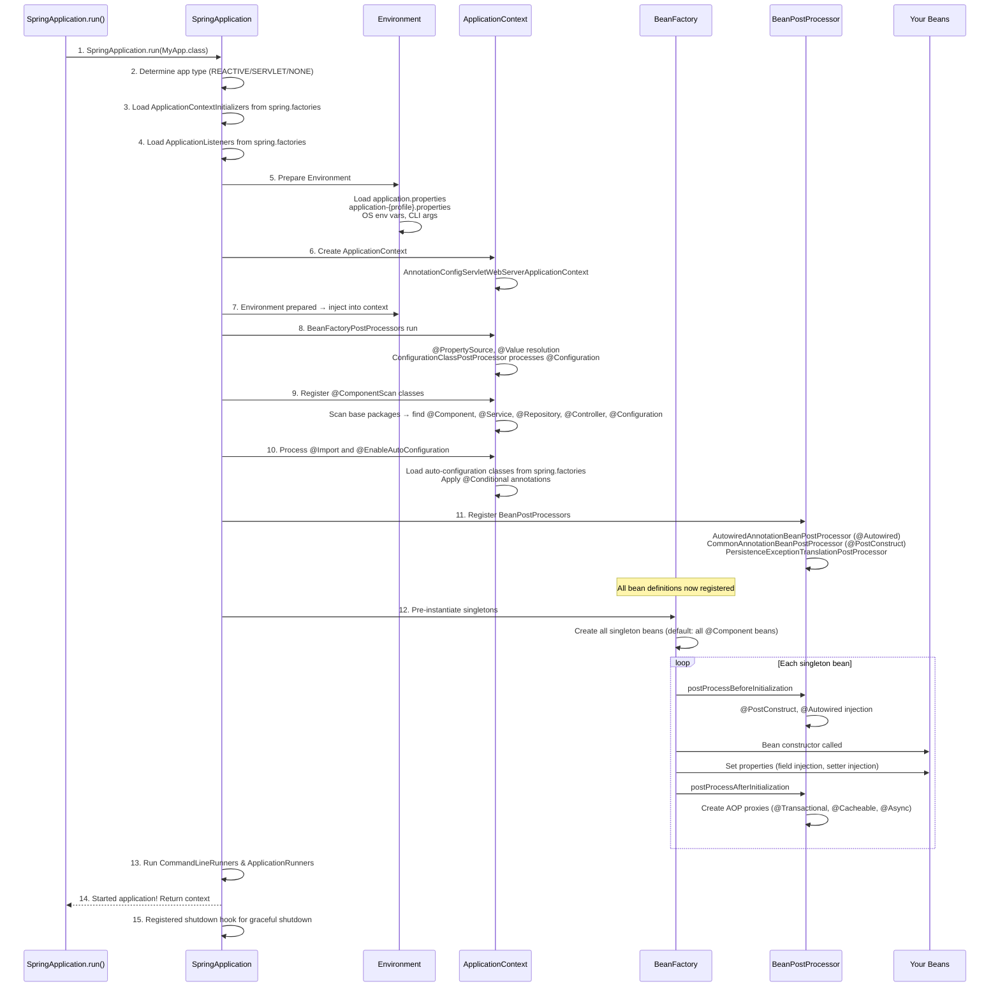

# Spring Boot Internals — Complete Deep Dive

## 1. Why This Concept Matters

Spring Boot's "magic" — automatic configuration, embedded Tomcat, component scanning — is powered by a deep chain of internal machinery. Understanding what happens when you call `SpringApplication.run()` separates developers who just use annotations from those who can debug production issues like beans not found, autoconfiguration not applying, conditional beans not created, or circular dependencies. Interviewers test Spring Boot internals at senior levels because they reveal whether you truly understand dependency injection, bean lifecycle, proxying, and how Spring manages your application.

Misunderstanding Spring Boot internals causes:
- `@Autowired` fields being null (bean not created, or dependency cycle)
- `@ConditionalOnProperty` not working (wrong prefix or name)
- `@ConfigurationProperties` not binding (missing getter/setter)
- Circular dependency errors (how to break with `@Lazy`)
- `@ComponentScan` not finding your beans (wrong base package)
- Auto-configuration not applying (your own bean takes priority)

## 2. Basic Meaning

Spring Boot simplifies Spring application setup by providing:
- **Auto-Configuration**: automatically configures beans based on classpath dependencies (you add `spring-boot-starter-web` → it auto-configures Tomcat, DispatcherServlet, Jackson)
- **Embedded Server**: Tomcat, Jetty, or Undertow bundled directly — no external server needed
- **Starter Dependencies**: pre-configured dependency groups (`spring-boot-starter-web`, `spring-boot-starter-data-jpa`)
- **`@EnableAutoConfiguration`**: the central annotation that triggers all auto-configuration logic
- **`@SpringBootApplication`**: a convenience annotation = `@Configuration` + `@EnableAutoConfiguration` + `@ComponentScan`

**Key vocabulary:**
- **ApplicationContext**: the IoC container that manages all beans. Types: `AnnotationConfigApplicationContext` (standalone), `AnnotationConfigServletWebServerApplicationContext` (web app).
- **BeanFactoryPostProcessor**: runs before beans are created. Modifies bean definitions (e.g., `PropertySourcesPlaceholderConfigurer` resolves `${...}` placeholders).
- **BeanPostProcessor**: runs after beans are created (before/after init). Wraps beans with proxies (e.g., `@Transactional` → `TransactionInterceptor` wraps the bean).
- **BeanDefinition**: metadata about a bean — its class, scope, init/destroy methods, constructor arguments, property values.
- **AutoConfiguration**: a `@Configuration` class that creates beans conditionally based on classpath, properties, existing beans.
- **SpringFactoriesLoader**: loads auto-configuration classes from `META-INF/spring.factories` or `META-INF/spring/org.springframework.boot.autoconfigure.AutoConfiguration.imports`.
- **@Conditional**: family of annotations that control whether a bean/configuration is loaded (`@ConditionalOnClass`, `@ConditionalOnMissingBean`, `@ConditionalOnProperty`).

## 3. Real Code / Real Example

```java
// === 1. WHAT HAPPENS WHEN YOU RUN A SPRING BOOT APP ===

@SpringBootApplication  // = @Configuration + @EnableAutoConfiguration + @ComponentScan
public class MyApplication {
    public static void main(String[] args) {
        // This single line triggers the ENTIRE startup sequence below
        ConfigurableApplicationContext ctx = SpringApplication.run(MyApplication.class, args);
        
        // After startup: ctx contains all beans
        MyService service = ctx.getBean(MyService.class);
    }
}

// === 2. HOW AUTO-CONFIGURATION WORKS ===

// Spring Boot checks classpath for specific classes:
// If H2 database driver is on classpath → auto-configures DataSource
// If spring-boot-starter-web is on classpath → auto-configures DispatcherServlet, Tomcat, Jackson
// If spring-boot-starter-data-jpa is on classpath → auto-configures EntityManagerFactory, TransactionManager

// Example: How JdbcTemplate gets auto-configured (simplified):
@Configuration
@ConditionalOnClass(DataSource.class)  // Only if DataSource is on classpath
@ConditionalOnMissingBean(JdbcTemplate.class)  // Only if user hasn't defined their own
public class JdbcTemplateAutoConfiguration {
    
    @Bean
    @ConditionalOnMissingBean  // Only if user hasn't defined JdbcTemplate
    public JdbcTemplate jdbcTemplate(DataSource dataSource) {
        // DataSource is auto-configured separately
        return new JdbcTemplate(dataSource);
    }
}

// === 3. CONDITIONAL BEAN EXAMPLES ===

@Configuration
public class MyConditionalConfig {
    
    // This bean exists only if "app.feature.enabled=true" in application.properties
    @Bean
    @ConditionalOnProperty(name = "app.feature.enabled", havingValue = "true")
    public FeatureService featureService() {
        return new FeatureService();
    }
    
    // This bean exists only if Redis is on the classpath
    @Bean
    @ConditionalOnClass(name = "redis.clients.jedis.Jedis")
    public RedisTemplate<String, String> redisTemplate() {
        return new RedisTemplate<>();
    }
    
    // This bean exists only if no other DataSource bean is defined
    @Bean
    @ConditionalOnMissingBean(DataSource.class)
    public DataSource defaultDataSource() {
        return new EmbeddedDatabaseBuilder().build();
    }
    
    // This bean is created only on a specific profile
    @Bean
    @Profile("dev")
    public DevOnlyService devService() {
        return new DevOnlyService();
    }
}

// === 4. COMPONENT SCANNING ===

@Service // <- @Component annotation — detected by @ComponentScan
public class MyService {
    // Spring finds this class because it's in the same package (or sub-package) as @SpringBootApplication
}

// Custom scan base packages:
// @SpringBootApplication(scanBasePackages = {"com.myapp.controller", "com.myapp.service"})

// === 5. SEEING THE BEANS (debugging) ===

@Component
public class BeanLister implements ApplicationRunner {
    
    @Override
    public void run(ApplicationArguments args) {
        // Print all beans in context — useful for debugging
        String[] beanNames = applicationContext.getBeanDefinitionNames();
        System.out.println("Total beans: " + beanNames.length);
        for (String name : beanNames) {
            System.out.println("  " + name + " -> " + 
                applicationContext.getBean(name).getClass().getSimpleName());
        }
    }
}

// === 6. CUSTOM AUTO-CONFIGURATION (for libraries) ===

// Step 1: Create auto-configuration class
@Configuration
@ConditionalOnClass(MyLibraryService.class)
public class MyLibraryAutoConfiguration {
    
    @Bean
    @ConditionalOnMissingBean
    public MyLibraryService myLibraryService() {
        return new MyLibraryService();
    }
}

// Step 2: Register it in META-INF/spring.factories (Spring Boot 2.x):
// org.springframework.boot.autoconfigure.EnableAutoConfiguration=\
// com.mylibrary.MyLibraryAutoConfiguration

// Step 3: Or in META-INF/spring/org.springframework.boot.autoconfigure.AutoConfiguration.imports (Spring Boot 3.x):
// com.mylibrary.MyLibraryAutoConfiguration
```

Expected startup log output:
```
  .   ____          _            __ _ _
 /\\ / ___'_ __ _ _(_)_ __  __ _ \ \ \ \
( ( )\___ | '_ | '_| | '_ \/ _` | \ \ \ \
 \\/  ___)| |_)| | | | | || (_| |  ) ) ) )
  '  |____| .__|_| |_|_| |_\__, | / / / /
 =========|_|==============|___/=/_/_/_/
 :: Spring Boot ::                (v3.2.0)

2026-06-23T12:00:00.123Z  INFO Starting MyApplication
2026-06-23T12:00:00.456Z  INFO Bootstrapping Spring Boot...
2026-06-23T12:00:00.789Z  INFO No active profile set, falling back to 1 default profile: "default"
2026-06-23T12:00:01.012Z  INFO Started application in 1.234 seconds
```

## 4. What Happens Internally

### Spring Boot Startup Sequence


### Bean Lifecycle
```mermaid
graph TD
    A[Bean Definition Loaded] --> B[BeanFactoryPostProcessors run]
    B --> C[Instantiation - constructor called]
    C --> D[Populate properties / Setter injection]
    D --> E[Set Bean Name / BeanFactory]
    E --> F[BeanPostProcessor.postProcessBeforeInit]
    F --> G[@PostConstruct / afterPropertiesSet / init-method]
    G --> H[BeanPostProcessor.postProcessAfterInit]
    H --> I[Bean is ready for use]
    I --> J[AOP proxies applied here - @Transactional etc]
    
    subgraph "Destruction"
        J --> K[ApplicationContext.close()]
        K --> L[@PreDestroy / destroy-method]
        L --> M[Bean destroyed]
    end
    
    note[NB: BeanPostProcessors are applied in order<br/>multiple processors can wrap the bean]
```

### @Conditional Logic Chain
```mermaid
graph TD
    A[Spring loads AutoConfiguration class] --> B{@ConditionalOnClass?}
    B -->|Required class NOT on classpath| C[Skip this config]
    B -->|Required class found| D{@ConditionalOnProperty?}
    D -->|Property missing or wrong value| C
    D -->|Property matches| E{@ConditionalOnMissingBean?}
    E -->|Bean already defined by user| C
    E -->|Bean not defined| F{@ConditionalOnBean?}
    F -->|Required dependency bean missing| C
    F -->|Dependency found| G[Create beans from this config]
    
    note[All conditions must pass for configuration to apply<br/>Order: Class → Property → MissingBean → Bean → Resource → Expression]
```

## 5. Tricky Interview Cases

**Case 1 — Circular Dependency**
```java
@Service
public class ServiceA {
    @Autowired
    private ServiceB serviceB; // Circular!
}

@Service
public class ServiceB {
    @Autowired
    private ServiceA serviceA; // Circular!
}
// Error: Requested beans are currently in creation: Is there an unresolvable circular reference?
```
Fix: Use `@Lazy` on one side (creates a proxy that resolves on first use):
```java
@Service
public class ServiceA {
    @Autowired @Lazy
    private ServiceB serviceB; // Proxy injected, actual bean resolved when used
}
```

**Case 2 — Bean Overriding**
```java
@Configuration
public class Config1 {
    @Bean
    public DataSource dataSource() {
        return new HikariDataSource(); // Default
    }
}

@Configuration
public class Config2 {
    @Bean
    @Primary // This one wins
    public DataSource dataSource() {
        return new TomcatDataSource(); // Override
    }
}
```
By default, Spring Boot throws `BeanDefinitionOverrideException` if two beans of the same type/name are defined. Use `@Primary` to declare which one wins. Or set `spring.main.allow-bean-definition-overriding=true`.

**Case 3 — @ConditionalOnProperty not working**
```java
@Bean
@ConditionalOnProperty(name = "my.feature.enabled", havingValue = "true")
public FeatureService featureService() { ... }

// application.properties has:
// my.feature.enabled: true
// But featureService bean is NOT created!
```
Problem: `@ConditionalOnProperty` uses "exact match" by default. The value must match exactly. Whitespace matters. Use `matchIfMissing = true` if the property is optional.

**Case 4 — @ComponentScan doesn't scan my beans**
```java
// MyApplication.java is in package: com.myapp
// MyService.java is in package: com.other.service
// @ComponentScan defaults to the package of @SpringBootApplication class
// MyService is NOT found!
```
Fix: `@SpringBootApplication(scanBasePackages = {"com.myapp", "com.other"})` or move classes to sub-packages of the main application class.

## 6. Common Mistakes

| Mistake | Problem | Fix |
|---------|---------|-----|
| `@Autowired` on final fields | Cannot inject — field must be mutable | Use constructor injection instead |
| `@ConfigurationProperties` without getter/setter | Properties don't bind | Add @Data (Lombok) or manual getters/setters |
| `@SpringBootApplication` in wrong package | Beans not scanned | Place main class in root package of your app |
| Circular dependency | BeanCurrentlyInCreationException | `@Lazy` on one side, or refactor |
| No `@EnableConfigurationProperties` | @ConfigurationProperties not activated | Add `@EnableConfigurationProperties(MyProps.class)` |
| `@ConditionalOnMissingBean` on auto-config | User can't override your bean | Use `@ConditionalOnMissingBean` to allow override |
| Component scanning too broad | Picks up test beans, configs from other modules | Narrow scan base packages |

## 7. Production Usage

**Debugging auto-configuration:**
```bash
# See what auto-configuration was applied and why
# Shows positive matches (applied) and negative matches (skipped with reason)
java -jar myapp.jar --debug
# OR in application.properties:
debug=true

# See all beans in context (production endpoint)
# GET /actuator/beans
management.endpoints.web.exposure.include=beans

# See conditions report (what auto-config was applied and why)
# GET /actuator/conditions
```

**Overriding auto-configuration:**
```yaml
# Exclude specific auto-configurations
spring:
  autoconfigure:
    exclude:
      - org.springframework.boot.autoconfigure.jdbc.DataSourceAutoConfiguration
      - org.springframework.boot.autoconfigure.orm.jpa.HibernateJpaAutoConfiguration
      
# Or use annotation:
# @SpringBootApplication(exclude = DataSourceAutoConfiguration.class)
```

**Custom property validation:**
```java
@ConfigurationProperties(prefix = "app")
@Validated
public class AppProperties {
    @NotEmpty
    private String name;
    
    @Min(1) @Max(100)
    private int poolSize = 10;
    
    @Email
    private String adminEmail;
    // getters/setters...
}
```

## 8. Advanced Details

- **Spring Boot 3.x vs 2.x**: Jakarta EE (javax → jakarta), AOT compilation, GraalVM native images, `spring.factories` → `AutoConfiguration.imports`.
- **Auto-configuration order**: Auto-configurations run after user-defined `@Configuration`. Use `@AutoConfigureAfter`, `@AutoConfigureBefore`, `@AutoConfigureOrder` for ordering.
- **`@EnableAutoConfiguration` vs `@SpringBootApplication`**: `@SpringBootApplication` includes `@EnableAutoConfiguration`. Never add both.
- **Lazy initialization**: `spring.main.lazy-initialization=true` — creates beans only when first requested. Reduces startup time, increases first-request latency.
- **Graceful shutdown**: `server.shutdown=graceful` — stops accepting new requests, waits for active requests to complete (configurable timeout).

## 9. Interview Questions And Answers

### Beginner
Q: What does `@SpringBootApplication` do?
A: It's a convenience annotation combining three annotations: `@Configuration` (marks the class as a configuration source), `@EnableAutoConfiguration` (tells Spring Boot to auto-configure beans based on classpath dependencies), and `@ComponentScan` (scans the package and sub-packages for `@Component` classes). You only need this one annotation on your main class.

### Intermediate
Q: What happens internally when you call `SpringApplication.run()`?
A: 1) Determine application type (servlet/reactive/none). 2) Load ApplicationContextInitializers and ApplicationListeners from spring.factories. 3) Prepare Environment (load application.properties, profiles, env vars). 4) Create ApplicationContext. 5) Run BeanFactoryPostProcessors (process @Configuration, @PropertySource, resolve ${...} placeholders). 6) Register component scan results. 7) Process @EnableAutoConfiguration (load and apply all auto-configuration classes conditionally). 8) Register BeanPostProcessors. 9) Pre-instantiate all singleton beans. 10) Run CommandLineRunners. 11) Return context.

### Senior
Q: Your Spring Boot app has a `DataSourceAutoConfiguration` that's creating a HikariCP datasource. You want to use a custom Datasource. How does Spring Boot know not to create the default one?
A: `DataSourceAutoConfiguration` is annotated with `@ConditionalOnMissingBean(DataSource.class)`. When the auto-configuration class is loaded, Spring checks if a `DataSource` bean already exists in the context. If you define your own `@Bean DataSource`, it gets registered BEFORE auto-configuration runs (user configs have higher priority). The conditional check finds your bean and skips the auto-configured one. This is how all auto-configuration allows user overrides — every auto-configuration bean uses `@ConditionalOnMissingBean`.

### Tricky
Q: You have a `@Configuration` class with `@Bean` methods that call each other. One method uses method call (`dataSource()`) and another uses `@Autowired`. What's the difference?
A: When a `@Bean` method calls another `@Bean` method directly (e.g., `dataSource()` calls `jdbcTemplate(dataSource())`), Spring 5.3+ respects the inter-bean reference by intercepting the call at the class level — it returns the same singleton instance from the context. But if you have a `static @Bean` method calling a non-static `@Bean` method, the inter-bean reference doesn't work — Spring can't intercept static method calls. Fix: inject via method parameter instead (`@Bean public JdbcTemplate jdbcTemplate(DataSource ds)`).

## 10. Final 30-Second Answer

Spring Boot run: determine app type → prepare Environment → create ApplicationContext → BeanFactoryPostProcessors (resolve @Value, @PropertySource, @Configuration) → process @EnableAutoConfiguration with @Conditional checks → register BeanPostProcessors → create singleton beans (constructor → @Autowired → @PostConstruct → AOP proxy) → run runners → ready. **@SpringBootApplication** = @Configuration + @EnableAutoConfiguration + @ComponentScan. **@ConditionalOnMissingBean** allows user beans to override auto-configuration. Debug with `--debug` or `/actuator/conditions`.