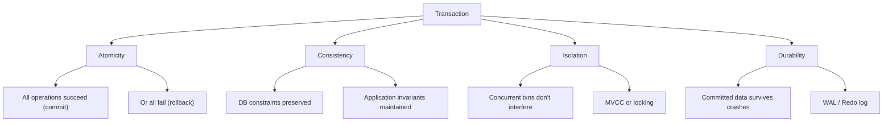
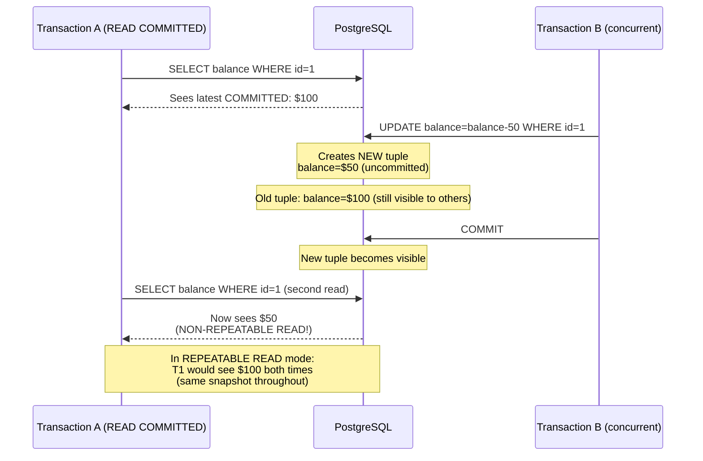
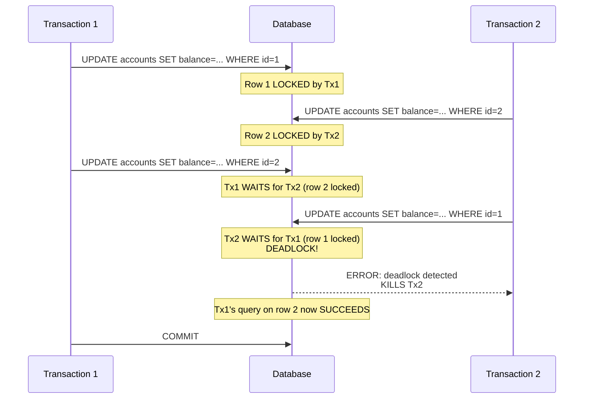
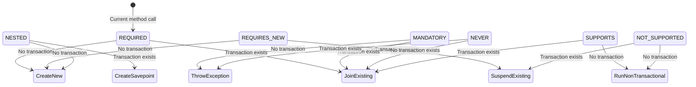
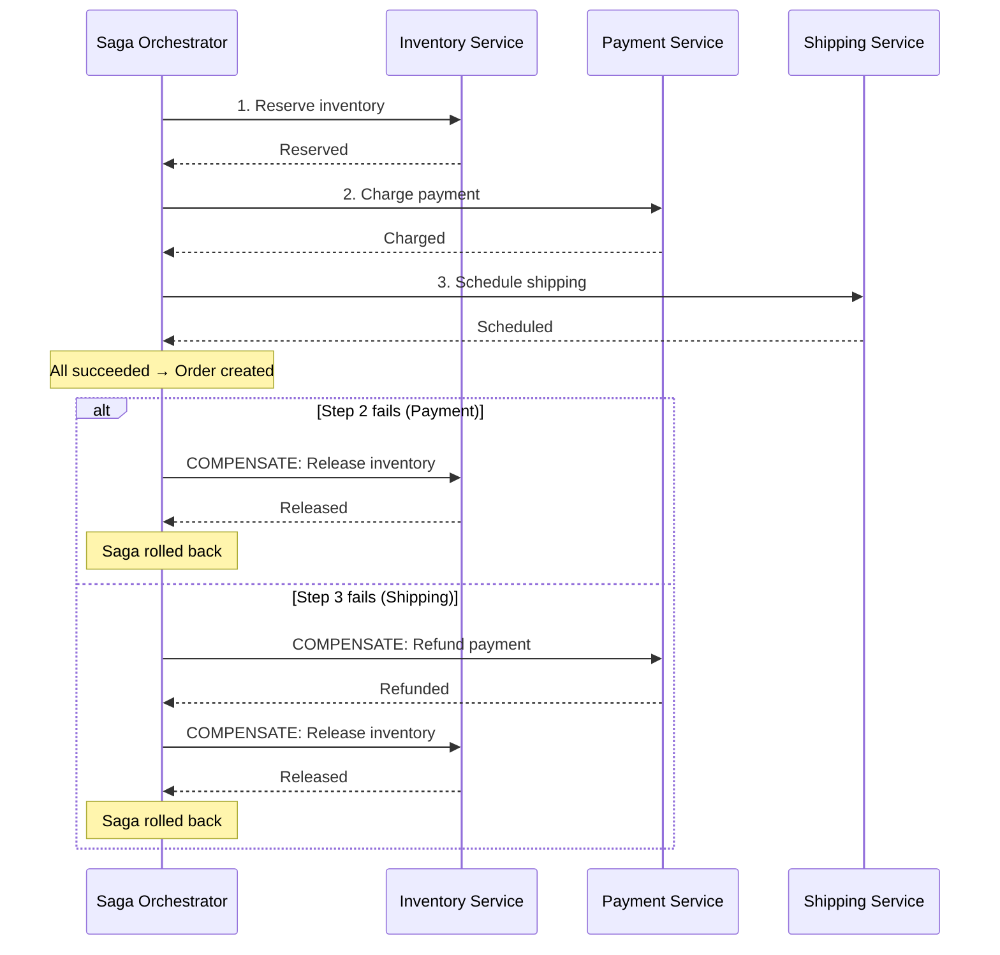

# Transactions & ACID — Complete Deep Dive

## 1. Why This Concept Matters

Database transactions are the foundation of data integrity in every production system. They ensure that a group of operations either all succeed or all fail atomically, maintaining consistency under concurrent access and crash scenarios. In distributed systems handling payments, bookings, and inventory, misunderstanding transactions causes data corruption, lost money, and unreproducible bugs. Interviewers test this because transaction errors are among the most expensive bugs in production — they cause silent data corruption, deadlocks that take down services, and phantom reads that confuse users.

Misunderstanding transactions causes:
- Dirty reads, non-repeatable reads, and phantom reads in concurrent systems
- Deadlocks from incorrect lock ordering or missing indexes
- Lost updates from optimistic lock failures without retry logic
- LazyInitializationException in JPA when accessing lazy fields outside transaction boundaries
- Distributed transaction failures when mixing multiple databases or message queues
- Transaction propagation mistakes causing audit logs to roll back with business data

## 2. Basic Meaning

A transaction is a sequence of database operations executed as a single logical unit. All operations succeed (commit) or all fail (rollback), even in the presence of crashes, power failures, or concurrent access.

**ACID properties:**
- **Atomicity**: All-or-nothing execution. If the transaction is interrupted (crash, error), all changes are rolled back to the previous state. Implemented via undo logs (MySQL) or write-ahead logging (PostgreSQL).
- **Consistency**: The database remains in a valid state before and after the transaction. Constraints (foreign keys, unique, check), triggers, and cascading rules are preserved. Application-level invariants require the developer to enforce.
- **Isolation**: Concurrent transactions execute as if they were serialized (run one after another). The database uses locking and MVCC to prevent interference between transactions.
- **Durability**: Once committed, the data survives crashes, power loss, and system failures. PostgreSQL achieves this via WAL (Write-Ahead Log) flushed to disk before commit acknowledgment. MySQL InnoDB uses doublewrite buffer + redo log.

**Isolation levels and phenomena:**

| Level | Dirty Read | Non-Repeatable Read | Phantom Read |
|-------|-----------|-------------------|--------------|
| Read Uncommitted | Possible | Possible | Possible |
| Read Committed | Prevented | Possible | Possible |
| Repeatable Read | Prevented | Prevented | Possible (MySQL) / Prevented (PostgreSQL) |
| Serializable | Prevented | Prevented | Prevented |


Think of two transactions running at same time:

```
Transaction A = Reading data
Transaction B = Changing data
```

## 1. Dirty Read (Reading uncommitted data)

Problem: **A reads B's changes before B commits**

Example:

Initial balance:

```
Account balance = $100
```

Transaction B:

```sql
UPDATE account
SET balance = 0;
```

(B has not committed yet)

Transaction A:

```sql
SELECT balance FROM account;
```

Gets:

```
$0
```

Now B does:

```sql
ROLLBACK;
```

Database returns:

```
balance = $100
```

Problem:

A saw data that never actually existed.

This happens in:

```
READ UNCOMMITTED
```

---

## 2. Non-repeatable Read (Same row, different value)

Problem: **A reads committed data, but B changes it later**

Initial:

```
Order status = PENDING
```

Transaction A:

```sql
SELECT status FROM orders;
```

Gets:

```
PENDING
```

Transaction B:

```sql
UPDATE orders
SET status='SHIPPED';

COMMIT;
```

Transaction A runs again:

```sql
SELECT status FROM orders;
```

Gets:

```
SHIPPED
```

Same query, same transaction, different value.

Problem:

The row changed.

This happens in:

```
READ COMMITTED
```

---

## 3. Phantom Read (Different rows)

Problem: **A runs same query but number of rows changes**

Initial:

Orders table:

```
1 PENDING
2 PENDING
3 SHIPPED
```

Transaction A:

```sql
SELECT *
FROM orders
WHERE status='PENDING';
```

Gets:

```
1
2
```

Transaction B:

```sql
INSERT INTO orders
VALUES(4,'PENDING');

COMMIT;
```

Transaction A again:

```sql
SELECT *
FROM orders
WHERE status='PENDING';
```

Gets:

```
1
2
4
```

Problem:

New row appeared (phantom).

---

## Simple Difference

| Issue               | What changed?             | Example                      |
| ------------------- | ------------------------- | ---------------------------- |
| Dirty Read          | Uncommitted value         | Read balance before rollback |
| Non-repeatable Read | Same row value changed    | PENDING → SHIPPED            |
| Phantom Read        | New/deleted rows appeared | 5 orders → 6 orders          |

Memory trick:

* **Dirty = I saw something that was never saved**
* **Non-repeatable = Same row, different value**
* **Phantom = Same query, different rows**

Isolation levels prevent them:

```
READ UNCOMMITTED
    ↓
READ COMMITTED
    ↓
REPEATABLE READ
    ↓
SERIALIZABLE
```

Higher isolation = more protection but less concurrency.

Recap - 

- **Dirty read**: Transaction A reads uncommitted data from Transaction B. If B rolls back, A has read data that never existed. Example: A reads a user's balance as $0 (B is transferring money out), then B rolls back. A incorrectly assumes the user is bankrupt.
- **Non-repeatable read**: Transaction A reads the same row twice and gets different values because Transaction B updated and committed between the two reads. Example: A reads order status as "PENDING", B changes to "SHIPPED" and commits, A reads again — sees "SHIPPED" in the same transaction.
- **Phantom read**: Transaction A runs the same query twice and gets different rows because Transaction B inserted or deleted rows between the two executions. Example: A queries `SELECT * FROM orders WHERE status = 'PENDING'` and gets 5 rows. B inserts a new pending order and commits. A queries again — now 6 rows.


**Database defaults:**
- PostgreSQL: READ COMMITTED (default), REPEATABLE READ (snapshot isolation, prevents phantoms), SERIALIZABLE (true serialization)
- MySQL InnoDB: REPEATABLE READ (default), prevents phantoms via next-key locking
- Oracle, SQL Server: READ COMMITTED (default)

## 3. Real Code / Real Example

```java
import org.springframework.transaction.annotation.*;
import org.springframework.transaction.support.TransactionTemplate;
import org.springframework.transaction.PlatformTransactionManager;
import javax.persistence.*;
import java.math.BigDecimal;

@Service
public class TransferService {
    @PersistenceContext
    private EntityManager em;
    
    private final TransactionTemplate txTemplate;
    
    public TransferService(PlatformTransactionManager tm) {
        this.txTemplate = new TransactionTemplate(tm);
    }

    // === 1. DECLARATIVE TRANSACTION (Spring @Transactional) ===
    @Transactional(
        isolation = Isolation.READ_COMMITTED,
        propagation = Propagation.REQUIRED,
        rollbackFor = InsufficientFundsException.class,
        timeout = 30,
        readOnly = false
    )
    public void transfer(Long fromId, Long toId, BigDecimal amount) 
            throws InsufficientFundsException {
        
        // Both accounts locked to prevent concurrent updates
        Account from = em.find(Account.class, fromId, 
            LockModeType.PESSIMISTIC_WRITE);
        Account to = em.find(Account.class, toId,
            LockModeType.PESSIMISTIC_WRITE);
        
        if (from.getBalance().compareTo(amount) < 0) {
            throw new InsufficientFundsException(
                "Account " + fromId + " has insufficient funds. " +
                "Required: " + amount + ", Available: " + from.getBalance());
        }
        
        from.debit(amount);
        to.credit(amount);
        
        // JPA dirty checking auto-generates UPDATE on transaction commit
        // If any exception is thrown, whole transaction rolls back
    }

    // === 2. PROGRAMMATIC TRANSACTION (TransactionTemplate) ===
    public void transferProgrammatic(Long fromId, Long toId, BigDecimal amount) {
        txTemplate.execute(status -> {
            try {
                Account from = em.find(Account.class, fromId,
                    LockModeType.PESSIMISTIC_WRITE);
                Account to = em.find(Account.class, toId,
                    LockModeType.PESSIMISTIC_WRITE);
                
                from.debit(amount);
                to.credit(amount);
                
                // Auto-commit on success
                return null;
            } catch (Exception e) {
                status.setRollbackOnly(); // Mark for rollback
                throw e;
            }
        });
    }

    // === 3. OPTIMISTIC LOCKING (no DB locks, version check at commit) ===
    @Transactional
    public void updateProductPrice(Long productId, BigDecimal newPrice) 
            throws StaleDataException {
        
        // Retry loop for optimistic lock failures
        int retries = 3;
        while (retries > 0) {
            try {
                Product p = em.find(Product.class, productId);
                p.setPrice(newPrice);
                // @Version field auto-increments
                // If another transaction updated this row, 
                // OptimisticLockException is thrown on flush
                return;
            } catch (OptimisticLockException e) {
                retries--;
                if (retries == 0) throw new StaleDataException(
                    "Failed to update product after 3 retries", e);
                // Reload fresh data and retry
            }
        }
    }

    // === 4. TRANSACTION PROPAGATION ===
    @Transactional(propagation = Propagation.REQUIRED)
    public void processOrder(Long orderId) {
        updateInventory(orderId);
        chargeCustomer(orderId);
        sendConfirmation(orderId); // runs in same transaction
    }

    @Transactional(propagation = Propagation.REQUIRES_NEW)
    public void sendConfirmation(Long orderId) {
        // ALWAYS runs in a NEW, independent transaction
        // Committed even if processOrder() rolls back
        AuditLog log = new AuditLog(orderId, "CONFIRMATION_SENT");
        em.persist(log);
    }

    // === 5. READ-ONLY OPTIMIZATION ===
    @Transactional(readOnly = true, timeout = 10)
    public AccountReport generateReport(Long accountId) {
        Account account = em.find(Account.class, accountId);
        List<Transaction> txns = em.createQuery(
            "SELECT t FROM Transaction t WHERE t.account.id = :id", 
            Transaction.class)
            .setParameter("id", accountId)
            .getResultList();
        return new AccountReport(account, txns);
    }

    // === 6. ISOLATION LEVEL TEST ===
    @Transactional(isolation = Isolation.SERIALIZABLE)
    public void serializedOperation() {
        // Full serialization — highest safety, lowest concurrency
        // PostgreSQL uses Serializable Snapshot Isolation (SSI)
        // May throw "could not serialize access" on conflict
    }

    // === 7. MANUAL ROLLBACK ===
    @Transactional
    public void conditionalOperation(boolean shouldFail) {
        try {
            em.persist(new Entity("data"));
            if (shouldFail) {
                // Force rollback without throwing exception
                TransactionAspectSupport.currentTransactionStatus()
                    .setRollbackOnly();
                return;
            }
        } catch (RuntimeException e) {
            // Exception auto-marks for rollback
            throw e;
        }
    }
}

// === SUPPORTING CLASSES ===
@Entity
public class Account {
    @Id @GeneratedValue(strategy = GenerationType.IDENTITY)
    private Long id;
    private BigDecimal balance;
    
    @Version // Optimistic lock version
    private int version;
    
    public void debit(BigDecimal amount) {
        this.balance = this.balance.subtract(amount);
    }
    public void credit(BigDecimal amount) {
        this.balance = this.balance.add(amount);
    }
}

@Entity
public class Product {
    @Id @GeneratedValue(strategy = GenerationType.IDENTITY)
    private Long id;
    private BigDecimal price;
    
    @Version
    private int version;
}

class InsufficientFundsException extends Exception {
    public InsufficientFundsException(String msg) { super(msg); }
}

class StaleDataException extends RuntimeException {
    public StaleDataException(String msg, Throwable cause) { super(msg, cause); }
}
```

Expected output:
```
transfer(): accounts LOCKED, no concurrent modifications allowed
updateProductPrice(): OptimisticLockException triggers retry
processOrder() + sendConfirmation(): REQUIRES_NEW ensures audit log survives rollback
generateReport(): readOnly=true skips dirty checking, saves CPU
```

## 4. What Happens Internally

### Mermaid Diagrams

#### ACID Properties


#### PostgreSQL MVCC Flow


#### Deadlock Timeline


#### Transaction Propagation


#### Saga Pattern (Orchestration)


**PostgreSQL MVCC (Multi-Version Concurrency Control):**

PostgreSQL implements isolation via tuple versioning. Each row can have multiple versions (tuples). When a transaction updates a row, it creates a NEW tuple instead of overwriting the old one. Old tuples remain until they are no longer visible to any active transaction and are cleaned up by VACUUM.

```
Transaction A (READ COMMITTED):
    SELECT balance FROM accounts WHERE id = 1;
    → Sees latest COMMITTED balance ($100)
    
Transaction B (concurrent):
    UPDATE accounts SET balance = balance - 50 WHERE id = 1;
    → Creates NEW tuple: balance = $50 (not yet committed)
    COMMIT;
    → New tuple becomes visible
    
Transaction A (READ COMMITTED, second statement):
    SELECT balance FROM accounts WHERE id = 1;
    → Now sees $50 (latest committed)
    → Non-repeatable read! A sees different values within same transaction.

In REPEATABLE READ mode:
    Transaction A would see the SAME snapshot throughout
    → First read: $100 (from transaction start snapshot)
    → Second read: still $100 (same snapshot ignores B's commit)
```

**PostgreSQL REPEATABLE READ = Snapshot Isolation:**
Unlike the ANSI standard, PostgreSQL's REPEATABLE READ prevents phantom reads entirely. The first query establishes a snapshot. All subsequent queries see the same snapshot, ignoring concurrent inserts/deletes.

**MySQL InnoDB REPEATABLE READ:**
Uses next-key locking (record lock + gap lock) to prevent phantoms. When a transaction reads a range, InnoDB locks both existing rows and the gaps between them, preventing other transactions from inserting new rows in that range.

**Spring @Transactional proxy:**
```java
// At runtime, Spring creates a JDK/CGLIB proxy:
class TransferServiceProxy extends TransferService {
    private TransactionInterceptor interceptor;
    
    public void transfer(Long from, Long to, BigDecimal amt) {
        interceptor.invoke(() -> {
            // Before: open transaction (get connection, set autoCommit=false)
            //         set transaction isolation
            try {
                super.transfer(from, to, amt);
                // On success: commit, release locks
            } catch (Exception e) {
                // On failure: rollback, restore previous state
                throw e;
            } finally {
                // After: close/return connection to pool
            }
        });
    }
}
```

**Deadlock detection example:**
```
Time  Tx1                                Tx2
1     UPDATE accounts SET balance=...    (idle)
      WHERE id = 1; (LOCK on row 1)     
2                                        UPDATE accounts SET balance=...
                                          WHERE id = 2; (LOCK on row 2)
3     UPDATE accounts SET balance=...    
      WHERE id = 2;  (WAITS for Tx2)    
4                                        UPDATE accounts SET balance=...
                                          WHERE id = 1; (WAITS for Tx1)
                                          → DEADLOCK!
5     Database detects cycle, kills Tx2:
      "ERROR: deadlock detected"
6     Tx1's query on row 2 now succeeds 
```

## 5. Tricky Interview Cases

**Case 1 — @Transactional on private method**
```java
@Service
public class MyService {
    @Transactional
    private void doWork() { // Does NOT work!
        // Proxy won't intercept private methods
        // No transaction created
    }
    
    public void caller() {
        doWork(); // NO transaction! Each DB op auto-commits
    }
}
```
Output: No transaction. Each `save()` commits individually. If `caller()` throws, partial data persisted.
Explanation: Spring's AOP proxy intercepts only public methods called from OUTSIDE the class. Self-invocation bypasses the proxy. **Fix**: Make the method public, or inject self-reference and call via proxy.

**Case 2 — Same-class method call (self-invocation)**
```java
@Service
public class OrderService {
    @Transactional
    public void processOrder(Long id) {
        // Transaction active here
        updateInventory(id); // Self-invocation!
    }
    
    @Transactional(propagation = Propagation.REQUIRES_NEW)
    public void updateInventory(Long id) {
        // Runs in SAME transaction as processOrder!
        // REQUIRES_NEW is IGNORED for self-invocation
    }
}
```
Output: `updateInventory` joins `processOrder`'s transaction instead of creating a new one.
Explanation: AOP proxy intercepts only external calls. Self-invocation (calling `this.updateInventory()`) bypasses the proxy entirely. **Fix**: Inject `@Autowired OrderService self` and call `self.updateInventory()`.

**Case 3 — Exception handling inside @Transactional**
```java
@Transactional
public void createOrder(Order order) {
    try {
        orderRepo.save(order);
        emailService.sendConfirmation(order.getEmail()); // throws
    } catch (Exception e) {
        log.error("Email failed but order saved?"); 
        // Order IS saved because exception was CAUGHT!
    }
}
```
Output: Order persists even if email fails, because caught exception doesn't trigger rollback.
Explanation: Spring marks for rollback only when RuntimeException propagates out of the transactional method. Caught exceptions are ignored. **Fix**: Either throw the exception, or call `TransactionAspectSupport.currentTransactionStatus().setRollbackOnly()`.

**Case 4 — Propagation.REQUIRES_NEW and connection pool exhaustion**
```java
@Transactional(propagation = Propagation.REQUIRES_NEW)
public void logActivity() {
    // Always SUSPENDS outer transaction, allocates NEW connection
    // If outer holds connection + inner needs new one = 2 connections
    // With 10 concurrent requests: up to 20 connections from pool
}
```
Output: Potential connection pool exhaustion under high concurrency (max pool: 10, each request holds 2).
Explanation: REQUIRES_NEW suspends the outer transaction (keeps its connection) and gets a new connection for the inner transaction. Both connections are held simultaneously.

**Case 5 — Serializable isolation retry**
```java
@Transactional(isolation = Isolation.SERIALIZABLE)
public void updateCounter(Long id) {
    Counter c = em.find(Counter.class, id);
    c.setValue(c.getValue() + 1);
}
// With 100 concurrent calls: most will fail with
// "ERROR: could not serialize access due to read/write dependencies"
```
Output: Most transactions fail with serialization error under high concurrency.
Explanation: Serializable isolation uses optimistic conflict detection. PostgreSQL's SSI detects read/write conflicts and aborts one transaction. **Fix**: Retry loop with exponential backoff.

## 6. Common Mistakes

| Mistake | Problem | Fix |
|---------|---------|-----|
| Missing `@Transactional` on write operations | Partial persistence on error (each DB op commits individually) | Add `@Transactional` on service methods |
| `Propagation.REQUIRES_NEW` in hot path | Connection pool exhaustion, increased latency | Use `REQUIRED` unless independent commit is absolutely needed |
| Pessimistic lock without ordered acquisition | Database deadlock | Always lock resources in the same order (e.g., by ID ascending) |
| Optimistic lock failure without retry | User sees "stale data" errors | Implement retry loop (3 retries with exponential backoff) |
| Catching exception inside `@Transactional` | Transaction commits despite error | Throw RuntimeException, or use `setRollbackOnly()` |
| `readOnly=true` on write operations | `TransactionRequiredException` or silent failure | Use `readOnly` for SELECT-only methods |
| Long transactions (minutes) | Connection held, lock contention, MVCC bloat | Keep transactions short (< 1 second preferred) |
| Mixed data sources without XA | No cross-resource atomicity | Consider Saga pattern for distributed transactions |
| `self.invoke()` pattern with `@Transactional` | REQUIRES_NEW ignored | Inject self reference via `@Autowired` |

## 7. Interview Traps & Frequently Asked Questions

### 🔴 Critical Traps

**Trap 1: Spring proxy cannot intercept same-class method calls**
```java
@Service
public class OrderService {
    @Transactional
    public void processOrder(Long id) {
        updateInventory(id); // Self-invocation — bypasses proxy!
    }
    
    @Transactional(propagation = Propagation.REQUIRES_NEW)
    public void updateInventory(Long id) {
        // Expected: new transaction
        // Actual: joins processOrder()'s transaction
        // REQUIRES_NEW is SILENTLY IGNORED
    }
}
```
Why: Spring creates a proxy class that wraps `OrderService`. Inside `processOrder()`, `this.updateInventory()` calls the raw object directly, not the proxy. The proxy never sees the call, so `@Transactional` is ignored.

Fix options:
1. Self-injection: `@Autowired private OrderService self;` → `self.updateInventory()` (goes through proxy)
2. Extract `updateInventory()` into a separate `@Service` bean
3. Use AspectJ compile-time weaving (avoids proxy entirely)

**Trap 2: Exception caught inside @Transactional**
```java
@Transactional
public void createOrder(Order order) {
    try {
        orderRepo.save(order);
        emailService.send(order.getEmail()); // throws EmailException
    } catch (Exception e) {
        log.error("Email failed"); // Transaction still commits!
    }
}
```
❌ Problem: If you catch the exception inside the method, Spring never sees it → Spring marks for rollback only when an exception **propagates out** of the method. The order persists even though email failed.

Fix:
```java
} catch (Exception e) {
    TransactionAspectSupport.currentTransactionStatus().setRollbackOnly();
    throw e; // OR rethrow to let Spring handle it
}
```

**Trap 3: Checked exceptions don't roll back by default**
```java
@Transactional
public void transfer(...) throws InsufficientFundsException { // checked exception
    // ... 
} // Default: only RuntimeException rolls back
```
Spring rolls back only on `RuntimeException` and `Error` by default. Checked exceptions don't trigger rollback.

Fix: `@Transactional(rollbackFor = {InsufficientFundsException.class, Exception.class})` or wrap checked exception in `RuntimeException`.

**Trap 4: Isolation level disclaimer ignored (MySQL vs PostgreSQL)**
```java
@Transactional(isolation = Isolation.REPEATABLE_READ)
// MySQL: prevents phantoms via next-key locking
// PostgreSQL REPEATABLE READ = snapshot isolation (prevents phantoms, allows serialization anomalies)
// But PostgreSQL's SERIALIZABLE also uses snapshot isolation with SSI detection
```
❌ Common mistake: Assuming all databases behave identically. MySQL InnoDB REPEATABLE READ uses locks (stronger). PostgreSQL REPEATABLE READ uses MVCC snapshots.

**Trap 5: LazyInitializationException from closed transaction**
```java
@Transactional(readOnly = true)
public Order getOrder(Long id) {
    Order order = em.find(Order.class, id);
    // order.getItems() is LAZY collection
} // Transaction closes, EntityManager closes

// Outside the service:
Set<Item> items = order.getItems(); // ❌ LazyInitializationException!
```
Fix: Fetch join in query, or keep transaction open longer, or use DTO projection.

### 📋 Common Interview Questions

**Q: Explain transaction propagation with examples.**

A: Propagation determines what happens when a transactional method calls another transactional method.

- **REQUIRED** *(default)*: Join existing if present, else create new.
```java
// Controller → @Transactional(REQUIRED) → Service
// Already in a transaction → joins it
// No outer transaction → creates new one
```

- **REQUIRES_NEW**: Always suspend outer and create new.
```java
@Transactional
public void placeOrder() {
    orderRepo.save(order);
    auditService.log("ORDER_PLACED"); // REQUIRES_NEW → independent
    paymentService.charge(); // REQUIRES_NEW → independent
} // rollback here → orderSave rolls back, but audit and payment COMMIT
```

- **NESTED**: Uses savepoint within existing transaction.
```java
@Transactional
public void createUser() {
    userRepo.save(user);
    try {
        profileService.create(); // NESTED → savepoint
    } catch (Exception e) {
        // Profile rolls back to savepoint, but USER is still saved
    }
}
```

- **MANDATORY**: Must run inside existing transaction, else throw `IllegalTransactionStateException`.
- **NEVER**: Must NOT run inside transaction, else throw.
- **SUPPORTS**: Join if exists, else run non-transactionally.
- **NOT_SUPPORTED**: Suspend if exists, run non-transactionally.

**Quick comparison table:**

| Propagation | Outer tx exists? | Behavior |
|------------|------------------|----------|
| REQUIRED | Yes | Join outer |
| REQUIRED | No | Create new |
| REQUIRES_NEW | Yes | Suspend outer + create new (parallel) |
| REQUIRES_NEW | No | Create new |
| NESTED | Yes | Savepoint (partial rollback possible) |
| NESTED | No | Create new |
| MANDATORY | Yes | Join outer |
| MANDATORY | No | Throw exception |

**Q: How does Spring create a transaction proxy?**

A: At startup, Spring scans for `@Transactional` methods. For each bean, it creates a proxy (CGLIB by default, or JDK dynamic proxy if the class implements an interface). When you call `orderService.placeOrder()`, the proxy intercepts the call, starts a transaction, invokes the real method, and then commits or rolls back before returning.

**Q: Why does self-invocation break @Transactional?**

A: Self-invocation calls go directly to the object's method, not the proxy. The proxy intercepts only external calls. Inside `myMethod()`, calling `this.otherMethod()` bypasses the proxy entirely. Spring AOP uses proxy-based weaving by default (not AspectJ compile-time weaving), which cannot intercept calls within the same object.

**Q: When would you use REQUIRES_NEW?**

A: For operations that **must commit independently** of the caller's transaction:
- Audit logging: even if user creation fails, the audit log should persist
- Notification sending: don't roll back an email just because business logic failed
- Compensation logs in Saga pattern: record each step regardless of later failures

**Q: What happens if a REQUIRES_NEW method is called inside a REQUIRED method and the outer rolls back?**

A: The inner transaction **already committed** (if it completed successfully). It is unaffected by the outer rollback. The inner transaction's changes are permanent.

**Q: What is a savepoint in NESTED transactions?**

A: A savepoint is a marker inside an existing transaction. If a NESTED method fails, only the work done after the savepoint is rolled back, not the entire transaction. Useful for partial rollback without ending the outer transaction.

**Q: What does readOnly=true actually do?**

A: 
- Hibernate: sets flush mode to MANUAL (skips dirty checking during the transaction — no performance hit tracking changes)
- Database driver: hints that the transaction won't modify data
- Connection pool: may route to read-only replica
Important: `readOnly=true` on a method that writes data will cause `TransactionRequiredException` or silent failure depending on JPA provider.

**Q: How do you handle LazyInitializationException?**

A: 
1. Fetch join in query: `SELECT o FROM Order o JOIN FETCH o.items WHERE o.id = :id`
2. Open Session in View pattern (OSIV): keeps EntityManager open for the whole HTTP request (`spring.jpa.open-in-view=true` by default in Spring Boot)
3. DTO projection: fetch exactly what you need
4. EntityGraph: optimize fetching strategies

### 🎯 One-Liner Interview Answers

"Transaction proxy intercepts external calls — self-invocation bypasses it. **Propagation**: REQUIRED joins, REQUIRES_NEW suspends+creates, NESTED uses savepoint. **Isolation**: Read Committed prevents dirty reads (default PG), Repeatable Read prevents dirty+non-repeatable (default MySQL), Serializable prevents all but uses locking/MVCC. **Proxy works via CGLIB subclassing**: Spring wraps your bean, intercepts `@Transactional` methods, opens connection, disables autoCommit, commits on success or rolls back on exception. Traps: catching exception inside `@Transactional` prevents rollback, `readOnly=true` on writes fails, REQUIRES_NEW self-call ignored, self-invocation bypasses proxy."


**Payment processing with pessimistic locking:**
```java
@Transactional(isolation = Isolation.REPEATABLE_READ, rollbackFor = PaymentException.class)
public PaymentResult processPayment(Long userId, BigDecimal amount) {
    // Lock the wallet row — prevent double-spend race
    Wallet wallet = em.find(Wallet.class, userId, LockModeType.PESSIMISTIC_WRITE);
    
    if (wallet.getBalance().compareTo(amount) < 0) {
        throw new PaymentException("Insufficient funds");
    }
    
    wallet.setBalance(wallet.getBalance().subtract(amount));
    Payment payment = new Payment(userId, amount, wallet.getBalance());
    em.persist(payment);
    
    return new PaymentResult(payment.getId(), wallet.getBalance());
}
```

**Batch processing with periodic flush:**
```java
@Transactional
public void processBatch(List<Record> records) {
    for (int i = 0; i < records.size(); i++) {
        em.persist(records.get(i));
        if (i % 500 == 0) {
            em.flush();  // Execute SQL, but don't commit
            em.clear();  // Release managed entities from memory
        }
    }
    // Single commit at end — atomic batch
}
```

**Saga pattern (orchestration) for distributed transactions:**
```java
// When you need atomicity across multiple services (no XA):
public class OrderSaga {
    @Transactional
    public void createOrder(Long userId, Long productId) {
        try {
            inventoryClient.reserve(productId); // HTTP call
            paymentClient.charge(userId);
            orderRepo.save(new Order(userId, productId, "CREATED"));
            
            // If payment succeeds but inventory fails, 
            // Saga must issue compensating transactions
        } catch (InventoryException e) {
            // Compensating: refund payment
            paymentClient.refund(userId);
            throw e;
        } catch (PaymentException e) {
            // Compensating: release inventory
            inventoryClient.release(productId);
            throw e;
        }
    }
}
```

## 8. Advanced Details

- **PostgreSQL `pg_stat_activity`**: Query current transaction state, locks, waiting queries:
  ```sql
  SELECT pid, state, wait_event_type, query, 
         age(now(), xact_start) as transaction_duration
  FROM pg_stat_activity 
  WHERE state = 'active' AND xact_start IS NOT NULL;
  ```
- **MySQL `SHOW ENGINE INNODB STATUS`**: Shows deadlocks, lock waits, transaction history.
- **Transaction timeout**: `@Transactional(timeout = 5)` — if transaction takes >5s, Spring throws `TransactionTimedOutException` and rolls back.
- **Read-only optimization**: `readOnly=true` sets Hibernate's flush mode to `MANUAL` — dirty checking is skipped, improving performance for read-only operations.
- **Distributed transactions (XA)**: Two-Phase Commit (2PC) across multiple databases/queues. Avoid — introduces coordinator as single point of failure, blocks on prepare phase.
- **Compensating transactions**: The modern alternative to distributed transactions. Each step has a compensating action that reverses it. If a later step fails, earlier steps are compensated.
- **Isolation vs performance**: Serializable is ~2-3x slower than Read Committed. Choose the weakest isolation level that prevents correctness issues.
- **`@Transactional(noRollbackFor = {BusinessException.class})`**: Mark checked business exceptions that should NOT trigger rollback.

## 9. Interview Questions And Answers

### Beginner
Q: What is ACID in databases?
A: Atomicity (all-or-nothing), Consistency (valid state before and after), Isolation (concurrent transactions don't interfere), Durability (committed data survives crashes). Example: A bank transfer debits account A and credits account B — both must succeed or both fail (Atomicity). The total money in the system must remain the same (Consistency). Two concurrent transfers should not interfere (Isolation). After commit, a power loss should not lose the transfer (Durability).

### Intermediate
Q: What is the difference between READ COMMITTED and REPEATABLE READ isolation levels?
A: READ COMMITTED: each statement sees only committed data. Different statements in the same transaction may see different data if another transaction commits between them. Allows non-repeatable reads and phantom reads.

REPEATABLE READ: the transaction sees a consistent snapshot established by the first query. All subsequent reads return the same data, even if other transactions commit updates or inserts. PostgreSQL's REPEATABLE READ (snapshot isolation) also prevents phantom reads. MySQL's REPEATABLE READ uses next-key locking to prevent phantoms.

### Senior
Q: Your payment system processes 10,000 transfers/minute. You're experiencing deadlocks. Using PostgreSQL `pg_locks` you find two transactions locking accounts in opposite order. How do you fix this without changing the isolation level?
A: The root cause is inconsistent lock ordering. Transaction A locks account 1 then 2. Transaction B locks account 2 then 1. When both run concurrently, they create a circular wait.

**Fix — deterministic lock ordering:**
```java
public void transfer(Long fromId, Long toId, BigDecimal amount) {
    // Always lock the SMALLER ID first
    List<Long> ids = List.of(fromId, toId);
    Long first = Collections.min(ids);
    Long second = Collections.max(ids);
    
    // Now both concurrent transfers lock in same order
    Account a1 = em.find(Account.class, first, PESSIMISTIC_WRITE);
    Account a2 = em.find(Account.class, second, PESSIMISTIC_WRITE);
    
    // Proceed with transfer
}
```
This guarantees that any two concurrent transfers always acquire locks in the same global order, preventing deadlock.

### Tricky
Q: You have an `@Transactional` service method that calls another `@Transactional` method on the same class with `REQUIRES_NEW`. Why doesn't it create a new transaction? How do you fix it?
A: Spring's `@Transactional` works via AOP proxies. When method A calls method B on the SAME class, it's a self-invocation — the call goes directly to the target object, bypassing the proxy. Spring never sees the call, so `@Transactional` on method B is ignored.

Fixes:
1. **Self-injection**: `@Autowired private MyService self;` then call `self.methodB()`.
2. **Separate bean**: Extract method B into a different Spring bean.
3. **AspectJ weaving**: Use compile-time weaving (not proxy-based) — affects all calls including self-invocation.

## 10. Final 30-Second Answer

Transaction = atomic group of DB operations. **ACID**: Atomicity (all-or-nothing), Consistency (valid state), Isolation (no interference), Durability (survives crashes). **Isolation levels**: Read Committed (no dirty reads, default PG), Repeatable Read (snapshot, default MySQL), Serializable (full serialization). **Phenomena**: Dirty read, non-repeatable read, phantom read. **MVCC**: PostgreSQL/InnoDB use multi-versioning — writers don't block readers. **Locking**: Pessimistic (DB locks rows, prevents conflicts) vs Optimistic (@Version, retry on conflict). **Propagation**: REQUIRED (join existing), REQUIRES_NEW (suspend + new), NESTED (savepoint). **Spring**: `@Transactional` on public service methods only. Self-invocation bypasses proxy. Always lock resources in consistent order to avoid deadlocks.