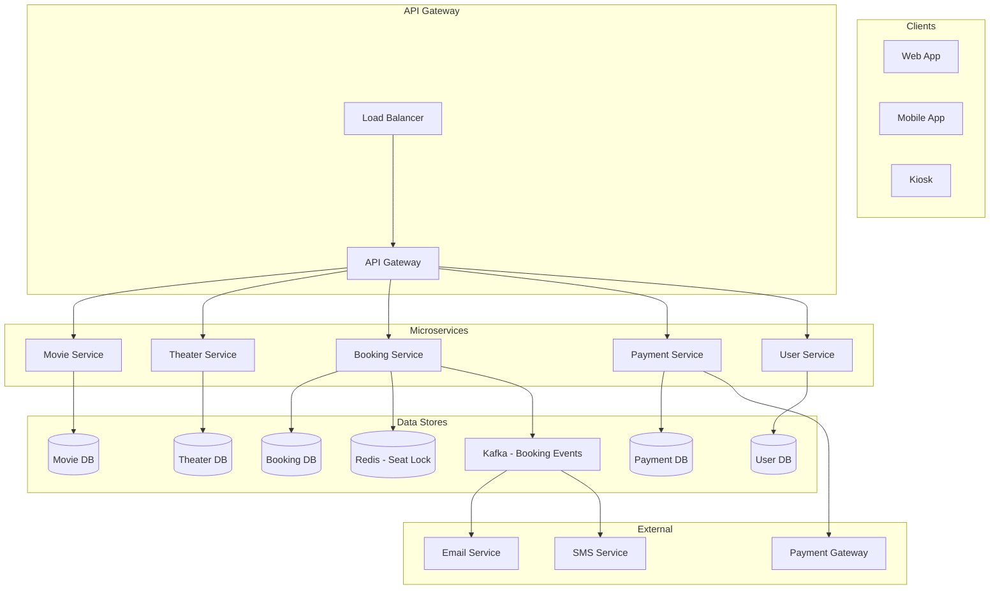
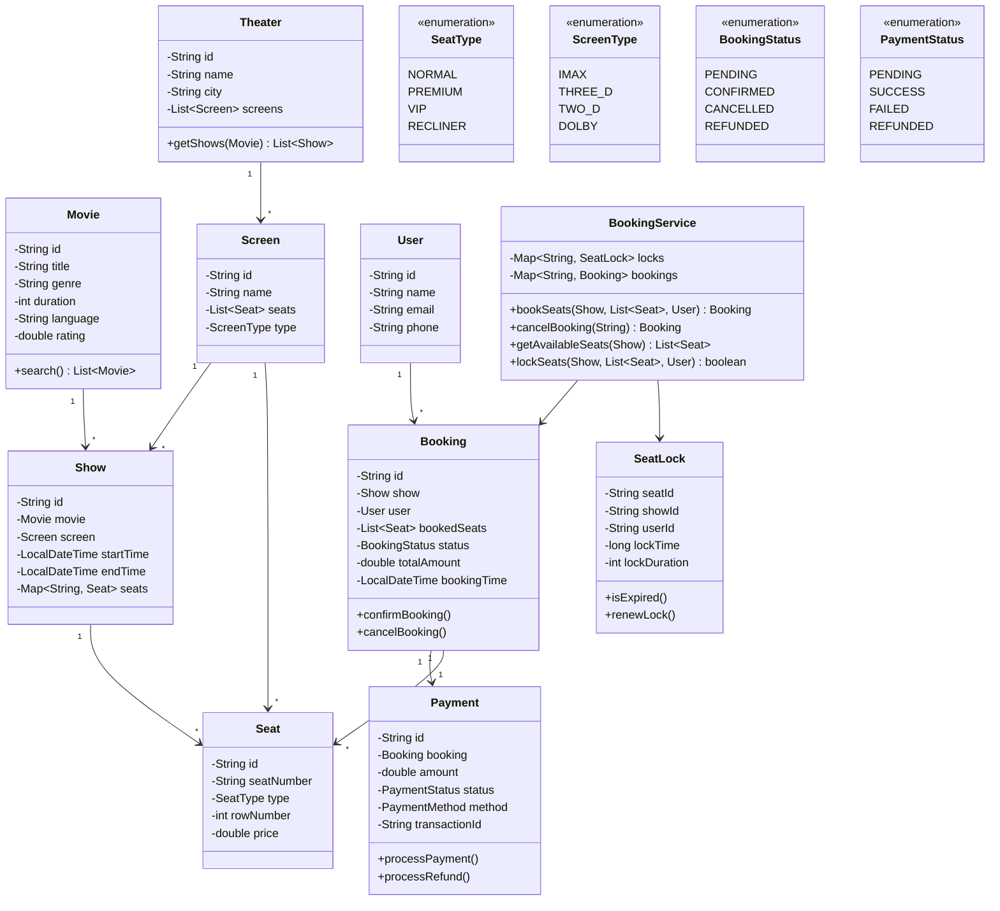
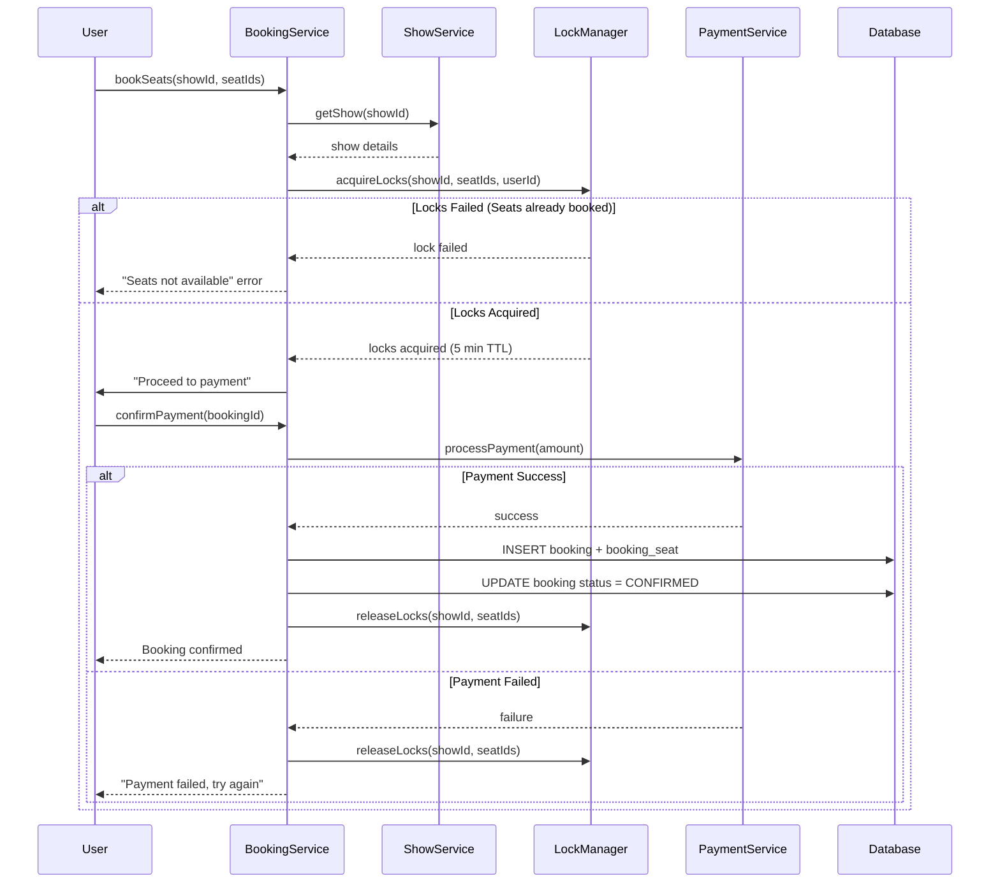
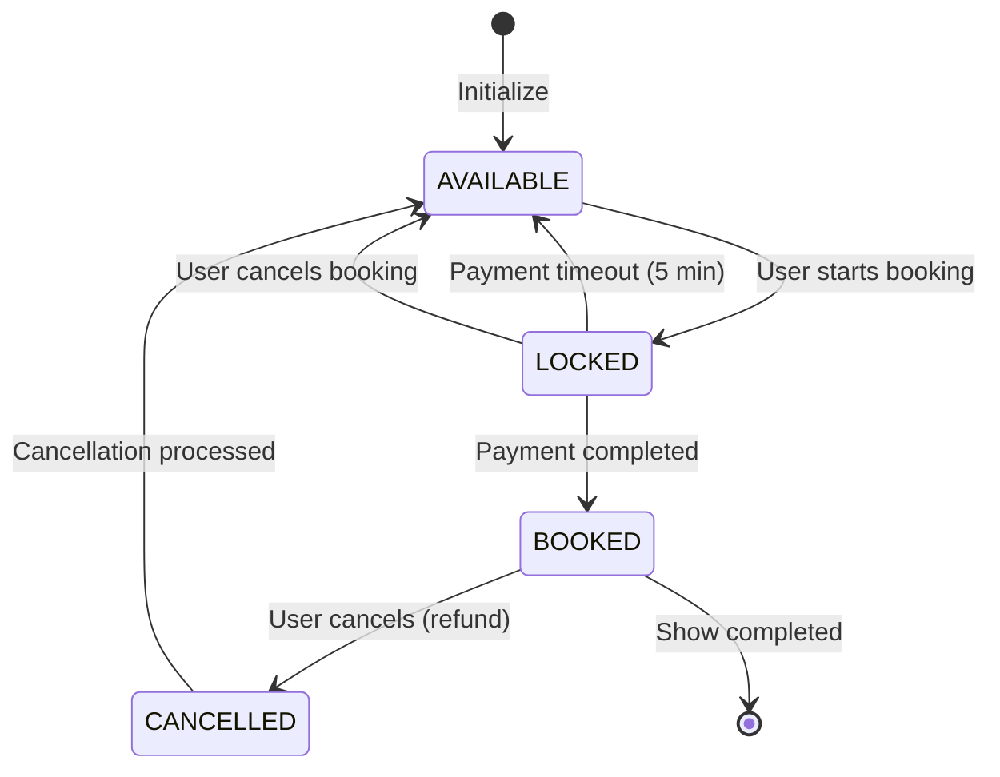
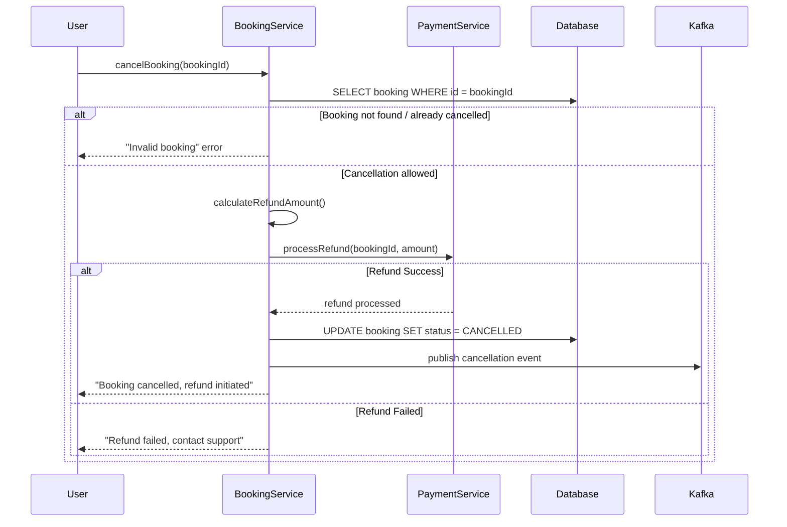

# 🎬 Movie Ticket Booking System (BookMyShow) — Complete LLD Guide

---

## 📋 Table of Contents
1. [Requirements](#requirements)
2. [HLD — High Level Design](#hld)
3. [Class Diagram (LLD)](#class-diagram)
4. [Database Schema](#database-schema)
5. [Flow Diagrams](#flow-diagrams)
6. [Design Patterns Used](#design-patterns)
7. [Complete Java Implementation](#implementation)
8. [Concurrency Handling](#concurrency)
9. [Interview Follow-ups](#follow-ups)

---

## 📝 Requirements

### Functional Requirements
1. **Movies & Shows** — Multiple movies with multiple shows per day
2. **Theaters & Screens** — Multiple theaters, each with multiple screens
3. **Seat Booking** — Select seats, prevent double booking
4. **Booking/Cancel** — Book tickets, cancel with refund logic
5. **Payment** — Process payment on booking
6. **Search** — Search movies by city, date, genre
7. **Revenue** — Track revenue per show/theater/movie

### Non-Functional Requirements
1. **Concurrency** — Handle 1000+ users trying to book same show
2. **Consistency** — No double booking ever
3. **Performance** — Seat availability query < 100ms
4. **Scalability** — Handle peak hours (Friday nights, holidays)

---

## <a name="hld"></a>🏛️ HLD — High Level Design

### System Architecture



### Component Responsibilities

| Component | Responsibility |
|-----------|---------------|
| **MovieService** | CRUD for movies, search, filters |
| **TheaterService** | Theater & screen management, seat layout |
| **BookingService** | Core booking logic, seat locking, cancellation |
| **PaymentService** | Payment processing, refunds |
| **ShowService** | Show scheduling, seat availability |

---

## <a name="class-diagram"></a>🏗️ LLD — Class Diagram



---

## <a name="database-schema"></a>🗄️ Database Schema

```mermaid
erDiagram
    MOVIE ||--o{ SHOW : has
    THEATER ||--o{ SCREEN : contains
    SCREEN ||--o{ SHOW : schedules
    SCREEN ||--o{ SEAT : has
    SHOW ||--o{ BOOKING : booked_in
    USER ||--o{ BOOKING : makes
    BOOKING ||--|{ BOOKING_SEAT : includes
    SEAT ||--o{ BOOKING_SEAT : reserved
    BOOKING ||--|| PAYMENT : settles

    MOVIE {
        bigint id PK
        varchar title
        varchar genre
        int duration_minutes
        varchar language
        varchar rating
        date release_date
        boolean is_active
        timestamp created_at
    }

    THEATER {
        bigint id PK
        varchar name
        varchar city
        varchar address
        int total_screens
        boolean is_active
    }

    SCREEN {
        bigint id PK
        bigint theater_id FK
        varchar name
        enum screen_type
        int total_seats
        int rows
        int cols
    }

    SEAT {
        bigint id PK
        bigint screen_id FK
        varchar seat_number
        enum seat_type
        int row_number
        int col_number
        double price
        boolean is_active
    }

    SHOW {
        bigint id PK
        bigint movie_id FK
        bigint screen_id FK
        timestamp start_time
        timestamp end_time
        double base_price
        boolean is_active
    }

    USER {
        bigint id PK
        varchar name
        varchar email UK
        varchar phone
        timestamp created_at
    }

    BOOKING {
        bigint id PK
        bigint user_id FK
        bigint show_id FK
        int total_seats
        double total_amount
        enum booking_status
        timestamp booking_time
        timestamp cancelled_at
    }

    BOOKING_SEAT {
        bigint booking_id FK
        bigint seat_id FK
        double price_paid
        PRIMARY KEY(booking_id, seat_id)
    }

    PAYMENT {
        bigint id PK
        bigint booking_id FK
        double amount
        enum payment_method
        enum payment_status
        varchar transaction_id UK
        timestamp paid_at
        timestamp refunded_at
    }
```

### SQL Schema

```sql
-- Enums
CREATE TYPE screen_type AS ENUM ('IMAX', 'THREE_D', 'TWO_D', 'DOLBY');
CREATE TYPE seat_type AS ENUM ('NORMAL', 'PREMIUM', 'VIP', 'RECLINER');
CREATE TYPE booking_status AS ENUM ('PENDING', 'CONFIRMED', 'CANCELLED', 'REFUNDED');
CREATE TYPE payment_status AS ENUM ('PENDING', 'SUCCESS', 'FAILED', 'REFUNDED');
CREATE TYPE payment_method AS ENUM ('CREDIT_CARD', 'DEBIT_CARD', 'UPI', 'NET_BANKING');

-- Core Tables
CREATE TABLE movie (
    id BIGSERIAL PRIMARY KEY,
    title VARCHAR(200) NOT NULL,
    genre VARCHAR(50),
    duration_minutes INT NOT NULL,
    language VARCHAR(20),
    rating VARCHAR(10),
    release_date DATE,
    is_active BOOLEAN DEFAULT TRUE,
    created_at TIMESTAMP DEFAULT NOW()
);

CREATE TABLE theater (
    id BIGSERIAL PRIMARY KEY,
    name VARCHAR(200) NOT NULL,
    city VARCHAR(100) NOT NULL,
    address TEXT,
    total_screens INT DEFAULT 0,
    is_active BOOLEAN DEFAULT TRUE
);

CREATE TABLE screen (
    id BIGSERIAL PRIMARY KEY,
    theater_id BIGINT REFERENCES theater(id),
    name VARCHAR(50) NOT NULL,
    screen_type screen_type DEFAULT 'TWO_D',
    total_seats INT NOT NULL,
    rows INT NOT NULL,
    cols INT NOT NULL,
    UNIQUE(theater_id, name)
);

CREATE TABLE seat (
    id BIGSERIAL PRIMARY KEY,
    screen_id BIGINT REFERENCES screen(id),
    seat_number VARCHAR(10) NOT NULL,
    seat_type seat_type DEFAULT 'NORMAL',
    row_number INT NOT NULL,
    col_number INT NOT NULL,
    price DECIMAL(10,2) NOT NULL DEFAULT 0,
    is_active BOOLEAN DEFAULT TRUE,
    UNIQUE(screen_id, seat_number)
);

CREATE TABLE show_ (
    id BIGSERIAL PRIMARY KEY,
    movie_id BIGINT REFERENCES movie(id),
    screen_id BIGINT REFERENCES screen(id),
    start_time TIMESTAMP NOT NULL,
    end_time TIMESTAMP NOT NULL,
    base_price DECIMAL(10,2) NOT NULL,
    is_active BOOLEAN DEFAULT TRUE
);

CREATE TABLE app_user (
    id BIGSERIAL PRIMARY KEY,
    name VARCHAR(100) NOT NULL,
    email VARCHAR(200) UNIQUE NOT NULL,
    phone VARCHAR(20),
    created_at TIMESTAMP DEFAULT NOW()
);

CREATE TABLE booking (
    id BIGSERIAL PRIMARY KEY,
    user_id BIGINT REFERENCES app_user(id),
    show_id BIGINT REFERENCES show_(id),
    total_seats INT NOT NULL,
    total_amount DECIMAL(10,2) NOT NULL,
    booking_status booking_status DEFAULT 'PENDING',
    booking_time TIMESTAMP DEFAULT NOW(),
    cancelled_at TIMESTAMP
);

CREATE TABLE booking_seat (
    booking_id BIGINT REFERENCES booking(id),
    seat_id BIGINT REFERENCES seat(id),
    price_paid DECIMAL(10,2) NOT NULL,
    PRIMARY KEY(booking_id, seat_id)
);

CREATE TABLE payment (
    id BIGSERIAL PRIMARY KEY,
    booking_id BIGINT REFERENCES booking(id),
    amount DECIMAL(10,2) NOT NULL,
    payment_method payment_method,
    payment_status payment_status DEFAULT 'PENDING',
    transaction_id VARCHAR(100) UNIQUE,
    paid_at TIMESTAMP DEFAULT NOW(),
    refunded_at TIMESTAMP
);

-- Indexes
CREATE INDEX idx_show_movie ON show_(movie_id);
CREATE INDEX idx_show_screen ON show_(screen_id);
CREATE INDEX idx_show_time ON show_(start_time);
CREATE INDEX idx_seat_screen ON seat(screen_id);
CREATE INDEX idx_booking_user ON booking(user_id);
CREATE INDEX idx_booking_show ON booking(show_id);
CREATE INDEX idx_booking_status ON booking(booking_status);
CREATE INDEX idx_theater_city ON theater(city);
```

---

## <a name="flow-diagrams"></a>🔄 Flow Diagrams

### 1. Booking Flow



### 2. Seat Lock State Machine



### 3. Cancellation Flow



---

## <a name="design-patterns"></a>🎯 Design Patterns Used

### 1. **Factory Pattern** — `SeatFactory`, `BookingFactory`
```java
interface SeatFactory {
    Seat createSeat(String seatNumber, int row, int col);
}

class NormalSeatFactory implements SeatFactory {
    public Seat createSeat(String seatNumber, int row, int col) {
        return new Seat(seatNumber, SeatType.NORMAL, row, col, 150.0);
    }
}

class PremiumSeatFactory implements SeatFactory {
    public Seat createSeat(String seatNumber, int row, int col) {
        return new Seat(seatNumber, SeatType.PREMIUM, row, col, 250.0);
    }
}
```

### 2. **Observer Pattern** — Booking Notifications
```java
interface BookingObserver {
    void onBookingConfirmed(Booking booking);
    void onBookingCancelled(Booking booking);
}

class EmailNotifier implements BookingObserver {
    public void onBookingConfirmed(Booking b) {
        sendEmail(b.getUser().getEmail(), "Booking Confirmed: " + b.getId());
    }
}

class SMSNotifier implements BookingObserver {
    public void onBookingConfirmed(Booking b) {
        sendSMS(b.getUser().getPhone(), "Booking confirmed for " + b.getShow().getMovie());
    }
}
```

### 3. **Singleton Pattern** — `LockManager`
- Single instance managing all seat locks across shows
- Ensures global consistency

### 4. **Strategy Pattern** — Pricing Strategy
```java
interface PricingStrategy {
    double calculatePrice(Show show, Seat seat);
}

class BasePricingStrategy implements PricingStrategy {
    public double calculatePrice(Show show, Seat seat) {
        return seat.getPrice() + show.getBasePrice();
    }
}

class HolidayPricingStrategy implements PricingStrategy {
    public double calculatePrice(Show show, Seat seat) {
        return (seat.getPrice() + show.getBasePrice()) * 1.2;
    }
}
```

---

## <a name="implementation"></a>💻 Complete Java Implementation

### Package Structure
```
com.bookmyshow/
├── Main.java
├── model/
│   ├── Movie.java, Theater.java, Screen.java
│   ├── Seat.java, Show.java
│   ├── Booking.java, User.java, Payment.java
│   └── enums/ (SeatType, ScreenType, BookingStatus, etc.)
├── service/
│   ├── BookingService.java
│   ├── MovieService.java
│   ├── TheaterService.java
│   ├── PaymentService.java
│   └── ShowService.java
├── locking/
│   └── SeatLockManager.java
├── observer/
│   ├── BookingObserver.java
│   ├── EmailNotifier.java
│   └── SMSNotifier.java
├── factory/
│   └── SeatFactory.java
├── strategy/
│   └── PricingStrategy.java
└── exception/
    └── BookingException.java
```

### Complete Source Code

**File: `src/com/bookmyshow/model/enums/Enums.java`**
```java
package com.bookmyshow.model.enums;

public enum SeatType {
    NORMAL(150.0),
    PREMIUM(250.0),
    VIP(400.0),
    RECLINER(600.0);

    private final double basePrice;

    SeatType(double basePrice) { this.basePrice = basePrice; }
    public double getBasePrice() { return basePrice; }
}

public enum ScreenType {
    IMAX, THREE_D, TWO_D, DOLBY
}

public enum BookingStatus {
    PENDING, CONFIRMED, CANCELLED, REFUNDED
}

public enum PaymentStatus {
    PENDING, SUCCESS, FAILED, REFUNDED
}
```

**File: `src/com/bookmyshow/model/Movie.java`**
```java
package com.bookmyshow.model;

import java.util.UUID;

/**
 * Movie entity representing a film.
 * Immutable design - once created, movie details don't change.
 */
public class Movie {
    private final String id;
    private final String title;
    private final String genre;
    private final int durationMinutes;  // in minutes
    private final String language;
    private final double rating;

    public Movie(String title, String genre, int durationMinutes, 
                String language, double rating) {
        this.id = UUID.randomUUID().toString();
        this.title = title;
        this.genre = genre;
        this.durationMinutes = durationMinutes;
        this.language = language;
        this.rating = rating;
    }

    // Getters
    public String getId() { return id; }
    public String getTitle() { return title; }
    public String getGenre() { return genre; }
    public int getDurationMinutes() { return durationMinutes; }
    public String getLanguage() { return language; }
    public double getRating() { return rating; }

    @Override
    public String toString() {
        return title + " (" + language + ", " + durationMinutes + "min)";
    }
}
```

**File: `src/com/bookmyshow/model/Seat.java`**
```java
package com.bookmyshow.model;

import com.bookmyshow.model.enums.SeatType;

/**
 * Represents a single seat in a screen.
 * Thread-safe via synchronized keyword for concurrent access.
 */
public class Seat {
    private final String id;
    private final String seatNumber;
    private final SeatType type;
    private final int rowNumber;
    private final int colNumber;
    private final double basePrice;
    private volatile boolean isActive;

    public Seat(String seatNumber, SeatType type, int row, int col, double basePrice) {
        this.id = UUID.randomUUID().toString();
        this.seatNumber = seatNumber;
        this.type = type;
        this.rowNumber = row;
        this.colNumber = col;
        this.basePrice = basePrice;
        this.isActive = true;
    }

    public synchronized void deactivate() { this.isActive = false; }
    public synchronized void activate() { this.isActive = true; }

    // Getters
    public String getId() { return id; }
    public String getSeatNumber() { return seatNumber; }
    public SeatType getType() { return type; }
    public int getRowNumber() { return rowNumber; }
    public int getColNumber() { return colNumber; }
    public double getBasePrice() { return basePrice; }
    public boolean isActive() { return isActive; }

    @Override
    public boolean equals(Object o) {
        if (this == o) return true;
        if (!(o instanceof Seat seat)) return false;
        return Objects.equals(id, seat.id);
    }

    @Override
    public int hashCode() { return Objects.hash(id); }

    @Override
    public String toString() { return seatNumber + " (" + type + ")"; }
}
```

**File: `src/com/bookmyshow/model/Show.java`**
```java
package com.bookmyshow.model;

import java.time.LocalDateTime;
import java.util.*;

/**
 * A show instance - specific movie playing at specific time in specific screen.
 * Contains seat map for this show with pricing.
 */
public class Show {
    private final String id;
    private final Movie movie;
    private final Screen screen;
    private final LocalDateTime startTime;
    private final LocalDateTime endTime;
    private final Map<String, Seat> seats;  // seatId -> Seat
    private final double basePrice;

    public Show(Movie movie, Screen screen, LocalDateTime startTime, double basePrice) {
        this.id = UUID.randomUUID().toString();
        this.movie = movie;
        this.screen = screen;
        this.startTime = startTime;
        this.endTime = startTime.plusMinutes(movie.getDurationMinutes());
        this.basePrice = basePrice;
        this.seats = new HashMap<>();
        
        // Copy seats from screen for this show
        for (Seat seat : screen.getSeats()) {
            seats.put(seat.getId(), seat);
        }
    }

    /**
     * Get seat by ID.
     */
    public Seat getSeat(String seatId) {
        return seats.get(seatId);
    }

    /**
     * Get all seats for this show.
     */
    public Collection<Seat> getAllSeats() {
        return Collections.unmodifiableCollection(seats.values());
    }

    // Getters
    public String getId() { return id; }
    public Movie getMovie() { return movie; }
    public Screen getScreen() { return screen; }
    public LocalDateTime getStartTime() { return startTime; }
    public LocalDateTime getEndTime() { return endTime; }
    public double getBasePrice() { return basePrice; }

    @Override
    public String toString() {
        return movie.getTitle() + " @ " + screen.getName() + " [" + startTime + "]";
    }
}
```

**File: `src/com/bookmyshow/model/Booking.java`**
```java
package com.bookmyshow.model;

import com.bookmyshow.model.enums.BookingStatus;
import java.time.LocalDateTime;
import java.util.*;

/**
 * Represents a booking made by a user.
 * 
 * Key Design:
 * - Uses Builder pattern for construction
 * - Status transitions are validated (PENDING -> CONFIRMED/CANCELLED)
 * - Immutable booking ID once created
 */
public class Booking {
    private final String id;
    private final Show show;
    private final User user;
    private final List<Seat> bookedSeats;
    private final double totalAmount;
    private final LocalDateTime bookingTime;
    private volatile BookingStatus status;
    private LocalDateTime cancelledAt;

    private Booking(Builder builder) {
        this.id = UUID.randomUUID().toString();
        this.show = builder.show;
        this.user = builder.user;
        this.bookedSeats = new ArrayList<>(builder.bookedSeats);
        this.totalAmount = builder.totalAmount;
        this.bookingTime = LocalDateTime.now();
        this.status = BookingStatus.PENDING;
    }

    /**
     * Confirm the booking after successful payment.
     * Only transitions from PENDING to CONFIRMED.
     * 
     * @throws IllegalStateException if not in PENDING state
     */
    public synchronized void confirm() {
        if (status != BookingStatus.PENDING) {
            throw new IllegalStateException(
                "Cannot confirm booking in " + status + " state");
        }
        this.status = BookingStatus.CONFIRMED;
    }

    /**
     * Cancel the booking.
     * CONFIRMED -> CANCELLED or PENDING -> CANCELLED
     * 
     * @return true if cancellation allowed
     */
    public synchronized boolean cancel() {
        if (status == BookingStatus.CANCELLED || status == BookingStatus.REFUNDED) {
            return false;
        }
        this.status = BookingStatus.CANCELLED;
        this.cancelledAt = LocalDateTime.now();
        return true;
    }

    /**
     * Calculate refund amount based on booking status and cancellation timing.
     * Full refund if cancelled > 24 hours before show.
     * 50% refund if cancelled > 2 hours before show.
     * No refund otherwise.
     */
    public double calculateRefundAmount() {
        if (status == BookingStatus.CANCELLED && cancelledAt != null) {
            long hoursUntilShow = java.time.Duration.between(
                cancelledAt, show.getStartTime()).toHours();
            
            if (hoursUntilShow >= 24) return totalAmount * 1.0;  // Full refund
            if (hoursUntilShow >= 2) return totalAmount * 0.5;   // 50% refund
            return 0.0;  // No refund
        }
        return 0.0;
    }

    // --- Getters ---
    public String getId() { return id; }
    public Show getShow() { return show; }
    public User getUser() { return user; }
    public List<Seat> getBookedSeats() { return Collections.unmodifiableList(bookedSeats); }
    public double getTotalAmount() { return totalAmount; }
    public LocalDateTime getBookingTime() { return bookingTime; }
    public BookingStatus getStatus() { return status; }

    // --- Builder Pattern ---
    public static class Builder {
        private Show show;
        private User user;
        private List<Seat> bookedSeats = new ArrayList<>();
        private double totalAmount;

        public Builder setShow(Show show) {
            this.show = show;
            return this;
        }

        public Builder setUser(User user) {
            this.user = user;
            return this;
        }

        public Builder setBookedSeats(List<Seat> seats) {
            this.bookedSeats = seats;
            return this;
        }

        public Builder addSeat(Seat seat) {
            this.bookedSeats.add(seat);
            return this;
        }

        public Builder setTotalAmount(double amount) {
            this.totalAmount = amount;
            return this;
        }

        public Booking build() {
            if (show == null || user == null || bookedSeats.isEmpty()) {
                throw new IllegalStateException(
                    "Show, User, and at least one seat are required");
            }
            return new Booking(this);
        }
    }

    @Override
    public String toString() {
        return String.format("Booking[%s] %s - %d seats - $%.2f [%s]",
            id.substring(0, 8), show.getMovie().getTitle(),
            bookedSeats.size(), totalAmount, status);
    }
}
```

**File: `src/com/bookmyshow/locking/SeatLockManager.java`**
```java
package com.bookmyshow.locking;

import com.bookmyshow.model.Seat;
import com.bookmyshow.model.Show;
import java.util.*;
import java.util.concurrent.*;
import java.util.concurrent.locks.ReentrantLock;

/**
 * Manages temporary locks on seats during the booking process.
 * 
 * Why separate locking from BookingService?
 * - Single Responsibility: Lock management is complex enough
 * - Reusability: Lock logic can be used by other services
 * - Testability: Can test lock behavior independently
 * 
 * Thread Safety:
 * - Uses ConcurrentHashMap for locks
 * - ScheduledExecutorService for auto-expiry
 * - ReentrantLock for critical sections
 * 
 * Lock duration: 5 minutes (after which lock auto-expires)
 */
public class SeatLockManager {
    private static final int LOCK_DURATION_MINUTES = 5;
    private static final ScheduledExecutorService scheduler = 
        Executors.newScheduledThreadPool(4);

    // showId -> seatId -> SeatLock
    private final Map<String, Map<String, SeatLock>> locks = new ConcurrentHashMap<>();
    private final ReentrantLock globalLock = new ReentrantLock(true);

    /**
     * Try to acquire locks for a set of seats in a show.
     * All-or-nothing: either all seats locked or none.
     * 
     * @param show Show to lock seats for
     * @param seatIds Seats to lock
     * @param userId User requesting the lock
     * @return true if all seats were locked successfully
     */
    public boolean acquireLocks(Show show, List<String> seatIds, String userId) {
        globalLock.lock();
        try {
            Map<String, SeatLock> showLocks = locks.computeIfAbsent(
                show.getId(), k -> new ConcurrentHashMap<>());
            
            // Check if all seats are available
            List<SeatLock> newLocks = new ArrayList<>();
            for (String seatId : seatIds) {
                SeatLock existing = showLocks.get(seatId);
                if (existing != null && !existing.isExpired()) {
                    // Seat is locked by someone else
                    return false;
                }
                
                SeatLock newLock = new SeatLock(seatId, show.getId(), userId);
                newLocks.add(newLock);
            }
            
            // All seats available - acquire locks
            for (SeatLock lock : newLocks) {
                showLocks.put(lock.getSeatId(), lock);
                
                // Schedule auto-expiry after 5 minutes
                scheduler.schedule(() -> {
                    releaseLock(show.getId(), lock.getSeatId(), userId);
                }, LOCK_DURATION_MINUTES, TimeUnit.MINUTES);
            }
            
            return true;
            
        } finally {
            globalLock.unlock();
        }
    }

    /**
     * Release a specific lock.
     */
    public void releaseLock(String showId, String seatId, String userId) {
        Map<String, SeatLock> showLocks = locks.get(showId);
        if (showLocks != null) {
            SeatLock lock = showLocks.get(seatId);
            if (lock != null && lock.getUserId().equals(userId)) {
                showLocks.remove(seatId);
            }
        }
    }

    /**
     * Release all locks for a booking (user cancelled or payment completed).
     */
    public void releaseAllLocks(String showId, List<String> seatIds) {
        Map<String, SeatLock> showLocks = locks.get(showId);
        if (showLocks != null) {
            seatIds.forEach(showLocks::remove);
        }
    }

    /**
     * Check if a specific seat is locked.
     */
    public boolean isSeatLocked(String showId, String seatId) {
        Map<String, SeatLock> showLocks = locks.get(showId);
        if (showLocks == null) return false;
        SeatLock lock = showLocks.get(seatId);
        return lock != null && !lock.isExpired();
    }

    /**
     * Get all locked seats for a show (with lock info).
     */
    public Collection<SeatLock> getLockedSeats(String showId) {
        Map<String, SeatLock> showLocks = locks.get(showId);
        if (showLocks == null) return List.of();
        return showLocks.values().stream()
            .filter(lock -> !lock.isExpired())
            .toList();
    }

    /**
     * Inner class representing a seat lock.
     * Contains userId and timestamp for expiry checking.
     */
    public static class SeatLock {
        private final String seatId;
        private final String showId;
        private final String userId;
        private final long lockedAt;
        private final long expiryTime;

        public SeatLock(String seatId, String showId, String userId) {
            this.seatId = seatId;
            this.showId = showId;
            this.userId = userId;
            this.lockedAt = System.currentTimeMillis();
            this.expiryTime = lockedAt + TimeUnit.MINUTES.toMillis(LOCK_DURATION_MINUTES);
        }

        public boolean isExpired() {
            return System.currentTimeMillis() > expiryTime;
        }

        public String getSeatId() { return seatId; }
        public String getShowId() { return showId; }
        public String getUserId() { return userId; }
        public long getRemainingTime() {
            return Math.max(0, expiryTime - System.currentTimeMillis());
        }
    }
}
```

**File: `src/com/bookmyshow/service/BookingService.java`**
```java
package com.bookmyshow.service;

import com.bookmyshow.model.*;
import com.bookmyshow.model.enums.BookingStatus;
import com.bookmyshow.locking.SeatLockManager;
import com.bookmyshow.strategy.PricingStrategy;
import com.bookmyshow.exception.BookingException;

import java.util.*;
import java.util.concurrent.*;
import java.util.concurrent.locks.ReentrantLock;

/**
 * Core booking service handling all booking operations.
 * 
 * Thread Safety:
 * - ReentrantLock for critical booking operations
 * - ConcurrentHashMap for booking storage
 * - SeatLockManager for atomic lock operations
 * 
 * Booking Flow:
 * 1. Lock seats (5 min TTL)
 * 2. Create pending booking
 * 3. Process payment
 * 4. Confirm booking
 * 5. Release locks (or auto-expire)
 */
public class BookingService {
    private final Map<String, Booking> bookings = new ConcurrentHashMap<>();
    private final SeatLockManager lockManager;
    private final PaymentService paymentService;
    private final PricingStrategy pricingStrategy;
    private final ReentrantLock bookingLock = new ReentrantLock(true);

    // Registered observers for notifications
    private final List<BookingObserver> observers = new CopyOnWriteArrayList<>();

    public BookingService(SeatLockManager lockManager, PaymentService paymentService,
                         PricingStrategy pricingStrategy) {
        this.lockManager = lockManager;
        this.paymentService = paymentService;
        this.pricingStrategy = pricingStrategy;
    }

    /**
     * Initiate booking - locks seats and creates pending booking.
     * 
     * @param show Show to book
     * @param seatIds Seats to book
     * @param user User making the booking
     * @return Pending Booking
     * @throws BookingException if seats unavailable or lock fails
     */
    public Booking initiateBooking(Show show, List<String> seatIds, User user) 
            throws BookingException {
        
        // Validate inputs
        if (seatIds == null || seatIds.isEmpty()) {
            throw new BookingException("At least one seat must be selected");
        }

        // Try to acquire locks
        boolean locked = lockManager.acquireLocks(show, seatIds, user.getId());
        if (!locked) {
            throw new BookingException("Some seats are no longer available");
        }

        try {
            // Calculate total amount
            double totalAmount = 0;
            List<Seat> bookedSeats = new ArrayList<>();
            
            for (String seatId : seatIds) {
                Seat seat = show.getSeat(seatId);
                if (seat == null) {
                    throw new BookingException("Invalid seat: " + seatId);
                }
                totalAmount += pricingStrategy.calculatePrice(show, seat);
                bookedSeats.add(seat);
            }

            // Create booking using Builder
            Booking booking = new Booking.Builder()
                .setShow(show)
                .setUser(user)
                .setBookedSeats(bookedSeats)
                .setTotalAmount(totalAmount)
                .build();

            bookings.put(booking.getId(), booking);
            return booking;

        } catch (Exception e) {
            // Rollback locks on failure
            lockManager.releaseAllLocks(show.getId(), seatIds);
            throw new BookingException("Failed to initiate booking: " + e.getMessage());
        }
    }

    /**
     * Confirm booking after successful payment.
     * 
     * @param bookingId Booking to confirm
     * @return Confirmed booking
     * @throws BookingException if booking not found or already confirmed
     */
    public Booking confirmBooking(String bookingId, String paymentDetails) 
            throws BookingException {
        
        Booking booking = bookings.get(bookingId);
        if (booking == null) {
            throw new BookingException("Booking not found: " + bookingId);
        }

        bookingLock.lock();
        try {
            // Process payment
            paymentService.processPayment(booking, booking.getTotalAmount(), paymentDetails);
            
            // Confirm booking
            booking.confirm();
            
            // Release locks
            List<String> seatIds = booking.getBookedSeats().stream()
                .map(Seat::getId)
                .toList();
            lockManager.releaseAllLocks(booking.getShow().getId(), seatIds);
            
            // Notify observers
            notifyBookingConfirmed(booking);
            
            return booking;

        } catch (Exception e) {
            // Payment failed - release locks
            List<String> seatIds = booking.getBookedSeats().stream()
                .map(Seat::getId)
                .toList();
            lockManager.releaseAllLocks(booking.getShow().getId(), seatIds);
            bookings.remove(bookingId);
            
            throw new BookingException("Payment failed: " + e.getMessage());
        } finally {
            bookingLock.unlock();
        }
    }

    /**
     * Cancel a confirmed booking and process refund.
     */
    public Booking cancelBooking(String bookingId) throws BookingException {
        Booking booking = bookings.get(bookingId);
        if (booking == null) {
            throw new BookingException("Booking not found: " + bookingId);
        }

        bookingLock.lock();
        try {
            boolean cancelled = booking.cancel();
            if (!cancelled) {
                throw new BookingException("Booking cannot be cancelled (status: " 
                    + booking.getStatus() + ")");
            }

            // Process refund
            double refundAmount = booking.calculateRefundAmount();
            if (refundAmount > 0) {
                paymentService.processRefund(booking, refundAmount);
            }

            // Notify observers
            notifyBookingCancelled(booking);

            return booking;

        } finally {
            bookingLock.unlock();
        }
    }

    /**
     * Get available seats for a show.
     * Excludes locked and booked seats.
     */
    public List<Seat> getAvailableSeats(Show show) {
        List<Seat> available = new ArrayList<>();
        Collection<SeatLockManager.SeatLock> lockedSeats = 
            lockManager.getLockedSeats(show.getId());

        for (Seat seat : show.getAllSeats()) {
            if (!isSeatBooked(show.getId(), seat.getId()) && 
                !isSeatLocked(lockedSeats, seat.getId())) {
                available.add(seat);
            }
        }
        return available;
    }

    /**
     * Check if a seat is booked (has confirmed booking).
     */
    private boolean isSeatBooked(String showId, String seatId) {
        return bookings.values().stream()
            .filter(b -> b.getShow().getId().equals(showId))
            .filter(b -> b.getStatus() == BookingStatus.CONFIRMED)
            .anyMatch(b -> b.getBookedSeats().stream()
                .anyMatch(s -> s.getId().equals(seatId)));
    }

    private boolean isSeatLocked(Collection<SeatLockManager.SeatLock> locks, String seatId) {
        return locks.stream().anyMatch(l -> l.getSeatId().equals(seatId));
    }

    // --- Observer Pattern ---
    public void addObserver(BookingObserver observer) {
        observers.add(observer);
    }

    public void removeObserver(BookingObserver observer) {
        observers.remove(observer);
    }

    private void notifyBookingConfirmed(Booking booking) {
        for (BookingObserver observer : observers) {
            observer.onBookingConfirmed(booking);
        }
    }

    private void notifyBookingCancelled(Booking booking) {
        for (BookingObserver observer : observers) {
            observer.onBookingCancelled(booking);
        }
    }

    public Booking getBooking(String bookingId) {
        return bookings.get(bookingId);
    }
}
```

**File: `src/com/bookmyshow/service/PaymentService.java`**
```java
package com.bookmyshow.service;

import com.bookmyshow.model.Booking;
import com.bookmyshow.model.Payment;
import com.bookmyshow.model.enums.PaymentMethod;
import com.bookmyshow.model.enums.PaymentStatus;
import java.util.Map;
import java.util.concurrent.ConcurrentHashMap;
import java.util.UUID;

/**
 * Handles payment processing and refunds.
 * 
 * In production: integrates with Stripe/Razorpay/PayPal.
 * Uses idempotency keys to prevent double charging.
 */
public class PaymentService {
    private final Map<String, Payment> payments = new ConcurrentHashMap<>();

    /**
     * Process payment for a booking.
     * 
     * @param booking Booking to charge
     * @param amount Amount to charge
     * @param paymentDetails Payment method details
     * @return Payment object
     */
    public Payment processPayment(Booking booking, double amount, String paymentDetails) {
        // Generate idempotency key
        String transactionId = UUID.randomUUID().toString();
        
        // In production: call payment gateway
        // Simulate payment processing
        Payment payment = new Payment(booking, amount, 
            PaymentMethod.UPI, transactionId);
        payment.markSuccess();
        
        payments.put(transactionId, payment);
        return payment;
    }

    /**
     * Process refund for a cancelled booking.
     */
    public Payment processRefund(Booking booking, double amount) {
        String transactionId = UUID.randomUUID().toString();
        
        Payment refund = new Payment(booking, amount, 
            PaymentMethod.UPI, transactionId);
        refund.markRefunded();
        
        payments.put(transactionId, refund);
        return refund;
    }

    public Payment getPayment(String transactionId) {
        return payments.get(transactionId);
    }
}
```

**File: `src/com/bookmyshow/service/ShowService.java`**
```java
package com.bookmyshow.service;

import com.bookmyshow.model.*;
import java.time.LocalDate;
import java.util.*;
import java.util.stream.Collectors;

/**
 * Manages shows and provides search functionality.
 * 
 * Search capabilities:
 * - By movie, city, date
 * - Filter by genre, language
 * - Filter by time range
 */
public class ShowService {
    private final Map<String, Show> shows = new ConcurrentHashMap<>();
    private final Map<String, Movie> movies = new ConcurrentHashMap<>();
    private final Map<String, Theater> theaters = new ConcurrentHashMap<>();

    /**
     * Search for shows by movie, city, and date.
     * Returns all shows matching the criteria.
     */
    public List<Show> searchShows(String movieTitle, String city, LocalDate date) {
        return shows.values().stream()
            .filter(s -> s.getMovie().getTitle().equalsIgnoreCase(movieTitle))
            .filter(s -> s.getScreen().getTheater().getCity().equalsIgnoreCase(city))
            .filter(s -> s.getStartTime().toLocalDate().equals(date))
            .sorted(Comparator.comparing(Show::getStartTime))
            .collect(Collectors.toList());
    }

    /**
     * Search by multiple filters.
     */
    public List<Show> searchShows(SearchCriteria criteria) {
        return shows.values().stream()
            .filter(s -> criteria.matchesMovie(s.getMovie()))
            .filter(s -> criteria.matchesTheater(s.getScreen().getTheater()))
            .filter(s -> criteria.matchesTime(s.getStartTime()))
            .sorted(Comparator.comparing(Show::getStartTime))
            .collect(Collectors.toList());
    }

    public void addShow(Show show) {
        shows.put(show.getId(), show);
    }

    public Show getShow(String id) {
        return shows.get(id);
    }

    public List<Show> getAllShows() {
        return new ArrayList<>(shows.values());
    }

    /**
     * Search criteria - Builder pattern for complex queries.
     */
    public static class SearchCriteria {
        private String movieTitle;
        private String city;
        private String genre;
        private String language;
        private LocalDate date;
        private Double minRating;

        public SearchCriteria(String movieTitle, String city, LocalDate date) {
            this.movieTitle = movieTitle;
            this.city = city;
            this.date = date;
        }

        public boolean matchesMovie(Movie movie) {
            if (movieTitle != null && !movie.getTitle().toLowerCase()
                .contains(movieTitle.toLowerCase())) return false;
            if (genre != null && !movie.getGenre().equalsIgnoreCase(genre)) return false;
            if (language != null && !movie.getLanguage().equalsIgnoreCase(language)) return false;
            if (minRating != null && movie.getRating() < minRating) return false;
            return true;
        }

        public boolean matchesTheater(Theater theater) {
            return city == null || theater.getCity().equalsIgnoreCase(city);
        }

        public boolean matchesTime(LocalDateTime time) {
            return date == null || time.toLocalDate().equals(date);
        }

        // Builder setters
        public SearchCriteria setGenre(String genre) { this.genre = genre; return this; }
        public SearchCriteria setLanguage(String language) { this.language = language; return this; }
        public SearchCriteria setMinRating(double minRating) { this.minRating = minRating; return this; }
    }
}
```

**File: `src/com/bookmyshow/Main.java`**
```java
package com.bookmyshow;

import com.bookmyshow.model.*;
import com.bookmyshow.model.enums.*;
import com.bookmyshow.service.*;
import com.bookmyshow.locking.SeatLockManager;
import com.bookmyshow.strategy.*;
import com.bookmyshow.observer.*;
import com.bookmyshow.exception.BookingException;

import java.time.LocalDateTime;
import java.time.LocalDate;
import java.util.List;

/**
 * Demo of Movie Ticket Booking System.
 * 
 * Shows:
 * 1. Setting up movies, theaters, screens, shows
 * 2. Searching for shows
 * 3. Booking tickets with seat locking
 * 4. Cancellation with refund
 * 5. Concurrent booking prevention
 * 6. Observer notifications
 */
public class Main {
    public static void main(String[] args) {
        System.out.println("=== BookMyShow System Demo ===\n");

        // 1. Setup Movies
        Movie movie1 = new Movie("Inception", "Sci-Fi", 148, "English", 8.8);
        Movie movie2 = new Movie("RRR", "Action", 182, "Telugu", 8.0);
        System.out.println("Movies added: " + movie1 + ", " + movie2);

        // 2. Setup Theater with Screens
        Theater theater = new Theater("PVR Cinemas", "Mumbai", "Andheri West");
        
        Screen screen1 = new Screen("Screen 1", ScreenType.IMAX, 5, 8); // 5 rows, 8 cols
        Screen screen2 = new Screen("Screen 2", ScreenType.TWO_D, 4, 6);
        
        theater.addScreen(screen1);
        theater.addScreen(screen2);
        
        // Create seats for screens
        for (int r = 1; r <= 5; r++) {
            for (int c = 1; c <= 8; c++) {
                String seatNum = (char)('A' + r - 1) + String.valueOf(c);
                SeatType type = (r <= 2) ? SeatType.PREMIUM : SeatType.NORMAL;
                double price = type.getBasePrice();
                screen1.addSeat(new Seat(seatNum, type, r, c, price));
            }
        }
        System.out.println("Theater setup: " + theater);

        // 3. Create Shows
        Show show1 = new Show(movie1, screen1, 
            LocalDateTime.of(2026, 7, 1, 18, 30), 100.0);
        Show show2 = new Show(movie2, screen2, 
            LocalDateTime.of(2026, 7, 1, 20, 0), 80.0);
        System.out.println("Shows created: " + show1 + " | " + show2);

        // 4. Setup Services
        SeatLockManager lockManager = new SeatLockManager();
        PaymentService paymentService = new PaymentService();
        PricingStrategy pricingStrategy = new BasePricingStrategy();
        
        BookingService bookingService = new BookingService(
            lockManager, paymentService, pricingStrategy);
        
        // Add observers
        bookingService.addObserver(new EmailNotifier());
        bookingService.addObserver(new SMSNotifier());

        ShowService showService = new ShowService();
        showService.addShow(show1);
        showService.addShow(show2);

        // 5. User
        User user = new User("Himanshu", "himanshu@email.com", "+91-9876543210");

        // 6. Search shows
        System.out.println("\n--- Searching Shows ---");
        var searchResults = showService.searchShows("Inception", "Mumbai", LocalDate.of(2026, 7, 1));
        System.out.println("Found " + searchResults.size() + " shows");
        searchResults.forEach(s -> System.out.println("  " + s));

        // 7. Book tickets
        System.out.println("\n--- Booking Tickets ---");
        try {
            // Select seats (A1, A2 from show1)
            List<String> seatIds = show1.getAllSeats().stream()
                .filter(s -> s.getSeatNumber().equals("A1") || s.getSeatNumber().equals("A2"))
                .map(Seat::getId)
                .toList();

            System.out.println("Selected seats: A1, A2");
            
            Booking pendingBooking = bookingService.initiateBooking(show1, seatIds, user);
            System.out.println("✓ Booking initiated: " + pendingBooking);

            // Confirm (simulate payment)
            Booking confirmed = bookingService.confirmBooking(
                pendingBooking.getId(), "UPI-PAYMENT-123");
            System.out.println("✓ Booking confirmed: " + confirmed);

            // 8. Try to book same seats (should fail)
            System.out.println("\n--- Preventing Double Booking ---");
            try {
                bookingService.initiateBooking(show1, seatIds, user);
            } catch (BookingException e) {
                System.out.println("✓ Double booking prevented: " + e.getMessage());
            }

            // 9. Cancel booking
            System.out.println("\n--- Cancelling Booking ---");
            Booking cancelled = bookingService.cancelBooking(confirmed.getId());
            System.out.println("✓ Booking cancelled: " + cancelled);
            System.out.printf("  Refund amount: $%.2f%n", cancelled.calculateRefundAmount());

            // 10. Show available seats
            System.out.println("\n--- Available Seats for Show ---");
            List<Seat> availableSeats = bookingService.getAvailableSeats(show1);
            System.out.println("Available: " + availableSeats.size() + " seats");

        } catch (BookingException e) {
            System.err.println("Error: " + e.getMessage());
        }

        System.out.println("\n=== Demo Complete ===");
    }
}
```

---

## <a name="concurrency"></a>🔒 Concurrency Handling

### Seat Locking Strategy

```java
// 1. Temporary Lock (5 minutes) - prevents race conditions
// 2. All-or-nothing - lock all selected seats atomically
// 3. Auto-expiry with ScheduledExecutorService
// 4. ReentrantLock for exclusive operations

// Atomic lock acquisition
public boolean acquireLocks(Show show, List<String> seatIds, String userId) {
    globalLock.lock();
    try {
        Map<String, SeatLock> showLocks = getOrCreateShowLocks(show.getId());
        
        // Check ALL seats first (fail fast if any unavailable)
        for (String seatId : seatIds) {
            SeatLock existing = showLocks.get(seatId);
            if (existing != null && !existing.isExpired()) {
                return false;  // Don't lock partial
            }
        }
        
        // All available - lock all
        for (String seatId : seatIds) {
            showLocks.put(seatId, new SeatLock(seatId, show.getId(), userId));
            scheduleAutoExpiry(show.getId(), seatId);
        }
        return true;
    } finally {
        globalLock.unlock();
    }
}
```

### Race Condition Prevention

| Scenario | Risk | Solution |
|----------|------|----------|
| Two users select same seat | Double booking | All-or-nothing lock acquisition |
| Payment timeout | Lost seat | Auto-expiry after 5 min |
| Payment succeeds but confirmation fails | Orphan booking | Transactional confirmation |
| User closes browser mid-booking | Zombie lock | Scheduled lock cleanup |

---

## <a name="follow-ups"></a>❓ Interview Follow-up Questions

### Q1: How to handle 10000+ concurrent users booking same show?
**Answer**: 
- Pre-book seats in Redis (in-memory, fast)
- Async payment processing via Kafka
- Read replicas for seat availability queries
- Shard by show ID

### Q2: How to implement "Hold seats while user pays"?
**Answer**: Lock manager with 5-min TTL + heartbeat extension

### Q3: How to handle payment gateway failures?
**Answer**: 
1. Retry with exponential backoff (3 attempts)
2. Queue failed payments for reprocessing
3. Manual reconciliation for edge cases

### Q4: How to add dynamic pricing (surge pricing)?
**Answer**:
```java
class SurgePricingStrategy implements PricingStrategy {
    public double calculatePrice(Show show, Seat seat) {
        double demand = getDemandFactor(show);  // bookings / capacity
        double surge = demand > 0.8 ? 1.5 : 1.0;
        return (seat.getBasePrice() + show.getBasePrice()) * surge;
    }
}
```

### Q5: How to support bulk bookings (group booking)?
**Answer**:
- Batch lock API for up to 10 seats per transaction
- Group discount logic
- VIP queue for large groups

### Q6: What if seat layout changes?
**Answer**: Version each screen's seat layout. Shows reference a specific version.

---

## 📊 Complexity Analysis

| Operation | Time Complexity | Space Complexity |
|-----------|----------------|-----------------|
| Search Shows | O(N) where N = total shows | O(K) where K = results |
| Lock Seats | O(M) where M = seats to lock | O(M) |
| Confirm Booking | O(1) average | O(1) |
| Cancel Booking | O(1) | O(1) |
| Get Available Seats | O(N) where N = seats/show | O(N) |