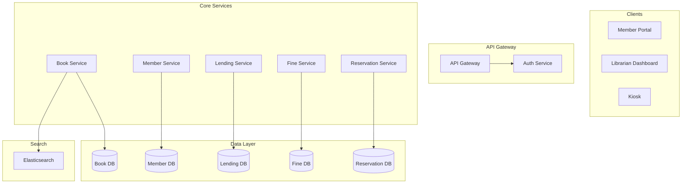
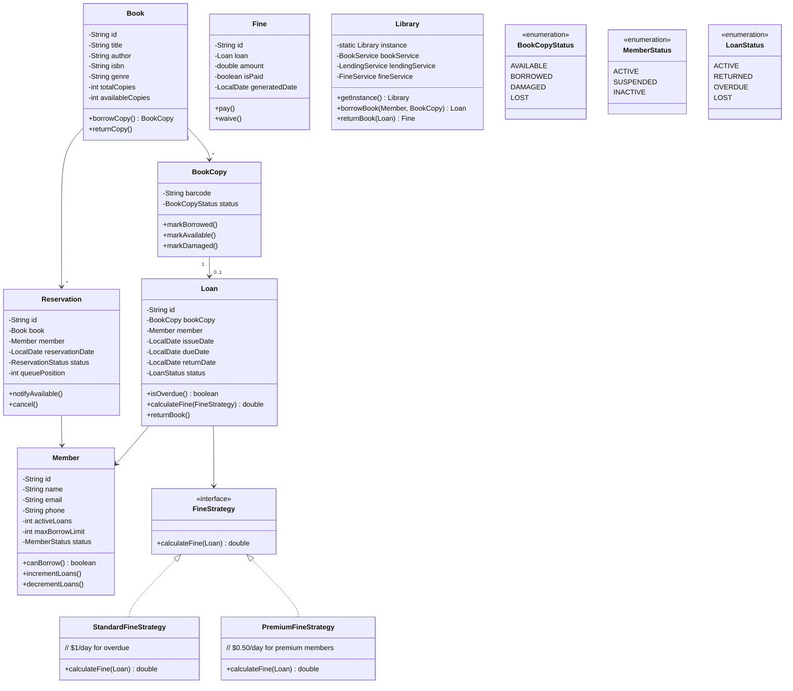
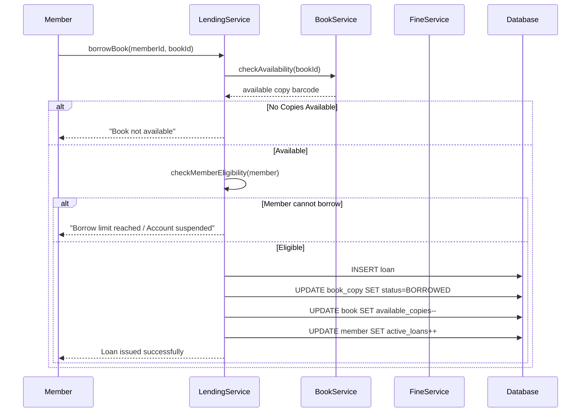
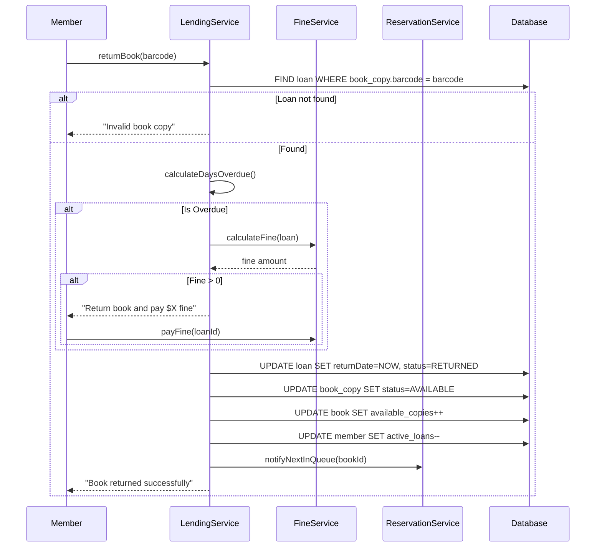

# 📚 Library Management System — Complete LLD Guide

---

## 📋 Table of Contents
1. [Requirements](#requirements)
2. [HLD — High Level Design](#hld)
3. [Class Diagram (LLD)](#class-diagram)
4. [Database Schema](#database-schema)
5. [Flow Diagrams](#flow-diagrams)
6. [Design Patterns Used](#design-patterns)
7. [Complete Java Implementation](#implementation)
8. [Concurrency Handling](#concurrency)
9. [Interview Follow-ups](#follow-ups)

---

## 📝 Requirements

### Functional Requirements
1. **Books** — Add/remove books, track copies, search by title/author/genre
2. **Members** — Register members, manage profiles, track borrowing history
3. **Borrow/Return** — Issue books, return books, enforce borrowing limits
4. **Fine Calculation** — Calculate fines for late returns
5. **Search** — Search books by multiple criteria
6. **Reservations** — Reserve books currently borrowed by others

### Non-Functional Requirements
1. **Concurrent Access** — Multiple members can search/browse simultaneously
2. **Extensibility** — Easy to add new book categories, fine policies
3. **Data Integrity** — No book should be issued to two members simultaneously
4. **Performance** — Search results < 500ms

---

## <a name="hld"></a>🏛️ HLD — High Level Design



---

## <a name="class-diagram"></a>🏗️ LLD — Class Diagram



---

## <a name="database-schema"></a>🗄️ Database Schema

```mermaid
erDiagram
    BOOK ||--o{ BOOK_COPY : has
    BOOK_COPY ||--o{ LOAN : generates
    MEMBER ||--o{ LOAN : borrows
    MEMBER ||--o{ RESERVATION : reserves
    BOOK ||--o{ RESERVATION : reserved_by
    LOAN ||--o| FINE : incurs

    BOOK {
        bigint id PK
        varchar title
        varchar author
        varchar isbn UK
        varchar genre
        int total_copies
        int available_copies
        timestamp created_at
    }

    BOOK_COPY {
        bigint id PK
        bigint book_id FK
        varchar barcode UK
        enum status
        timestamp created_at
    }

    MEMBER {
        bigint id PK
        varchar name
        varchar email UK
        varchar phone
        enum status
        int max_borrow_limit
        int active_loans
        timestamp created_at
    }

    LOAN {
        bigint id PK
        bigint book_copy_id FK UK
        bigint member_id FK
        date issue_date
        date due_date
        date return_date
        enum status
        timestamp created_at
    }

    FINE {
        bigint id PK
        bigint loan_id FK
        decimal amount
        boolean is_paid
        date generated_date
        date paid_date
    }

    RESERVATION {
        bigint id PK
        bigint book_id FK
        bigint member_id FK
        date reservation_date
        enum status
        int queue_position
        date notified_at
    }
```

### Key SQL

```sql
-- Create tables (simplified - same pattern as previous)
CREATE TABLE book (
    id BIGSERIAL PRIMARY KEY,
    title VARCHAR(300) NOT NULL,
    author VARCHAR(200) NOT NULL,
    isbn VARCHAR(20) UNIQUE NOT NULL,
    genre VARCHAR(50),
    total_copies INT NOT NULL DEFAULT 1,
    available_copies INT NOT NULL DEFAULT 1
);

CREATE TABLE book_copy (
    id BIGSERIAL PRIMARY KEY,
    book_id BIGINT REFERENCES book(id),
    barcode VARCHAR(50) UNIQUE NOT NULL,
    status VARCHAR(20) DEFAULT 'AVAILABLE'
);

CREATE TABLE member (
    id BIGSERIAL PRIMARY KEY,
    name VARCHAR(200) NOT NULL,
    email VARCHAR(200) UNIQUE NOT NULL,
    phone VARCHAR(20),
    status VARCHAR(20) DEFAULT 'ACTIVE',
    max_borrow_limit INT DEFAULT 5,
    active_loans INT DEFAULT 0
);

CREATE TABLE loan (
    id BIGSERIAL PRIMARY KEY,
    book_copy_id BIGINT UNIQUE REFERENCES book_copy(id),
    member_id BIGINT REFERENCES member(id),
    issue_date DATE NOT NULL DEFAULT CURRENT_DATE,
    due_date DATE NOT NULL,
    return_date DATE,
    status VARCHAR(20) DEFAULT 'ACTIVE'
);

CREATE TABLE fine (
    id BIGSERIAL PRIMARY KEY,
    loan_id BIGINT REFERENCES loan(id),
    amount DECIMAL(10,2) NOT NULL DEFAULT 0,
    is_paid BOOLEAN DEFAULT FALSE,
    generated_date DATE NOT NULL DEFAULT CURRENT_DATE,
    paid_date DATE
);

CREATE TABLE reservation (
    id BIGSERIAL PRIMARY KEY,
    book_id BIGINT REFERENCES book(id),
    member_id BIGINT REFERENCES member(id),
    reservation_date DATE NOT NULL DEFAULT CURRENT_DATE,
    status VARCHAR(20) DEFAULT 'WAITING',
    queue_position INT NOT NULL
);
```

---

## <a name="flow-diagrams"></a>🔄 Flow Diagrams

### 1. Borrow Book Flow



### 2. Return Book Flow



---

## <a name="design-patterns"></a>🎯 Design Patterns Used

| Pattern | Used Where | Why |
|---------|------------|-----|
| **Singleton** | `Library` class | Single library instance |
| **Strategy** | `FineStrategy` | Different fine policies |
| **Factory** | `BookCopyFactory` | Create book copies |
| **Observer** | `ReservationNotifier` | Notify users when book available |

---

## <a name="implementation"></a>💻 Complete Java Implementation

### Core Model Classes

**`Book.java`**
```java
public class Book {
    private final String id;
    private final String title;
    private final String author;
    private final String isbn;
    private final String genre;
    private int totalCopies;
    private int availableCopies;

    public synchronized boolean borrowCopy() {
        if (availableCopies <= 0) return false;
        availableCopies--;
        return true;
    }

    public synchronized void returnCopy() {
        if (availableCopies < totalCopies) {
            availableCopies++;
        }
    }

    // Getters, equals, hashCode
}
```

**`BookCopy.java`**
```java
public class BookCopy {
    private final String id;
    private final String barcode;
    private final Book book;
    private volatile BookCopyStatus status;

    public synchronized void markBorrowed() {
        if (status != BookCopyStatus.AVAILABLE) {
            throw new IllegalStateException("Copy not available");
        }
        this.status = BookCopyStatus.BORROWED;
    }

    public synchronized void markAvailable() {
        this.status = BookCopyStatus.AVAILABLE;
    }
}
```

**`Loan.java`**
```java
public class Loan {
    private final String id;
    private final BookCopy bookCopy;
    private final Member member;
    private final LocalDate issueDate;
    private final LocalDate dueDate;
    private LocalDate returnDate;
    private volatile LoanStatus status;

    public boolean isOverdue() {
        return status == LoanStatus.ACTIVE && LocalDate.now().isAfter(dueDate);
    }

    public long getOverdueDays() {
        if (returnDate == null) {
            return ChronoUnit.DAYS.between(dueDate, LocalDate.now());
        }
        return ChronoUnit.DAYS.between(dueDate, returnDate);
    }

    public double calculateFine(FineStrategy strategy) {
        return strategy.calculateFine(this);
    }
}
```

**`Library.java`** (Singleton)
```java
public class Library {
    private static volatile Library instance;
    private final Map<String, Book> books = new ConcurrentHashMap<>();
    private final Map<String, Member> members = new ConcurrentHashMap<>();
    private final Map<String, Loan> loans = new ConcurrentHashMap<>();

    private Library() {}

    public static Library getInstance() {
        if (instance == null) {
            synchronized (Library.class) {
                if (instance == null) {
                    instance = new Library();
                }
            }
        }
        return instance;
    }

    /**
     * Borrow a book for a member.
     * Thread-safe with synchronized.
     */
    public synchronized Loan borrowBook(String memberId, String bookId) {
        Member member = members.get(memberId);
        Book book = books.get(bookId);

        // Validate
        if (member == null || book == null) {
            throw new LibraryException("Member or Book not found");
        }
        if (!member.canBorrow()) {
            throw new LibraryException("Borrow limit reached");
        }

        // Find available copy
        BookCopy copy = findAvailableCopy(book);
        if (copy == null) {
            throw new LibraryException("No copies available");
        }

        // Create loan
        copy.markBorrowed();
        book.borrowCopy();
        member.incrementLoans();

        Loan loan = new Loan(copy, member, LocalDate.now(), 
            LocalDate.now().plusDays(14));
        loans.put(loan.getId(), memberId);

        return loan;
    }

    /**
     * Return a book and calculate fine if overdue.
     */
    public synchronized Fine returnBook(String barcode, FineStrategy strategy) {
        Loan loan = findActiveLoan(barcode);
        if (loan == null) {
            throw new LibraryException("No active loan for this book");
        }

        loan.returnBook();  // Sets return date and status
        
        // Return copy
        BookCopy copy = loan.getBookCopy();
        copy.markAvailable();
        copy.getBook().returnCopy();
        loan.getMember().decrementLoans();

        // Calculate fine if overdue
        Fine fine = null;
        if (loan.isOverdue()) {
            double amount = loan.calculateFine(strategy);
            if (amount > 0) {
                fine = new Fine(loan, amount);
            }
        }

        return fine;  // null if no fine
    }
}
```

**`FineStrategy.java`** (Strategy Pattern)
```java
@FunctionalInterface
public interface FineStrategy {
    double calculateFine(Loan loan);
}

class StandardFineStrategy implements FineStrategy {
    public double calculateFine(Loan loan) {
        long overdueDays = loan.getOverdueDays();
        return overdueDays > 0 ? overdueDays * 1.0 : 0;  // $1/day
    }
}

class PremiumMemberFineStrategy implements FineStrategy {
    public double calculateFine(Loan loan) {
        long overdueDays = loan.getOverdueDays();
        return overdueDays > 0 ? overdueDays * 0.5 : 0;  // $0.50/day
    }
}

class MaxCapFineStrategy implements FineStrategy {
    private final FineStrategy base;
    private final double maxCap;
    
    public MaxCapFineStrategy(FineStrategy base, double maxCap) {
        this.base = base;
        this.maxCap = maxCap;
    }
    
    public double calculateFine(Loan loan) {
        return Math.min(base.calculateFine(loan), maxCap);
    }
}
```

**`ReservationService.java`** (Observer Pattern)
```java
public class ReservationService {
    private final Map<String, Queue<Reservation>> waitlist = new ConcurrentHashMap<>();

    /**
     * Reserve a book when all copies are borrowed.
     */
    public Reservation reserveBook(String memberId, String bookId) {
        Queue<Reservation> queue = waitlist.computeIfAbsent(
            bookId, k -> new ConcurrentLinkedQueue<>());
        
        Reservation reservation = new Reservation(memberId, bookId, queue.size() + 1);
        queue.add(reservation);
        return reservation;
    }

    /**
     * Called when a book is returned - notify next in queue.
     */
    public void notifyNextInQueue(String bookId) {
        Queue<Reservation> queue = waitlist.get(bookId);
        if (queue != null) {
            Reservation next = queue.poll();
            if (next != null) {
                // Send notification (email/SMS)
                System.out.println("Notify member " + next.getMemberId() 
                    + " - book " + bookId + " is now available");
            }
        }
    }
}
```

---

## 8 Interview Follow-ups

### Q1: How to handle concurrent borrow requests for the last copy?
**Answer**: Use `synchronized` on `borrowBook()` to make it atomic. In distributed system, use optimistic locking with database version column.

### Q2: How to implement search with faceted filters?
**Answer**: Use Elasticsearch with indexes on title, author, genre, ISBN. For in-memory: maintain multiple index maps (HashMap for exact match, Trie for prefix search).

### Q3: How to handle member suspension?
**Answer**: Add `Member.canBorrow()` check that validates status is ACTIVE and activeLoans < maxBorrowLimit. Suspension can be triggered by excessive fines.

### Q4: How to add book recommendation system?
**Answer**: 
- Track borrowing history per member
- Collaborative filtering based on similar member patterns
- "People who borrowed X also borrowed Y" patterns
- Genre preference scoring

---

## 📊 Complexity Analysis

| Operation | Time | Space |
|-----------|------|-------|
| Search by ISBN | O(1) | O(N) |
| Search by title/author | O(N) | O(N) |
| Borrow book | O(K) where K = copies | O(1) |
| Return book | O(1) | O(1) |
| Calculate fine | O(1) | O(1) |
| Reserve book | O(1) | O(N) queue |