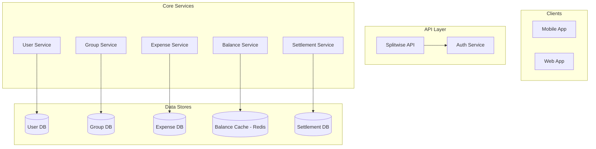
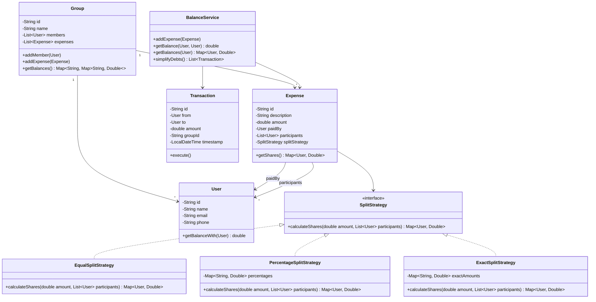

# 💰 Splitwise Clone — Complete LLD Guide

---

## 📋 Table of Contents
1. [Requirements](#requirements)
2. [HLD](#hld)
3. [Class Diagram (LLD)](#class-diagram)
4. [Database Schema](#database-schema)
5. [Flow Diagrams](#flow-diagrams)
6. [Design Patterns Used](#design-patterns)
7. [Complete Java Implementation](#implementation)
8. [Concurrency Handling](#concurrency)
9. [Interview Follow-ups](#follow-ups)

---

## 📝 Requirements

### Functional Requirements
1. **Users** — Add users, manage profiles
2. **Groups** — Create groups, add/remove members
3. **Expenses** — Add expenses in groups, split equally/by percentage/by exact amounts
4. **Settle Balances** — Calculate who owes whom, simplify debts
5. **Transactions** — Record settlements, track payment history

### Non-Functional Requirements
1. **Accuracy** — No floating point rounding errors (use cents)
2. **Extensibility** — Easy to add new split strategies
3. **Concurrency** — Handle multiple expense additions simultaneously

---

## <a name="hld"></a>🏛️ HLD — System Architecture



---

## <a name="class-diagram"></a>🏗️ LLD — Class Diagram



---

## <a name="implementation"></a>💻 Complete Java Implementation

### Core Strategy Pattern

**`SplitStrategy.java`**
```java
@FunctionalInterface
public interface SplitStrategy {
    Map<String, Double> calculateShares(double amount, List<User> participants);
}

/**
 * Equal split - everyone pays same amount.
 * Amount must be divisible by participant count.
 */
public class EqualSplitStrategy implements SplitStrategy {
    @Override
    public Map<String, Double> calculateShares(double amount, List<User> participants) {
        Map<String, Double> shares = new HashMap<>();
        long amountInCents = Math.round(amount * 100);
        long shareInCents = amountInCents / participants.size();
        long remainder = amountInCents % participants.size();
        
        // Distribute remainder penny-by-penny
        for (int i = 0; i < participants.size(); i++) {
            long userShare = shareInCents + (i < remainder ? 1 : 0);
            shares.put(participants.get(i).getId(), userShare / 100.0);
        }
        return shares;
    }
}

/**
 * Percentage split - each user pays specified %.
 * Percentages must sum to 100%.
 */
public class PercentageSplitStrategy implements SplitStrategy {
    private final Map<String, Double> percentages;

    public PercentageSplitStrategy(Map<String, Double> percentages) {
        double total = percentages.values().stream().mapToDouble(Double::doubleValue).sum();
        if (Math.abs(total - 100.0) > 0.01) {
            throw new IllegalArgumentException("Percentages must sum to 100%");
        }
        this.percentages = percentages;
    }

    @Override
    public Map<String, Double> calculateShares(double amount, List<User> participants) {
        Map<String, Double> shares = new HashMap<>();
        for (User user : participants) {
            double pct = percentages.getOrDefault(user.getId(), 0.0);
            shares.put(user.getId(), Math.round(amount * pct * 100.0) / 10000.0);
        }
        return shares;
    }
}

/**
 * Exact split - each user pays specified exact amount.
 * Amounts must sum to total expense.
 */
public class ExactSplitStrategy implements SplitStrategy {
    private final Map<String, Double> exactAmounts;

    public ExactSplitStrategy(Map<String, Double> exactAmounts) {
        double total = exactAmounts.values().stream().mapToDouble(Double::doubleValue).sum();
        // Validate amounts match (with small epsilon for rounding)
        this.exactAmounts = exactAmounts;
    }

    @Override
    public Map<String, Double> calculateShares(double amount, List<User> participants) {
        return new HashMap<>(exactAmounts);
    }
}
```

**`ExpenseService.java`** - Core logic
```java
public class ExpenseService {
    private final BalanceService balanceService;
    
    /**
     * Add an expense and update balances.
     * 
     * For each participant, track:
     * - What they owe (their share)
     * - Who paid (gets credit)
     * 
     * Balance: positive = owed money, negative = owes money
     */
    public Expense addExpense(String description, double totalAmount, 
                            User paidBy, List<User> participants, 
                            SplitStrategy strategy) {
        
        Expense expense = new Expense(description, totalAmount, paidBy, participants, strategy);
        
        // Calculate each person's share
        Map<String, Double> shares = strategy.calculateShares(totalAmount, participants);
        
        // Update balances
        for (Map.Entry<String, Double> entry : shares.entrySet()) {
            String userId = entry.getKey();
            double share = entry.getValue();
            
            if (userId.equals(paidBy.getId())) {
                // Payer is owed money from others
                balanceService.addBalance(paidBy.getId(), userId, totalAmount - share);
            } else {
                // Others owe the payer
                balanceService.addBalance(userId, paidBy.getId(), share);
            }
        }
        
        return expense;
    }
}
```

**`BalanceService.java`** - Balance management
```java
public class BalanceService {
    // balance[userId][otherUserId] = X means userId owes otherUserId X
    private final Map<String, Map<String, Double>> balances = new ConcurrentHashMap<>();

    /**
     * Add to balance: userId owes otherUserId 'amount'.
     */
    public void addBalance(String userId, String otherUserId, double amount) {
        balances.computeIfAbsent(userId, k -> new ConcurrentHashMap<>());
        balances.get(userId).merge(otherUserId, amount, Double::sum);
    }

    /**
     * Get simplified debts using the minimum transactions algorithm.
     * 
     * Algorithm:
     * 1. Calculate net balance for each person
     * 2. Split into creditors and debtors
     * 3. Match largest debtor with largest creditor
     * 4. Minimize number of transactions
     */
    public List<Transaction> simplifyDebts(String groupId) {
        // 1. Calculate net balances
        Map<String, Double> netBalances = new HashMap<>();
        
        for (Map.Entry<String, Map<String, Double>> entry : balances.entrySet()) {
            String userId = entry.getKey();
            for (Map.Entry<String, Double> debt : entry.getValue().entrySet()) {
                // userId owes debt.getKey() debt.getValue()
                netBalances.merge(userId, -debt.getValue(), Double::sum);
                netBalances.merge(debt.getKey(), debt.getValue(), Double::sum);
            }
        }

        // 2. Separate creditors and debtors
        PriorityQueue<Map.Entry<String, Double>> creditors = new PriorityQueue<>(
            (a, b) -> Double.compare(b.getValue(), a.getValue()));
        PriorityQueue<Map.Entry<String, Double>> debtors = new PriorityQueue<>(
            (a, b) -> Double.compare(b.getValue(), a.getValue()));

        for (Map.Entry<String, Double> entry : netBalances.entrySet()) {
            if (entry.getValue() > 0.01) {
                creditors.add(entry);  // Owed money
            } else if (entry.getValue() < -0.01) {
                debtors.add(entry);   // Owes money
            }
        }

        // 3. Match largest debtor with largest creditor
        List<Transaction> settlements = new ArrayList<>();
        
        while (!creditors.isEmpty() && !debtors.isEmpty()) {
            Map.Entry<String, Double> creditor = creditors.poll();
            Map.Entry<String, Double> debtor = debtors.poll();
            
            double debtAmount = Math.min(creditor.getValue(), -debtor.getValue());
            
            Transaction settlement = new Transaction(
                debtor.getKey(), creditor.getKey(), 
                Math.round(debtAmount * 100.0) / 100.0, 
                groupId);
            settlements.add(settlement);

            // Update remaining amounts
            double remainingCredit = creditor.getValue() - debtAmount;
            double remainingDebt = -debtor.getValue() - debtAmount;
            
            if (remainingCredit > 0.01) {
                creditors.add(Map.entry(creditor.getKey(), remainingCredit));
            }
            if (remainingDebt > 0.01) {
                debtors.add(Map.entry(debtor.getKey(), -remainingDebt));
            }
        }
        
        return settlements;
    }
}
```

---

## 9 Interview Follow-ups

### Q1: How to avoid floating-point precision issues?
**Answer**: Store all amounts in cents (multiply by 100). Only convert to dollars for display. Use `BigDecimal` for calculations.

### Q2: How to handle multi-currency expenses?
**Answer**: 
- Store expense in original currency + exchange rate
- Maintain a base currency for all calculations
- Use currency conversion service for display

### Q3: How to simplify debts optimally (minimum number of transactions)?
**Answer**: Use the greedy algorithm shown above:
1. Net balances of all members
2. Sort debtors descending, creditors descending
3. Match largest with largest
This gives O(n log n) with reasonable optimization. For true minimum (NP-hard), use max-flow but unnecessary.

### Q4: How to handle "Round-off" differences?
**Answer**: 
- Track remainder cents
- Assign to the person with largest share (or payer)
- The `EqualSplitStrategy` handles this with `remainder` distribution

### Q5: How to add payment integration (UPI/PayPal)?
**Answer**: 
- Add `PaymentGateway` interface
- Implementations for each gateway
- Webhook callbacks for payment status
- Idempotency keys for retry safety

---

## 📊 Complexity

| Operation | Time | Space |
|-----------|------|-------|
| Add Expense | O(N) | O(1) |
| Get Balances | O(N²) | O(N) |
| Simplify Debts | O(N log N) | O(N) |
| Settle Up | O(1) | O(1) |