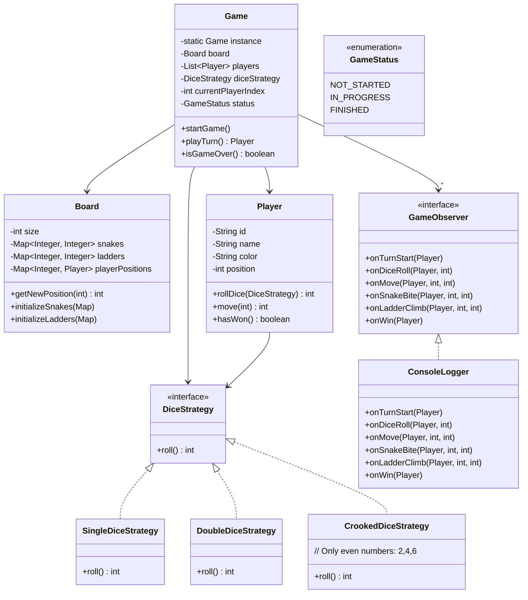

# 🐍 Snake and Ladder Game — Complete LLD Guide

---

## 📋 Table of Contents
1. [Requirements](#requirements)
2. [HLD & LLD Class Diagram](#class-diagram)
3. [Design Patterns](#design-patterns)
4. [Complete Java Implementation](#implementation)
5. [Interview Follow-ups](#follow-ups)

---

## 📝 Requirements

### Functional
1. **Board** — 100 cells, snakes (head→tail), ladders (bottom→top)
2. **Players** — 2-4 players, take turns rolling dice
3. **Dice** — Single die (1-6) or multiple dice
4. **Movement** — Roll dice, move forward, snake bites down, ladder climbs up
5. **Win Condition** — First player to reach cell 100 wins
6. **Exact Win** — Must roll exact number to reach 100 (bounce back if overshoot)

### Design Decisions
- Use **Strategy Pattern** for dice rolling (single/multiple/crooked)
- Use **Observer Pattern** for game event notifications
- Use **Singleton** for game engine

---

## <a name="class-diagram"></a>🏗️ Class Diagram



---

## <a name="implementation"></a>💻 Complete Java Implementation

**`Board.java`**
```java
public class Board {
    private final int size;
    private final Map<Integer, Integer> snakes = new HashMap<>();
    private final Map<Integer, Integer> ladders = new HashMap<>();
    
    public Board(int size) {
        this.size = size;
        initializeDefaultBoard();
    }

    private void initializeDefaultBoard() {
        // Snakes: key=head, value=tail
        snakes.put(99, 54);   // Big snake
        snakes.put(95, 75);
        snakes.put(92, 35);
        snakes.put(87, 36);
        snakes.put(73, 15);
        snakes.put(62, 19);
        snakes.put(47, 26);
        snakes.put(28, 4);
        
        // Ladders: key=bottom, value=top
        ladders.put(3, 22);
        ladders.put(8, 30);
        ladders.put(20, 42);
        ladders.put(40, 59);
        ladders.put(50, 67);
        ladders.put(63, 81);
        ladders.put(70, 91);
        ladders.put(80, 100);
    }

    /**
     * Get new position after applying snake/ladder.
     * If cell has snake head → move to tail
     * If cell has ladder bottom → move to top
     * Otherwise stay.
     */
    public int getNewPosition(int cell) {
        if (cell > size) {
            int overshoot = cell - size;
            return size - overshoot;  // Bounce back
        }
        if (snakes.containsKey(cell)) {
            return snakes.get(cell);  // Snake bite!
        }
        if (ladders.containsKey(cell)) {
            return ladders.get(cell);  // Ladder climb!
        }
        return cell;
    }

    public Map<Integer, Integer> getSnakes() { return snakes; }
    public Map<Integer, Integer> getLadders() { return ladders; }
    public int getSize() { return size; }
}
```

**`DiceStrategy.java`** (Strategy Pattern)
```java
@FunctionalInterface
public interface DiceStrategy {
    int roll();
}

class SingleDiceStrategy implements DiceStrategy {
    private final Random random = new Random();
    
    @Override
    public int roll() {
        return random.nextInt(6) + 1;  // 1-6
    }
}

class DoubleDiceStrategy implements DiceStrategy {
    private final Random random = new Random();
    
    @Override
    public int roll() {
        return random.nextInt(6) + 1 + random.nextInt(6) + 1;  // 2-12
    }
}

class CrookedDiceStrategy implements DiceStrategy {
    private final Random random = new Random();
    private static final int[] EVEN_NUMBERS = {2, 4, 6};
    
    @Override
    public int roll() {
        return EVEN_NUMBERS[random.nextInt(EVEN_NUMBERS.length)];
    }
}
```

**`Player.java`**
```java
public class Player {
    private final String id = UUID.randomUUID().toString();
    private final String name;
    private final String color;
    private volatile int position = 0;
    
    public Player(String name, String color) {
        this.name = name;
        this.color = color;
    }

    /**
     * Roll dice and get new position.
     * Thread-safe for concurrent game modes.
     */
    public synchronized int move(int steps) {
        position += steps;
        return position;
    }

    public boolean hasWon() {
        return position == 100;
    }

    public void setPosition(int pos) { this.position = pos; }
    public String getId() { return id; }
    public String getName() { return name; }
    public int getPosition() { return position; }
}
```

**`Game.java`** (Core Engine - Singleton)
```java
public class Game {
    private static volatile Game instance;
    
    private Board board;
    private List<Player> players;
    private DiceStrategy diceStrategy;
    private int currentPlayerIndex = 0;
    private GameStatus status = GameStatus.NOT_STARTED;
    private final List<GameObserver> observers = new CopyOnWriteArrayList<>();

    private Game() {}

    public static Game getInstance() {
        if (instance == null) {
            synchronized (Game.class) {
                if (instance == null) {
                    instance = new Game();
                }
            }
        }
        return instance;
    }

    /**
     * Initialize and start the game.
     */
    public void initialize(int boardSize, List<Player> players, DiceStrategy diceStrategy) {
        this.board = new Board(boardSize);
        this.players = new ArrayList<>(players);
        this.diceStrategy = diceStrategy;
        this.currentPlayerIndex = 0;
        this.status = GameStatus.NOT_STARTED;
    }

    /**
     * Play a single turn of the current player.
     * Returns the winner if game ends, null otherwise.
     */
    public Player playTurn() {
        if (status == GameStatus.FINISHED) {
            throw new IllegalStateException("Game is already finished");
        }
        
        status = GameStatus.IN_PROGRESS;
        Player currentPlayer = players.get(currentPlayerIndex);
        
        // 1. Notify turn start
        notifyTurnStart(currentPlayer);
        
        // 2. Roll dice
        int diceValue = diceStrategy.roll();
        notifyDiceRoll(currentPlayer, diceValue);
        
        // 3. Calculate new position
        int newPosition = currentPlayer.getPosition() + diceValue;
        
        // 4. Check exact win condition
        if (newPosition > board.getSize()) {
            // Bounce back - player doesn't move
            notifyMove(currentPlayer, currentPlayer.getPosition(), currentPlayer.getPosition());
            currentPlayerIndex = (currentPlayerIndex + 1) % players.size();
            return null;
        }
        
        // 5. Apply snakes/ladders
        int finalPosition = board.getNewPosition(newPosition);
        
        if (finalPosition < newPosition) {
            // Snake bite
            notifySnakeBite(currentPlayer, newPosition, finalPosition);
        } else if (finalPosition > newPosition) {
            // Ladder climb
            notifyLadderClimb(currentPlayer, newPosition, finalPosition);
        }
        
        // 6. Move player
        currentPlayer.move(finalPosition - currentPlayer.getPosition());
        notifyMove(currentPlayer, newPosition, finalPosition);
        
        // 7. Check win
        if (currentPlayer.hasWon()) {
            status = GameStatus.FINISHED;
            notifyWin(currentPlayer);
            return currentPlayer;
        }
        
        // 8. Next player's turn
        currentPlayerIndex = (currentPlayerIndex + 1) % players.size();
        return null;
    }

    /**
     * Play full game automatically.
     */
    public Player playFullGame() {
        while (status != GameStatus.FINISHED) {
            Player winner = playTurn();
            if (winner != null) return winner;
        }
        return null;
    }

    // --- Observer Methods ---
    public void addObserver(GameObserver observer) { observers.add(observer); }
    public void removeObserver(GameObserver observer) { observers.remove(observer); }

    private void notifyTurnStart(Player p) {
        observers.forEach(o -> o.onTurnStart(p));
    }
    private void notifyDiceRoll(Player p, int value) {
        observers.forEach(o -> o.onDiceRoll(p, value));
    }
    private void notifyMove(Player p, int from, int to) {
        observers.forEach(o -> o.onMove(p, from, to));
    }
    private void notifySnakeBite(Player p, int from, int to) {
        observers.forEach(o -> o.onSnakeBite(p, from, to));
    }
    private void notifyLadderClimb(Player p, int from, int to) {
        observers.forEach(o -> o.onLadderClimb(p, from, to));
    }
    private void notifyWin(Player p) {
        observers.forEach(o -> o.onWin(p));
    }

    public GameStatus getStatus() { return status; }
}
```

**`GameObserver.java`** (Observer Pattern)
```java
public interface GameObserver {
    default void onTurnStart(Player p) {}
    default void onDiceRoll(Player p, int value) {}
    default void onMove(Player p, int from, int to) {}
    default void onSnakeBite(Player p, int from, int to) {}
    default void onLadderClimb(Player p, int from, int to) {}
    default void onWin(Player p) {}
}

class ConsoleLogger implements GameObserver {
    @Override
    public void onTurnStart(Player p) {
        System.out.printf("\n--- %s's turn (position: %d) ---\n", p.getName(), p.getPosition());
    }

    @Override
    public void onDiceRoll(Player p, int value) {
        System.out.printf("%s rolled: %d\n", p.getName(), value);
    }

    @Override
    public void onMove(Player p, int from, int to) {
        System.out.printf("%s moved from %d to %d\n", p.getName(), from, to);
    }

    @Override
    public void onSnakeBite(Player p, int from, int to) {
        System.out.printf("🐍 Snake bite! %s falls from %d to %d!\n", p.getName(), from, to);
    }

    @Override
    public void onLadderClimb(Player p, int from, int to) {
        System.out.printf("🪜 Ladder climb! %s climbs from %d to %d!\n", p.getName(), from, to);
    }

    @Override
    public void onWin(Player p) {
        System.out.printf("\n🏆 %s WINS THE GAME! 🏆\n", p.getName());
    }
}
```

**`Main.java`** — Demo
```java
public class Main {
    public static void main(String[] args) {
        Game game = Game.getInstance();
        game.addObserver(new ConsoleLogger());

        // Setup players
        List<Player> players = List.of(
            new Player("Alice", "🔴"),
            new Player("Bob", "🟦"),
            new Player("Charlie", "🟩")
        );

        // Initialize with single dice
        game.initialize(100, players, new SingleDiceStrategy());
        
        // Play full game
        Player winner = game.playFullGame();
        System.out.println("\nFinal score: " + winner.getName() + " wins!");
    }
}
```

---

## 9 Interview Follow-ups

| Question | Answer |
|----------|--------|
| Q1: How to handle multiple dice? | Strategy pattern - swap DiceStrategy at runtime |
| Q2: How to add "crooked dice" (always even)? | Add CrookedDiceStrategy implementation |
| Q3: How to support 6-player game? | Players list is dynamic - just add more |
| Q4: How to persist game state? | Snapshot pattern - save board+player positions |
| Q5: Concurrency? | Game is single-threaded by design (turn-based) |