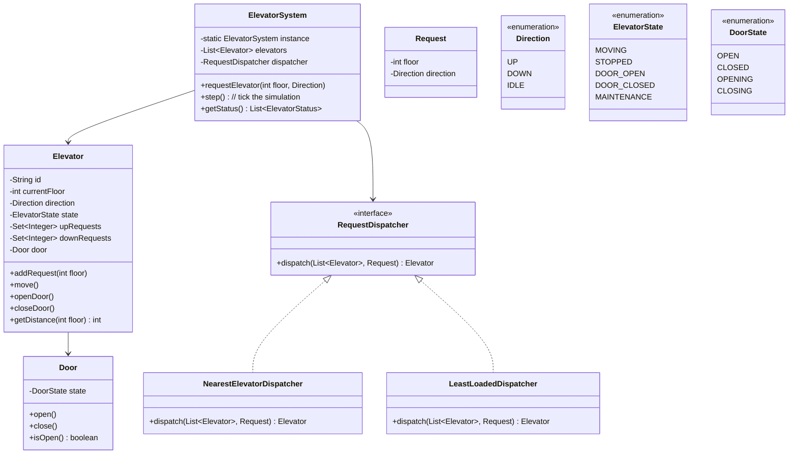
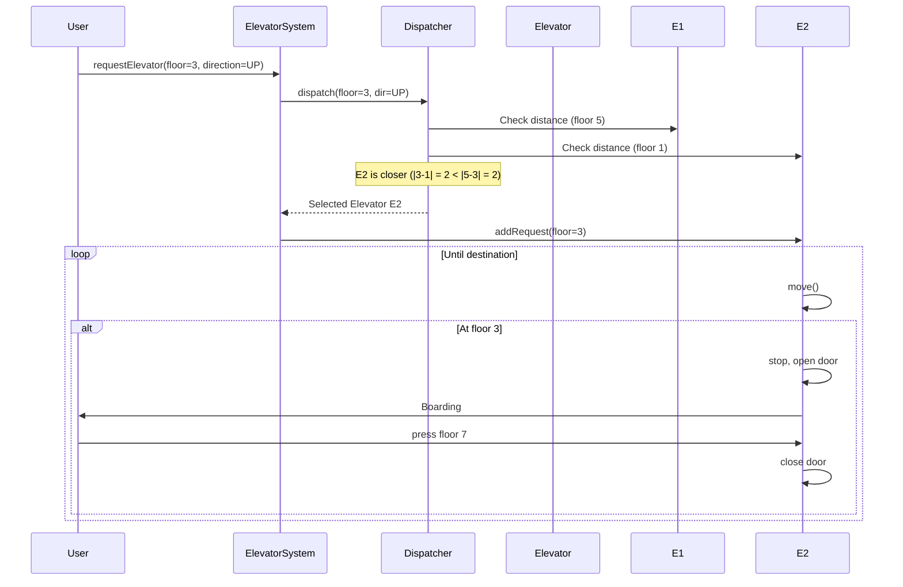
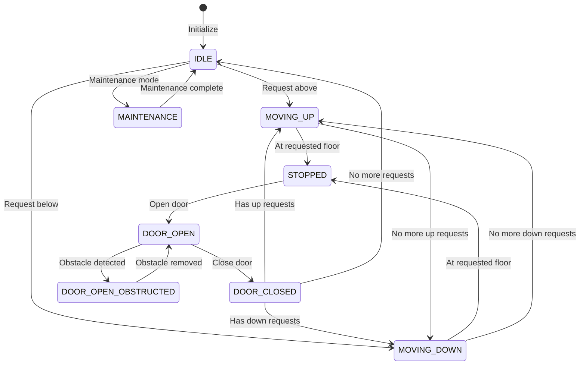

# 🛗 Elevator System — Complete LLD Guide

---

## 📋 Table of Contents
1. [Requirements](#requirements)
2. [HLD & LLD Class Diagram](#class-diagram)
3. [Flow Diagrams](#flow-diagrams)
4. [Design Patterns](#design-patterns)
5. [Complete Java Implementation](#implementation)
6. [Concurrency](#concurrency)
7. [Interview Follow-ups](#follow-ups)

---

## 📝 Requirements

### Functional
1. **Multiple Elevators** — N elevators serving M floors
2. **External Requests** — Floor buttons (up/down) in lobby
3. **Internal Requests** — Destination floor buttons inside elevator
4. **Direction** — Moving UP, DOWN, or IDLE
5. **Door** — Open/close with safety mechanism
6. **Scheduling** — Assign nearest elevator to external request
7. **Optimization** — Minimize wait time, power consumption

### Algorithm: SCAN (Elevator) Algorithm
- Continue in same direction until no more requests
- Then reverse direction
- Reduces unnecessary direction changes

---

## <a name="class-diagram"></a>🏗️ LLD — Class Diagram



---

## <a name="flow-diagrams"></a>🔄 Flow Diagrams

### Elevator Movement Flow



### Elevator State Machine



---

## <a name="implementation"></a>💻 Complete Java Implementation

**`Elevator.java`**
```java
public class Elevator {
    private final String id;
    private volatile int currentFloor;
    private volatile Direction direction = Direction.IDLE;
    private volatile ElevatorState state = ElevatorState.IDLE;
    private final Door door = new Door();
    
    // TreeSet for sorted requests in each direction
    private final TreeSet<Integer> upRequests = new TreeSet<>();
    private final TreeSet<Integer> downRequests = new TreeSet<>(Comparator.reverseOrder());

    public Elevator(String id, int startFloor) {
        this.id = id;
        this.currentFloor = startFloor;
    }

    /**
     * Add a request to this elevator.
     * Thread-safe via synchronized.
     */
    public synchronized void addRequest(int floor) {
        if (floor > currentFloor) {
            upRequests.add(floor);
        } else if (floor < currentFloor) {
            downRequests.add(floor);
        }
        updateDirection();
    }

    /**
     * Move one step (simulation tick).
     * SCAN algorithm implementation.
     */
    public synchronized void move() {
        if (direction == Direction.IDLE) return;
        
        // Stop at requested floors
        if (shouldStopAtCurrentFloor()) {
            state = ElevatorState.STOPPED;
            door.open();
            removeCurrentFloorFromRequests();
            door.close();
            updateDirection();
        }

        // Move in current direction
        if (direction == Direction.UP) {
            currentFloor++;
        } else if (direction == Direction.DOWN) {
            currentFloor--;
        }
        
        state = ElevatorState.MOVING;
    }

    private boolean shouldStopAtCurrentFloor() {
        return (direction == Direction.UP && upRequests.contains(currentFloor)) ||
               (direction == Direction.DOWN && downRequests.contains(currentFloor));
    }

    private void removeCurrentFloorFromRequests() {
        upRequests.remove(currentFloor);
        downRequests.remove(currentFloor);
    }

    private void updateDirection() {
        if (upRequests.isEmpty() && downRequests.isEmpty()) {
            direction = Direction.IDLE;
            state = ElevatorState.IDLE;
        } else if (direction == Direction.IDLE) {
            direction = upRequests.isEmpty() ? Direction.DOWN : Direction.UP;
        } else if (direction == Direction.UP && upRequests.isEmpty()) {
            direction = downRequests.isEmpty() ? Direction.IDLE : Direction.DOWN;
        } else if (direction == Direction.DOWN && downRequests.isEmpty()) {
            direction = upRequests.isEmpty() ? Direction.IDLE : Direction.UP;
        }
    }

    /**
     * Get distance from a floor (for dispatching).
     */
    public int getDistance(int floor) {
        return Math.abs(currentFloor - floor);
    }

    public int getPendingRequestCount() {
        return upRequests.size() + downRequests.size();
    }

    // Getters
    public String getId() { return id; }
    public int getCurrentFloor() { return currentFloor; }
    public Direction getDirection() { return direction; }
    public ElevatorState getState() { return state; }
}
```

**`RequestDispatcher.java`** (Strategy Pattern)
```java
@FunctionalInterface
public interface RequestDispatcher {
    Elevator dispatch(List<Elevator> elevators, int floor, Direction direction);
}

/**
 * Dispatch to the nearest IDLE or same-direction elevator.
 */
class NearestElevatorDispatcher implements RequestDispatcher {
    @Override
    public Elevator dispatch(List<Elevator> elevators, int floor, Direction dir) {
        Elevator best = null;
        int minDistance = Integer.MAX_VALUE;
        
        for (Elevator e : elevators) {
            if (e.getState() == ElevatorState.MAINTENANCE) continue;
            
            int distance = calculateEffectiveDistance(e, floor, dir);
            if (distance < minDistance) {
                minDistance = distance;
                best = e;
            }
        }
        return best;
    }

    private int calculateEffectiveDistance(Elevator e, int floor, Direction dir) {
        // Same direction and ahead → closest
        if (e.getDirection() == dir) {
            return Math.abs(e.getCurrentFloor() - floor);
        }
        // Opposite direction → add penalty
        if (e.getDirection() != Direction.IDLE) {
            return Math.abs(e.getCurrentFloor() - floor) + 20;
        }
        // IDLE → normal distance
        return Math.abs(e.getCurrentFloor() - floor);
    }
}
```

**`ElevatorSystem.java`** (Singleton)
```java
public class ElevatorSystem {
    private static volatile ElevatorSystem instance;
    private final List<Elevator> elevators = new CopyOnWriteArrayList<>();
    private final RequestDispatcher dispatcher;
    private final ScheduledExecutorService scheduler = Executors.newSingleThreadScheduledExecutor();

    private ElevatorSystem(RequestDispatcher dispatcher) {
        this.dispatcher = dispatcher;
        // Start simulation tick
        scheduler.scheduleAtFixedRate(this::tick, 0, 500, TimeUnit.MILLISECONDS);
    }

    public static ElevatorSystem getInstance(RequestDispatcher dispatcher) {
        if (instance == null) {
            synchronized (ElevatorSystem.class) {
                if (instance == null) {
                    instance = new ElevatorSystem(dispatcher);
                }
            }
        }
        return instance;
    }

    /**
     * External request from floor.
     */
    public void requestElevator(int floor, Direction direction) {
        Elevator selected = dispatcher.dispatch(elevators, floor, direction);
        if (selected != null) {
            selected.addRequest(floor);
            System.out.printf("📞 Floor %d %s → Elevator %s assigned%n", 
                floor, direction, selected.getId());
        }
    }

    /**
     * Internal request from inside elevator.
     */
    public void requestFloor(String elevatorId, int floor) {
        elevators.stream()
            .filter(e -> e.getId().equals(elevatorId))
            .findFirst()
            .ifPresent(e -> e.addRequest(floor));
    }

    /**
     * Simulation tick - move all elevators one step.
     */
    private void tick() {
        elevators.forEach(Elevator::move);
    }

    public void addElevator(Elevator e) { elevators.add(e); }

    public void printStatus() {
        for (Elevator e : elevators) {
            System.out.printf("Elevator %s | Floor: %2d | Direction: %-5s | State: %-12s%n",
                e.getId(), e.getCurrentFloor(), e.getDirection(), e.getState());
        }
    }
}
```

---

## 9 Interview Follow-ups

### Q1: How to optimize for power consumption?
- **Answer**: Use SCAN algorithm (minimizes direction changes). Add idle strategy: park at most requested floors during peak hours, center floors at night.

### Q2: How to handle peak hours (office opening/closing)?
- **Answer**: Peak hour mode: send all idle elevators to ground floor. Express floors: skip even floors during high traffic.

### Q3: How to handle fire/emergency?
- **Answer**: All elevators go to ground floor. Doors open. Disable new requests. Override with emergency protocol.

### Q4: How to implement load balancing?
- **Answer**: Use `LeastLoadedDispatcher` - assign to elevator with fewest pending requests. Combine with nearest for hybrid.

### Q5: How to handle multiple elevator banks (low-rise/high-rise)?
- **Answer**: Zone-based dispatching. Each bank serves specific floor range. ElevatorSystem routes to correct bank.

---

## 📊 Complexity

| Operation | Time | Space |
|-----------|------|-------|
| Add Request | O(log N) TreeSet | O(R) requests |
| Dispatch | O(E × R) | O(1) |
| Move (tick) | O(1) | O(1) |
| Update Direction | O(1) | O(1) |