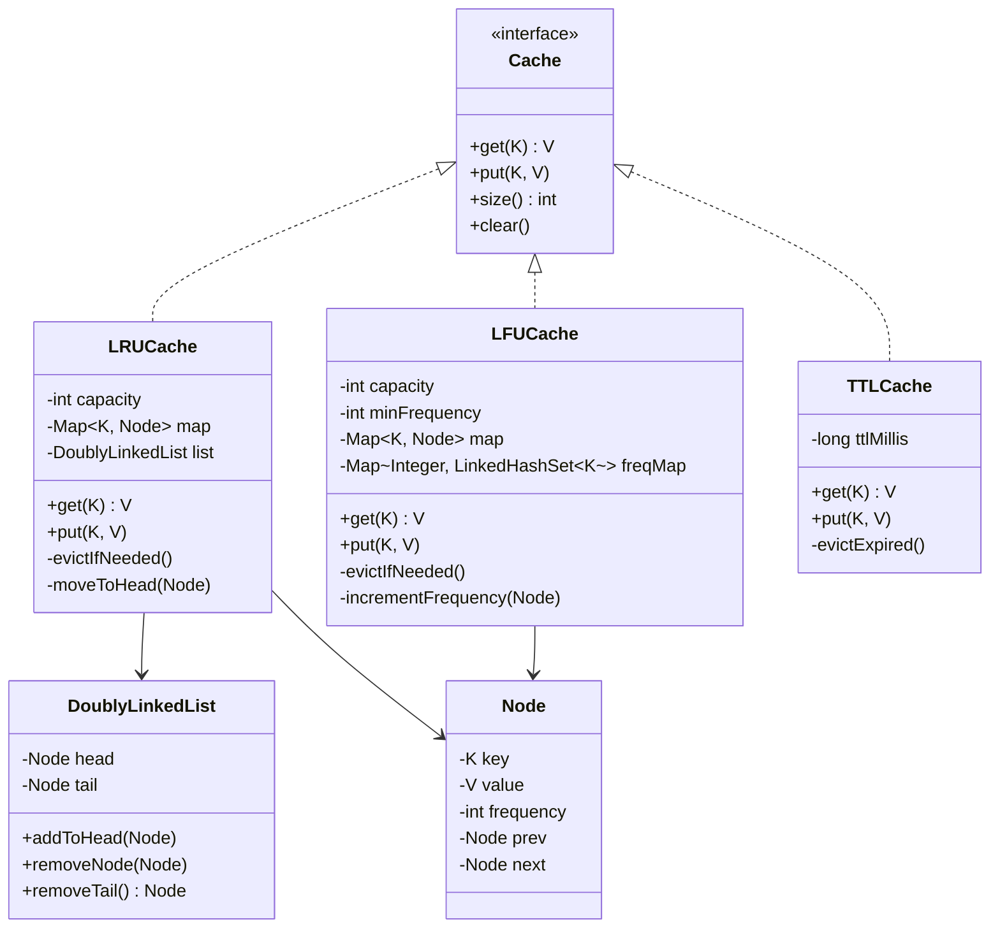

# 💾 Cache System (LRU/LFU) — Complete LLD Guide

---

## 📋 Table of Contents
1. [Requirements & Design](#requirements)
2. [Class Diagram](#class-diagram)
3. [Complete Java Implementation](#implementation)
4. [Concurrency](#concurrency)
5. [Interview Follow-ups](#follow-ups)

---

## 📝 Requirements

### LRU Cache (Least Recently Used)
- **get(key)** — Return value, mark as recently used (O(1))
- **put(key, value)** — Insert/update, evict LRU if at capacity (O(1))
- **Data Structure**: HashMap + Doubly Linked List

### LFU Cache (Least Frequently Used)
- **get(key)** — Return value, increment frequency (O(1))
- **put(key, value)** — Insert/update, evict LFU (tie-break with LRU) (O(1))
- **Data Structure**: HashMap + Frequency Map + LinkedHashSet

---

## <a name="class-diagram"></a>🏗️ Class Diagram



---

## <a name="implementation"></a>💻 Complete Java Implementation

### LRU Cache — O(1) operations

```java
/**
 * LRU Cache using HashMap + Doubly Linked List.
 * 
 * Design Rationale:
 * - HashMap gives O(1) access by key
 * - Doubly Linked List maintains access order (LRU at tail, MRU at head)
 * - Combining both gives O(1) for both get and put
 * 
 * Thread Safety:
 * - All public methods are synchronized
 * - In production: use ReadWriteLock for better concurrency
 */
public class LRUCache<K, V> implements Cache<K, V> {
    private final int capacity;
    private final Map<K, Node<K, V>> map;
    private final Node<K, V> head;  // dummy head (MRU end)
    private final Node<K, V> tail;  // dummy tail (LRU end)

    /**
     * Node for doubly linked list.
     * Package-private so LFU cache can reuse.
     */
    static class Node<K, V> {
        K key;
        V value;
        int frequency = 1;  // Used by LFU
        Node<K, V> prev;
        Node<K, V> next;

        Node() {}
        Node(K key, V value) {
            this.key = key;
            this.value = value;
        }
    }

    public LRUCache(int capacity) {
        if (capacity <= 0) {
            throw new IllegalArgumentException("Capacity must be positive");
        }
        this.capacity = capacity;
        this.map = new HashMap<>(capacity);
        this.head = new Node<>();
        this.tail = new Node<>();
        head.next = tail;
        tail.prev = head;
    }

    /**
     * Get value by key. Move to head (MRU) on access.
     * O(1) time.
     */
    @Override
    public synchronized V get(K key) {
        Node<K, V> node = map.get(key);
        if (node == null) return null;
        moveToHead(node);  // Mark as recently used
        return node.value;
    }

    /**
     * Insert or update value. Evict LRU if full.
     * O(1) time.
     */
    @Override
    public synchronized void put(K key, V value) {
        Node<K, V> existing = map.get(key);
        
        if (existing != null) {
            // Update existing
            existing.value = value;
            moveToHead(existing);
            return;
        }

        // Evict if full
        if (map.size() >= capacity) {
            Node<K, V> lru = removeTail();
            if (lru != null) {
                map.remove(lru.key);
            }
        }

        // Add new node
        Node<K, V> newNode = new Node<>(key, value);
        map.put(key, newNode);
        addToHead(newNode);
    }

    /**
     * Move node to head (MRU position).
     * Remove from current position, add to front.
     */
    private void moveToHead(Node<K, V> node) {
        removeNode(node);
        addToHead(node);
    }

    /**
     * Add node right after head.
     */
    private void addToHead(Node<K, V> node) {
        node.prev = head;
        node.next = head.next;
        head.next.prev = node;
        head.next = node;
    }

    /**
     * Remove node from linked list.
     */
    private void removeNode(Node<K, V> node) {
        node.prev.next = node.next;
        node.next.prev = node.prev;
    }

    /**
     * Remove and return the LRU node (last before tail).
     */
    private Node<K, V> removeTail() {
        if (tail.prev == head) return null;  // Empty list
        Node<K, V> lru = tail.prev;
        removeNode(lru);
        return lru;
    }

    @Override
    public synchronized int size() { return map.size(); }

    @Override
    public synchronized void clear() {
        map.clear();
        head.next = tail;
        tail.prev = head;
    }
}
```

### LFU Cache — O(1) operations

```java
/**
 * LFU Cache using HashMap + Frequency Map.
 * 
 * Design:
 * - keyToNode: HashMap for O(1) access
 * - freqMap: HashMap<Integer, LinkedHashSet<K>> maps frequency → keys with that freq
 * - minFreq: tracks current minimum frequency for O(1) eviction
 * 
 * Eviction: Remove LFU item. Tie-break: remove LRU among LFU items.
 * LinkedHashSet maintains insertion order → first element is LRU.
 */
public class LFUCache<K, V> implements Cache<K, V> {
    private final int capacity;
    private final Map<K, Node<K, V>> keyToNode;
    private final Map<Integer, LinkedHashSet<K>> freqMap;
    private int minFreq;

    public LFUCache(int capacity) {
        this.capacity = capacity;
        this.keyToNode = new HashMap<>();
        this.freqMap = new HashMap<>();
        this.minFreq = 0;
    }

    /**
     * Get value and increment frequency.
     * O(1) amortized.
     */
    @Override
    public synchronized V get(K key) {
        Node<K, V> node = keyToNode.get(key);
        if (node == null) return null;
        incrementFrequency(node);
        return node.value;
    }

    /**
     * Insert or update. Evict if full.
     * O(1) amortized.
     */
    @Override
    public synchronized void put(K key, V value) {
        if (capacity <= 0) return;

        Node<K, V> existing = keyToNode.get(key);
        if (existing != null) {
            existing.value = value;
            incrementFrequency(existing);
            return;
        }

        // Evict if full
        if (keyToNode.size() >= capacity) {
            evictLFU();
        }

        // Add new node with frequency 1
        Node<K, V> newNode = new Node<>(key, value);
        keyToNode.put(key, newNode);
        freqMap.computeIfAbsent(1, k -> new LinkedHashSet<>()).add(key);
        minFreq = 1;
    }

    /**
     * Increment frequency of a node.
     * Move it from current freq bucket to next.
     */
    private void incrementFrequency(Node<K, V> node) {
        int oldFreq = node.frequency;
        int newFreq = oldFreq + 1;
        node.frequency = newFreq;

        // Remove from old freq bucket
        LinkedHashSet<K> oldBucket = freqMap.get(oldFreq);
        if (oldBucket != null) {
            oldBucket.remove(node.key);
            if (oldBucket.isEmpty() && oldFreq == minFreq) {
                minFreq++;  // No more items at min freq
            }
        }

        // Add to new freq bucket
        freqMap.computeIfAbsent(newFreq, k -> new LinkedHashSet<>()).add(node.key);
    }

    /**
     * Evict LFU item (with LRU tie-break).
     */
    private void evictLFU() {
        LinkedHashSet<K> minFreqBucket = freqMap.get(minFreq);
        if (minFreqBucket == null || minFreqBucket.isEmpty()) return;

        // First element in LinkedHashSet = LRU among LFU items
        K keyToEvict = minFreqBucket.iterator().next();
        minFreqBucket.remove(keyToEvict);
        keyToNode.remove(keyToEvict);

        // Update minFreq if bucket is now empty
        if (minFreqBucket.isEmpty()) {
            freqMap.remove(minFreq);
            // Find new minFreq (recalculate)
            minFreq = freqMap.keySet().stream().min(Integer::compare).orElse(0);
        }
    }

    @Override
    public synchronized int size() { return keyToNode.size(); }

    @Override
    public synchronized void clear() {
        keyToNode.clear();
        freqMap.clear();
        minFreq = 0;
    }
}
```

### TTL Cache Extension

```java
/**
 * TTL Cache - items expire after a duration.
 * Combines LRU eviction with time-based expiry.
 */
public class TTLCache<K, V> implements Cache<K, V> {
    private final LRUCache<K, TimedValue<V>> innerCache;
    private final long ttlMillis;

    private static class TimedValue<V> {
        final V value;
        final long createdAt = System.currentTimeMillis();
        
        TimedValue(V value) { this.value = value; }
        boolean isExpired(long ttlMillis) {
            return System.currentTimeMillis() - createdAt > ttlMillis;
        }
    }

    public TTLCache(int capacity, long ttlMillis) {
        this.innerCache = new LRUCache<>(capacity);
        this.ttlMillis = ttlMillis;
    }

    @Override
    public V get(K key) {
        TimedValue<V> tv = innerCache.get(key);
        if (tv == null) return null;
        if (tv.isExpired(ttlMillis)) {
            innerCache.put(key, null);  // Remove expired
            return null;
        }
        return tv.value;
    }

    @Override
    public void put(K key, V value) {
        innerCache.put(key, new TimedValue<>(value));
    }

    @Override
    public int size() { return innerCache.size(); }

    @Override
    public void clear() { innerCache.clear(); }
}
```

---

## <a name="concurrency"></a>🔒 Concurrency Strategy

For high-concurrency production cache:

```java
public class ConcurrentLRUCache<K, V> {
    private final int capacity;
    private final Map<K, Node<K, V>> map = new ConcurrentHashMap<>();
    private final ReentrantReadWriteLock lock = new ReentrantReadWriteLock();
    
    public V get(K key) {
        lock.readLock().lock();
        try {
            Node<K, V> node = map.get(key);
            if (node == null) return null;
            // Need write lock to move to head
            lock.readLock().unlock();
            lock.writeLock().lock();
            try {
                moveToHead(node);
                return node.value;
            } finally {
                lock.writeLock().unlock();
                lock.readLock().lock();
            }
        } finally {
            lock.readLock().unlock();
        }
    }
}
```

---

## 9 Interview Follow-ups

| Question | Answer |
|----------|--------|
| **Q1: Why Doubly Linked List for LRU?** | O(1) removal from middle. Singly linked list needs O(n) for `removeNode()`. |
| **Q2: Can we use `LinkedHashMap` directly?** | Yes! `LinkedHashMap( capacity, 0.75f, true)` with `removeEldestEntry()`. But interviewers want to see you implement it. |
| **Q3: LFU tie-break strategy?** | LRU among LFU items. LinkedHashSet maintains insertion order. |
| **Q4: How to handle write-heavy workloads?** | Use write-back cache: batch writes, async persistence. Or use Caffeine cache (production). |
| **Q5: How to make it distributed?** | Consistent hashing for sharding. Redis Cluster for production distributed cache. |
| **Q6: Memory overhead of LFU?** | Higher than LRU (extra freqMap). Store frequencies in a single array for optimization. |
| **Q7: When to use LRU vs LFU?** | LRU: temporal locality (recently accessed likely accessed again). LFU: frequency-based patterns (API rate limiting, popular items). |
| **Q8: How to implement with O(1) eviction?** | LRU: DoublyLinkedList + HashMap. LFU: freqMap of LinkedHashSets. |
| **Q9: What about Caffeine cache?** | Caffeine uses Window-TinyLFU: combines recency (window) + frequency (sketch) for near-optimal hit rate. |

---

## 📊 Complexity

| Operation | LRU | LFU | TTL |
|-----------|-----|-----|-----|
| get() | O(1) | O(1) | O(1) |
| put() | O(1) | O(1) | O(1) |
| evict() | O(1) | O(1) | O(1) |
| Space | O(N) | O(N + F) | O(N) |