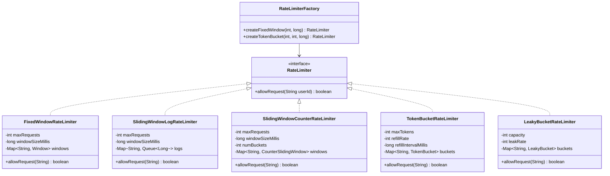

# 🚦 Rate Limiter — Complete LLD Guide

---

## 📋 Table of Contents
1. [Requirements & Algorithms](#requirements)
2. [Class Diagram](#class-diagram)
3. [Complete Java Implementation](#implementation)
4. [Interview Follow-ups](#follow-ups)

---

## 📝 Requirements

### Algorithms Supported
1. **Fixed Window** — Count requests in fixed time window (e.g., 100/min)
2. **Sliding Window Log** — Maintain timestamp log per user
3. **Sliding Window Counter** — Sliding window using counter buckets
4. **Token Bucket** — Tokens refill at constant rate
5. **Leaky Bucket** — Requests leak at constant rate

### Non-Functional Requirements
- **Thread Safety** — Handle concurrent requests
- **Low Latency** — Decision in < 1ms
- **Configurable** — Per-user, per-API, per-IP limits
- **Distributed** — Using Redis eventually

---

## <a name="class-diagram"></a>🏗️ Class Diagram



---

## <a name="implementation"></a>💻 Complete Java Implementation

### 1. Fixed Window Rate Limiter

```java
/**
 * Fixed Window: Allows X requests per Y time window.
 * Simple but has "burst at boundary" issue.
 * 
 * Example: 100 requests/minute, reset at minute boundary.
 * 99 requests at 0:59 + 99 requests at 1:00 = 198 in 2 seconds!
 */
public class FixedWindowRateLimiter implements RateLimiter {
    private final int maxRequests;
    private final long windowSizeMillis;
    private final Map<String, Window> windows = new ConcurrentHashMap<>();
    private final ReentrantLock lock = new ReentrantLock();

    record Window(long startTime, AtomicInteger counter) {}

    public FixedWindowRateLimiter(int maxRequests, long windowSizeMillis) {
        this.maxRequests = maxRequests;
        this.windowSizeMillis = windowSizeMillis;
    }

    @Override
    public boolean allowRequest(String userId) {
        long now = System.currentTimeMillis();
        Window window = windows.compute(userId, (key, existing) -> {
            if (existing == null || (now - existing.startTime()) >= windowSizeMillis) {
                return new Window(now, new AtomicInteger(0));
            }
            return existing;
        });

        return window.counter().incrementAndGet() <= maxRequests;
    }
}
```

### 2. Sliding Window Log Rate Limiter

```java
/**
 * Sliding Window Log: Maintains timestamp log of requests.
 * When new request arrives, remove timestamps outside window,
 * then check if count exceeds limit.
 * 
 * Pros: Precise sliding window
 * Cons: Memory O(N) where N = request count in window
 */
public class SlidingWindowLogRateLimiter implements RateLimiter {
    private final int maxRequests;
    private final long windowMillis;
    private final Map<String, Queue<Long>> logs = new ConcurrentHashMap<>();
    private final ScheduledExecutorService cleanup = 
        Executors.newSingleThreadScheduledExecutor();

    public SlidingWindowLogRateLimiter(int maxRequests, long windowMillis) {
        this.maxRequests = maxRequests;
        this.windowMillis = windowMillis;
        // Periodic cleanup to prevent memory leaks
        cleanup.scheduleAtFixedRate(this::cleanup, 1, 1, TimeUnit.MINUTES);
    }

    @Override
    public boolean allowRequest(String userId) {
        long now = System.currentTimeMillis();
        long windowStart = now - windowMillis;
        
        Queue<Long> userLog = logs.computeIfAbsent(userId, k -> new ConcurrentLinkedQueue<>());
        
        synchronized (userLog) {  // Critical section for this user
            // Remove expired entries
            while (!userLog.isEmpty() && userLog.peek() < windowStart) {
                userLog.poll();
            }
            
            if (userLog.size() >= maxRequests) {
                return false;
            }
            
            userLog.add(now);
            return true;
        }
    }

    private void cleanup() {
        long now = System.currentTimeMillis();
        long cutoff = now - windowMillis;
        logs.forEach((userId, queue) -> {
            while (!queue.isEmpty() && queue.peek() < cutoff) {
                queue.poll();
            }
            if (queue.isEmpty()) logs.remove(userId);
        });
    }
}
```

### 3. Token Bucket Rate Limiter

```java
/**
 * Token Bucket: Tokens added at refillRate per interval.
 * Each request consumes 1 token.
 * If bucket empty, request is denied.
 * 
 * Pros: Allows bursts up to maxTokens, smooth traffic
 * Cons: More complex than fixed window
 * 
 * Real-world: Used by AWS, Stripe, GitHub API
 */
public class TokenBucketRateLimiter implements RateLimiter {
    private final int maxTokens;
    private final int refillRate;      // tokens per refillInterval
    private final long refillIntervalMillis;
    private final Map<String, Bucket> buckets = new ConcurrentHashMap<>();

    private static class Bucket {
        final AtomicLong availableTokens;
        volatile long lastRefillTimestamp;

        Bucket(int initialTokens) {
            this.availableTokens = new AtomicLong(initialTokens);
            this.lastRefillTimestamp = System.nanoTime();
        }
    }

    public TokenBucketRateLimiter(int maxTokens, int refillRate, long refillIntervalMillis) {
        this.maxTokens = maxTokens;
        this.refillRate = refillRate;
        this.refillIntervalMillis = refillIntervalMillis;
    }

    @Override
    public boolean allowRequest(String userId) {
        Bucket bucket = buckets.computeIfAbsent(userId, k -> new Bucket(maxTokens));
        refillBucket(bucket);
        
        while (true) {
            long current = bucket.availableTokens.get();
            if (current <= 0) return false;
            if (bucket.availableTokens.compareAndSet(current, current - 1)) {
                return true;
            }
            // CAS failed, retry
        }
    }

    private void refillBucket(Bucket bucket) {
        long now = System.nanoTime();
        long lastRefill = bucket.lastRefillTimestamp;
        long elapsedNanos = now - lastRefill;
        long intervalsPassed = elapsedNanos / TimeUnit.MILLISECONDS.toNanos(refillIntervalMillis);
        
        if (intervalsPassed > 0) {
            // Only one thread should refill
            if (bucket.lastRefillTimestamp == lastRefill) {
                bucket.lastRefillTimestamp = now;
                long newTokens = Math.min(maxTokens, 
                    bucket.availableTokens.get() + intervalsPassed * refillRate);
                bucket.availableTokens.set(Math.min(maxTokens, newTokens));
            }
        }
    }
}
```

### 4. Rate Limiter Factory

```java
/**
 * Factory to create different rate limiter types.
 */
public class RateLimiterFactory {
    
    public static RateLimiter createFixedWindow(int maxRequests, TimeUnit unit, int duration) {
        return new FixedWindowRateLimiter(maxRequests, unit.toMillis(duration));
    }

    public static RateLimiter createSlidingWindowLog(int maxRequests, TimeUnit unit, int duration) {
        return new SlidingWindowLogRateLimiter(maxRequests, unit.toMillis(duration));
    }

    public static RateLimiter createTokenBucket(int maxTokens, int refillPerSecond) {
        return new TokenBucketRateLimiter(maxTokens, refillPerSecond, 1000);
    }

    /**
     * Composite rate limiter: multiple rules for same user.
     * E.g., 100 req/min AND 1000 req/hour.
     */
    public static RateLimiter composite(RateLimiter... limiters) {
        return userId -> {
            for (RateLimiter limiter : limiters) {
                if (!limiter.allowRequest(userId)) return false;
            }
            return true;
        };
    }
}
```

---

## 📊 Algorithm Comparison

| Algorithm | Burst Handling | Memory | Accuracy | Complexity |
|-----------|---------------|--------|----------|------------|
| Fixed Window | ❌ Boundary burst | O(U) | Low | Simple |
| Sliding Log | ✅ Smooth | O(R) | High | Moderate |
| Sliding Counter | ✅ Good | O(U×B) | Medium-High | Moderate |
| Token Bucket | ✅ Allows bursts | O(U) | High | Moderate |
| Leaky Bucket | ✅ Smooth output | O(U) | High | Simple |

> U = Users, R = Recent requests, B = Buckets

---

## 9 Interview Follow-ups

| Question | Answer |
|----------|--------|
| **Q1: Which algorithm for production?** | Token Bucket (flexible bursts) or Sliding Window Counter (memory efficient, accurate). Avoid Fixed Window due to boundary burst issues. |
| **Q2: How to make distributed?** | Use Redis: `INCR key` + `EXPIRE` for fixed window. For token bucket: Redis `EVAL` script with LUA for atomic token operations. |
| **Q3: How to handle web-scale (millions users)?** | Shard by user hash. Use Redis Cluster. Rate limit at API gateway (Nginx + lua scripting) before hitting app servers. |
| **Q4: What header info to return?** | `X-RateLimit-Limit`, `X-RateLimit-Remaining`, `X-RateLimit-Reset` |
| **Q5: How to rate limit per API endpoint?** | Use composite key: `userId:apiEndpoint` |
| **Q6: What about priority users?** | Implement multi-tier buckets: premium users get higher limits. |
| **Q7: How to prevent DDoS?** | IP-based rate limiting at edge (Cloudflare, AWS WAF). Global rate limiting for unauthenticated requests. |