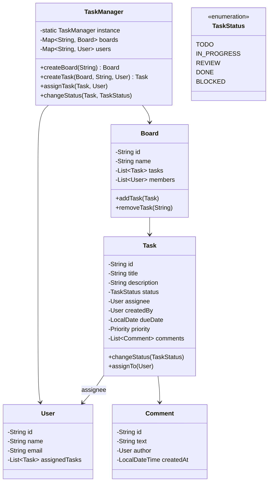

# 📋 Task Management System — Complete LLD Guide

---

A Trello/Jira-like task management system with users, tasks, boards, status tracking, and notifications.

## 🏗️ Class Diagram



## 💻 Core Implementation

**`TaskStatus.java`**
```java
public enum TaskStatus {
    TODO, IN_PROGRESS, REVIEW, DONE, BLOCKED
}

public enum Priority {
    LOW, MEDIUM, HIGH, CRITICAL
}
```

**`TaskManager.java`** (Singleton + Observer)
```java
public class TaskManager {
    private static volatile TaskManager instance;
    private final Map<String, Board> boards = new ConcurrentHashMap<>();
    private final Map<String, User> users = new ConcurrentHashMap<>();
    private final List<TaskObserver> observers = new CopyOnWriteArrayList<>();

    private TaskManager() {}

    public static TaskManager getInstance() {
        if (instance == null) {
            synchronized (TaskManager.class) {
                if (instance == null) instance = new TaskManager();
            }
        }
        return instance;
    }

    public Task createTask(Board board, String title, User creator) {
        Task task = new Task(title, creator);
        board.addTask(task);
        notifyObservers(TaskEvent.TASK_CREATED, task);
        return task;
    }

    public void assignTask(Task task, User assignee) {
        task.assignTo(assignee);
        notifyObservers(TaskEvent.TASK_ASSIGNED, task);
    }

    public void changeStatus(Task task, TaskStatus newStatus) {
        TaskStatus old = task.getStatus();
        task.changeStatus(newStatus);
        notifyObservers(TaskEvent.STATUS_CHANGED, task);
        // Notify assignee specifically
        if (task.getAssignee() != null) {
            sendNotification(task.getAssignee(), 
                "Task '" + task.getTitle() + "' moved from " + old + " to " + newStatus);
        }
    }

    // Observer pattern
    public void addObserver(TaskObserver o) { observers.add(o); }
    
    private void notifyObservers(TaskEvent event, Task task) {
        observers.forEach(o -> o.onTaskEvent(event, task));
    }

    private void sendNotification(User user, String message) {
        System.out.printf("📧 Email to %s: %s%n", user.getEmail(), message);
    }
}
```

**`Task.java`**
```java
public class Task {
    private final String id = UUID.randomUUID().toString();
    private String title;
    private String description;
    private volatile TaskStatus status = TaskStatus.TODO;
    private volatile User assignee;
    private final User createdBy;
    private LocalDate dueDate;
    private Priority priority = Priority.MEDIUM;
    private final List<Comment> comments = new CopyOnWriteArrayList<>();

    public synchronized void changeStatus(TaskStatus newStatus) {
        if (!canTransitionTo(newStatus)) {
            throw new IllegalStateException("Cannot transition from " + status + " to " + newStatus);
        }
        this.status = newStatus;
    }

    private boolean canTransitionTo(TaskStatus newStatus) {
        return switch (status) {
            case TODO -> newStatus == TaskStatus.IN_PROGRESS || newStatus == TaskStatus.BLOCKED;
            case IN_PROGRESS -> newStatus == TaskStatus.REVIEW || newStatus == TaskStatus.BLOCKED || newStatus == TaskStatus.DONE;
            case REVIEW -> newStatus == TaskStatus.IN_PROGRESS || newStatus == TaskStatus.DONE;
            case BLOCKED -> newStatus == TaskStatus.TODO || newStatus == TaskStatus.IN_PROGRESS;
            case DONE -> false;  // Terminal state
        };
    }

    public void addComment(String text, User author) {
        comments.add(new Comment(text, author));
    }

    // Getters, setters, equals, hashCode
}
```

**`TaskObserver.java`** (Observer Pattern)
```java
public interface TaskObserver {
    void onTaskEvent(TaskEvent event, Task task);
}

enum TaskEvent {
    TASK_CREATED, TASK_ASSIGNED, STATUS_CHANGED, COMMENT_ADDED
}

class SlackNotifier implements TaskObserver {
    public void onTaskEvent(TaskEvent event, Task task) {
        if (event == TaskEvent.STATUS_CHANGED) {
            System.out.println("🔔 Slack: Task " + task.getTitle() + " status changed");
        }
    }
}
```

---

## 📊 Interview Follow-ups

| Question | Answer |
|----------|--------|
| **Q1: How to handle concurrent status updates?** | `synchronized` on `changeStatus()`. Use optimistic locking in DB. |
| **Q2: How to add drag-and-drop reordering?** | Add `position` field to Task. Use fractional indexing for O(1) reorder. |
| **Q3: How to implement search?** | Maintain inverted index on title, description, assignee name. Use Elasticsearch. |
| **Q4: How to handle permissions?** | RBAC: Board owner → Admin → Member → Viewer. Check before each operation. |