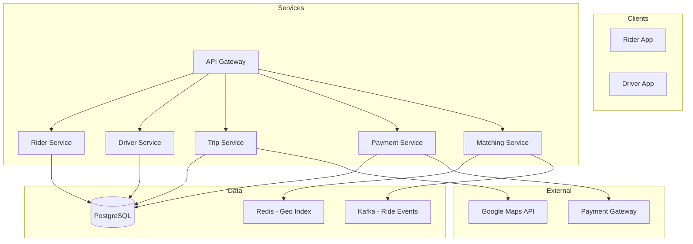
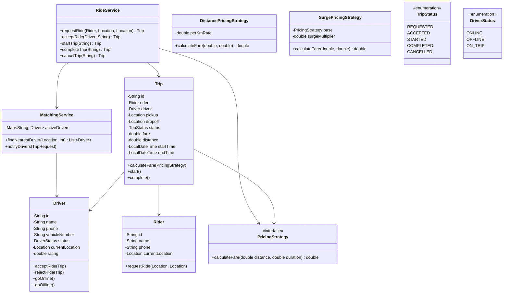

# 🚕 Cab Booking System (Uber) — Complete LLD Guide

---

## 📋 Table of Contents
1. [Requirements](#requirements)
2. [HLD Architecture](#hld)
3. [Class Diagram (LLD)](#class-diagram)
4. [Complete Java Implementation](#implementation)
5. [Concurrency](#concurrency)
6. [Interview Follow-ups](#follow-ups)

---

## 📝 Requirements

### Functional
1. **Riders** — Request rides, track trips, pay
2. **Drivers** — Register, go online/offline, accept/reject rides
3. **Trip** — Match rider to nearest driver, track trip lifecycle
4. **Pricing** — Distance-based fare, surge pricing
5. **Payment** — Process payment after trip
6. **Find Nearest** — Find active drivers closest to rider

### Non-Functional
1. **Low Latency** — Match driver in < 500ms
2. **Scalability** — Handle millions of riders/drivers
3. **Consistency** — No double booking of drivers

---

## <a name="hld"></a>🏛️ HLD Architecture



---

## <a name="class-diagram"></a>🏗️ LLD — Class Diagram



---

## <a name="implementation"></a>💻 Complete Java Implementation

**`RideService.java`** — Core orchestration
```java
public class RideService {
    private final MatchingService matchingService;
    private final PricingStrategy pricingStrategy;
    private final Map<String, Trip> activeTrips = new ConcurrentHashMap<>();
    private final List<RideObserver> observers = new CopyOnWriteArrayList<>();

    /**
     * Rider requests a ride.
     * 1. Find nearest drivers
     * 2. Create trip in REQUESTED status
     * 3. Notify drivers
     */
    public Trip requestRide(Rider rider, Location pickup, Location dropoff) {
        // Find nearby drivers (within 5km)
        List<Driver> nearbyDrivers = matchingService.findNearestDriver(pickup, 5.0);
        
        if (nearbyDrivers.isEmpty()) {
            throw new RideException("No drivers available nearby");
        }

        // Create trip request
        Trip trip = new Trip(rider, pickup, dropoff);
        activeTrips.put(trip.getId(), trip);
        
        // Notify nearest 3 drivers
        matchingService.notifyDrivers(trip, nearbyDrivers.subList(0, Math.min(3, nearbyDrivers.size())));
        
        notifyObservers(RideEvent.RIDE_REQUESTED, trip);
        return trip;
    }

    /**
     * Driver accepts a ride.
     */
    public synchronized Trip acceptRide(Driver driver, String tripId) {
        Trip trip = activeTrips.get(tripId);
        if (trip == null || trip.getStatus() != TripStatus.REQUESTED) {
            throw new RideException("Trip not available for acceptance");
        }
        
        trip.setDriver(driver);
        trip.setStatus(TripStatus.ACCEPTED);
        driver.setStatus(DriverStatus.ON_TRIP);
        
        notifyObservers(RideEvent.RIDE_ACCEPTED, trip);
        return trip;
    }

    /**
     * Start trip (driver arrives at pickup).
     */
    public Trip startTrip(String tripId) {
        Trip trip = activeTrips.get(tripId);
        trip.start();
        notifyObservers(RideEvent.RIDE_STARTED, trip);
        return trip;
    }

    /**
     * Complete trip, calculate fare.
     */
    public Trip completeTrip(String tripId, Location dropoffLocation) {
        Trip trip = activeTrips.get(tripId);
        
        // Calculate distance using GPS coordinates
        double distance = trip.getPickup().distanceTo(dropoffLocation);
        trip.setDropoff(dropoffLocation);
        trip.setDistance(distance);
        
        // Calculate fare
        double fare = pricingStrategy.calculateFare(distance, trip.getDurationMinutes());
        trip.setFare(fare);
        trip.complete();
        
        // Free the driver
        trip.getDriver().setStatus(DriverStatus.ONLINE);
        
        notifyObservers(RideEvent.RIDE_COMPLETED, trip);
        return trip;
    }

    /**
     * Cancel trip before start.
     */
    public Trip cancelTrip(String tripId, String reason) {
        Trip trip = activeTrips.get(tripId);
        trip.cancel(reason);
        
        // Free driver if assigned
        if (trip.getDriver() != null) {
            trip.getDriver().setStatus(DriverStatus.ONLINE);
        }
        
        notifyObservers(RideEvent.RIDE_CANCELLED, trip);
        return trip;
    }

    // Observer pattern
    public void addObserver(RideObserver observer) { observers.add(observer); }
    private void notifyObservers(RideEvent event, Trip trip) {
        observers.forEach(o -> o.onRideEvent(event, trip));
    }
}
```

**`MatchingService.java`** — Find nearest drivers
```java
public class MatchingService {
    // Driver ID → Driver with location, status
    private final Map<String, Driver> activeDrivers = new ConcurrentHashMap<>();
    // Spatial index: grid-based or geo-hash for O(1) nearest neighbor
    
    /**
     * Find nearest available drivers within radius km.
     * Uses simple linear scan (O(n)). In production: use geo-hash or quadtree.
     */
    public List<Driver> findNearestDriver(Location location, double radiusKm) {
        return activeDrivers.values().stream()
            .filter(d -> d.getStatus() == DriverStatus.ONLINE)
            .filter(d -> d.getCurrentLocation().distanceTo(location) <= radiusKm)
            .sorted(Comparator.comparingDouble(d -> 
                d.getCurrentLocation().distanceTo(location)))
            .collect(Collectors.toList());
    }

    /**
     * Notify top N drivers about ride request.
     * Could use push notification, websocket, or SMS.
     */
    public void notifyDrivers(Trip trip, List<Driver> drivers) {
        for (Driver driver : drivers) {
            // Send notification asynchronously
            CompletableFuture.runAsync(() -> {
                System.out.printf("🔔 Notified %s: New ride %.1fkm away%n", 
                    driver.getName(), 
                    driver.getCurrentLocation().distanceTo(trip.getPickup()));
            });
        }
    }

    public void driverGoesOnline(Driver driver) {
        driver.setStatus(DriverStatus.ONLINE);
        activeDrivers.put(driver.getId(), driver);
    }

    public void driverGoesOffline(Driver driver) {
        driver.setStatus(DriverStatus.OFFLINE);
        activeDrivers.remove(driver.getId());
    }
}
```

**`Trip.java`**
```java
public class Trip {
    private final String id = UUID.randomUUID().toString();
    private final Rider rider;
    private volatile Driver driver;
    private final Location pickup;
    private volatile Location dropoff;
    private volatile TripStatus status = TripStatus.REQUESTED;
    private volatile double fare;
    private volatile double distance;
    private final LocalDateTime createdAt = LocalDateTime.now();
    private volatile LocalDateTime startTime;
    private volatile LocalDateTime endTime;
    private String cancelReason;

    public void start() {
        if (status != TripStatus.ACCEPTED) {
            throw new IllegalStateException("Trip must be accepted before starting");
        }
        this.status = TripStatus.STARTED;
        this.startTime = LocalDateTime.now();
    }

    public void complete() {
        this.status = TripStatus.COMPLETED;
        this.endTime = LocalDateTime.now();
    }

    public void cancel(String reason) {
        this.status = TripStatus.CANCELLED;
        this.cancelReason = reason;
        this.endTime = LocalDateTime.now();
    }

    public long getDurationMinutes() {
        if (startTime == null) return 0;
        LocalDateTime end = endTime != null ? endTime : LocalDateTime.now();
        return ChronoUnit.MINUTES.between(startTime, end);
    }

    // Getters and setters
}
```

**`PricingStrategy.java`** (Strategy Pattern)
```java
@FunctionalInterface
public interface PricingStrategy {
    double calculateFare(double distanceKm, double durationMinutes);
}

class StandardPricingStrategy implements PricingStrategy {
    private static final double BASE_FARE = 25.0;      // ₹25 base
    private static final double PER_KM_RATE = 10.0;     // ₹10/km
    private static final double PER_MIN_RATE = 2.0;     // ₹2/min

    @Override
    public double calculateFare(double distanceKm, double durationMinutes) {
        return BASE_FARE + (distanceKm * PER_KM_RATE) + (durationMinutes * PER_MIN_RATE);
    }
}

class SurgePricingStrategy implements PricingStrategy {
    private final PricingStrategy baseStrategy;
    private final double surgeMultiplier;

    public SurgePricingStrategy(PricingStrategy base, double multiplier) {
        this.baseStrategy = base;
        this.surgeMultiplier = multiplier;
    }

    @Override
    public double calculateFare(double distanceKm, double durationMinutes) {
        return baseStrategy.calculateFare(distanceKm, durationMinutes) * surgeMultiplier;
    }
}
```

---

## 9 Interview Follow-ups

| Question | Answer |
|----------|--------|
| **Q1: How to find nearest driver efficiently?** | Use geo-hashing (geohash) or Google S2 library. Grid-based bucketing for approximate O(1). |
| **Q2: How to handle driver reassignment?** | If driver rejects, notify next in queue. Timeout after 15 seconds. |
| **Q3: How to calculate surge pricing?** | Track demand/supply ratio in each area. Surge = max(1.0, demand/supply × base). Update every 5 minutes. |
| **Q4: How to prevent double booking?** | `synchronized` + status check. In DB: `UPDATE driver SET status='ON_TRIP' WHERE status='ONLINE' AND id=?` |
| **Q5: How to handle concurrent location updates?** | Batch updates with timestamp. Use write-behind cache to DB. |
| **Q6: Scaling to city-wide?** | Shard by city. Each city has independent MatchingService. Redis per city for geo-index. |