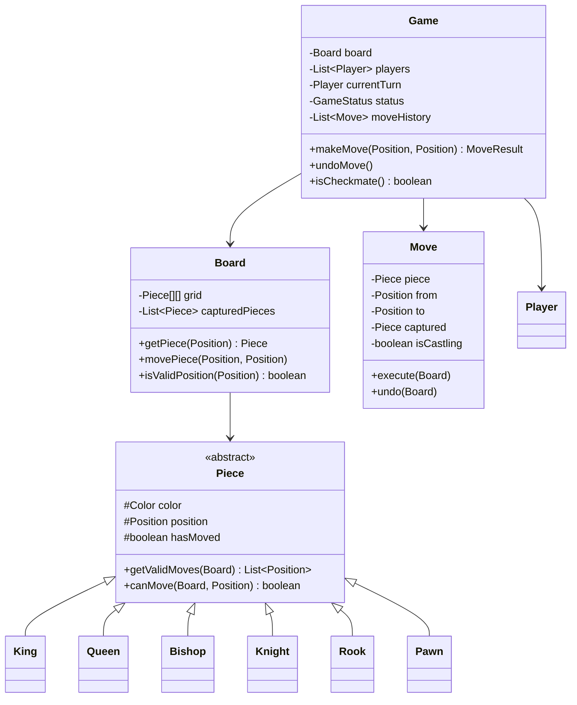

# ♟️ Chess Game — Complete LLD Guide

---

## Requirements
1. **Board** — 8×8 with standard initial configuration
2. **Pieces** — King, Queen, Bishop, Knight, Rook, Pawn (each with unique moves)
3. **Players** — White and Black, alternate turns
4. **Moves** — Validate legal moves, check for check/checkmate
5. **Game State** — Track turns, captured pieces, game status
6. **Special Moves** — Castling, En Passant, Pawn Promotion

## Key Design Patterns
- **Strategy Pattern** — Each piece has its own move validation
- **Command Pattern** — Moves can be undone (for undo feature)
- **State Pattern** — Game states (WAITING, PLAYING, CHECK, CHECKMATE, DRAW)

## 🏗️ Class Diagram



## 💻 Core Implementation

**`Piece.java`** (Strategy Pattern base)
```java
public abstract class Piece {
    protected final Color color;
    protected Position position;
    protected boolean hasMoved;

    public Piece(Color color, Position pos) {
        this.color = color;
        this.position = pos;
    }

    /** Get all valid moves (excluding those that leave king in check). */
    public abstract List<Position> getRawMoves(Board board);

    /** Get moves that don't leave own king in check. */
    public List<Position> getValidMoves(Board board) {
        List<Position> raw = getRawMoves(board);
        List<Position> valid = new ArrayList<>();
        
        for (Position target : raw) {
            if (wouldNotLeaveKingInCheck(board, target)) {
                valid.add(target);
            }
        }
        return valid;
    }

    private boolean wouldNotLeaveKingInCheck(Board board, Position target) {
        // Simulate move on cloned board
        Board clone = board.clone();
        clone.movePiece(this.position, target);
        return !clone.isKingInCheck(this.color);
    }

    public abstract String getSymbol();
    public Color getColor() { return color; }
}

class King extends Piece {
    public King(Color color, Position pos) { super(color, pos); }

    @Override
    public List<Position> getRawMoves(Board board) {
        List<Position> moves = new ArrayList<>();
        int[][] offsets = {{0,1},{1,1},{1,0},{1,-1},{0,-1},{-1,-1},{-1,0},{-1,1}};
        
        for (int[] off : offsets) {
            Position p = position.offset(off[0], off[1]);
            if (board.isValidPosition(p) && !isFriendlyPiece(board, p)) {
                moves.add(p);
            }
        }
        
        // Castling
        if (!hasMoved && !board.isKingInCheck(color)) {
            // King-side
            if (canCastleKingSide(board)) {
                moves.add(position.offset(0, 2));
            }
            // Queen-side
            if (canCastleQueenSide(board)) {
                moves.add(position.offset(0, -2));
            }
        }
        
        return moves;
    }

    private boolean canCastleKingSide(Board board) {
        Position rookPos = position.offset(0, 3);
        Piece rook = board.getPiece(rookPos);
        return rook instanceof Rook && !rook.hasMoved &&
               board.isClearPath(position, rookPos);
    }
}

class Knight extends Piece {
    @Override
    public List<Position> getRawMoves(Board board) {
        List<Position> moves = new ArrayList<>();
        int[][] jumps = {{2,1},{1,2},{-1,2},{-2,1},{-2,-1},{-1,-2},{1,-2},{2,-1}};
        
        for (int[] j : jumps) {
            Position p = position.offset(j[0], j[1]);
            if (board.isValidPosition(p) && !isFriendlyPiece(board, p)) {
                moves.add(p);
            }
        }
        return moves;
    }
}
```

**`Board.java`**
```java
public class Board implements Cloneable {
    private final Piece[][] grid = new Piece[8][8];
    private final Map<Color, Position> kingPositions = new HashMap<>();

    public Board() {
        initializeStandardBoard();
    }

    private void initializeStandardBoard() {
        // Black pieces (row 0-1)
        grid[0][0] = new Rook(Color.BLACK, new Position(0,0));
        grid[0][1] = new Knight(Color.BLACK, new Position(0,1));
        grid[0][2] = new Bishop(Color.BLACK, new Position(0,2));
        grid[0][3] = new Queen(Color.BLACK, new Position(0,3));
        grid[0][4] = new King(Color.BLACK, new Position(0,4));
        // ... etc for all pieces
        
        // White pieces (row 6-7)
        grid[7][0] = new Rook(Color.WHITE, new Position(7,0));
        // ... etc
        
        // Pawns
        for (int col = 0; col < 8; col++) {
            grid[1][col] = new Pawn(Color.BLACK, new Position(1, col));
            grid[6][col] = new Pawn(Color.WHITE, new Position(6, col));
        }
        
        kingPositions.put(Color.WHITE, new Position(7, 4));
        kingPositions.put(Color.BLACK, new Position(0, 4));
    }

    public boolean isKingInCheck(Color color) {
        Position kingPos = kingPositions.get(color);
        Color opponent = color == Color.WHITE ? Color.BLACK : Color.WHITE;
        
        for (int r = 0; r < 8; r++) {
            for (int c = 0; c < 8; c++) {
                Piece p = grid[r][c];
                if (p != null && p.getColor() == opponent) {
                    if (p.getRawMoves(this).contains(kingPos)) {
                        return true;
                    }
                }
            }
        }
        return false;
    }

    public boolean isCheckmate(Color color) {
        if (!isKingInCheck(color)) return false;
        
        // Check if any piece can block the check
        for (int r = 0; r < 8; r++) {
            for (int c = 0; c < 8; c++) {
                Piece p = grid[r][c];
                if (p != null && p.getColor() == color) {
                    if (!p.getValidMoves(this).isEmpty()) {
                        return false;
                    }
                }
            }
        }
        return true;
    }

    @Override
    public Board clone() {
        Board cloned = new Board();
        // Deep copy all pieces
        for (int r = 0; r < 8; r++) {
            for (int c = 0; c < 8; c++) {
                if (grid[r][c] != null) {
                    // Use reflection or clone method for each piece
                }
            }
        }
        return cloned;
    }
}
```

**`Game.java`**
```java
public class Game {
    private final Board board = new Board();
    private final List<Player> players = new ArrayList<>();
    private Color currentTurn = Color.WHITE;
    private GameStatus status = GameStatus.PLAYING;
    private final Deque<Move> moveHistory = new ArrayDeque<>();

    public MoveResult makeMove(Position from, Position to) {
        Piece piece = board.getPiece(from);
        if (piece == null || piece.getColor() != currentTurn) {
            return MoveResult.INVALID_MOVE;
        }

        // Check if move is valid
        if (!piece.getValidMoves(board).contains(to)) {
            return MoveResult.INVALID_MOVE;
        }

        // Execute move
        Piece captured = board.getPiece(to);
        Move move = new Move(piece, from, to, captured);
        move.execute(board);
        moveHistory.push(move);

        // Check for checkmate
        Color opponent = currentTurn == Color.WHITE ? Color.BLACK : Color.WHITE;
        if (board.isCheckmate(opponent)) {
            status = GameStatus.CHECKMATE;
            return MoveResult.CHECKMATE;
        }
        if (board.isKingInCheck(opponent)) {
            return MoveResult.CHECK;
        }

        currentTurn = opponent;
        return MoveResult.SUCCESS;
    }

    public void undoMove() {
        Move move = moveHistory.poll();
        if (move != null) {
            move.undo(board);
            currentTurn = currentTurn == Color.WHITE ? Color.BLACK : Color.WHITE;
        }
    }
}
```

## 📊 Interview Follow-ups

| Question | Answer |
|----------|--------|
| **Q1: How to implement AI opponent?** | Minimax algorithm with alpha-beta pruning. Evaluate board based on piece values + position. |
| **Q2: How to detect draw/stalemate?** | Stalemate: no legal moves but not in check. Threefold repetition: same position 3 times. 50-move rule. |
| **Q3: Pawn promotion?** | When pawn reaches opponent's back rank, player chooses Queen/Rook/Bishop/Knight. |
| **Q4: En Passant?** | Track last move's double pawn advance. If opponent's pawn is adjacent, allow diagonal capture. |