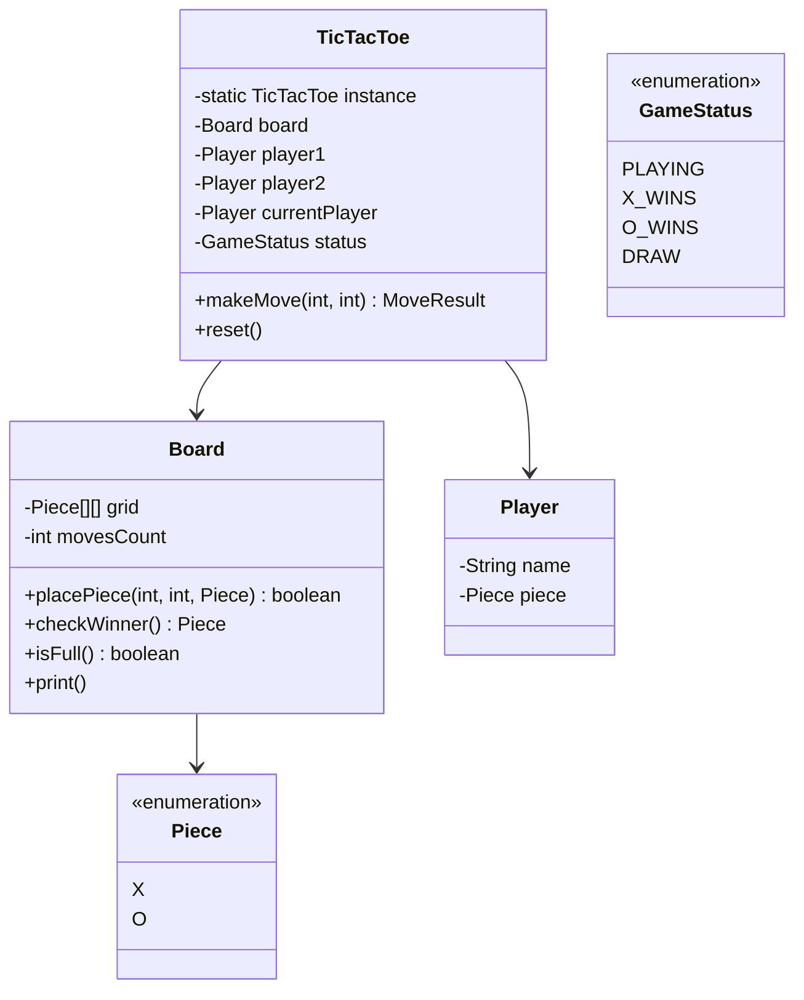

# ⭕ Tic-Tac-Toe — Complete LLD Guide

---

## Requirements
1. **Board** — 3×3 grid
2. **Players** — 2 players (X and O), alternate turns
3. **Game Rules** — Place piece, check win/draw after each move
4. **Win Detection** — 3 in a row (any row, column, or diagonal)
5. **Game State** — IN_PROGRESS, DRAW, X_WINS, O_WINS

## 🏗️ Class Diagram



## 💻 Core Implementation

```java
public enum Piece { X, O }
public enum GameStatus { PLAYING, X_WINS, O_WINS, DRAW }

public class Board {
    private final Piece[][] grid = new Piece[3][3];
    private int movesCount = 0;

    public synchronized boolean placePiece(int row, int col, Piece piece) {
        if (row < 0 || row > 2 || col < 0 || col > 2) return false;
        if (grid[row][col] != null) return false;
        grid[row][col] = piece;
        movesCount++;
        return true;
    }

    public Piece checkWinner() {
        // Check rows
        for (int r = 0; r < 3; r++) {
            if (grid[r][0] != null && grid[r][0] == grid[r][1] && grid[r][1] == grid[r][2]) {
                return grid[r][0];
            }
        }
        // Check columns
        for (int c = 0; c < 3; c++) {
            if (grid[0][c] != null && grid[0][c] == grid[1][c] && grid[1][c] == grid[2][c]) {
                return grid[0][c];
            }
        }
        // Check diagonals
        if (grid[0][0] != null && grid[0][0] == grid[1][1] && grid[1][1] == grid[2][2]) {
            return grid[0][0];
        }
        if (grid[0][2] != null && grid[0][2] == grid[1][1] && grid[1][1] == grid[2][0]) {
            return grid[0][2];
        }
        return null;  // No winner yet
    }

    public boolean isFull() { return movesCount == 9; }
}

public class TicTacToe {
    private static volatile TicTacToe instance;
    private final Board board = new Board();
    private Player player1, player2, currentPlayer;
    private GameStatus status = GameStatus.PLAYING;

    private TicTacToe() {}

    public static TicTacToe getInstance() {
        if (instance == null) {
            synchronized (TicTacToe.class) {
                if (instance == null) instance = new TicTacToe();
            }
        }
        return instance;
    }

    public void initialize(String name1, String name2) {
        player1 = new Player(name1, Piece.X);
        player2 = new Player(name2, Piece.O);
        currentPlayer = player1;
        status = GameStatus.PLAYING;
    }

    public MoveResult makeMove(int row, int col) {
        if (status != GameStatus.PLAYING) {
            return new MoveResult(false, "Game is over", null);
        }

        boolean placed = board.placePiece(row, col, currentPlayer.getPiece());
        if (!placed) {
            return new MoveResult(false, "Invalid move", null);
        }

        Piece winner = board.checkWinner();
        if (winner != null) {
            status = winner == Piece.X ? GameStatus.X_WINS : GameStatus.O_WINS;
            return new MoveResult(true, "Winner: " + currentPlayer.getName(), status);
        }

        if (board.isFull()) {
            status = GameStatus.DRAW;
            return new MoveResult(true, "Game is a draw", status);
        }

        currentPlayer = (currentPlayer == player1) ? player2 : player1;
        return new MoveResult(true, "Move accepted", GameStatus.PLAYING);
    }

    public void reset() {
        // Reinitialize board and players
        initialize(player1.getName(), player2.getName());
    }
}
```

## Design Patterns
- **Singleton** — Single TicTacToe game instance
- **Strategy Pattern** — Can add AI strategies (minimax, random, etc.)

## Interview Follow-ups
| Question | Answer |
|----------|--------|
| **Q1: Handle N×N board?** | Add `size` parameter. Win detection becomes O(N) per move. |
| **Q2: Add AI player?** | Implement Minimax algorithm. Strategy pattern for difficulty levels. |
| **Q3: Undo feature?** | Command pattern: store moves in stack. |