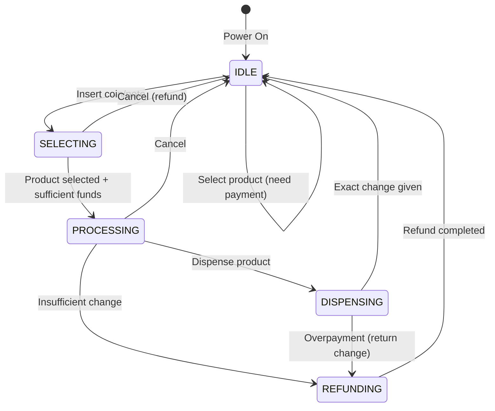
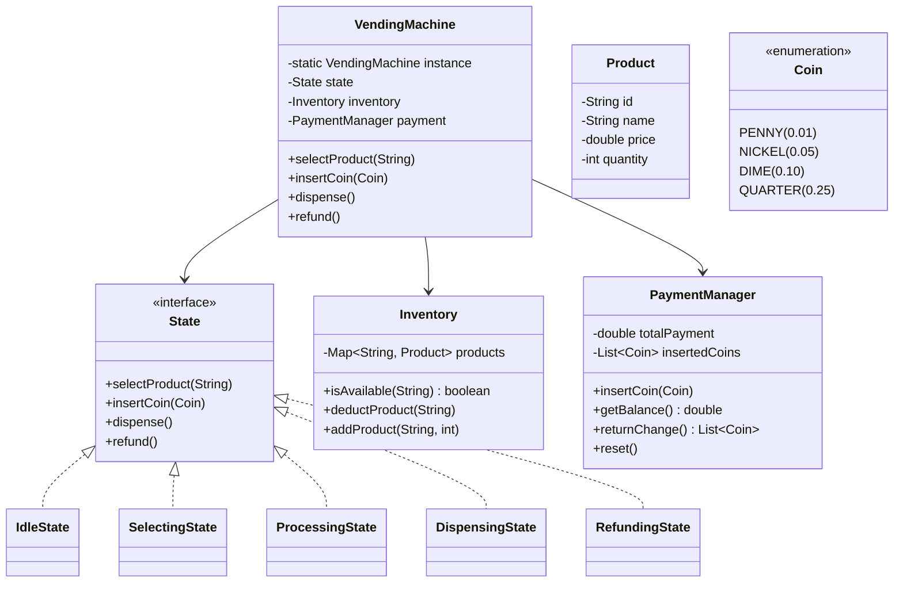

# 🥤 Vending Machine — Complete LLD Guide

---

## Requirements
1. **Products** — Multiple slots, each with product name, price, quantity
2. **Payments** — Accept coins (1, 5, 10, 25¢) and notes
3. **Dispense** — Dispense product when payment sufficient
4. **Change** — Return change if overpaid
5. **Refund** — Return money if cancelled
6. **Inventory** — Track stock levels, refill capability

## Key Design: State Pattern
Vending machine has distinct states: IDLE → SELECTING → PROCESSING → DISPENSING → REFUNDING



## 🏗️ Class Diagram



## 💻 Core Implementation

**`State.java`** (State Pattern)
```java
public interface State {
    void selectProduct(String productId);
    void insertCoin(Coin coin);
    void dispense();
    void refund();
}

class IdleState implements State {
    private final VendingMachine machine;
    
    public IdleState(VendingMachine machine) { this.machine = machine; }

    @Override
    public void selectProduct(String productId) {
        if (!machine.getInventory().isAvailable(productId)) {
            System.out.println("Product unavailable");
            return;
        }
        machine.setSelectedProduct(productId);
        machine.setState(machine.getSelectingState());
        System.out.println("Please insert $" + machine.getInventory().getPrice(productId));
    }

    @Override
    public void insertCoin(Coin coin) {
        System.out.println("Select a product first");
    }

    @Override
    public void dispense() { System.out.println("Select a product first"); }

    @Override
    public void refund() { System.out.println("Nothing to refund"); }
}

class SelectingState implements State {
    private final VendingMachine machine;

    public SelectingState(VendingMachine machine) { this.machine = machine; }

    @Override
    public void insertCoin(Coin coin) {
        machine.getPaymentManager().insertCoin(coin);
        double balance = machine.getPaymentManager().getTotalPayment();
        double price = machine.getInventory().getPrice(machine.getSelectedProduct());
        
        System.out.printf("Inserted: $%.2f | Balance: $%.2f | Price: $%.2f%n", 
            coin.getValue(), balance, price);
        
        if (balance >= price) {
            machine.setState(machine.getProcessingState());
            machine.dispense();
        }
    }

    @Override
    public void selectProduct(String productId) {
        System.out.println("Already selecting. Insert coins or cancel.");
    }

    @Override
    public void dispense() { System.out.println("Insert coins first"); }

    @Override
    public void refund() {
        machine.getPaymentManager().reset();
        machine.setState(machine.getIdleState());
        System.out.println("Transaction cancelled. Money refunded.");
    }
}

class ProcessingState implements State {
    private final VendingMachine machine;

    @Override
    public void dispense() {
        String product = machine.getSelectedProduct();
        machine.getInventory().deductProduct(product);
        
        double change = machine.getPaymentManager().getTotalPayment() 
            - machine.getInventory().getPrice(product);
        
        if (change > 0) {
            System.out.println("Dispensing " + product + " with $" + change + " change");
            machine.getPaymentManager().returnChange(change);
            machine.setState(machine.getRefundingState());
        } else {
            System.out.println("Dispensing " + product);
            machine.getPaymentManager().reset();
            machine.setState(machine.getIdleState());
        }
    }
}
```

**`VendingMachine.java`** (Singleton + State Pattern)
```java
public class VendingMachine {
    private static volatile VendingMachine instance;
    private final Inventory inventory = new Inventory();
    private final PaymentManager paymentManager = new PaymentManager();
    
    private State idleState;
    private State selectingState;
    private State processingState;
    private State dispensingState;
    private State refundingState;
    private State currentState;
    private String selectedProduct;

    private VendingMachine() {
        idleState = new IdleState(this);
        selectingState = new SelectingState(this);
        processingState = new ProcessingState(this);
        // ... initialize other states
        currentState = idleState;
    }

    public static VendingMachine getInstance() {
        if (instance == null) {
            synchronized (VendingMachine.class) {
                if (instance == null) instance = new VendingMachine();
            }
        }
        return instance;
    }

    public void selectProduct(String productId) {
        currentState.selectProduct(productId);
    }

    public void insertCoin(Coin coin) {
        currentState.insertCoin(coin);
    }

    public void dispense() {
        currentState.dispense();
    }

    public void refund() {
        currentState.refund();
    }

    // Getters and setters
    public void setState(State s) { this.currentState = s; }
    public Inventory getInventory() { return inventory; }
    public PaymentManager getPaymentManager() { return paymentManager; }
    public String getSelectedProduct() { return selectedProduct; }
    public void setSelectedProduct(String p) { this.selectedProduct = p; }
}
```

## Interview Follow-ups
| Question | Answer |
|----------|--------|
| **Q1: Handle out-of-change scenario?** | Track cash in machine. Before dispensing, verify change can be made. |
| **Q2: Add note support?** | Add Note enum ($1, $5, $10). Note validator interface. |
| **Q3: Concurrent users?** | Vending machine is single-user by nature. Synchronized methods for safety. |