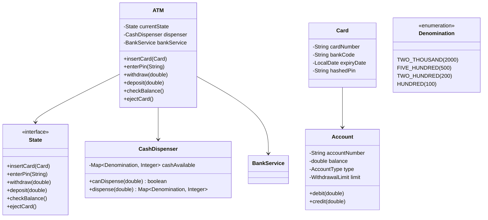

# 🏧 ATM Machine — Complete LLD Guide

---

## Requirements
1. **Authentication** — Card + PIN validation
2. **Operations** — Withdraw, Deposit, Check Balance, Transfer
3. **Cash Dispensing** — Dispense minimum number of notes (₹2000, ₹500, ₹200, ₹100)
4. **Account Types** — Savings, Current (different limits)
5. **Transaction History** — Track all transactions
6. **Error Handling** — Insufficient balance, wrong PIN, ATM empty

## Design Patterns
- **State Pattern** — ATM states: IDLE → CARD_INSERTED → AUTHENTICATED → TRANSACTION → EJECTING
- **Strategy Pattern** — Different withdrawal limits per account type
- **Chain of Responsibility** — Cash dispenser (2000→500→200→100)
- **Command Pattern** — Each transaction (withdraw, deposit, balance)

## 🏗️ Class Diagram



## 💻 Core Implementation

**`CashDispenser.java`** (Chain of Responsibility)
```java
public class CashDispenser {
    private static final int[] DENOMINATIONS = {2000, 500, 200, 100};
    private final Map<Integer, Integer> cashAvailable = new ConcurrentHashMap<>();

    public CashDispenser() {
        cashAvailable.put(2000, 100);
        cashAvailable.put(500, 200);
        cashAvailable.put(200, 300);
        cashAvailable.put(100, 500);
    }

    /**
     * Try to dispense amount with minimum notes.
     * Uses greedy algorithm with available cash.
     * 
     * @param amount Amount to dispense
     * @return Map of denomination→count
     * @throws ATMException if can't dispense exact amount
     */
    public synchronized Map<Integer, Integer> dispense(double amount) {
        int remaining = (int) amount;
        if (remaining % 100 != 0) {
            throw new ATMException("Amount must be multiple of 100");
        }
        if (getTotalCash() < amount) {
            throw new ATMException("ATM has insufficient cash");
        }

        Map<Integer, Integer> toDispense = new LinkedHashMap<>();
        
        for (int denom : DENOMINATIONS) {
            int available = cashAvailable.getOrDefault(denom, 0);
            int needed = remaining / denom;
            int toGive = Math.min(available, needed);
            
            if (toGive > 0) {
                toDispense.put(denom, toGive);
                remaining -= toGive * denom;
            }
        }

        if (remaining > 0) {
            throw new ATMException("Cannot dispense exact amount with available denominations");
        }

        // Deduct from ATM
        for (Map.Entry<Integer, Integer> entry : toDispense.entrySet()) {
            cashAvailable.merge(entry.getKey(), -entry.getValue(), Integer::sum);
        }

        return toDispense;
    }

    public double getTotalCash() {
        return cashAvailable.entrySet().stream()
            .mapToDouble(e -> e.getKey() * e.getValue())
            .sum();
    }
}

/**
 * ATM State base (State Pattern).
 * Each state defines valid transitions.
 */
public class IdleState implements State {
    private final ATM atm;

    @Override
    public void insertCard(Card card) {
        System.out.println("Card inserted: " + card.getCardNumber());
        atm.setCurrentCard(card);
        atm.setState(atm.getCardInsertedState());
    }

    @Override
    public void enterPin(String pin) { throw new IllegalStateException("Insert card first"); }
    @Override
    public void withdraw(double amt) { throw new IllegalStateException("Insert card first"); }
    @Override
    public void deposit(double amt) { throw new IllegalStateException("Insert card first"); }
    @Override
    public double checkBalance() { throw new IllegalStateException("Insert card first"); }
}

public class AuthenticatedState implements State {
    private final ATM atm;

    @Override
    public void withdraw(double amount) {
        Account account = atm.getCurrentAccount();
        
        if (amount > account.getWithdrawalLimit().getMaxPerTransaction()) {
            System.out.println("Exceeds per-transaction limit");
            return;
        }
        if (amount > account.getBalance()) {
            System.out.println("Insufficient balance");
            return;
        }

        try {
            Map<Integer, Integer> notes = atm.getCashDispenser().dispense(amount);
            account.debit(amount);
            
            System.out.println("Dispensing:");
            notes.forEach((denom, count) -> 
                System.out.printf("  ₹%d × %d%n", denom, count));
            
            atm.addTransaction(new Transaction(
                TransactionType.WITHDRAWAL, amount, account.getAccountNumber()));
                
        } catch (ATMException e) {
            System.out.println("Error: " + e.getMessage());
        }
    }
}
```

**`ATM.java`** — Main orchestrator
```java
public class ATM {
    private static volatile ATM instance;
    private final CashDispenser dispenser = new CashDispenser();
    private final BankService bankService = new BankService();
    
    // States
    private final State idleState = new IdleState(this);
    private final State cardInsertedState = new CardInsertedState(this);
    private final State authenticatedState = new AuthenticatedState(this);
    
    private State currentState;
    private Card currentCard;
    private Account currentAccount;

    private ATM() { currentState = idleState; }

    public static ATM getInstance() {
        if (instance == null) {
            synchronized (ATM.class) {
                if (instance == null) instance = new ATM();
            }
        }
        return instance;
    }

    public void insertCard(Card card) { currentState.insertCard(card); }
    public void enterPin(String pin) { currentState.enterPin(pin); }
    public void withdraw(double amt) { currentState.withdraw(amt); }
    public void deposit(double amt) { currentState.deposit(amt); }
    public double checkBalance() { return currentState.checkBalance(); }
    
    public void setState(State s) { this.currentState = s; }
    public CashDispenser getCashDispenser() { return dispenser; }
}
```

## Interview Follow-ups
| Question | Answer |
|----------|--------|
| **Q1: What if ATM runs out of specific notes?** | Track available denominations. Use DP/smallest notes available instead of greedy. |
| **Q2: How to handle network failure?** | Store transaction locally, sync when online. Use idempotency keys. |
| **Q3: Add biometric authentication?** | Strategy pattern: PinStrategy, BiometricStrategy, CardTapStrategy. |
| **Q4: Money deposit flow?** | Accept cash/envelope, verify, credit account. Add DepositState. |