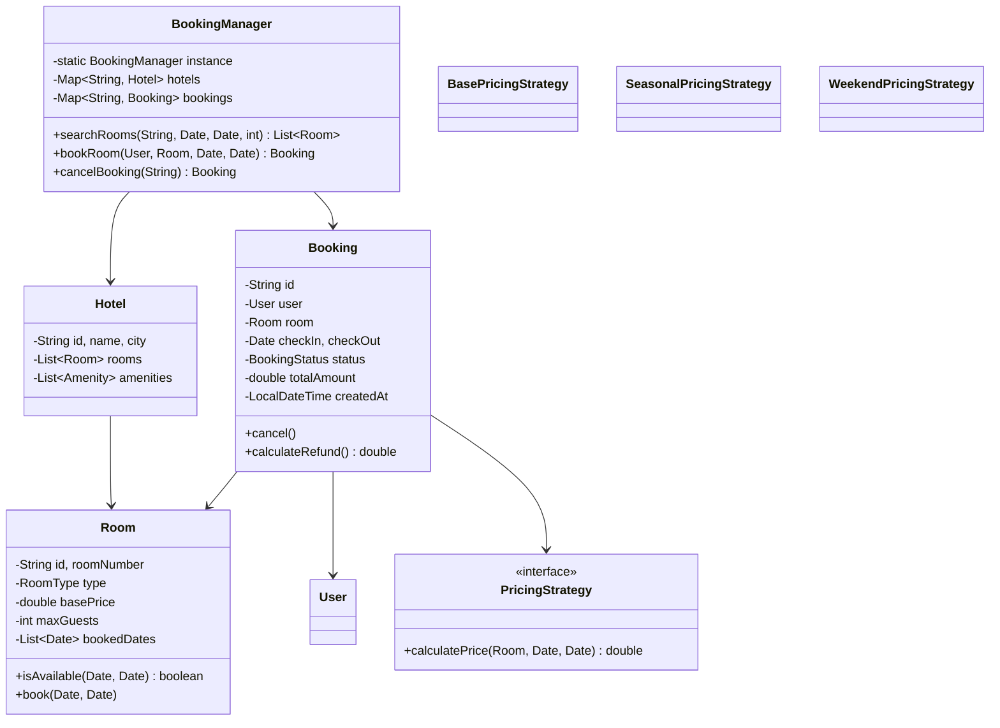

# 🏨 Hotel Booking System — Complete LLD Guide

---

## Requirements
1. **Hotels** — Multiple hotels, rooms of different types
2. **Rooms** — Room types (Standard, Deluxe, Suite, Penthouse)
3. **Search** — Search available rooms by date range, guests, preferences
4. **Booking** — Book rooms, prevent double booking
5. **Pricing** — Dynamic pricing (weekend surcharge, seasonal)
6. **Cancellation** — Cancel with refund policy
7. **Inventory** — Manage room availability in real-time

## Key Patterns
- **Strategy Pattern** — Pricing strategy (base, seasonal, loyalty)
- **Observer Pattern** — Notifications (email, SMS, app) on booking events
- **Factory Pattern** — Room creation by type
- **Singleton** — Booking system manager

## 🏗️ Class Diagram (Core)



## 💻 Core Implementation

```java
public class BookingManager {
    private static volatile BookingManager instance;
    private final Map<String, Hotel> hotels = new ConcurrentHashMap<>();
    private final Map<String, Booking> bookings = new ConcurrentHashMap<>();
    private final PricingStrategy pricingStrategy;
    private final List<BookingObserver> observers = new CopyOnWriteArrayList<>();

    private BookingManager(PricingStrategy pricingStrategy) {
        this.pricingStrategy = pricingStrategy;
    }

    public static BookingManager getInstance(PricingStrategy strategy) {
        if (instance == null) {
            synchronized (BookingManager.class) {
                if (instance == null) instance = new BookingManager(strategy);
            }
        }
        return instance;
    }

    /**
     * Search available rooms in a city for date range.
     */
    public List<Room> searchRooms(String city, LocalDate checkIn, LocalDate checkOut) {
        List<Room> available = new ArrayList<>();
        for (Hotel hotel : hotels.values()) {
            if (hotel.getCity().equalsIgnoreCase(city)) {
                for (Room room : hotel.getRooms()) {
                    if (room.isAvailable(checkIn, checkOut)) {
                        available.add(room);
                    }
                }
            }
        }
        return available;
    }

    /**
     * Book a room - thread safe to prevent double booking.
     */
    public synchronized Booking bookRoom(User user, Room room, LocalDate checkIn, LocalDate checkOut) {
        if (!room.isAvailable(checkIn, checkOut)) {
            throw new BookingException("Room not available for selected dates");
        }

        double totalPrice = pricingStrategy.calculatePrice(room, checkIn, checkOut);

        Booking booking = new Booking(user, room, checkIn, checkOut, totalPrice);
        room.book(checkIn, checkOut);
        bookings.put(booking.getId(), booking);

        notifyObservers(BookingEvent.BOOKED, booking);
        return booking;
    }

    /**
     * Cancel booking with refund calculation.
     */
    public synchronized Booking cancelBooking(String bookingId) {
        Booking booking = bookings.get(bookingId);
        if (booking == null) throw new BookingException("Booking not found");

        booking.cancel();
        booking.getRoom().releaseDates(booking.getCheckIn(), booking.getCheckOut());

        notifyObservers(BookingEvent.CANCELLED, booking);
        return booking;
    }

    // Observer pattern
    public void addObserver(BookingObserver o) { observers.add(o); }
    private void notifyObservers(BookingEvent event, Booking booking) {
        observers.forEach(o -> o.onBookingEvent(event, booking));
    }
}

public class PricingStrategy {
    private static final double WEEKEND_SURCHARGE = 1.3;
    private static final double SUITE_MULTIPLIER = 2.0;

    public double calculatePrice(Room room, LocalDate checkIn, LocalDate checkOut) {
        double total = 0;
        LocalDate date = checkIn;
        while (date.isBefore(checkOut)) {
            double dailyRate = room.getBasePrice();
            
            // Weekend surcharge
            if (date.getDayOfWeek() == DayOfWeek.SATURDAY || date.getDayOfWeek() == DayOfWeek.SUNDAY) {
                dailyRate *= WEEKEND_SURCHARGE;
            }
            // Room type multiplier
            if (room.getType() == RoomType.SUITE || room.getType() == RoomType.PENTHOUSE) {
                dailyRate *= SUITE_MULTIPLIER;
            }
            total += dailyRate;
            date = date.plusDays(1);
        }
        return total;
    }
}
```

## Interview Follow-ups
| Question | Answer |
|----------|--------|
| **Q1: How to handle overbooking?** | Overbooking ratio based on historical no-show rate. Compensate affected customers. |
| **Q2: Add loyalty program?** | Observer pattern: award points on booking. Points redeemable for discounts. |
| **Q3: Handle bulk/corporate bookings?** | Group booking logic. Corporate pricing strategy. Invoice generation. |
| **Q4: Rate limiting for room search?** | Cache popular searches in Redis. Return cached results for same params. |