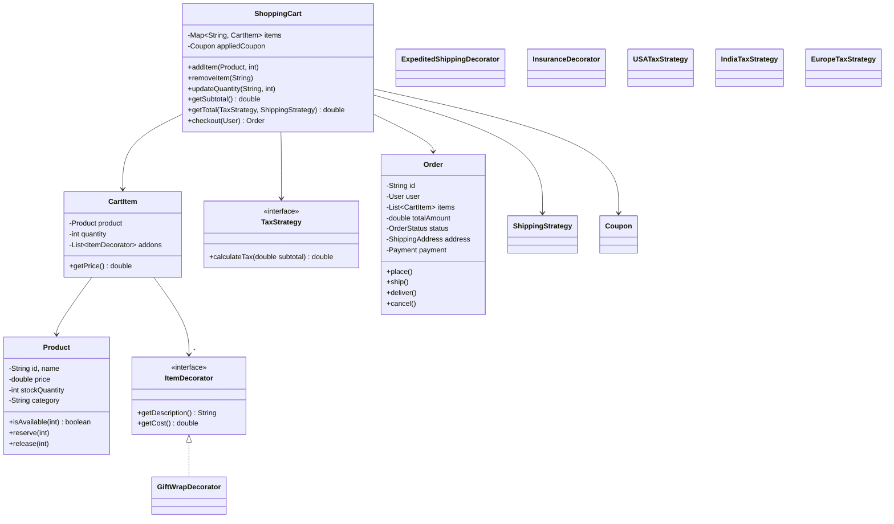

# 🛒 E-Commerce Shopping Cart — Complete LLD Guide

---

## Requirements
1. **Products** — Catalog with categories, inventory, pricing
2. **Shopping Cart** — Add/remove/update items, apply coupons
3. **Pricing** — Base price, discounts, taxes, shipping
4. **Checkout** — Address, payment, order placement
5. **Inventory** — Real-time stock management, reserve on add to cart
6. **Orders** — Track orders from placed to delivered

## Design Patterns
- **Strategy Pattern** — Tax calculation, shipping cost, payment methods
- **Decorator Pattern** — Add features (gift wrap, insurance) to cart items
- **Observer Pattern** — Notify on order status changes
- **Factory Pattern** — Create orders, payments

## 🏗️ Class Diagram



## 💻 Core Implementation

**`ShoppingCart.java`**
```java
public class ShoppingCart {
    private final Map<String, CartItem> items = new LinkedHashMap<>();
    private Coupon appliedCoupon;
    private final List<CartObserver> observers = new CopyOnWriteArrayList<>();

    /**
     * Add product to cart. Reserves inventory.
     */
    public void addItem(Product product, int quantity) {
        if (!product.isAvailable(quantity)) {
            throw new CartException("Insufficient stock for " + product.getName());
        }
        
        CartItem existing = items.get(product.getId());
        if (existing != null) {
            existing.setQuantity(existing.getQuantity() + quantity);
        } else {
            items.put(product.getId(), new CartItem(product, quantity));
        }
        
        product.reserve(quantity);
        notifyObservers(CartEvent.ITEM_ADDED, product);
    }

    /**
     * Calculate total with tax and shipping.
     * Strategy Pattern: tax and shipping strategies are injected.
     */
    public double getTotal(TaxStrategy taxStrategy, ShippingStrategy shippingStrategy) {
        double subtotal = getSubtotal();
        double discount = appliedCoupon != null ? appliedCoupon.apply(subtotal) : 0;
        double afterDiscount = subtotal - discount;
        double tax = taxStrategy.calculateTax(afterDiscount);
        double shipping = shippingStrategy.calculateShipping(items.size());
        
        return afterDiscount + tax + shipping;
    }

    private double getSubtotal() {
        return items.values().stream()
            .mapToDouble(CartItem::getPrice)
            .sum();
    }

    /**
     * Checkout - convert cart to order.
     */
    public Order checkout(User user, PaymentMethod payment, 
                         TaxStrategy tax, ShippingStrategy shipping) {
        if (items.isEmpty()) {
            throw new CartException("Cart is empty");
        }

        double total = getTotal(tax, shipping);
        
        Order order = new Order(user, new ArrayList<>(items.values()), 
            total, payment, user.getDefaultAddress());
        
        // Clear cart
        items.clear();
        
        notifyObservers(CartEvent.CHECKOUT, order);
        return order;
    }

    public void applyCoupon(Coupon coupon) { this.appliedCoupon = coupon; }
    public void addObserver(CartObserver o) { observers.add(o); }
}

public class CartItem {
    private final Product product;
    private int quantity;
    private final List<ItemDecorator> addons = new ArrayList<>();

    public CartItem(Product product, int quantity) {
        this.product = product;
        this.quantity = quantity;
    }

    /**
     * Decorator Pattern: get price including optional addons.
     */
    public double getPrice() {
        double base = product.getPrice() * quantity;
        for (ItemDecorator addon : addons) {
            base += addon.getCost() * quantity;
        }
        return base;
    }
}
```

**`ItemDecorator.java`** (Decorator Pattern)
```java
public interface ItemDecorator {
    String getDescription();
    double getCost();
}

class GiftWrapDecorator implements ItemDecorator {
    @Override
    public String getDescription() { return "Gift Wrap"; }
    @Override
    public double getCost() { return 5.0; }
}

class InsuranceDecorator implements ItemDecorator {
    @Override
    public String getDescription() { return "Shipping Insurance"; }
    @Override
    public double getCost() { return 2.99; }
}
```

## Interview Follow-ups
| Question | Answer |
|----------|--------|
| **Q1: How to handle cart persistence?** | Save cart to DB/Redis with TTL. Restore on user login. |
| **Q2: Inventory reservation timeout?** | Reserve for 15 min. Auto-release if not checked out. |
| **Q3: Parallel checkout race condition?** | `synchronized` checkout. Optimistic locking on inventory. |
| **Q4: Handle coupon overlap?** | Coupon strategy: best discount wins, or stackable. Use Composite pattern. |