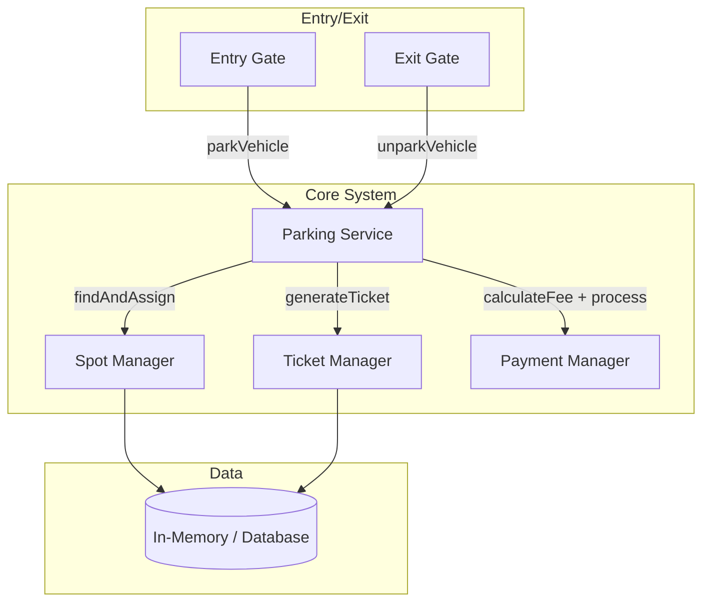

# 🅿️ Problem 1: Parking Lot System

> **Difficulty**: ⭐⭐ | **Company Fit**: Amazon, Google, Uber, Microsoft, Nielsen  
> **Est. Time**: 90 min | **Patterns**: Strategy, Singleton, Factory, Decorator

---

## 🧠 The Intuition Journey

### Step 1: What is this problem really asking?

At its core: "Design a system where vehicles enter, get assigned spots, pay, and leave."

**But the interviewer is really testing**:

```
1. Can you model real-world entities? (Vehicle, Spot, Ticket)
2. Can you handle the CRITICAL race condition? (Two cars → same spot)
3. Can you design for change? (Pricing changes EVERY WEEK)
4. Can you think about failures? (Payment fails, lost ticket, sensor breaks)
```

### Step 2: The "Aha!" Moment

The hardest part is NOT the classes. It's the **race condition**.

> Imagine two entry gates. Two cars arrive at the exact same microsecond.  
> Both gates check: "Is spot A3 free?" → BOTH see YES.  
> Both assign the car to A3.  
> Now you have two cars in ONE spot. Chaos.

**This is the core problem to solve.** Everything else is secondary.

### Step 3: How to prevent the race condition?

You need to make the "check-if-free-then-assign" operation **atomic** (indivisible).

```
❌ BAD: Separate check and act
   if (spot.isFree()) {     ← Thread A checks → YES
                            ← Thread B checks → YES (SAME SPOT!)
       spot.assign(car);    ← Both assign → BUG!
   }

✅ GOOD: Combined atomic operation
   synchronized spot.assign(car) {
       // Check AND act happen inside ONE lock
       // No other thread can enter until this finishes
   }
```

---

## 📋 Requirements (What to Ask the Interviewer)

### Questions You MUST Ask Before Coding

```
┌──────────────────────────────┬──────────────────────────────────────┐
│ Question                     │ Why It Matters                      │
├──────────────────────────────┼──────────────────────────────────────┤
│ "Single floor or multi?"     │ Single = simple list, Multi = floors │
│ "Vehicle types?"             │ Car/Bike/Truck → different spot sizes│
│ "Pricing model?"             │ Hourly/flat/dynamic → Strategy choice│
│ "Concurrent entry possible?" │ Thread safety needed                 │
│ "Payment integration?"       │ External gateway vs simple           │
│ "Reservation system?"        │ FCFS vs advance booking              │
│ "VIP/reserved spots?"        │ Priority allocation strategy         │
│ "What happens when full?"    │ Error handling strategy              │
│ "EV charging support?"       │ Future extensibility                 │
└──────────────────────────────┴──────────────────────────────────────┘
```

### Sample Interviewer Answers

> "Multi-floor. Cars, bikes, trucks. Hourly pricing. Yes, concurrent. No payment. FCFS. No VIP."

---

## 🏗️ HLD — High Level Design



### Why This Architecture?

```
Parking Service → Orchestrates the entry/exit flow
  → Doesn't care HOW spots are managed
  → Doesn't care HOW pricing works
  → Just coordinates the steps

Spot Manager → Handles spot allocation
  → Could use different strategies (nearest, random, spread)
  → Could be in-memory (fast) or database (persistent) 

Ticket Manager → Creates and tracks parking sessions
  → Simple CRUD for tickets

Payment Manager → Handles fee calculation
  → Delegates to PricingStrategy
```

---

## 💻 Implementation: Complete Code with Intuition

### Package Structure (Why This Layout?)

```
com.parkinglot/
├── model/              ← Entities (real-world things)
│   ├── Vehicle.java    ← Abstract base for all vehicles
│   ├── Car.java        ← Concrete vehicle types (TINY classes)
│   ├── Bike.java
│   ├── Truck.java
│   ├── VehicleType.java ← Enum with metadata
│   ├── ParkingSpot.java ← THE critical section
│   ├── ParkingFloor.java← Manages spots on one floor
│   ├── Ticket.java     ← Tracks a parking session
│   └── Payment.java    ← Payment record
│
├── strategy/           ← Algorithms (policies that change)
│   ├── PricingStrategy.java    ← Interface
│   ├── HourlyPricing.java     ← $X per hour
│   ├── WeekendDecorator.java  ← 1.5x on weekends
│   └── ParkingStrategy.java   ← Spot selection algorithm
│
├── service/            ← Business logic (orchestrates entities)
│   ├── ParkingService.java   ← Entry/Exit flow
│   └── PaymentService.java   ← Payment processing
│
├── exception/
│   └── ParkingException.java ← Meaningful errors
│
└── Main.java           ← Demo / Test

WHY this package structure?
- model: Entities change rarely. Once designed, they're stable.
- strategy: Algorithms change frequently. Isolated for easy updates.
- service: Flow logic. Changes when requirements change.
```

---

### 1. VehicleType.java — The Foundation

```java
package com.parkinglot.model;

/**
 * INTUITION: Why an enum?
 * 
 * I need a fixed, well-known set of vehicle types.
 * An enum gives me:
 *   1. Type safety: compiler catches "CAR" vs "car" vs "Car" mistakes
 *   2. Metadata: each type can carry extra info (like spot size needed)
 *   3. Switch-friendly: can use in switch statements
 * 
 * WHY NOT String constants?
 *   - No type safety: "CAR" and "car" are DIFFERENT strings but same type
 *   - No metadata: need a separate Map<String, Integer> for sizes
 *   - Scattered validation: every method must validate the string
 * 
 * WHY NOT a class hierarchy?
 *   - Overkill for just identifying a type
 *   - VehicleType is a CATEGORY, not a behavior
 *   - Use hierarchy for BEHAVIOR differences (how a car parks vs truck)
 */
public enum VehicleType {
    
    // Each enum constant carries the number of spot units it needs
    // A car needs 2 units, a bike needs 1, a truck needs 4
    CAR(2),
    BIKE(1),
    TRUCK(4);
    
    // WHY private final? Once set, spot size never changes for a type
    private final int spotsNeeded;
    
    /**
     * Constructor is called once per enum constant at class loading time.
     * This is safe and thread-safe by JVM design.
     */
    VehicleType(int spotsNeeded) {
        this.spotsNeeded = spotsNeeded;
    }
    
    /**
     * Returns how many "spot units" this vehicle type occupies.
     * Used to determine if a spot is big enough for this vehicle.
     * 
     * For example: A COMPACT spot might have capacity=2, so it fits
     * a car (needs 2) but not a truck (needs 4).
     */
    public int getSpotsNeeded() {
        return spotsNeeded;
    }
}
```

---

### 2. Vehicle.java — Abstract Base Class

```java
package com.parkinglot.model;

import java.util.Objects;
import java.util.UUID;

/**
 * INTUITION: Abstract class vs Interface — How to decide?
 * 
 * Ask yourself: "Is X a Y?" or "Can X do Y?"
 * 
 * "A Car IS a Vehicle"       → YES → Inheritance (abstract class)
 * "A Car CAN be Comparable"  → Maybe → Interface
 * 
 * Here, every vehicle SHARES:
 *   - A license plate (state)
 *   - A unique ID (state)
 *   - A type (state)
 * 
 * And every vehicle DOES:
 *   - Has an ID (behavior)
 *   - Has a license plate (behavior)
 * 
 * Shared STATE + BEHAVIOR = Abstract class
 * Only shared BEHAVIOR contract = Interface
 * 
 * TEMPLATE METHOD PATTERN:
 * The base class (Vehicle) defines the skeleton:
 *   - Constructor with validation
 *   - Common fields (id, licensePlate, type)
 *   - equals/hashCode/toString
 * 
 * Subclasses just fill in WHAT makes them unique (their type).
 * This means subclasses are TINY — just 1 line!
 */
public abstract class Vehicle {
    
    // WHY final? Once created, a vehicle's identity doesn't change.
    // WHY String for ID? UUID.toString() is simple and unique.
    private final String id;
    
    // WHY final? License plate is a vehicle's identity.
    // WHY uppercase? Standardizes format for comparison.
    private final String licensePlate;
    
    // WHY final? A car can't become a truck.
    private final VehicleType type;

    /**
     * Protected constructor — only subclasses can call this.
     * This enforces that Vehicle can NEVER be instantiated directly.
     * You must create a Car, Bike, or Truck.
     * 
     * @param licensePlate The vehicle's registration number
     * @param type The type of vehicle (CAR, BIKE, TRUCK)
     * @throws IllegalArgumentException if license plate is invalid
     */
    protected Vehicle(String licensePlate, VehicleType type) {
        
        // INTUITION: FAIL FAST principle
        // Validate at construction time, NOT when someone tries to park.
        // This way, invalid vehicles are caught IMMEDIATELY.
        if (licensePlate == null || licensePlate.trim().isEmpty()) {
            throw new IllegalArgumentException(
                "License plate cannot be null or empty"
            );
        }
        
        // UUID.randomUUID() generates a universally unique identifier.
        // WHY UUID? Even if two parking lots generate IDs, they won't collide.
        // WHY not auto-increment? Only works within one database.
        this.id = UUID.randomUUID().toString();
        
        // Trim and uppercase for consistent comparison later.
        // "MH-01-ab-1234" and "mh-01-AB-1234" should be treated as same.
        this.licensePlate = licensePlate.trim().toUpperCase();
        
        // Store the type for later use in pricing and spot allocation.
        this.type = type;
    }

    // --- Getters ---
    // WHY no setters? Vehicle is IMMUTABLE after creation.
    // Immutable objects are:
    //   1. Thread-safe (no race conditions on reads)
    //   2. Predictable (state never changes unexpectedly)
    //   3. Cache-friendly (can be safely reused)
    
    public String getId() { return id; }
    
    public String getLicensePlate() { return licensePlate; }
    
    public VehicleType getType() { return type; }

    /**
     * Two vehicles are equal if they have the SAME license plate.
     * WHY? License plate is the real-world identifier.
     * WHY NOT use the UUID? UUID is internal — two systems might 
     * have different UUIDs for the same physical car.
     * 
     * IMPORTANT: equals MUST be consistent with hashCode.
     * If two vehicles are equal (same plate), they MUST have same hashCode.
     */
    @Override
    public boolean equals(Object o) {
        // Same object reference → definitely equal
        if (this == o) return true;
        
        // Wrong type → definitely not equal
        if (o == null || getClass() != o.getClass()) return false;
        
        // Cast and compare the license plate
        Vehicle vehicle = (Vehicle) o;
        return Objects.equals(licensePlate, vehicle.licensePlate);
    }

    /**
     * Hash code must use the SAME fields as equals().
     * If equals uses licensePlate, hashCode must use licensePlate.
     * Violating this breaks HashMap/HashSet behavior!
     */
    @Override
    public int hashCode() {
        return Objects.hash(licensePlate);
    }

    @Override
    public String toString() {
        // Example output: "CAR [MH-01-AB-1234]"
        return type + " [" + licensePlate + "]";
    }
}
```

---

### 3. Car.java — Template Method Pattern in Action

```java
package com.parkinglot.model;

/**
 * INTUITION: This is the Template Method pattern.
 * 
 * The base class (Vehicle) provides:
 *   - Constructor validation
 *   - ID generation
 *   - equals/hashCode/toString
 *   - All getters
 * 
 * The subclass (Car) provides ONLY its type.
 * 
 * WHY is this good?
 *   - Adding a new vehicle type is ONE line of code
 *   - You CANNOT forget to specify the type (compiler enforces it)
 *   - All vehicles share the same foundation
 * 
 * If you're writing MORE than a constructor call in a subclass,
 * you're probably doing something wrong.
 */
public class Car extends Vehicle {
    
    /**
     * The ONLY thing that makes a Car different from a Bike or Truck
     * is its VehicleType. Everything else is inherited.
     * 
     * @param licensePlate The car's registration number
     */
    public Car(String licensePlate) {
        // super() calls the Vehicle constructor with type = CAR
        // Vehicle handles validation, UUID generation, etc.
        super(licensePlate, VehicleType.CAR);
    }
}
```

---

### 4. Bike.java — Another Tiny Subclass

```java
package com.parkinglot.model;

/**
 * Same pattern as Car — just specify BIKE as the type.
 * 
 * If you understand Car, you understand Bike and Truck.
 * They're all the same pattern with different types.
 * 
 * This CONSISTENCY is what senior engineers value.
 */
public class Bike extends Vehicle {
    
    public Bike(String licensePlate) {
        // The only difference from Car is VehicleType.BIKE
        super(licensePlate, VehicleType.BIKE);
    }
}
```

---

### 5. Truck.java

```java
package com.parkinglot.model;

public class Truck extends Vehicle {
    
    public Truck(String licensePlate) {
        // Trucks need more space, so VehicleType.TRUCK has spotsNeeded=4
        super(licensePlate, VehicleType.TRUCK);
    }
}
```

---

### 6. ParkingSpot.java — THE Most Critical Class

```java
package com.parkinglot.model;

import java.util.UUID;

/**
 * INTUITION: This is where the HARDEST problem lives.
 * 
 * The core business rule: 
 *   "No two vehicles can occupy the same spot at the same time."
 * 
 * Breaking this rule means:
 *   - Two cars assigned to one spot → chaos in the parking lot
 *   - Lost revenue (one car parks for free)
 *   - Angry customers
 * 
 * This class MUST be thread-safe because:
 *   - Multiple entry gates operate simultaneously
 *   - Two gates could try to assign the same spot at the same time
 * 
 * The Race Condition:
 *   Thread A (Gate 1): "Is spot A3 occupied?" → Reads false
 *   Thread B (Gate 2): "Is spot A3 occupied?" → Reads false (SAME TIME!)
 *   Thread A: "Great, I'll assign my car to A3"
 *   Thread B: "Great, I'll assign my car to A3" 
 *   RESULT: Two cars in ONE spot. Data corrupted.
 * 
 * The Solution (synchronized):
 *   synchronized makes the entire method run as ONE UNIT.
 *   Thread A enters assign() → locks the method
 *   Thread B tries to enter assign() → WAITS (blocked)
 *   Thread A finishes → unlocks
 *   Thread B enters → sees isOccupied = true → returns false
 *   Race condition prevented!
 * 
 * ANALOGY: It's like a bathroom with a lock.
 *   Person A enters → locks door → uses bathroom → unlocks
 *   Person B waits outside until Person A is done
 *   Person B enters → sees occupied → leaves
 */
public class ParkingSpot {
    
    // A unique identifier for this spot (internal use)
    private final String id;
    
    // Human-readable spot number, e.g., "A3", "B12", "101"
    // This is what appears on the ticket and signs
    private final String spotNumber;
    
    // What type of spot this is (COMPACT, LARGE, BIKE)
    private final ParkingSpotType type;
    
    // volatile = this value is NEVER cached per-thread
    // Every thread sees the LATEST value
    // WHY volatile? Without it, Thread A could set isOccupied=true,
    // but Thread B might still see isOccupied=false (cached value)
    private volatile boolean isOccupied;
    
    // The vehicle currently parked here (null if empty)
    private Vehicle currentVehicle;

    /**
     * Create a new parking spot.
     * 
     * @param spotNumber Human-readable identifier like "A1"
     * @param type The type/size of this spot
     */
    public ParkingSpot(String spotNumber, ParkingSpotType type) {
        // Generate a unique internal ID
        this.id = UUID.randomUUID().toString();
        this.spotNumber = spotNumber;
        this.type = type;
        
        // A new spot starts empty
        this.isOccupied = false;
        this.currentVehicle = null;
    }

    /**
     * THE MOST IMPORTANT METHOD IN THE SYSTEM.
     * 
     * Assign a vehicle to this spot.
     * synchronized = only ONE thread can execute this at a time.
     * 
     * @param vehicle The vehicle to park
     * @return true if assigned successfully, false if spot was occupied
     */
    public synchronized boolean assign(Vehicle vehicle) {
        
        // Guard Clause 1: If spot is already occupied, reject immediately
        if (isOccupied) {
            return false;  // Fail fast — don't waste time
        }
        
        // Guard Clause 2: If this spot type can't fit the vehicle, reject
        // For example, a BIKE spot can't fit a TRUCK
        if (!type.canPark(vehicle)) {
            return false;
        }
        
        // At this point, we know:
        //   1. The spot is empty
        //   2. The vehicle fits in this spot
        // 
        // Now we ACTUALLY assign:
        // Because this is synchronized, NO OTHER THREAD can be here.
        // The "check" and "act" are ONE indivisible operation.
        this.currentVehicle = vehicle;
        this.isOccupied = true;
        
        return true;
    }

    /**
     * Remove vehicle from this spot.
     * Also synchronized — two exit gates shouldn't process the same spot.
     * 
     * @return The vehicle that was parked, or null if spot was empty
     */
    public synchronized Vehicle vacate() {
        
        // If the spot is already empty, nothing to do
        if (!isOccupied) {
            return null;
        }
        
        // Get the vehicle before clearing it
        Vehicle vehicle = this.currentVehicle;
        
        // Clear the spot
        this.currentVehicle = null;
        this.isOccupied = false;
        
        return vehicle;
    }

    // --- Getters ---
    // getCurrentVehicle is synchronized because it reads shared state
    // Without synchronization, we might read stale data
    
    public String getId() { return id; }
    
    public String getSpotNumber() { return spotNumber; }
    
    public ParkingSpotType getType() { return type; }
    
    public boolean isOccupied() { return isOccupied; }
    
    public synchronized Vehicle getCurrentVehicle() { return currentVehicle; }

    @Override
    public String toString() {
        // Example: "Spot[A3] COMPACT [Available]"
        // Example: "Spot[A3] COMPACT [Occupied by CAR [MH-01-AB-1234]]"
        String status = isOccupied ? "Occupied by " + currentVehicle : "Available";
        return "Spot[" + spotNumber + "] " + type + " [" + status + "]";
    }
}
```

---

### 7. ParkingSpotType.java — Spot Categories

```java
package com.parkinglot.model;

/**
 * INTUITION: Different spots fit different vehicles.
 * 
 * A motorcycle spot is tiny. A truck spot is huge.
 * We need to map: Which vehicles can park in which spots?
 * 
 * This enum defines the spot types and their compatible vehicles.
 * 
 * HOW IT WORKS:
 * Each ParkingSpotType stores which Vehicle classes can park there.
 * When a vehicle arrives, we check: "is this vehicle's class in the 
 * compatible list for this spot type?"
 * 
 * WHY store Class<?> instead of VehicleType enum?
 *   - More flexible: can add new vehicle types without modifying enums
 *   - Future-proof: spot compatibility based on actual class, not enum value
 */
public enum ParkingSpotType {
    
    // COMPACT spots can fit Car and ElectricCar
    COMPACT(Car.class, ElectricCar.class),
    
    // LARGE spots can fit Truck, Car, and Bus
    LARGE(Truck.class, Car.class, Bus.class),
    
    // BIKE spots only fit Bike (and maybe ElectricBike in future)
    BIKE(Bike.class),
    
    // ELECTRIC spots fit any electric vehicle + regular bikes
    ELECTRIC(ElectricCar.class, ElectricBike.class, Bike.class);
    
    // The list of vehicle classes compatible with this spot type
    private final Class<?>[] compatibleVehicles;
    
    /**
     * Constructor stores which vehicle classes this spot accepts.
     * 
     * @param compatibleVehicles Vehicle classes that can park here
     */
    ParkingSpotType(Class<?>... compatibleVehicles) {
        this.compatibleVehicles = compatibleVehicles;
    }
    
    /**
     * Check if a given vehicle can park in this type of spot.
     * 
     * @param vehicle The vehicle that wants to park
     * @return true if this spot type is compatible with the vehicle
     */
    public boolean canPark(Vehicle vehicle) {
        // Loop through all compatible vehicle classes
        for (Class<?> vehicleClass : compatibleVehicles) {
            // instanceof check: is this vehicle an instance of that class?
            // For example, if vehicle is a Car, and compatibleVehicles contains
            // Car.class, then Car.class.isInstance(car) returns true
            if (vehicleClass.isInstance(vehicle)) {
                return true;
            }
        }
        // No compatible class found → vehicle can't park here
        return false;
    }
}
```

---

### 8. ParkingFloor.java — Organizing Spots

```java
package com.parkinglot.model;

import java.util.*;
import java.util.concurrent.ConcurrentHashMap;
import java.util.stream.Collectors;

/**
 * INTUITION: A floor is a container for parking spots.
 * 
 * Real-world: A parking garage has multiple floors (B1, B2, B3...).
 * Each floor has multiple spots (A1-A20, B1-B20...).
 * 
 * This class:
 *   - Groups spots that are on the same physical floor
 *   - Provides methods to query availability per floor
 *   - Uses ConcurrentHashMap for thread-safe spot management
 * 
 * WHY not just put all spots in one big list?
 *   - Organization: floors have different capacities
 *   - Navigation: "Your car is on Floor 3" is useful for drivers
 *   - Optimization: could prioritize certain floors for certain vehicles
 */
public class ParkingFloor {
    
    // Floor number (1, 2, 3... or -1, -2 for basements)
    private final int floorNumber;
    
    // Thread-safe map: spotId → ParkingSpot
    // WHY ConcurrentHashMap? Multiple gates could query spots simultaneously
    // ConcurrentHashMap allows concurrent reads without blocking
    private final Map<String, ParkingSpot> spots;
    
    // Maximum capacity of this floor
    private final int capacity;

    /**
     * Create a new floor with a given capacity.
     * 
     * @param floorNumber Floor identifier (1, 2, 3...)
     * @param capacity Maximum number of spots on this floor
     */
    public ParkingFloor(int floorNumber, int capacity) {
        this.floorNumber = floorNumber;
        this.capacity = capacity;
        // Initialize with capacity for optimal performance
        this.spots = new ConcurrentHashMap<>(capacity);
    }

    /**
     * Add a parking spot to this floor.
     * 
     * @param spot The spot to add
     */
    public void addSpot(ParkingSpot spot) {
        spots.put(spot.getId(), spot);
    }

    /**
     * Get all spots on this floor that are:
     *   1. Available (not occupied)
     *   2. Compatible with the given vehicle
     * 
     * @param vehicle The vehicle looking for a spot
     * @return List of compatible available spots
     */
    public List<ParkingSpot> getAvailableSpots(Vehicle vehicle) {
        // Stream pipeline: filter → filter → collect
        return spots.values().stream()
            // First filter: only spots that are not occupied
            .filter(spot -> !spot.isOccupied())
            // Second filter: only spots that fit this vehicle
            .filter(spot -> spot.getType().canPark(vehicle))
            // Collect results into a list
            .collect(Collectors.toList());
    }

    /**
     * Get ALL available spots (regardless of vehicle type).
     * Used for general availability reporting.
     */
    public List<ParkingSpot> getAllAvailableSpots() {
        return spots.values().stream()
            .filter(spot -> !spot.isOccupied())
            .collect(Collectors.toList());
    }

    /**
     * Count how many spots are available on this floor.
     * 
     * @return Number of available spots
     */
    public int getAvailableCount() {
        // Count spots where isOccupied() returns false
        return (int) spots.values().stream()
            .filter(spot -> !spot.isOccupied())
            .count();
    }

    // --- Getters ---
    
    public int getFloorNumber() { return floorNumber; }
    
    public int getCapacity() { return capacity; }
    
    /**
     * Returns ALL spots (both occupied and available).
     * Returns a COPY to prevent external modification.
     */
    public Collection<ParkingSpot> getSpots() { 
        return new ArrayList<>(spots.values()); 
    }
}
```

---

### 9. Ticket.java — Tracking a Parking Session

```java
package com.parkinglot.model;

import com.parkinglot.strategy.PricingStrategy;

import java.time.Duration;
import java.time.LocalDateTime;
import java.util.UUID;

/**
 * INTUITION: A ticket records a parking session.
 * 
 * When a vehicle enters:
 *   - We create a ticket with entry time, vehicle, and spot
 *   - The ticket is ACTIVE
 * 
 * When a vehicle exits:
 *   - We calculate the fee using a PricingStrategy
 *   - The ticket is COMPLETED
 * 
 * WHY delegate fee calculation to PricingStrategy?
 *   - Pricing changes FREQUENTLY (monthly, seasonally)
 *   - If pricing is embedded in Ticket, EVERY change modifies Ticket
 *   - With Strategy Pattern, new pricing = new class, Ticket unchanged
 *   
 * This is the OPEN/CLOSED Principle:
 *   OPEN for extension (add new PricingStrategy classes)
 *   CLOSED for modification (Ticket never changes)
 */
public class Ticket {
    
    // Unique ticket identifier
    private final String id;
    
    // The vehicle that parked
    private final Vehicle vehicle;
    
    // The spot where the vehicle parked
    private final ParkingSpot spot;
    
    // When the vehicle entered (set once at creation)
    private final LocalDateTime entryTime;
    
    // When the vehicle exits (set when calculating fee)
    private LocalDateTime exitTime;
    
    // The fee amount (0 until calculated)
    private double amount;
    
    // Current status of this ticket
    private TicketStatus status;

    /**
     * Possible states for a ticket.
     * 
     * ACTIVE → The vehicle is still parked
     * COMPLETED → The vehicle has paid and left
     * LOST → The ticket was lost (different fee structure)
     */
    public enum TicketStatus {
        ACTIVE,
        COMPLETED,
        LOST
    }

    /**
     * Create a new ticket when a vehicle parks.
     * 
     * @param vehicle The vehicle that parked
     * @param spot The spot where it parked
     */
    public Ticket(Vehicle vehicle, ParkingSpot spot) {
        // Generate a unique ticket ID
        this.id = UUID.randomUUID().toString();
        
        this.vehicle = vehicle;
        this.spot = spot;
        
        // Record the entry time IMMEDIATELY
        // This is used to calculate the parking duration
        this.entryTime = LocalDateTime.now();
        
        // A new ticket is always ACTIVE
        this.status = TicketStatus.ACTIVE;
        
        // Amount starts at 0 (calculated on exit)
        this.amount = 0.0;
    }

    /**
     * Calculate the parking fee using the provided strategy.
     * 
     * This is the Strategy Pattern:
     *   - The Ticket doesn't know HOW pricing works
     *   - It just asks the strategy to calculate
     *   - Different strategies can be used at different times
     * 
     * @param strategy The pricing strategy to use
     * @return The calculated fee amount
     * @throws IllegalStateException if ticket is not active
     */
    public double calculateFee(PricingStrategy strategy) {
        
        // Can only calculate fee for ACTIVE tickets
        if (status != TicketStatus.ACTIVE) {
            throw new IllegalStateException(
                "Cannot calculate fee for " + status + " ticket"
            );
        }
        
        // Record the exit time (NOW)
        this.exitTime = LocalDateTime.now();
        
        // Calculate duration in minutes
        long durationMinutes = Duration.between(entryTime, exitTime).toMinutes();
        
        // Delegate to the strategy for actual calculation
        this.amount = strategy.calculatePrice(durationMinutes, vehicle.getType());
        
        return this.amount;
    }

    /**
     * Mark this ticket as completed (vehicle has paid and left).
     */
    public void complete() {
        this.status = TicketStatus.COMPLETED;
    }

    // --- Getters ---
    
    public String getId() { return id; }
    
    public Vehicle getVehicle() { return vehicle; }
    
    public ParkingSpot getSpot() { return spot; }
    
    public LocalDateTime getEntryTime() { return entryTime; }
    
    public LocalDateTime getExitTime() { return exitTime; }
    
    public double getAmount() { return amount; }
    
    public TicketStatus getStatus() { return status; }

    @Override
    public String toString() {
        // Example: "Ticket[abc12345] CAR [MH-01-AB-1234] at A3 - Entry: 10:30, Amount: $15.00"
        return String.format(
            "Ticket[%s] %s at %s - Entry: %s, Amount: $%.2f",
            id.substring(0, 8),     // First 8 chars of UUID for readability
            vehicle,
            spot.getSpotNumber(),
            entryTime.toLocalTime(), // Only show time, not date
            amount
        );
    }
}
```

---

### 10. PricingStrategy.java — The Strategy Pattern Interface

```java
package com.parkinglot.strategy;

import com.parkinglot.model.VehicleType;

/**
 * INTUITION: WHY a separate interface for pricing?
 * 
 * In the real world, parking pricing changes ALL THE TIME:
 *   - Month 1: "Charge $10/hour for all vehicles"
 *   - Month 2: "Bikes should be $5, trucks $20"
 *   - Month 3: "Weekend surcharge — 1.5x on Sat/Sun"
 *   - Month 4: "Holiday special — flat $5 all day"
 *   - Month 5: "Monthly members get 50% off"
 * 
 * If pricing logic is inside Ticket.calculateFee():
 *   ❌ Every change modifies Ticket class → risk of breaking other code
 *   ❌ Can't add new pricing without modifying existing code
 *   ❌ Testing is harder (test Ticket + all pricing variants)
 * 
 * With Strategy Pattern:
 *   ✅ Month 1: HourlyPricingStrategy (new class)
 *   ✅ Month 2: Different rates (modify ONE constant map)
 *   ✅ Month 3: WeekendDecorator WRAPS existing strategy (new class)
 *   ✅ Month 4: HolidayDecorator WRAPS existing strategy (new class)
 *   ✅ Month 5: MemberDiscountDecorator WRAPS existing strategy
 *   
 *   ✅ Existing code NEVER changes. New behavior is ADDED.
 *   ✅ Each strategy is testable in isolation.
 * 
 * This is @FunctionalInterface because it has exactly ONE abstract method.
 * This means it can be used with lambdas! (e.g., PricingStrategy custom = (d, v) -> 5.0;)
 */
@FunctionalInterface
public interface PricingStrategy {
    
    /**
     * Calculate the price for a parking session.
     * 
     * @param durationMinutes How long the vehicle was parked (in minutes)
     * @param vehicleType What type of vehicle (affects rate)
     * @return The calculated price in dollars
     */
    double calculatePrice(long durationMinutes, VehicleType vehicleType);
}
```

---

### 11. HourlyPricingStrategy.java — The Base Implementation

```java
package com.parkinglot.strategy;

import com.parkinglot.model.VehicleType;
import java.util.Map;

/**
 * INTUITION: The simplest pricing strategy.
 * 
 * Charge by the hour:
 *   - Car: $10/hour
 *   - Bike: $5/hour
 *   - Truck: $20/hour
 *   - First 30 minutes: FREE
 * 
 * WHY a Map for rates instead of if-else?
 *   - Adding a new vehicle type = adding one entry to the map
 *   - No need to add another if-else branch
 *   - Rates can be externalized to configuration
 * 
 * WHat about rounding?
 *   - If someone parks for 1.5 hours, they pay for 2 hours
 *   - Ceiling division: (minutes + 59) / 60
 *   - This is standard parking lot practice
 */
public class HourlyPricingStrategy implements PricingStrategy {
    
    /**
     * Map of vehicle type to hourly rate.
     * Immutable (Map.of) — once created, rates don't change.
     * If rates need to change, create a new strategy.
     */
    private static final Map<VehicleType, Double> HOURLY_RATES = Map.of(
        VehicleType.CAR, 10.0,    // $10 per hour for cars
        VehicleType.BIKE, 5.0,    // $5 per hour for bikes
        VehicleType.TRUCK, 20.0   // $20 per hour for trucks
    );
    
    // First 30 minutes are always free
    private static final long FREE_MINUTES = 30;

    /**
     * Calculate the price based on duration and vehicle type.
     * 
     * @param durationMinutes How long the vehicle was parked
     * @param vehicleType What type of vehicle
     * @return The price to charge
     */
    @Override
    public double calculatePrice(long durationMinutes, VehicleType vehicleType) {
        
        // Edge case: negative or zero duration → free
        if (durationMinutes <= 0) {
            return 0.0;
        }
        
        // First 30 minutes are always free
        if (durationMinutes <= FREE_MINUTES) {
            return 0.0;
        }
        
        // Get the hourly rate for this vehicle type
        // Default to $10 if type not found (safety net)
        double hourlyRate = HOURLY_RATES.getOrDefault(vehicleType, 10.0);
        
        // Ceiling division: round UP to nearest hour
        // (durationMinutes - FREE_MINUTES + 59) / 60
        // Example: 31 minutes → (31 - 30 + 59) / 60 = 60/60 = 1 hour
        // Example: 90 minutes → (90 - 30 + 59) / 60 = 119/60 = 1 hour + 59 min → 1? No, floor!
        // Wait: (90 - 30 + 59) / 60 = 119 / 60 = 1 (integer division)
        // But 90 minutes - 30 free = 60 billable minutes = 1 hour. Correct!
        // 
        // Example: 91 minutes → (91 - 30 + 59) / 60 = 120/60 = 2 hours. Correct!
        long billableHours = (durationMinutes - FREE_MINUTES + 59) / 60;
        
        return billableHours * hourlyRate;
    }
}
```

---

### 12. WeekendDecorator.java — Decorator Pattern

```java
package com.parkinglot.strategy;

import com.parkinglot.model.VehicleType;
import java.time.DayOfWeek;
import java.time.LocalDateTime;

/**
 * INTUITION: Decorator Pattern — Add weekend surcharge WITHOUT changing base pricing.
 * 
 * PROBLEM: "We want 50% surcharge on weekends."
 * 
 * BAD SOLUTION: Modify HourlyPricingStrategy to check day of week
 *   ❌ Changes behavior for ALL scenarios
 *   ❌ Need to retest: weekday, weekend, holiday, special events
 *   ❌ Risk: "I broke normal pricing while adding weekend logic"
 * 
 * GOOD SOLUTION: Wrap HourlyPricingStrategy with WeekendDecorator
 *   ✅ HourlyPricingStrategy doesn't know about weekends (pure logic)
 *   ✅ WeekendDecorator adds weekend logic COMPOSITION, not modification
 *   ✅ Both can be tested independently
 *   ✅ Can combine: new WeekendDecorator(new HolidayDecorator(new HourlyPricingStrategy()))
 * 
 * This is the DECORATOR PATTERN:
 *   - Implements the SAME interface as the wrapped object
 *   - Adds behavior BEFORE or AFTER delegating to the wrapped object
 *   - Can be stacked (Decorator of Decorator of...)
 * 
 * 
 * USAGE:
 *   PricingStrategy weekendRates = new WeekendDecorator(new HourlyPricingStrategy());
 *   double fee = weekendRates.calculatePrice(120, VehicleType.CAR);
 *   // If weekday: 2 hours × $10 = $20
 *   // If weekend: 2 hours × $10 × 1.5 = $30
 */
public class WeekendDecorator implements PricingStrategy {
    
    // The base strategy we're decorating
    private final PricingStrategy wrappedStrategy;
    
    // 50% surcharge on weekends
    private static final double WEEKEND_MULTIPLIER = 1.5;

    /**
     * Create a weekend-decorated pricing strategy.
     * 
     * @param wrappedStrategy The base strategy to decorate
     */
    public WeekendDecorator(PricingStrategy wrappedStrategy) {
        // Store the strategy we're wrapping
        this.wrappedStrategy = wrappedStrategy;
    }

    /**
     * Calculate price with weekend surcharge.
     * 
     * First: delegate to the base strategy for the base price.
     * Then: if it's a weekend, apply the surcharge.
     * 
     * @param durationMinutes Parking duration
     * @param vehicleType Vehicle type
     * @return Price with weekend adjustment
     */
    @Override
    public double calculatePrice(long durationMinutes, VehicleType vehicleType) {
        
        // Step 1: Get the BASE price from the wrapped strategy
        double basePrice = wrappedStrategy.calculatePrice(durationMinutes, vehicleType);
        
        // Step 2: Check if today is a weekend
        LocalDateTime now = LocalDateTime.now();
        DayOfWeek today = now.getDayOfWeek();
        
        // Saturday or Sunday?
        boolean isWeekend = (today == DayOfWeek.SATURDAY || today == DayOfWeek.SUNDAY);
        
        // Step 3: Apply surcharge if weekend
        if (isWeekend) {
            return basePrice * WEEKEND_MULTIPLIER;
        }
        
        // Not a weekend → return base price unchanged
        return basePrice;
    }
}
```

---

### 13. ParkingStrategy.java — Spot Selection Algorithm

```java
package com.parkinglot.strategy;

import com.parkinglot.model.ParkingSpot;
import com.parkinglot.model.Vehicle;

import java.util.List;

/**
 * INTUITION: Different parking lots have different allocation preferences.
 * 
 * Some lots want:
 *   - "Nearest to entrance" (customer satisfaction)
 *   - "Spread across all floors" (load balancing)
 *   - "Fill floor 1 first, then floor 2" (elevator traffic reduction)
 *   - "VIP spots near entrance for premium customers"
 * 
 * This interface abstracts the spot SELECTION algorithm.
 * The selection is separate from the spot search.
 * 
 * 
 * @FunctionalInterface because it has one method.
 * Can be implemented as a lambda: 
 *   (spots, vehicle) -> spots.get(0)
 */
@FunctionalInterface
public interface ParkingStrategy {
    
    /**
     * Select a spot from the list of available spots.
     * 
     * @param availableSpots Spots that are free and compatible
     * @param vehicle The vehicle that needs a spot
     * @return The selected spot, or null if none available
     */
    ParkingSpot findSpot(List<ParkingSpot> availableSpots, Vehicle vehicle);
}
```

---

### 14. NearestFirstStrategy.java — Simple First Available

```java
package com.parkinglot.strategy;

import com.parkinglot.model.ParkingSpot;
import com.parkinglot.model.Vehicle;

import java.util.List;

/**
 * INTUITION: Pick the first available spot.
 * 
 * If spots are added to a floor in order (A1, A2, A3...),
 * the first spot in the list is closest to the entrance.
 * 
 * This is the simplest strategy — just return the first element.
 * For most parking lots, this is good enough.
 * 
 * Complexity: O(1) after the list is provided
 */
public class NearestFirstStrategy implements ParkingStrategy {
    
    @Override
    public ParkingSpot findSpot(List<ParkingSpot> availableSpots, Vehicle vehicle) {
        
        // Guard clause: no available spots
        if (availableSpots == null || availableSpots.isEmpty()) {
            return null;
        }
        
        // Simple: return the first available spot
        // This assumes spots are ordered by proximity to entrance
        return availableSpots.get(0);
    }
}
```

---

### 15. ParkingLot.java — Singleton + Central Manager

```java
package com.parkinglot.model;

import com.parkinglot.strategy.NearestFirstStrategy;
import com.parkinglot.strategy.ParkingStrategy;
import com.parkinglot.exception.ParkingException;

import java.util.*;
import java.util.concurrent.ConcurrentHashMap;

/**
 * INTUITION: Singleton Pattern — Why?
 * 
 * A physical parking lot is ONE entity.
 * Having multiple ParkingLot objects managing the SAME physical spots
 * would cause data inconsistency.
 * 
 * Singleton ensures:
 *   - Only ONE instance of the parking lot exists
 *   - All entry/exit gates use the SAME instance
 *   - Global access point for the lot
 * 
 * BUT: Singleton has drawbacks:
 *   - Hard to test (can't create new instances for each test)
 *   - Hidden dependencies (classes call ParkingLot.getInstance())
 *   - Global state (can cause weird bugs)
 * 
 * COMPROMISE: Use Singleton but provide a reset() for testing.
 * If we need multiple lots, refactor to a Factory pattern.
 * 
 * DOUBLE-CHECKED LOCKING:
 *   - First null check: without lock (fast — most calls skip the lock)
 *   - Synchronized block: only for the first initialization
 *   - Second null check: inside lock (prevents double initialization)
 *   - volatile: prevents partial object publication
 * 
 * Without volatile:
 *   Thread A: instance = new ParkingLot(); // JVM might reorder!
 *   Thread B: if (instance != null) { use it } // But it's partially constructed!
 *   volatile prevents this reordering.
 */
public class ParkingLot {
    
    // volatile = visible across threads, prevents reordering
    private static volatile ParkingLot instance;
    
    // Name of this parking lot
    private final String name;
    
    // All floors in this parking lot
    private final List<ParkingFloor> floors;
    
    // Current spot allocation strategy
    private ParkingStrategy strategy;
    
    // Track active tickets (ticketId → Ticket)
    private final Map<String, Ticket> activeTickets;

    /**
     * Private constructor — only called from getInstance().
     * No one outside this class can create a ParkingLot directly.
     */
    private ParkingLot(String name) {
        this.name = name;
        this.floors = new ArrayList<>();
        this.strategy = new NearestFirstStrategy(); // Default strategy
        this.activeTickets = new ConcurrentHashMap<>();
    }

    /**
     * Get the singleton instance.
     * Creates the instance if it doesn't exist yet.
     * 
     * @param name Name of the parking lot (only used on first call)
     * @return The singleton ParkingLot instance
     */
    public static ParkingLot getInstance(String name) {
        
        // First check (no lock) — fast path for when instance already exists
        ParkingLot result = instance;
        if (result == null) {
            
            // Lock only when instance might need to be created
            synchronized (ParkingLot.class) {
                
                // Second check (with lock) — prevent double creation
                result = instance;
                if (result == null) {
                    
                    // Create the singleton instance
                    instance = result = new ParkingLot(name);
                }
            }
        }
        return instance;
    }

    /**
     * Get the existing singleton instance (assuming it was already created).
     * Throws exception if not initialized.
     */
    public static ParkingLot getInstance() {
        if (instance == null) {
            throw new IllegalStateException(
                "ParkingLot not initialized. Call getInstance(name) first."
            );
        }
        return instance;
    }

    /**
     * Find an available spot for the given vehicle.
     * Searches all floors and applies the current strategy.
     * 
     * @param vehicle The vehicle needing a spot
     * @return An available spot, or null if none found
     */
    public ParkingSpot findAvailableSpot(Vehicle vehicle) {
        
        // Collect all available spots across all floors
        List<ParkingSpot> availableSpots = new ArrayList<>();
        
        for (ParkingFloor floor : floors) {
            // Get spots that are free AND fit this vehicle
            availableSpots.addAll(floor.getAvailableSpots(vehicle));
        }
        
        // If no spots available, return null
        if (availableSpots.isEmpty()) {
            return null;
        }
        
        // Apply the strategy to SELECT which spot to use
        return strategy.findSpot(availableSpots, vehicle);
    }

    /**
     * Get availability summary: how many spots are available per vehicle type.
     * 
     * @return Map of vehicle type to available spot count
     */
    public Map<VehicleType, Integer> getAvailability() {
        
        // Initialize all types to 0
        Map<VehicleType, Integer> availability = new HashMap<>();
        for (VehicleType type : VehicleType.values()) {
            availability.put(type, 0);
        }
        
        // Count available spots for each vehicle type
        for (ParkingFloor floor : floors) {
            for (ParkingSpot spot : floor.getAllAvailableSpots()) {
                
                // For each available spot, increment count for compatible vehicle types
                // This is a simplified version — in production, you'd query per type
                for (VehicleType vt : VehicleType.values()) {
                    availability.merge(vt, 1, Integer::sum);
                }
            }
        }
        
        return availability;
    }

    /**
     * Track an active ticket.
     */
    public void addTicket(Ticket ticket) {
        activeTickets.put(ticket.getId(), ticket);
    }

    /**
     * Get an active ticket by ID.
     */
    public Ticket getTicket(String ticketId) {
        return activeTickets.get(ticketId);
    }

    /**
     * Remove a completed ticket from active tracking.
     */
    public void removeTicket(String ticketId) {
        activeTickets.remove(ticketId);
    }

    // --- Getters and Setters ---
    
    public void addFloor(ParkingFloor floor) { floors.add(floor); }
    
    public void setStrategy(ParkingStrategy strategy) { this.strategy = strategy; }
    
    public String getName() { return name; }
    
    public List<ParkingFloor> getFloors() { return floors; }
    
    public int getTotalFloors() { return floors.size(); }
    
    /**
     * Reset the singleton (for testing purposes only).
     */
    public static void reset() {
        instance = null;
    }
}
```

---

### 16. ParkingService.java — The Core Orchestrator

```java
package com.parkinglot.service;

import com.parkinglot.exception.ParkingException;
import com.parkinglot.model.*;
import com.parkinglot.strategy.PricingStrategy;

import java.util.Map;
import java.util.concurrent.CompletableFuture;
import java.util.concurrent.ConcurrentHashMap;
import java.util.concurrent.locks.ReentrantLock;

/**
 * INTUITION: WHY a separate Service class?
 * 
 * ParkingLot (the model) should ONLY manage floors and spots.
 * ParkingService (the service) should handle the ENTRY/EXIT FLOW.
 * 
 * This is the SINGLE RESPONSIBILITY PRINCIPLE:
 *   - ParkingLot changes when spot management rules change
 *   - ParkingService changes when parking flow rules change
 *   - These are DIFFERENT reasons to change → DIFFERENT classes
 * 
 * 
 * SERVICE LAYER BENEFITS:
 *   1. Orchestration — coordinates multiple models and strategies
 *   2. Transaction management — ensures all-or-nothing operations
 *   3. Exception handling — converts low-level errors to business errors
 *   4. Logging/monitoring — one place to add cross-cutting concerns
 * 
 * 
 * PARK FLOW:
 *   1. Find an available spot
 *   2. Lock to prevent race conditions
 *   3. Assign the vehicle to the spot
 *   4. Create a ticket
 *   5. Release the lock
 *   6. Return the ticket
 * 
 * UNPARK FLOW:
 *   1. Find the ticket
 *   2. Calculate the fee using the pricing strategy
 *   3. Process payment
 *   4. Vacate the spot
 *   5. Complete the ticket
 */
public class ParkingService {
    
    // The parking lot we're managing
    private final ParkingLot parkingLot;
    
    // Pricing strategy (could change at runtime)
    private final PricingStrategy pricingStrategy;
    
    // Payment processing
    private final PaymentService paymentService;
    
    // Fair lock — threads are served in order (no starvation)
    private final ReentrantLock lock = new ReentrantLock(true);

    /**
     * Create a parking service.
     * 
     * @param parkingLot The parking lot to manage
     * @param pricingStrategy How to calculate prices
     * @param paymentService How to process payments
     */
    public ParkingService(
            ParkingLot parkingLot,
            PricingStrategy pricingStrategy,
            PaymentService paymentService) {
        
        this.parkingLot = parkingLot;
        this.pricingStrategy = pricingStrategy;
        this.paymentService = paymentService;
    }

    /**
     * Park a vehicle in the parking lot.
     * 
     * ALGORITHM:
     *   1. Find an available spot (delegated to ParkingLot + Strategy)
     *   2. If no spot → throw exception immediately (fail fast)
     *   3. Lock (only one thread parks at a time)
     *   4. Try to assign vehicle to spot
     *   5. If assignment fails (spot taken) → throw exception
     *   6. Create ticket
     *   7. Unlock
     *   8. Return ticket
     * 
     * @param vehicle The vehicle to park
     * @return A ticket for this parking session
     * @throws ParkingException if parking fails
     */
    public Ticket parkVehicle(Vehicle vehicle) throws ParkingException {
        
        // Step 1: Find an available spot
        ParkingSpot spot = parkingLot.findAvailableSpot(vehicle);
        
        // Step 2: If no spot, fail immediately (don't wait for lock)
        if (spot == null) {
            throw new ParkingException(
                "No parking spot available for " + vehicle.getType(),
                ParkingException.Code.PARKING_FULL
            );
        }

        // Step 3: Lock — prevent other threads from parking simultaneously
        lock.lock();
        try {
            
            // Step 4: Try to assign this vehicle to the spot
            boolean assigned = spot.assign(vehicle);
            
            // Step 5: If assignment failed (race condition), throw
            if (!assigned) {
                throw new ParkingException(
                    "Spot " + spot.getSpotNumber() + " was taken",
                    ParkingException.Code.SPOT_OCCUPIED
                );
            }
            
            // Step 6: Create a ticket for this parking session
            Ticket ticket = new Ticket(vehicle, spot);
            parkingLot.addTicket(ticket);
            
            return ticket;
            
        } finally {
            // Step 7: ALWAYS release the lock
            // finally block ensures this happens even if an exception is thrown
            lock.unlock();
        }
    }

    /**
     * Unpark a vehicle and process payment.
     * 
     * ALGORITHM:
     *   1. Find the ticket
     *   2. If not found → throw exception
     *   3. If already completed → throw exception
     *   4. Calculate fee using pricing strategy
     *   5. Process payment
     *   6. Vacate the spot
     *   7. Complete and remove the ticket
     *   8. Return the amount charged
     * 
     * @param ticketId The ticket ID from when the vehicle parked
     * @return The amount charged
     * @throws ParkingException if unparking fails
     */
    public double unparkVehicle(String ticketId) throws ParkingException {
        
        // Step 1: Find the ticket
        Ticket ticket = parkingLot.getTicket(ticketId);
        
        // Step 2: Invalid ticket
        if (ticket == null) {
            throw new ParkingException(
                "Invalid ticket: " + ticketId,
                ParkingException.Code.TICKET_NOT_FOUND
            );
        }
        
        // Step 3: Already completed
        if (ticket.getStatus() == Ticket.TicketStatus.COMPLETED) {
            throw new ParkingException(
                "Ticket " + ticketId + " is already completed",
                ParkingException.Code.TICKET_ALREADY_COMPLETED
            );
        }
        
        // Step 4: Calculate the fee
        double amount = ticket.calculateFee(pricingStrategy);
        
        try {
            // Step 5: Process payment
            paymentService.processPayment(ticket, amount);
            
            // Step 6: Vacate the spot
            ParkingSpot spot = ticket.getSpot();
            spot.vacate();
            
            // Step 7: Complete and remove ticket
            ticket.complete();
            parkingLot.removeTicket(ticketId);
            
            return amount;
            
        } catch (Exception e) {
            // Payment failed — the vehicle is still in the spot
            throw new ParkingException(
                "Payment failed: " + e.getMessage(),
                ParkingException.Code.PAYMENT_FAILED
            );
        }
    }

    /**
     * Get availability summary.
     */
    public Map<VehicleType, Integer> getAvailability() {
        return parkingLot.getAvailability();
    }
}
```

---

### 17. ParkingException.java — Meaningful Error Handling

```java
package com.parkinglot.exception;

/**
 * INTUITION: WHY a custom exception?
 * 
 * Built-in exceptions (IllegalArgumentException, RuntimeException) are 
 * too generic. They don't tell the caller WHAT went wrong.
 * 
 * A custom exception with an ERROR CODE allows the caller to:
 *   - Display a specific error message to the user
 *   - Take different actions based on error type
 *   - Log errors properly (including the code for dashboards)
 * 
 * For example:
 *   - PARKING_FULL → Show "Sorry, we're full" on display
 *   - PAYMENT_FAILED → Show "Please try another payment method"
 *   - TICKET_NOT_FOUND → Show "Invalid ticket, please visit help desk"
 */
public class ParkingException extends Exception {
    
    /**
     * Enum of possible error codes.
     * Each represents a distinct failure mode.
     */
    public enum Code {
        PARKING_FULL,              // No spots available
        SPOT_NOT_FOUND,            // Couldn't find the specified spot
        SPOT_OCCUPIED,             // Spot was taken by another vehicle
        INCOMPATIBLE_SPOT,         // Vehicle doesn't fit in that spot
        TICKET_NOT_FOUND,          // Ticket ID is invalid
        TICKET_ALREADY_COMPLETED,  // Ticket was already paid/closed
        PAYMENT_FAILED,            // Payment gateway error
        VEHICLE_NOT_FOUND          // Vehicle not in database
    }
    
    // The specific error code
    private final Code errorCode;

    /**
     * Create a parking exception with a message and error code.
     * 
     * @param message Human-readable description
     * @param errorCode Machine-readable error category
     */
    public ParkingException(String message, Code errorCode) {
        super(message);
        this.errorCode = errorCode;
    }

    /**
     * Create a parking exception with message, code, and cause.
     * 
     * @param message Human-readable description
     * @param errorCode Machine-readable error category
     * @param cause The underlying exception (e.g., IOException)
     */
    public ParkingException(String message, Code errorCode, Throwable cause) {
        super(message, cause);
        this.errorCode = errorCode;
    }

    /**
     * Get the error code.
     */
    public Code getErrorCode() {
        return errorCode;
    }
}
```

---

### 18. Main.java — Complete Demo

```java
package com.parkinglot;

import com.parkinglot.exception.ParkingException;
import com.parkinglot.model.*;
import com.parkinglot.service.ParkingService;
import com.parkinglot.service.PaymentService;
import com.parkinglot.strategy.HourlyPricingStrategy;
import com.parkinglot.strategy.PricingStrategy;
import com.parkinglot.strategy.WeekendDecorator;

/**
 * INTUITION: The Main class is your DEMO to the interviewer.
 * 
 * This is what you'd run to prove your design works.
 * It should demonstrate:
 *   1. Happy path — park a car, unpark it, pay the fee
 *   2. Error path — try to park when full, get a meaningful error
 *   3. Concurrent path — multiple vehicles parking simultaneously
 *   4. Edge cases — invalid ticket, double unpark
 *   5. Extensibility — different pricing strategies
 */
public class Main {
    
    public static void main(String[] args) {
        
        System.out.println("╔══════════════════════════════════════════╗");
        System.out.println("║     PARKING LOT SYSTEM DEMO             ║");
        System.out.println("╚══════════════════════════════════════════╝");
        System.out.println();
        
        try {
            // =========================================================
            // SETUP PHASE
            // =========================================================
            System.out.println("📋 SETUP");
            System.out.println("----------------------------------------");
            
            // Step 1: Create the parking lot (Singleton)
            ParkingLot parkingLot = ParkingLot.getInstance("Central Parking");
            System.out.println("✓ Created: " + parkingLot.getName());
            
            // Step 2: Create floors with spots
            ParkingFloor floor1 = new ParkingFloor(1, 5);
            floor1.addSpot(new ParkingSpot("A1", ParkingSpotType.COMPACT));
            floor1.addSpot(new ParkingSpot("A2", ParkingSpotType.COMPACT));
            floor1.addSpot(new ParkingSpot("B1", ParkingSpotType.LARGE));
            floor1.addSpot(new ParkingSpot("C1", ParkingSpotType.BIKE));
            floor1.addSpot(new ParkingSpot("E1", ParkingSpotType.ELECTRIC));
            
            ParkingFloor floor2 = new ParkingFloor(2, 3);
            floor2.addSpot(new ParkingSpot("A3", ParkingSpotType.COMPACT));
            floor2.addSpot(new ParkingSpot("B2", ParkingSpotType.LARGE));
            floor2.addSpot(new ParkingSpot("C2", ParkingSpotType.BIKE));
            
            parkingLot.addFloor(floor1);
            parkingLot.addFloor(floor2);
            
            System.out.println("✓ Setup: " + parkingLot.getTotalFloors() + " floors, spots created");
            
            // Step 3: Create pricing strategy
            // Use WEEKEND pricing for the demo (Saturday)
            PricingStrategy pricing = new WeekendDecorator(new HourlyPricingStrategy());
            
            // Step 4: Create services
            PaymentService paymentService = new PaymentService();
            ParkingService parkingService = new ParkingService(
                parkingLot, pricing, paymentService
            );
            
            System.out.println();
            
            // =========================================================
            // HAPPY PATH — Park and Unpark
            // =========================================================
            System.out.println("✅ HAPPY PATH: Park → Wait → Unpark");
            System.out.println("----------------------------------------");
            
            // Park a car
            Vehicle car = new Car("MH-01-AB-1234");
            Ticket ticket1 = parkingService.parkVehicle(car);
            System.out.println("✓ Parked:  " + car);
            System.out.println("  Ticket:  " + ticket1.getId().substring(0, 8));
            System.out.println("  Spot:    " + ticket1.getSpot().getSpotNumber());
            System.out.println("  Entry:   " + ticket1.getEntryTime().toLocalTime());
            
            // Simulate parking duration (2 hours in this demo)
            System.out.println("  ⏱  Waiting 2 seconds (simulating 2 hours)...");
            Thread.sleep(2000);
            
            // Unpark and pay
            double fee1 = parkingService.unparkVehicle(ticket1.getId());
            System.out.println("✓ Unparked: " + car);
            System.out.println("  Fee:     $" + String.format("%.2f", fee1));
            
            System.out.println();
            
            // =========================================================
            // PARK A BIKE
            // =========================================================
            System.out.println("✅ BIKE PARKING");
            System.out.println("----------------------------------------");
            
            Vehicle bike = new Bike("MH-02-CD-5678");
            Ticket ticket2 = parkingService.parkVehicle(bike);
            System.out.println("✓ Parked:  " + bike);
            System.out.println("  Spot:    " + ticket2.getSpot().getSpotNumber());
            
            Thread.sleep(500);
            
            double fee2 = parkingService.unparkVehicle(ticket2.getId());
            System.out.println("✓ Unparked: Fee = $" + String.format("%.2f", fee2));
            
            System.out.println();
            
            // =========================================================
            // ERROR PATH — Parking Full
            // =========================================================
            System.out.println("❌ ERROR PATH: Parking Full");
            System.out.println("----------------------------------------");
            
            // Fill up remaining spots
            try {
                // We have about 5 spots left (some were filled above)
                for (int i = 0; i < 10; i++) {
                    Vehicle v = new Car("TEST-" + i);
                    parkingService.parkVehicle(v);
                    System.out.println("  Parked: TEST-" + i);
                }
            } catch (ParkingException e) {
                System.out.println("  ❌ Error: " + e.getMessage());
                System.out.println("     Code: " + e.getErrorCode());
            }
            
            System.out.println();
            
            // =========================================================
            // ERROR PATH — Invalid Ticket
            // =========================================================
            System.out.println("❌ ERROR PATH: Invalid Ticket");
            System.out.println("----------------------------------------");
            
            try {
                parkingService.unparkVehicle("INVALID-TICKET-ID");
            } catch (ParkingException e) {
                System.out.println("  ❌ Error: " + e.getMessage());
                System.out.println("     Code: " + e.getErrorCode());
            }
            
            System.out.println();
            
            // =========================================================
            // ERROR PATH — Double Unpark
            // =========================================================
            System.out.println("❌ ERROR PATH: Double Unpark");
            System.out.println("----------------------------------------");
            
            try {
                parkingService.unparkVehicle(ticket1.getId());
            } catch (ParkingException e) {
                System.out.println("  ❌ Error: " + e.getMessage());
                System.out.println("     Code: " + e.getErrorCode());
            }
            
            System.out.println();
            
            // =========================================================
            // CONCURRENT PARKING
            // =========================================================
            System.out.println("🔄 CONCURRENT PARKING");
            System.out.println("----------------------------------------");
            System.out.println("  Starting 3 threads simultaneously...");
            
            // Create a new lot for this test (reset singleton)
            ParkingLot.reset();
            ParkingLot freshLot = ParkingLot.getInstance("Test Lot");
            
            ParkingFloor testFloor = new ParkingFloor(1, 3);
            testFloor.addSpot(new ParkingSpot("T1", ParkingSpotType.COMPACT));
            testFloor.addSpot(new ParkingSpot("T2", ParkingSpotType.COMPACT));
            testFloor.addSpot(new ParkingSpot("T3", ParkingSpotType.COMPACT));
            freshLot.addFloor(testFloor);
            
            PaymentService testPayment = new PaymentService();
            ParkingService testService = new ParkingService(
                freshLot, new HourlyPricingStrategy(), testPayment
            );
            
            // Launch 3 threads that try to park simultaneously
            Thread[] threads = new Thread[4];  // One more than available spots!
            for (int i = 0; i < threads.length; i++) {
                final int id = i;
                threads[i] = new Thread(() -> {
                    try {
                        Vehicle v = new Car("CONCUR-" + id);
                        Ticket t = testService.parkVehicle(v);
                        System.out.println("  ✓ Thread " + id + " parked in " + t.getSpot().getSpotNumber());
                    } catch (ParkingException e) {
                        System.out.println("  ❌ Thread " + id + " failed: " + e.getMessage());
                    }
                });
            }
            
            // Start all threads at the same time
            for (Thread thread : threads) {
                thread.start();
            }
            
            // Wait for all threads to finish
            for (Thread thread : threads) {
                thread.join();
            }
            
            System.out.println("  ✓ Concurrent test completed");
            
        } catch (Exception e) {
            System.err.println("FATAL ERROR: " + e.getMessage());
            e.printStackTrace();
        }
        
        System.out.println();
        System.out.println("╔══════════════════════════════════════════╗");
        System.out.println("║     DEMO COMPLETE                       ║");
        System.out.println("╚══════════════════════════════════════════╝");
    }
}
```

---

## 🔥 Edge Cases — What Could Go Wrong?

| Scenario | Problem | Solution |
|----------|---------|----------|
| **Spot race condition** | Two gates assign same spot | `synchronized` on `assign()` |
| **Payment fails after unpark starts** | Car is stuck at exit, fare calculated but not paid | Catch exception, return error, spot remains occupied |
| **Lost ticket** | No entry time recorded | Charge maximum daily rate × 3 days (standard policy) |
| **Sensor failure** | Car leaves without triggering exit | Periodic reconciliation job: if spot is occupied but no recent entry, flag for admin |
| **System crash mid-park** | Ticket created but spot not assigned | Wrap in transaction. If no DB, use event log for replay. |
| **Vehicle doesn't fit spot** | Truck tries BIKE spot | `canPark()` validates at assignment time |
| **Driver exits without paying** | Barrier opens, car leaves | Payment FIRST, THEN gate opens. If gate opens and payment fails, security is alerted. |
| **Multiple same license plates** | Two cars, same plate | Internal UUID is primary key. License plate is for display only. Flag duplicates. |

---

## ❓ Follow-up Interview Questions (Be Ready For)

### Q1: "How would you handle 1000+ spots across multiple floors efficiently?"

**Think out loud:**
> "For 1000+ spots, I'd need to optimize spot search. Currently I scan all spots linearly. I'd:
> 1. **Pre-index available spots** — maintain a counter per floor per vehicle type
> 2. **Use BITMAP for availability** — each spot is 1 bit in a long integer. Check 64 spots in one CPU operation
> 3. **Cache availability in Redis** — for read-heavy workloads, let Redis handle the queries
> 4. **Shard by floor** — each floor is its own service instance"

### Q2: "How to make this distributed across multiple parking lots in different locations?"

> "The Singleton pattern breaks here. I'd refactor to:
> 1. **ParkingLotRegistry** — Map of lot_id → ParkingLot instance
> 2. **Central API Gateway** — routes requests to the correct lot
> 3. **Database persistence** — spots are stored in DB, not in-memory
> 4. **Redis for real-time availability** — sub-millisecond reads
> 5. **Optimistic locking for spot assignment** — `UPDATE spot SET occupied=true WHERE occupied=false AND id=?`"

### Q3: "How to add EV charging stations to some spots?"

> "I'd extend without breaking existing code:
> 1. **Add `ChargingPort`** — a resource on some spots. Has: id, type (level 1/2/3), status (available/in-use)
> 2. **Add `ElectricVehicle`** — extends Vehicle, adds: batteryLevel, chargingType
> 3. **Modify `ChargingSpotType`** — a new spot type that HAS charging ports
> 4. **Add `ChargingService`** — manages charging sessions, calculates charging fees
> 5. **Modify pricing** — add charging fee to the total. Could use another decorator: `new ChargingFeeDecorator(basePricing)`
> 6. **Key question** — does the spot remain occupied while charging? If yes, we need a new state: OCCUPIED_CHARGING"

### Q4: "How to handle monthly subscriptions (monthly pass holders)?"
 
> "I'd add:
> 1. **`Subscription` entity** — vehicle_id + start_date + end_date
> 2. **Modify `PricingStrategy`** — check if vehicle has active subscription. If yes, charge $0.
> 3. **Monthly billing** — auto-charge at subscription creation/renewal
> 4. **Entry/exit** — validate subscription on entry instead of creating a traditional ticket"

### Q5: "How to support a 'valet parking' feature where a driver drops the car and a valet parks it?"

> "This requires tracking TWO people — the driver and the valet:
> 1. **Add `ValetService`** — valet takes car, parks it, stores key location
> 2. **Add `valetId` to Ticket** — tracks which valet parked the car
> 3. **Add `keyLocation` to Ticket** — where the key is stored (e.g., 'Locker 42')
> 4. **Flow**: Driver arrives → valet takes keys → valet parks car → ticket given to driver → driver returns → valet retrieves car"

### Q6: "What if the same car parks for 30 days and the fee is $7200?"

> "Edge case! Standard practice:
> 1. **Cap the fee** at some maximum (e.g., daily max × N days)
> 2. **Send notifications** after 24 hours, 48 hours, 7 days, 14 days
> 3. **Offer payment plan** if fee is very high
> 4. **Don't hold the car hostage** — release it and invoice the owner later if needed"