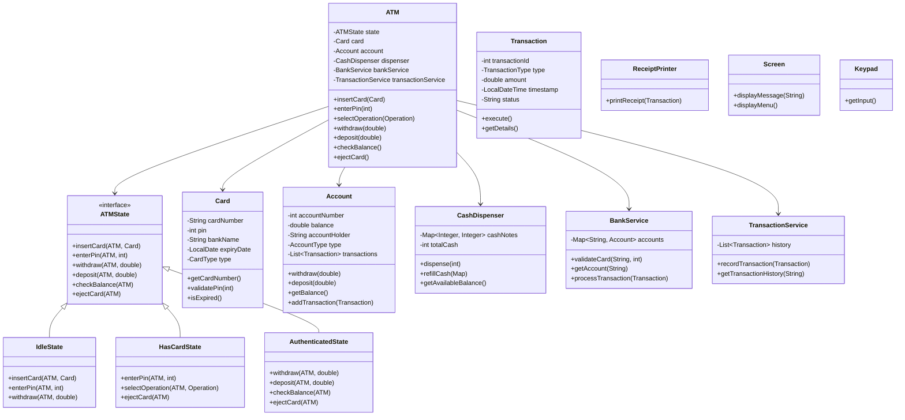
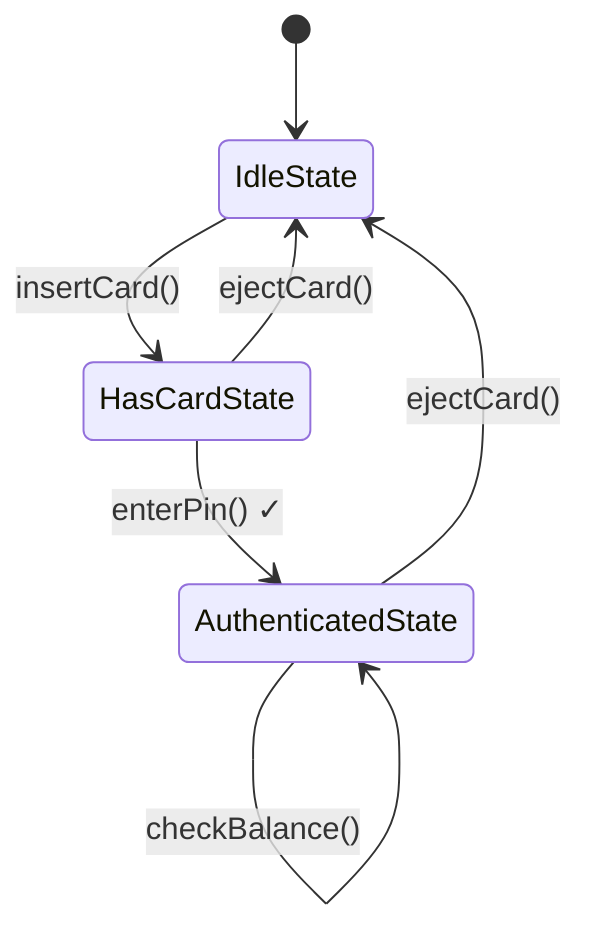
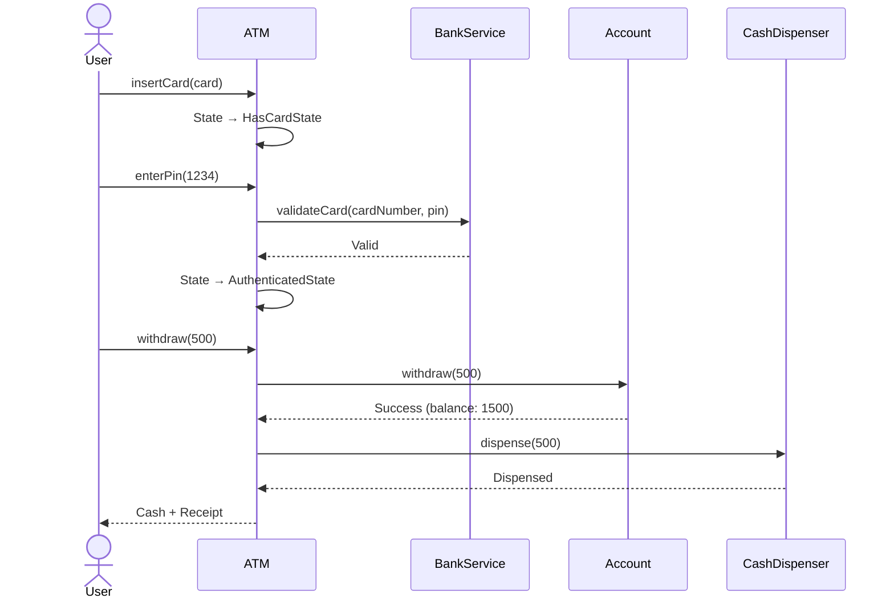

# ATM System - Complete LLD

## Class Diagram



## Components

### 1. **Card** - Authentication Entity
- **Attributes:**
  - `cardNumber` (String) - Unique card identifier
  - `pin` (int) - 4-digit PIN
  - `bankName` (String) - Issuing bank
  - `expiryDate` (LocalDate) - Card validity
  - `type` (CardType) - DEBIT, CREDIT

- **Methods:**
  - `validatePin(int pin)` - Verify PIN
  - `isExpired()` - Check card validity
  - `getCardNumber()` - Get card details

### 2. **Account** - Financial Entity
- **Attributes:**
  - `accountNumber` (int) - Unique account ID
  - `balance` (double) - Available balance
  - `accountHolder` (String) - Owner name
  - `type` (AccountType) - SAVINGS, CURRENT
  - `transactions` (List<Transaction>) - Transaction history

- **Methods:**
  - `withdraw(double amount)` - Deduct money
  - `deposit(double amount)` - Add money
  - `getBalance()` - Check balance
  - `addTransaction(Transaction)` - Record transaction

### 3. **CashDispenser** - Hardware Component
- **Attributes:**
  - `cashNotes` (Map<Integer, Integer>) - Denominations and counts
  - `totalCash` (int) - Total available cash

- **Methods:**
  - `dispense(int amount)` - Dispense cash using greedy algorithm
  - `refillCash(Map<Integer, Integer>)` - Add cash
  - `getAvailableBalance()` - Check ATM cash

- **Algorithm:** Uses highest denominations first (500, 200, 100)

### 4. **ATMState** - State Pattern
Controls ATM behavior based on current state:

- **IdleState** - Waiting for card
- **HasCardState** - Card inserted, waiting for PIN
- **AuthenticatedState** - PIN verified, operations allowed
- **DispensingState** - Dispensing cash (optional)

### 5. **Transaction** - Operation Record
- **Attributes:**
  - `transactionId` (int) - Unique ID
  - `type` (TransactionType) - WITHDRAW, DEPOSIT, BALANCE_CHECK
  - `amount` (double) - Transaction amount
  - `timestamp` (LocalDateTime) - When executed
  - `status` (String) - SUCCESS, FAILED

### 6. **BankService** - External Integration
- Validates card and PIN
- Retrieves account information
- Processes transactions

### 7. **Supporting Components**
- **Screen** - Display messages and menus
- **Keypad** - User input
- **ReceiptPrinter** - Print transaction receipts

## Design Patterns Used

### 1. **State Pattern** (Primary)
- **Where:** ATMstate interface and implementations
- **Why:** ATM behavior changes dramatically based on state
- **Benefit:** Eliminates if-else chains, easy to add new states

```java
// Instead of:
if (cardInserted) {
    if (pinValid) {
        // allow operations
    }
}

// Use:
interface ATMState {
    void insertCard(ATM atm, Card card);
    void enterPin(ATM atm, int pin);
    void withdraw(ATM atm, double amount);
}
```

### 2. **Singleton Pattern**
- **Where:** CashDispenser, BankService
- **Why:** Only one instance needed system-wide

```java
CashDispenser dispenser = CashDispenser.getInstance();
```

### 3. **Factory Pattern**
- **Where:** Transaction creation
- **Why:** Create different transaction types based on operation

```java
TransactionFactory.createTransaction(Operation.WITHDRAW, amount);
```

### 4. **Strategy Pattern**
- **Where:** Cash dispensing algorithm
- **Why:** Different strategies for different denominations

## Flow Diagrams

### Complete ATM Flow



### Withdrawal Flow



## How It Works - Step by Step

### 1. **Card Insertion**
```
User inserts card
    ↓
ATM reads card number
    ↓
ATM transitions to HasCardState
    ↓
Screen displays: "Enter PIN"
```

### 2. **PIN Validation**
```
User enters PIN (1234)
    ↓
ATM validates against card
    ↓
BankService checks with bank
    ↓
If valid → AuthenticatedState
If invalid → "Invalid PIN" (max 3 attempts)
    ↓
Screen displays: "Select Operation"
```

### 3. **Withdrawal Operation**
```
User selects: Withdraw
    ↓
ATM shows: Enter amount
    ↓
User enters: 500
    ↓
ATM checks: Account balance ≥ 500?
    ↓
ATM requests: CashDispenser.dispense(500)
    ↓
Dispenser: 5 × 100 notes
    ↓
Account: balance -= 500
    ↓
Transaction: Record in history
    ↓
Screen: "Please collect cash"
    ↓
ReceiptPrinter: Print receipt
```

### 4. **Cash Dispensing Algorithm**
```java
// Greedy approach: Use highest denominations first
500, 200, 100, 50, 20, 10

Example: Withdraw 850
- 500 × 1 = 500 (remaining: 350)
- 200 × 1 = 200 (remaining: 150)
- 100 × 1 = 100 (remaining: 50)
- 50 × 1 = 50 (remaining: 0)
Result: 500 + 200 + 100 + 50
```

## Time & Space Complexity

### Time Complexity
- **PIN validation:** O(1) - Direct comparison
- **Balance check:** O(1) - Map lookup
- **Withdrawal:** O(D) - D = number of denominations (constant: 6)
- **Transaction recording:** O(1) - List add

### Space Complexity
- **O(N × A)** - N accounts, average A transactions per account
- **O(1)** - ATM state (fixed number of states)
- **O(1)** - Cash dispenser (fixed denominations)

## Real-World Considerations

### 1. **Security**
- PIN is encrypted (never stored in plain text)
- Session timeout (30 seconds)
- Card retention after 3 invalid PIN attempts
- Transaction limits per day

### 2. **Concurrency**
- Multiple ATMs accessing same account
- Account locking during withdrawal
- Distributed transaction management

```java
// Use synchronized for account operations
public synchronized boolean withdraw(double amount) {
    if (balance >= amount) {
        balance -= amount;
        return true;
    }
    return false;
}
```

### 3. **Fault Tolerance**
- Network failure during transaction
- Cash dispenser jam handling
- Power failure recovery

## Interview Questions & Answers

### Q1: Why use State Pattern?
**A:** ATM has distinct states with completely different behaviors. Without State Pattern:
```java
if (state == IDLE) {
    // handle idle
} else if (state == HAS_CARD) {
    // handle card inserted
}
// Error-prone, hard to extend
```
With State Pattern, each state encapsulates its behavior, making code clean and extensible.

### Q2: How to handle concurrent withdrawals?
**A:** Use database-level locking:
```sql
SELECT balance FROM accounts WHERE id = 101 FOR UPDATE;
-- Process withdrawal
UPDATE accounts SET balance = balance - 500 WHERE id = 101;
COMMIT;
```

### Q3: What if cash dispenser fails mid-transaction?
**A:** Implement rollback mechanism:
```java
try {
    account.withdraw(amount);
    dispenser.dispense(amount);
} catch (DispenserException e) {
    account.deposit(amount); // Rollback
    throw new TransactionFailedException("Cash dispenser error");
}
```

### Q4: How to add new operations (Change PIN, Mini Statement)?
**A:** 
1. Add new state transitions in AuthenticatedState
2. Add new methods in ATMState interface
3. Implement in each state class
4. No changes to existing state logic

## Common Mistakes

| Mistake | Problem | Fix |
|---------|---------|-----|
| Not using State Pattern | Complex if-else chains | Use state pattern for clear behavior separation |
| Storing PIN in plain text | Security vulnerability | Hash PIN using BCrypt |
| No transaction rollback | Money lost on failure | Implement compensating transactions |
| Not validating account | Wrong account charged | Always validate before transaction |
| Hardcoding denominations | Inflexible cash management | Load from configuration |

## Extensions for Production

1. **Multi-bank support** - Different bank integrations
2. **Multiple currencies** - Currency conversion
3. **Mobile integration** - QR code payments
4. **Biometric authentication** - Fingerprint/Face ID
5. **Contactless transactions** - NFC/RFID
6. **Audit logging** - All operations logged
7. **Monitoring** - Real-time ATM health checks

## Quick Reference

```
ATM States:
1. IDLE → Waiting for card
2. HAS_CARD → Waiting for PIN
3. AUTHENTICATED → Can perform operations

Operations:
- Withdraw
- Deposit
- Check Balance
- Change PIN
- Mini Statement

Design Patterns:
- State Pattern (ATM behavior)
- Singleton (CashDispenser, BankService)
- Factory (Transaction creation)

Key Classes:
- ATM (main controller)
- Card (authentication)
- Account (financial data)
- CashDispenser (hardware)
- Transaction (operation record)