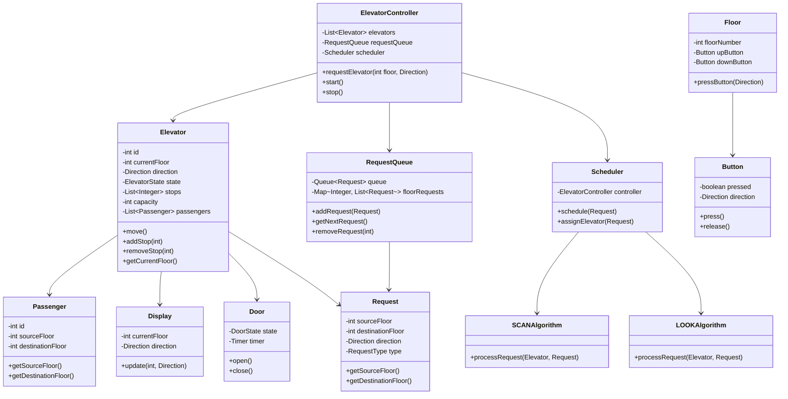
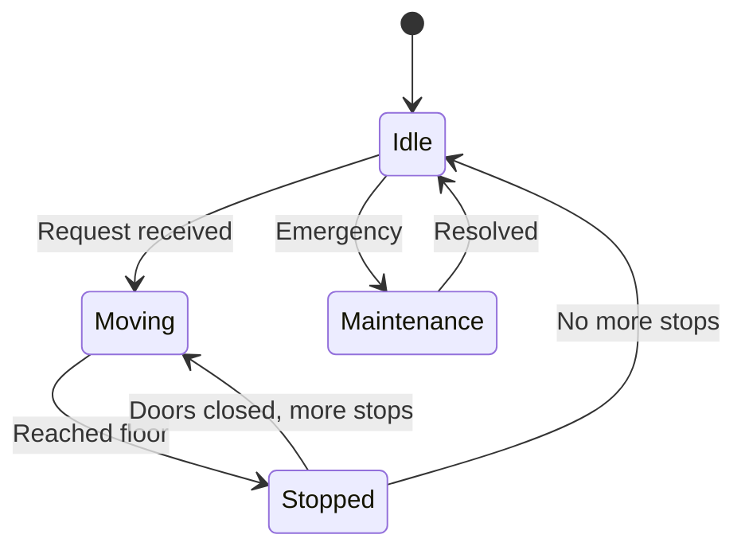
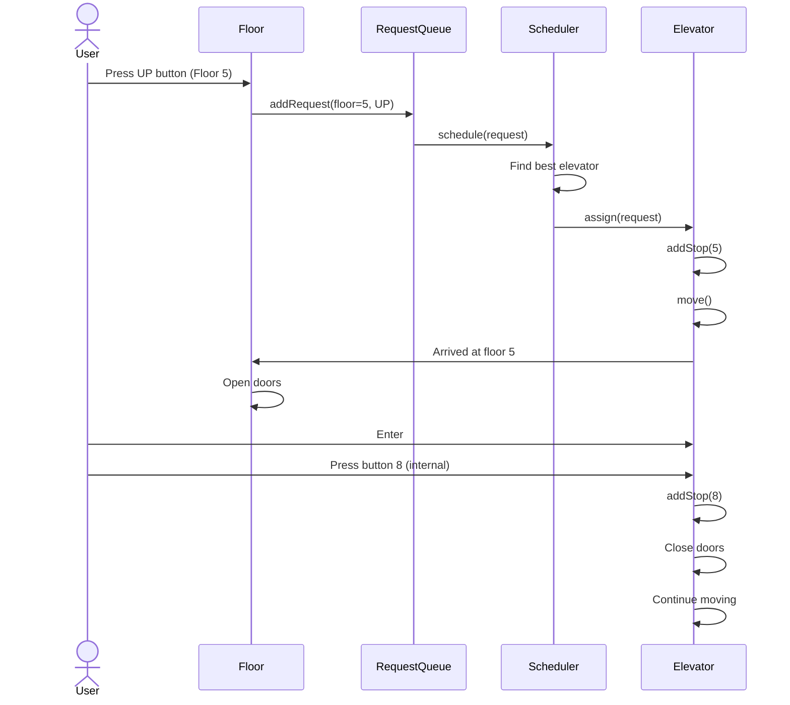
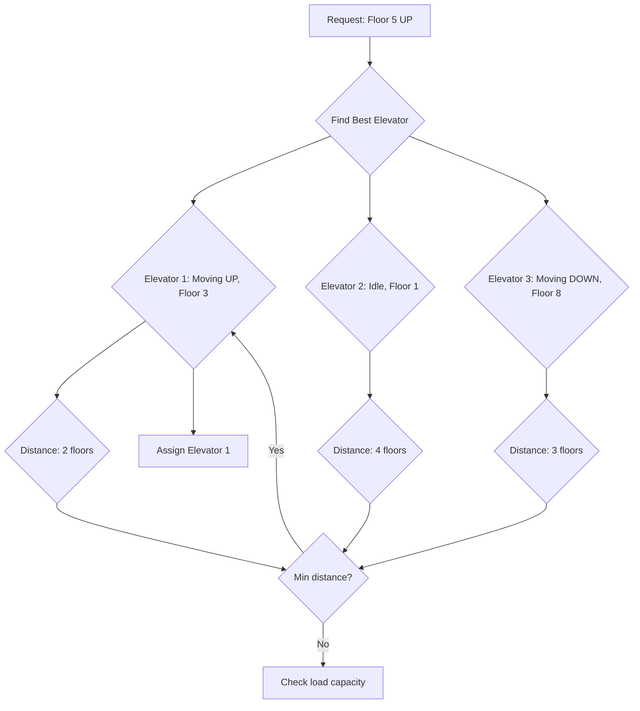

# Elevator System - Complete LLD

## Class Diagram



## Components

### 1. **Elevator** - Main Entity
- **Attributes:**
  - `id` (int) - Unique elevator ID
  - `currentFloor` (int) - Current position
  - `direction` (Direction) - UP, DOWN, IDLE
  - `state` (ElevatorState) - MOVING, STOPPED, MAINTENANCE
  - `stops` (List<Integer>) - Scheduled stops
  - `capacity` (int) - Max passengers
  - `passengers` (List<Passenger>) - Current load

- **Methods:**
  - `move()` - Process next stop
  - `addStop(int floor)` - Add destination
  - `removeStop(int floor)` - Remove stop
  - `getCurrentFloor()` - Current position

### 2. **Request** - User Request
- **Attributes:**
  - `sourceFloor` (int) - Origin floor
  - `destinationFloor` (int) - Target floor
  - `direction` (Direction) - Movement direction
  - `type` (RequestType) - EXTERNAL, INTERNAL

- **Methods:**
  - `getSourceFloor()` - Origin
  - `getDestinationFloor()` - Destination

### 3. **RequestQueue** - Request Management
- **Attributes:**
  - `queue` (Queue<Request>) - FIFO queue
  - `floorRequests` (Map<Integer, List<Request>>) - Floor-wise grouping

- **Methods:**
  - `addRequest(Request)` - Add new request
  - `getNextRequest()` - Get highest priority
  - `removeRequest(int floor)` - Remove completed

### 4. **Scheduler** - Request Assignment
- **Attributes:**
  - `controller` (ElevatorController) - Main controller
  - `algorithm` (SchedulingAlgorithm) - SCAN, LOOK

- **Methods:**
  - `schedule(Request)` - Assign to best elevator
  - `assignElevator(Request)` - Find optimal elevator

### 5. **Scheduling Algorithms**

#### SCAN Algorithm (Elevator Algorithm)
- Elevator moves in one direction
- Services all requests in that direction
- Reverses at end or no more requests
- Optimal for single elevator

#### LOOK Algorithm
- Similar to SCAN
- Reverses at last request instead of end
- More efficient than SCAN

### 6. **ElevatorController** - Main Controller
- **Attributes:**
  - `elevators` (List<Elevator>) - All elevators
  - `requestQueue` (RequestQueue) - Pending requests
  - `scheduler` (Scheduler) - Assignment logic

- **Methods:**
  - `requestElevator(int floor, Direction)` - User request
  - `start()` - Start system
  - `stop()` - Emergency stop

## Design Patterns Used

### 1. **State Pattern** (Elevator States)
```java
interface ElevatorState {
    void move(Elevator elevator);
    void stop(Elevator elevator);
}

class MovingState implements ElevatorState {
    public void move(Elevator elevator) {
        // Continue moving
    }
}

class StoppedState implements ElevatorState {
    public void move(Elevator elevator) {
        elevator.setState(new MovingState());
    }
}
```

### 2. **Strategy Pattern** (Scheduling Algorithms)
```java
interface SchedulingAlgorithm {
    Elevator assignElevator(List<Elevator> elevators, Request request);
}

class SCANAlgorithm implements SchedulingAlgorithm {
    public Elevator assignElevator(List<Elevator> elevators, Request request) {
        // SCAN logic
    }
}

class LOOKAlgorithm implements SchedulingAlgorithm {
    public Elevator assignElevator(List<Elevator> elevators, Request request) {
        // LOOK logic
    }
}

// Switch algorithms dynamically
scheduler.setAlgorithm(new SCANAlgorithm());
```

### 3. **Observer Pattern** (Floor Requests)
- Elevator notifies floors of arrival
- Display updates automatically

## Flow Diagrams

### Elevator Operation Flow


### Request Processing Flow


### Multiple Elevator Scheduling


## How It Works - Step by Step

### 1. **External Request (Button on Floor)**
```
User at Floor 5 wants to go UP
    ↓
Press UP button
    ↓
FloorButton.press() → creates Request
    ↓
RequestQueue.addRequest(Request(5, UP, EXTERNAL))
    ↓
Scheduler.schedule(request)
    ↓
Find elevator closest to floor 5 moving UP
    ↓
Elevator.addStop(5)
    ↓
Elevator moves to floor 5
    ↓
Doors open, user enters
```

### 2. **Internal Request (Button inside Elevator)**
```
User inside Elevator wants Floor 8
    ↓
Press floor 8 button
    ↓
Elevator.addStop(8)
    ↓
Check if 8 is in current direction
    ↓
If yes: Add to stop list
    If no: Add after reversing
    ↓
Continue to next stop
```

### 3. **Scheduling Logic**
```java
// SCAN Algorithm Example
Elevator at Floor 3, moving UP
Requests: Floor 5 (UP), Floor 2 (DOWN), Floor 7 (UP)

Sort by distance in current direction:
- Floor 5: distance = 2 (UP) ✓
- Floor 7: distance = 4 (UP) ✓
- Floor 2: distance = -1 (DOWN) ✗ (opposite direction)

Service order: 5 → 7 → then reverse → 2
```

### 4. **Door Operation**
```
Elevator arrives at floor
    ↓
Stop motor
    ↓
Open doors (3 seconds timeout)
    ↓
Check sensors (obstruction detection)
    ↓
If no obstruction:
    Wait 5 seconds or button press
    Close doors
    ↓
Check all doors closed
    ↓
Resume movement
```

## Scheduling Algorithms Comparison

| Algorithm | Pros | Cons | Best For |
|-----------|------|------|----------|
| SCAN | Fair, systematic | Wastes time at ends | Single elevator |
| LOOK | Efficient, skips empty floors | Slightly complex | Multi-elevator |
| SSTF (Shortest Seek) | Fast response | Starvation risk | Small buildings |
| FCFS (First Come) | Simple, fair | Not optimal | Emergency mode |

## Time & Space Complexity

### Time Complexity
- **Request assignment:** O(E × R) - E elevators, R requests
- **Stop insertion:** O(log S) - S stops (binary search)
- **Move to floor:** O(1) per floor (constant time)
- **Door operation:** O(1)

### Space Complexity
- **O(N + E × S)** - N requests, E elevators, S stops per elevator
- **O(1)** per passenger

## Real-World Considerations

### 1. **Concurrency**
- Multiple users pressing buttons simultaneously
- Thread-safe request queue
- Synchronized elevator movements

```java
public synchronized void addStop(int floor) {
    if (!stops.contains(floor)) {
        stops.add(floor);
        Collections.sort(stops);
    }
}
```

### 2. **Load Balancing**
- Distribute passengers evenly
- Avoid overloading single elevator
- Consider capacity constraints

### 3. **Priority Handling**
- Fire/emergency requests (highest priority)
- VIP/express requests
- Service/maintenance requests

### 4. **Energy Optimization**
- Group nearby requests
- Minimize direction changes
- Turn off lights in idle elevators

## Interview Questions & Answers

### Q1: Which scheduling algorithm is best?
**A:** LOOK algorithm is generally best:
- elevator doesn't travel to end if no requests
- Better than SCAN for tall buildings
- Fair and efficient

### Q2: How to handle peak hours (morning/evening)?
**A:** Pre-positioning strategy:
```java
// Morning: Position elevators at ground floor
if (isPeakHour(MORNING)) {
    moveAllElevatorsToFloor(0);
}

// Evening: Position at top floor
if (isPeakHour(EVENING)) {
    moveAllElevatorsToFloor(maxFloor);
}
```

### Q3: What if elevator breaks down?
**A:** 
1. Announce maintenance mode
2. Redirect requests to other elevators
3. Move to nearest floor and open doors
4. Enable manual override

### Q4: How to optimize for 50-floor building with 10 elevators?
**A:** Zone-based scheduling:
```java
Divide building into zones:
- Elevators 1-3: Floors 0-15
- Elevators 4-6: Floors 16-35
- Elevators 7-10: Floors 36-49

Assign based on zone proximity
```

## Common Mistakes

| Mistake | Problem | Fix |
|---------|---------|-----|
| Ignoring direction | Elevator goes wrong way | Check direction before assigning |
| No capacity check | Overcrowding | Track passenger count |
| Not handling edge cases | Door stuck, sensor failure | Add error handling |
| Single scheduling algo | Not flexible | Use strategy pattern |
| No priority queue | Emergency ignored | Implement priority levels |

## Extensions for Production

1. **AI-based scheduling** - ML predict demand
2. **Health monitoring** - Predictive maintenance
3. **Energy saving mode** - Night mode optimization
4. **Touchless operation** - Voice/sensor control
5. **COVID-safe features** - Capacity limits, UV lighting
6. **Accessibility** - Wheelchair ramps, audio announcements
7. **Analytics** - Usage patterns, peak times

## Quick Reference

```
Directions:
- UP (going up)
- DOWN (going down)
- IDLE (stationary)

States:
- IDLE
- MOVING
- STOPPED
- DOORS_OPEN
- MAINTENANCE

Request Types:
- EXTERNAL (from floor button)
- INTERNAL (from elevator button)

Algorithms:
- SCAN: Goes to end, reverses
- LOOK: Reverses at last request
- SSTF: Shortest seek first

Key Classes:
- ElevatorController (orchestrator)
- Elevator (car)
- Request (user request)
- Scheduler (assignment logic)
- RequestQueue (pending requests)

Complexity:
- Assignment: O(E × R)
- Stop insertion: O(log S)
- Move: O(1) per floor