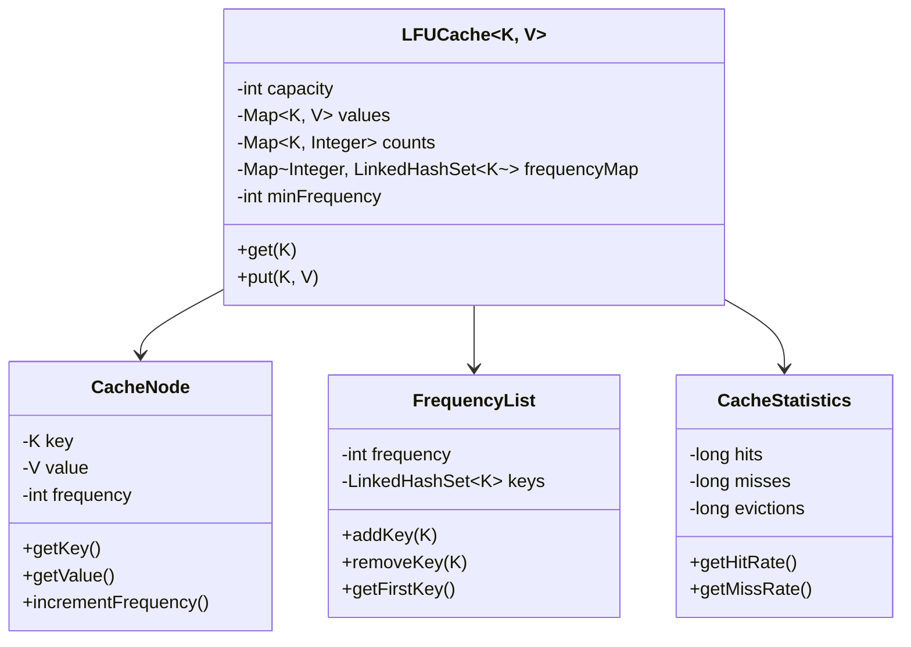
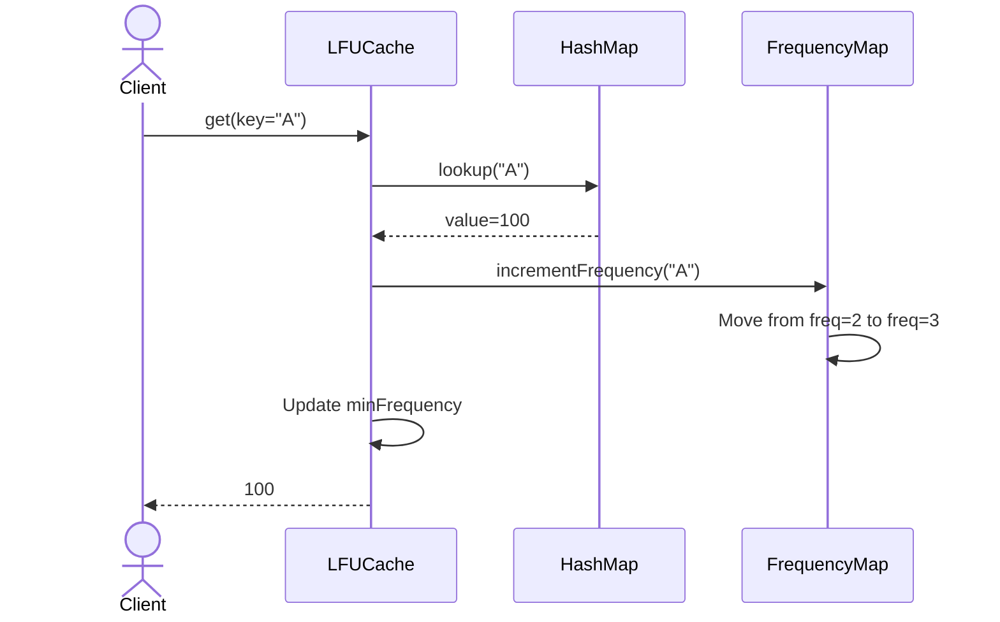
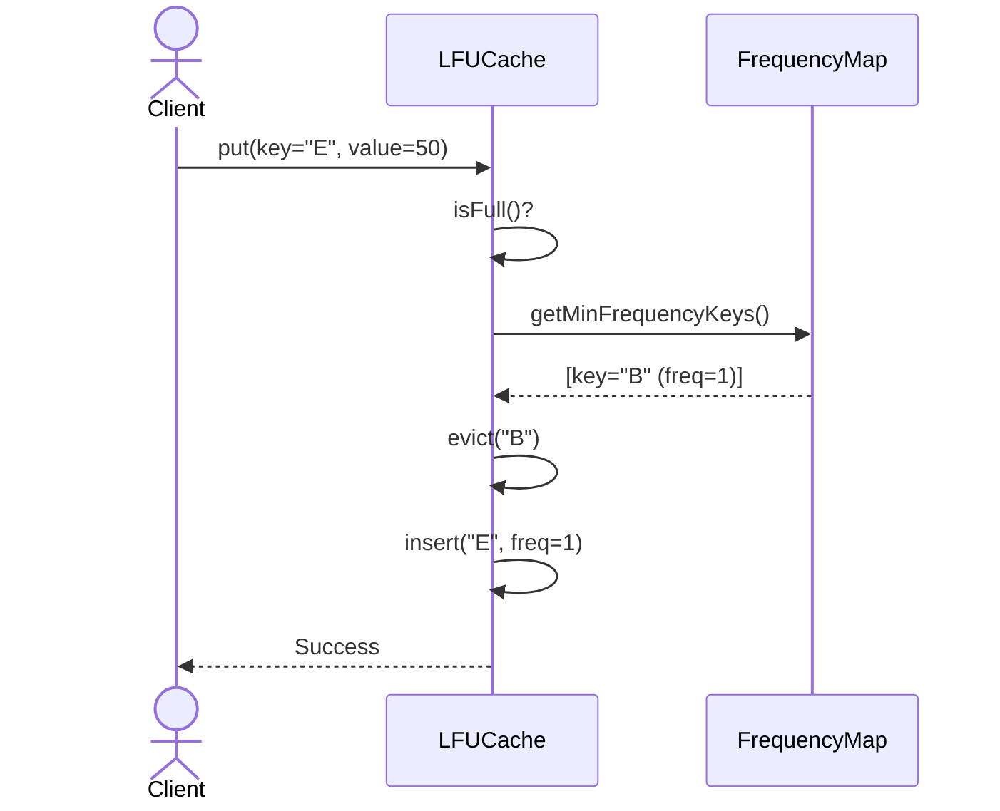

# LFU Cache - Complete LLD

## Class Diagram



## Components

### 1. **CacheNode** - Cache Entry
- **Attributes:**
  - `key` (K) - Cache key
  - `value` (V) - Cached value
  - `frequency` (int) - Access count

- **Methods:**
  - `getKey()` - Return key
  - `getValue()` - Return value
  - `incrementFrequency()` - Increase access count

### 2. **LFUCache<K, V>** - Main Cache
- **Attributes:**
  - `capacity` (int) - Max entries
  - `values` (Map<K, V>) - Key-value store
  - `counts` (Map<K, Integer>) - Frequency per key
  - `frequencyMap` (Map<Integer, LinkedHashSet<K>>) - Keys by frequency
  - `minFrequency` (int) - Minimum frequency in cache

- **Methods:**
  - `get(K key)` - Retrieve and increment frequency
  - `put(K key, V value)` - Add/update with frequency tracking

### 3. **FrequencyList** - Frequency Management
- **Attributes:**
  - `frequency` (int) - Frequency level
  - `keys` (LinkedHashSet<K>) - Keys at this frequency

- **Methods:**
  - `addKey(K)` - Add key to frequency
  - `removeKey(K)` - Remove key
  - `getFirstKey()` - Get least recently used at this frequency

### 4. **CacheStatistics** - Monitoring
- **Attributes:**
  - `hits` (long) - Successful lookups
  - `misses` (long) - Failed lookups
  - `evictions` (long) - Removed entries

- **Methods:**
  - `getHitRate()` - Cache hit percentage
  - `getMissRate()` - Cache miss percentage

## How LFU Differs from LRU

| Aspect | LRU | LFU |
|--------|-----|-----|
| Eviction Basis | Least recently used | Least frequently used |
| Data Structure | Doubly linked list | Frequency map + LinkedHashSet |
| Use Case | Recency matters | Popularity matters |
| Example | Browser cache | CDN cache |
| Performance | O(1) | O(1) |

### Visual Comparison

```
LRU (Time-based):
Access order: A(1) → B(2) → C(3) → A(4) → D(5)
Order: A → B → C → D
Evict: B (oldest)

LFU (Frequency-based):
Access order: A(3) → B(1) → C(2) → D(1)
Frequencies: A=3, C=2, B=1, D=1
Evict: B or D (lowest frequency, tie-break by LRU)
```

## Complete Implementation

### Core LFU Cache
```java
class LFUCache<K, V> {
    private int capacity;
    private Map<K, V> values;
    private Map<K, Integer> counts;
    private Map<Integer, LinkedHashSet<K>> frequencyMap;
    private int minFrequency;
    private CacheStatistics stats;
    
    public LFUCache(int capacity) {
        this.capacity = capacity;
        this.values = new HashMap<>();
        this.counts = new HashMap<>();
        this.frequencyMap = new HashMap<>();
        this.stats = new CacheStatistics();
    }
    
    public V get(K key) {
        if (!values.containsKey(key)) {
            stats.recordMiss();
            return null;
        }
        
        stats.recordHit();
        int freq = counts.get(key);
        updateFrequency(key, freq);
        return values.get(key);
    }
    
    public void put(K key, V value) {
        if (capacity == 0) return;
        
        if (values.containsKey(key)) {
            values.put(key, value);
            int freq = counts.get(key);
            updateFrequency(key, freq);
        } else {
            if (values.size() >= capacity) {
                evictLFU();
            }
            values.put(key, value);
            counts.put(key, 1);
            frequencyMap.computeIfAbsent(1, k -> new LinkedHashSet<>()).add(key);
            minFrequency = 1;
        }
    }
    
    private void updateFrequency(K key, int oldFreq) {
        // Remove from old frequency
        frequencyMap.get(oldFreq).remove(key);
        if (oldFreq == minFrequency && frequencyMap.get(oldFreq).isEmpty()) {
            minFrequency++;
        }
        
        // Add to new frequency
        int newFreq = oldFreq + 1;
        counts.put(key, newFreq);
        frequencyMap.computeIfAbsent(newFreq, k -> new LinkedHashSet<>()).add(key);
    }
    
    private void evictLFU() {
        LinkedHashSet<K> keys = frequencyMap.get(minFrequency);
        K keyToRemove = keys.iterator().next(); // LRU among LFU
        keys.remove(keyToRemove);
        values.remove(keyToRemove);
        counts.remove(keyToRemove);
        stats.recordEviction();
    }
}
```

### LFU with Node-based Frequency List
```java
class LFUCacheV2<K, V> {
    private int capacity;
    private Map<K, V> values;
    private Map<K, CacheNode<K, V>> nodes;
    private Map<Integer, FrequencyList> freqMap;
    private int minFreq;
    
    public V get(K key) {
        if (!nodes.containsKey(key)) {
            return null;
        }
        
        CacheNode<K, V> node = nodes.get(key);
        node.incrementFrequency();
        updateFrequencyList(node);
        return node.getValue();
    }
    
    private void updateFrequencyList(CacheNode<K, V> node) {
        int oldFreq = node.getFrequency() - 1;
        FrequencyList oldList = freqMap.get(oldFreq);
        oldList.removeKey(node.getKey());
        
        if (oldList.isEmpty() && oldFreq == minFreq) {
            minFreq++;
        }
        
        int newFreq = node.getFrequency();
        freqMap.computeIfAbsent(newFreq, k -> new FrequencyList(k)).addKey(node.getKey());
    }
}
```

## Time & Space Complexity

### Time Complexity
- **get():** O(1) - HashMap lookup + frequency updates
- **put():** O(1) - HashMap insert + frequency updates
- **evict():** O(1) - LinkedHashSet removal

### Space Complexity
- **O(capacity)** - All maps store up to capacity entries
- **O(capacity)** - Frequency map stores all keys

## Design Patterns Used

### 1. **Strategy Pattern** (Eviction Strategy)
```java
interface EvictionStrategy<K, V> {
    void evict(Map<K, V> cache);
}

class LFUEviction<K, V> implements EvictionStrategy<K, V> {
    public void evict(Map<K, V> cache) {
        // Remove least frequently used
    }
}

class LRUEviction<K, V> implements EvictionStrategy<K, V> {
    public void evict(Map<K, V> cache) {
        // Remove least recently used
    }
}
```

### 2. **Observer Pattern** (Statistics)
```java
interface CacheObserver {
    void onHit();
    void onMiss();
    void onEviction();
}

class MetricsCollector implements CacheObserver {
    public void onHit() {
        hits++;
        hitRate = (double) hits / (hits + misses);
    }
}
```

## Flow Diagrams

### GET Operation


### PUT Operation (Cache Full)


## How It Works - Step by Step

### 1. **Initial State**
```
Capacity: 3
Operations: put(A,1), put(B,2), put(C,3)

State:
values: {A=1, B=2, C=3}
counts: {A=1, B=1, C=1}
frequencyMap: {1: [A, B, C]}
minFrequency: 1
```

### 2. **Access Pattern**
```
get(A) → A frequency becomes 2
get(A) → A frequency becomes 3
get(B) → B frequency becomes 2

State:
values: {A=1, B=2, C=3}
counts: {A=3, B=2, C=1}
frequencyMap: {1: [C], 2: [B], 3: [A]}
minFrequency: 1
```

### 3. **Eviction Scenario**
```
put(D, 4) → Cache full, need to evict

Find minFrequency: 1
Keys with freq=1: [C]

Evict C (least frequently used)

State:
values: {A=1, B=2, D=4}
counts: {A=3, B=2, D=1}
frequencyMap: {1: [D], 2: [B], 3: [A]}
minFrequency: 1
```

### 4. **Tie-Breaking**
```
If multiple keys have same minFrequency:
- Evict the least recently used among them
- LinkedHashSet maintains insertion order

Example:
 frequencyMap: {1: [D(10:00), E(10:05)]}
 
 Evict D (added earlier)
```

## Variations and Extensions

### 1. **LFU with Aging**
```java
// Decrease frequency over time to prevent old items from staying forever
class LFUWithAging<K, V> {
    private long agingInterval;
    
    public void age() {
        for (Map.Entry<K, Integer> entry : counts.entrySet()) {
            int newFreq = Math.max(1, entry.getValue() - 1);
            entry.setValue(newFreq);
        }
    }
}
```

### 2. **Weighted LFU**
```java
// Consider item size in eviction
class WeightedLFU<K, V> {
    private Map<K, Integer> weights;
    
    public void put(K key, V value, int weight) {
        weights.put(key, weight);
        // Evict based on frequency/weight ratio
    }
}
```

### 3. **Concurrent LFU**
```java
class ConcurrentLFUCache<K, V> {
    private final ReadWriteLock lock = new ReentrantReadWriteLock();
    
    public V get(K key) {
        lock.readLock().lock();
        try {
            return cache.get(key);
        } finally {
            lock.readLock().unlock();
        }
    }
}
```

## Real-World Use Cases

### 1. **CDN Cache**
- Cache popular content
- Evict rarely accessed content
- Improve hit rate

### 2. **Database Query Cache**
- Cache frequent queries
- Keep hot data in memory
- Reduce DB load

### 3. **Recommendation Engine**
- Cache popular recommendations
- LFU naturally keeps trending items
- Better than LRU for popularity-based systems

### 4. **API Response Cache**
- Cache frequent API calls
-LFU keeps popular responses
- Reduce computation

## Interview Questions & Answers

### Q1: LFU vs LRU - when to use which?
**A:** 
- **LFU:** When frequency matters more than recency (CDN, recommendations)
- **LRU:** When recent items are more likely to be accessed again (browser cache)
- Example: News website - LFU keeps popular articles, LRU keeps latest news

### Q2: How to handle frequency ties?
**A:** Use LRU as tiebreaker:
```java
// Multiple keys with freq=1
// Evict the one that was least recently added
LinkedHashSet maintains insertion order
Iterator().next() gives oldest
```

### Q3: What is the aging problem in LFU?
**A:** Old items with high frequency may never be evicted:
```
Item A: accessed 1000 times last year (freq=1000)
Item B: accessed 10 times today (freq=10)

LFU evicts B (lower frequency)
But B is actually more relevant!
```
**Fix:** Decrease frequency over time or use LFU with aging.

### Q4: How to make LFU thread-safe?
**A:** Use fine-grained locking:
```java
public V get(K key) {
    lock.readLock().lock();
    try {
        CacheNode node = nodes.get(key);
        if (node != null) {
            lock.readLock().unlock();
            lock.writeLock().lock();
            try {
                node.incrementFrequency();
                updateFrequencyList(node);
                return node.getValue();
            } finally {
                lock.writeLock().unlock();
            }
        }
        return null;
    } finally {
        lock.readLock().unlock();
    }
}
```

## Common Mistakes

| Mistake | Problem | Fix |
|---------|---------|-----|
| Not handling minFrequency | O(N) scan to find min | Track minFrequency dynamically |
| Using HashMap for frequency | No ordering for tie-breaking | Use LinkedHashSet |
| Forgetting to update minFrequency | Evicts wrong key | Update on every frequency change |
| Not handling capacity=0 | Division by zero | Validate input |
| Memory leak | Never clean old frequencies | Remove empty frequency lists |

## Extensions for Production

1. **Persistence** - Save to disk
2. **TTL support** - Time-based expiry
3. **Size-based eviction** - Memory-aware
4. **Metrics** - Hit/miss ratio monitoring
5. **Distributed LFU** - Redis implementation
6. **Weighted eviction** - Consider item size
7. **Batch operations** - getMultiple, putMultiple

## Quick Reference

```
Operations:
- get(key): O(1)
- put(key, value): O(1)
- evict(): O(1)

Data Structures:
- HashMap<K, V>: O(1) value lookup
- HashMap<K, Integer>: O(1) frequency lookup
- HashMap<Integer, LinkedHashSet<K>>: O(1) frequency management

Eviction:
- Find minFrequency: O(1) (tracked)
- Get first key at minFreq: O(1) (LinkedHashSet)
- Remove and update: O(1)

Key Insight:
Track minimum frequency dynamically to avoid O(N) scan

Implementation Tips:
1. Always update minFrequency on eviction
2. LinkedHashSet provides LRU order within same frequency
3. Remove empty frequency lists to save memory
4. Use cache statistics for monitoring
5. Consider aging for long-running systems