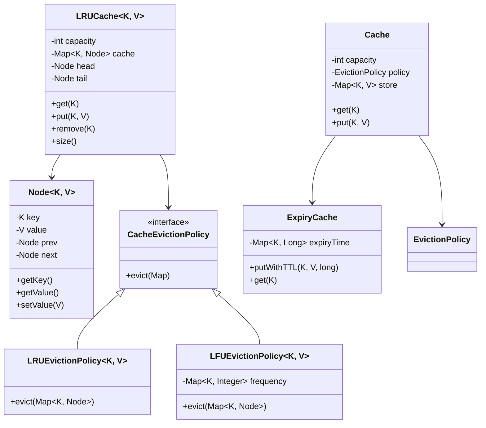
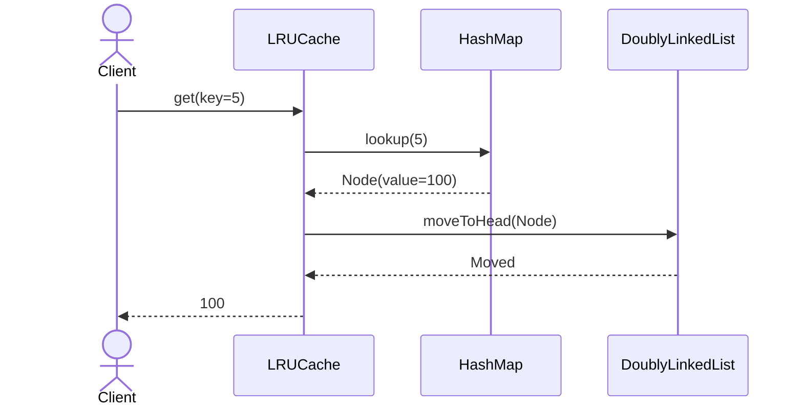
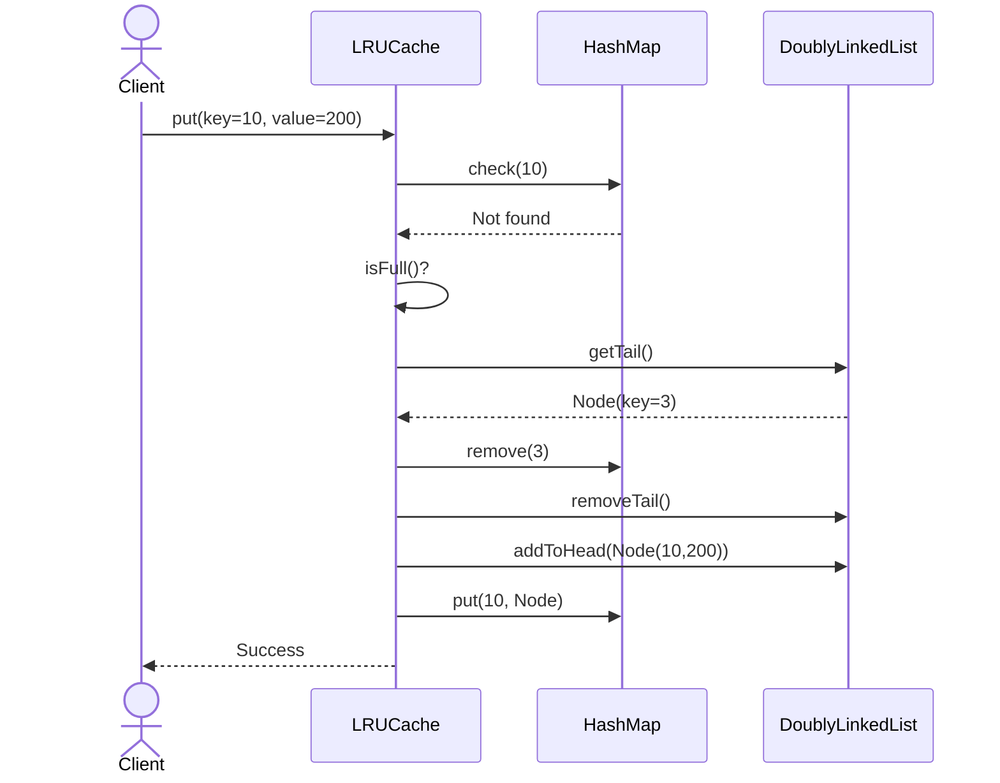

# LRU Cache - Complete LLD

## Class Diagram



## Components

### 1. **Node<K, V>** - Doubly Linked List Node
- **Attributes:**
  - `key` (K) - Cache key
  - `value` (V) - Cached value
  - `prev` (Node) - Previous node reference
  - `next` (Node) - Next node reference

- **Methods:**
  - `getKey()` - Return key
  - `getValue()` - Return value
  - `setValue(V value)` - Update value

### 2. **LRUCache<K, V>** - Main Cache Implementation
- **Attributes:**
  - `capacity` (int) - Max entries
  - `cache` (Map<K, Node>) - Hash map for O(1) lookup
  - `head` (Node) - Head of doubly linked list (most recent)
  - `tail` (Node) - Tail of doubly linked list (least recent)

- **Methods:**
  - `get(K key)` - Retrieve value, move to head
  - `put(K key, V value)` - Add/update, evict if full
  - `remove(K key)` - Delete entry
  - `size()` - Current entries

### 3. **CacheEvictionPolicy** - Strategy Interface
Defines how to evict entries when cache is full:

- **LRUEvictionPolicy** - Remove least recently used
- **LFUEvictionPolicy** - Remove least frequently used
- **FIFOEvictionPolicy** - Remove oldest entry

### 4. **ExpiryCache** - Time-based Expiry
- **Attributes:**
  - `expiryTime` (Map<K, Long>) - TTL for each entry

- **Methods:**
  - `putWithTTL(K key, V value, long ttl)` - Add with time-to-live
  - `get(K key)` - Check expiry before returning

## Design Patterns Used

### 1. **Strategy Pattern** (Eviction Policy)
```java
interface EvictionPolicy<K, V> {
    void evict(Map<K, V> cache);
}

class LRUEvictionPolicy<K, V> implements EvictionPolicy<K, V> {
    public void evict(Map<K, V> cache) {
        // Remove least recently used
    }
}

class LFUEvictionPolicy<K, V> implements EvictionPolicy<K, V> {
    public void evict(Map<K, V> cache) {
        // Remove least frequently used
    }
}

// Usage: Switch policies at runtime
cache.setEvictionPolicy(new LRUEvictionPolicy());
```

### 2. **Data Structure Combination** (HashMap + Doubly Linked List)
```java
// HashMap: O(1) lookup
// Doubly LinkedList: O(1) insertion/deletion at any position

// Best of both worlds:
// - Fast lookup: HashMap
// - Fast reordering: Doubly linked list
```

## Data Structures Deep Dive

### Why HashMap + Doubly Linked List?

```java
// Option 1: Array
get() → O(1), but remove() → O(N) ✗

// Option 2: HashMap
get() → O(1), put() → O(1), but no ordering ✗

// Option 3: Doubly Linked List
get() → O(N), put() → O(N) ✗

// Option 4: HashMap + Doubly Linked List ✓
get() → O(1) via HashMap
put() → O(1) via HashMap + LinkedList
remove() → O(1) via LinkedList
```

### Visual Representation

```
HashMap:                    Doubly Linked List (MRU → LRU):
┌─────┬────────┐           Head → [K1,V1] ↔ [K2,V2] ↔ [K3,V3] → Tail
│ K1  │ Node1  │
├─────┼────────┤           Operations:
│ K2  │ Node2  │
├─────┼────────┤           1. get(K2) → Move Node2 to head
│ K3  │ Node3  │           2. put(K4,V4) → Add to head, evict tail
└─────┴────────┘           3. remove(K1) → Delete node, reconnect
```

### Operation: get(K)
```java
1. Check if key exists in HashMap
   - No: Return null
   - Yes: Get Node from HashMap
2. Move Node to head (most recently used)
   - Remove from current position
   - Add to head
3. Return Node.value
Time: O(1)
```

### Operation: put(K, V)
```java
1. Check if key exists
   - Yes: Update value, move to head
   - No: Create new Node, add to head
2. Check capacity
   - If full: Remove tail (LRU) from both HashMap and LinkedList
3. Add to HashMap and LinkedList
Time: O(1)
```

## Flow Diagrams

### GET Operation


### PUT Operation (Cache Miss, Capacity Full)


## Complete Implementation

### Core LRU Cache
```java
class LRUCache<K, V> {
    private int capacity;
    private Map<K, Node<K, V>> cache;
    private Node<K, V> head, tail;
    
    public LRUCache(int capacity) {
        this.capacity = capacity;
        this.cache = new HashMap<>();
        this.head = new Node<>(null, null);
        this.tail = new Node<>(null, null);
        head.next = tail;
        tail.prev = head;
    }
    
    public V get(K key) {
        if (!cache.containsKey(key)) {
            return null;
        }
        
        Node<K, V> node = cache.get(key);
        moveToHead(node);
        return node.getValue();
    }
    
    public void put(K key, V value) {
        if (cache.containsKey(key)) {
            Node<K, V> node = cache.get(key);
            node.setValue(value);
            moveToHead(node);
        } else {
            Node<K, V> newNode = new Node<>(key, value);
            cache.put(key, newNode);
            addToHead(newNode);
            
            if (cache.size() > capacity) {
                Node<K, V> tailNode = removeTail();
                cache.remove(tailNode.getKey());
            }
        }
    }
    
    private void moveToHead(Node<K, V> node) {
        removeNode(node);
        addToHead(node);
    }
    
    private void addToHead(Node<K, V> node) {
        node.prev = head;
        node.next = head.next;
        head.next.prev = node;
        head.next = node;
    }
    
    private Node<K, V> removeTail() {
        Node<K, V> tailNode = tail.prev;
        removeNode(tailNode);
        return tailNode;
    }
    
    private void removeNode(Node<K, V> node) {
        node.prev.next = node.next;
        node.next.prev = node.prev;
    }
}
```

### LFU Cache (Alternative)
```java
class LFUCache<K, V> {
    private int capacity;
    private Map<K, V> values;
    private Map<K, Integer> counts;
    private Map<Integer, LinkedHashSet<K>> frequencyMap;
    private int minFrequency;
    
    public V get(K key) {
        if (!values.containsKey(key)) {
            return null;
        }
        int freq = counts.get(key);
        updateFrequency(key, freq);
        return values.get(key);
    }
    
    public void put(K key, V value) {
        if (capacity == 0) return;
        
        if (values.containsKey(key)) {
            values.put(key, value);
            int freq = counts.get(key);
            updateFrequency(key, freq);
        } else {
            if (values.size() >= capacity) {
                evictLFU();
            }
            values.put(key, value);
            counts.put(key, 1);
            frequencyMap.computeIfAbsent(1, k -> new LinkedHashSet<>()).add(key);
            minFrequency = 1;
        }
    }
    
    private void updateFrequency(K key, int freq) {
        frequencyMap.get(freq).remove(key);
        if (freq == minFrequency && frequencyMap.get(freq).isEmpty()) {
            minFrequency++;
        }
        frequencyMap.computeIfAbsent(freq + 1, k -> new LinkedHashSet<>()).add(key);
        counts.put(key, freq + 1);
    }
    
    private void evictLFU() {
        LinkedHashSet<K> keys = frequencyMap.get(minFrequency);
        K keyToRemove = keys.iterator().next();
        keys.remove(keyToRemove);
        values.remove(keyToRemove);
        counts.remove(keyToRemove);
    }
}
```

## Time & Space Complexity

### Time Complexity
- **get():** O(1) - HashMap lookup + linked list operation
- **put():** O(1) - HashMap insert + linked list operation
- **remove():** O(1) - HashMap delete + linked list operation

### Space Complexity
- **O(capacity)** - HashMap stores all entries
- **O(capacity)** - Doubly linked list stores all nodes

## Variations and Extensions

### 1. **Thread-Safe LRU Cache**
```java
class ConcurrentLRUCache<K, V> {
    private final LRUCache<K, V> cache;
    private final ReadWriteLock lock = new ReentrantReadWriteLock();
    
    public V get(K key) {
        lock.readLock().lock();
        try {
            return cache.get(key);
        } finally {
            lock.readLock().unlock();
        }
    }
    
    public void put(K key, V value) {
        lock.writeLock().lock();
        try {
            cache.put(key, value);
        } finally {
            lock.writeLock().unlock();
        }
    }
}
```

### 2. **TTL-based Cache**
```java
class TimedCache<K, V> {
    private Map<K, V> cache;
    private Map<K, Long> expiry;
    private long ttl;
    
    public V get(K key) {
        if (isExpired(key)) {
            remove(key);
            return null;
        }
        return cache.get(key);
    }
    
    private boolean isExpired(K key) {
        return System.currentTimeMillis() > expiry.get(key);
    }
}
```

### 3. **Size-based Eviction**
```java
class SizeBasedCache<K, V> {
    private Map<K, V> cache;
    private long maxSize;
    private long currentSize;
    
    public void put(K key, V value) {
        int size = calculateSize(value);
        while (currentSize + size > maxSize) {
            evict();
        }
        cache.put(key, value);
        currentSize += size;
    }
    
    private int calculateSize(V value) {
        // Estimate memory size
        return value.toString().length() * 2;
    }
}
```

## Real-World Use Cases

### 1. **Browser Cache**
- Cache web pages, images
- Limit memory usage
- Evict old entries

### 2. **Database Query Cache**
- Cache frequent queries
- Reduce DB load
- TTL-based invalidation

### 3. **API Response Cache**
- Cache API responses
- Reduce network calls
- LRU eviction

### 4. **Session Cache**
- Store user sessions
- Fast login/logout
- Automatic expiry

## Interview Questions & Answers

### Q1: Why use doubly linked list instead of singly linked list?
**A:** Need to remove arbitrary nodes in O(1):
```java
// Doubly linked: Can go both directions
node.prev.next = node.next;
node.next.prev = node.prev;

// Singly linked: Cannot access previous node
// Would need to traverse from head: O(N) ✗
```

### Q2: Why not use LinkedHashMap directly?
**A:** LinkedHashMap has access-order mode:
```java
Map<K, V> cache = new LinkedHashMap<K, V>(capacity, 0.75f, true) {
    protected boolean removeEldestEntry(Map.Entry<K, V> eldest) {
        return size() > capacity;
    }
};
```

But implementing from scratch shows understanding of internals.

### Q3: How to make it thread-safe?
**A:** Use ReadWriteLock or synchronized:
```java
public synchronized V get(K key) {
    // Read lock for reads
}

public synchronized void put(K key, V value) {
    // Write lock for writes
}
```

### Q4: What if we need to limit by memory size instead of count?
**A:** Track memory usage per entry:
```java
class MemoryAwareCache<K, V> {
    private long maxMemory;
    private long currentMemory;
    
    public void put(K key, V value) {
        int size = estimateSize(value);
        while (currentMemory + size > maxMemory) {
            evict();
        }
        currentMemory += size;
    }
}
```

## Common Mistakes

| Mistake | Problem | Fix |
|---------|---------|-----|
| Using ArrayList for list | O(N) removal | Use doubly linked list |
| Not moving to head on get | Cache becomes FIFO, not LRU | Move accessed node to head |
| Forgetting to evict | Memory overflow | Check capacity before insert |
| No thread safety | Concurrent corruption | Use locks or ConcurrentHashMap |
| Wrong eviction policy | Not LRU | Ensure tail removal |

## Extensions for Production

1. **Persistence** - Save cache to disk
2. **Expiry** - Time-based invalidation (TTL)
3. **Metrics** - Hit/miss ratio, size monitoring
4. **Distributed cache** - Redis, Memcached
5. **Size-based eviction** - Memory-aware
6. **Write-through/Write-behind** - DB sync strategies
7. **Hot keys detection** - Frequently accessed items

## Quick Reference

```
Operations:
- get(key): O(1)
- put(key, value): O(1)
- remove(key): O(1)

Data Structures:
- HashMap: O(1) lookup
- Doubly LinkedList: O(1) insertion/deletion

Eviction:
- LRU: Remove tail (least recently used)
- LFU: Remove least frequent
- FIFO: Remove oldest

Key Insight:
Combining HashMap + Doubly Linked List gives O(1) for all operations

Implementation Tips:
1. Use sentinel nodes (head/tail) to simplify edge cases
2. Always move accessed node to head
3. Evict from tail when capacity exceeded
4. Remove from HashMap when evicting from list

Variations:
- ConcurrentLRUCache (thread-safe)
- TimedCache (TTL-based)
- SizeBasedCache (memory-aware)
- LFUCache (frequency-based)