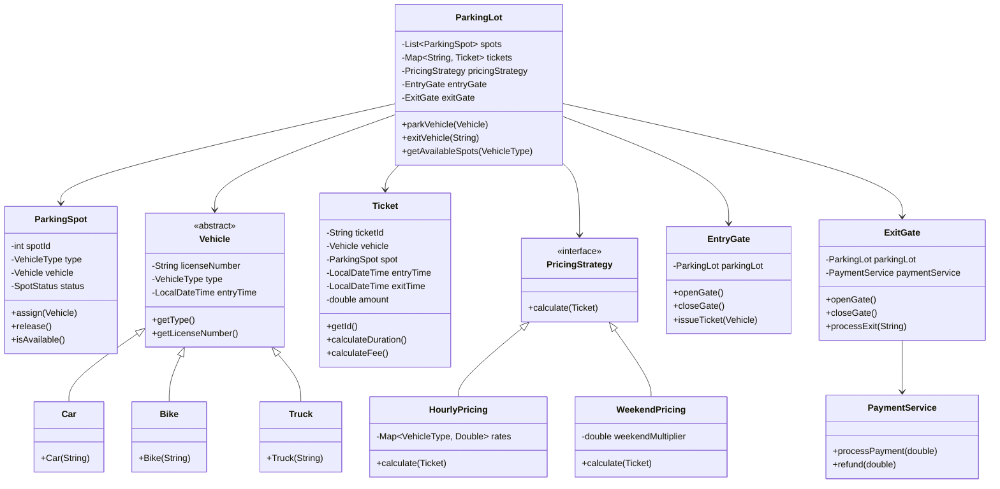
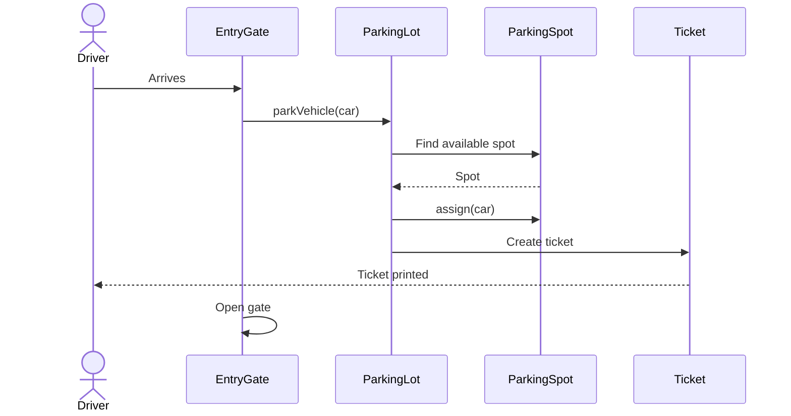
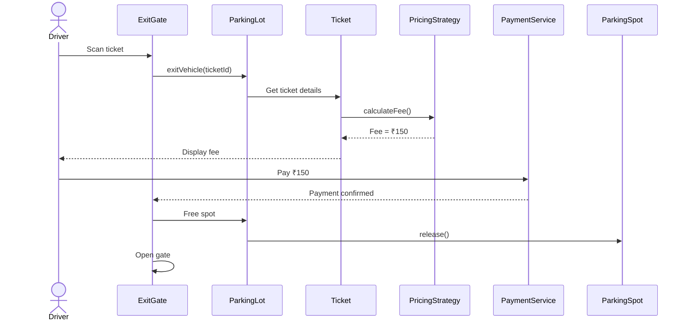
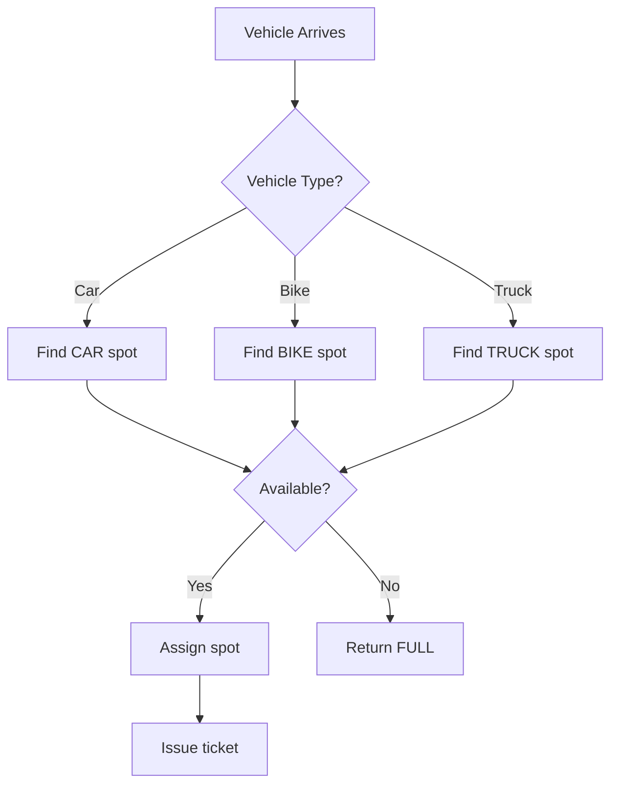

# Parking Lot System - Complete LLD

## Class Diagram



## Components

### 1. **ParkingSpot** - Physical Parking Space
- **Attributes:**
  - `spotId` (int) - Unique identifier
  - `type` (VehicleType) - CAR, BIKE, TRUCK
  - `vehicle` (Vehicle) - Currently parked vehicle
  - `status` (SpotStatus) - AVAILABLE, OCCUPIED, RESERVED

- **Methods:**
  - `assign(Vehicle)` - Park vehicle
  - `release()` - Free the spot
  - `isAvailable()` - Check availability

### 2. **Vehicle** - Vehicle Entity (Abstract)
- **Attributes:**
  - `licenseNumber` (String) - License plate
  - `type` (VehicleType) - CAR, BIKE, TRUCK
  - `entryTime` (LocalDateTime) - Entry timestamp
  - `size` (int) - Space required

- **Methods:**
  - `getType()` - Vehicle category
  - `getLicenseNumber()` - Identification

### 3. **Ticket** - Parking Session Record
- **Attributes:**
  - `ticketId` (String) - UUID
  - `vehicle` (Vehicle) - Parked vehicle
  - `spot` (ParkingSpot) - Assigned spot
  - `entryTime` (LocalDateTime) - Entry timestamp
  - `exitTime` (LocalDateTime) - Exit timestamp
  - `amount` (double) - Calculated fee

- **Methods:**
  - `calculateDuration()` - Hours parked
  - `calculateFee()` - Total cost

### 4. **PricingStrategy** - Fee Calculation (Strategy Pattern)
- **HourlyPricing** - Basic per-hour rate
- **WeekendPricing** - Higher rates on weekends
- **VIPTricing** - Premium spots with extra services

### 5. **ParkingLot** - Main Controller
- **Attributes:**
  - `spots` (List<ParkingSpot>) - All parking spots
  - `tickets` (Map<String, Ticket>) - Active tickets
  - `pricingStrategy` (PricingStrategy) - Current pricing
  - `entryGate` (EntryGate) - Entry point
  - `exitGate` (ExitGate) - Exit point

- **Methods:**
  - `parkVehicle(Vehicle)` - Find spot and issue ticket
  - `exitVehicle(String ticketId)` - Calculate fee and free spot
  - `getAvailableSpots(VehicleType)` - Availability check

### 6. **EntryGate/ExitGate** - Access Control
- Physical barriers at entry/exit points
- Ticket issuance at entry
- Payment collection at exit

## Design Patterns Used

### 1. **Strategy Pattern** (Pricing)
```java
// Different pricing algorithms
interface PricingStrategy {
    double calculate(Ticket ticket);
}

class HourlyPricing implements PricingStrategy {
    public double calculate(Ticket ticket) {
        long hours = getDuration(ticket);
        return hours * hourlyRate;
    }
}

class WeekendPricing implements PricingStrategy {
    public double calculate(Ticket ticket) {
        double base = getDuration(ticket) * hourlyRate;
        return isWeekend(ticket) ? base * 1.5 : base;
    }
}

// Usage: Switch strategies at runtime
parkingLot.setPricingStrategy(new WeekendPricing());
```

### 2. **Factory Pattern** (Vehicle)
```java
VehicleFactory.createVehicle(VehicleType.CAR, "KA01AB1234");
// Returns appropriate Car/Bike/Truck instance
```

### 3. **Observer Pattern** (Optional)
- Notify system when spots become available
- Real-time dashboard updates

## Flow Diagrams

### Parking Flow


### Exit Flow


### Spot Allocation Strategy


## How It Works - Step by Step

### 1. **Vehicle Entry**
```
Vehicle arrives at EntryGate
    ↓
EntryGate.scanVehicle() → detects type
    ↓
ParkingLot.findAvailableSpot(CAR)
    ↓
Search spots list for first available CAR spot
    ↓
ParkingSpot.assign(vehicle)
    ↓
Create Ticket with entryTime, spot, vehicle
    ↓
Print ticket
    ↓
Open gate
```

### 2. **Vehicle Exit**
```
Vehicle arrives at ExitGate
    ↓
ExitGate.scanTicket(ticketId)
    ↓
ParkingLot.getTicket(ticketId)
    ↓
Calculate duration: exitTime - entryTime
    ↓
PricingStrategy.calculate(ticket)
    ↓
Display fee to driver
    ↓
PaymentService.processPayment(amount)
    ↓
ParkingSpot.release()
    ↓
Remove ticket from active tickets
    ↓
Open gate
```

### 3. **Pricing Calculation**
```java
Example: Car parked 3 hours 15 minutes
HourlyPricing:
  - Round up to 4 hours
  - Rate: ₹50/hour
  - Total: 4 × 50 = ₹200

WeekendPricing (Saturday):
  - Base: 4 × 50 = ₹200
  - Weekend multiplier: 1.5
  - Total: 200 × 1.5 = ₹300
```

## Spot Allocation Algorithms

### Algorithm 1: Nearest First
- Assign spot closest to entrance
- Good for small parking lots
- Reduces walking distance

### Algorithm 2: Zone-based
- Different zones for different vehicle types
- VIP zones for premium customers
- Efficient space utilization

### Algorithm 3: Dynamic Allocation
- Real-time tracking of all spots
- Optimize for maximum capacity
- Consider spot size vs vehicle size

## Time & Space Complexity

### Time Complexity
- **Find available spot:** O(N) - N = total spots
- **Park vehicle:** O(N)
- **Exit vehicle:** O(1) - Map lookup by ticketId
- **Fee calculation:** O(1) - Simple arithmetic

### Space Complexity
- **O(S + T)** - S spots, T active tickets
- **O(1)** per vehicle stored

## Real-World Considerations

### 1. **Concurrency**
- Multiple entry/exit gates
- Concurrent spot allocation
- Thread-safe ticket generation

```java
public synchronized Ticket parkVehicle(Vehicle vehicle) {
    // Only one vehicle can park at a time
    // Prevents double-booking
}
```

### 2. **Persistence**
- Save tickets to database
- Track historical data
- Generate reports

### 3. **Reservations**
- Pre-book spots
- Time-based reservations
- Cancellation policies

### 4. **Special Vehicles**
- Electric vehicle charging spots
- Disabled parking spots
- Premium/VIP spots

## Interview Questions & Answers

### Q1: How to handle concurrent parking?
**A:** Use synchronized blocks or ReentrantLock:
```java
public Ticket parkVehicle(Vehicle vehicle) {
    synchronized (parkingLot) {
        ParkingSpot spot = findAvailableSpot(vehicle.getType());
        if (spot != null) {
            spot.assign(vehicle);
            return createTicket(vehicle, spot);
        }
        throw new ParkingFullException();
    }
}
```

### Q2: How to optimize spot allocation?
**A:** Use data structures:
- **TreeMap** for sorted spot lookup
- **PriorityQueue** for nearest-first allocation
- **HashSet** for quick availability check

### Q3: What if vehicle overstays?
**A:** Implement overflow pricing:
```java
if (duration > maxHours) {
    double baseFee = calculateBaseFee(ticket);
    double penalty = (duration - maxHours) * penaltyRate;
    return baseFee + penalty;
}
```

### Q4: How to make it extensible?
**A:** Use interfaces and strategy pattern:
- Add new vehicle types without changing core logic
- Add new pricing strategies dynamically
- Support multiple parking lot sizes

## Common Mistakes

| Mistake | Problem | Fix |
|---------|---------|-----|
| Hardcoding spot types | Can't add new vehicle types | Use VehicleType enum |
| Single pricing strategy | Inflexible billing | Strategy pattern |
| No concurrency handling | Double-booking | Synchronization |
| Not tracking entryTime | Can't calculate fee | Always record timestamps |
| Tight coupling | Hard to test/extend | Dependency injection |

## Extensions for Production

1. **Mobile App** - Reserve spots, digital payment
2. **License plate recognition** - Automated entry/exit
3. **Dynamic pricing** - Surge pricing during peak hours
4. **Monthly passes** - Subscription model
5. **Electric vehicle charging** - Integration with charging stations
6. **Valet parking** - Premium service
7. **Analytics dashboard** - Utilization reports, peak hours

## Quick Reference

```
Vehicle Types:
- CAR (4 wheels)
- BIKE (2 wheels)
- TRUCK (commercial)

Spot Status:
- AVAILABLE
- OCCUPIED
- RESERVED

Pricing Strategies:
- HourlyPricing (basic)
- WeekendPricing (1.5x on weekends)
- VIPTricing (premium spots)

Design Patterns:
- Strategy (pricing)
- Factory (vehicle creation)
- Singleton (ParkingLot instance)

Key Operations:
1. parkVehicle() - Find spot, issue ticket
2. exitVehicle() - Calculate fee, free spot
3. getAvailableSpots() - Check capacity

Complexity:
- Park: O(N) where N = number of spots
- Exit: O(1)
- Space: O(S + T)