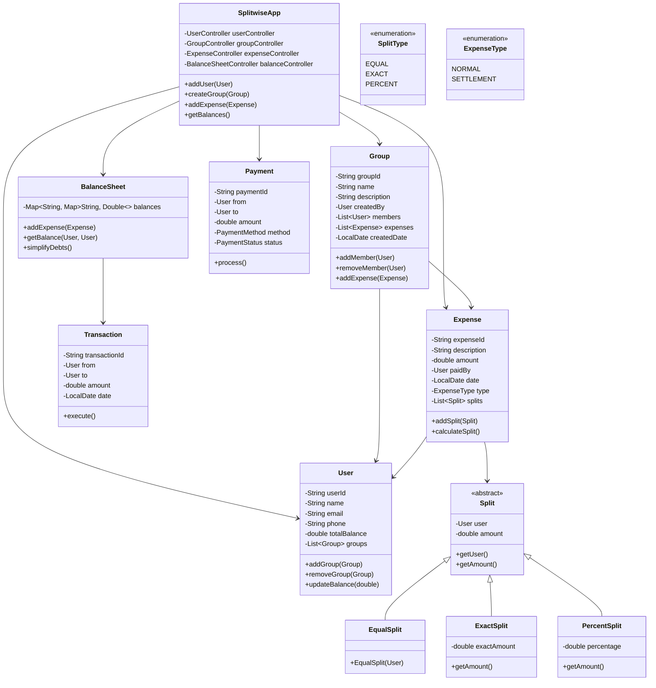
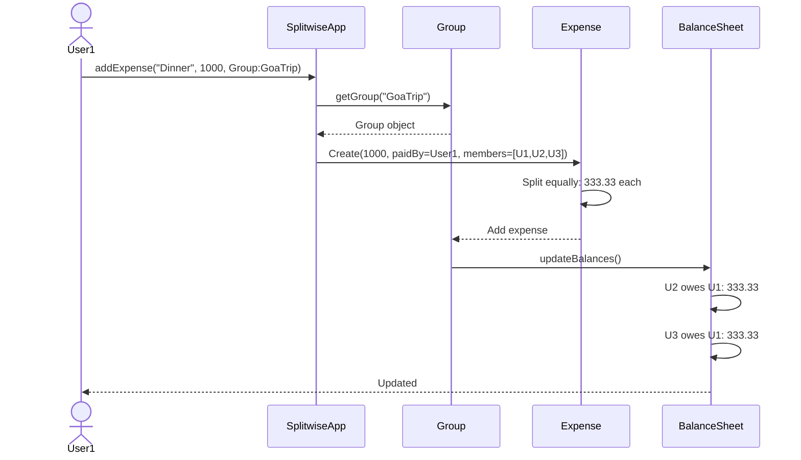
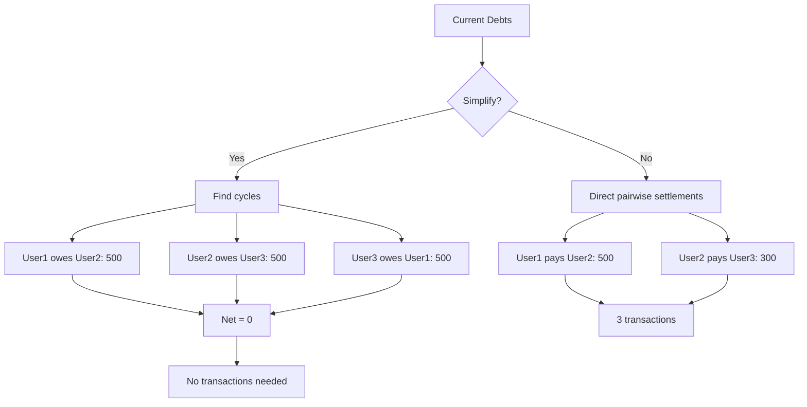

# Splitwise System - Complete LLD

## Class Diagram



## Components

### 1. **User** - System User
- **Attributes:**
  - `userId` (String) - Unique identifier
  - `name` (String) - Display name
  - `email` (String) - Contact email
  - `phone` (String) - Contact number
  - `totalBalance` (double) - Net balance across all groups
  - `groups` (List<Group>) - Groups user is part of

- **Methods:**
  - `addGroup(Group)` - Join group
  - `removeGroup(Group)` - Leave group
  - `updateBalance(double)` - Adjust balance

### 2. **Group** - Expense Group
- **Attributes:**
  - `groupId` (String) - Unique ID
  - `name` (String) - Group name (e.g., "Trip to Goa")
  - `description` (String) - Purpose
  - `createdBy` (User) - Group creator
  - `members` (List<User>) - Group participants
  - `expenses` (List<Expense>) - All expenses
  - `createdDate` (LocalDate) - Creation date

- **Methods:**
  - `addMember(User)` - Add participant
  - `removeMember(User)` - Remove participant
  - `addExpense(Expense)` - Record expense

### 3. **Expense** - Transaction Record
- **Attributes:**
  - `expenseId` (String) - Unique ID
  - `description` (String) - What was purchased
  - `amount` (double) - Total expense amount
  - `paidBy` (User) - Who paid
  - `date` (LocalDate) - When expense occurred
  - `type` (ExpenseType) - NORMAL or SETTLEMENT
  - `splits` (List<Split>) - How to split

- **Methods:**
  - `addSplit(Split)` - Add split detail
  - `calculateSplit()` - Compute individual shares

### 4. **Split** - Split Strategy (Hierarchy)
Abstract base class for different split types:

- **EqualSplit** - Divide equally among all
- **ExactSplit** - Specific amounts per person
- **PercentSplit** - Percentage-based split

### 5. **BalanceSheet** - Debt Management
- **Attributes:**
  - `balances` (Map<String, Map<String, Double>>) - Who owes whom

- **Methods:**
  - `addExpense(Expense)` - Update balances
  - `getBalance(User, User)` - Check debt between two users
  - `simplifyDebts()` - Minimize transactions

### 6. **Transaction** - Settlement Record
- **Attributes:**
  - `transactionId` (String) - Unique ID
  - `from` (User) - Payer
  - `to` (User) - Receiver
  - `amount` (double) - Settlement amount
  - `date` (LocalDate) - When settled

## Design Patterns Used

### 1. **Strategy Pattern** (Split Calculation)
```java
abstract class Split {
    User user;
    double amount;
}

class EqualSplit extends Split {
    public EqualSplit(User user) {
        this.user = user;
    }
}

class ExactSplit extends Split {
    double exactAmount;
}

class PercentSplit extends Split {
    double percentage;
    public double getAmount(double total) {
        return total * percentage / 100;
    }
}

// Usage:
Expense expense = new Expense("Dinner", 1000, paidBy);
expense.addSplit(new EqualSplit(user1));
expense.addSplit(new ExactSplit(user2, 300));
expense.addSplit(new PercentSplit(user3, 40));
```

### 2. **Observer Pattern** (Balance Updates)
```java
interface BalanceObserver {
    void onBalanceChanged(User user, double newBalance);
}

class EmailNotifier implements BalanceObserver {
    public void onBalanceChanged(User user, double newBalance) {
        sendEmail(user, "Your balance updated: " + newBalance);
    }
}
```

### 3. **Command Pattern** (Expense Operations)
```java
interface Command {
    void execute();
}

class AddExpenseCommand implements Command {
    private Group group;
    private Expense expense;
    
    public void execute() {
        group.addExpense(expense);
    }
}
```

## Flow Diagrams

### Add Expense Flow


### Simplify Debts Flow


### Equal Split Example
```
Total: ₹1500
Members: 4 (Alice, Bob, Charlie, David)

Equal Split:
Alice: 1500 / 4 = 375
Bob: 1500 / 4 = 375
Charlie: 1500 / 4 = 375
David: 1500 / 4 = 375

If Alice paid ₹1500:
Bob owes Alice: 375
Charlie owes Alice: 375
David owes Alice: 375
```

### Exact Split Example
```
Total: ₹1000
Paid by: Alice

Bob: 400
Charlie: 300
David: 300

Bob owes Alice: 400
Charlie owes Alice: 300
David owes Alice: 300
```

### Percent Split Example
```
Total: ₹2000
Paid by: Alice

Bob: 25% = 500
Charlie: 35% = 700
David: 40% = 800

Bob owes Alice: 500
Charlie owes Alice: 700
David owes Alice: 800
```

## How It Works - Step by Step

### 1. **Create Group**
```
User: "Let's plan Goa trip"
    ↓
Create group "Goa Trip"
    ↓
Add members: Alice, Bob, Charlie
    ↓
Group created with ID
    ↓
Members can now add expenses
```

### 2. **Add Expense**
```
Alice pays ₹3000 for hotel
    ↓
Create expense: "Hotel Booking"
Amount: 3000
Paid by: Alice
Group: Goa Trip
Split: Equal
    ↓
System calculates:
- Each person owes: 3000 / 3 = 1000
- Bob owes Alice: 1000
- Charlie owes Alice: 1000
    ↓
Update balance sheet
```

### 3. **Simplify Debts**
```
Current situation:
Bob owes Alice: 1000 (Hotel)
Alice owes Bob: 500 (Dinner)
Net: Bob owes Alice 500

Simplified:
Bob pays Alice: 500 (single transaction)

Algorithm:
1. Calculate net balance for each user
2. Separate into creditors and debtors
3. Match highest creditor with highest debtor
4. Settle min(credit, debt)
5. Repeat until all settled
```

### 4. **Settle Expense**
```
Bob pays Alice: 500 via UPI
    ↓
Record transaction
    ↓
Update balances:
Bob: +500 → balance = 0
Alice: -500 → balance = 0
    ↓
Transaction complete
```

## Debt Simplification Algorithm

### Greedy Two-Pointer Approach
```java
class DebtSimplifier {
    public List<Transaction> simplify(Map<String, Double> balances) {
        List<Transaction> transactions = new ArrayList<>();
        
        // Separate into creditors and debtors
        PriorityQueue<User> creditors = new PriorityQueue<>();
        PriorityQueue<User> debtors = new PriorityQueue<>();
        
        for (Map.Entry<String, Double> entry : balances.entrySet()) {
            if (entry.getValue() > 0) {
                creditors.add(new User(entry.getKey(), entry.getValue()));
            } else if (entry.getValue() < 0) {
                debtors.add(new User(entry.getKey(), Math.abs(entry.getValue())));
            }
        }
        
        // Settle debts
        while (!creditors.isEmpty() && !debtors.isEmpty()) {
            User creditor = creditors.poll();
            User debtor = debtors.poll();
            
            double amount = Math.min(creditor.getBalance(), debtor.getBalance());
            transactions.add(new Transaction(debtor, creditor, amount));
            
            double remaining = creditor.getBalance() - amount;
            if (remaining > 0) {
                creditors.add(new User(creditor.getName(), remaining));
            }
            
            double debtorRemaining = debtor.getBalance() - amount;
            if (debtorRemaining > 0) {
                debtors.add(new User(debtor.getName(), debtorRemaining));
            }
        }
        
        return transactions;
    }
}
```

## Time & Space Complexity

### Time Complexity
- **Add expense:** O(1)
- **Calculate balances:** O(G × E) - G groups, E expenses per group
- **Simplify debts:** O(N log N) - N users (due to priority queue)
- **Get balance:** O(1)

### Space Complexity
- **O(G × U × E)** - G groups, U users, E expenses per group
- **O(U)** - Balance sheet storage

## Real-World Considerations

### 1. **Concurrency**
```java
public synchronized void addExpense(Expense expense) {
    // Thread-safe expense addition
    group.addExpense(expense);
    balanceSheet.updateBalances(expense);
}
```

### 2. **Accuracy**
- Use BigDecimal instead of double for currency
- Avoid floating point errors

```java
BigDecimal amount = new BigDecimal("1000.50");
BigDecimal split = amount.divide(new BigDecimal(3), RoundingMode.HALF_UP);
```

### 3. **Privacy**
- Group expenses visible only to members
- Personal expenses private

### 4. **Notifications**
- Email/SMS when added to group
- Payment reminders
- Balance updates

## Interview Questions & Answers

### Q1: How to handle complex expense splits?
**A:** Use strategy pattern with multiple split types:
```java
interface SplitStrategy {
    Map<User, Double> calculateSplit(double amount, List<User> members);
}

class EqualSplitStrategy implements SplitStrategy {
    public Map<User, Double> calculateSplit(double amount, List<User> members) {
        double perPerson = amount / members.size();
        return members.stream().collect(Collectors.toMap(u -> u, u -> perPerson));
    }
}
```

### Q2: How to minimize transactions in debt simplification?
**A:** Greedy approach with two-pointer:
1. Calculate net balance for each user
2. Separate into creditors (+ve) and debtors (-ve)
3. Sort both by amount (descending)
4. Match largest creditor with largest debtor
5. Settle min(credit, debt)
6. Repeat until all settled

Result: At most N-1 transactions for N users.

### Q3: What if there are circular debts?
**A:** Detect cycles in dependency graph:
```
A owes B: 100
B owes C: 100
C owes A: 100

Net: No one owes anything!
Algorithm:
1. Build directed graph
2. Find cycles
3. Cancel out cycle amounts
4. Settle only net balances
```

### Q4: How to make it scalable for millions of users?
**A:** 
- Use microservices: User service, Group service, Expense service
- Shard by user ID or group ID
- Use message queues for async balance updates
- Cache frequent queries (Redis)

## Common Mistakes

| Mistake | Problem | Fix |
|---------|---------|-----|
| Using double for money | Precision errors | Use BigDecimal |
| Not handling edge cases | Division by zero, empty groups | Validate inputs |
| Storing redundant data | Data inconsistency | Single source of truth |
| No transaction rollback | Partial updates on failure | Use database transactions |
| Ignoring concurrency | Corrupted balances | Synchronized or optimistic locking |

## Extensions for Production

1. **Recurring expenses** - Monthly rent, subscriptions
2. **Expense categories** - Food, travel, utilities
3. **Receipt upload** - OCR for automatic entry
4. **Payment gateway integration** - UPI, cards, wallets
5. **Group chats** - Discuss expenses within group
6. **Analytics** - Spending patterns, who owes most
7. **Reminders** - Payment due notifications
8. **Multi-currency** - International trips

## Quick Reference

```
Split Types:
- EQUAL: Divide equally
- EXACT: Specific amounts
- PERCENT: Percentage-based

Expense Types:
- NORMAL: Regular expense
- SETTLEMENT: Debt repayment

Key Algorithms:
- Split calculation: O(1)
- Balance calculation: O(G × E)
- Debt simplification: O(N log N)

Key Classes:
- User (participant)
- Group (collection of users)
- Expense (transaction record)
- Split (split strategy)
- BalanceSheet (debt tracking)

Data Structures:
- HashMap<User, Double> for balances
- PriorityQueue for debt simplification
- List<Split> for expense splits

Best Practices:
1. Use BigDecimal for currency
2. Validate all inputs
3. Handle edge cases (0 members, 0 amount)
4. Thread-safe balance updates
5. Audit trail for all transactions