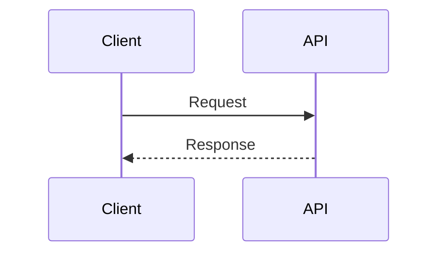

# Interview Classroom Content Template

**ENFORCEMENT: This template is MANDATORY. Every generated concept file must follow this structure exactly.**
**FAILURE TO FOLLOW = CONTENT IS INCOMPLETE AND MUST BE REGENERATED.**

```markdown
# Concept Name

## 1. Why This Concept Matters

Explain in simple language where this is used in real projects and interviews.

MUST include:
- Real project usage with specific example (e.g., "OrderService in your e-commerce app uses Strategy for payment processing")
- What problem it solves (be specific — not "code reusability" but "without Strategy, adding new payment method requires modifying checkout class, breaking open/closed")
- Why interviewers ask it (what they're testing)
- What can go wrong if misunderstood (production consequences)

## 2. Basic Meaning

Explain like teaching a beginner.

MUST include:
- Plain English definition (no jargon without explanation)
- Small analogy if useful
- Key vocabulary with definitions
- What it is NOT (common confusion)

## 3. Real Code / Real Example

Show the simplest working example. Use the right format for the topic:
- Java/code for programming topics
- SQL for database topics
- API request/response for backend topics
- config for DevOps/cloud topics
- Mermaid or text flow for system design topics

```java
// MUST use REAL executable code — NO pseudocode with /* ... */ or placeholders
// MUST use realistic class names (OrderService, PaymentProcessor) — NOT Foo/Bar
// MUST show expected output/result where applicable
```

Expected output/result:
```
Show exact output here
```

For backend/security/system topics, include actual request/response examples when relevant:

```http
GET /api/orders
Authorization: Bearer <token>
```

For Spring/backend topics, include minimal controller/service/config/filter code when relevant.

If companion files are created, link them:

```markdown
Example files:
- [JwtService.java](examples/JwtService.java)
- [SecurityConfig.java](examples/SecurityConfig.java)
```

For flow-heavy topics, include Mermaid:



## 4. What Happens Internally

Explain implementation/internal behavior.

For code: compiler/runtime/library behavior.
For database: optimizer/index/lock/storage behavior.
For system design: request flow, data flow, failure flow.
For cloud/DevOps: control plane/data plane/runtime behavior.

MUST include:
- Step-by-step flow
- For auth/security topics: what client sends, what server verifies, what is trusted vs not trusted, what happens on success, what happens on failure
- Internal data structures where relevant

## 5. Tricky Interview Cases

Add confusing examples and explain output step by step.

MUST include:
- At least 3-4 cases (minimum 3, target 4-5)
- Common traps
- Edge cases
- Wrong assumptions
- Scenario questions
- "what if" variations
- EXPLICIT output values — state exactly what prints/returns

For each case:
- Show the code
- State the exact output
- Explain WHY it happens
- Mention version/configuration differences when relevant

## 6. Common Mistakes

List mistakes candidates make.

MUST include:
- Table format with minimum 4 rows
- Columns: Mistake | Problem | Fix
- Include beginner mistakes AND production mistakes
- Be specific about consequences

## 7. Production Usage

Explain how a senior engineer uses this in real systems.

MUST include:
- Production architecture (show how it fits in real system)
- Monitoring/debugging (how to detect issues)
- Configuration (real config examples)
- Security concerns where relevant
- Testing strategy
- Failure handling

## 8. Advanced Details

Go deeper: edge cases, performance, memory, design tradeoffs.

MUST include:
- Scalability concerns
- Security concerns
- Version/config differences
- Tradeoffs (when to use vs not use)
- How senior engineers design around limitations
- Performance numbers where relevant

## 9. Interview Questions And Answers

Add beginner, intermediate, senior, and tricky follow-up questions.

MUST include exactly 4 questions labeled as below:

### Beginner

Q:
A:

### Intermediate

Q:
A:

### Senior

Q:
A:

### Tricky

Q:
A:

Each answer must have real substance — not vague hand-waving. Include code examples where helpful.

## 10. Final 30-Second Answer

Give a crisp interview-ready summary.

MUST be:
- Under 50 words
- Memorable
- Covers the core concept in one breath
- No bullet points — flowing sentence(s)
```

## Quality Checklist (MANDATORY BEFORE COMPLETION)

Before marking any concept as complete, verify ALL of these:

- [ ] File has all 10 sections (section headers exactly as above)
- [ ] Section 1 explains WHY this matters in real projects (not just "it's useful")
- [ ] Section 3 has REAL executable code (not pseudocode with `/* ... */`)
- [ ] Section 3 shows expected output/result where applicable
- [ ] Section 4 explains internals step-by-step (not just API listing)
- [ ] Section 5 has at least 3 tricky cases with EXPLICIT output values
- [ ] Section 6 is a table with minimum 4 rows
- [ ] Section 7 includes production config/architecture/diagram
- [ ] Section 8 includes performance/scalability/security considerations
- [ ] Section 9 has exactly 4 Q&As labeled Beginner/Intermediate/Senior/Tricky
- [ ] Section 10 is under 50 words and memorable
- [ ] Total file length > 200 lines (shallow content is unacceptable)
- [ ] No section contains just a list without explanation
- [ ] Code examples use realistic class/method names (not Foo/Bar)

If ANY checkbox fails, regenerate the content before completion.