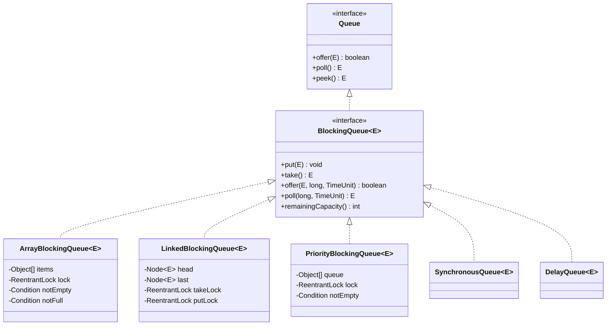

# BlockingQueue — Complete Deep Dive

## 1. Why This Concept Matters

BlockingQueue is the cornerstone of producer-consumer patterns in Java. It provides blocking reads/writes when a queue is empty/full, enabling safe thread coordination without explicit wait/notify. In production, BlockingQueue powers thread pools, async task processing, pipeline architectures, and backpressure mechanisms. Interviewers test this because it reveals understanding of concurrent data structures, producer-consumer patterns, and the Executor framework.

Misunderstanding BlockingQueue causes:
- Busy-waiting on empty/full queues instead of blocking
- Deadlocks from incorrect capacity/buffer sizing
- `IllegalStateException` from using `add()` instead of `offer()`
- Performance bottlenecks from wrong queue type for the workload

## 1.5 Collection Hierarchy




## 2. Basic Meaning

BlockingQueue is a Queue that supports operations that wait for space to become available (when full) or for an element to appear (when empty).

**Key vocabulary:**
- **`put()`**: blocks when full, waits for space
- **`take()`**: blocks when empty, waits for element
- **`offer(e, time, unit)`**: timed wait with timeout
- **`poll(time, unit)`**: timed wait for element
- **`drainTo()`**: bulk remove to another collection
- **`ArrayBlockingQueue`**: bounded, array-backed, single lock
- **`LinkedBlockingQueue`**: optionally bounded, linked nodes, two locks
- **`SynchronousQueue`**: zero capacity, direct handoff
- **`PriorityBlockingQueue`**: priority-ordered, unbounded
- **`DelayQueue`**: delayed retrieval based on timeout

What it is NOT: BlockingQueue is not a general-purpose queue. It is designed for multi-threaded producer-consumer scenarios. It does not replace `ArrayDeque` for non-blocking single-threaded use.

## 3. Real Code / Real Example

```java
import java.util.concurrent.*;

public class BlockingQueueDemo {
    public static void main(String[] args) throws InterruptedException {
        // === ARRAYBLOCKINGQUEUE (bounded, array-backed) ===
        BlockingQueue<String> abq = new ArrayBlockingQueue<>(3); // capacity 3
        abq.put("A");
        abq.put("B");
        abq.put("C");
        System.out.println("ArrayBlockingQueue full: " + abq);
        // abq.put("D"); // BLOCKS until space available (or interrupted)

        // === LINKEDBLOCKINGQUEUE (optionally bounded) ===
        BlockingQueue<Integer> lbq = new LinkedBlockingQueue<>(100);
        lbq.offer(1); // returns true
        lbq.offer(2);
        lbq.offer(3);
        System.out.println("LinkedBlockingQueue: " + lbq);

        // === PRODUCER-CONSUMER ===
        BlockingQueue<Integer> queue = new ArrayBlockingQueue<>(5);
        
        // Producer
        Thread producer = new Thread(() -> {
            for (int i = 1; i <= 10; i++) {
                try {
                    queue.put(i); // blocks if queue full
                    System.out.println("Produced: " + i);
                    Thread.sleep(100);
                } catch (InterruptedException e) { Thread.currentThread().interrupt(); }
            }
        });

        // Consumer
        Thread consumer = new Thread(() -> {
            for (int i = 0; i < 10; i++) {
                try {
                    Integer val = queue.take(); // blocks if queue empty
                    System.out.println("Consumed: " + val);
                    Thread.sleep(200);
                } catch (InterruptedException e) { Thread.currentThread().interrupt(); }
            }
        });

        producer.start(); consumer.start();
        producer.join(); consumer.join();

        // === POLL WITH TIMEOUT ===
        BlockingQueue<String> timeoutQueue = new ArrayBlockingQueue<>(2);
        timeoutQueue.put("A");
        String val = timeoutQueue.poll(500, TimeUnit.MILLISECONDS); // waits 500ms
        System.out.println("Polled: " + val); // A
        String missed = timeoutQueue.poll(500, TimeUnit.MILLISECONDS); // waits, returns null
        System.out.println("Missed (null): " + missed); // null

        // === OFFER WITH TIMEOUT ===
        BlockingQueue<String> full = new ArrayBlockingQueue<>(1);
        full.put("X");
        boolean offered = full.offer("Y", 1, TimeUnit.SECONDS); // waits 1s, then false
        System.out.println("Offered Y to full queue: " + offered); // false

        // === SYNCHRONOUSQUEUE (zero capacity) ===
        BlockingQueue<Integer> sync = new SynchronousQueue<>();
        Thread sender = new Thread(() -> {
            try { sync.put(42); } catch (InterruptedException e) { Thread.currentThread().interrupt(); }
            System.out.println("Sent 42");
        });
        Thread receiver = new Thread(() -> {
            try {
                Integer v = sync.take(); // blocks until sender puts
                System.out.println("Received: " + v);
            } catch (InterruptedException e) { Thread.currentThread().interrupt(); }
        });
        sender.start(); receiver.start();
        sender.join(); receiver.join();

        // === DRAINTO (bulk consume) ===
        BlockingQueue<Integer> drain = new ArrayBlockingQueue<>(List.of(1, 2, 3, 4, 5));
        List<Integer> drained = new ArrayList<>();
        drain.drainTo(drained); // removes ALL available elements
        System.out.println("Drained: " + drained); // [1, 2, 3, 4, 5]
        System.out.println("Queue after drain: " + drain); // []

        // === REMAINING CAPACITY ===
        BlockingQueue<String> bounded = new ArrayBlockingQueue<>(5);
        bounded.put("A");
        bounded.put("B");
        System.out.println("Remaining capacity: " + bounded.remainingCapacity()); // 3
    }
}
```

Expected output:
```
Produced: 1
Produced: 2
...
Consumed: 1
Consumed: 2
...
Polled: A
Missed (null): null
Offered Y to full queue: false
Sent 42
Received: 42
Drained: [1, 2, 3, 4, 5]
Queue after drain: []
Remaining capacity: 3
```

## 4. What Happens Internally

**ArrayBlockingQueue structure:**
```java
public class ArrayBlockingQueue<E> implements BlockingQueue<E>, Serializable {
    private final Object[] items;
    private int count;
    private int putIndex;  // next insertion point
    private int takeIndex; // next removal point
    private final ReentrantLock lock; // single lock for both put/take
    private final Condition notEmpty;
    private final Condition notFull;
}
```

Single `ReentrantLock` protects all operations. `notEmpty` condition signaled on `put()`, awaited on `take()`. `notFull` condition signaled on `take()`, awaited on `put()`.

**`put(E e)` flow:**
```java
public void put(E e) throws InterruptedException {
    if (e == null) throw new NullPointerException();
    final ReentrantLock lock = this.lock;
    lock.lockInterruptibly();
    try {
        while (count == items.length) notFull.await(); // wait if full
        insert(e);
        notEmpty.signal(); // wake up waiting takers
    } finally { lock.unlock(); }
}
```

Blocks when `count == items.length` (full). Waits on `notFull` condition.

**`take()` flow:**
```java
public E take() InterruptedException {
    final ReentrantLock lock = this.lock;
    lock.lockInterruptibly();
    try {
        while (count == 0) notEmpty.await(); // wait if empty
        E x = extract();
        notFull.signal(); // wake up waiting putters
        return;
    } finally { lock.unlock(); }
}
```

Blocks when `count == 0` (empty). Waits on `notEmpty` condition.

**LinkedBlockingQueue structure:**
```java
public class LinkedBlockingQueue<E> implements BlockingQueue<E>, Serializable {
    private final int capacity;
    private final AtomicInteger count = new AtomicInteger();
    private final Node<E> head; // dummy node
    private Node<E> last;       // last real node
    private final ReentrantLock putLock = new ReentrantLock();
    private final ReentrantLock takeLock = new ReentrantLock();
    private final Condition notEmpty;
    private final Condition notFull;
}
```

Two separate locks (`putLock` and `takeLock`) enable concurrent puts and takes. This is the key difference from `ArrayBlockingQueue`.

**`SynchronousQueue` behavior:**
Zero-capacity queue. Every `put()` blocks until a `take()` receives it. Every `take()` blocks until a `put()` sends it. Direct handoff — no buffering.

Used by `Executors.newCachedThreadPool()` — tasks handed directly to worker threads.

**`drainTo()`:**
Atomically moves all available elements from queue to target collection under lock. Efficient for batch consumption.

## 5. Tricky Interview Cases

**Case 1 — `add()` vs `offer()` vs `put()`**
```java
BlockingQueue<String> q = new ArrayBlockingQueue<>(1);
q.add("A");      // true — throws IllegalStateException if full
q.offer("B");    // false — returns false if full, no block
q.put("C");      // BLOCKS indefinitely until space
q.offer("D", 1, TimeUnit.SECONDS); // waits 1s, then false
```
Output: `add("A")` returns true. `offer("B")` returns `false`. `put("C")` blocks.
Explanation: Different strategies for full queue.

**Case 2 — `poll()` vs `take()`**
```java
BlockingQueue<String> q = new ArrayBlockingQueue<>(1);
q.put("A");
System.out.println(q.poll(1, TimeUnit.SECONDS)); // A
System.out.println(q.poll(1, TimeUnit.SECONDS)); // null (waits 1s, empty)
System.out.println(q.take()); // blocks forever (or until interrupted)
```
Output: First poll returns A, second returns null, third blocks.

**Case 3 — LinkedBlockingQueue concurrent put+take**
```java
LinkedBlockingQueue<Integer> lbq = new LinkedBlockingQueue<>(10);
Thread producer = new Thread(() -> {
    for (int i = 0; i < 100; i++) {
        lbq.put(i); // takes putLock
    }
});
Thread consumer = new Thread(() -> {
    for (int i = 0; i < 100; i++) {
        try { lbq.take(); } catch (InterruptedException e) {}
        // takes takeLock — CAN run CONCURRENTLY with producer!
    }
});
producer.start(); consumer.start();
producer.join(); consumer.join();
```
Output: Concurrent — put and take can run simultaneously.
Explanation: Two separate locks enable parallel producer and consumer.

**Case 4 — `drainTo` under concurrent modification**
```java
BlockingQueue<Integer> q = new ArrayBlockingQueue<>(100);
for (int i = 0; i < 10; i++) q.put(i);
List<Integer> list = new ArrayList<>();
q.drainTo(list); // atomically removes all 10
System.out.println(list.size()); // 10
System.out.println(q.size()); // 0
```
Output: Atomic bulk removal under single lock.

**Case 5 — `SynchronousQueue` transfer pattern**
```java
BlockingQueue<String> queue = new SynchronousQueue<>();
new Thread(() -> { try { queue.put("hello"); } catch (InterruptedException e) {} }).start();
new Thread(() -> { try { System.out.println(queue.take()); } catch (InterruptedException e) {} }).start();
```
Output: `"hello"` printed — direct handoff.
Explanation: No buffering. Producer blocks until consumer is ready.

## 6. Common Mistakes

| Mistake | Problem | Fix |
|---------|---------|-----|
| `add()` on full queue | `IllegalStateException` | Use `offer()` or `put()` |
| `poll()` without timeout on empty queue | Returns null, may miss data | Check for null, or use `take()` |
| Not handling `InterruptedException` | Loses interrupt status | `Thread.currentThread().interrupt()` |
| Using `ArrayBlockingQueue` with high contention | Single lock = bottleneck | Use `LinkedBlockingQueue` (two locks) |
| `SynchronousQueue` expecting buffering | Zero capacity — blocks until handoff | Understand it's direct transfer, not buffer |
| `drainTo()` on non-BlockingQueue | Compile error | Must use BlockingQueue type |

## 7. Production Usage

**Producer-consumer pipeline:**
```java
BlockingQueue<Request> queue = new ArrayBlockingQueue<>(1000);
// Producers
for (int i = 0; i < 10; i++) {
    new Thread(() -> {
        while (true) {
            Request r = createRequest();
            try { queue.put(r); } catch (InterruptedException e) { break; }
        }
    }).start();
}
// Consumers
for (int i = 0; i < 5; i++) {
    new Thread(() -> {
        while (true) {
            try { Request r = queue.take(); process(r); } catch (InterruptedException e) { break; }
        }
    }).start();
}
```

**Thread pool task queue:**
```java
ThreadPoolExecutor executor = new ThreadPoolExecutor(
    4, 8, 60, TimeUnit.SECONDS,
    new ArrayBlockingQueue<>(100), // bounded work queue
    new ThreadPoolExecutor.CallerRunsPolicy()
);
```
`ArrayBlockingQueue` provides backpressure when all threads busy.

**Spring `TaskExecutor`:**
```java
@Configuration
public class AsyncConfig {
    @Bean
    public ThreadPoolTaskExecutor taskExecutor() {
        ThreadPoolTaskExecutor exec = new ThreadPoolTaskExecutor();
        exec.setCorePoolSize(4);
        exec.setMaxPoolSize(8);
        exec.setQueueCapacity(100); // uses ArrayBlockingQueue internally
        exec.initialize();
        return exec;
    }
}
```

## 8. Advanced Details

- **`ArrayBlockingQueue` fairness:** Constructor `new ArrayBlockingQueue(capacity, true)` enables fair ordering (FIFO for waiting threads). Increases throughput cost.
- **`LinkedBlockingQueue` capacity:** Default `Integer.MAX_VALUE` (unbounded). Always specify capacity for bounded behavior.
- **`SynchronousQueue` in `Executors.newCachedThreadPool()`:** Each `execute()` creates new thread (or reuses idle). No queueing — direct handoff.
- **`PriorityBlockingQueue`:** Unbounded, uses `PriorityQueue` internally. `take()` blocks on empty. `put()` never blocks (unbounded).
- **`DelayQueue`:** Elements implement `Delayed` interface. `take()` returns only expired elements. Used for scheduled tasks, cache eviction.
- **Condition signaling:** `signal()` wakes one waiter, `signalAll()` wakes all. BlockingQueue uses `signal()` — wakes one taker or putter.
- **Memory consistency:** `put()` on full queue: `notFull.await()` releases lock and waits. `take()` signals `notFull` when element removed.

## 9. Interview Questions And Answers

### Beginner
Q: What is BlockingQueue? What is the difference between `put()` and `offer()`?
A: BlockingQueue supports blocking reads/writes when empty/full. `put()` blocks until space is available. `offer()` returns immediately with boolean (or timeout variant). `take()` blocks until element available. `poll()` returns null if empty (or timeout variant).

### Intermediate
Q: What is the difference between ArrayBlockingQueue and LinkedBlockingQueue?
A: `ArrayBlockingQueue`: bounded, single lock (one thread can put/take at a time), array-backed, pre-configured capacity. `LinkedBlockingQueue`: optionally bounded (default unbounded), two locks (concurrent put+take), linked nodes, default capacity `Integer.MAX_VALUE`.

Use `ArrayBlockingQueue` when you need strict capacity control. Use `LinkedBlockingQueue` when you need higher concurrency.

### Senior
Q: You need to implement a backpressure mechanism for a stream processing system. Producers generate 100K events/sec, consumers process 10K events/sec. Using BlockingQueue, how do you prevent producers from overwhelming consumers? What happens when the queue fills?
A: Use `ArrayBlockingQueue` with capacity = `(producer_rate - consumer_rate) * max_burst_time`:
```java
BlockingQueue<Event> queue = new ArrayBlockingQueue<>(10_000); // 10s burst buffer
```
When 10K producer calls `put()` and queue fills, producers BLOCK. Consumers drain at 10K/sec, creating space. Producers wake and resume.

Tradeoff: If producers are time-critical, use `offer(timeout)` and drop/sample excess events instead of blocking.

### Tricky
Q: `LinkedBlockingQueue` uses two separate locks for put and take. What is the performance implication? Can `size()` return inconsistent values under concurrent access?
A: Two locks enable concurrent puts AND concurrent takes — throughput ~2x under contention vs `ArrayBlockingQueue`.

`size()` uses `AtomicInteger count`. Reads are atomic, but value is approximate between put and take operations (inconsistent snapshot). `remainingCapacity()` also approximate.

## 10. Final 30-Second Answer

BlockingQueue = thread-safe queue with blocking reads/writes. `put()` blocks when full, `take()` blocks when empty. `offer(timeout)` / `poll(timeout)` for bounded waits. **ArrayBlockingQueue**: bounded, single lock. **LinkedBlockingQueue**: optionally bounded, two locks (better concurrency). **SynchronousQueue**: zero capacity, direct handoff. **PriorityBlockingQueue**: unbounded, ordered. **`drainTo()`**: bulk consume. Use in producer-consumer: producer `put()`, consumer `take()`. Prefer bounded queue for backpressure. Handle `InterruptedException` properly.