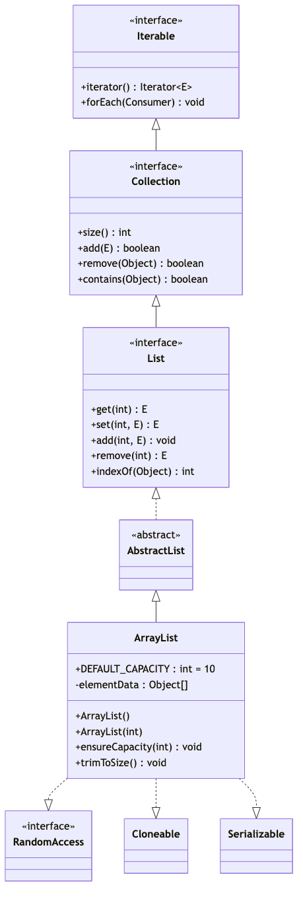
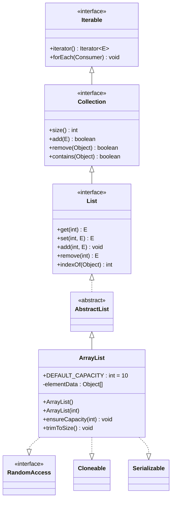
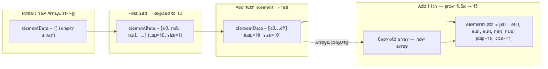
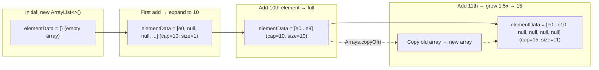
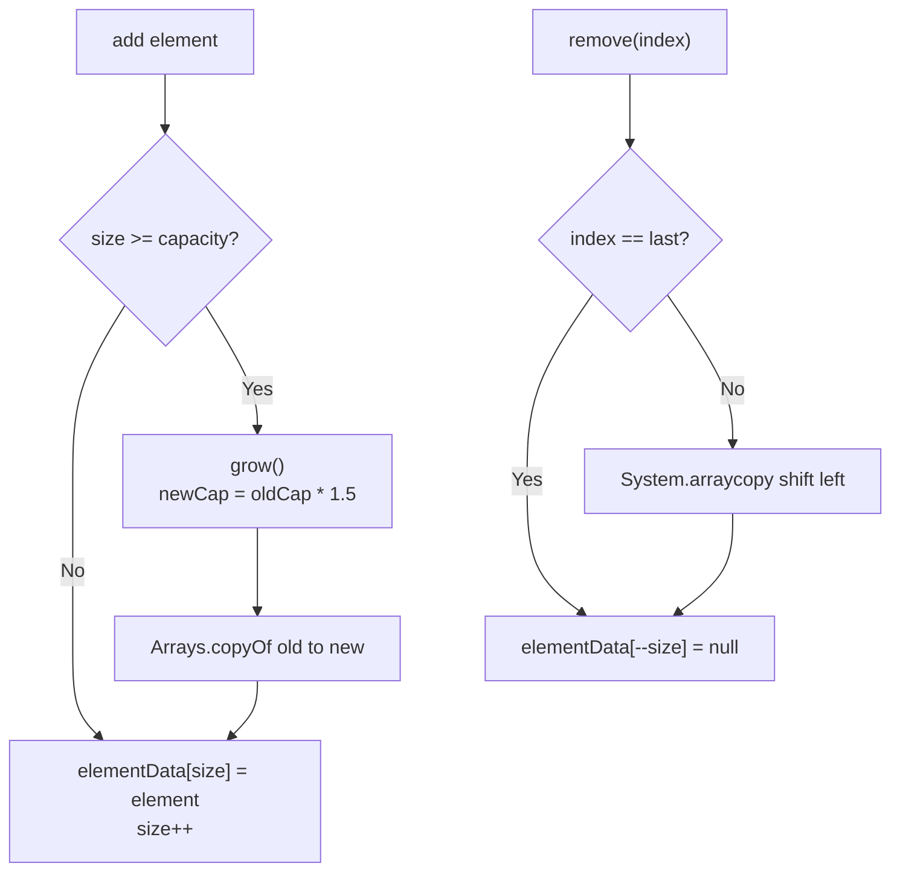
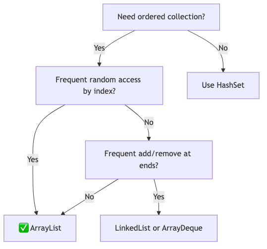
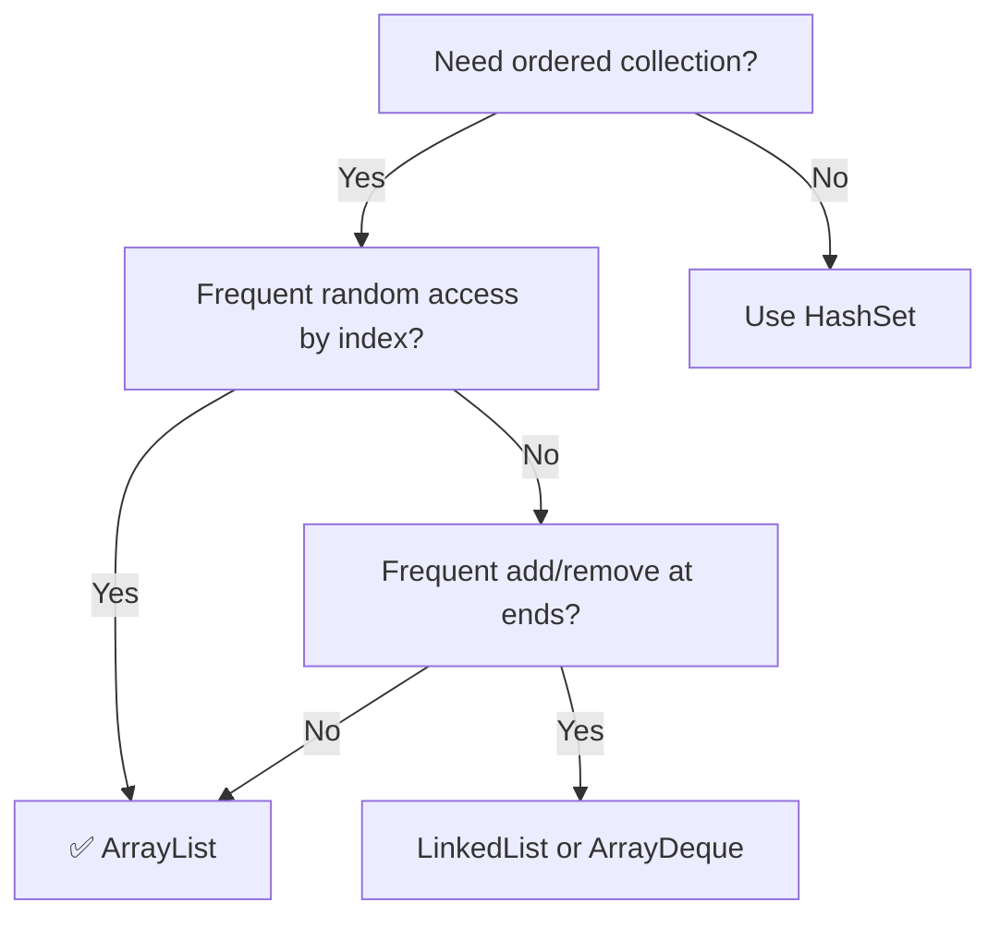

# ArrayList — Complete Deep Dive

## 1. Hierarchy & Position






**Implements**: `List<E>`, `RandomAccess`, `Cloneable`, `java.io.Serializable`
**Extends**: `AbstractList<E>`

## 2. Internal Structure

```java
public class ArrayList<E> extends AbstractList<E>
        implements List<E>, RandomAccess, Cloneable, java.io.Serializable {
    
    // DEFAULT_CAPACITY = 10 (first expansion target)
    private static final int DEFAULT_CAPACITY = 10;
    
    // Shared empty array for default-constructed lists (Java 8+)
    private static final Object[] DEFAULTCAPACITY_EMPTY_ELEMENTDATA = {};
    
    // The actual data buffer — NOT serialized fully (custom serialization)
    transient Object[] elementData;  // non-private for inner class access
```

(rest of existing content follows, just the mermaid diagram was updated at the top)

```
Iterable
  └── Collection
        └── List (interface: ordered, indexed, allows duplicates)
              └── AbstractList
                    └── ArrayList
```

## 3. What is ArrayList?

ArrayList is a **resizable array** implementation of the `List` interface. Unlike a regular array (fixed size), ArrayList grows automatically when elements are added beyond its current capacity.

```java
// Internal: Object[] elementData
// Default capacity: 10
// Growth formula: newCapacity = oldCapacity + (oldCapacity >> 1)  → 1.5x growth
// Size is tracked separately via int size
```

### Growth Animation






## 4. Key Operations with Big-O

| Operation | Time Complexity | Explanation |
|-----------|----------------|-------------|
| `get(index)` | **O(1)** | Direct array access: `elementData[index]` |
| `set(index, value)` | **O(1)** | Direct array assignment |
| `add(element)` | **O(1) amortized** | Append at end. O(n) when resize occurs |
| `add(index, element)` | **O(n)** | Shift elements right: `System.arraycopy()` |
| `remove(index)` | **O(n)** | Shift elements left: `System.arraycopy()` |
| `remove(Object)` | **O(n)** | Linear search + shift |
| `contains(Object)` | **O(n)** | Linear search |
| `indexOf(Object)` | **O(n)** | Linear search |
| `clear()` | **O(n)** | Fill array with nulls (help GC) |
| `trimToSize()` | **O(n)** | Shrink capacity to current size |

## 5. Internal Operations Flow




## 6. Key Implementation Details

### Growth Logic

```java
private void grow(int minCapacity) {
    int oldCapacity = elementData.length;
    // 1.5x growth: oldCapacity + (oldCapacity >> 1)
    int newCapacity = oldCapacity + (oldCapacity >> 1);
    
    // If 1.5x isn't enough (e.g., addAll of many elements)
    if (newCapacity - minCapacity < 0)
        newCapacity = minCapacity;
    
    // Cap at MAX_ARRAY_SIZE (Integer.MAX_VALUE - 8)
    if (newCapacity - MAX_ARRAY_SIZE > 0)
        newCapacity = hugeCapacity(minCapacity);
    
    // Create new array and copy
    elementData = Arrays.copyOf(elementData, newCapacity);
}
```

### Add at Index

```java
public void add(int index, E element) {
    rangeCheckForAdd(index);  // Validate index
    ensureCapacityInternal(size + 1);  // Grow if needed
    
    // Shift right: [index..size-1] → [index+1..size]
    System.arraycopy(elementData, index,
                     elementData, index + 1, size - index);
    
    elementData[index] = element;
    size++;
}
```

### Remove at Index

```java
public E remove(int index) {
    rangeCheck(index);
    E oldValue = elementData(index);
    
    int numMoved = size - index - 1;
    if (numMoved > 0)
        // Shift left: [index+1..size-1] → [index..size-2]
        System.arraycopy(elementData, index + 1,
                         elementData, index, numMoved);
    
    // Clear last element for GC
    elementData[--size] = null;
    return oldValue;
}
```

## 7. SubList View

```java
// subList returns a VIEW backed by the original list
List<String> subList = list.subList(1, 4);

// Structural changes to EITHER list invalidates the other!
// If you modify the original list while a SubList view is active:
// → ConcurrentModificationException on next SubList operation
```

## 8. Serialization

```java
// ArrayList has CUSTOM serialization (not default)
// Why? elementData may have null slots (capacity > size)

private void writeObject(java.io.ObjectOutputStream s) {
    s.defaultWriteObject();    // Write size, modCount
    s.writeInt(size);          // Write size explicitly
    
    for (int i = 0; i < size; i++)
        s.writeObject(elementData[i]);  // Only write actual elements
}

private void readObject(java.io.ObjectInputStream s) {
    s.defaultReadObject();
    int size = s.readInt();
    
    // Allocate exactly enough space (no waste)
    elementData = new Object[size];
    for (int i = 0; i < size; i++)
        elementData[i] = s.readObject();
}
```

## 9. Thread Safety

```java
// ❌ ArrayList is NOT thread-safe
// Multiple threads reading/writing simultaneously → data corruption

// Option 1: Collections.synchronizedList()
List<String> syncList = Collections.synchronizedList(new ArrayList<>());

// Option 2: CopyOnWriteArrayList (if reads >> writes)
List<String> cowList = new CopyOnWriteArrayList<>();

// Option 3: Explicit synchronization
synchronized (list) {
    list.add("x");
    list.get(0);
}
```

## 10. Fail-Fast Iterator

```java
// ArrayList iterator is FAIL-FAST
// If the list is structurally modified AFTER iterator creation
// (except via iterator's own remove()), → ConcurrentModificationException

Iterator<String> it = list.iterator();
list.add("new");  // ❌ Structural modification!
it.next();        // → ConcurrentModificationException

// Fix: use ListIterator's add()/remove() or use for-each on copy
for (String s : new ArrayList<>(list)) {
    if (condition) list.remove(s);  // Safe on copy
}
```

## 11. When to Use ArrayList






**Use ArrayList when:**
- You need fast random access (`get/set` by index) — O(1)
- You mostly append to the end — O(1) amortized
- You rarely insert/remove from the middle — O(n) is acceptable
- You need predictable iteration order

## 12. Common Mistakes

| Mistake | Why It's Wrong | Correct |
|---------|---------------|---------|
| `new ArrayList<>(List.of(1,2,3)).remove(1)` | Removes at index 1, not value 1 | Use `remove(Integer.valueOf(1))` |
| Modifying list during foreach | `ConcurrentModificationException` | Use `removeIf()` or iterator.remove() |
| Returning `elementData` directly | Caller can modify internal array | Return copy: `Arrays.copyOf(elementData, size)` |
| Not setting initial capacity | Repeated resizing (costly for large lists) | `new ArrayList<>(expectedSize)` |
| Using `==` instead of `.equals()` | Reference comparison for contains() | Override equals() for custom objects |

## 13. Performance Comparison

```
Operation          ArrayList    LinkedList    ArrayDeque
──────────────     ─────────    ──────────    ─────────
get(i)             O(1)         O(n)          O(1)
addFirst           O(n)         O(1)          O(1)
addLast            O(1)*        O(1)          O(1)
removeFirst        O(n)         O(1)          O(1)
removeLast         O(1)         O(1)          O(1)
add(i, elem)       O(n)         O(n)          O(n)
Memory/node        1 ref        3 refs        1 ref
Cache locality     Excellent    Poor          Excellent

* amortized O(1) — occasional O(n) resize
```

## 14. Final 30-Second Answer

ArrayList = resizable array with O(1) get/set, O(1) amortized add at end, O(n) insert/remove in middle. Grows by 1.5x when full. Implements RandomAccess marker. Not thread-safe. Fail-fast iterators. Custom serialization (writes only `size` elements, not entire array). Best for: fast random access, append-heavy workloads, predictable iteration.