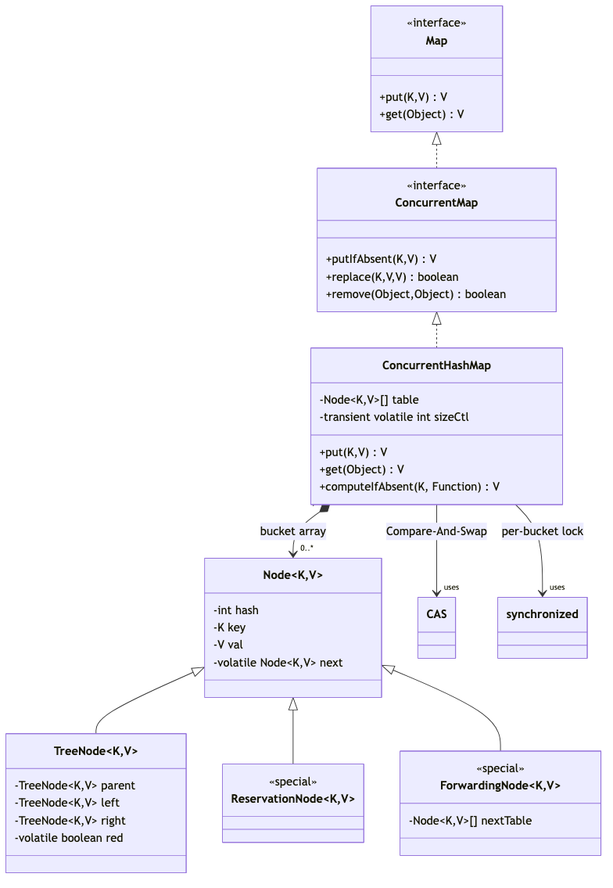
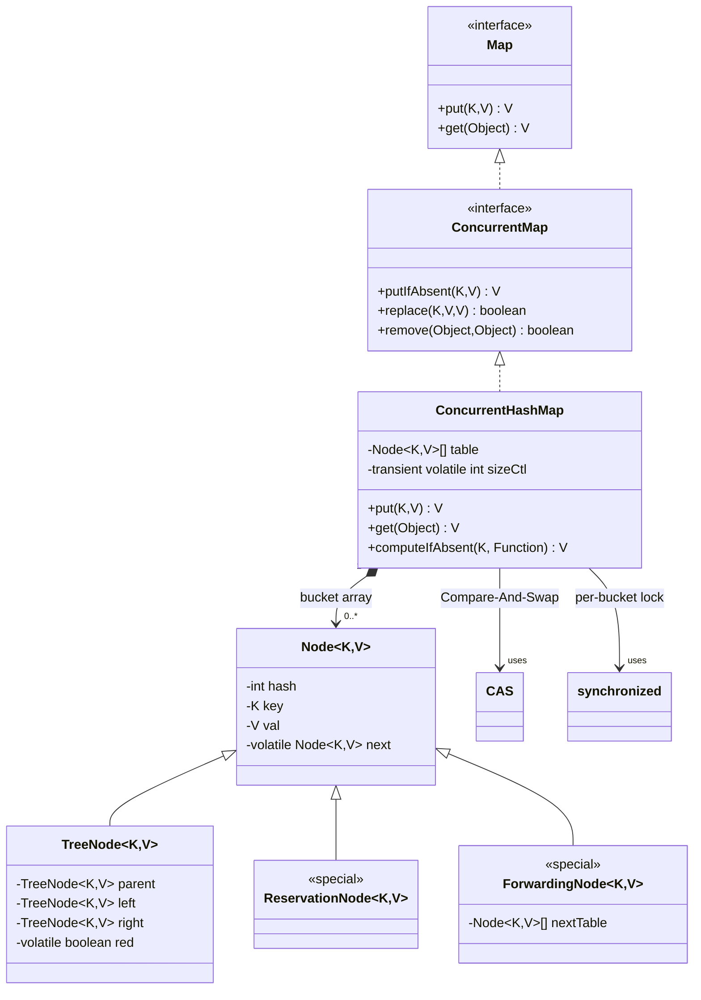

# ConcurrentHashMap — Complete Deep Dive

## 1. Hierarchy & Position






**Implements**: `ConcurrentMap<K,V>`, `Serializable`  
**Extends**: `AbstractMap<K,V>` (Java 8+ — no longer extends)

## 2. Internal Structure — Java 8+ Redesign

Java 8 completely rewrote ConcurrentHashMap. Java 7 used **Segment-based locking** (16 segments, each with its own lock). Java 8 uses **synchronized on the first node of each bucket** + **CAS (Compare-And-Swap)** operations. This gives much higher concurrency.

```java
public class ConcurrentHashMap<K,V> extends AbstractMap<K,V>
        implements ConcurrentMap<K,V>, Serializable {

    // TABLE SIZE: similar to HashMap (power of 2)
    // DEFAULT CAPACITY: 16
    // LOAD FACTOR: 0.75 (used only for initial capacity calculation)
    // CONCURRENCY LEVEL: no longer used (Java 8+)
    
    transient volatile Node<K,V>[] table;      // The bucket array (volatile!)
    private transient volatile Node<K,V>[] nextTable;  // For resize (next table)
    private transient volatile long baseCount;          // Base counter (uncontended)
    private transient volatile int sizeCtl;             // Control flag
    // -1: initializing, -N: N-1 threads resizing, positive: threshold
    private transient volatile int transferIndex;       // Resize progress
    
    // Counter cells for high-contention counting
    private transient volatile CounterCell[] counterCells;
    
    // Node structure:
    static class Node<K,V> implements Map.Entry<K,V> {
        final int hash;
        final K key;
        volatile V val;       // Value is VOLATILE (visibility without locking!)
        volatile Node<K,V> next;  // Next is VOLATILE
    }
    
    // Reservation node (for computeIfAbsent)
    static final class ReservationNode<K,V> extends Node<K,V> { }
    
    // Tree node (when bucket has 8+):
    static final class TreeNode<K,V> extends Node<K,V> { ... }
    
    // Tree bin (head of tree — contains lock-free reader access):
    static final class TreeBin<K,V> extends Node<K,V> { ... }
}
```

## 3. Java 7 vs Java 8 — Key Differences

| Aspect | Java 7 | Java 8+ |
|--------|--------|---------|
| Locking | 16 Segments, each with ReentrantLock | **synchronized on first node** of each bucket |
| Concurrency | Max 16 concurrent writes (1 per segment) | **Per-bucket locking** — much higher |
| Reads | Volatile read, no lock | **Lock-free** (volatile + happens-before via CAS) |
| get() | Segment → bucket → entry | **Direct bucket** (no segment indirection) |
| put() | Lock segment → find bucket → insert | **spin + CAS** on empty bucket, **synchronize** on first node |
| Collisions | Linked list (O(n) worst) | Linked list → **Red-Black tree** at 8 (O(log n)) |
| Size | Sum segment sizes (locking) | **CounterCells** + baseCount (lock-free, approximate) |
| Null key/value | NOT allowed (throws NPE) | NOT allowed (same) |
| Memory | Higher (Segment objects) | Lower (no Segment objects) |

## 4. Put Operation — Lock-free + Synchronized

```java
public V put(K key, V value) {
    return putVal(key, value, false);
}

final V putVal(K key, V value, boolean onlyIfAbsent) {
    if (key == null || value == null) throw new NullPointerException(); // NO nulls!
    
    int hash = spread(key.hashCode());  // h ^ (h >>> 16)
    int binCount = 0;
    
    for (Node<K,V>[] tab = table;;) {         // CAS loop (spin until success)
        Node<K,V> f; int n, i, fh;
        
        if (tab == null || (n = tab.length) == 0)
            tab = initTable();                  // Lazy init (CAS on sizeCtl)
        
        else if ((f = tabAt(tab, i = (n - 1) & hash)) == null) {
            // Bucket EMPTY — CAS insert (NO lock!)
            if (casTabAt(tab, i, null, new Node<K,V>(hash, key, value, null)))
                break;                          // Success! (lock-free)
        }
        
        else if ((fh = f.hash) == MOVED)
            tab = helpTransfer(tab, f);         // Help with resize
        
        else {
            V oldVal = null;
            synchronized (f) {                  // Lock ONLY the first node
                if (tabAt(tab, i) == f) {       // Double-check after acquiring lock
                    if (fh >= 0) {               // Linked list
                        // ... traverse and insert (same as HashMap)
                    } else if (f instanceof TreeBin) {
                        // ... tree insert
                    }
                }
            }
            if (binCount != 0) break;
        }
    }
    addCount(1L, binCount);  // Update size (CounterCells + CAS)
    return null;
}
```

## 5. Get Operation — Lock-Free (Completely)

```java
public V get(Object key) {
    Node<K,V>[] tab; Node<K,V> e, p; int n, eh; K ek;
    int h = spread(key.hashCode());
    
    if ((tab = table) != null && (n = tab.length) > 0 &&
        (e = tabAt(tab, (n - 1) & h)) != null) {
        
        if ((eh = e.hash) == h) {
            if ((ek = e.key) == key || (ek != null && key.equals(ek)))
                return e.val;  // Volatile read — visibility guaranteed
        }
        else if (eh < 0)  // TreeBin or ForwardingNode (resize)
            return (p = e.find(h, key)) == null ? null : p.val;
        
        while ((e = e.next) != null) {  // Linked list search
            if (e.hash == h && ((ek = e.key) == key || (ek != null && key.equals(ek))))
                return e.val;
        }
    }
    return null;
}
```

**Why get() is lock-free**: `val` and `next` are declared `volatile`. The `U.getObjectVolatile` (tabAt) ensures the bucket head is read from main memory. The `volatile val` ensures value visibility. No lock needed — reads are never blocked by writes.

## 6. Size Tracking — CounterCells

```java
// Without contention: just increments baseCount via CAS
// With contention: uses CounterCell[] to distribute counting

public int size() {
    long n = sumCount();  // Sum baseCount + all counterCell values
    return (n < 0L) ? 0 : (n > (long)Integer.MAX_VALUE) ? Integer.MAX_VALUE : (int)n;
}

// size() is APPROXIMATE — meant for monitoring, not exact control
// Java 8+ prefers mappingCount() which returns long
```

## 7. ConcurrentHashMap vs Collections.synchronizedMap

| Aspect | ConcurrentHashMap | synchronizedMap |
|--------|-----------------|-----------------|
| Locking | **Per-bucket** (high concurrency) | **Whole map** (one lock) |
| Reads | **Lock-free** (never blocked) | Locked (blocks) |
| Concurrent writes | Multiple writers (different buckets) | One writer at a time |
| Iteration | **Fail-safe** (snapshot) | Fail-fast (must sync) |
| Null key/value | **NOT allowed** (throws NPE) | **Allowed** |
| Performance (read) | **Excellent** | Poor under contention |
| Performance (write) | **Good** (per-bucket lock) | Poor (one lock) |

```java
// synchronizedMap — must manually synchronize during iteration:
Map<String, String> sync = Collections.synchronizedMap(new HashMap<>());
synchronized (sync) {     // REQUIRED!
    for (String key : sync.keySet()) { ... }
}

// ConcurrentHashMap — no external sync needed during iteration:
ConcurrentHashMap<String, String> chm = new ConcurrentHashMap<>();
for (String key : chm.keySet()) { ... }  // Thread-safe automatically!
```

## 8. Atomic Operations (ConcurrentMap interface)

```java
ConcurrentHashMap<String, String> map = new ConcurrentHashMap<>();

// Atomic putIfAbsent — returns old value (null if absent)
String existing = map.putIfAbsent("key", "value");
// Equivalent to:
// if (!map.containsKey("key")) map.put("key", "value");

// Atomic replace
map.replace("key", "oldValue", "newValue");  // Only if current value matches

// Atomic remove
map.remove("key", "value");  // Only if current value matches

// Java 8+ atomic compute methods:
map.computeIfAbsent("key", k -> fetchFromDB(k));  // Lazy init (atomic!)
map.computeIfPresent("key", (k, v) -> v + "_updated");
map.compute("key", (k, v) -> v == null ? "default" : v + "_updated");
map.merge("key", "newValue", (old, new) -> old + "," + new);
```

## 9. ConcurrentHashMap vs HashMap

| Aspect | HashMap | ConcurrentHashMap |
|--------|---------|------------------|
| Thread safety | **NOT** thread-safe | **Thread-safe** |
| Null keys | **Allowed** (one) | **NOT allowed** (throws NPE) |
| Null values | **Allowed** | **NOT allowed** (throws NPE) |
| Performance (single-threaded) | **Slightly faster** | ~5-10% slower (volatile overhead) |
| Performance (multi-threaded) | **BROKEN** (resize loop) | **Excellent** |
| Iterator | **Fail-fast** | **Fail-safe** (snapshot) |
| Locking | None | Per-bucket synchronized + CAS |
| Complexity | Lower | Higher |
| When to use | Single-threaded, no concurrent access | Concurrent access from multiple threads |

## 10. Common Mistakes

| Mistake | Problem | Fix |
|---------|---------|-----|
| Assuming compound ops are atomic | `if (!map.contains(k)) map.put(k, v)` race | Use `putIfAbsent()` or `computeIfAbsent()` |
| Using null keys/values | NPE at runtime | Use sentinel values or separate checks |
| Assuming size() is exact | Size changes during iteration | Use for monitoring, not decision logic |
| Iterating and modifying | Works (fail-safe) but iteration may not see changes | Understand snapshot semantics |

## 11. Final 30-Second Answer

ConcurrentHashMap = thread-safe HashMap with per-bucket locking (Java 8+). **get()**: lock-free (volatile reads). **put()**: CAS for empty bucket, synchronized on first node for collisions. **O(1)** average. **Null key/value**: NOT allowed (throws NPE). **Fail-safe** iterator (snapshot). **Atomic ops**: putIfAbsent, computeIfAbsent, replace, merge. **Java 7**: Segment-based (16 locks). **Java 8+**: per-bucket synchronized + tree at 8 nodes. **Much faster** than `Collections.synchronizedMap()`. Never: use null keys/values, assume compound ops are atomic.