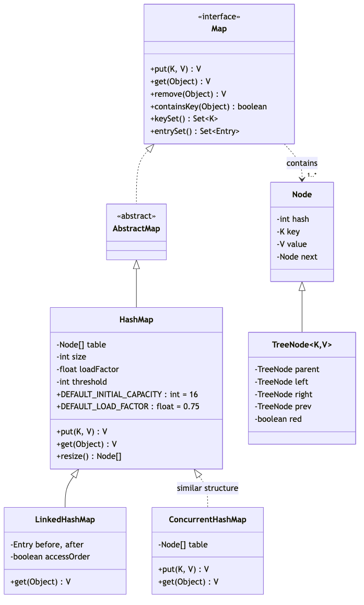
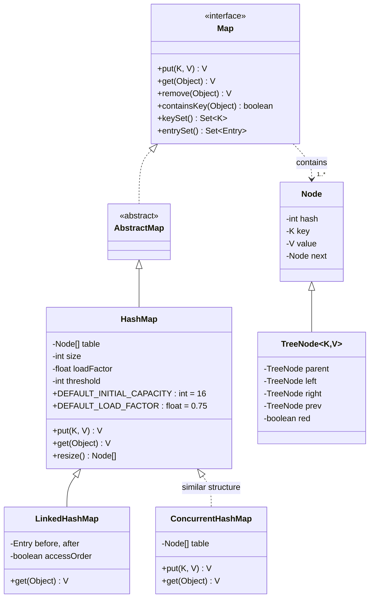
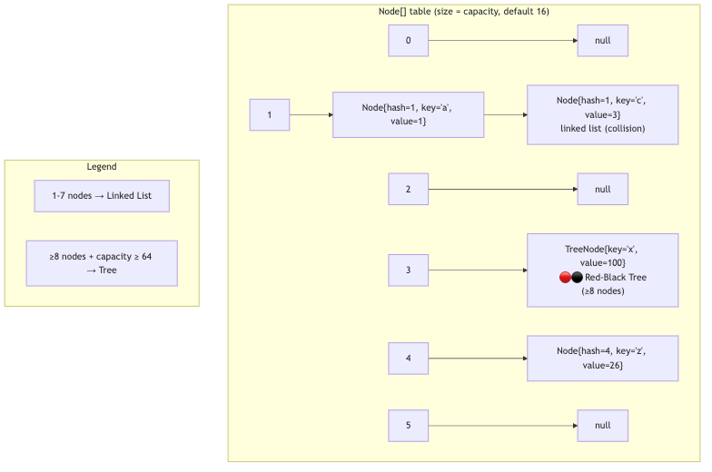
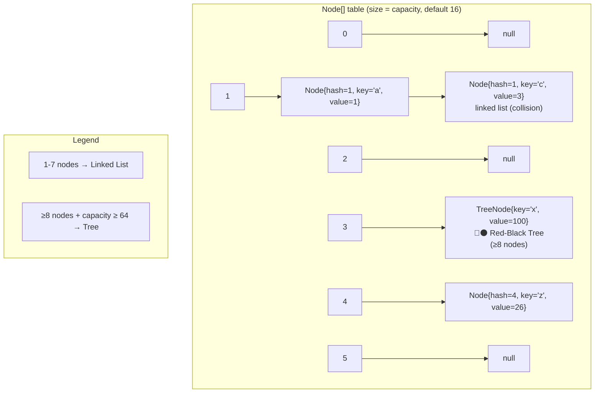

# HashMap — Complete Deep Dive

## 1. Hierarchy & Position






**Implements**: `Map<K,V>`, `Cloneable`, `Serializable`
**Extends**: `AbstractMap<K,V>`

### Bucket Structure (Java 8+)






## 2. Internal Structure (Java 8+)

```java
public class HashMap<K,V> extends AbstractMap<K,V>
        implements Map<K,V>, Cloneable, Serializable {

    // DEFAULT INITIAL CAPACITY: 16 (must be power of 2)
    static final int DEFAULT_INITIAL_CAPACITY = 1 << 4; // = 16
    
    // MAXIMUM CAPACITY: 2^30
    static final int MAXIMUM_CAPACITY = 1 << 30;
    
    // DEFAULT LOAD FACTOR: 0.75
    static final float DEFAULT_LOAD_FACTOR = 0.75f;
    
    // TREEIFY THRESHOLD: 8 — convert linked list to Red-Black tree
    static final int TREEIFY_THRESHOLD = 8;
    
    // UNTREEIFY THRESHOLD: 6 — convert tree back to linked list on resize
    static final int UNTREEIFY_THRESHOLD = 6;
    
    // MIN_TREEIFY_CAPACITY: 64 — don't treeify until capacity >= 64
    // (if capacity < 64, just resize instead)
    static final int MIN_TREEIFY_CAPACITY = 64;
    
    // The array of buckets — each bucket is a linked list or tree head
    transient Node<K,V>[] table;
    
    // Set of keys (for keySet() view)
    transient Set<K> keySet;
    
    // Entry set (for entrySet() view)
    transient Set<Map.Entry<K,V>> entrySet;
    
    // Number of key-value mappings
    transient int size;
    
    // Next value to resize (capacity * load factor)
    int threshold;
    
    // The load factor
    final float loadFactor;
}
```

**Node structure:**
```java
static class Node<K,V> implements Map.Entry<K,V> {
    final int hash;      // Cached hash code of key
    final K key;         // The key (immutable — can't change after insertion)
    V value;             // The value
    Node<K,V> next;      // Pointer to next node in bucket (linked list)
}

// Tree node (when bucket has 8+ nodes):
static final class TreeNode<K,V> extends LinkedHashMap.Entry<K,V> {
    TreeNode<K,V> parent;  // Red-Black tree parent
    TreeNode<K,V> left;    // Left child
    TreeNode<K,V> right;   // Right child
    TreeNode<K,V> prev;    // Previous node (for unlinking)
    boolean red;           // Red-black tree color
}
```

## 3. Hash Computation — The Secret Sauce

```java
// Step 1: key.hashCode() returns a 32-bit int
// Step 2: hash() spreads the bits (XOR high bits into low bits)
static final int hash(Object key) {
    int h;
    return (key == null) ? 0 : (h = key.hashCode()) ^ (h >>> 16);
}

// Step 3: Bucket index = (table.length - 1) & hash
// Instead of modulo (%), uses bitwise AND since capacity is power of 2
// index = (n - 1) & hash
```

**Why XOR high bits?**
```
Example: hashCode() =   0x12345678 (binary: 0001 0010 0011 0100 0101 0110 0111 1000)
h >>> 16 =              0x00001234 (binary: 0000 0000 0000 0000 0001 0010 0011 0100)
h ^ (h >>> 16) =        0x1234664C (XOR mixes high and low bits)

Without XOR: bucket for "AAAA" and "BBBB" (identical low bits) → same bucket → collision
With XOR: high bits influence low bits → better distribution
```

## 4. Put Operation — Complete Flow

```java
public V put(K key, V value) {
    return putVal(hash(key), key, value, false, true);
}

final V putVal(int hash, K key, V value, boolean onlyIfAbsent, boolean evict) {
    Node<K,V>[] tab; Node<K,V> p; int n, i;
    
    // Step 1: Lazy initialization — create table on first put
    if ((tab = table) == null || (n = tab.length) == 0)
        n = (tab = resize()).length;
    
    // Step 2: Calculate bucket index and check if bucket is empty
    i = (n - 1) & hash;
    p = tab[i];  // First node in bucket
    
    if (p == null)
        // Step 3a: Bucket empty — create new node directly
        tab[i] = newNode(hash, key, value, null);
    else {
        // Step 3b: Bucket has nodes — handle collision
        Node<K,V> e; K k;
        
        if (p.hash == hash && ((k = p.key) == key || (key != null && key.equals(k))))
            // Case A: Same key (first node) — replace value
            e = p;
        else if (p instanceof TreeNode)
            // Case B: Bucket is a Red-Black tree — insert into tree
            e = ((TreeNode<K,V>)p).putTreeVal(this, tab, hash, key, value);
        else {
            // Case C: Bucket is a linked list — traverse and insert at end
            for (int binCount = 0; ; ++binCount) {
                if ((e = p.next) == null) {
                    p.next = newNode(hash, key, value, null);
                    
                    // TREEIFY: if binCount >= 7 (8th node), convert to tree
                    if (binCount >= TREEIFY_THRESHOLD - 1)
                        treeifyBin(tab, hash);
                    break;
                }
                if (e.hash == hash && ((k = e.key) == key || (key != null && key.equals(k))))
                    break;  // Found existing key
                p = e;
            }
        }
        
        // Step 4: If key already exists, replace value and return old
        if (e != null) {
            V oldValue = e.value;
            if (!onlyIfAbsent || oldValue == null)
                e.value = value;
            afterNodeAccess(e);  // For LinkedHashMap
            return oldValue;
        }
    }
    
    // Step 5: Increment modCount (for fail-fast iterator)
    ++modCount;
    
    // Step 6: Check if resize needed
    if (++size > threshold)
        resize();
    
    afterNodeInsertion(evict);  // For LinkedHashMap
    return null;
}
```

## 5. Resize — The Expensive Operation

```java
final Node<K,V>[] resize() {
    Node<K,V>[] oldTab = table;
    int oldCap = (oldTab == null) ? 0 : oldTab.length;
    int oldThr = threshold;
    int newCap, newThr = 0;
    
    // Calculate new capacity (DOUBLE: oldCap << 1)
    if (oldCap > 0) {
        if (oldCap >= MAXIMUM_CAPACITY) {
            threshold = Integer.MAX_VALUE;  // Never resize again
            return oldTab;
        }
        newCap = oldCap << 1;          // Double: 16 → 32 → 64 → 128
        newThr = oldThr << 1;          // Double threshold too
    } else {
        // First resize (lazy init)
        newCap = DEFAULT_INITIAL_CAPACITY;  // 16
        newThr = (int)(DEFAULT_LOAD_FACTOR * DEFAULT_INITIAL_CAPACITY); // 12
    }
    
    threshold = newThr;
    Node<K,V>[] newTab = (Node<K,V>[])new Node[newCap];
    table = newTab;
    
    // Rehash all existing entries into new table
    if (oldTab != null) {
        for (int j = 0; j < oldCap; ++j) {
            Node<K,V> e = oldTab[j];  // Head of bucket
            if (e != null) {
                oldTab[j] = null;     // Help GC
                
                if (e.next == null) {
                    // Single node — compute new index and place
                    newTab[e.hash & (newCap - 1)] = e;
                } else if (e instanceof TreeNode) {
                    // Split tree into two trees (low/high)
                    ((TreeNode<K,V>)e).split(this, newTab, j, oldCap);
                } else {
                    // Split linked list into low/high chains
                    // OPTIMIZATION: elements either stay at old index
                    // OR move to old index + oldCap
                    Node<K,V> loHead = null, loTail = null;
                    Node<K,V> hiHead = null, hiTail = null;
                    Node<K,V> next;
                    
                    do {
                        next = e.next;
                        if ((e.hash & oldCap) == 0) {  // Bit check — NO modulo needed!
                            if (loTail == null) loHead = e;
                            else loTail.next = e;
                            loTail = e;
                        } else {
                            if (hiTail == null) hiHead = e;
                            else hiTail.next = e;
                            hiTail = e;
                        }
                        e = next;
                    } while (e != null);
                    
                    if (loTail != null) {
                        loTail.next = null;
                        newTab[j] = loHead;           // Same index
                    }
                    if (hiTail != null) {
                        hiTail.next = null;
                        newTab[j + oldCap] = hiHead;  // Index + old capacity
                    }
                }
            }
        }
    }
    return newTab;
}
```

**The resize optimization:**
```
Old capacity = 16 = 0b10000
New capacity = 32 = 0b100000

For any key, old index = hash & (16-1) = hash & 0b1111  (low 4 bits)
New index     = hash & (32-1) = hash & 0b11111 (low 5 bits)

The 5th bit (0x10) determines if element stays or moves:
  if (hash & 16) == 0 → stays at index j
  if (hash & 16) == 1 → moves to j + 16

No modulo operation needed! Just bit check
```

## 6. Get Operation

```java
public V get(Object key) {
    Node<K,V> e;
    return (e = getNode(hash(key), key)) == null ? null : e.value;
}

final Node<K,V> getNode(int hash, Object key) {
    Node<K,V>[] tab; Node<K,V> first, e; int n; K k;
    
    if ((tab = table) != null && (n = tab.length) > 0 &&
        (first = tab[(n - 1) & hash]) != null) {
        
        // Check first node always (most common — O(1))
        if (first.hash == hash && ((k = first.key) == key || (key != null && key.equals(k))))
            return first;
        
        // More than one node in bucket
        if ((e = first.next) != null) {
            if (first instanceof TreeNode)
                return ((TreeNode<K,V>)first).getTreeNode(hash, key);  // Tree search O(log n)
            do {
                // Linked list traversal O(n) per bucket
                if (e.hash == hash && ((k = e.key) == key || (key != null && key.equals(k))))
                    return e;
            } while ((e = e.next) != null);
        }
    }
    return null;  // Not found
}
```

## 7. Treeify — Linked List to Red-Black Tree

```java
final void treeifyBin(Node<K,V>[] tab, int hash) {
    int n, index; Node<K,V> e;
    
    // Don't treeify if table is too small — resize instead
    if (tab == null || (n = tab.length) < MIN_TREEIFY_CAPACITY)
        resize();  // Resize doubles capacity — better than tree for small tables
    else if ((e = tab[index = (n - 1) & hash]) != null) {
        // Convert linked list to tree
        TreeNode<K,V> hd = null, tl = null;
        do {
            TreeNode<K,V> p = replacementTreeNode(e, null);
            if (tl == null) hd = p;
            else { p.prev = tl; tl.next = p; }
            tl = p;
        } while ((e = e.next) != null);
        
        tab[index] = hd;
        if (hd != null)
            hd.treeify(tab);  // Actually build the Red-Black tree
    }
}
```

**Why 8 for treeify and 6 for untreeify?**
- 8 = high probability of collision under good hash (Poisson distribution: λ=0.5, P(8) < 1 in 10M)
- 6 = hysteresis — prevents oscillation between list and tree on add/remove at threshold
- Different values prevent repeated treeify/untreeify when size fluctuates around 8

## 8. HashMap Java 7 vs Java 8

| Aspect | Java 7 | Java 8 |
|--------|--------|--------|
| Collision handling | Linked list only | Linked list → Red-Black tree at 8 |
| Worst-case get | **O(n)** | **O(log n)** (tree) |
| Hash distribution | More complex (4 XOR operations) | Simple: h ^ (h >>> 16) |
| Resize rehash | Full rehash all entries | Bit-check optimization (e.hash & oldCap) |
| Insertion order in bucket | Head insertion (weird inversion) | Tail insertion (preserves order) |
| Infinite loop in resize | **Yes** — circular list in concurrent put | **No** — tail insertion eliminates cycle |
| Null key | Special case `Entry[0]` | Stored in table[0] via hash=0 |
| Capacity must be | Power of 2 | Power of 2 (same) |

## 9. Tricky Interview Questions

**Q1: What's the worst-case performance of HashMap? When does it happen?**
```java
// Worst case: O(n) with linked list (all keys in same bucket)
// This happens when hashCode() returns the same value for all keys
// e.g., if (key.hashCode() % 10) {
//         return 42; // Same hash for all keys! ALL in one bucket
// }

// Java 8+ worst case: O(log n) — once bucket hits 8 nodes, it becomes a Red-Black tree

// Absolute worst case for Java 8+: keys implement Comparable poorly
// Tree uses compareTo for ordering — if compareTo is inconsistent with equals, tree breaks
```

**Q2: What happens when two keys have the same hash but are not equal?**
```java
// They go to the SAME bucket (collision).
// Java 8: stored as linked list nodes until 8, then as tree nodes.
// When getting, both are checked via equals().
```

**Q3: Why must capacity be a power of 2?**
```java
// index = (n - 1) & hash
// If n = 16: (16-1) = 0b1111 → uses low 4 bits of hash → perfect distribution
// If n = 17: (17-1) = 0b10000 → uses only 1 bit of hash → terrible distribution!
```

**Q4: Can two different hashCodes map to the same bucket?**
```java
// YES! index = (n-1) & hash
// If n=16: index uses low 4 bits of hash
// hash=0x0005 and hash=0x0015 → both have low 4 bits = 0x5 → same bucket
```

**Q5: What happens if you use a mutable object as a HashMap key?**
```java
Map<List<String>, String> map = new HashMap<>();
List<String> key = new ArrayList<>(List.of("a"));
map.put(key, "value");
key.add("b");  // MUTATED! hashCode changes!
map.get(key);  // null — different bucket now!
// The old entry is still at the old bucket — MEMORY LEAK!
```

**Q6: What is the initial capacity if you specify 17?**
```java
new HashMap<>(17);  // Actually creates capacity = 32!
// HashMap finds the NEXT power of 2 >= specified capacity
// 17 → 32, 31 → 32, 33 → 64
// Via: Integer.highestOneBit((cap-1) << 1)
```

## 10. Load Factor & Performance Tuning

```java
// DEFAULT: 0.75 — balance between time and space
// Higher load factor (0.9): less space, more collisions, slower access
// Lower load factor (0.5): more space, fewer collisions, faster access

// Estimating initial capacity:
// To store 1000 elements without resizing:
// capacity = (int)(1000 / 0.75) + 1 = 1334 → next power of 2 = 2048
Map<String, String> map = new HashMap<>(2048);  // No resize for 1000 elements
```

## 11. Final 30-Second Answer

HashMap = array of buckets (Node<K,V>[] table) + hash function + collision resolution. **Put**: compute hash → mask to index → if empty, place node. **Collision**: linked list (≤8 nodes), Red-Black tree (>8, Java 8+). **Resize**: double capacity → rehash using `(e.hash & oldCap)` optimization (no modulo). **Get**: O(1) average, O(log n) worst (tree), O(n) worst (list, Java 7). **Requires**: proper equals() and hashCode(). **Capacity**: always power of 2, determined by `n = (n-1) & hash`. **Load factor**: 0.75. Never: use mutable keys, assume iteration order, use `Collections.synchronizedMap` without external sync during iteration.