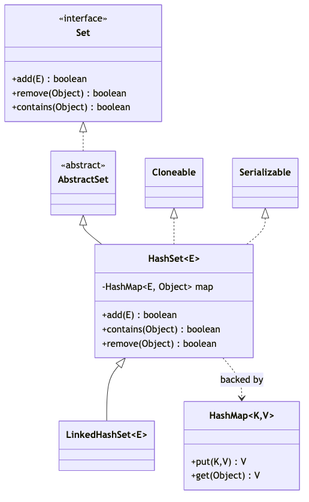
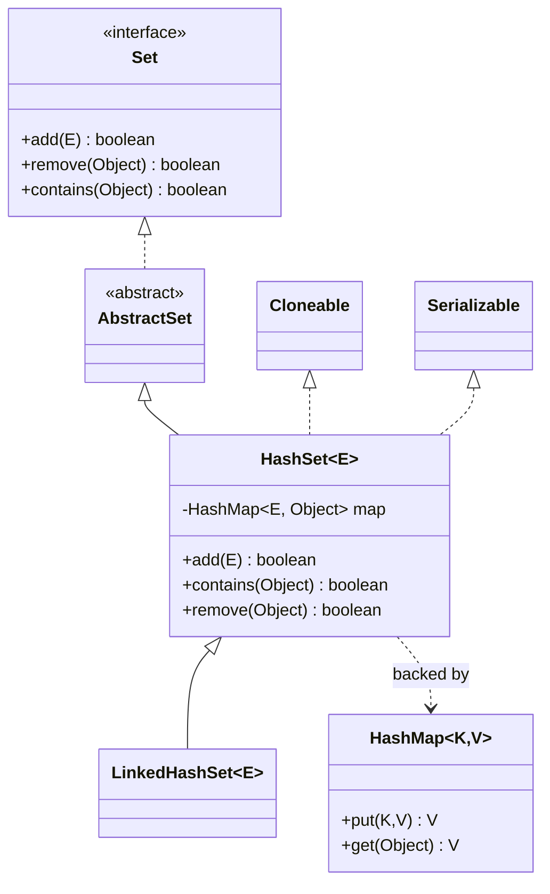

# HashSet Internals — Complete Deep Dive

## 1. Why This Concept Matters

HashSet is the most widely used Set implementation. Understanding its HashMap-backed internals, uniqueness guarantees, and performance characteristics is crucial. In production, incorrect hashCode/equals implementations cause duplicate "equal" objects in sets, broken contracts, and unexpected lookup failures. Interviewers test HashSet because it reveals whether you understand hashing fundamentals, the equals/hashCode contract, and how HashSet leverages HashMap internally.

Misunderstanding HashSet causes:
- Duplicate "equal" objects appearing in a Set
- Objects that should be found via `contains()` returning false
- Performance degradation from poor hashCode distribution
- Memory leaks from retained references in backing HashMap

## 1.5 Collection Hierarchy






## 2. Basic Meaning

HashSet is an implementation of the `Set` interface backed by a `HashMap` instance. It stores unique elements — no duplicates allowed. Uniqueness is determined by `hashCode()` and `equals()`.

Key vocabulary:
- **Backing HashMap**: HashSet uses `HashMap<Object, present>` internally
- **`present`**: static dummy object used as value for all keys
- **`loadFactor`**: when size exceeds threshold (capacity × loadFactor), resize occurs
- **`initialCapacity`**: initial capacity of backing HashMap
- **Uniqueness**: determined by `hashCode()` + `equals()` contract
- **Null elements**: HashSet allows one null element
- **Iteration order**: not guaranteed (based on hash bucket order)

What it is NOT: HashSet is not ordered. It is not sorted. It is not thread-safe. It does not maintain insertion order (use `LinkedHashSet` for that).

## 3. Real Code / Real Example

```java
import java.util.*;
import java.util.stream.Collectors;

public class HashSetDemo {
    public static void main(String[] args) {
        // === BASIC USAGE ===
        Set<String> names = new HashSet<>();
        names.add("Alice");
        names.add("Bob");
        names.add("Charlie");
        names.add("Alice"); // duplicate — ignored
        System.out.println("Names: " + names); // [Alice, Bob, Charlie] (order varies)
        System.out.println("Size: " + names.size()); // 3

        // === NULL ELEMENT ===
        Set<String> withNull = new HashSet<>();
        withNull.add(null); // allowed
        withNull.add("A");
        withNull.add(null); // duplicate null — ignored
        System.out.println("With null: " + withNull); // [null, A]

        // === UNIQUENESS VIA equals/hashCode ===
        Person p1 = new Person("Alice", 30);
        Person p2 = new Person("Alice", 30); // same content
        Person p3 = new Person("Bob", 25);
        Set<Person> people = new HashSet<>(Arrays.asList(p1, p2, p3));
        System.out.println("People size: " + people.size()); // 2 (p1, p2 considered equal)

        // === CONTAINS ===
        System.out.println("Contains Alice: " + people.contains(p1)); // true
        System.out.println("Contains new Alice: " + people.contains(new Person("Alice", 30))); // true!

        // === REMOVAL ===
        people.remove(p1); // removes one equal object
        System.out.println("After remove p1: " + people.size()); // 1

        // === ITERATION ===
        System.out.print("Iteration order: ");
        for (String s : names) System.out.print(s + " ");
        System.out.println();
        // Order: not guaranteed, depends on hash codes and bucket placement

        // === BULK OPERATIONS ===
        Set<Integer> set1 = new HashSet<>(Arrays.asList(1, 2, 3, 4, 5));
        Set<Integer> set2 = new HashSet<>(Arrays.asList(3, 4, 5, 6, 7));
        Set<Integer> union = new HashSet<>(set1);
        union.addAll(set2); // [1, 2, 3, 4, 5, 6, 7]
        Set<Integer> intersection = new HashSet<>(set1);
        intersection.retainAll(set2); // [3, 4, 5]
        Set<Integer> difference = new HashSet<>(set1);
        difference.removeAll(set2); // [1, 2]
        System.out.println("Union: " + union);
        System.out.println("Intersection: " + intersection);
        System.out.println("Difference: " + difference);

        // === INITIAL CAPACITY ===
        Set<String> sized = new HashSet<>(1000); // initial capacity 16
        // actual backing HashMap: new HashMap<>(1000) → table size 2048
        // Insert 1000 elements without resize

        // === INSPECT INTERNAL MAP VIA REFLECTION ===
        try {
            Field mapField = HashSet.class.getDeclaredField("map");
            mapField.setAccessible(true);
            HashMap<?, ?> backingMap = (HashMap<?, ?>) mapField.get(names);
            System.out.println("Backing map size: " + backingMap.size());
            System.out.println("Backing map threshold: " + getThreshold(backingMap));
        } catch (Exception e) {
            System.out.println("Reflection failed: " + e.getMessage());
        }
    }

    static class Person {
        String name;
        int age;
        Person(String n, int a) { this.name = n; this.age = a; }
        @Override public boolean equals(Object o) {
            if (this == o) return true;
            if (!(o instanceof Person)) return false;
            Person p = (Person) o;
            return age == p.age && Objects.equals(name, p.name);
        }
        @Override public int hashCode() { return Objects.hash(name, age); }
    }

    static int getThreshold(HashMap<?, ?> map) {
        try {
            Field f = HashMap.class.getDeclaredField("threshold");
            f.setAccessible(true);
            return (int) f.get(map);
        } catch (Exception e) { return -1; }
    }
}
```

Expected output:
```
Names: [Alice, Bob, Charlie]
Size: 3
With null: [null, A]
People size: 2
Contains Alice: true
Contains new Alice: true
After remove p1: 1
Iteration order: Alice Bob Charlie (or any order)
Union: [1, 2, 3, 4, 5, 6, 7]
Intersection: [3, 4, 5]
Difference: [1, 2]
Backing map size: 3
Backing map threshold: 12
```

## 4. What Happens Internally

**HashSet structure:**
```java
public class HashSet<E> implements Set<E>, Cloneable, Serializable {
    private transient HashMap<Object, Object> map;
    private static final Object PRESENT = new Object();

    public HashSet() {
        map = new HashMap<>(); // default capacity 16, loadFactor 0.75
    }

    public HashSet(int initialCapacity) {
        map = new HashMap<>(initialCapacity);
    }

    public boolean add(E e) {
        return map.put(e, PRESENT) == null; // true if new, false if duplicate
    }

    public boolean contains(Object o) {
        return map.containsKey(o);
    }

    public boolean remove(Object o) {
        return map.remove(o) == PRESENT;
    }
}
```

Every element stored as key in HashMap with dummy value `PRESENT`. This gives O(1) add/contains/remove.

**`add(E e)` flow:**
1. Compute hash: `hash = hash(e.hashCode())`
2. Compute index: `index = (table.length - 1) & hash`
3. Traverse bucket:
   - If `key.equals(e)` found: return `false` (already exists)
   - If not found: insert new `Node(e, PRESENT)` at bucket
4. If `size++` exceeds threshold: resize

**`remove(Object o)` flow:**
1. Compute hash and index
2. Find bucket, traverse list:
   - If `node.key.equals(o)`: unlink node, decrement size, return `true`
   - Else: return `false`
3. No explicit nulling of key needed (GC handles via weak refs in some JVMs, but HashMap nulls removed elements to prevent memory leaks)

**Resize behavior (delegated to HashMap):**
- When `size > threshold`: double capacity, rehash all entries
- Rehashing redistributes keys to new buckets

## 5. Tricky Interview Cases

**Case 1 — Mutable key in HashSet**
```java
class MutableKey {
    int hashCode;
    MutableKey(int h) { this.hashCode = h; }
    @Override public int hashCode() { return hashCode; }
    @Override public boolean equals(Object o) { return (o instanceof MutableKey) && hashCode == ((MutableKey)o).hashCode; }
}

Set<MutableKey> set = new HashSet<>();
MutableKey k1 = new MutableKey(1);
set.add(k1);
k1.hashCode = 2; // mutate after insertion
System.out.println(set.contains(k1)); // false — different bucket now!
System.out.println(set.contains(new MutableKey(1))); // false — original key lost!
```
Output: `false`, `false`
Explanation: `hashCode()` changed after insertion. HashSet stored in bucket for hash 1. `contains()` computes hash 2, looks in different bucket. Object is lost.

**Case 2 — HashSet allows one null**
```java
Set<String> set = new HashSet<>();
set.add(null);
set.add(null);
System.out.println(set.size()); // 1
System.out.println(set.contains(null)); // true
```
Output: `1`, `true`
Explanation: HashMap allows one null key. `null` hash = 0. Second `put(null, PRESENT)` finds existing key, returns old value (PRESENT), so `add()` returns `false`.

**Case 3 — `removeIf` vs iterator remove**
```java
Set<Integer> set = new HashSet<>(Arrays.asList(1, 2, 3, 4, 5, 6));
set.removeIf(n -> n % 2 == 0); // remove evens
System.out.println(set); // [1, 3, 5]

Iterator<Integer> it = set.iterator();
while (it.hasNext()) { it.next(); it.remove(); } // removes all
System.out.println(set); // []
```
Output: `[1, 3, 5]` then `[]`
Explanation: `removeIf` is bulk operation, safe for HashSet. Iterator `remove()` also safe.

**Case 4 — Equal objects with different hash codes**
```java
class Broken {
    int value;
    Broken(int v) { this.value = v; }
    @Override public int hashCode() { return value % 2; } // only 0 or 1
    @Override public boolean equals(Object o) { return (o instanceof Broken) && value == ((Broken)o).value; }
}

Set<Broken> set = new HashSet<>();
for (int i = 0; i < 10; i++) set.add(new Broken(i));
System.out.println(set.size()); // still 10, but...
System.out.println(set.contains(new Broken(5))); // true
// But: only 2 buckets used, each linked list of ~5 nodes
// contains() is O(n) instead of O(1)
```
Output: `10`, `true` (but contains is slow)
Explanation: Only 2 distinct hash codes → 2 buckets → linked lists. `contains()` traverses list.

**Case 5 — HashSet iteration order depends on hash codes**
```java
Set<Integer> set = new HashSet<>(Arrays.asList(3, 1, 4, 1, 5, 9, 2, 6));
System.out.println(set); // order is hash-dependent, e.g., [1, 2, 3, 4, 5, 6, 9]
```
Output: `[1, 2, 3, 4, 5, 6, 9]` or similar (sorted by hash bucket, NOT insertion order)
Explanation: HashSet does not preserve insertion order. Use `LinkedHashSet` if insertion order needed.

## 6. Common Mistakes

| Mistake | Problem | Fix |
|---------|---------|-----|
| Mutable fields in hashCode | Key lost after insertion | Use immutable fields in hashCode |
| Wrong initial capacity | Frequent resizing | Estimate size: `expectedSize / 0.75 + 1` |
| Using `==` in equals | Reference comparison | Use `.equals()` or `Objects.equals()` |
| Not overriding hashCode when overriding equals | Breaks HashMap/HashSet contract | Always override both together |
| HashSet for ordering | No order guaranteed | Use `LinkedHashSet` or `TreeSet` |
| Thread-safe access | ConcurrentModification or data corruption | Use ` Collections.synchronizedSet()` or `ConcurrentHashMap` |
| `contains()` with wrong type | `equals()` returns false | Ensure type compatibility |

## 7. Production Usage

**Deduplication in data processing:**
```java
List<Transaction> transactions = fetchAll();
Set<Long> uniqueIds = new HashSet<>(transactions.size() * 2);
for (Transaction t : transactions) {
    if (!uniqueIds.add(t.getId())) {
        log.warn("Duplicate transaction: {}", t.getId());
    }
}
```
`uniqueIds.add()` returns `false` for duplicates. O(1) per check.

**Intersection / difference of datasets:**
```java
Set<Long> allowedUsers = fetchAllowedUserIds();
Set<Long> activeUsers = fetchActiveUserIds();
allowedUsers.retainAll(activeUsers); // intersection: allowed AND active
```

**Caching check before DB lookup:**
```java
Cache<String, User> cache = ...
Set<String> cacheKeys = cache.keySet(); // view of cache keys
if (cacheKeys.contains(userId)) { ... }
```

**Spring `@Transactional` propagation:**
Spring uses `Set<TransactionInfo>` internally for transaction synchronization. HashSet for tracking active transactions.

## 8. Advanced Details

- **Backing HashMap details:** HashSet always uses HashMap with default load factor 0.75. Capacity = initial capacity or default 16. Resize threshold = capacity × 0.75.
- **`PRESENT` dummy object:** `private static final Object PRESENT = new Object();`. Same instance used for every key. No per-entry allocation for value.
- **`clone()`:** Creates shallow copy: `new HashSet<>(this.map)`. Backing HashMap cloned, but elements are shared references.
- **Serialization:** Writes backing HashMap. On deserialization, restores full HashMap state.
- **`removeIf()`:** Uses default Collection implementation. Iterates via iterator, calls `remove()`. Faster than manual removal in loop.
- **`spliterator()`:** Reports `DISTINCT | SORTED | ORDERED | NONNULL | SIZED | SUBSIZED`. Actually only DISTINCT is true for HashSet.
- **Default `equals()` + `hashCode()`:** Inherited from Object. If you don't override both, identity-based: only same object reference equals itself.

## 9. Interview Questions And Answers

### Beginner
Q: How does HashSet ensure uniqueness of elements?
A: HashSet is backed by a HashMap. When you add an element, it is stored as a key in the HashMap with a dummy value. Before adding, HashSet computes `hashCode()` of the element to find the bucket, then traverses the bucket using `equals()` to check if an equal element already exists. If found, `add()` returns `false`. If not found, the element is inserted.

### Intermediate
Q: Can you store duplicate objects in a HashSet? What if two objects have the same hashCode but are not equal?
A: If two objects have the same hashCode but are not equal (different `equals()`), they go to the same bucket but as separate linked list nodes. HashSet can store both — they are not duplicates. `equals()` determines actual equality, not `hashCode()`.

### Senior
Q: You have a `HashSet` of custom objects. `contains()` returns `false` for an object that is logically equal to one in the set. What could be wrong?
A: Two likely causes:
1. `hashCode()` not overridden: object stored in one bucket, `contains()` looks in different bucket because it computes a different hashCode (identity-based).
2. `equals()` not overridden or broken: same hashCode but `equals()` returns `false` when it should return `true`.

Fix: Override both `hashCode()` and `equals()` using the same canonical fields.

### Tricky
Q: `HashSet` uses a `HashMap` internally. When you call `set.add(e)`, what value is stored in the HashMap? Why does `set.contains(e)` work even though you never stored a value? What does `set.remove(e)` return?
A: `set.add(e)` calls `map.put(e, PRESENT)` where `PRESENT` is a static dummy object. So the HashMap stores `{e → PRESENT}`.

`set.contains(e)` calls `map.containsKey(e)`, which computes `hash(e)` and traverses bucket using `equals()`. No value needed.

`set.remove(e)` calls `map.remove(e)`, which returns the old value (`PRESENT` if found, `null` if not). HashSet discards the returned value and returns `true`/`false` based on whether it was `PRESENT`.

## 10. Final 30-Second Answer

HashSet = Set backed by HashMap. Uniqueness via `hashCode()` + `equals()`. O(1) add/contains/remove. Allows one null. Not ordered — use `LinkedHashSet` for insertion order or `TreeSet` for sorted. One static `PRESENT` dummy object as value in map. **Always override hashCode and equals together** using same canonical fields. Mutable fields cause lost entries. Initial capacity parameter passed to HashMap to avoid resize.