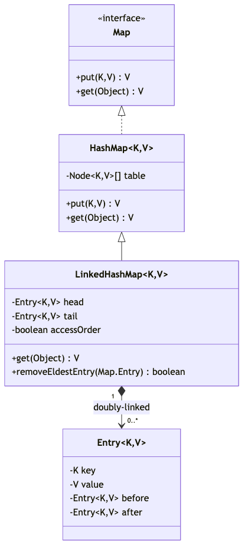
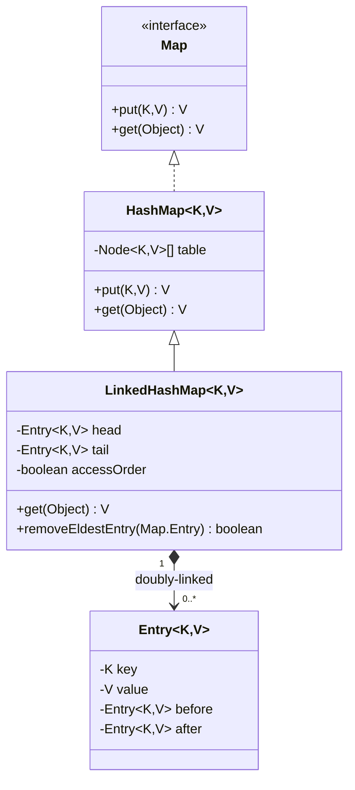

# LinkedHashMap Internals — Complete Deep Dive

## 1. Why This Concept Matters

LinkedHashMap is HashMap with a doubly-linked list through entries. It maintains insertion order (or access order) while providing O(1) HashMap operations. This makes it the foundation for LRU caches, ordered maps, and predictable iteration. In production, LinkedHashMap is used for caching (with `removeEldestEntry`), maintaining predictable iteration order, and building LRU structures. Interviewers test this because it combines hashing with linked structures.

Misunderstanding LinkedHashMap causes:
- Incorrect LRU cache implementation
- Memory leaks from retained entries in linked list
- Performance issues from access-order iteration overhead
- Confusion about when to use vs HashMap

## 1.5 Collection Hierarchy






## 2. Basic Meaning

LinkedHashMap extends HashMap. It adds a doubly-linked list through entries to maintain order.

**Two order modes:**
1. **Insertion order** (default): order of `put()` calls
2. **Access order**: order of `get()` / `put()` calls (for LRU)

Key vocabulary:
- **`head` / `tail`**: sentinel nodes for doubly-linked list
- **`accessOrder`**: `false` = insertion order, `true` = access order
- **`afterNodeAccess()`**: moves node to end on access (for LRU)
- **`afterNodeInsertion()`**: handles `removeEldestEntry`
- **`removeEldestEntry()`**: hook for LRU eviction
- **`LinkedHashIterator`**: iterator following linked list

What it is NOT: LinkedHashMap is not thread-safe. It does not sort elements (use TreeMap).

## 3. Real Code / Real Example

```java
import java.util.*;
import java.util.stream.Collectors;

public class LinkedHashMapDemo {
    public static void main(String[] args) {
        // === INSERTION ORDER (default) ===
        Map<String, Integer> insertOrder = new LinkedHashMap<>();
        insertOrder.put("three", 3);
        insertOrder.put("one", 1);
        insertOrder.put("two", 2);
        System.out.println("Insertion order: " + insertOrder);
        // {three=3, one=1, two=2}

        // === ACCESS ORDER (for LRU) ===
        LinkedHashMap<String, Integer> accessOrder = new LinkedHashMap<>(16, 0.75f, true);
        accessOrder.put("A", 1);
        accessOrder.put("B", 2);
        accessOrder.put("C", 3);
        System.out.println("Initial: " + accessOrder);
        accessOrder.get("A"); // access moves A to end
        System.out.println("After get(A): " + accessOrder);
        // {B=2, C=3, A=1}

        // === LRU CACHE ===
        LinkedHashMap<Integer, String> lru = new LinkedHashMap<>(16, 0.75f, true) {
            @Override
            protected boolean removeEldestEntry(Map.Entry<Integer, String> eldest) {
                return size() > 3; // keep max 3 entries
            }
        };
        lru.put(1, "one");
        lru.put(2, "two");
        lru.put(3, "three");
        System.out.println("LRU: " + lru); // {1=one, 2=two, 3=three}
        lru.put(4, "four"); // triggers eviction of eldest (1)
        System.out.println("After add 4: " + lru); // {2=two, 3=three, 4=four}
        lru.get(2); // access 2, moves to end
        System.out.println("After get(2): " + lru); // {3=three, 4=four, 2=two}
        lru.put(5, "five"); // evicts 3 (eldest)
        System.out.println("After add 5: " + lru); // {4=four, 2=two, 5=five}

        // === ITERATION ORDER ===
        LinkedHashMap<String, String> map = new LinkedHashMap<>();
        map.put("x", "10");
        map.put("y", "20");
        map.put("z", "30");
        System.out.print("Iteration: ");
        for (Map.Entry<String, String> e : map) System.out.print(e.getKey() + " ");
        System.out.println(); // x y z (insertion order)

        // === COMPARISON: HashMap vs LinkedHashMap ===
        Map<String, String> hash = new HashMap<>();
        hash.put("first", "1");
        hash.put("second", "2");
        hash.put("third", "3");
        System.out.println("HashMap iteration: " + hash); // unpredictable order
        System.out.println("LinkedHashMap iteration: " + map); // predictable

        // === INITIAL CAPACITY AND LOAD FACTOR ===
        LinkedHashMap<String, String> sized = new LinkedHashMap<>(100, 0.8f, false);
        // backing HashMap: new HashMap<>(100, 0.8f)
        // accessOrder = false (insertion order)

        // === REMOVE BY KEY / VALUE ===
        LinkedHashMap<String, Integer> removals = new LinkedHashMap<>();
        removals.put("a", 1);
        removals.put("b", 2);
        removals.put("c", 3);
        removals.remove("b"); // O(1) via HashMap + unlink from list
        System.out.println("After remove b: " + removals); // {a=1, c=3}

        // === CLEAR ===
        removals.clear();
        System.out.println("After clear: " + removals); // {}
    }
}
```

Expected output:
```
Insertion order: {three=3, one=1, two=2}
Initial: {A=1, B=2, C=3}
After get(A): {B=2, C=3, A=1}
LRU: {1=one, 2=two, 3=three}
After add 4: {2=two, 3=three, 4=four}
After get(2): {3=three, 4=four, 2=two}
After add 5: {4=four, 2=two, 5=five}
Iteration: x y z
HashMap iteration: {second=2, third=3, first=1}  (order varies)
LinkedHashMap iteration: {x=10, y=20, z=30}
After remove b: {a=1, c=3}
After clear: {}
```

## 4. What Happens Internally

**LinkedHashMap structure:**
```java
public class LinkedHashMap<K,V> extends HashMap<K,V> implements Map<K,V> {
    // Doubly-linked list through entries
    private transient Entry<K,V> head; // sentinel before first
    private transient Entry<K,V> tail; // sentinel after last
    private final boolean accessOrder; // false = insertion, true = access

    // Each Entry extends HashMap.Node
    static class Entry<K,V> extends HashMap.Node<K,V> {
        Entry<K,V> before, after; // linked list pointers
        Entry(int hash, K key, V value, Node<K,V> next) {
            super(hash, key, value, next);
        }
    }
}
```

**Linked list pointers:**
```
head ⟷ Entry1 ⟷ Entry2 ⟷ Entry3 ⟷ tail
(head/tail are sentinels simplifying edge cases)
```

**`put()` flow:**
1. Standard HashMap put: compute hash, find bucket, insert/update entry
2. If new entry:
   - If insertion order: `linkNodeLast(entry)` → append to tail
   - If access order: nothing special
3. If existing entry updated (new value):
   - If access order: `afterNodeAccess(entry)` → move to tail

**`linkNodeLast()`:**
```java
private void linkNodeLast(Entry<K,V> p) {
    Entry<K,V> last = tail;
    p.before = last;
    p.after = tail;
    tail = p;
    if (last == null) head = p; // empty list
    else last.after = p;
}
```

**`afterNodeAccess()` (access order mode):**
```java
void afterNodeAccess(Node<K,V> e) {
    Entry<K,V> last = tail;
    Entry<K,V> p = (Entry<K,V>)e;
    // Move p to end of list
    if (p != last) {
        Entry<K,V> b = p.before, a = p.after;
        p.after = null;
        if (b == null) head = a;
        else b.after = a;
        if (a != null) a.before = b;
        else last = b;
        p.before = last;
        last.after = p;
        tail = p;
    }
}
```

**`removeEldestEntry()`:**
Called after inserting new entry. Default returns `false` (never evict). Override for LRU:
```java
protected boolean removeEldestEntry(Map.Entry<K,V> eldest) {
    return false; // override: return size() > MAX
}
```

**Iteration:**
LinkedHashMap iterator traverses linked list via `before/after` pointers, **not** the HashMap bucket array. This gives insertion/access order regardless of hash bucket placement.

## 5. Tricky Interview Cases

**Case 1 — Insertion order preserved**
```java
LinkedHashMap<String, String> map = new LinkedHashMap<>();
map.put("c", "3");
map.put("a", "1");
map.put("b", "2");
System.out.println(map); // {c=3, a=1, b=2} — insertion order
```
Output: `{c=3, a=1, b=2}`
Explanation: New entries linked at tail. Iteration follows list from head to tail.

**Case 2 — Access order in action**
```java
LinkedHashMap<String, String> map = new LinkedHashMap<>(16, 0.75f, true);
map.put("1", "one");
map.put("2", "two");
map.put("3", "three");
map.get("1"); // access 1, moves to tail
map.get("3"); // access 3, moves to tail
System.out.println(map); // {2=two, 1=one, 3=three}
```
Output: `{2=two, 1=one, 3=three}`
Explanation: Each `get()` triggers `afterNodeAccess()`, moving accessed entry to tail.

**Case 3 — `removeEldestEntry` only on new entries**
```java
LinkedHashMap<Integer, String> lru = new LinkedHashMap<>(16, 0.75f, true) {
    @Override protected boolean removeEldestEntry(Map.Entry<Integer, String> e) {
        return size() > 2;
    }
};
lru.put(1, "one");
lru.put(2, "two");
lru.put(3, "three"); // evicts 1
lru.replace(2, "TWO"); // update existing — does NOT trigger eviction
lru.put(4, "four"); // evicts 3
System.out.println(lru); // {2=TWO, 4=four}
```
Output: `{2=TWO, 4=four}`
Explanation: `replace()` updates value but doesn't add new entry, so `removeEldestEntry` not checked. `put()` on new key triggers eviction.

**Case 4 — `HashMap` methods break ordering?**
```java
LinkedHashMap<String, String> map = new LinkedHashMap<>();
map.put("a", "1");
map.put("b", "2");
map.put("c", "3");
map.remove("b"); // HashMap remove + unlink from list
System.out.println(map); // {a=1, c=3} — order preserved
```
Output: `{a=1, c=3}`
Explanation: `remove()` unlinks entry from linked list. Remaining entries stay in relative order.

**Case 5 — `clear()` resets list**
```java
LinkedHashMap<String, String> map = new LinkedHashMap<>();
map.put("a", "1");
map.clear(); // clears HashMap + resets head/tail
map.put("b", "2");
System.out.println(map); // {b=2}
```
Output: `{b=2}`
Explanation: `clear()` clears both HashMap table and linked list. New entries start fresh.

## 6. Common Mistakes

| Mistake | Problem | Fix |
|---------|---------|-----|
| Access order for normal use | Unnecessary overhead | Use default (insertion order) unless LRU needed |
| `removeEldestEntry` after `put` on existing key | No eviction, confusing behavior | Understand eviction only on new entries |
| Forgetting `accessOrder=true` for LRU | Cache doesn't actually evict LRU | Must set `accessOrder=true` |
| Thread-unsafe access | ConcurrentModification or data corruption | `Collections.synchronizedMap()` or `ConcurrentHashMap` |
| Large linked list memory | Each entry has extra 2 pointers | Acceptable for typical cache sizes |
| Iterating while modifying via `get()` | ConcurrentModificationException? Actually OK for get | But modifying structure via get in accessOrder mode during iteration may cause issues |

## 7. Production Usage

**LRU Cache (manual implementation):**
```java
public class LRUCache<K, V> extends LinkedHashMap<K, V> {
    private final int maxEntries;
    
    public LRUCache(int maxEntries) {
        super(maxEntries + 1, 0.75f, true); // accessOrder=true
        this.maxEntries = maxEntries;
    }
    
    @Override
    protected boolean removeEldestEntry(Map.Entry<K, V> e) {
        return size() > maxEntries;
    }
}

// Usage:
Map<String, User> cache = new LRUCache<>(1000);
```
Eviction happens on `put()`. Oldest accessed entry evicted when size exceeds max.

**JSON field ordering for deterministic output:**
```java
// Jackson can use LinkedHashMap for predictable key order
ObjectMapper mapper = new ObjectMapper();
mapper.enable(SerializationFeature.INDENT_OUTPUT);
// LinkedHashMap preserves insertion order of fields
```

**Spring `Model` attributes:**
Spring's `ModelMap` extends `LinkedHashMap` to preserve attribute insertion order for view rendering.

## 8. Advanced Details

- **Linked list overhead:** Each entry has 2 extra references (before/after) + 2 sentinels (head/tail). ~16 bytes per entry on 64-bit JVM with compressed oops.
- **HashMap operations unchanged:** All HashMap operations (hash, bucket, resize) work identically. Linked list is layered on top.
- **`afterNodeInsertion()`:** Called after `put()`. Checks `removeEldestEntry`. Also handles linked list insertion for new entries.
- **`afterNodeAccess()`:** Only called on `get()` and `put(existingKey, newValue)` in access-order mode.
- **Serialization:** Writes size, then entries in iteration order. Deserializes fully including linked list pointers.
- **`values()` / `entrySet()` / `keySet()`:** All return views backed by the LinkedHashMap. Changes reflect in map and vice versa.
- **Performance:** All operations O(1) amortized. Extra overhead from linked list pointer updates on put/get.
- **`LinkedHashSet`:** Same concept — HashSet backed by LinkedHashMap.

## 9. Interview Questions And Answers

### Beginner
Q: What is the difference between HashMap and LinkedHashMap?
A: LinkedHashMap extends HashMap and adds a doubly-linked list through entries. This maintains insertion order (default) or access order (LRU). HashMap has no ordering guarantee. All operations are still O(1) amortized. Use LinkedHashMap when you need predictable iteration order or LRU caching.

### Intermediate
Q: How does LinkedHashMap implement an LRU cache? What is `removeEldestEntry()`?
A: Create LinkedHashMap with `accessOrder=true` and override `removeEldestEntry()` to return `size() > MAX`:
```java
Map<K, V> cache = new LinkedHashMap<>(MAX, 0.75f, true) {
    @Override protected boolean removeEldestEntry(Map.Entry<K, V> e) {
        return size() > MAX;
    }
};
```
Each `get()` or `put()` moves entry to end (most recently used). When `put()` exceeds capacity, eldest entry (head of list) is evicted automatically.

### Senior
Q: You need a thread-safe LRU cache with 10,000 entries. Would you use LinkedHashMap? What are the issues and alternatives?
A: `LinkedHashMap` is NOT thread-safe. Concurrent access causes:
1. Race conditions in linked list pointers (infinite loops in iteration)
2. HashMap bucket corruption under concurrent puts

Options:
1. **`Collections.synchronizedMap()`**: coarse-grained lock on all operations.
   ```java
   Map<K, V> cache = Collections.synchronizedMap(
       new LinkedHashMap<>(10000, 0.75f, true) {
           @Override protected boolean removeEldestEntry(Map.Entry<K, V> e) {
               return size() > 10000;
           }
       }
   );
   ```
2. **`ConcurrentHashMap` + custom LRU list**: Use `ConcurrentHashMap` for lookups + `ReentrantLock`-protected linked list for order. Complex.
3. **Caffeine / Guava Cache**: Production-grade, thread-safe, async eviction.
   ```java
   LoadingCache<Key, Value> cache = Caffeine.newBuilder()
       .maximumSize(10000)
       .expireAfterAccess(10, TimeUnit.MINUTES)
       .build(key -> loadValue(key));
   ```

### Tricky
Q: LinkedHashMap iteration order is insertion order. But does `put(existingKey, newValue)` change the iteration position? What about `get()` in access-order mode?
A: `put(existingKey, newValue)`:
- **Insertion order mode**: NO — existing entry stays in same position, only value changes
- **Access order mode**: YES — entry moves to tail

`get(key)`:
- **Insertion order mode**: NO — get doesn't affect order
- **Access order mode**: YES — entry moves to tail

This is tested by comparing `map.entrySet()` before and after these operations.

## 10. Final 30-Second Answer

LinkedHashMap = HashMap + doubly-linked list through entries. Default insertion order, or access order (`accessOrder=true`) for LRU. O(1) ops like HashMap. `removeEldestEntry()` hook for LRU eviction. **Always override when creating LRU cache.** `accessOrder=true` + override `removeEldestEntry(size() > MAX)`. `get()` in access-order mode moves entry to tail (recent). Not thread-safe. Use `Collections.synchronizedMap()` or Caffeine for production LRU.