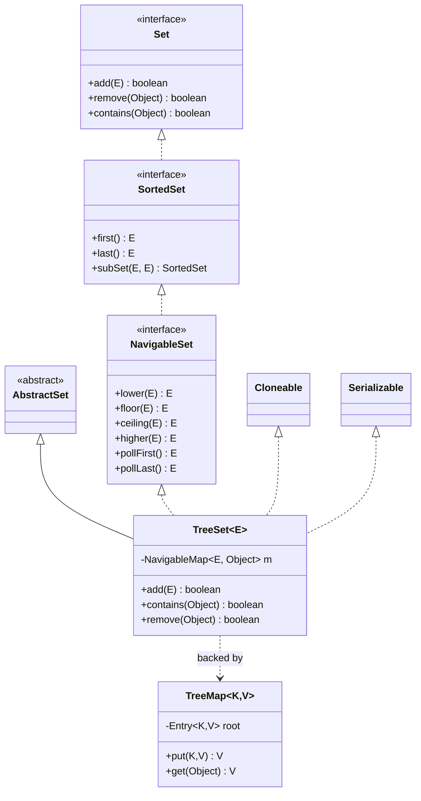

# TreeSet Internals — Complete Deep Dive

## 1. Why This Concept Matters

TreeSet is the sorted Set implementation backed by a Red-Black tree. Understanding TreeSet internals — tree structure, comparison mechanisms, and performance tradeoffs — is essential for interviews and production. In production, TreeSet is used for sorted unique collections, range queries, and maintaining ordered data. Misunderstanding TreeSet causes incorrect ordering, performance issues from poor comparators, and `ClassCastException` at runtime.

## 1.5 Collection Hierarchy




**Interview value:** High. TreeSet tests understanding of Red-Black trees, Comparable vs Comparator, and tree-based collections.
</remove>

## 2. Basic Meaning

TreeSet implements `NavigableSet` backed by `TreeMap`. Stores elements in sorted order (natural order or custom comparator). Uses Red-Black tree for O(log n) operations.

**Key vocabulary:**
- **Red-Black tree**: self-balancing binary search tree
- **`natural ordering`**: via `Comparable` interface
- **`Comparator`**: external ordering strategy
- **`NavigableSet`**: supports navigation (lower, floor, ceiling, higher)
- **`first()` / `last()`**: get min/max in O(log n)
- **`subSet()` / `headSet()` / `tailSet()`**: view subsets
- **Not thread-safe**: use `Collections.synchronizedSortedSet()`

**What it is NOT:** TreeSet is not a hash-based structure. Not O(1). Not thread-safe.

## 3. Real Code / Real Example

```java
import java.util.*;

public class TreeSetDemo {
    public static void main(String[] args) {
        // === BASIC USAGE ===
        Set<Integer> numbers = new TreeSet<>(Arrays.asList(5, 2, 8, 1, 9, 3, 7));
        System.out.println("Sorted: " + numbers); // [1, 2, 3, 5, 7, 8, 9]

        // === NATURAL ORDER (Comparable) ===
        Set<String> words = new TreeSet<>(Arrays.asList("banana", "apple", "cherry", "date"));
        System.out.println("Words: " + words); // [apple, banana, cherry, date]

        // === CUSTOM COMPARATOR ===
        Set<String> reverse = new TreeSet<>(Comparator.reverseOrder());
        reverse.add("banana");
        reverse.add("apple");
        reverse.add("cherry");
        System.out.println("Reverse: " + reverse); // [date, cherry, banana, apple]

        // === NAVIGATION METHODS ===
        NavigableSet<Integer> nav = new TreeSet<>(Arrays.asList(1, 3, 5, 7, 9));
        System.out.println("First: " + nav.first());     // 1
        System.out.println("Last: " + nav.last());       // 9
        System.out.println("Lower(5): " + nav.lower(5));   // 3 (< 5)
        System.out.println("Floor(5): " + nav.floor(5));   // 5 (<= 5)
        System.out.println("Ceiling(5): " + nav.ceiling(5)); // 5 (>= 5)
        System.out.println("Higher(5): " + nav.higher(5));  // 7 (> 5)

        // === SUBSET VIEWS ===
        SortedSet<Integer> sub = nav.subSet(3, true, 7, true); // [3, 5, 7]
        System.out.println("Subset(3-7): " + sub);
        SortedSet<Integer> head = nav.headSet(5, true); // [1, 3, 5]
        System.out.println("Head(<=5): " + head);
        SortedSet<Integer> tail = nav.tailSet(5, true); // [5, 7, 9]
        System.out.println("Tail(>=5): " + tail);

        // === POLLING (min/max removal) ===
        System.out.println("Poll first: " + nav.pollFirst()); // 1
        System.out.println("Poll last: " + nav.pollLast());   // 9
        System.out.println("After polls: " + nav); // [3, 5, 7]

        // === CUSTOM OBJECT ===
        Set<Person> people = new TreeSet<>();
        people.add(new Person("Alice", 30));
        people.add(new Person("Bob", 25));
        people.add(new Person("Charlie", 35));
        System.out.println("People by age: " + people);

        // === DESCENDING ITERATION ===
        Iterator<Integer> desc = nav.descendingIterator();
        System.out.print("Descending: ");
        while (desc.hasNext()) System.out.print(desc.next() + " ");
        System.out.println();

        // === COMPARATOR vs Comparable ===
        Set<Person> byName = new TreeSet<>(Comparator.comparing(Person::getName));
        byName.add(new Person("Charlie", 35));
        byName.add(new Person("Alice", 30));
        byName.add(new Person("Bob", 25));
        System.out.println("By name: " + byName); // [Alice, Bob, Charlie]
    }

    static class Person implements Comparable<Person> {
        String name;
        int age;
        Person(String n, int a) { this.name = n; this.age = a; }
        public String getName() { return name; }

        // Natural ordering: by age
        @Override
        public int compareTo(Person o) {
            return Integer.compare(this.age, o.age);
        }
        @Override
        public String toString() { return name + "(" + age + ")"; }
        @Override
        public boolean equals(Object o) {
            if (this == o) return true;
            if (!(o instanceof Person)) return false;
            return age == ((Person)o).age && Objects.equals(name, ((Person)o).name);
        }
        @Override
        public int hashCode() { return Objects.hash(name, age); }
    }
}
```

Expected output:
```
Sorted: [1, 2, 3, 5, 7, 8, 9]
Words: [apple, banana, cherry, date]
Reverse: [date, cherry, banana, apple]
First: 1
Last: 9
Lower(5): 3
Floor(5): 5
Ceiling(5): 5
Higher(5): 7
Subset(3-7): [3, 5, 7]
Head(<=5): [1, 3, 5]
Tail(>=5): [5, 7, 9]
Poll first: 1
Poll last: 9
After polls: [3, 5, 7]
People by age: [Bob(25), Alice(30), Charlie(35)]
Descending: 7 5 3
By name: [Alice(30), Bob(25), Charlie(35)]
```

## 4. What Happens Internally

**TreeSet → TreeMap delegation:**
```java
public class TreeSet<E> implements NavigableSet<E>, Cloneable, Serializable {
    private final NavigableMap<E, Object> m;
    private static final Object PRESENT = new Object();

    public TreeSet() { m = new TreeMap<>(); }
    public TreeSet(Comparator<? super E> comparator) { m = new TreeMap<>(comparator); }

    public boolean add(E e) { return m.put(e, PRESENT) == null; }
    public boolean contains(Object o) { return m.containsKey(o); }
    public E first() { return m.firstKey(); }
    public E last() { return m.lastKey(); }
    public E lower(E e) { return m.lowerKey(e); }
}
```
Same PRESENT pattern as HashSet, but backed by TreeMap.

**TreeMap / Red-Black tree:**
Each node has:
- `key`, `value`
- `left`, `right`, `parent` pointers
- `color` (RED or BLACK)

Tree operations maintain balance:
- Every path from root to leaf has same number of black nodes (black-height)
- Red nodes cannot have red children
- Longest path ≤ 2× shortest path

**Insertion flow:**
1. Compare key with root using `compareTo()` or `Comparator`
2. Traverse left (smaller) or right (larger)
3. Insert as leaf (RED by default)
4. **Fix-up**: rotate/recolor to restore Red-Black properties
5. Root always BLACK

**`compareTo()` / `Comparator` contract:**
- Must be **consistent with equals**: if `a.compareTo(b) == 0`, then `a.equals(b)` should be `true`
- Violation causes duplicate "equal" keys in TreeSet (different objects, same sort position)

## 5. Tricky Interview Cases

**Case 1 — Broken comparator (not consistent with equals)**
```java
class BadPerson {
    String name; int age;
    BadPerson(String n, int a) { name = n; age = a; }
}
Set<BadPerson> set = new TreeSet<>(Comparator.comparingInt(p -> p.age));
set.add(new BadPerson("Alice", 30));
set.add(new BadPerson("Bob", 30)); // same age — comparator says equal
System.out.println(set.size()); // 1 — second ignored!
```
Output: `1` — Bob not added because comparator returns 0 (equal by age).
Explanation: TreeMap/Set uses comparator for uniqueness, NOT `equals()`. If comparator returns 0, keys considered same.

**Case 2 — Null in TreeSet**
```java
Set<String> set = new TreeSet<>();
set.add(null); // OK
set.add("A");
set.add(null); // throws NullPointerException!
```
Output: `NullPointerException` on second `add(null)`.
Explanation: TreeMap uses comparator. After first null inserted, second null comparison tries `null.compareTo(null)` → NPE. TreeSet allows at most one null, and only if natural ordering (Comparable) is used and set is empty at insertion time.

**Case 3 — `subSet` is live view**
```java
TreeSet<Integer> set = new TreeSet<>(Arrays.asList(1, 2, 3, 4, 5));
SortedSet<Integer> sub = set.subSet(2, true, 4, true); // [2, 3, 4]
sub.clear(); // clears from PARENT too!
System.out.println(set); // [1, 5]
```
Output: `[1, 5]`
Explanation: `subSet` returns a view backed by the original TreeSet. Clear affects both.

**Case 4 — Performance: TreeSet vs HashSet**
```java
// TreeSet: O(log n) per operation
TreeSet<Integer> tree = new TreeSet<>();
for (int i = 0; i < 100_000; i++) tree.add(i);

// HashSet: O(1) per operation
HashSet<Integer> hash = new HashSet<>();
for (int i = 0; i < 100_000; i++) hash.add(i);

System.out.println("TreeSet first: " + tree.first()); // O(log n)
System.out.println("HashSet min: " + Collections.min(hash)); // O(n) — no min cached
```
Output: TreeSet faster for min/max/range, HashSet faster for arbitrary contains.
Explanation: TreeSet maintains sort order. HashSet has no ordering — `Collections.min()` traverses all.

**Case 5 — `Comparator.nullsFirst/Last`**
```java
Set<String> set = new TreeSet<>(Comparator.nullsFirst(String::compareTo));
set.add("B");
set.add(null);
set.add("A");
System.out.println(set); // [null, A, B]
```
Output: `[null, A, B]`
Explanation: `nullsFirst` places null before all non-null values. Without it, nulls cause NPE.

## 6. Common Mistakes

| Mistake | Problem | Fix |
|---------|---------|-----|
| Comparator inconsistent with equals | Duplicate "equal" keys silently ignored | Ensure `compare(a,b)==0` iff `a.equals(b)` |
| Sorting mutable objects | Mutation breaks tree order | Keys must be immutable |
| Null elements without nullsFirst | `NullPointerException` | Use `Comparator.nullsFirst()` or `nullsLast()` |
| `subSet` thinking it copies | Modifications affect parent | `new TreeSet<>(subSet)` for copy |
| TreeSet for contains performance | O(log n) vs O(1) HashSet | Use `HashSet` unless ordering needed |
| Forgetting `Comparable` | `ClassCastException` at runtime | Implement `Comparable` or provide `Comparator` |

## 7. Production Usage

**Sorted unique IDs:**
```java
NavigableSet<Long> sortedIds = new TreeSet<>(processedIds);
Long nextId = sortedIds.higher(lastSeenId); // next ID after given
```

**Range queries (time-series):**
```java
NavigableSet<Instant> events = new TreeSet<>();
// Find events in last hour
Instant oneHourAgo = Instant.now().minus(1, ChronoUnit.HOURS);
SortedSet<Instant> recent = events.tailSet(oneHourAgo);
```

**Leaderboard / ranking:**
```java
NavigableMap<Integer, String> leaderboard = new TreeMap<>(Comparator.reverseOrder());
leaderboard.put(100, "Alice");
leaderboard.put(200, "Bob");
leaderboard.put(150, "Charlie");
System.out.println("Top score: " + leaderboard.firstEntry()); // Bob(200)
```

**Concurrent sorted set (Java 6+):**
```java
// TreeSet not thread-safe. Use ConcurrentSkipListSet:
Set<String> concurrent = new ConcurrentSkipListSet<>();
// Thread-safe, sorted, lock-free reads
```

## 8. Advanced Details

- **Red-Black tree balance:** Height ≤ 2×log₂(n). For 1M entries: max 40 comparisons per op.
- **`TreeMap` vs `HashMap`:** TreeMap O(log n) for all ops, sorted. HashMap O(1) avg, unordered.
- **`Comparator` composition:** `Comparator.thenComparing()` chains. `Comparator.comparing(Person::getAge).thenComparing(Person::getName)`.
- **`ConcurrentSkipListSet` / `ConcurrentSkipListMap`:** Lock-free concurrent sorted set/map. Uses skip list, not Red-Black tree. O(log n).
- **`subSet` range checks:** Inclusive/exclusive endpoints controlled by boolean flags. `subSet(from, to)` = `[from, to)` exclusive.
- **`pollFirst()` / `pollLast()`:** Atomic remove + return. O(log n).

## 9. Interview Questions And Answers

### Beginner
Q: What is the difference between HashSet and TreeSet? When would you use each?
A: HashSet uses HashMap — O(1) operations, no ordering. TreeSet uses TreeMap (Red-Black tree) — O(log n) operations, sorted order. Use TreeSet when you need elements in sorted order or need navigation (floor, ceiling, subSet). Use HashSet when you just need uniqueness and fast lookup.

### Intermediate
Q: What is the difference between `Comparable` and `Comparator` in TreeSet?
A: `Comparable` is defined on the element class itself — one natural ordering. `Comparator` is external — multiple orderings possible. TreeSet uses either: `new TreeSet<>()` uses natural ordering (Comparable), `new TreeSet<>(comparator)` uses custom ordering.

### Senior
Q: You need a concurrent sorted set of active sessions by expiry time, supporting fast `first()` and `last()` queries. How do you implement this?
A: Use `ConcurrentSkipListSet<Session>` with comparator by expiry time:
```java
Set<Session> sessions = new ConcurrentSkipListSet<>(Comparator.comparing(Session::getExpiryAt));
// Thread-safe, sorted, O(log n) ops, lock-free reads
Session earliest = ((ConcurrentNavigableSet<Session>)sessions).first();
Session latest = sessions.last();
```

## 10. Final 30-Second Answer

TreeSet = sorted Set backed by Red-Black tree via TreeMap. O(log n) add/remove/contains. Natural order (Comparable) or custom (Comparator). NavigableSet: `first`, `last`, `lower`, `floor`, `ceiling`, `higher`, `subSet`. **Comparator must be consistent with equals** — if compare==0, objects should be equals, else duplicates silently lost. Not thread-safe. Must provide Comparator for non-Comparable elements. `null` handling requires `nullsFirst/Last`. Use when sorted order needed; HashSet for raw speed.