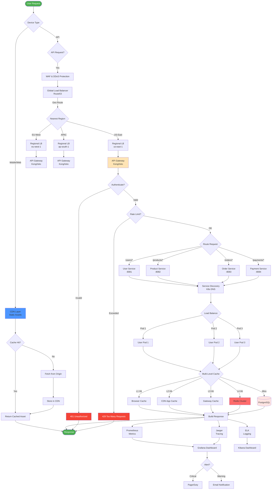
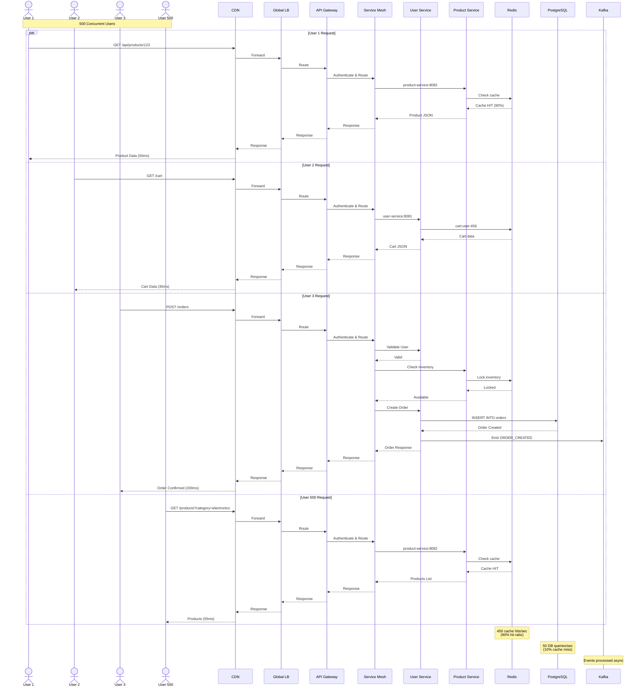
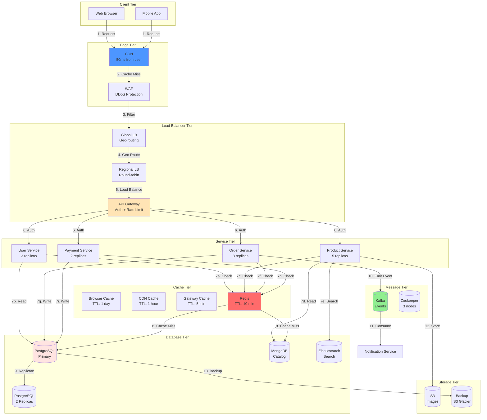
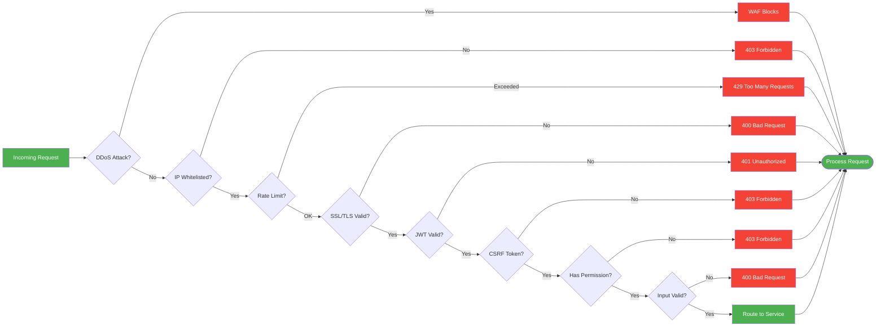
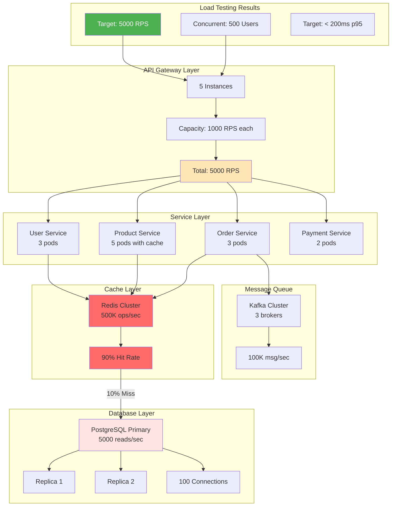
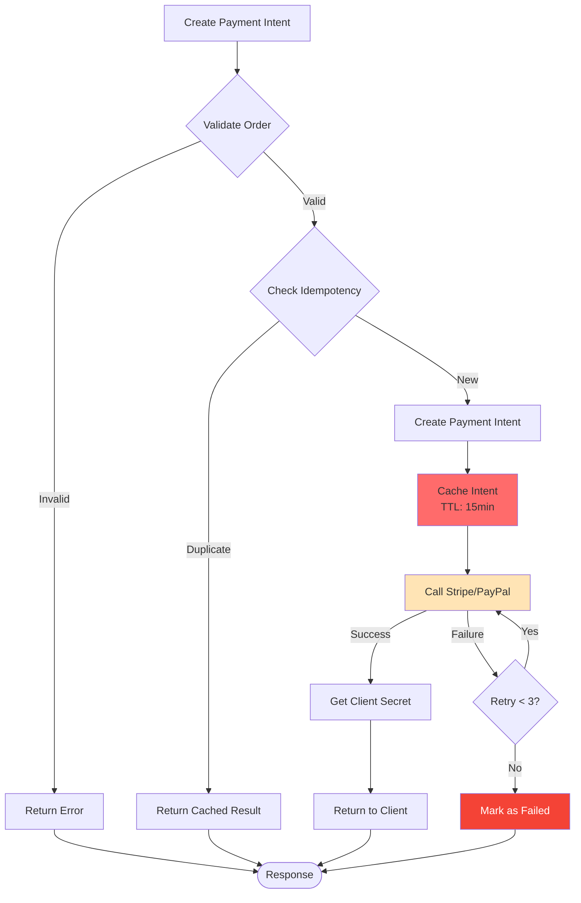
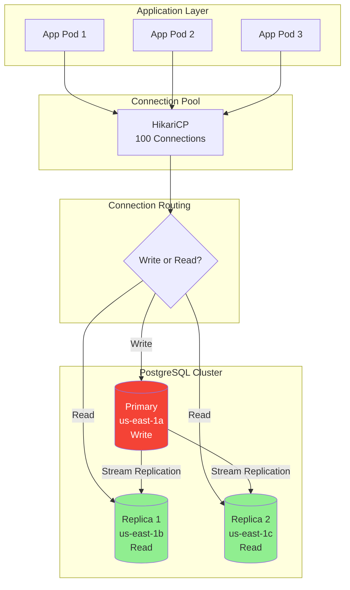
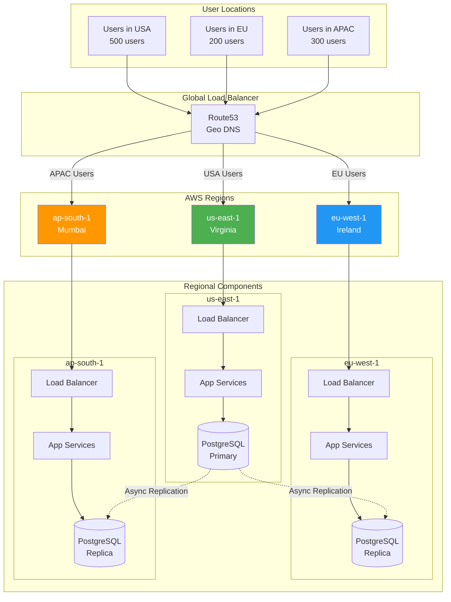
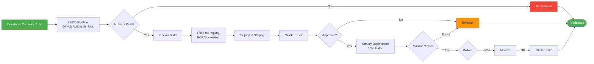

# 📊 E-Commerce Platform - Quick Reference Diagrams

> **Quick visual reference for the complete E-Commerce HLD**

---

## 🎯 Complete System Flow (Single Diagram)



---

## 🔄 Detailed Request Flow with 500 Users



---

## 🗺️ Data Flow Diagram



---

## 🔐 Security & Load Balancer Flow



---

## 🏗️ Kubernetes Pod Architecture

```mermaid
graph TB
    subgraph "Kubernetes Cluster"
        subgraph "Namespace: default"
            subgraph "Deployment: api-gateway"
                GW_POD1[Pod: api-gw-1<br/>192.168.1.10]
                GW_POD2[Pod: api-gw-2<br/>192.168.1.11]
                GW_POD3[Pod: api-gw-3<br/>192.168.1.12]
            end
            
            subgraph "Deployment: user-service"
                US_POD1[Pod: user-svc-1<br/>10.0.1.5:8081]
                US_POD2[Pod: user-svc-2<br/>10.0.1.6:8081]
            end
            
            subgraph "Deployment: product-service"
                PS_POD1[Pod: prod-svc-1<br/>10.0.2.8:8082]
                PS_POD2[Pod: prod-svc-2<br/>10.0.2.9:8082]
                PS_POD3[Pod: prod-svc-3<br/>10.0.2.10:8082]
            end
            
            subgraph "Deployment: order-service"
                OS_POD1[Pod: order-svc-1<br/>10.0.3.12:8083]
                OS_POD2[Pod: order-svc-2<br/>10.0.3.13:8083]
            end
        end
        
        subgraph "Namespace: data"
            REDIS_M[(Redis Master)]
            REDIS_S1[(Redis Slave 1)]
            REDIS_S2[(Redis Slave 2)]
            
            PG_MASTER[(PostgreSQL<br/>Primary)]
            PG_REPL1[(PostgreSQL<br/>Replica 1)]
            PG_REPL2[(PostgreSQL<br/>Replica 2)]
        end
    end
    
    subgraph "Istio Control Plane"
        ISTIOD[Istiod<br/>Control Plane]
    end
    
    subgraph "Monitoring"
        PROM[Prometheus]
        GRAF[Grafana]
        JAEGER[Jaeger]
    end
    
    GW_POD1 -.->|Sidecar| ISTIOD
    GW_POD2 -.->|Sidecar| ISTIOD
    GW_POD3 -.->|Sidecar| ISTIOD
    US_POD1 -.->|Sidecar| ISTIOD
    PS_POD1 -.->|Sidecar| ISTIOD
    OS_POD1 -.->|Sidecar| ISTIOD
    
    GW_POD1 -->|Load Balance| US_POD1 & US_POD2
    GW_POD1 -->|Load Balance| PS_POD1 & PS_POD2 & PS_POD3
    GW_POD1 -->|Load Balance| OS_POD1 & OS_POD2
    
    US_POD1 & US_POD2 --> REDIS_M
    PS_POD1 & PS_POD2 & PS_POD3 --> REDIS_M
    OS_POD1 & OS_POD2 --> REDIS_M
    
    US_POD1 & US_POD2 --> PG_MASTER
    OS_POD1 & OS_POD2 --> PG_MASTER
    PS_POD1 & PS_POD2 & PS_POD3 --> PG_MASTER
    
    PG_MASTER -->|Replicate| PG_REPL1 & PG_REPL2
    REDIS_M -->|Replicate| REDIS_S1 & REDIS_S2
    
    GW_POD1 & GW_POD2 & GW_POD3 --> PROM
    US_POD1 & US_POD2 --> PROM
    PS_POD1 & PS_POD2 & PS_POD3 --> PROM
    
    PROM --> GRAF
    PROM --> JAEGER
    
    style GW_POD1 fill:#FFE4B5
    style GW_POD2 fill:#FFE4B5
    style GW_POD3 fill:#FFE4B5
    style US_POD1 fill:#e1f5ff
    style US_POD2 fill:#e1f5ff
    style PS_POD1 fill:#90EE90
    style PS_POD2 fill:#90EE90
    style OS_POD1 fill:#FFB6C1
    style OS_POD2 fill:#FFB6C1
    style REDIS_M fill:#ff6b6b
    style PG_MASTER fill:#ffe4e1
```



---

## 📈 Performance Architecture (500 Users)



---

## 🔄 Cart Service Deep Dive

```mermaid
flowchart TD
    Start[Add to Cart Request] --> Auth{Authenticated?}
    
    Auth -->|No| Guest[Guest Cart]
    Auth -->|Yes| User[User Cart]
    
    Guest -->|Session ID| GuestStore[Redis<br/>cart:session:{id}]
    User -->|User ID| UserStore[Redis<br/>cart:user:{id}]
    
    GuestStore --> MergeCheck{Login?}
    MergeCheck -->|Yes| Merge[Merge Guest + User Cart]
    Merge --> UserStore
    MergeCheck -->|No| Continue[Continue]
    UserStore --> Continue
    
    Continue --> Validate[Validate Product<br/>Check Price & Stock]
    Validate --> Calc[Calculate Total<br/>Subtotal + Tax + Discount]
    
    Calc --> UpdateCache[Update Redis Cache]
    UpdateCache --> AsyncDB[Async DB Write]
    
    AsyncDB --> Notify[Cart Updated Event]
    Notify --> End([Response])
    
    style GuestStore fill:#FFE4B5
    style UserStore fill:#90EE90
    style Redis fill:#ff6b6b
```

---

## 💳 Payment Service Flow



---

## 📊 Database Replication Strategy



---

## 🌍 Geographic Distribution



---

## 🚀 Deployment Pipeline



---

## 📝 Quick Reference

### Key Components Summary

| Component | Technology | Purpose | Scale |
|-----------|-----------|---------|-------|
| **CDN** | CloudFront | Static assets | 1000+ req/sec |
| **Global LB** | Route53 | Geo-routing | Multi-region |
| **API Gateway** | Kong/Istio | Routing, Auth | 5000 RPS |
| **Service Mesh** | Istio | Service-to-service | 1000 services |
| **User Service** | Spring Boot | User management | 3 pods |
| **Product Service** | Spring Boot | Catalog | 5 pods |
| **Order Service** | Spring Boot | Orders | 3 pods |
| **Payment Service** | Spring Boot | Payments | 2 pods |
| **Cache** | Redis Cluster | Sessions, cart | 500K ops/sec |
| **Database** | PostgreSQL | Transactions | 5000 reads/sec |
| **Catalog DB** | MongoDB | Products | Flexible schema |
| **Search** | Elasticsearch | Product search | Full-text |
| **Message Queue** | Kafka | Events | 100K msg/sec |
| **Object Storage** | S3 | Images | Unlimited |
| **Monitoring** | Prometheus | Metrics | Time-series |
| **Logging** | ELK Stack | Logs | Centralized |

### Port Reference

```
Service          Port   Protocol   Purpose
-----------      ----   --------   -------
API Gateway      443    HTTPS      External API
User Service     8081   HTTP       Internal
Product Service  8082   HTTP       Internal
Order Service    8083   HTTP       Internal
Payment Service  8084   HTTP       Internal
Inventory Service 8085  HTTP       Internal
Notification Svc 8086   HTTP       Internal
Redis            6379   TCP        Cache
PostgreSQL       5432   TCP        Database
MongoDB          27017  TCP        Catalog
Elasticsearch    9200   HTTP       Search
Kafka            9092   TCP        Messages
Zookeeper        2181   TCP        Kafka coordination
```

### Cache TTL Reference

```
Cache Layer           Data Type              TTL
-------------------   --------------------   ------
Browser Cache         Static assets          1 day
CDN Cache             Product images         1 hour
API Gateway Cache     GET /products/*       5 minutes
Redis - Cart          User cart              30 days
Redis - Session       User session           1 hour
Redis - Catalog       Products, categories   1 hour
Redis - Rate Limit    API counters           1 minute
Database Query Cache  DB query results       1 minute
```

---

## 🎓 Interview Discussion Points

### 1. Load Balancer Strategy

**Q: Why multiple load balancer layers?**
```
A: Defense in depth + specialization:
- Global LB: Geo-routing + failover
- Regional LB: DDoS protection + distribution
- API Gateway: Business logic (auth, rate-limit)
- Service Mesh: Microservice load balancing

Each layer has specific responsibility.
```

**Q: How does Istio load balancer work?**
```
A: Istio sidecar (Envoy) intercepts all traffic:
1. Service A calls service-b.namespace.svc.cluster.local
2. DNS resolves to ClusterIP
3. kube-proxy load balances to pod IPs
4. Envoy sidecar intercepts, applies:
   - Load balancing algorithm (round-robin/least-conn)
   - Circuit breaker (if failures > threshold)
   - Retry policy (if failure)
   - Timeout configuration
```

### 2. Service Discovery

**Q: How does service discovery work in Kubernetes?**
```
A: 3 main components:
1. etcd: Stores all cluster state (services, pods)
2. CoreDNS: Translates service names to ClusterIPs
3. kube-proxy: iptables/IPVS rules for load balancing

Flow:
  Service starts → Kubelet registers in etcd
  etcd → CoreDNS updates DNS records
  Client queries DNS → Gets ClusterIP
  kube-proxy → Load balances to pod IPs
```

### 3. Caching Strategy

**Q: How to handle 500 concurrent users with caching?**
```
A: Multi-level caching:
1. Browser cache: Static assets (images, CSS)
2. CDN: Product images, static content
3. API Gateway: Product listings (5 min TTL)
4. Redis: Active data (cart, sessions, products)

For 500 users (5000 RPS):
- 90% cache hit ratio = 4500 requests served from cache
- 500 requests hit DB
- PostgreSQL handles 5000+ reads/sec easily

Result: < 200ms latency for 99% of requests
```

**Q: What to cache and what not to cache?**
```
Cache:
✓ Product catalog (read-heavy, rarely changes)
✓ Product images (static assets via CDN)
✓ User cart (fast access, Redis)
✓ User sessions (JWT validation)
✓ Rate limit counters (in-memory/Redis)

Don't Cache:
✗ Payment status (must be accurate)
✗ Inventory levels (real-time required)
✗ Order creation (write operation)
✗ User authentication decisions
```

### 4. Data Storage

**Q: Why multiple databases?**
```
A: Polyglot persistence:
- PostgreSQL: ACID transactions (orders, payments)
- MongoDB: Flexible schema (products with variants)
- Redis: High-speed cache (cart, sessions)
- Elasticsearch: Full-text search (product search)
- S3: Object storage (images, files)

Each DB optimized for specific use case.
```

**Q: How to handle database scaling?**
```
A: Read/Write separation:
- Primary DB: All writes (orders, payments)
- Read Replicas: All reads (product catalog, user queries)
- Connection pooling: 100 connections max
- Connection pool per service: Isolated resources

With 500 users:
- Primary: 100 writes/sec
- Replicas: 5000 reads/sec (split across 2 replicas)
- Each replica: 2500 reads/sec
```

---

## 🎯 Key Metrics for 500 Users

### Request Volume

```
500 users × 10 actions/min = 5000 requests/min
= 83 requests/second

PEAK HOURS (5x traffic):
= 415 requests/second

With 20% buffer:
= 500 requests/second capacity needed

COMPONENT CAPACITY:
- API Gateway: 5000 RPS (5 instances × 1000 RPS)
- Product Service: 600 RPS (5 pods × 120 RPS each)
- Order Service: 300 RPS (3 pods × 100 RPS each)
- Database: 5000 reads/sec
- Redis: 500,000 ops/sec

All components exceed requirements. ✓
```

### Cost Estimate (AWS)

```
Component              Monthly Cost
-------------------    --------------
EC2 (10 pods)          $300
RDS PostgreSQL         $200
Elasticache Redis      $150
MongoDB Atlas          $100
S3 Storage             $50
Kafka (MSK)            $200
Load Balancers         $50
Data Transfer          $100
CloudWatch             $50
-------------------    --------------
TOTAL:                 $1,200/month

With reserved instances: $800/month
```

---

## 🎓 Interview Tips

### What to Emphasize

1. **Load Balancing**: Multi-layer with different algorithms
2. **Service Discovery**: Automatic with Kubernetes DNS
3. **Caching**: Multiple layers with appropriate TTLs
4. **Database**: Right database for right job (polyglot)
5. **Observability**: Metrics, logs, traces (3 pillars)
6. **Scalability**: Horizontal scaling, auto-scaling
7. **Resilience**: Circuit breakers, retries, fallbacks
8. **Security**: Defense in depth (WAF → Gateway → Service)

### Common Follow-up Questions

1. **"How to handle 5000 users instead of 500?"**
   - Scale horizontally (more pods)
   - Add more database read replicas
   - Increase Redis cluster size
   - Use CDN more aggressively

2. **"How to reduce latency from 200ms to 100ms?"**
   - More caching (longer TTLs)
   - Database query optimization
   - Connection pooling
   - Reduce service-to-service calls

3. **"How to ensure zero downtime deployment?"**
   - Blue-green deployment
   - Canary releases with Istio
   - Rolling updates
   - Health checks

4. **"How to handle database failures?"**
   - Read replicas for failover
   - Connection pool retry logic
   - Circuit breaker pattern
   - Graceful degradation

---

## 📚 Further Reading

- [Istio Documentation](https://istio.io)
- [Kubernetes Service Discovery](https://kubernetes.io/docs/concepts/services-networking/service)
- [Redis Caching Patterns](https://redis.io/topics/lru-cache)
- [Database Replication](https://www.postgresql.org/docs/current/high-availability.html)
- [Microservices Patterns](https://microservices.io/patterns/)

---

**Last Updated**: June 2026 | **Version**: 1.0