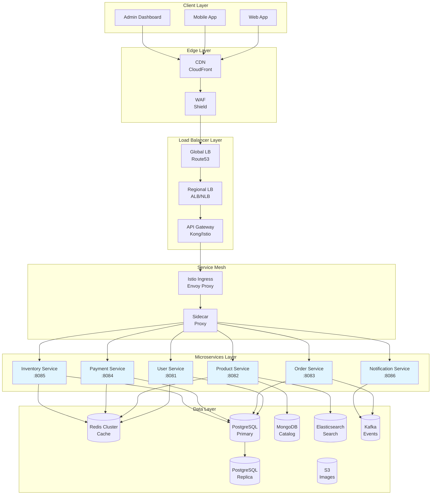
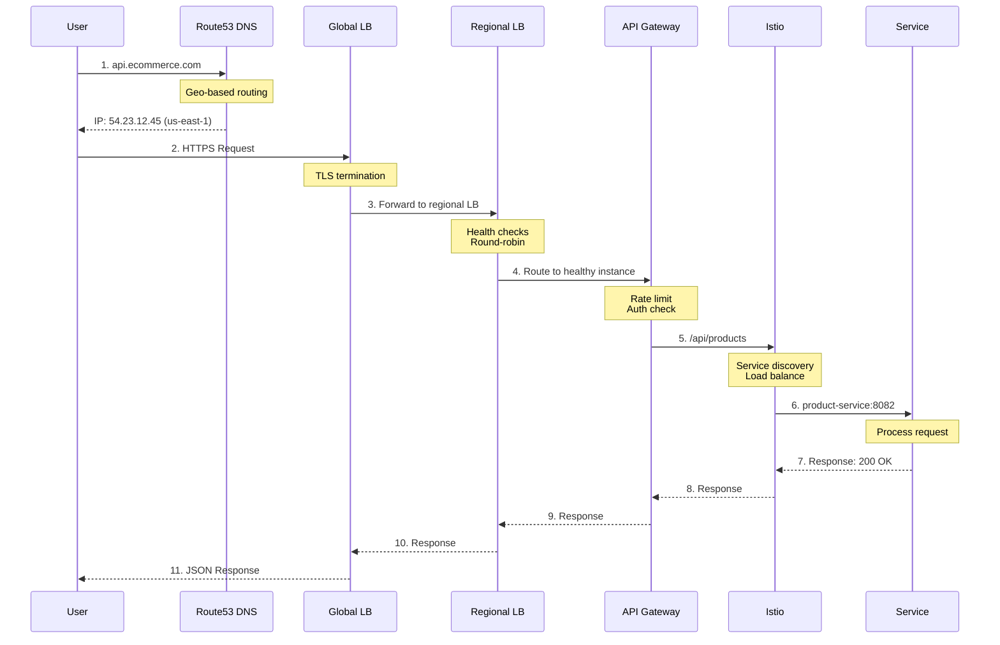
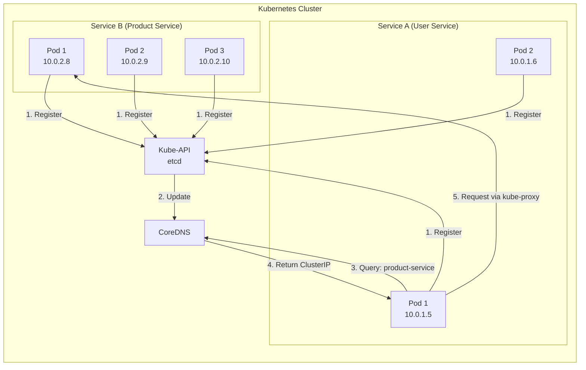
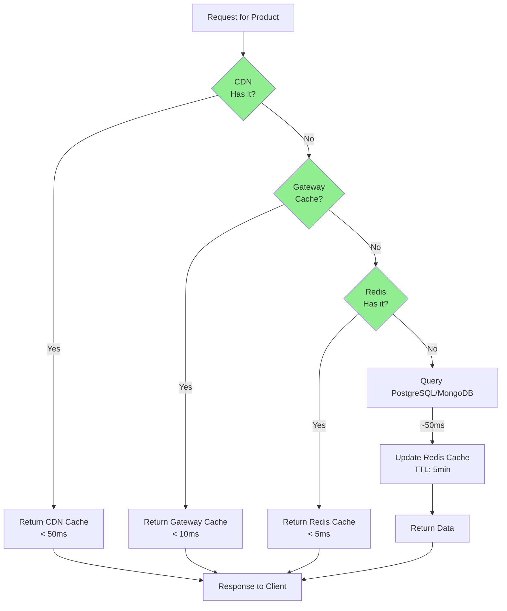
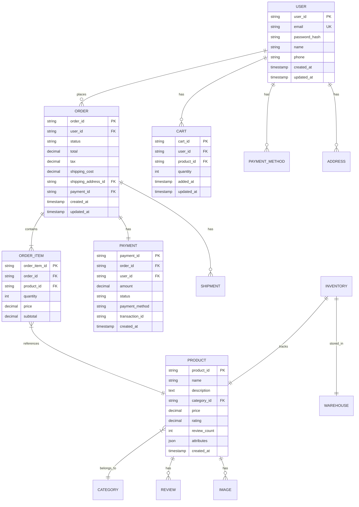
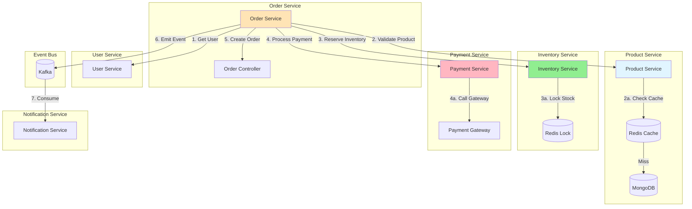
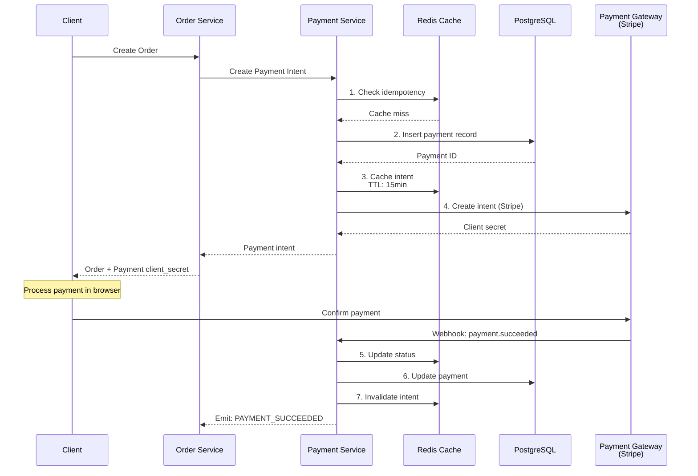
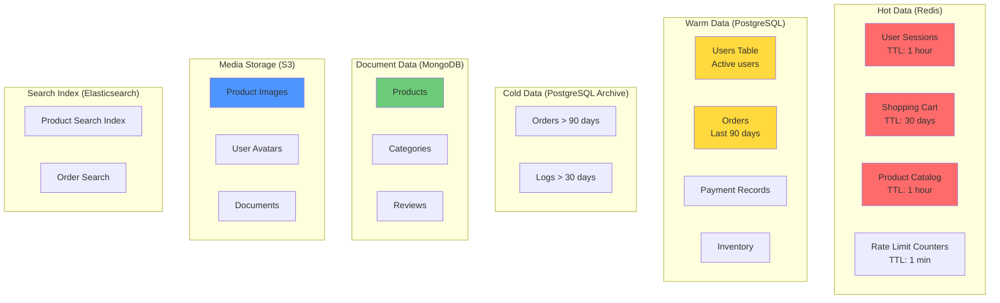
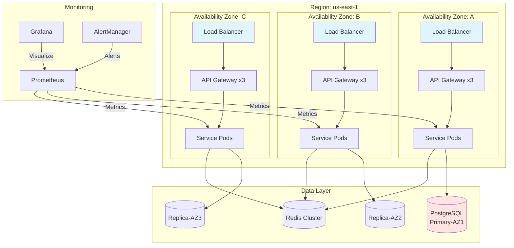

# 🛍️ E-Commerce Platform - High-Level Design

> **Scalable E-Commerce System Design for 500+ Concurrent Users**

---

## 📋 Table of Contents

1. [Requirements](#requirements)
2. [System Architecture](#system-architecture)
3. [Load Balancing Strategy](#load-balancing-strategy)
4. [Service Discovery](#service-discovery)
5. [API Gateway](#api-gateway)
6. [Service Mesh (Istio)](#service-mesh-istio)
7. [Caching Strategy](#caching-strategy)
8. [Data Storage](#data-storage)
9. [Request Flow](#request-flow)
10. [Scalability & Performance](#scalability--performance)
11. [Mermaid Diagrams](#mermaid-diagrams)

---

## 🎯 Requirements

### Functional Requirements
- User registration and authentication
- Product catalog and search
- Shopping cart management
- Order placement and tracking
- Payment processing
- Inventory management
- Notifications

### Non-Functional Requirements
- **Availability**: 99.9% uptime
- **Latency**: < 200ms for API responses
- **Scalability**: Support 500+ concurrent users
- **Consistency**: Eventual consistency for catalog, strong for orders
- **Security**: JWT authentication, HTTPS, rate limiting

---

## 🏗️ System Architecture

### High-Level Components

```
┌─────────────────────────────────────────────────────────────┐
│                        CLIENT LAYER                          │
│  (Web App, Mobile App, Admin Dashboard)                      │
└───────────────────────┬─────────────────────────────────────┘
                        │
                        ▼
┌─────────────────────────────────────────────────────────────┐
│                      CDN / EDGE CACHE                         │
│              (Static assets, product images)                  │
└───────────────────────┬─────────────────────────────────────┘
                        │
                        ▼
┌─────────────────────────────────────────────────────────────┐
│                    LOAD BALANCER LAYER                        │
│  ┌──────────────────────────────────────────────────────┐   │
│  │  Global LB (DNS-based / Cloud LB)                     │   │
│  │  └─ Routes to Regional LB                             │   │
│  └──────────────────────────────────────────────────────┘   │
│                        │                                      │
│  ┌──────────────────────────────────────────────────────┐   │
│  │  API Gateway (Kong / AWS API Gateway / Istio)         │   │
│  │  └─ Rate limiting, Auth, Routing                      │   │
│  └──────────────────────────────────────────────────────┘   │
└───────────────────────┬─────────────────────────────────────┘
                        │
                        ▼
┌─────────────────────────────────────────────────────────────┐
│                    SERVICE MESH LAYER                         │
│              (Istio / Linkerd for service-to-service)         │
└───────────────────────┬─────────────────────────────────────┘
                        │
        ┌───────────────┼───────────────┐
        ▼               ▼               ▼
┌──────────────┐ ┌──────────────┐ ┌──────────────┐
│   User       │ │   Product    │ │    Order     │
│   Service    │ │   Service    │ │   Service    │
│  (Port 8081) │ │  (Port 8082) │ │  (Port 8083) │
└──────────────┘ └──────────────┘ └──────────────┘
        │               │               │
        ▼               ▼               ▼
┌──────────────┐ ┌──────────────┐ ┌──────────────┐
│  Payment     │ │ Inventory    │ │ Notification │
│  Service     │ │  Service     │ │   Service    │
│ (Port 8084)  │ │ (Port 8085)  │ │ (Port 8086)  │
└──────────────┘ └──────────────┘ └──────────────┘
        │               │               │
        └───────────────┼───────────────┘
                        ▼
┌─────────────────────────────────────────────────────────────┐
│                      DATA LAYER                               │
│  ┌──────────┐ ┌──────────┐ ┌──────────┐ ┌──────────┐      │
│  │   Redis  │ │PostgreSQL│ │  MongoDB │ │   S3     │      │
│  │ (Cache)  │ │(Primary) │ │(Catalog) │ │(Images)  │      │
│  └──────────┘ └──────────┘ └──────────┘ └──────────┘      │
└─────────────────────────────────────────────────────────────┘
```

---

## ⚖️ Load Balancing Strategy

### Multi-Layer Load Balancing

```
Request Flow through LB Layers:

1. CLIENT REQUEST
   │
   ▼
2. GLOBAL LOAD BALANCER (Cloud LB / DNS)
   │  └─ Geo-based routing (user → nearest region)
   │  └─ Health checks
   │
   ▼
3. REGIONAL LOAD BALANCER
   │  └─ Distributes to API Gateway instances
   │  └─ Algorithm: Round-robin / Least connections
   │
   ▼
4. API GATEWAY (Istio Ingress Gateway)
   │  └─ Rate limiting
   │  └─ Authentication
   │  └─ Route to service
   │
   ▼
5. SERVICE MESH (Istio Sidecar)
   │  └─ Load balance to service instances
   │  └─ Retries, circuit breaking
   │  └─ Observability (tracing, metrics)
   │
   ▼
6. SERVICE INSTANCE (Pod in Kubernetes)
```

### Load Balancer Types & Algorithms

| LB Type | Location | Algorithm | Purpose |
|---------|----------|-----------|---------|
| **Global LB** | DNS/Cloud | Geo-routing | Route user to nearest region |
| **Regional LB** | Cloud | Round-robin | Distribute across AZs |
| **API Gateway** | Cluster | Least connections | Distribute API traffic |
| **Service Mesh** | Pod-level | Weighted round-robin | Distribute within service |

### Istio Load Balancing Configuration

```yaml
apiVersion: networking.istio.io/v1alpha3
kind: DestinationRule
metadata:
  name: product-service
spec:
  host: product-service
  trafficPolicy:
    loadBalancer:
      simple: LEAST_CONN  # or ROUND_ROBIN, RANDOM
    connectionPool:
      tcp:
        maxConnections: 100
      http:
        http1MaxPendingRequests: 50
        maxRequestsPerConnection: 10
```

---

## 🔍 Service Discovery

### How Service Discovery Works

```
SERVICE REGISTRY (Consul / Kubernetes DNS / Istio)

┌──────────────┐
│   Service    │
│   Registry   │
│              │
│  product-svc │──► IP:10.0.1.5:8082
│  order-svc   │──► IP:10.0.2.8:8083
│  user-svc    │──► IP:10.0.3.12:8081
└──────────────┘

FLOW:
1. Service starts → Register with registry
2. Health check every 10s
3. If fails → Deregister
4. Client queries registry → Get instances → Load balance
```

### Kubernetes Service Discovery (Built-in)

```yaml
apiVersion: v1
kind: Service
metadata:
  name: product-service
spec:
  selector:
    app: product-service
  ports:
    - port: 8082
      targetPort: 8082
  type: ClusterIP
```

### Service Discovery Flow

```
INTERNAL REQUEST (Service A → Service B)

Service A (Pod)
   │
   ├─ DNS Query: product-service.default.svc.cluster.local
   │
   ▼
Kubernetes DNS (CoreDNS)
   │
   ├─ Returns ClusterIP: 10.96.0.5
   │
   ▼
kube-proxy (iptables/IPVS)
   │
   ├─ Load balances to: [10.0.1.5:8082, 10.0.1.6:8082, 10.0.1.7:8082]
   │
   ▼
Product Service Pods
   │
   └─ Istio Sidecar (Envoy) intercepts
       ├─ Metrics, tracing
       ├─ Retries
       └─ Circuit breaking
```

---

## 🚪 API Gateway Layer

### API Gateway Responsibilities

```
┌────────────────────────────────────────┐
│         API GATEWAY (Kong/Istio)       │
├────────────────────────────────────────┤
│ 1. Authentication & Authorization      │
│    └─ JWT validation                   │
│                                        │
│ 2. Rate Limiting                       │
│    └─ 100 requests/min per user        │
│                                        │
│ 3. Request Routing                     │
│    └─ /api/users/* → user-service      │
│    └─ /api/products/* → product-service│
│    └─ /api/orders/* → order-service    │
│                                        │
│ 4. Request/Response Transformation     │
│    └─ GraphQL/REST translation         │
│                                        │
│ 5. Caching                              │
│    └─ Cache GET /products/* for 5min  │
│                                        │
│ 6. Logging & Monitoring                │
│    └─ Access logs, metrics             │
└────────────────────────────────────────┘
```

### API Gateway Routing Configuration

```yaml
apiVersion: networking.istio.io/v1alpha3
kind: VirtualService
metadata:
  name: ecommerce-gateway
spec:
  hosts:
    - "api.ecommerce.com"
  gateways:
    - ecommerce-gateway
  http:
    - match:
        - uri:
            prefix: /api/users
      route:
        - destination:
            host: user-service
            port:
              number: 8081
      retries:
        attempts: 3
        perTryTimeout: 2s
      fault:
        delay:
          percentage:
            value: 0.1
          fixedDelay: 5ms
    
    - match:
        - uri:
            prefix: /api/products
      route:
        - destination:
            host: product-service
            port:
              number: 8082
      # Cache at gateway level
      headers:
        response:
          set:
            cache-control: "public, max-age=300"
```

---

## 🕸️ Service Mesh (Istio)

### Istio Architecture

```
                    ┌──────────────────┐
                    │   Istiod         │
                    │ (Control Plane)  │
                    │                  │
                    │ - Configuration  │
                    │ - Certificates   │
                    │ - Service Discovery│
                    └────────┬─────────┘
                             │ xDS API
                             │
        ┌────────────────────┼────────────────────┐
        │                    │                    │
        ▼                    ▼                    ▼
┌──────────────┐   ┌──────────────┐   ┌──────────────┐
│  Envoy       │   │  Envoy       │   │  Envoy       │
│  Sidecar     │   │  Sidecar     │   │  Sidecar     │
│  (user-svc)  │   │(product-svc) │   │ (order-svc)  │
│              │   │              │   │              │
│ - Load Bal.  │   │ - Load Bal.  │   │ - Load Bal.  │
│ - Retries    │   │ - Retries    │   │ - Retries    │
│ - Circuit    │   │ - Circuit    │   │ - Circuit    │
│   Breaker    │   │   Breaker    │   │   Breaker    │
│ - mTLS       │   │ - mTLS       │   │ - mTLS       │
│ - Observ.    │   │ - Observ.    │   │ - Observ.    │
└──────┬───────┘   └──────┬───────┘   └──────┬───────┘
       │                   │                   │
       ▼                   ▼                   ▼
  user-service        product-service       order-service
```

### Istio Features Used

| Feature | Purpose | Benefit |
|---------|---------|---------|
| **Traffic Management** | Load balancing, routing | Reliable delivery |
| **Security** | mTLS between services | Zero-trust security |
| **Observability** | Distributed tracing | Debug microservices |
| **Resilience** | Circuit breakers, retries | Handle failures |
| **Traffic Shifting** | Canary deployments | Safe releases |

---

## 💾 Caching Strategy

### Multi-Level Caching Architecture

```
REQUEST FLOW:
Client → CDN → API Gateway Cache → Service Cache (Redis) → Database

CACHE LAYERS:
┌────────────────────────────────────────────┐
│ L1: Browser Cache                           │
│ └─ Static assets (images, CSS, JS)         │
│ TTL: 1 day                                  │
├────────────────────────────────────────────┤
│ L2: CDN Cache                               │
│ └─ Product images, static content           │
│ TTL: 1 hour                                 │
├────────────────────────────────────────────┤
│ L3: API Gateway Cache                       │
│ └─ GET /api/products?category=electronics   │
│ TTL: 5 minutes                              │
├────────────────────────────────────────────┤
│ L4: Application Cache (Redis)               │
│ └─ Product catalog, user sessions, cart     │
│ TTL: 10 minutes                             │
├────────────────────────────────────────────┤
│ L5: Database Query Cache                    │
│ └─ Frequently accessed DB queries           │
│ TTL: 1 minute                               │
└────────────────────────────────────────────┘
```

### What to Cache and What Not to Cache

| Data | Cache? | Reason | TTL |
|------|--------|--------|-----|
| Product catalog | ✅ Yes | Read-heavy, rarely changes | 1 hour |
| Product images | ✅ Yes (CDN) | Static assets | 1 day |
| User cart | ✅ Yes (Redis) | Active user data | 30 min |
| User sessions | ✅ Yes (Redis) | Fast auth checks | 1 hour |
| Payment status | ❌ No | Must be accurate | N/A |
| Order details | ⚠️ Partial | Cache completed orders | 15 min |
| Inventory | ❌ No | Must be real-time | N/A |
| Prices | ✅ Yes | Change infrequently | 30 min |

### Cart Caching Strategy

```
SHOPPING CART:
  Guest User:
    - Store in Redis with session ID
    - Key: cart:session_id
    - TTL: 24 hours
    - Merge with user cart on login
  
  Logged-in User:
    - Store in Redis with user ID
    - Key: cart:user:{user_id}
    - TTL: 30 days (extend on activity)
    - Sync to DB periodically
  
CART STRUCTURE (Redis Hash):
  HSET cart:user:123 product:456 quantity 2
  HSET cart:user:123 product:789 quantity 1
  HSET cart:user:123 updated_at 2026-06-15
  
CART TOTAL CALCULATION:
  - Calculate on read (not write)
  - Cache total for 5 minutes
  - Invalidate on cart change
```

### Payment Caching Strategy

```
PAYMENT FLOW WITH CACHING:

1. CREATE PAYMENT INTENT
   - Cache: payment:intent:{id} → PaymentIntent (TTL: 15min)
   - Purpose: Fast retrieval during processing

2. PAYMENT STATUS CHECK
   - Cache: payment:status:{id} → status (TTL: 5min)
   - Invalidate on status change
   - Fallback to DB if cache miss

3. PAYMENT METHODS
   - Cache: payment:methods:{user_id} → List (TTL: 1hour)
   - Invalidate on add/remove

4. IDEMPOTENCY
   - Cache: payment:idempotency:{request_id} → result (TTL: 24h)
   - Prevent duplicate charges

REDIS STRUCTURES USED:
  - Strings: Cache payment intent
  - Hash: Store payment details
  - Set: Track processed request IDs
  - Sorted Set: Payment history with timestamps
```

---

## 🗄️ Data Storage

### Database Architecture

```
                     ┌─────────────────┐
                     │   Primary DB    │
                     │  (PostgreSQL)   │
                     │                 │
                     │ - Users         │
                     │ - Orders        │
                     │ - Payments      │
                     │ - Notifications │
                     └────────┬────────┘
                              │ Replication
                              ▼
                     ┌─────────────────┐
                     │  Read Replica   │
                     │  (PostgreSQL)   │
                     │                 │
                     │ - Reads only    │
                     │ - Analytics     │
                     └─────────────────┘

CATALOG DB (MongoDB):
  - Products
  - Categories
  - Reviews
  - (Schema flexibility for product attributes)

CACHE (Redis Cluster):
  - Sessions
  - Cart
  - Product catalog cache
  - Rate limiting counters

OBJECT STORAGE (S3):
  - Product images
  - User avatars
  - Documents

SEARCH (Elasticsearch):
  - Product search
  - Order search
  - Logs
```

### Data Model

```
USERS TABLE:
  user_id (PK) | email | password_hash | name | phone | created_at | updated_at

PRODUCTS TABLE (MongoDB):
  {
    "_id": "prod_123",
    "name": "iPhone 15",
    "description": "Latest iPhone",
    "category": "electronics",
    "price": 999.99,
    "inventory": {
      "warehouse_1": 100,
      "warehouse_2": 50
    },
    "images": ["s3://bucket/iphone15_1.jpg"],
    "attributes": {
      "color": "black",
      "storage": "256GB"
    },
    "rating": 4.5,
    "review_count": 120
  }

ORDERS TABLE:
  order_id (PK) | user_id (FK) | status | total | tax | shipping | 
  shipping_address | payment_id | created_at | updated_at
  
  INDEX: (user_id, created_at)
  INDEX: (status, created_at)

ORDER_ITEMS TABLE:
  order_item_id (PK) | order_id (FK) | product_id | quantity | price

CART TABLE (Redis):
  Key: cart:user:{user_id}
  Type: Hash
  Fields:
    - product:{product_id}: quantity
    - updated_at: timestamp
```

---

## 🔄 Request Flow

### Complete Request Flow (Buy Product)

```
STEP-BY-STEP REQUEST FLOW:

1. USER: "Buy iPhone 15"
   │
   ▼
2. BROWSER: POST /api/orders
   Headers: Authorization: Bearer <JWT>
   Body: {items: [{product_id: 123, quantity: 1}], address_id: 456}
   │
   ▼
3. CDN: No cache (POST request)
   │
   ▼
4. LOAD BALANCER: Route to healthy API Gateway
   │
   ▼
5. API GATEWAY:
   - Authenticate JWT ✓
   - Rate limit check ✓
   - Route to order-service
   │
   ▼
6. ISTIO INGRESS: Log, trace, forward to order-service pod
   │
   ▼
7. ORDER SERVICE POD:
   - Receive request
   - Validate cart
   │
   ├─→ 7a. CALL PRODUCT SERVICE (via Istio)
   │   - Check product availability
   │   - Lock: inventory:product:123 (Redis)
   │   - Cache hit: instant
   │   │
   │   ▼
   │   PRODUCT SERVICE:
   │   - Check inventory (Redis → DB)
   │   - Return: {available: true, price: 999.99}
   │   │
   │   └─← Response: 200 OK
   │
   ├─→ 7b. CALL PAYMENT SERVICE (via Istio)
   │   - Create payment intent
   │   - Cache: payment:intent:{id}
   │   │
   │   ▼
   │   PAYMENT SERVICE:
   │   - Return client secret
   │   │
   │   └─← Response: 200 OK
   │
   ├─→ 7c. CREATE ORDER
   │   - Insert into DB
   │   - Cache: order:{id}
   │   - Emit event: ORDER_CREATED (Kafka)
   │   │
   │   ▼
   │   DATABASE:
   │   - INSERT INTO orders
   │   - INSERT INTO order_items
   │   │
   │   └─← Order created
   │
   └─→ 7d. RETURN RESPONSE
       - order_id, payment_client_secret
       │
       ▼
8. ISTIO EGRESS: Log response time, trace
   │
   ▼
9. API GATEWAY: Return to client
   │
   ▼
10. BROWSER: Show order confirmation
    - Process payment (Stripe/PayPal)
    │
    ▼
11. PAYMENT WEBHOOK:
    - Update payment status
    - Invalidate cache
    - Confirm order
    - Emit event: ORDER_CONFIRMED
```

---

## ⚡ Scalability & Performance

### Handling 500+ Concurrent Users

```
CONCURRENT USERS: 500
REQUESTS PER USER: 10 (browsing + actions)
TOTAL RPS: 5000

BOTTLENECK ANALYSIS:

1. API Gateway:
   - 3 instances × 1000 RPS = 3000 RPS capacity
   - Need: 5 instances for 5000 RPS

2. Product Service:
   - Cache hit ratio: 90%
   - DB queries: 500 RPS (10% of 5000)
   - 2 instances × 300 RPS = 600 RPS ✓

3. Order Service:
   - Write-heavy (orders)
   - DB: 100 orders/sec peak
   - 2 instances ✓

4. Database:
   - PostgreSQL: 5000 reads/sec, 100 writes/sec
   - Connection pool: 100 connections
   - Read replicas: 2

5. Redis:
   - Cache hit: 90%
   - 500,000 ops/sec capacity
   - Cluster mode for HA
```

### Auto-Scaling Strategy

```yaml
apiVersion: autoscaling/v2
kind: HorizontalPodAutoscaler
metadata:
  name: product-service-hpa
spec:
  scaleTargetRef:
    apiVersion: apps/v1
    kind: Deployment
    name: product-service
  minReplicas: 2
  maxReplicas: 10
  metrics:
    - type: Resource
      resource:
        name: cpu
        target:
          type: Utilization
          averageUtilization: 70
    - type: Pods
      pods:
        metric:
          name: http_requests_per_second
        target:
          type: AverageValue
          averageValue: "1000"
```

### Performance Optimizations

| Optimization | Implementation | Benefit |
|--------------|----------------|---------|
| **Connection Pooling** | HikariCP (100 connections) | Reduce DB overhead |
| **Redis Caching** | Multi-level caching | 90% cache hit ratio |
| **Database Indexing** | Index on frequently queried fields | 10x faster queries |
| **Async Processing** | Kafka for events | Non-blocking operations |
| **CDN** | CloudFront/Cloudflare | Static asset speed |
| **Compression** | Gzip/Brotli | 70% smaller responses |
| **Database Read Replicas** | 2 read replicas | Distribute read load |

---

## 📊 Mermaid Diagrams

### 1. Overall Architecture Diagram



### 2. Load Balancer Request Flow



### 3. Service Discovery Flow



### 4. Cache Flow Diagram



### 5. Database Schema (ERD)



### 6. Service Communication Diagram



### 7. Cart Architecture with Caching

```mermaid
graph TB
    subgraph "Cart Service"
        CC[Cart Controller]
        CS[Cart Service]
        REPO[Cart Repository]
    end
    
    subgraph "Cache Layer"
        CART_CACHE[(Redis<br/>cart:user:{id})]
        CART_TTL[TTL: 30 days]
        SESSION_CACHE[(Redis<br/>session:*)]
    end
    
    subgraph "Database"
        CART_DB[(PostgreSQL<br/>cart table)]
        PRODUCT_DB[(Product DB<br/>price & availability)]
    end
    
    CLIENT[Client Request] --> CC
    CC --> CS
    
    CS -->|1. Check Cache| CART_CACHE
    CART_CACHE -->|Hit| CS
    CART_CACHE -->|Miss| REPO
    
    REPO -->|2. DB Fallback| CART_DB
    REPO -->|3. Validate| PRODUCT_DB
    
    CS -->|4. Update| CART_CACHE
    CS -->|5. Async Write| CART_DB
    
    CS -->|Response| CLIENT
    
    style CART_CACHE fill:#90EE90
    style CART_DB fill:#FFE4B5
```

### 8. Payment Flow with Caching



### 9. Data Storage Strategy



### 10. Scalability Architecture



---

## 🔐 Security Considerations

### Security Layers

```
1. WAF (Web Application Firewall)
   - SQL injection protection
   - XSS protection
   - DDoS mitigation

2. API Gateway
   - Rate limiting (100 req/min per user)
   - JWT authentication
   - IP whitelisting

3. Service Mesh (Istio)
   - mTLS between services
   - Authorization policies
   - Request authentication

4. Application
   - Input validation
   - SQL injection prevention
   - XSS prevention
   - CSRF tokens

5. Data
   - Encryption at rest (AES-256)
   - Encryption in transit (TLS 1.3)
   - PII data masking
```

---

## 📈 Monitoring & Observability

### Three Pillars of Observability

```
1. METRICS (Prometheus + Grafana)
   - Request rate, error rate, duration (RED)
   - CPU, memory, disk (USE)
   - Business metrics: orders/sec, revenue

2. LOGS (ELK Stack)
   - Application logs
   - Access logs
   - Error logs
   - Correlation IDs

3. TRACES (Jaeger/Zipkin)
   - Distributed tracing
   - Service dependency map
   - Latency analysis

DASHBOARDS:
  - Real-time traffic (QPS, latency)
  - Error rates by service
  - Database performance
  - Cache hit ratios
  - Business KPIs (orders, revenue)
```

---

## 🚀 Deployment Architecture

### Kubernetes Deployment

```yaml
# Sample Deployment for Product Service
apiVersion: apps/v1
kind: Deployment
metadata:
  name: product-service
  labels:
    app: product-service
spec:
  replicas: 3
  selector:
    matchLabels:
      app: product-service
  template:
    metadata:
      labels:
        app: product-service
    spec:
      containers:
      - name: product-service
        image: product-service:v1.0.0
        ports:
        - containerPort: 8082
        env:
        - name: REDIS_HOST
          value: "redis-cluster"
        - name: DB_HOST
          value: "postgres-primary"
        resources:
          requests:
            cpu: "500m"
            memory: "512Mi"
          limits:
            cpu: "1000m"
            memory: "1Gi"
        livenessProbe:
          httpGet:
            path: /health
            port: 8082
          initialDelaySeconds: 30
          periodSeconds: 10
        readinessProbe:
          httpGet:
            path: /ready
            port: 8082
          initialDelaySeconds: 5
          periodSeconds: 5
```

---

## 📊 Performance Targets

### Service-Level Objectives (SLOs)

| Service | Latency (p95) | Availability | Error Rate |
|---------|---------------|--------------|------------|
| API Gateway | 50ms | 99.99% | < 0.01% |
| User Service | 100ms | 99.9% | < 0.1% |
| Product Service | 150ms | 99.9% | < 0.1% |
| Order Service | 200ms | 99.9% | < 0.1% |
| Payment Service | 500ms | 99.99% | < 0.01% |
| Notification Service | 1000ms | 99.5% | < 0.5% |

---

## 🎯 Key Takeaways

1. **Multi-layer LB**: DNS → Cloud LB → API Gateway → Service Mesh
2. **Service Discovery**: Kubernetes DNS + Istio for automatic discovery
3. **Caching Everywhere**: CDN → Gateway → Redis → Browser
4. **Data Partitioning**: Primary/Replica, Read/Write separation
5. **Event-Driven**: Kafka for async processing
6. **Observability**: Metrics, logs, traces for every request
7. **Security**: Zero-trust with mTLS, rate limiting, WAF
8. **Scalability**: Horizontal scaling, auto-scaling, load distribution