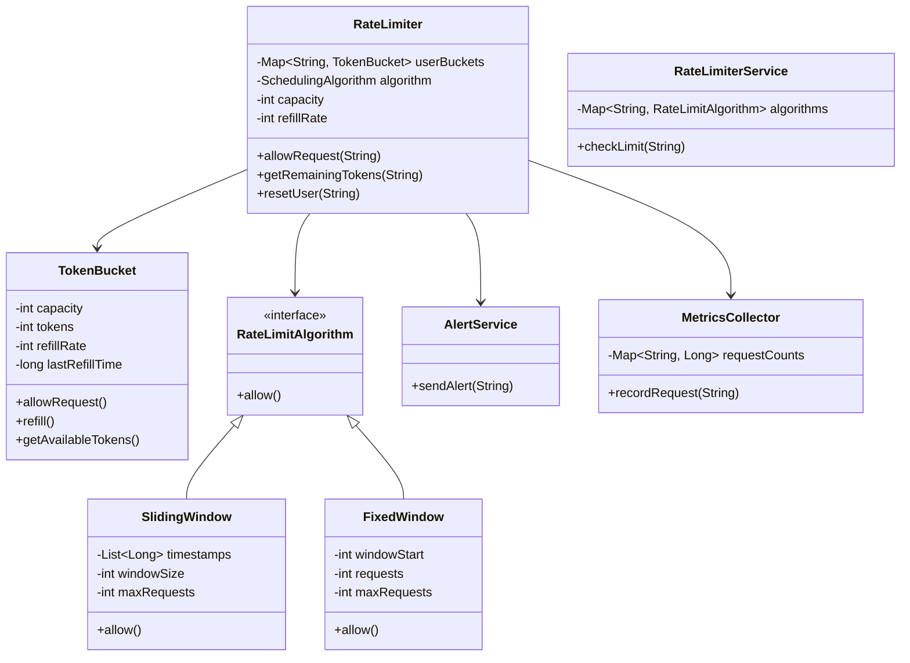
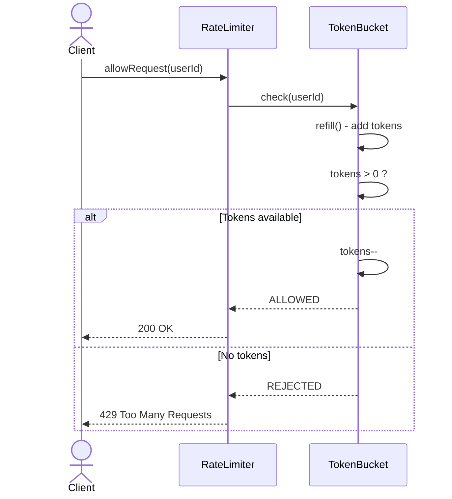
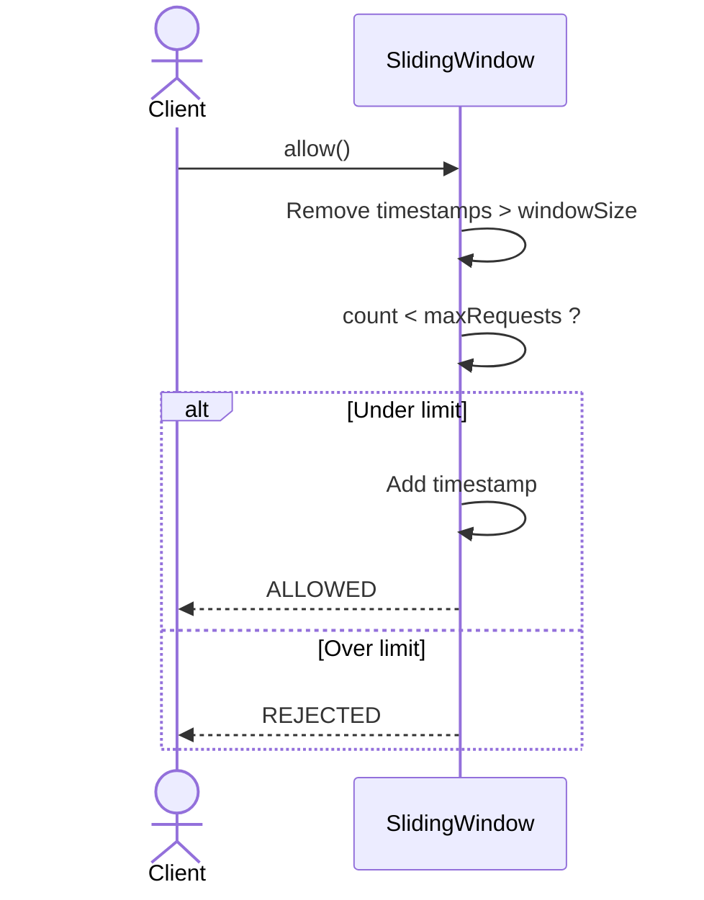

# Rate Limiter System - Complete LLD

## Class Diagram



## Components

### 1. **TokenBucket** - Token Bucket Algorithm
- **Attributes:**
  - `capacity` (int) - Max tokens
  - `tokens` (int) - Current tokens
  - `refillRate` (int) - Tokens per second
  - `lastRefillTime` (long) - Last refill timestamp

- **Methods:**
  - `allowRequest()` - Check and consume token
  - `refill()` - Add tokens based on time
  - `getAvailableTokens()` - Current token count

### 2. **SlidingWindow** - Sliding Window Algorithm
- **Attributes:**
  - `timestamps` (List<Long>) - Request timestamps
  - `windowSize` (int) - Time window (seconds)
  - `maxRequests` (int) - Max requests per window

- **Methods:**
  - `allow()` - Check if request allowed
  - `cleanup()` - Remove old timestamps

### 3. **FixedWindow** - Fixed Window Algorithm
- **Attributes:**
  - `windowStart` (int) - Window start time
  - `requests` (int) - Requests in current window
  - `maxRequests` (int) - Max requests per window

- **Methods:**
  - `allow()` - Check and increment
  - `reset()` - New window

### 4. **RateLimiter** - Main Controller
- **Attributes:**
  - `userBuckets` (Map<String, TokenBucket>) - Per-user buckets
  - `algorithm` (SchedulingAlgorithm) - Current algorithm
  - `capacity` (int) - Bucket capacity
  - `refillRate` (int) - Refill speed

- **Methods:**
  - `allowRequest(String userId)` - Check if request allowed
  - `getRemainingTokens(String userId)` - Check remaining quota
  - `resetUser(String userId)` - Reset user limits

## Design Patterns Used

### 1. **Strategy Pattern** (Rate Limiting Algorithms)
```java
interface RateLimitAlgorithm {
    boolean allow();
}

class TokenBucket implements RateLimitAlgorithm {
    private int capacity;
    private int tokens;
    private int refillRate;
    
    public boolean allow() {
        refill();
        if (tokens > 0) {
            tokens--;
            return true;
        }
        return false;
    }
}

class SlidingWindow implements RateLimitAlgorithm {
    private List<Long> timestamps;
    private int windowSize;
    private int maxRequests;
    
    public boolean allow() {
        cleanup();
        if (timestamps.size() < maxRequests) {
            timestamps.add(System.currentTimeMillis());
            return true;
        }
        return false;
    }
}

// Usage: Switch algorithms at runtime
rateLimiter.setAlgorithm(new TokenBucket(capacity, refillRate));
```

### 2. **Factory Pattern** (Algorithm Creation)
```java
class RateLimiterFactory {
    public static RateLimitAlgorithm createAlgorithm(AlgorithmType type) {
        switch (type) {
            case TOKEN_BUCKET:
                return new TokenBucket();
            case SLIDING_WINDOW:
                return new SlidingWindow();
            case FIXED_WINDOW:
                return new FixedWindow();
            default:
                throw new IllegalArgumentException();
        }
    }
}
```

## Rate Limiting Algorithms

### 1. **Token Bucket** (Most Popular)
```
Bucket capacity: 10 tokens
Refill rate: 1 token per second

Request 1: tokens=10 → 9 ✓
Request 2: tokens=9 → 8 ✓
...
Request 10: tokens=1 → 0 ✓
Request 11: tokens=0 → REJECTED

After 1 second: tokens=1
Request 12: tokens=1 → 0 ✓

Advantages:
- Allows burst traffic (up to capacity)
- Smooth rate limiting
- Used by: AWS, Google APIs

Disadvantages:
- Memory overhead (store bucket per user)
- Complex tuning
```

### 2. **Sliding Window**
```
Window: 1 minute (60 seconds)
Max requests: 10

Time: 0s → Request 1 ✓
Time: 10s → Request 2 ✓
...
Time: 55s → Request 10 ✓
Time: 56s → Request 11 → REJECTED (10 requests in last 60s)

Time: 61s → Request 11 ✓ (Request 1 expired)

Advantages:
- Precise rate limiting
- No burst allowance

Disadvantages:
- Memory overhead (store timestamps)
- Higher computation cost
```

### 3. **Fixed Window**
```
Window: 1 minute (aligned to clock)
Max requests: 10

12:00:00 → Request 1 ✓
12:00:10 → Request 2 ✓
...
12:00:59 → Request 10 ✓
12:00:59 → Request 11 → REJECTED

12:01:00 → Window resets, Request 11 ✓

Advantages:
- Simple implementation
- Low memory

Disadvantages:
- Burst at window boundaries
- 12:00:59 (10 reqs) + 12:01:01 (10 reqs) = 20 in 2 seconds
```

## Flow Diagrams

### Token Bucket Flow


### Sliding Window Flow


## How It Works - Step by Step

### 1. **Token Bucket Algorithm**
```
User makes request
    ↓
Check if bucket exists
    ↓
If not: Create bucket with capacity=10, refillRate=1
    ↓
Refill tokens based on time elapsed:
  tokensToAdd = (currentTime - lastRefillTime) / 1000 * refillRate
  tokens = min(capacity, tokens + tokensToAdd)
    ↓
Check if tokens > 0
    ↓
If yes: tokens--, ALLOW request
If no: REJECT request
    ↓
Update lastRefillTime
```

### 2. **Sliding Window Algorithm**
```
User makes request
    ↓
Remove timestamps older than window (60s)
    ↓
Count remaining timestamps
    ↓
If count < maxRequests:
  Add current timestamp
  ALLOW
Else:
  REJECT
```

### 3. **Refill Mechanism**
```
Time: 0s, tokens: 10
Request: tokens = 9
Request: tokens = 8
...
Request 10: tokens = 0

Time: 5s (5 seconds passed)
Refill: 5 / 1 = 5 tokens
tokens = 5

Requests: 5 more allowed
tokens = 0

Time: 10s (10 seconds passed)
Refill: 10 / 1 = 10 tokens
tokens = 10 (capped at capacity)
```

## Time & Space Complexity

### Time Complexity
- **allowRequest():** O(1) - Token bucket, O(log W) - Sliding window
- **refill():** O(1) - Simple arithmetic
- **cleanup():** O(W) - W = window size (amortized O(1))

### Space Complexity
- **O(U × C)** - U users, C = capacity (constant per user)
- **O(U × W)** - U users, W = window size (sliding window)

## Real-World Considerations

### 1. **Distributed Systems**
```java
// Multiple application servers
Server A: User gets 5 requests
Server B: User gets another 5 requests
Problem: Limit broken (10 requests)

Solution: Store counters in Redis
```

### 2. **Multi-Level Limits**
```java
// User: 100 req/min
// API: 1000 req/min
// System: 10000 req/min

Apply all three:
1. Check user limit
2. Check API limit
3. Check system limit
All must pass to allow request
```

### 3. **Thread Safety**
```java
public synchronized boolean allowRequest() {
    refill();
    if (tokens > 0) {
        tokens--;
        return true;
    }
    return false;
}
```

### 4. **Monitoring & Alerts**
```java
if (rejectedCount > threshold) {
    alertService.sendAlert("High rejection rate for user: " + userId);
}
```

## Interview Questions & Answers

### Q1: Which algorithm to choose?
**A:** 
- **Token Bucket:** Best for most cases, allows burst
- **Sliding Window:** Precise control, no burst
- **Fixed Window:** Simple, low overhead
- Choose based on use case:
  - APIs: Token Bucket
  - Login attempts: Sliding Window
  - Rate-limited proxies: Fixed Window

### Q2: How to make it distributed?
**A:** Use Redis:
```java
// Token Bucket in Redis
String key = "rate_limit:" + userId;
String value = redis.get(key); // tokens:lastRefillTime

// Atomic update
redis.set(key, newTokens + ":" + newTime, "EX", 60);
```

### Q3: What if server restarts?
**A:** 
- Persist state to database
- Reconstruct buckets on restart
- Use Redis for shared state (survives restarts)

### Q4: How to handle different plans (Free/Premium)?
**A:** Use configuration:
```java
Map<Plan, RateLimitConfig> configs = Map.of(
    Plan.FREE, new RateLimitConfig(100, 1),
    Plan.PREMIUM, new RateLimitConfig(10000, 100)
);

RateLimitConfig config = configs.get(user.getPlan());
RateLimiter limiter = new RateLimiter(config);
```

## Common Mistakes

| Mistake | Problem | Fix |
|---------|---------|-----|
| Not handling negative | tokens go negative | Clamp to 0 after refill |
| No thread safety | Concurrent corruption | Use atomic operations or locks |
| Memory leak | Never remove old users | TTL-based cleanup |
| Wrong refill calculation | Allow more than limit | Use long for timestamps |
| Ignoring edge cases | Division by zero | Validate inputs |

## Extensions for Production

1. **Redis-backed rate limiter** - Distributed systems
2. **Dynamic rate adjustment** - Based on system load
3. **Whitelist/Blacklist** - VIP users, bad actors
4. **Rate limit tiers** - Free, Pro, Enterprise
5. **Analytics dashboard** - Usage patterns, top users
6. **Circuit breaker** - Stop sending if service down
7. **Backpressure** - Queue requests instead of rejecting
8. **Tracing** - Track which requests were rate-limited

## Quick Reference

```
Algorithms:
- Token Bucket: Allows burst, refills over time
- Sliding Window: Precise, no burst
- Fixed Window: Simple, burst at boundaries

Complexity:
- Token Bucket: O(1)
- Sliding Window: O(log W)
- Fixed Window: O(1)

Key Classes:
- RateLimiter (orchestrator)
- TokenBucket (token management)
- RateLimitAlgorithm (strategy)
- SlidingWindow/FixedWindow (implementations)

Tuning Parameters:
- Capacity: Max burst size
- Refill Rate: Steady-state rate
- Window Size: Time period for sliding/fixed

Best Practices:
1. Use atomic operations for distributed systems
2. Monitor rejection rates
3. Alert on abuse patterns
4. Provide clear error messages
5. Allow burst for better UX (token bucket)
```

## Production Implementation (Redis)
```java
class DistributedRateLimiter {
    private RedisClient redis;
    private int capacity;
    private int refillRate;
    
    public boolean allowRequest(String userId) {
        String key = "ratelimit:" + userId;
        String value = redis.get(key);
        
        if (value == null) {
            // First request
            redis.set(key, (capacity - 1) + ":" + System.currentTimeMillis(), 60);
            return true;
        }
        
        String[] parts = value.split(":");
        int tokens = Integer.parseInt(parts[0]);
        long lastRefill = Long.parseLong(parts[1]);
        
        // Refill
        long elapsed = (System.currentTimeMillis() - lastRefill) / 1000;
        int newTokens = Math.min(capacity, tokens + (int) elapsed * refillRate);
        
        if (newTokens > 0) {
            newTokens--;
            redis.set(key, newTokens + ":" + System.currentTimeMillis(), 60);
            return true;
        }
        
        return false;
    }
}